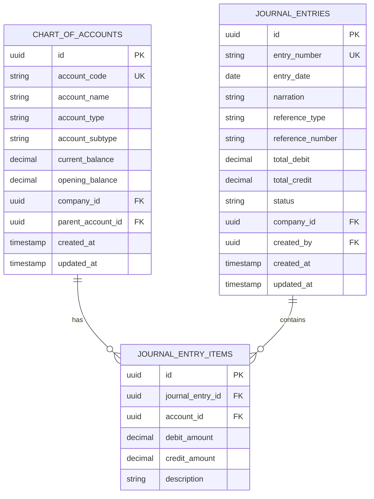
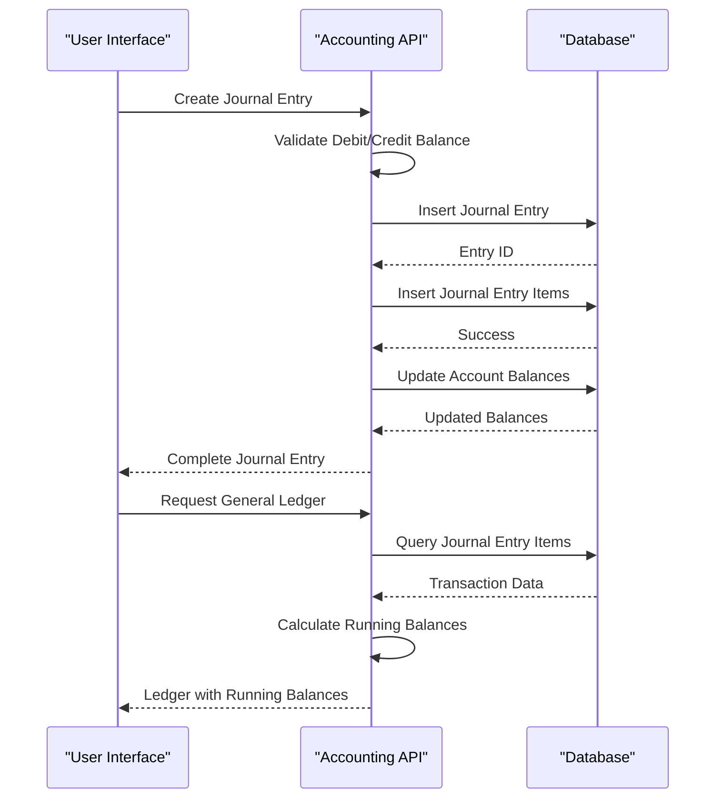
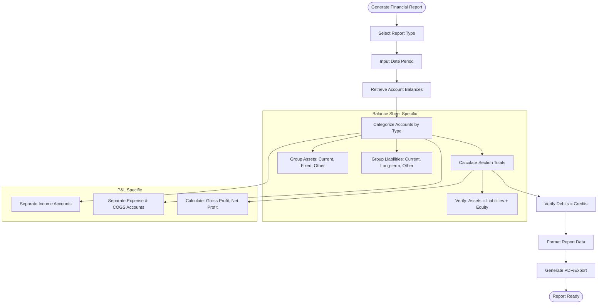
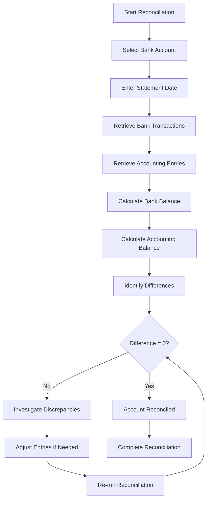

# Accounting

<cite>
**Referenced Files in This Document**   
- [accountingService.js](file://src/services/accountingService.js)
- [journal-entries/index.js](file://src/pages/api/accounting/journal-entries/index.js)
- [balance-sheet.js](file://src/pages/api/accounting/reports/balance-sheet.js)
- [profit-loss.js](file://src/pages/api/accounting/reports/profit-loss.js)
- [trial-balance.js](file://src/pages/api/accounting/ledger/trial-balance.js)
- [chart-of-accounts.js](file://src/pages/api/master-data/chart-of-accounts.js)
- [BankReconciliationList.js](file://src/components/accounting/BankReconciliationList.js)
- [GeneralLedgerList.js](file://src/components/accounting/GeneralLedgerList.js)
- [JournalList.js](file://src/components/accounting/JournalList.js)
- [BalanceSheet.js](file://src/components/accounting/BalanceSheet.js)
- [ProfitLoss.js](file://src/components/accounting/ProfitLoss.js)
- [CashFlowStatement.js](file://src/components/accounting/CashFlowStatement.js)
- [TrialBalanceList.js](file://src/components/accounting/TrialBalanceList.js)
</cite>

## Table of Contents
1. [Introduction](#introduction)
2. [Double-Entry Accounting Implementation](#double-entry-accounting-implementation)
3. [Chart of Accounts Data Model](#chart-of-accounts-data-model)
4. [Journal Entries and General Ledger](#journal-entries-and-general-ledger)
5. [Trial Balance and Financial Statements](#trial-balance-and-financial-statements)
6. [Automated Accounting Entries](#automated-accounting-entries)
7. [Bank Reconciliation Process](#bank-reconciliation-process)
8. [Common Accounting Issues](#common-accounting-issues)
9. [Performance Optimization](#performance-optimization)

## Introduction
The ezbillify-v1 accounting system implements a comprehensive double-entry accounting framework that manages financial transactions, generates financial statements, and ensures accurate bookkeeping. The system follows standard accounting principles with journal entries, general ledger, trial balance, and financial reporting capabilities. This documentation explains the implementation details, data models, and operational workflows for the accounting module.

## Double-Entry Accounting Implementation
The accounting system in ezbillify-v1 follows the double-entry accounting principle where every financial transaction affects at least two accounts with equal debit and credit amounts. The system ensures that all journal entries maintain balance between debits and credits, which is validated during entry creation.

When a journal entry is created, the system automatically verifies that the total debit amount equals the total credit amount within a small tolerance (0.01) to account for rounding differences. This validation occurs in the API endpoint before persisting the entry to the database. If the amounts don't balance, the system rejects the entry with an appropriate error message.

The accounting service provides methods to create and manage journal entries, with automatic updating of account balances in the chart of accounts. Each journal entry item references a specific account and includes either a debit or credit amount (or both, though typically one is zero). The system maintains running balances for all accounts and provides methods to retrieve account ledgers with running balances calculated chronologically.

**Section sources**
- [accountingService.js](file://src/services/accountingService.js#L5-L46)
- [journal-entries/index.js](file://src/pages/api/accounting/journal-entries/index.js#L110-L119)

## Chart of Accounts Data Model
The chart of accounts serves as the foundation of the accounting system, organizing all financial accounts into a structured hierarchy. Each account is classified by type and subtype, enabling proper financial reporting and statement generation.

The data model includes the following account types:
- **Asset**: Resources owned by the business
- **Liability**: Obligations owed to others
- **Equity**: Owner's interest in the business
- **Income**: Revenue generated from operations
- **Expense**: Costs incurred in business operations
- **COGS**: Cost of goods sold

Each account has a unique code, name, and current balance. The system supports hierarchical account structures through parent-child relationships, allowing for detailed financial categorization. Account subtypes further classify accounts for reporting purposes, such as current vs. fixed assets or current vs. long-term liabilities.

The chart of accounts API provides endpoints to retrieve all accounts for a company, which are used by various accounting reports and components to ensure consistency in financial data presentation.

**Diagram sources **
- [chart-of-accounts.js](file://src/pages/api/master-data/chart-of-accounts.js#L26-L37)
- [journal-entries/index.js](file://src/pages/api/accounting/journal-entries/index.js#L126-L141)

**Section sources**
- [chart-of-accounts.js](file://src/pages/api/master-data/chart-of-accounts.js#L26-L37)
- [AccountList.js](file://src/components/master-data/AccountList.js#L44-L51)

## Journal Entries and General Ledger
The journal entry system serves as the primary mechanism for recording financial transactions in the accounting system. Users can create journal entries through the UI or via API, specifying multiple line items that debit and credit various accounts.

The JournalList component provides a user interface for viewing, filtering, and managing journal entries. Users can search entries by date range, status, or keyword, and perform actions like viewing details, editing draft entries, or deleting entries. The component integrates with the accounting API to fetch and display journal entry data with proper formatting and pagination.

The General Ledger provides a detailed view of transactions for individual accounts, showing the running balance after each transaction. The GeneralLedgerList component allows users to select an account and date range to view its transaction history. For each entry, the ledger displays the date, journal entry number, description, debit amount, credit amount, and running balance.

When journal entries are posted, the system automatically updates the current balance of affected accounts in the chart of accounts. The ledger data is derived from journal entry items, with running balances calculated chronologically. This ensures that the general ledger always reflects the most current account balances based on all posted transactions.

**Diagram sources **
- [journal-entries/index.js](file://src/pages/api/accounting/journal-entries/index.js#L126-L191)
- [GeneralLedgerList.js](file://src/components/accounting/GeneralLedgerList.js#L60-L65)

**Section sources**
- [JournalList.js](file://src/components/accounting/JournalList.js#L58-L80)
- [GeneralLedgerList.js](file://src/components/accounting/GeneralLedgerList.js#L47-L67)

## Trial Balance and Financial Statements
The accounting system generates key financial reports including the trial balance, balance sheet, profit and loss statement, and cash flow statement. These reports are essential for financial analysis, auditing, and regulatory compliance.

The trial balance report lists all accounts with their debit and credit balances, ensuring that total debits equal total credits. The system determines whether an account balance should be shown as debit or credit based on the account type: asset, expense, and COGS accounts normally have debit balances, while liability, equity, and income accounts normally have credit balances.

The balance sheet follows the fundamental accounting equation: Assets = Liabilities + Equity. The system categorizes accounts into current and fixed assets, current and long-term liabilities, and equity components. The report verifies that the balance sheet balances by checking that total assets equal the sum of liabilities and equity.

The profit and loss statement (income statement) calculates net profit by subtracting expenses and COGS from income. The system retrieves account balances for income, expense, and COGS accounts within a specified date range, calculating period-specific balances based on journal entries posted during that period.

The cash flow statement categorizes cash movements into operating, investing, and financing activities, providing insight into the business's liquidity and cash management.

**Diagram sources **
- [trial-balance.js](file://src/pages/api/accounting/ledger/trial-balance.js#L24-L73)
- [balance-sheet.js](file://src/pages/api/accounting/reports/balance-sheet.js#L25-L58)
- [profit-loss.js](file://src/pages/api/accounting/reports/profit-loss.js#L24-L145)

**Section sources**
- [TrialBalanceList.js](file://src/components/accounting/TrialBalanceList.js)
- [BalanceSheet.js](file://src/components/accounting/BalanceSheet.js)
- [ProfitLoss.js](file://src/components/accounting/ProfitLoss.js)

## Automated Accounting Entries
The system automates accounting entries for sales and purchase transactions, reducing manual data entry and minimizing errors. When sales invoices or purchase bills are created, the system automatically generates corresponding journal entries based on predefined accounting rules.

For sales transactions, the system typically creates entries that debit accounts receivable (or cash if paid immediately) and credit sales revenue, while also recording the cost of goods sold by debiting COGS and crediting inventory. For purchase transactions, the system debits inventory or expense accounts and credits accounts payable (or cash if paid immediately).

The accounting service includes methods to handle month-end closing procedures, automatically creating closing entries for temporary accounts (income and expense accounts). These entries transfer the balances of income and expense accounts to retained earnings or profit and loss summary accounts, preparing the books for the next accounting period.

Automation ensures consistency in accounting practices and reduces the time required for bookkeeping. The system validates all automated entries using the same rules as manual entries, ensuring that debits equal credits and that all required fields are populated.

**Section sources**
- [accountingService.js](file://src/services/accountingService.js#L270-L297)
- [journal-entries/index.js](file://src/pages/api/accounting/journal-entries/index.js#L123-L124)

## Bank Reconciliation Process
The bank reconciliation feature enables users to reconcile their accounting records with actual bank statements. This process identifies discrepancies between the company's cash records and bank statements, helping to detect errors, fraud, or timing differences.

The BankReconciliationList component provides a user interface for selecting a bank account and statement date, then comparing bank transactions with accounting entries. The system displays both bank transactions and accounting entries up to the statement date, allowing users to identify uncleared checks, deposits in transit, bank fees, or errors.

The reconciliation report shows the bank balance, accounting balance, and the difference between them. It categorizes transactions as either on the bank statement only, in the accounting records only, or cleared (present in both). When the difference is zero, the account is considered reconciled.

The system calculates the accounting balance by starting with the account's opening balance and adding all debit and credit entries up to the statement date. This is compared with the ending balance from the bank statement to identify any discrepancies that need investigation.

**Diagram sources **
- [reconciliation/index.js](file://src/pages/api/accounting/reconciliation/index.js#L46-L94)
- [BankReconciliationList.js](file://src/components/accounting/BankReconciliationList.js#L47-L66)

**Section sources**
- [BankReconciliationList.js](file://src/components/accounting/BankReconciliationList.js#L13-L39)

## Common Accounting Issues
The system addresses several common accounting issues that businesses encounter during financial management.

**Ledger imbalances** occur when total debits do not equal total credits in the trial balance. The system prevents most imbalances by validating journal entries at creation time. However, imbalances can still occur due to data corruption, manual database changes, or bugs in automated entry generation. The trial balance report highlights these imbalances by showing the difference between total debits and credits.

**Period closing errors** can happen when month-end closing procedures are not performed correctly or are performed twice. The system mitigates this by tracking closing entries and preventing duplicate closing for the same period. The month-end closing process in the accounting service creates a closing journal entry and records the net profit, which can be audited later.

**Financial statement discrepancies** may arise when reports show inconsistent data. This can be caused by transactions dated in the wrong period, accounts classified incorrectly, or timing differences between cash and accrual accounting. The system ensures consistency by using the same underlying data for all reports and applying date filters uniformly.

The audit trail feature helps diagnose these issues by tracking all changes to accounting records, including who made the change and when. This enables forensic analysis of accounting problems and supports compliance with financial regulations.

**Section sources**
- [accountingService.js](file://src/services/accountingService.js#L241-L268)
- [trial-balance.js](file://src/pages/api/accounting/ledger/trial-balance.js#L75-L87)

## Performance Optimization
For accounting operations with large transaction volumes, several performance optimization strategies are implemented.

The system uses database indexing on key fields such as company_id, entry_date, and account_id to speed up queries. When retrieving journal entries or ledger data, the API applies pagination to limit the amount of data transferred in a single request, improving response times and reducing memory usage.

For financial reports that require aggregating large amounts of data, the system could implement caching mechanisms to store frequently accessed reports. While not explicitly shown in the current code, adding a caching layer for trial balance and financial statements would significantly improve performance for large datasets.

Database queries are optimized to retrieve only the necessary fields rather than using SELECT *. The system uses efficient joins and filtering at the database level rather than in application code. For example, when generating a trial balance, the system retrieves all accounts in a single query rather than making multiple database calls.

For very large datasets, the system could implement summary tables that store pre-calculated balances at various levels of aggregation, reducing the need to recalculate balances from raw transaction data for every report request.

**Section sources**
- [journal-entries/index.js](file://src/pages/api/accounting/journal-entries/index.js#L73-L76)
- [accountingService.js](file://src/services/accountingService.js#L19-L43)