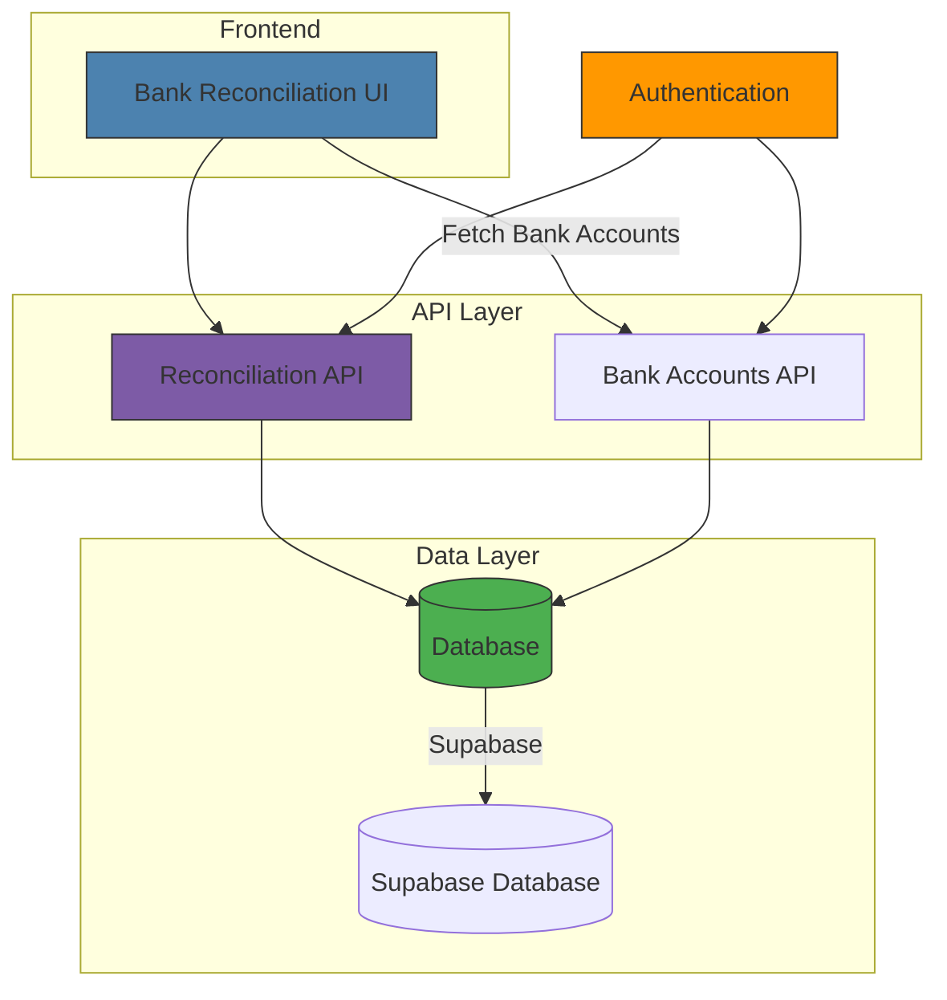
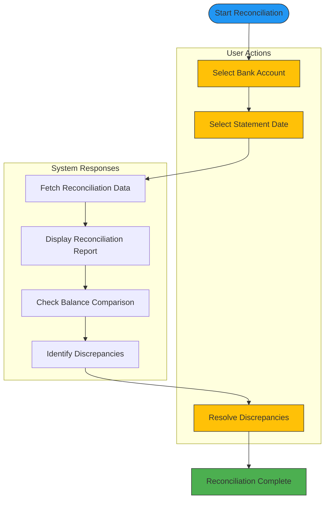
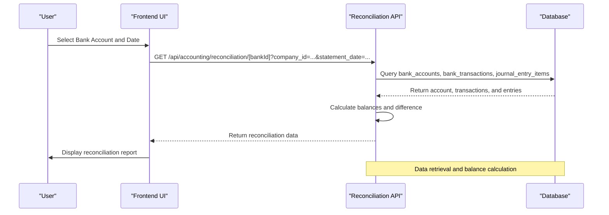
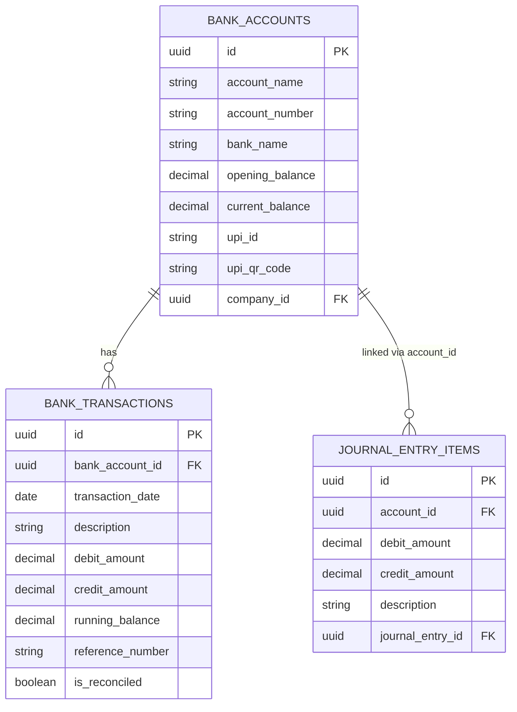

# Bank Reconciliation

<cite>
**Referenced Files in This Document**   
- [BankReconciliationList.js](file://src/components/accounting/BankReconciliationList.js)
- [bank-reconciliation.js](file://src/pages/accounting/bank-reconciliation.js)
- [reconciliation/[bankId].js](file://src/pages/api/accounting/reconciliation/[bankId].js)
- [reconciliation/index.js](file://src/pages/api/accounting/reconciliation/index.js)
- [bank-accounts.js](file://src/pages/api/accounting/bank-accounts.js)
- [constants.js](file://src/lib/constants.js)
- [accountingService.js](file://src/services/accountingService.js)
- [20241105_add_upi_fields_to_bank_accounts.sql](file://database/migrations/20241105_add_upi_fields_to_bank_accounts.sql)
</cite>

## Table of Contents
1. [Introduction](#introduction)
2. [Purpose of Bank Reconciliation](#purpose-of-bank-reconciliation)
3. [System Architecture](#system-architecture)
4. [User Interface and Workflow](#user-interface-and-workflow)
5. [API Structure](#api-structure)
6. [Data Model and Database Schema](#data-model-and-database-schema)
7. [Relationship with Chart of Accounts](#relationship-with-chart-of-accounts)
8. [Common Reconciliation Issues](#common-reconciliation-issues)
9. [Best Practices](#best-practices)
10. [Conclusion](#conclusion)

## Introduction

The bank reconciliation system in ezbillify-v1 provides a comprehensive solution for ensuring the accuracy of cash records by comparing internal accounting records with bank statement data. This document details the implementation of the reconciliation process, including user interface components, API endpoints, data models, and business logic that enable users to import bank statements, match transactions, identify discrepancies, and maintain accurate financial records.

The system is designed to help businesses resolve common accounting discrepancies such as timing differences, bank fees, interest income, and outstanding checks, ensuring that their financial records accurately reflect their actual bank balances.

**Section sources**
- [BankReconciliationList.js](file://src/components/accounting/BankReconciliationList.js#L1-L350)
- [bank-reconciliation.js](file://src/pages/accounting/bank-reconciliation.js#L1-L49)

## Purpose of Bank Reconciliation

Bank reconciliation serves as a critical financial control process that ensures the accuracy and integrity of a company's cash records. By systematically comparing internal accounting records with external bank statements, organizations can verify that all transactions are properly recorded and accounted for in their books.

The primary purposes of bank reconciliation in ezbillify-v1 include:
- Verifying the accuracy of cash balances in the accounting system against actual bank balances
- Identifying and resolving discrepancies between internal records and bank statements
- Detecting potential errors, omissions, or fraudulent activities
- Ensuring complete and accurate financial reporting
- Maintaining proper internal controls over cash transactions

Regular bank reconciliation helps businesses maintain confidence in their financial data, which is essential for making informed business decisions, preparing accurate financial statements, and meeting regulatory requirements.

## System Architecture

The bank reconciliation system in ezbillify-v1 follows a clean separation of concerns between frontend components, API endpoints, and backend services. The architecture enables seamless data flow from the user interface through API layers to the database, with proper authentication and error handling at each level.

**Diagram sources**
- [BankReconciliationList.js](file://src/components/accounting/BankReconciliationList.js#L1-L350)
- [reconciliation/[bankId].js](file://src/pages/api/accounting/reconciliation/[bankId].js#L1-L123)
- [bank-accounts.js](file://src/pages/api/accounting/bank-accounts.js#L1-L55)

**Section sources**
- [BankReconciliationList.js](file://src/components/accounting/BankReconciliationList.js#L1-L350)
- [reconciliation/[bankId].js](file://src/pages/api/accounting/reconciliation/[bankId].js#L1-L123)
- [bank-accounts.js](file://src/pages/api/accounting/bank-accounts.js#L1-L55)

## User Interface and Workflow

The BankReconciliationList component provides users with an intuitive interface for performing bank reconciliation tasks. The workflow begins with selecting a bank account and statement date, followed by generating the reconciliation report that displays both bank transactions and corresponding accounting entries.

Key features of the user interface include:
- Dropdown selection for choosing from available bank accounts
- Date picker for specifying the statement date
- Real-time balance comparison showing bank balance, accounting balance, and difference
- Side-by-side display of bank transactions and accounting entries
- Visual indicators for reconciliation status (reconciled vs. not reconciled)
- Export functionality for saving reconciliation reports

The component fetches bank account data on initialization and retrieves reconciliation data when the user selects an account and date. The reconciliation report displays the account summary, balance comparison, and detailed transaction lists, allowing users to easily identify discrepancies between bank records and accounting entries.

**Diagram sources**
- [BankReconciliationList.js](file://src/components/accounting/BankReconciliationList.js#L1-L350)

**Section sources**
- [BankReconciliationList.js](file://src/components/accounting/BankReconciliationList.js#L1-L350)

## API Structure

The bank reconciliation system exposes RESTful API endpoints that handle data retrieval for reconciliation reports and bank account information. These endpoints follow a consistent pattern with proper authentication, input validation, and error handling.

The primary API endpoints include:

### Reconciliation Endpoints

| Endpoint | Method | Parameters | Response | Purpose |
|---------|--------|-----------|----------|---------|
| `/api/accounting/reconciliation/[bankId]` | GET | company_id, statement_date | Reconciliation data with bank transactions, accounting entries, and balances | Retrieve reconciliation data for a specific bank account |
| `/api/accounting/reconciliation` | GET | company_id, bank_account_id, statement_date | Reconciliation data with bank transactions, accounting entries, and balances | Alternative endpoint for retrieving reconciliation data |

### Bank Accounts Endpoint

| Endpoint | Method | Parameters | Response | Purpose |
|---------|--------|-----------|----------|---------|
| `/api/accounting/bank-accounts` | GET | company_id | List of bank accounts with details | Retrieve all bank accounts for a company |

The API endpoints validate required parameters (company ID, bank account ID, and statement date), authenticate requests, and return structured JSON responses containing reconciliation data. Error handling includes validation errors for missing parameters and server errors with appropriate HTTP status codes.

**Diagram sources**
- [reconciliation/[bankId].js](file://src/pages/api/accounting/reconciliation/[bankId].js#L1-L123)
- [reconciliation/index.js](file://src/pages/api/accounting/reconciliation/index.js#L1-L119)
- [bank-accounts.js](file://src/pages/api/accounting/bank-accounts.js#L1-L55)

**Section sources**
- [reconciliation/[bankId].js](file://src/pages/api/accounting/reconciliation/[bankId].js#L1-L123)
- [reconciliation/index.js](file://src/pages/api/accounting/reconciliation/index.js#L1-L119)
- [bank-accounts.js](file://src/pages/api/accounting/bank-accounts.js#L1-L55)

## Data Model and Database Schema

The bank reconciliation system relies on a well-structured data model that integrates with the existing accounting system. The database schema includes tables for bank accounts, bank transactions, and journal entries that are linked through account identifiers.

Key database entities include:

### Bank Accounts Table
- Stores information about company bank accounts
- Fields: id, account_name, account_number, bank_name, opening_balance, current_balance, upi_id, upi_qr_code
- The UPI fields were added to support UPI payments in India

### Bank Transactions Table
- Records individual transactions from bank statements
- Fields: id, bank_account_id, transaction_date, description, debit_amount, credit_amount, running_balance, reference_number, is_reconciled
- Linked to bank_accounts via bank_account_id foreign key

### Journal Entry Items Table
- Contains accounting entries that affect bank accounts
- Fields: id, account_id, debit_amount, credit_amount, description, journal_entry_id
- Linked to journal_entries and accounts tables

The reconciliation process compares transactions in the bank_transactions table with entries in the journal_entry_items table for the same bank account, calculating the difference between the final running balance in the bank statement and the calculated accounting balance.

**Diagram sources**
- [20241105_add_upi_fields_to_bank_accounts.sql](file://database/migrations/20241105_add_upi_fields_to_bank_accounts.sql#L1-L28)
- [reconciliation/[bankId].js](file://src/pages/api/accounting/reconciliation/[bankId].js#L1-L123)

**Section sources**
- [20241105_add_upi_fields_to_bank_accounts.sql](file://database/migrations/20241105_add_upi_fields_to_bank_accounts.sql#L1-L28)
- [reconciliation/[bankId].js](file://src/pages/api/accounting/reconciliation/[bankId].js#L1-L123)

## Relationship with Chart of Accounts

The bank reconciliation module is tightly integrated with the chart of accounts system in ezbillify-v1. Each bank account in the system corresponds to a specific account in the chart of accounts, creating a direct link between banking data and accounting records.

When a bank account is created in the system, it is associated with a general ledger account that tracks the same financial instrument. This relationship enables the reconciliation process to compare bank statement transactions with journal entries posted to the corresponding ledger account.

The integration works as follows:
- Bank accounts are created as part of the master data management system
- Each bank account is linked to a specific account in the chart of accounts
- Transactions affecting the bank account are recorded in both the bank transactions table and as journal entries in the accounting system
- The reconciliation process matches transactions from the bank statement with journal entries posted to the linked account

This tight integration ensures that all cash movements are consistently recorded in both the banking and accounting systems, providing a reliable foundation for the reconciliation process.

**Section sources**
- [BankReconciliationList.js](file://src/components/accounting/BankReconciliationList.js#L1-L350)
- [reconciliation/[bankId].js](file://src/pages/api/accounting/reconciliation/[bankId].js#L1-L123)

## Common Reconciliation Issues

The bank reconciliation system in ezbillify-v1 is designed to help users identify and resolve common discrepancies between bank statements and accounting records. These issues include:

### Timing Differences
- Deposits in transit: Cash or checks received by the company but not yet credited by the bank
- Outstanding checks: Checks issued by the company but not yet cleared by the bank
- Electronic transfers processed by the bank on different dates than recorded in accounting

### Bank Fees and Charges
- Service charges deducted by the bank but not yet recorded in the accounting system
- Overdraft fees, account maintenance fees, or transaction fees
- Interest charges on overdrafts or loans

### Interest Income
- Interest earned on bank balances that has been credited by the bank but not yet recorded in accounting
- Dividends or other investment income credited to the bank account

### Errors
- Data entry errors in either the accounting system or bank records
- Duplicate transactions recorded in either system
- Transactions recorded in the wrong account

The reconciliation interface helps users identify these issues by displaying the difference between bank and accounting balances and providing detailed transaction lists for comparison. Users can then investigate discrepancies and make necessary adjustments to ensure both records are accurate and in agreement.

**Section sources**
- [BankReconciliationList.js](file://src/components/accounting/BankReconciliationList.js#L1-L350)
- [reconciliation/[bankId].js](file://src/pages/api/accounting/reconciliation/[bankId].js#L1-L123)

## Best Practices

To ensure effective and efficient bank reconciliation in ezbillify-v1, users should follow these best practices:

### Regular Reconciliation Schedule
- Perform reconciliation at least monthly, preferably at the end of each accounting period
- Establish a consistent schedule to prevent backlog of unreconciled transactions
- Reconcile more frequently for accounts with high transaction volumes

### Complete Documentation
- Maintain copies of bank statements and supporting documentation
- Keep records of reconciliation reports and adjustments made
- Document explanations for significant discrepancies

### Verification Procedures
- Verify the accuracy of opening balances before starting reconciliation
- Confirm that all transactions are properly categorized in the accounting system
- Double-check mathematical calculations for running balances

### Internal Controls
- Separate duties between individuals responsible for recording transactions and performing reconciliation
- Implement approval processes for adjustments to accounting records
- Conduct periodic reviews of reconciliation procedures

### System Utilization
- Use the export functionality to maintain backup copies of reconciliation reports
- Leverage the side-by-side transaction display to efficiently match entries
- Monitor reconciliation status regularly through the dashboard

Following these best practices will help ensure the accuracy and integrity of financial records, support effective cash management, and provide confidence in financial reporting.

**Section sources**
- [BankReconciliationList.js](file://src/components/accounting/BankReconciliationList.js#L1-L350)
- [reconciliation/[bankId].js](file://src/pages/api/accounting/reconciliation/[bankId].js#L1-L123)

## Conclusion

The bank reconciliation system in ezbillify-v1 provides a comprehensive solution for maintaining accurate cash records through systematic comparison of bank statements with accounting entries. The system's user-friendly interface, robust API structure, and tight integration with the chart of accounts enable businesses to efficiently identify and resolve discrepancies, ensuring the integrity of their financial data.

By following the documented workflows and best practices, users can maintain accurate financial records, detect potential errors or fraud, and produce reliable financial statements. The system's design supports regular reconciliation activities, helping organizations maintain strong internal controls over their cash assets and meet regulatory requirements.

The implementation demonstrates a well-structured approach to bank reconciliation, with clear separation of concerns between frontend components, API endpoints, and data models. This architecture ensures maintainability, scalability, and reliability of the reconciliation process within the broader accounting system.