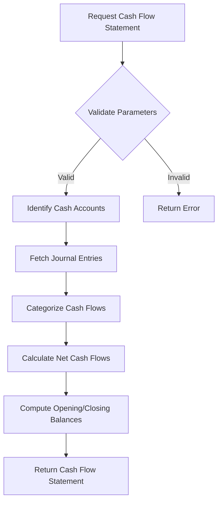
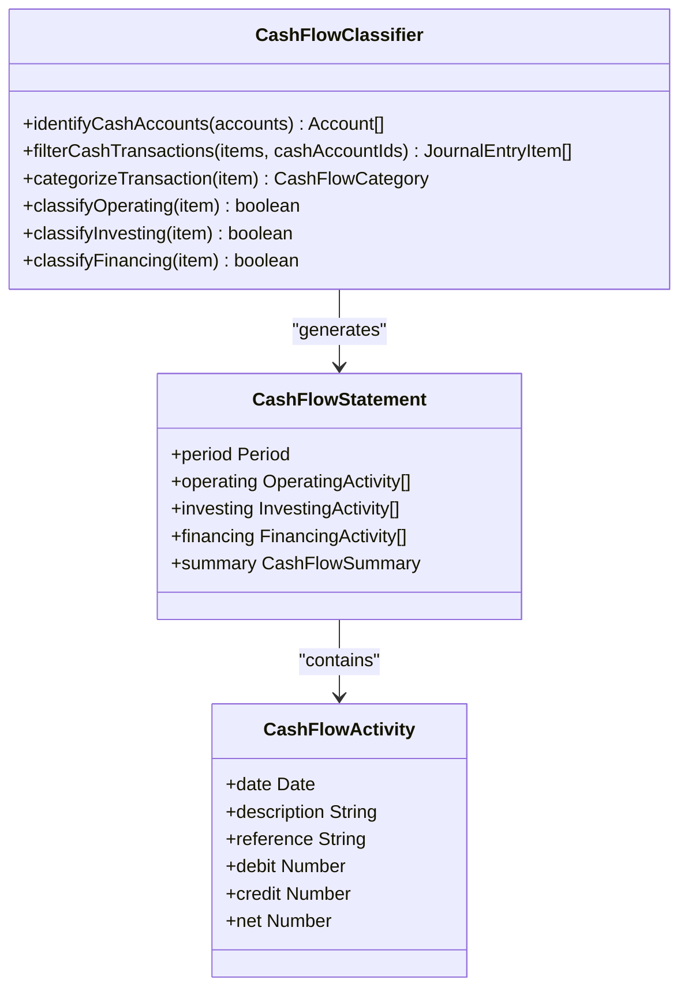
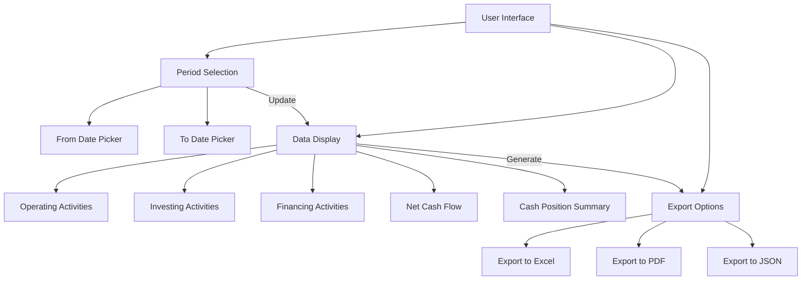
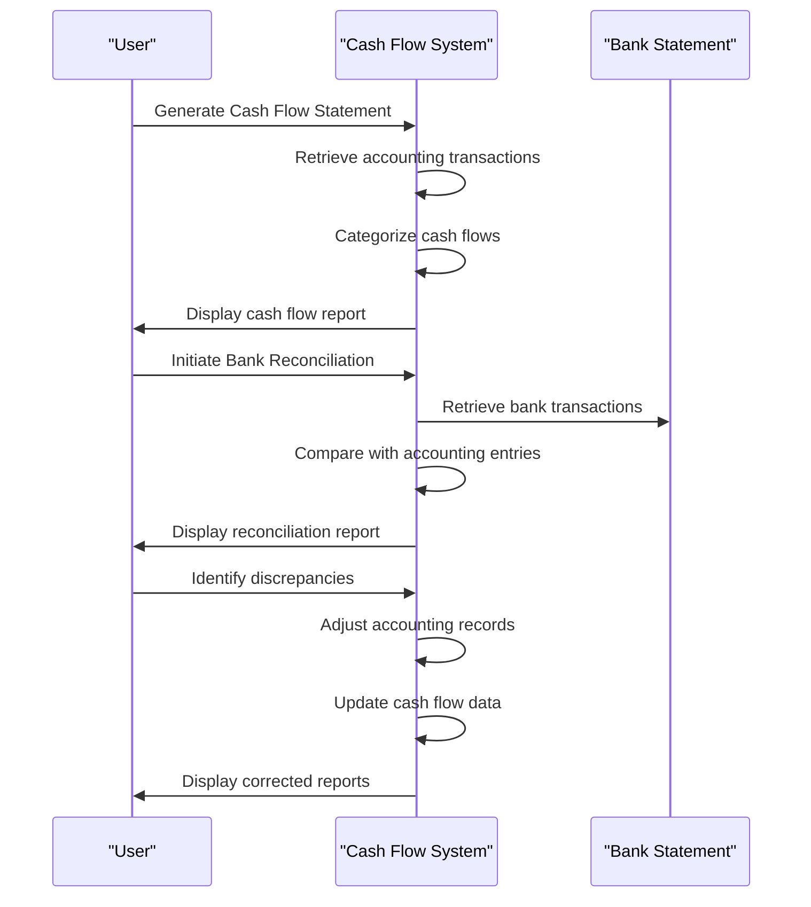

# Cash Flow Management

<cite>
**Referenced Files in This Document**   
- [CashFlowStatement.js](file://src/components/accounting/CashFlowStatement.js)
- [cash-flow.js](file://src/pages/api/accounting/reports/cash-flow.js)
- [test-cashflow.js](file://src/pages/api/accounting/reports/test-cashflow.js)
- [accountingService.js](file://src/services/accountingService.js)
- [BankReconciliationList.js](file://src/components/accounting/BankReconciliationList.js)
- [constants.js](file://src/lib/constants.js)
</cite>

## Table of Contents
1. [Introduction](#introduction)
2. [Cash Flow Statement Implementation](#cash-flow-statement-implementation)
3. [Data Derivation and Classification](#data-derivation-and-classification)
4. [User Interface and Visualization](#user-interface-and-visualization)
5. [Direct and Indirect Methods](#direct-and-indirect-methods)
6. [Bank Reconciliation Integration](#bank-reconciliation-integration)
7. [Common Issues and Challenges](#common-issues-and-challenges)
8. [Business Planning and Decision-Making](#business-planning-and-decision-making)
9. [Conclusion](#conclusion)

## Introduction

The cash flow management system in ezbillify-v1 provides comprehensive tracking and reporting of cash movements across operating, investing, and financing activities. This system enables businesses to monitor liquidity, analyze cash flow trends, and make informed financial decisions. The implementation leverages transaction records from the accounting system to generate accurate cash flow statements that comply with standard financial reporting practices.

The system is designed to handle the complexities of cash flow accounting, including the timing differences between accrual accounting and actual cash movements. It provides users with tools to analyze cash flow patterns, identify potential liquidity issues, and forecast future cash positions. The integration with bank reconciliation data ensures that reported cash flows align with actual bank balances, enhancing the reliability of financial reporting.

**Section sources**
- [CashFlowStatement.js](file://src/components/accounting/CashFlowStatement.js#L1-L301)
- [cash-flow.js](file://src/pages/api/accounting/reports/cash-flow.js#L1-L271)

## Cash Flow Statement Implementation

The cash flow statement implementation in ezbillify-v1 follows the standard three-activity classification: operating, investing, and financing activities. The system generates cash flow statements by analyzing journal entries that affect cash and bank accounts, categorizing each transaction based on its nature and purpose.

The backend API endpoint at `/api/accounting/reports/cash-flow` serves as the primary interface for cash flow data retrieval. This endpoint requires parameters including company ID, start date, and end date to generate period-specific cash flow statements. The implementation first identifies all cash and bank accounts from the chart of accounts, then retrieves journal entries within the specified date range that impact these accounts.

The system calculates key metrics including net cash flow from operating activities, net cash flow from investing activities, and net cash flow from financing activities. It also computes the opening and closing cash balances, providing a complete picture of cash movement during the reporting period. The API returns a structured response containing detailed transaction information for each activity category along with summary totals.

**Diagram sources**
- [cash-flow.js](file://src/pages/api/accounting/reports/cash-flow.js#L1-L271)

**Section sources**
- [cash-flow.js](file://src/pages/api/accounting/reports/cash-flow.js#L1-L271)
- [accountingService.js](file://src/services/accountingService.js#L116-L140)

## Data Derivation and Classification

Cash flow data in ezbillify-v1 is derived from transaction records in the accounting system, specifically from journal entries that affect cash and bank accounts. The system identifies cash accounts by filtering the chart of accounts for asset accounts with subtypes of "cash" or "bank." All journal entry items posted to these accounts are considered cash transactions and included in the cash flow analysis.

The classification of cash flows into operating, investing, and financing activities is performed using a combination of reference type and narration analysis. Transactions with reference types or narrations containing keywords related to sales, purchases, invoices, receipts, payments, salaries, rent, or utilities are categorized as operating activities. This represents the core business operations that generate revenue and incur expenses.

Investing activities are identified by reference types or narrations containing keywords such as "asset," "equipment," "investment," or "purchase of" followed by a capital asset. These transactions typically involve the acquisition or disposal of long-term assets. Financing activities are detected through keywords like "loan," "capital," "dividend," "equity," or "borrowing," representing transactions with owners and creditors that affect the company's capital structure.

For transactions that don't clearly match specific categories, the system defaults to classifying them as operating activities, as most cash flows in a typical business relate to core operations. This approach ensures comprehensive coverage while maintaining reasonable accuracy in classification.

**Diagram sources**
- [cash-flow.js](file://src/pages/api/accounting/reports/cash-flow.js#L43-L205)
- [constants.js](file://src/lib/constants.js#L51-L61)

**Section sources**
- [cash-flow.js](file://src/pages/api/accounting/reports/cash-flow.js#L43-L205)
- [constants.js](file://src/lib/constants.js#L51-L61)

## User Interface and Visualization

The CashFlowStatement component provides a user-friendly interface for viewing and analyzing cash flow data. The component displays cash flow information in a structured format, organized by activity type with clear visual indicators for positive and negative cash flows. Users can select custom date ranges to analyze cash flow trends over specific periods, with default settings showing data from the beginning of the current year to the present date.

The interface presents operating, investing, and financing activities in separate sections, each showing individual transactions with their dates, descriptions, and reference numbers. Net totals for each category are prominently displayed, allowing users to quickly assess the overall cash flow performance in each area. The component also shows the net increase or decrease in cash, along with opening and closing cash balances, providing a complete picture of cash movement during the period.

Users can export cash flow statements in multiple formats including Excel, PDF, and JSON, facilitating further analysis and reporting. The export functionality preserves all data and formatting, ensuring that exported documents maintain the same structure and appearance as the on-screen display. The interface includes refresh capabilities to ensure users have access to the most current data.

The visualization emphasizes liquidity analysis by highlighting cash position changes and enabling trend analysis over time. Color coding (green for positive values, red for negative values) helps users quickly identify areas of cash generation and consumption. This visual approach supports rapid assessment of financial health and identification of potential liquidity issues.

**Diagram sources**
- [CashFlowStatement.js](file://src/components/accounting/CashFlowStatement.js#L1-L301)

**Section sources**
- [CashFlowStatement.js](file://src/components/accounting/CashFlowStatement.js#L1-L301)

## Direct and Indirect Methods

The ezbillify-v1 cash flow management system supports both direct and indirect methods for cash flow calculation, though the current implementation primarily follows the direct method approach. The direct method, which is reflected in the system's design, involves reporting major classes of gross cash receipts and payments. This approach provides detailed information about actual cash inflows and outflows from operating activities, offering greater transparency into the sources and uses of cash.

In the direct method implementation, the system identifies and categorizes individual cash transactions based on their nature, as evidenced by the detailed transaction listing in the cash flow statement. Each operating activity transaction is presented with its specific description and amount, showing exactly how cash was received or disbursed. This level of detail enables users to analyze specific cash flow drivers and identify patterns in customer payments, supplier payments, and other operational cash movements.

The indirect method, while not explicitly implemented as a separate option, is conceptually supported through the system's integration with accrual accounting data. The indirect method typically starts with net income and adjusts for non-cash items and changes in working capital. While the current API response doesn't provide this specific calculation path, the underlying data structure could support such an implementation by incorporating net income figures and working capital changes from the profit and loss statement and balance sheet.

The choice of the direct method aligns with best practices for cash flow reporting, as it provides more useful information for assessing a company's cash flow prospects. It allows users to see the actual cash collected from customers and paid to suppliers, rather than relying on accrual-based revenue and expense figures that may not reflect actual cash movements. This direct approach enhances the system's utility for liquidity analysis and cash flow forecasting.

**Section sources**
- [cash-flow.js](file://src/pages/api/accounting/reports/cash-flow.js#L167-L205)
- [accountingService.js](file://src/services/accountingService.js#L86-L114)

## Bank Reconciliation Integration

The cash flow management system in ezbillify-v1 maintains a close relationship with bank reconciliation data, ensuring that reported cash flows align with actual bank balances. The BankReconciliationList component provides a parallel system for verifying the accuracy of cash accounting records against bank statements. This integration is critical for maintaining the integrity of cash flow reporting and identifying timing differences between accounting records and bank transactions.

The bank reconciliation process compares transactions recorded in the accounting system with those appearing on bank statements, identifying discrepancies and outstanding items. This process helps validate the completeness and accuracy of cash flow data by ensuring that all bank transactions have been properly recorded in the accounting system. The reconciliation interface displays both bank transactions and corresponding accounting entries side by side, enabling users to match items and identify any missing or erroneous entries.

The relationship between cash flow statements and bank reconciliation data is particularly important for addressing timing differences that arise from the gap between when transactions are recorded in the accounting system and when they clear the bank. For example, deposits in transit and outstanding checks create temporary differences between the accounting cash balance and the bank statement balance. The reconciliation process identifies these timing differences, allowing users to adjust their cash flow analysis accordingly.

This integration enhances the reliability of cash flow reporting by providing an external verification mechanism. When the accounting records are properly reconciled with bank statements, users can have greater confidence that the cash flow statement accurately reflects actual cash movements. The system's design encourages regular reconciliation as a best practice for maintaining accurate cash flow data.

**Diagram sources**
- [BankReconciliationList.js](file://src/components/accounting/BankReconciliationList.js#L1-L350)
- [cash-flow.js](file://src/pages/api/accounting/reports/cash-flow.js#L1-L271)

**Section sources**
- [BankReconciliationList.js](file://src/components/accounting/BankReconciliationList.js#L1-L350)

## Common Issues and Challenges

The cash flow management system in ezbillify-v1 addresses several common issues and challenges in cash flow accounting. One primary challenge is the timing differences between accrual accounting and actual cash movements. The system mitigates this issue through the bank reconciliation process, which identifies and accounts for timing discrepancies such as deposits in transit and outstanding checks. This ensures that cash flow reports reflect actual cash positions rather than just accounting entries.

Classification errors represent another significant challenge in cash flow reporting. The system addresses this through its automated categorization logic based on transaction references and narrations. However, misclassification can still occur when transactions have ambiguous descriptions or when users enter inconsistent reference data. To minimize these errors, the system could benefit from enhanced validation rules and user guidance on proper transaction description practices.

Forecasting accuracy is a persistent challenge in cash flow management. While the current system provides historical cash flow analysis, it lacks explicit forecasting capabilities. Users must manually extrapolate trends from historical data to predict future cash positions. Implementing predictive analytics based on historical patterns, seasonal trends, and business cycles would enhance the system's forecasting accuracy and utility for financial planning.

Other challenges include maintaining data integrity across multiple bank accounts, handling foreign currency transactions, and ensuring timely data entry. The system's reliance on accurate and complete transaction recording means that delays or omissions in journal entry posting can compromise the timeliness and accuracy of cash flow reports. Regular reconciliation and data validation processes are essential to maintain the reliability of cash flow information.

**Section sources**
- [cash-flow.js](file://src/pages/api/accounting/reports/cash-flow.js#L167-L205)
- [BankReconciliationList.js](file://src/components/accounting/BankReconciliationList.js#L1-L350)

## Business Planning and Decision-Making

The cash flow management system in ezbillify-v1 serves as a critical tool for business planning and financial decision-making. By providing detailed insights into cash inflows and outflows, the system enables business owners and financial managers to assess liquidity, identify cash flow patterns, and make informed strategic decisions. The ability to analyze operating, investing, and financing activities separately allows for targeted assessment of different aspects of business performance.

For operational planning, the system helps identify trends in customer payments and supplier payments, enabling businesses to optimize working capital management. By analyzing the timing and volume of cash receipts from customers, businesses can improve collections processes and reduce days sales outstanding. Similarly, examining cash disbursements to suppliers helps optimize payment timing and potentially negotiate better payment terms.

In investment planning, the system provides visibility into capital expenditures and asset acquisitions, helping businesses evaluate the impact of investing activities on overall liquidity. This information supports decisions about equipment purchases, facility expansions, and other capital investments by showing how these activities affect cash reserves and financing requirements.

For financing decisions, the cash flow statement reveals patterns in debt repayment, loan proceeds, and equity injections. This information helps businesses assess their reliance on external financing and plan for future capital needs. By analyzing historical financing activities, businesses can develop more effective capital structures and determine the optimal mix of debt and equity financing.

The system also supports scenario planning and sensitivity analysis by providing a historical baseline against which future projections can be compared. Businesses can use cash flow trends to model different operational scenarios, assess the impact of potential changes, and develop contingency plans for adverse cash flow situations.

**Section sources**
- [CashFlowStatement.js](file://src/components/accounting/CashFlowStatement.js#L1-L301)
- [cash-flow.js](file://src/pages/api/accounting/reports/cash-flow.js#L1-L271)

## Conclusion

The cash flow management system in ezbillify-v1 provides a comprehensive solution for tracking, reporting, and analyzing cash movements across operating, investing, and financing activities. By leveraging transaction records from the accounting system and applying systematic classification rules, the system generates accurate cash flow statements that support effective financial management.

The implementation effectively addresses key challenges in cash flow accounting, including timing differences between accrual accounting and actual cash movements, through integration with bank reconciliation processes. The user interface provides clear visualization of cash flow trends and liquidity positions, enabling users to quickly assess financial health and identify potential issues.

While the current system focuses on historical cash flow reporting using the direct method, opportunities exist to enhance its capabilities with forecasting tools, improved classification accuracy, and additional analytical features. The foundation is well-established for supporting critical business planning and financial decision-making processes, helping businesses maintain healthy cash positions and achieve long-term financial stability.