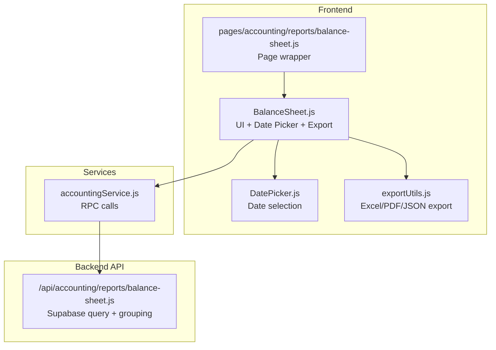
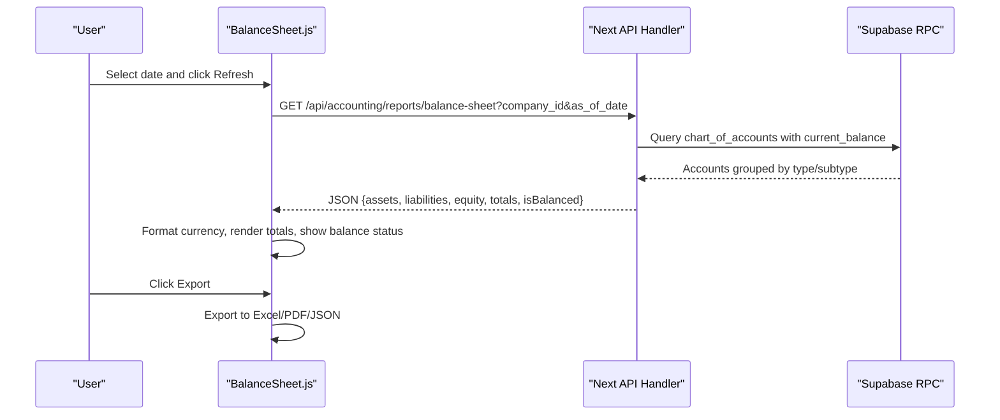
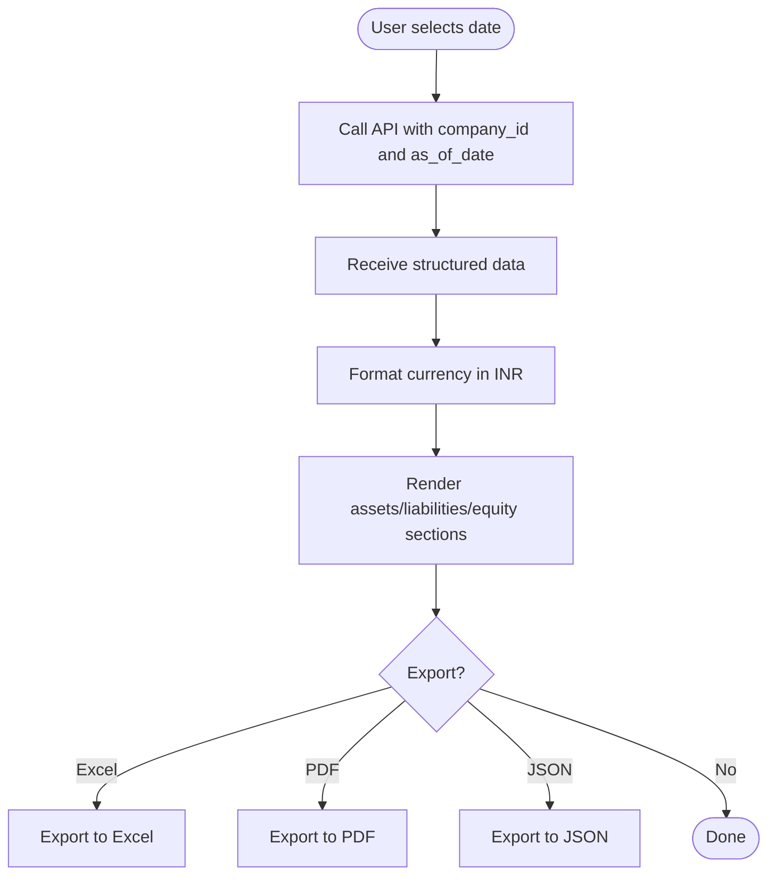
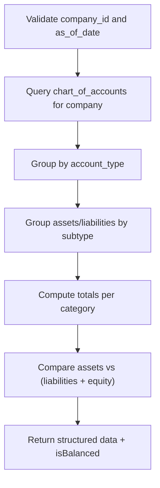
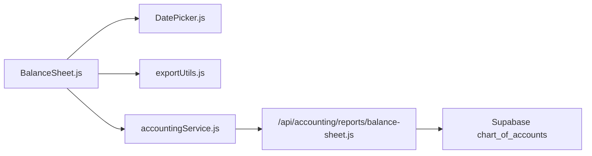

# Balance Sheet

<cite>
**Referenced Files in This Document**
- [BalanceSheet.js](file://src/components/accounting/BalanceSheet.js)
- [balance-sheet.js](file://src/pages/accounting/reports/balance-sheet.js)
- [accountingService.js](file://src/services/accountingService.js)
- [balance-sheet.js](file://src/pages/api/accounting/reports/balance-sheet.js)
- [DatePicker.js](file://src/components/shared/calendar/DatePicker.js)
- [exportUtils.js](file://src/components/shared/utils/exportUtils.js)
- [AccountForm.js](file://src/components/master-data/AccountForm.js)
</cite>

## Table of Contents
1. [Introduction](#introduction)
2. [Project Structure](#project-structure)
3. [Core Components](#core-components)
4. [Architecture Overview](#architecture-overview)
5. [Detailed Component Analysis](#detailed-component-analysis)
6. [Dependency Analysis](#dependency-analysis)
7. [Performance Considerations](#performance-considerations)
8. [Troubleshooting Guide](#troubleshooting-guide)
9. [Conclusion](#conclusion)
10. [Appendices](#appendices)

## Introduction
This document explains the Balance Sheet component in ezbillify-v1. It covers how the component retrieves and presents assets, liabilities, and equity as of a specific date using the backend API and Supabase RPC. It documents the data structure (current vs. non-current classification), totals computation, UI implementation (collapsible sections, responsive layout, export capabilities), and practical guidance for financial analysis. It also addresses common issues such as unbalanced sheets, stale data, and account categorization errors.

## Project Structure
The Balance Sheet feature spans the frontend component, Next.js page wrapper, and backend API endpoint. The frontend uses a service layer to call Supabase RPCs and then renders the report with a clean, responsive UI.

**Diagram sources**
- [BalanceSheet.js](file://src/components/accounting/BalanceSheet.js#L1-L326)
- [balance-sheet.js](file://src/pages/accounting/reports/balance-sheet.js#L1-L50)
- [DatePicker.js](file://src/components/shared/calendar/DatePicker.js#L1-L366)
- [exportUtils.js](file://src/components/shared/utils/exportUtils.js#L1-L181)
- [accountingService.js](file://src/services/accountingService.js#L60-L83)
- [balance-sheet.js](file://src/pages/api/accounting/reports/balance-sheet.js#L1-L118)

**Section sources**
- [BalanceSheet.js](file://src/components/accounting/BalanceSheet.js#L1-L326)
- [balance-sheet.js](file://src/pages/accounting/reports/balance-sheet.js#L1-L50)
- [accountingService.js](file://src/services/accountingService.js#L60-L83)
- [balance-sheet.js](file://src/pages/api/accounting/reports/balance-sheet.js#L1-L118)

## Core Components
- Balance Sheet UI component: Handles date selection, fetches data, formats currency, and exports to Excel, PDF, and JSON.
- Next.js page wrapper: Provides authentication guard and breadcrumb navigation.
- Backend API: Returns assets/liabilities/equity grouped by subtypes and computes totals, including a balance check.
- Service layer: Calls Supabase RPC for trial balance and balance sheet data.

Key responsibilities:
- Retrieve data as of a chosen date.
- Classify accounts into current/non-current categories.
- Compute totals and verify balancing.
- Render totals and reconcile differences.
- Export formatted report data.

**Section sources**
- [BalanceSheet.js](file://src/components/accounting/BalanceSheet.js#L1-L326)
- [balance-sheet.js](file://src/pages/accounting/reports/balance-sheet.js#L1-L50)
- [accountingService.js](file://src/services/accountingService.js#L60-L83)
- [balance-sheet.js](file://src/pages/api/accounting/reports/balance-sheet.js#L1-L118)

## Architecture Overview
The Balance Sheet follows a layered architecture:
- UI layer: React component with hooks for loading and exporting.
- Service layer: Centralized logic for RPC calls and ratio computations.
- API layer: Next.js route handler that queries Supabase and returns structured data.
- Database: Supabase tables and RPC functions compute balances.

**Diagram sources**
- [BalanceSheet.js](file://src/components/accounting/BalanceSheet.js#L1-L326)
- [balance-sheet.js](file://src/pages/api/accounting/reports/balance-sheet.js#L1-L118)

## Detailed Component Analysis

### Balance Sheet UI Component
Responsibilities:
- Date selection via a date picker.
- Fetching report data from the backend API.
- Formatting currency in INR.
- Rendering assets/liabilities/equity with current/non-current breakdowns.
- Exporting to Excel, PDF, and JSON.
- Showing balance status and difference when unbalanced.

Notable behaviors:
- Uses a date picker to set the “as of” date.
- Calls the backend API with company_id and as_of_date query parameters.
- Formats currency using locale-specific formatting for INR.
- Renders assets in three subcategories: current, fixed, and other.
- Renders liabilities in three subcategories: current, long term, and other.
- Renders equity items and total.
- Computes and displays whether the sheet is balanced.

**Diagram sources**
- [BalanceSheet.js](file://src/components/accounting/BalanceSheet.js#L1-L326)
- [exportUtils.js](file://src/components/shared/utils/exportUtils.js#L1-L181)

**Section sources**
- [BalanceSheet.js](file://src/components/accounting/BalanceSheet.js#L1-L326)
- [DatePicker.js](file://src/components/shared/calendar/DatePicker.js#L1-L366)
- [exportUtils.js](file://src/components/shared/utils/exportUtils.js#L1-L181)

### Backend API Implementation
Responsibilities:
- Validates presence of company_id and as_of_date.
- Queries chart_of_accounts for the company and sorts by account code.
- Groups accounts by type (asset/liability/equity).
- Further groups assets into current, fixed, and other; liabilities into current, long term, and other.
- Computes totals for each category and overall totals.
- Checks balance by comparing total assets with total liabilities plus equity.
- Returns a balanced flag and difference for diagnostics.

Data structure highlights:
- Assets: current, fixed, other, totals.
- Liabilities: current, long term, other, totals.
- Equity: items and total.
- Totals: assets, liabilities, equity, liabilitiesAndEquity.
- isBalanced: boolean indicating equality within tolerance.

**Diagram sources**
- [balance-sheet.js](file://src/pages/api/accounting/reports/balance-sheet.js#L1-L118)

**Section sources**
- [balance-sheet.js](file://src/pages/api/accounting/reports/balance-sheet.js#L1-L118)

### Service Layer (accountingService.js)
Responsibilities:
- Provides a getBalanceSheet method that calls the Supabase RPC get_balance_sheet.
- Groups raw account rows by type and computes totals for assets, liabilities, and equity.
- Also exposes getTrialBalance for comparative reporting.

Note: The service’s getBalanceSheet method mirrors the backend grouping and totals computation, ensuring consistency between frontend and backend views.

**Section sources**
- [accountingService.js](file://src/services/accountingService.js#L60-L83)

### Chart of Accounts and Subtypes
The Balance Sheet relies on chart_of_accounts with fields including account_type and account_subtype. Subtypes define current vs. non-current classification:
- Asset subtypes: current_asset, fixed_asset, other_asset.
- Liability subtypes: current_liability, long_term_liability, other_liability.
- Equity subtypes: owners_equity, retained_earnings.

These subtypes are used by both the API and the UI to organize presentation.

**Section sources**
- [balance-sheet.js](file://src/pages/api/accounting/reports/balance-sheet.js#L40-L68)
- [AccountForm.js](file://src/components/master-data/AccountForm.js#L32-L76)

## Dependency Analysis
- BalanceSheet.js depends on:
  - DatePicker.js for date selection.
  - exportUtils.js for export functionality.
  - Next.js page wrapper for authentication and routing.
- Backend API depends on:
  - Supabase to query chart_of_accounts and compute totals.
- Service layer depends on:
  - Supabase RPC functions for financial statements.

**Diagram sources**
- [BalanceSheet.js](file://src/components/accounting/BalanceSheet.js#L1-L326)
- [DatePicker.js](file://src/components/shared/calendar/DatePicker.js#L1-L366)
- [exportUtils.js](file://src/components/shared/utils/exportUtils.js#L1-L181)
- [accountingService.js](file://src/services/accountingService.js#L60-L83)
- [balance-sheet.js](file://src/pages/api/accounting/reports/balance-sheet.js#L1-L118)

**Section sources**
- [BalanceSheet.js](file://src/components/accounting/BalanceSheet.js#L1-L326)
- [accountingService.js](file://src/services/accountingService.js#L60-L83)
- [balance-sheet.js](file://src/pages/api/accounting/reports/balance-sheet.js#L1-L118)

## Performance Considerations
- Minimize repeated network calls by caching the last fetched report for the selected date/company.
- Debounce date changes to avoid rapid successive requests.
- Export operations should be asynchronous and show progress indicators.
- For large datasets, consider pagination or lazy loading of subcategories.
- Ensure the date picker restricts invalid future dates to reduce unnecessary backend processing.

[No sources needed since this section provides general guidance]

## Troubleshooting Guide
Common issues and resolutions:
- Unbalanced sheet:
  - The API returns a balanced flag and a difference. Investigate missing adjusting entries or timing mismatches around the selected date.
  - Verify that all accounts with balances are included and that subtypes are correctly categorized.
- Stale data:
  - Ensure the “as of” date is appropriate and that month-end or year-end closing entries are posted.
  - Refresh the report after posting adjustments.
- Account categorization errors:
  - Confirm that account_type and account_subtype are set correctly in chart_of_accounts.
  - Use the Account Form to correct subtypes and re-run the report.
- Export failures:
  - Check browser permissions for downloads and available disk space.
  - Try exporting again; if persistent, inspect the exported JSON payload for anomalies.

**Section sources**
- [balance-sheet.js](file://src/pages/api/accounting/reports/balance-sheet.js#L99-L107)
- [AccountForm.js](file://src/components/master-data/AccountForm.js#L32-L76)

## Conclusion
The Balance Sheet component integrates a robust UI with backend data and RPC-driven financial computations. It supports date-based reporting, current/non-current classification, balancedness checks, and export capabilities. By maintaining accurate chart of accounts subtypes and ensuring timely postings, organizations can rely on the report for financial health assessments.

[No sources needed since this section summarizes without analyzing specific files]

## Appendices

### Data Structure Reference
- Assets:
  - current: list of accounts with subtype current_asset
  - fixed: list of accounts with subtype fixed_asset
  - other: list of accounts with other asset subtypes
  - totals: current, fixed, other, total
- Liabilities:
  - current: list of accounts with subtype current_liability
  - longTerm: list of accounts with subtype long_term_liability
  - other: list of accounts with other liability subtypes
  - totals: current, longTerm, other, total
- Equity:
  - items: list of equity accounts
  - total: sum of equity accounts
- Totals:
  - assets, liabilities, equity, liabilitiesAndEquity
- Balance check:
  - isBalanced: boolean indicating near-equality within tolerance

**Section sources**
- [balance-sheet.js](file://src/pages/api/accounting/reports/balance-sheet.js#L69-L107)

### Financial Health Indicators Using Balance Sheet
- Liquidity:
  - Current Ratio = Total Current Assets / Total Current Liabilities
  - Working Capital = Total Current Assets − Total Current Liabilities
- Leverage:
  - Debt-to-Equity = Total Liabilities / Total Equity
  - Debt Ratio = Total Liabilities / Total Assets
- Solvency:
  - Evaluate long-term liability coverage and trend in equity growth.

Note: These ratios are computed in the service layer and can be surfaced alongside the Balance Sheet for quick insights.

**Section sources**
- [accountingService.js](file://src/services/accountingService.js#L192-L239)