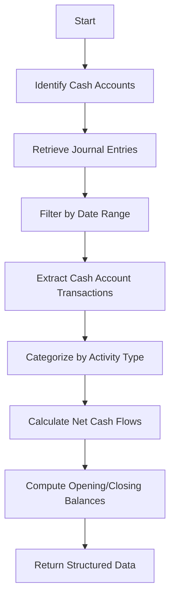
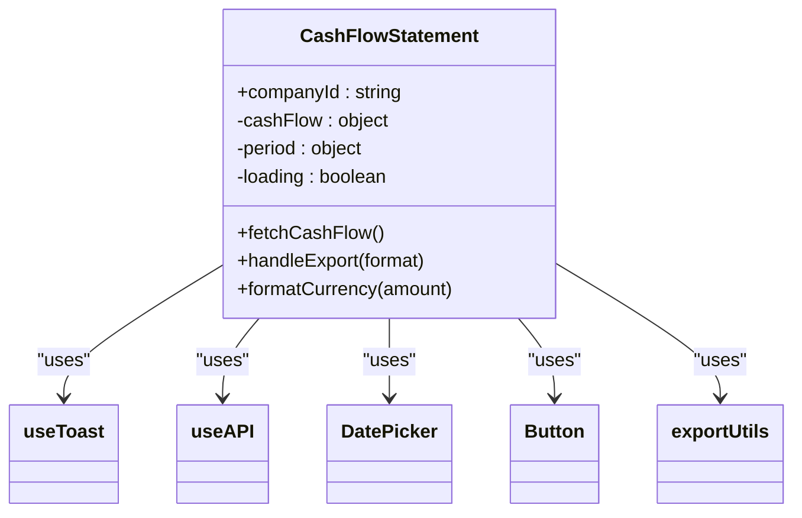
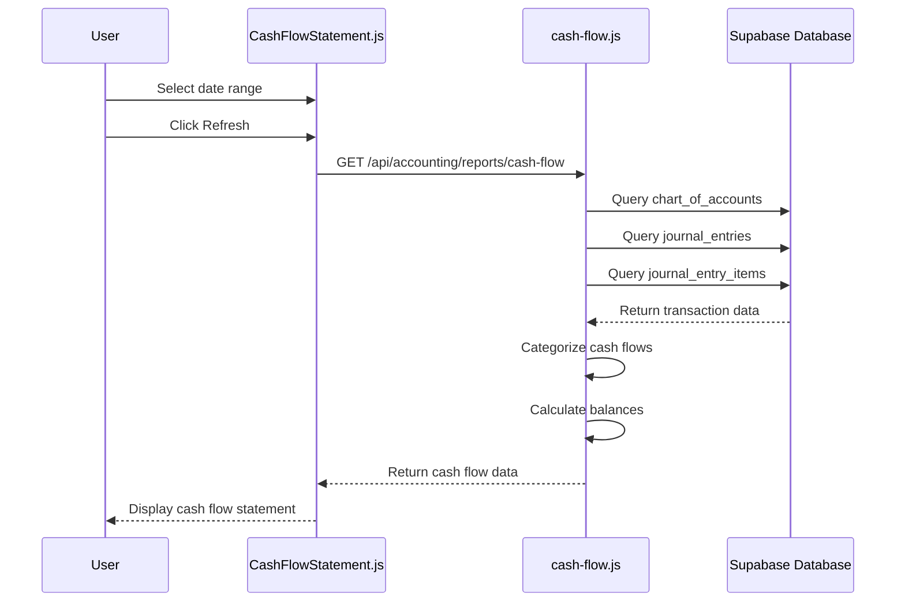

# Cash Flow Statement

<cite>
**Referenced Files in This Document**   
- [CashFlowStatement.js](file://src/components/accounting/CashFlowStatement.js)
- [accountingService.js](file://src/services/accountingService.js)
- [cash-flow.js](file://src/pages/api/accounting/reports/cash-flow.js)
</cite>

## Table of Contents
1. [Introduction](#introduction)
2. [Data Model and Calculation Logic](#data-model-and-calculation-logic)
3. [Backend Implementation](#backend-implementation)
4. [Frontend Component Architecture](#frontend-component-architecture)
5. [UI Features and User Interaction](#ui-features-and-user-interaction)
6. [Data Flow and Integration](#data-flow-and-integration)
7. [Common Issues and Troubleshooting](#common-issues-and-troubleshooting)
8. [Financial Planning Applications](#financial-planning-applications)

## Introduction
The Cash Flow Statement component in ezbillify-v1 provides a comprehensive view of a company's cash movements across operating, investing, and financing activities over a user-defined period. This financial statement is essential for assessing liquidity, managing working capital, and making informed business decisions. The component integrates with the accounting system to derive cash flow data from journal entries, categorizing transactions into appropriate cash flow categories and presenting them in a clear, interactive format with export capabilities.

## Data Model and Calculation Logic
The cash flow statement follows the standard three-activity classification model with detailed calculations for inflows, outflows, and net cash flow. The data model includes:

- **Operating Activities**: Cash flows from primary business operations including sales, purchases, receipts, payments, salaries, rent, and utilities
- **Investing Activities**: Cash flows from acquisition and disposal of long-term assets, investments, and equipment
- **Financing Activities**: Cash flows from capital contributions, loans, dividends, and equity transactions
- **Cash Position**: Opening balance, net cash flow, and closing balance calculations

The system calculates net cash flow as the sum of net operating, investing, and financing cash flows. The opening balance is derived from the current balances of cash and bank accounts, while the closing balance is calculated as opening balance plus net cash flow.

**Section sources**
- [cash-flow.js](file://src/pages/api/accounting/reports/cash-flow.js#L214-L230)

## Backend Implementation
The cash flow statement is generated through a multi-step backend process that extracts and categorizes transaction data from the accounting system. The implementation involves:

1. **Account Identification**: The system identifies all cash and bank accounts from the chart of accounts based on account type (asset) and subtype (cash or bank)
2. **Transaction Retrieval**: Journal entries within the specified date range are retrieved, focusing on posted transactions
3. **Cash Flow Categorization**: Transactions are categorized into operating, investing, and financing activities based on reference type and narration keywords
4. **Balance Calculation**: Opening and closing cash balances are calculated to provide context for the period's cash movements

The backend uses a rule-based categorization system where transactions are classified according to predefined keywords in the reference type or narration fields. This approach ensures consistent classification while allowing for flexibility in transaction descriptions.

**Diagram sources**
- [cash-flow.js](file://src/pages/api/accounting/reports/cash-flow.js#L43-L230)

**Section sources**
- [cash-flow.js](file://src/pages/api/accounting/reports/cash-flow.js#L23-L230)

## Frontend Component Architecture
The CashFlowStatement component is a client-side React component that manages state, handles user interactions, and renders the cash flow data. The architecture follows a clean separation of concerns with the following key elements:

- **State Management**: Uses React's useState and useEffect hooks to manage period selection, loading states, and cash flow data
- **API Integration**: Leverages the useAPI hook to fetch data from the backend API endpoint
- **Data Formatting**: Implements currency formatting using Intl.NumberFormat for INR currency display
- **Conditional Rendering**: Displays loading indicators, empty states, and the complete cash flow statement based on data availability

The component maintains state for the reporting period (from and to dates) and the cash flow data, with automatic data fetching whenever the company ID or period changes.

**Diagram sources**
- [CashFlowStatement.js](file://src/components/accounting/CashFlowStatement.js#L12-L301)

**Section sources**
- [CashFlowStatement.js](file://src/components/accounting/CashFlowStatement.js#L12-L301)

## UI Features and User Interaction
The cash flow statement interface provides several user-friendly features to enhance usability and data accessibility:

- **Interactive Date Pickers**: Users can select custom reporting periods using date picker components for both start and end dates
- **Real-time Refresh**: A refresh button allows users to update the cash flow data without page reload, with visual loading indicators during data fetching
- **Multi-format Export**: Users can export the cash flow statement in Excel, PDF, and JSON formats through a dropdown menu
- **Visual Indicators**: Positive cash flows are displayed in green while negative cash flows appear in red for quick visual assessment
- **Responsive Design**: The component adapts to different screen sizes with appropriate layout adjustments

The UI clearly separates the three cash flow activities with distinct sections and provides a summary of the net increase/decrease in cash along with opening and closing cash balances in a highlighted section.

**Section sources**
- [CashFlowStatement.js](file://src/components/accounting/CashFlowStatement.js#L98-L295)

## Data Flow and Integration
The cash flow statement generation follows a well-defined data flow from the user interface through the backend to the database and back:

1. **User Interaction**: The user selects a date range and triggers data refresh
2. **Frontend Request**: The CashFlowStatement component calls the API with company ID and date parameters
3. **Backend Processing**: The API endpoint queries the database for relevant journal entries and processes them
4. **Database Interaction**: The system retrieves chart of accounts and journal entry data from Supabase
5. **Data Transformation**: Transactions are categorized and aggregated into cash flow activities
6. **Response Delivery**: The formatted cash flow data is returned to the frontend for display

The integration relies on the accountingService.getCashFlowStatement method, which acts as a bridge between the frontend and the Supabase RPC function 'get_cash_flow'. This layered architecture ensures separation of concerns and maintainability.

**Diagram sources**
- [CashFlowStatement.js](file://src/components/accounting/CashFlowStatement.js#L29-L55)
- [cash-flow.js](file://src/pages/api/accounting/reports/cash-flow.js#L23-L230)

**Section sources**
- [CashFlowStatement.js](file://src/components/accounting/CashFlowStatement.js#L29-L55)
- [cash-flow.js](file://src/pages/api/accounting/reports/cash-flow.js#L23-L230)

## Common Issues and Troubleshooting
Several common issues may arise when generating or interpreting cash flow statements in ezbillify-v1:

- **Incomplete Transaction Records**: Missing journal entries within the selected period will result in incomplete cash flow data. Ensure all transactions are properly recorded and posted.
- **Timing Mismatches**: The opening balance calculation uses current account balances rather than historical balances as of the period start date. For precise historical analysis, ensure transactions are dated correctly.
- **Categorization Errors**: Transactions may be misclassified if reference types or narrations don't contain the expected keywords. Review and edit transaction details for accurate categorization.
- **Negative Cash Flow Interpretation**: Sustained negative operating cash flow may indicate liquidity issues, while negative investing cash flow often reflects growth investments.
- **Missing Cash Accounts**: If no cash or bank accounts are defined in the chart of accounts, the system will return an empty cash flow statement.

To troubleshoot issues, verify that cash and bank accounts are properly configured in the chart of accounts, ensure all relevant transactions are recorded with appropriate reference types and narrations, and confirm that the date range selection is correct.

**Section sources**
- [cash-flow.js](file://src/pages/api/accounting/reports/cash-flow.js#L54-L84)
- [cash-flow.js](file://src/pages/api/accounting/reports/cash-flow.js#L111-L142)

## Financial Planning Applications
The cash flow statement serves as a critical tool for liquidity management and financial planning:

- **Liquidity Management**: Monitor cash position to ensure sufficient funds for operational expenses and debt obligations
- **Working Capital Optimization**: Analyze operating cash flow patterns to optimize inventory, receivables, and payables management
- **Investment Planning**: Assess investing cash flow to plan for capital expenditures and asset acquisitions
- **Financing Strategy**: Evaluate financing cash flow to determine optimal capital structure and funding requirements
- **Cash Flow Forecasting**: Use historical cash flow patterns to project future cash positions and identify potential shortfalls

Businesses should regularly review their cash flow statements to identify trends, anticipate cash needs, and make informed decisions about growth, investments, and financing. The ability to export data in multiple formats facilitates further analysis in spreadsheet applications and integration with other financial planning tools.