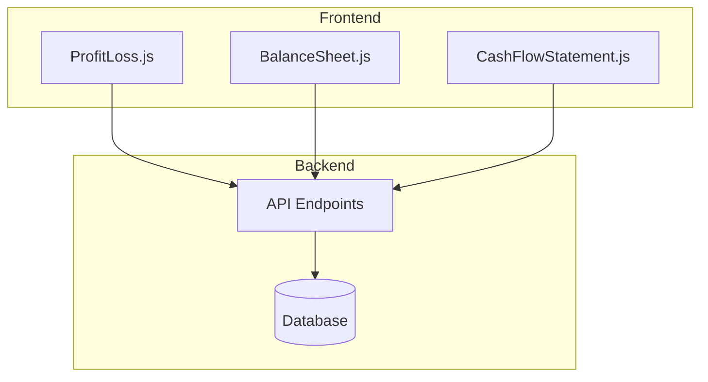
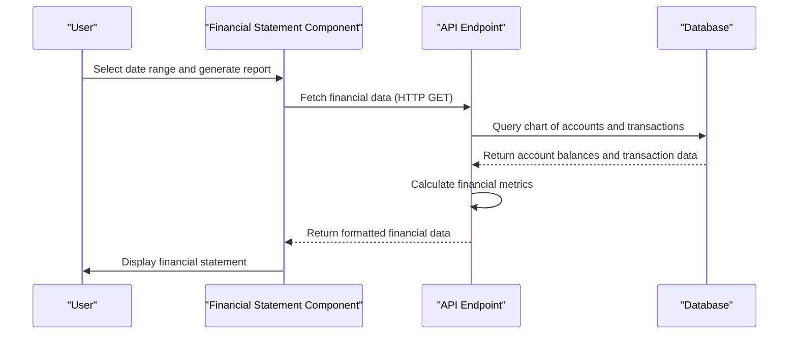
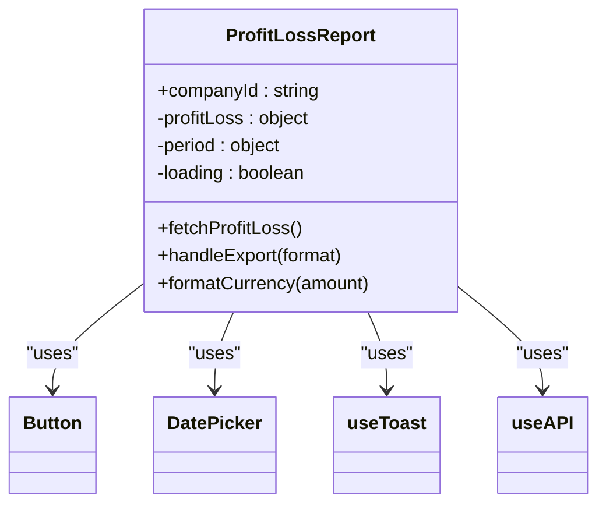
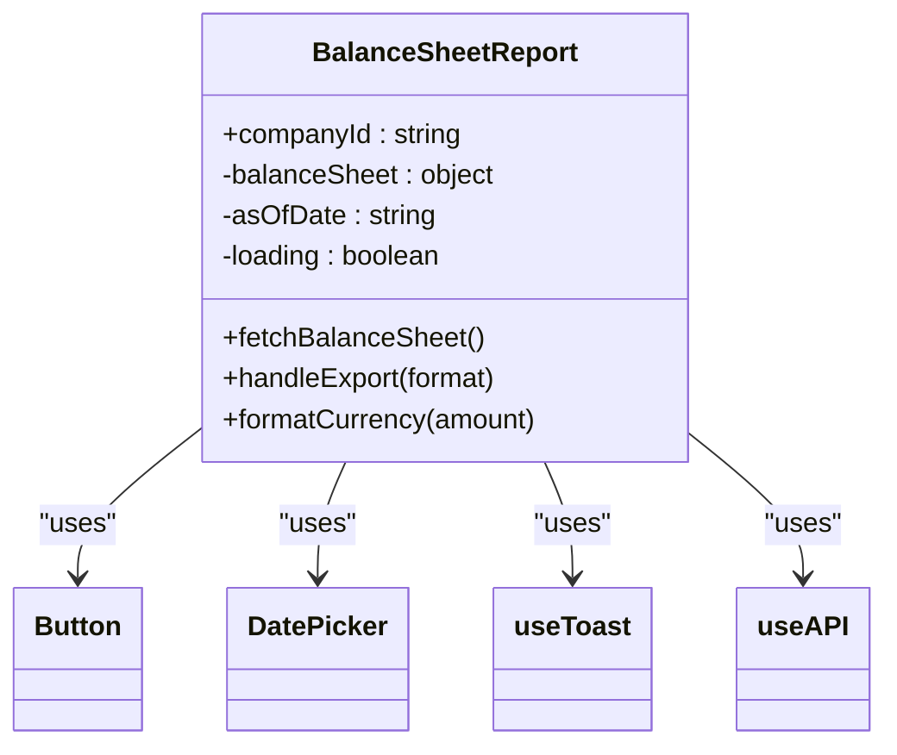
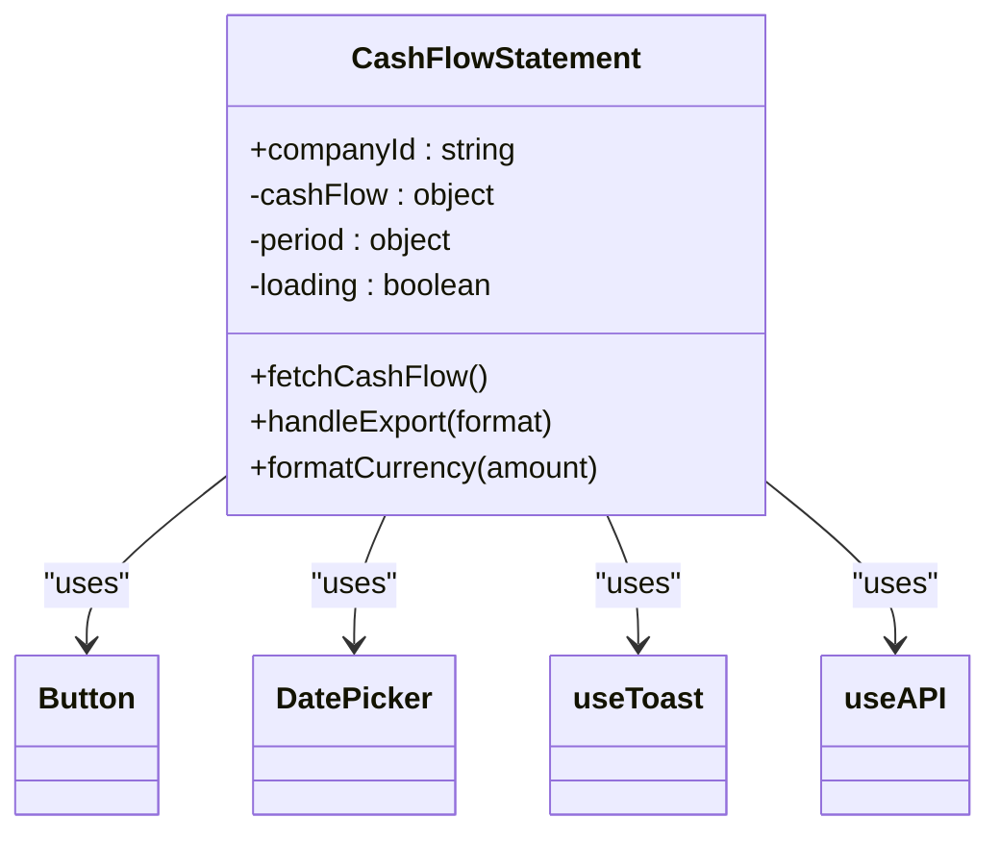
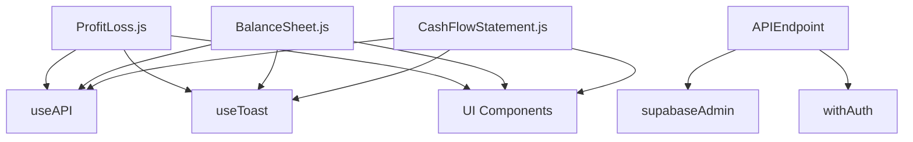

# Financial Statements

<cite>
**Referenced Files in This Document**   
- [ProfitLoss.js](file://src/components/accounting/ProfitLoss.js)
- [BalanceSheet.js](file://src/components/accounting/BalanceSheet.js)
- [CashFlowStatement.js](file://src/components/accounting/CashFlowStatement.js)
- [profit-loss.js](file://src/pages/api/accounting/reports/profit-loss.js)
- [balance-sheet.js](file://src/pages/api/accounting/reports/balance-sheet.js)
- [cash-flow.js](file://src/pages/api/accounting/reports/cash-flow.js)
- [trial-balance.js](file://src/pages/api/accounting/ledger/trial-balance.js)
- [supabase.js](file://src/services/utils/supabase.js)
- [db.js](file://src/lib/db.js)
</cite>

## Table of Contents
1. [Introduction](#introduction)
2. [Project Structure](#project-structure)
3. [Core Components](#core-components)
4. [Architecture Overview](#architecture-overview)
5. [Detailed Component Analysis](#detailed-component-analysis)
6. [Dependency Analysis](#dependency-analysis)
7. [Performance Considerations](#performance-considerations)
8. [Troubleshooting Guide](#troubleshooting-guide)
9. [Conclusion](#conclusion)

## Introduction
The financial statements module in ezbillify-v1 provides comprehensive reporting capabilities for businesses to analyze their financial performance. This document details the implementation of three key financial statements: Profit & Loss, Balance Sheet, and Cash Flow Statement. These reports are generated from trial balance data and general ledger accounts, with proper classification of income, expenses, assets, liabilities, and equity. The system enables users to view and analyze financial performance through interactive components with filtering capabilities by date range and account categories. The automation of financial statement generation from transaction data ensures accuracy and timeliness in financial reporting.

## Project Structure
The financial statements module is organized within the src/components/accounting directory with dedicated components for each financial statement. The API endpoints that power these reports are located in the src/pages/api/accounting/reports directory. The data model is based on a chart of accounts stored in the database with proper classification of account types and subtypes. The system uses Supabase as the backend database with row-level security for data protection.

**Diagram sources**
- [ProfitLoss.js](file://src/components/accounting/ProfitLoss.js)
- [BalanceSheet.js](file://src/components/accounting/BalanceSheet.js)
- [CashFlowStatement.js](file://src/components/accounting/CashFlowStatement.js)
- [profit-loss.js](file://src/pages/api/accounting/reports/profit-loss.js)
- [balance-sheet.js](file://src/pages/api/accounting/reports/balance-sheet.js)
- [cash-flow.js](file://src/pages/api/accounting/reports/cash-flow.js)

**Section sources**
- [ProfitLoss.js](file://src/components/accounting/ProfitLoss.js)
- [BalanceSheet.js](file://src/components/accounting/BalanceSheet.js)
- [CashFlowStatement.js](file://src/components/accounting/CashFlowStatement.js)

## Core Components
The financial statements module consists of three core components: ProfitLoss, BalanceSheet, and CashFlowStatement. Each component provides a user interface for viewing and analyzing financial performance with export capabilities to Excel, PDF, and JSON formats. The components handle date filtering, data fetching, and presentation of financial data in a structured format. They use the useAPI hook to communicate with the backend API endpoints and the useToast hook for user feedback.

**Section sources**
- [ProfitLoss.js](file://src/components/accounting/ProfitLoss.js)
- [BalanceSheet.js](file://src/components/accounting/BalanceSheet.js)
- [CashFlowStatement.js](file://src/components/accounting/CashFlowStatement.js)

## Architecture Overview
The financial statements module follows a client-server architecture with React components on the frontend and API endpoints on the backend. The components fetch data from the API endpoints which query the database through Supabase. The data flow starts from user interaction in the component, which triggers an API call to fetch financial data. The API endpoints process the data by querying the chart of accounts and journal entries, calculating the required financial metrics, and returning the results to the frontend for display.

**Diagram sources**
- [ProfitLoss.js](file://src/components/accounting/ProfitLoss.js)
- [profit-loss.js](file://src/pages/api/accounting/reports/profit-loss.js)
- [supabase.js](file://src/services/utils/supabase.js)

## Detailed Component Analysis

### Profit & Loss Statement Analysis
The Profit & Loss component displays income, cost of goods sold, expenses, and calculates gross profit and net profit. It allows users to filter by date range and export the report in multiple formats. The component calculates net profit margin as a percentage of total income.

#### For Object-Oriented Components:

**Diagram sources**
- [ProfitLoss.js](file://src/components/accounting/ProfitLoss.js)

**Section sources**
- [ProfitLoss.js](file://src/components/accounting/ProfitLoss.js)
- [profit-loss.js](file://src/pages/api/accounting/reports/profit-loss.js)

### Balance Sheet Analysis
The Balance Sheet component displays assets, liabilities, and equity with proper classification into current and non-current categories. It verifies that the balance sheet balances by checking that total assets equal total liabilities and equity. The component provides a visual indicator of whether the balance sheet is balanced.

#### For Object-Oriented Components:

**Diagram sources**
- [BalanceSheet.js](file://src/components/accounting/BalanceSheet.js)

**Section sources**
- [BalanceSheet.js](file://src/components/accounting/BalanceSheet.js)
- [balance-sheet.js](file://src/pages/api/accounting/reports/balance-sheet.js)

### Cash Flow Statement Analysis
The Cash Flow Statement component categorizes cash flows into operating, investing, and financing activities. It calculates net cash flow and displays opening and closing cash balances. The component uses narrative and reference type to categorize transactions into appropriate cash flow categories.

#### For Object-Oriented Components:

**Diagram sources**
- [CashFlowStatement.js](file://src/components/accounting/CashFlowStatement.js)

**Section sources**
- [CashFlowStatement.js](file://src/components/accounting/CashFlowStatement.js)
- [cash-flow.js](file://src/pages/api/accounting/reports/cash-flow.js)

## Dependency Analysis
The financial statements module has dependencies on several key services and components. The components depend on the useAPI hook for data fetching, the useToast hook for user feedback, and various UI components for rendering. The API endpoints depend on Supabase for database access and the withAuth middleware for authentication. The system uses environment variables for Supabase configuration.

**Diagram sources**
- [supabase.js](file://src/services/utils/supabase.js)
- [db.js](file://src/lib/db.js)

**Section sources**
- [supabase.js](file://src/services/utils/supabase.js)
- [db.js](file://src/lib/db.js)

## Performance Considerations
The financial statements module is designed with performance in mind. The API endpoints use efficient database queries with proper indexing on company_id and date fields. The components implement caching through React's useEffect hook to prevent unnecessary re-fetching of data. The system uses pagination and filtering to limit the amount of data transferred between the client and server. The export functionality is implemented client-side to reduce server load.

## Troubleshooting Guide
Common issues with the financial statements module include incorrect account classification, period mismatches, and presentation format requirements. For incorrect account classification, verify that accounts in the chart of accounts have the correct account_type and account_subtype values. For period mismatches, ensure that the date range selected is appropriate for the data available. For presentation format issues, check that the currency formatting is correctly applied and that negative values are properly displayed in red.

**Section sources**
- [ProfitLoss.js](file://src/components/accounting/ProfitLoss.js)
- [BalanceSheet.js](file://src/components/accounting/BalanceSheet.js)
- [CashFlowStatement.js](file://src/components/accounting/CashFlowStatement.js)

## Conclusion
The financial statements module in ezbillify-v1 provides robust reporting capabilities for businesses to analyze their financial performance. The implementation of Profit & Loss, Balance Sheet, and Cash Flow Statement components enables users to view and analyze financial data with ease. The system's architecture ensures data accuracy and security while providing a user-friendly interface for financial analysis. The automated generation of financial statements from transaction data reduces manual effort and minimizes errors in financial reporting.