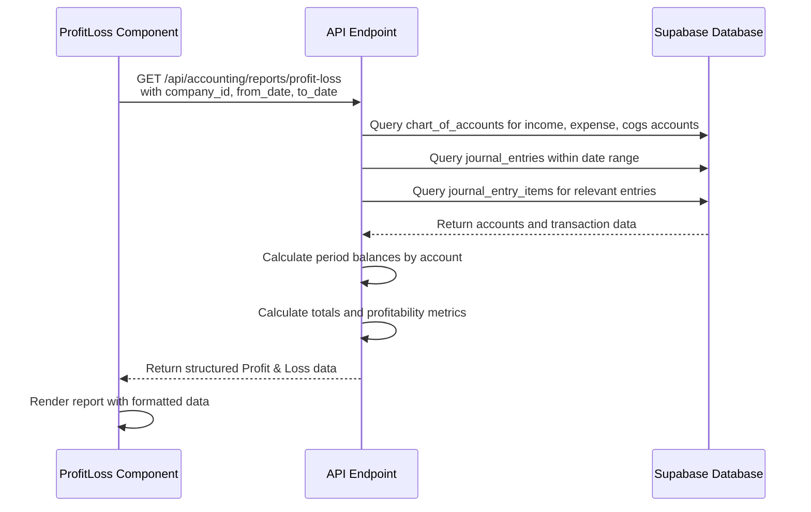
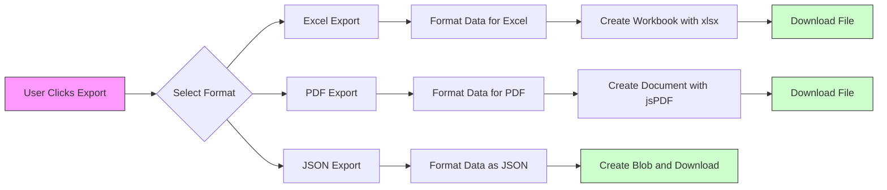
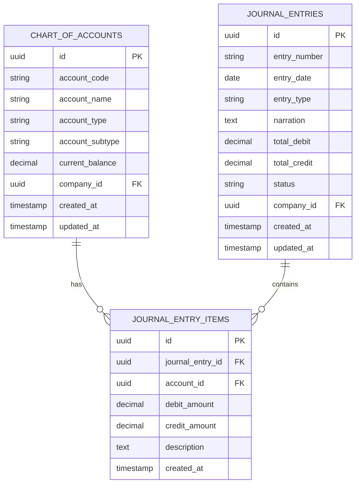

# Profit & Loss Statement

<cite>
**Referenced Files in This Document**   
- [ProfitLoss.js](file://src/components/accounting/ProfitLoss.js)
- [accountingService.js](file://src/services/accountingService.js)
- [profit-loss.js](file://src/pages/api/accounting/reports/profit-loss.js)
- [exportUtils.js](file://src/components/shared/utils/exportUtils.js)
</cite>

## Table of Contents
1. [Introduction](#introduction)
2. [Data Fetching and Processing](#data-fetching-and-processing)
3. [UI Structure and Components](#ui-structure-and-components)
4. [Export Functionality](#export-functionality)
5. [Account Categorization and Chart of Accounts](#account-categorization-and-chart-of-accounts)
6. [Financial Analysis and Decision-Making](#financial-analysis-and-decision-making)
7. [Common Issues and Troubleshooting](#common-issues-and-troubleshooting)
8. [Performance Optimization](#performance-optimization)
9. [Conclusion](#conclusion)

## Introduction
The Profit & Loss statement component in ezbillify-v1 provides a comprehensive financial report that displays income, expenses, cost of goods sold (COGS), gross profit, and net profit over a specified date range. This document explains the implementation details, data flow, and functionality of this component, focusing on how it integrates with the accounting service and Supabase backend to deliver accurate financial reporting.

The component serves as a critical tool for financial analysis, enabling business owners and accountants to track profitability, identify trends, and make informed decisions based on real-time financial data. It supports various export formats and provides intuitive period selection for flexible reporting.

**Section sources**
- [ProfitLoss.js](file://src/components/accounting/ProfitLoss.js#L1-L259)
- [profit-loss.js](file://src/pages/api/accounting/reports/profit-loss.js#L1-L181)

## Data Fetching and Processing
The Profit & Loss component fetches financial data through a well-defined data flow that begins with the frontend component and extends to the Supabase backend. The process starts when the user selects a date range, triggering a request to the API endpoint.

The `ProfitLoss.js` component uses the `useAPI` hook to make authenticated requests to the `/api/accounting/reports/profit-loss` endpoint, passing the company ID and selected date range as parameters. This request is handled by the server-side API route, which queries the database for relevant financial data.

The accounting service provides a `getProfitLoss` method that calls the Supabase RPC function `get_profit_loss` with the company ID, start date, and end date parameters. This function returns a structured response containing income, expenses, and COGS accounts with their respective balances for the specified period.

On the server side, the API implementation retrieves all income, expense, and COGS accounts from the chart of accounts table, then calculates period balances by aggregating journal entry items within the specified date range. The calculation logic accounts for the nature of each account type: credit increases income account balances, while debit increases expense and COGS account balances.

The final response includes not only the detailed account breakdown but also calculated metrics such as gross profit (income minus COGS) and net profit (gross profit minus expenses). Additionally, the API calculates the net profit margin as a percentage of total income, providing valuable insight into the business's profitability.



**Diagram sources**
- [ProfitLoss.js](file://src/components/accounting/ProfitLoss.js#L1-L259)
- [accountingService.js](file://src/services/accountingService.js#L86-L113)
- [profit-loss.js](file://src/pages/api/accounting/reports/profit-loss.js#L1-L181)

**Section sources**
- [accountingService.js](file://src/services/accountingService.js#L86-L113)
- [profit-loss.js](file://src/pages/api/accounting/reports/profit-loss.js#L1-L181)

## UI Structure and Components
The Profit & Loss statement UI is designed with a clean, intuitive layout that emphasizes readability and ease of use. The component is built using React and follows a modular structure with well-defined sections for different parts of the financial statement.

The UI structure consists of three main sections: the header with period controls, the main content area displaying the financial data, and the export functionality. The header includes a title, period description, and date selection controls that allow users to specify the reporting period.

Period selection is implemented using DatePicker components that allow users to select start and end dates for the report. By default, the component initializes with the current year as the period, providing immediate visibility into year-to-date performance. The date pickers are integrated with state management to ensure the report updates automatically when new dates are selected.

The main content area is organized into logical sections following standard accounting practices: income, cost of goods sold, gross profit, expenses, and net profit. Each section displays accounts of the corresponding type with their balances, with totals clearly highlighted. The net profit is displayed prominently with conditional styling (green for profit, red for loss) to provide immediate visual feedback on the business's financial performance.

The component uses responsive design principles to ensure optimal viewing across different device sizes. It includes loading states and empty states to provide feedback during data retrieval and when no data is available for the selected period.

```mermaid
flowchart TD
A[ProfitLoss Component] --> B[Header Section]
A --> C[Main Content Area]
A --> D[Export Functionality]
B --> B1[Title: "Profit & Loss Statement"]
B --> B2[Period Display]
B --> B3[From Date Picker]
B --> B4[To Date Picker]
B --> B5[Refresh Button]
C --> C1[Income Section]
C --> C2[COGS Section]
C --> C3[Gross Profit Calculation]
C --> C4[Expenses Section]
C --> C5[Net Profit Calculation]
C --> C6[Profit Margin Display]
D --> D1[Export Button]
D1 --> D1a[Export to Excel]
D1 --> D1b[Export to PDF]
D1 --> D1c[Export to JSON]
style A fill:#f9f,stroke:#333
style C5 fill:#cfc,stroke:#333
```

**Diagram sources**
- [ProfitLoss.js](file://src/components/accounting/ProfitLoss.js#L1-L259)

**Section sources**
- [ProfitLoss.js](file://src/components/accounting/ProfitLoss.js#L1-L259)

## Export Functionality
The Profit & Loss component provides comprehensive export functionality that allows users to download the financial report in multiple formats: Excel, PDF, and JSON. This feature enables users to share reports with stakeholders, perform additional analysis in spreadsheet software, or integrate the data with other systems.

The export functionality is implemented through the `exportUtils.js` file, which provides three main functions: `exportToExcel`, `exportToPDF`, and `exportToJSON`. When a user selects an export format, the component packages the current report data along with metadata such as the report title, period, and generation timestamp into a standardized structure.

For Excel export, the component uses the xlsx library to create a workbook with properly formatted data. The export includes the report title, period information, and a tabular representation of the financial data with appropriate headers. The resulting Excel file maintains numerical formatting for currency values, making it suitable for further financial analysis.

The PDF export generates a professional-looking document using jsPDF, with the report title centered at the top, followed by period information and the financial data in a readable format. The PDF maintains consistent styling and pagination, ensuring the report looks polished when printed or shared electronically.

The JSON export provides a structured data representation that can be easily consumed by other applications or used for data integration purposes. This format preserves all the detailed information from the report in a machine-readable format, including the hierarchical structure of accounts and calculated metrics.

The export interface is implemented as a dropdown menu attached to an export button, providing a clean and intuitive user experience. Error handling is implemented to provide feedback if an export operation fails, and success notifications are displayed when exports complete successfully.



**Diagram sources**
- [ProfitLoss.js](file://src/components/accounting/ProfitLoss.js#L53-L83)
- [exportUtils.js](file://src/components/shared/utils/exportUtils.js#L1-L181)

**Section sources**
- [ProfitLoss.js](file://src/components/accounting/ProfitLoss.js#L53-L83)
- [exportUtils.js](file://src/components/shared/utils/exportUtils.js#L1-L181)

## Account Categorization and Chart of Accounts
The Profit & Loss statement relies on the chart of accounts to properly categorize financial transactions into income, expenses, and cost of goods sold. The chart of accounts is a foundational accounting structure that defines all financial accounts used by a business, with each account assigned a specific type that determines how it appears in financial statements.

In ezbillify-v1, accounts are categorized into several types including asset, liability, equity, income, expense, and cogs (cost of goods sold). The Profit & Loss component specifically uses income, expense, and cogs account types to generate the report. This categorization is stored in the `chart_of_accounts` database table and is used by the reporting system to group transactions appropriately.

The account categorization follows standard accounting principles where income accounts represent revenue streams, expense accounts represent operational costs, and cogs accounts represent the direct costs associated with producing goods or services. This structure enables the system to accurately calculate gross profit (income minus COGS) and net profit (gross profit minus expenses).

When transactions are recorded in the system, they are posted to specific accounts in the chart of accounts. The Profit & Loss report aggregates these transactions by account type and calculates the net movement (balance) for each account during the specified period. For income accounts, credit entries increase the balance while debit entries decrease it. For expense and COGS accounts, the opposite is true: debit entries increase the balance while credit entries decrease it.

Proper account classification is critical for accurate financial reporting. Misclassified accounts can lead to incorrect profit calculations and misleading financial insights. The system provides tools for administrators to manage the chart of accounts, ensuring that accounts are properly categorized and that the financial reports reflect the true financial position of the business.



**Diagram sources**
- [profit-loss.js](file://src/pages/api/accounting/reports/profit-loss.js#L25-L36)
- [ProfitLoss.js](file://src/components/accounting/ProfitLoss.js#L178-L224)

**Section sources**
- [profit-loss.js](file://src/pages/api/accounting/reports/profit-loss.js#L25-L36)
- [ProfitLoss.js](file://src/components/accounting/ProfitLoss.js#L178-L224)

## Financial Analysis and Decision-Making
The Profit & Loss statement serves as a vital tool for financial analysis and business decision-making. By providing a clear view of income, expenses, and profitability over a specified period, it enables business owners and managers to assess performance, identify trends, and make informed strategic decisions.

The report supports several key financial analyses. First, it allows for trend analysis by comparing profitability across different periods. Users can examine month-over-month or year-over-year changes in revenue, expenses, and net profit to identify growth patterns, seasonal variations, or emerging issues.

Second, the detailed account breakdown enables expense analysis, helping businesses identify major cost centers and opportunities for cost reduction. By examining individual expense accounts, managers can pinpoint areas where spending may be excessive or where efficiencies can be gained.

Third, the report facilitates margin analysis through the calculation of gross profit margin and net profit margin. These metrics provide insight into the business's pricing strategy, cost structure, and overall profitability. A declining margin may indicate the need to adjust prices, reduce costs, or reevaluate the product mix.

The component also supports comparative analysis by allowing users to select different date ranges. This functionality enables "what-if" scenarios, such as comparing current performance against budgeted targets or analyzing the impact of specific business initiatives.

For decision-making, the Profit & Loss statement provides the financial foundation for various business decisions, including investment planning, resource allocation, pricing strategy adjustments, and operational changes. The export functionality further enhances its utility by enabling integration with other analytical tools and sharing with stakeholders.

**Section sources**
- [profit-loss.js](file://src/pages/api/accounting/reports/profit-loss.js#L168-L169)
- [ProfitLoss.js](file://src/components/accounting/ProfitLoss.js#L242-L251)

## Common Issues and Troubleshooting
Several common issues can affect the accuracy and usability of the Profit & Loss statement, primarily related to data quality, account classification, and system configuration. Understanding these issues and their solutions is essential for maintaining reliable financial reporting.

One common issue is missing data, which can occur when journal entries are not properly recorded or when the date range selected does not contain any transactions. The system handles this by displaying a clear message prompting users to generate the report and providing a refresh button to initiate data retrieval. In cases where no transactions exist for the period, the API returns accounts with zero balances rather than omitting them entirely, maintaining the report structure.

Incorrect account classifications represent another frequent issue. If transactions are posted to the wrong account type (e.g., recording a cost of goods sold expense as a general operating expense), the profit calculations will be inaccurate. This can lead to misleading gross profit and net profit figures. The solution involves regular review of the chart of accounts and transaction postings, along with proper training for users who record financial transactions.

Data synchronization issues between the frontend and backend can also occur, particularly in distributed systems. The component addresses this through proper state management and error handling, displaying loading indicators during data retrieval and providing clear error messages when requests fail.

Authentication and authorization issues may prevent users from accessing the report. The system implements proper access controls through the `withAuth` middleware, ensuring that only authorized users can generate financial reports. Error handling in the API provides appropriate status codes and messages for unauthorized access attempts.

Performance issues with large datasets can affect report generation time. While this is addressed through optimization techniques (discussed in the next section), users may still experience delays with extensive historical data. The system mitigates this by providing feedback during loading and implementing efficient data retrieval methods.

**Section sources**
- [profit-loss.js](file://src/pages/api/accounting/reports/profit-loss.js#L55-L83)
- [ProfitLoss.js](file://src/components/accounting/ProfitLoss.js#L157-L171)
- [profit-loss.js](file://src/pages/api/accounting/reports/profit-loss.js#L172-L177)

## Performance Optimization
The Profit & Loss component implements several performance optimization strategies to ensure efficient data retrieval and rendering, particularly when dealing with large datasets. These optimizations are critical for maintaining a responsive user experience and system scalability.

On the database level, the API implementation uses efficient querying patterns to minimize data transfer and processing overhead. Instead of retrieving all transaction data and processing it in the application layer, the system leverages Supabase's capabilities to filter and aggregate data at the database level. The implementation first retrieves only the relevant journal entries within the specified date range, then fetches only the journal entry items associated with those entries.

The component uses batch operations to minimize the number of database queries. Rather than querying each account individually, it retrieves all relevant accounts in a single query using the `in` operator to filter by account type. Similarly, journal entry items are retrieved in a single batch operation using the `in` operator with the list of relevant entry IDs.

Client-side performance is optimized through proper state management and conditional rendering. The component only fetches data when the company ID or period changes, preventing unnecessary API calls. Loading states are implemented to provide feedback during data retrieval, and the UI is designed to handle large numbers of accounts efficiently through virtualized rendering principles.

The export functionality includes optimizations to handle large datasets, such as limiting the number of rows included in PDF exports to prevent memory issues and ensure reasonable generation times. The JSON and Excel exports handle larger datasets more efficiently by leveraging streaming capabilities where possible.

Caching strategies could further enhance performance, though they are not explicitly implemented in the current code. Potential caching approaches include caching frequently accessed reports, implementing browser-level caching of API responses, or using server-side caching for expensive database queries.

**Section sources**
- [profit-loss.js](file://src/pages/api/accounting/reports/profit-loss.js#L39-L54)
- [profit-loss.js](file://src/pages/api/accounting/reports/profit-loss.js#L86-L97)
- [ProfitLoss.js](file://src/components/accounting/ProfitLoss.js#L22-L26)

## Conclusion
The Profit & Loss statement component in ezbillify-v1 provides a comprehensive financial reporting solution that effectively integrates frontend user experience with robust backend data processing. By leveraging the Supabase platform and a well-structured API, the component delivers accurate, timely financial information that supports critical business decision-making.

The implementation demonstrates a clear separation of concerns, with distinct responsibilities for the UI component, API endpoint, and database logic. This architecture enables maintainability and scalability while providing a seamless user experience. The component's ability to fetch, process, and display financial data across customizable date ranges makes it a versatile tool for ongoing financial monitoring.

Key strengths of the implementation include its comprehensive export functionality, intuitive UI design, and robust error handling. The integration with the chart of accounts ensures accurate categorization of financial transactions, while the calculation of profitability metrics provides valuable insights beyond basic income and expense reporting.

For future enhancements, potential improvements could include chart visualization of trends, comparative reporting against previous periods, and more sophisticated filtering options. Additionally, implementing caching mechanisms could further improve performance for users with large transaction histories.

Overall, the Profit & Loss statement component serves as a critical financial management tool within the ezbillify-v1 platform, empowering businesses to understand their financial performance and make data-driven decisions.