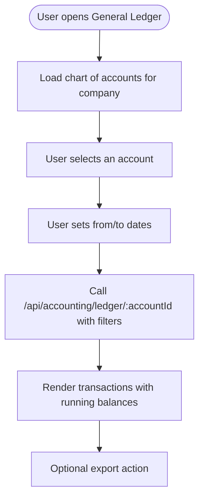

# General Ledger

<cite>
**Referenced Files in This Document**
- [GeneralLedgerList.js](file://src/components/accounting/GeneralLedgerList.js)
- [ledger [accountId].js](file://src/pages/api/accounting/ledger/[accountId].js)
- [chart-of-accounts.js](file://src/pages/api/master-data/chart-of-accounts.js)
- [accountingService.js](file://src/services/accountingService.js)
- [supabase.js](file://src/services/utils/supabase.js)
- [trial-balance.js](file://src/pages/api/accounting/ledger/trial-balance.js)
- [CustomerLedger.js](file://src/components/sales/CustomerLedger.js)
- [VendorLedger.js](file://src/components/purchase/VendorLedger.js)
- [A4-Ledger.html](file://public/templates/A4-Ledger.html)
</cite>

## Table of Contents
1. [Introduction](#introduction)
2. [Project Structure](#project-structure)
3. [Core Components](#core-components)
4. [Architecture Overview](#architecture-overview)
5. [Detailed Component Analysis](#detailed-component-analysis)
6. [Dependency Analysis](#dependency-analysis)
7. [Performance Considerations](#performance-considerations)
8. [Troubleshooting Guide](#troubleshooting-guide)
9. [Conclusion](#conclusion)
10. [Appendices](#appendices)

## Introduction
This document explains the general ledger system in ezbillify-v1 and how it is derived from journal entries and organized by the chart of accounts. It covers account-level transaction tracking, balance calculations, period-over-period comparisons, and the API surface for retrieving ledger data. It also describes the relationship between the general ledger and subsidiary ledgers for customers, vendors, and inventory, and provides guidance on common issues such as ledger imbalances, reconciliation discrepancies, and performance optimization for large datasets. Finally, it outlines how the general ledger serves as the foundation for financial reporting.

## Project Structure
The general ledger feature spans frontend components, backend API routes, and service-layer logic backed by Supabase. The primary building blocks are:
- Frontend: GeneralLedgerList component renders account-wise transactions and allows filtering by date range.
- Backend APIs: Account ledger endpoint and chart of accounts endpoint.
- Services: AccountingService encapsulates ledger retrieval and other accounting computations.
- Database: Supabase tables for chart of accounts, journal entries, and journal entry items.

**Diagram sources**
- [GeneralLedgerList.js](file://src/components/accounting/GeneralLedgerList.js#L1-L120)
- [ledger [accountId].js](file://src/pages/api/accounting/ledger/[accountId].js#L1-L129)
- [chart-of-accounts.js](file://src/pages/api/master-data/chart-of-accounts.js#L1-L55)
- [trial-balance.js](file://src/pages/api/accounting/ledger/trial-balance.js#L1-L98)
- [accountingService.js](file://src/services/accountingService.js#L1-L189)
- [supabase.js](file://src/services/utils/supabase.js#L1-L120)

**Section sources**
- [GeneralLedgerList.js](file://src/components/accounting/GeneralLedgerList.js#L1-L120)
- [ledger [accountId].js](file://src/pages/api/accounting/ledger/[accountId].js#L1-L129)
- [chart-of-accounts.js](file://src/pages/api/master-data/chart-of-accounts.js#L1-L55)
- [accountingService.js](file://src/services/accountingService.js#L1-L189)
- [supabase.js](file://src/services/utils/supabase.js#L1-L120)

## Core Components
- GeneralLedgerList: A React component that lists chart of accounts, filters by date range, and displays account-wise transactions with running balances.
- Account Ledger API: An authenticated route that returns ledger entries for a given account within a date range, including computed running balances.
- Chart of Accounts API: Returns the chart of accounts for a company, used to populate the account selection in the UI.
- AccountingService: Provides higher-level accounting operations including ledger retrieval, trial balance, and financial statements.
- Supabase utilities: Provide clients for user and admin operations, used by APIs and services.

**Section sources**
- [GeneralLedgerList.js](file://src/components/accounting/GeneralLedgerList.js#L1-L120)
- [ledger [accountId].js](file://src/pages/api/accounting/ledger/[accountId].js#L1-L129)
- [chart-of-accounts.js](file://src/pages/api/master-data/chart-of-accounts.js#L1-L55)
- [accountingService.js](file://src/services/accountingService.js#L1-L189)
- [supabase.js](file://src/services/utils/supabase.js#L1-L120)

## Architecture Overview
The general ledger is built on a journal-entry model:
- Journal entries are posted to journal_entries.
- Each journal entry has multiple journal_entry_items, one per account involved.
- The general ledger aggregates journal_entry_items for a specific account and computes a running balance based on debit and credit amounts.
- The chart of accounts defines the account taxonomy and determines whether an account’s normal balance is debit or credit.

**Diagram sources**
- [GeneralLedgerList.js](file://src/components/accounting/GeneralLedgerList.js#L32-L86)
- [ledger [accountId].js](file://src/pages/api/accounting/ledger/[accountId].js#L22-L120)
- [accountingService.js](file://src/services/accountingService.js#L142-L189)

## Detailed Component Analysis

### GeneralLedgerList: User View of Account Transactions
- Loads chart of accounts for the selected company.
- Allows filtering by account and date range.
- Displays a table of journal entries for the selected account with debit, credit, and running balance.
- Shows account summary including opening and current balances.

**Diagram sources**
- [GeneralLedgerList.js](file://src/components/accounting/GeneralLedgerList.js#L1-L120)
- [GeneralLedgerList.js](file://src/components/accounting/GeneralLedgerList.js#L120-L297)

**Section sources**
- [GeneralLedgerList.js](file://src/components/accounting/GeneralLedgerList.js#L1-L120)
- [GeneralLedgerList.js](file://src/components/accounting/GeneralLedgerList.js#L120-L297)

### Account Ledger API: Retrieving and Balancing
- Validates method and required parameters (company_id, accountId).
- Fetches account metadata from chart_of_accounts.
- Joins journal_entry_items with journal_entries to get entry details.
- Applies optional date filters.
- Computes running balance by iterating items in chronological order and adjusting by debit minus credit, depending on account type.

**Diagram sources**
- [ledger [accountId].js](file://src/pages/api/accounting/ledger/[accountId].js#L1-L129)

**Section sources**
- [ledger [accountId].js](file://src/pages/api/accounting/ledger/[accountId].js#L1-L129)

### Chart of Accounts API: Account Metadata
- Returns account codes, names, types, subtypes, and balances for a company.
- Used by the UI to populate the account selector.

**Section sources**
- [chart-of-accounts.js](file://src/pages/api/master-data/chart-of-accounts.js#L1-L55)

### AccountingService: Business Logic Layer
- getAccountLedger: Retrieves items for an account within a date range and computes running balances in memory.
- getTrialBalance: Uses stored procedures to compute trial balance totals.
- getBalanceSheet, getProfitLoss, getCashFlowStatement: Provide financial statements.

**Diagram sources**
- [accountingService.js](file://src/services/accountingService.js#L1-L189)

**Section sources**
- [accountingService.js](file://src/services/accountingService.js#L1-L189)

### Relationship to Subsidiary Ledgers
- Customer Ledger: Shows customer-specific receivables/payables movements and balances, driven by sales and payment documents.
- Vendor Ledger: Shows vendor-specific payables movements and balances, driven by purchase and payment documents.
- Inventory Valuation: Tracks stock movements and valuation, supporting inventory-related journal entries.

These subsidiary ledgers complement the general ledger by providing detailed views for trade parties and inventory, while the general ledger consolidates all accounts.

**Section sources**
- [CustomerLedger.js](file://src/components/sales/CustomerLedger.js#L1-L120)
- [VendorLedger.js](file://src/components/purchase/VendorLedger.js#L1-L120)

### Trial Balance Endpoint: Cross-Check Totals
- Returns all accounts with current balances, reclassified into debit or credit columns based on account type.
- Provides totals and difference for quick balancing checks.

**Section sources**
- [trial-balance.js](file://src/pages/api/accounting/ledger/trial-balance.js#L1-L98)

## Dependency Analysis
- GeneralLedgerList depends on:
  - Chart of accounts API for account selection.
  - Account Ledger API for transaction data.
- Account Ledger API depends on:
  - Supabase admin client for secure reads.
  - chart_of_accounts and journal_entry_items/journal_entries tables.
- AccountingService depends on:
  - Supabase client for queries and RPCs.
  - Stored procedures for financial statements.

**Diagram sources**
- [GeneralLedgerList.js](file://src/components/accounting/GeneralLedgerList.js#L1-L120)
- [ledger [accountId].js](file://src/pages/api/accounting/ledger/[accountId].js#L1-L129)
- [chart-of-accounts.js](file://src/pages/api/master-data/chart-of-accounts.js#L1-L55)
- [accountingService.js](file://src/services/accountingService.js#L1-L189)
- [supabase.js](file://src/services/utils/supabase.js#L1-L120)

**Section sources**
- [GeneralLedgerList.js](file://src/components/accounting/GeneralLedgerList.js#L1-L120)
- [ledger [accountId].js](file://src/pages/api/accounting/ledger/[accountId].js#L1-L129)
- [chart-of-accounts.js](file://src/pages/api/master-data/chart-of-accounts.js#L1-L55)
- [accountingService.js](file://src/services/accountingService.js#L1-L189)
- [supabase.js](file://src/services/utils/supabase.js#L1-L120)

## Performance Considerations
- Indexing: Ensure indexes exist on:
  - chart_of_accounts(company_id, account_code)
  - journal_entries(company_id, entry_date)
  - journal_entry_items(account_id, journal_entry_id)
- Pagination and limits: For large datasets, consider adding pagination to the ledger API and limiting date ranges.
- Sorting and ordering: The ledger is sorted by entry_date and created_at; keep these indexes efficient.
- Denormalized balances: The chart_of_accounts table stores current_balance and opening_balance; ensure these are maintained consistently during posting and month-end close.
- Stored procedures: Financial statements rely on RPCs; ensure they are optimized and indexed appropriately.

[No sources needed since this section provides general guidance]

## Troubleshooting Guide
- Ledger imbalances:
  - Verify that the trial balance difference is zero.
  - Check that account types are correctly set so debits and credits are applied appropriately.
  - Confirm that the running balance calculation aligns with account type rules.
- Reconciliation discrepancies:
  - Compare general ledger balances with bank reconciliation and trade party ledgers.
  - Ensure date filters are correct and include all relevant entries.
- Performance issues:
  - Reduce date range or enable pagination.
  - Confirm database indexes exist on join/filter columns.
  - Monitor stored procedure performance for financial statements.

**Section sources**
- [trial-balance.js](file://src/pages/api/accounting/ledger/trial-balance.js#L1-L98)
- [ledger [accountId].js](file://src/pages/api/accounting/ledger/[accountId].js#L82-L120)

## Conclusion
The general ledger in ezbillify-v1 is a robust, journal-driven system that organizes transactions by the chart of accounts and computes running balances per account. The UI enables users to view detailed transaction histories for any account within a chosen period, while the backend APIs and services provide reliable access to ledger data and financial statements. By maintaining proper indexing, consistent account types, and careful reconciliation practices, organizations can trust the general ledger as the foundation for accurate financial reporting.

## Appendices

### API Definitions

- GET /api/accounting/ledger/[accountId]?company_id=&from_date=&to_date=
  - Purpose: Retrieve account ledger entries with running balances for a date range.
  - Query parameters:
    - company_id (required): Identifier of the company.
    - from_date (optional): Start date (YYYY-MM-DD).
    - to_date (optional): End date (YYYY-MM-DD).
  - Response fields:
    - account: Account metadata (id, account_code, account_name, account_type, current_balance, opening_balance).
    - items: Array of journal entry items with computed running_balance.
    - openingBalance, currentBalance, fromDate, toDate.

- GET /api/master-data/chart-of-accounts?company_id=
  - Purpose: Retrieve chart of accounts for a company.
  - Query parameters:
    - company_id (required): Identifier of the company.
  - Response fields:
    - data: Array of accounts with id, account_code, account_name, account_type, account_subtype, current_balance, opening_balance.

- GET /api/accounting/ledger/trial-balance?company_id=&as_of_date=
  - Purpose: Retrieve trial balance with debit/credit totals.
  - Query parameters:
    - company_id (required): Identifier of the company.
    - as_of_date (optional): As-of date for balance computation.
  - Response fields:
    - accounts: Accounts with debit/credit columns computed from current_balance.
    - totals: debit, credit, difference.
    - asOfDate, generatedAt.

**Section sources**
- [ledger [accountId].js](file://src/pages/api/accounting/ledger/[accountId].js#L22-L120)
- [chart-of-accounts.js](file://src/pages/api/master-data/chart-of-accounts.js#L1-L55)
- [trial-balance.js](file://src/pages/api/accounting/ledger/trial-balance.js#L1-L98)

### How the General Ledger Serves Financial Reporting
- Trial Balance: Validates that debits equal credits across all accounts.
- Balance Sheet: Aggregates asset, liability, and equity accounts as of a date.
- Profit & Loss: Computes income, expenses, and cost of goods sold over a period.
- Cash Flow Statement: Categorizes cash flows by operating, investing, and financing activities.

These statements rely on the general ledger as the authoritative source of account balances and transaction details.

**Section sources**
- [accountingService.js](file://src/services/accountingService.js#L56-L140)

### Example: Printing Ledger Reports
- The template A4-Ledger.html demonstrates how ledger data can be rendered for printing, including account details, balances, and totals.

**Section sources**
- [A4-Ledger.html](file://public/templates/A4-Ledger.html#L301-L330)