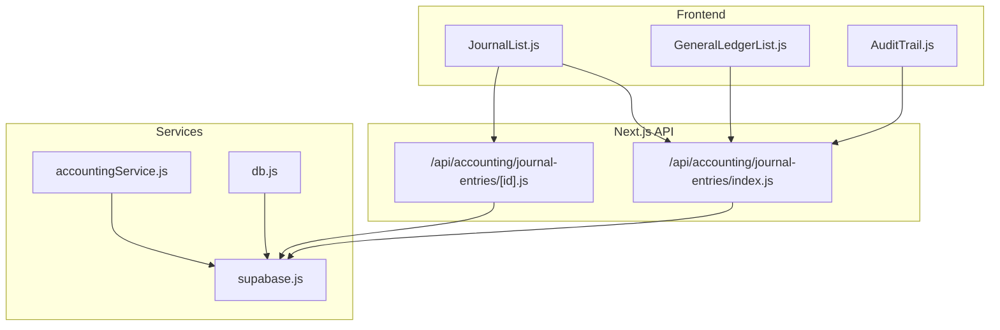
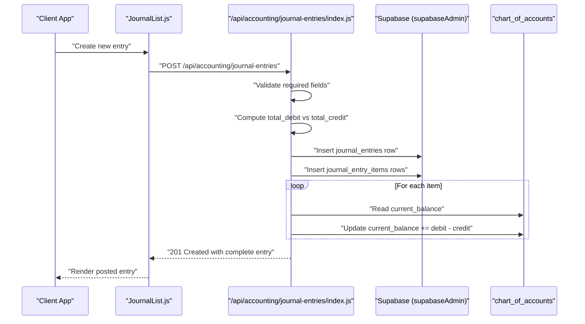
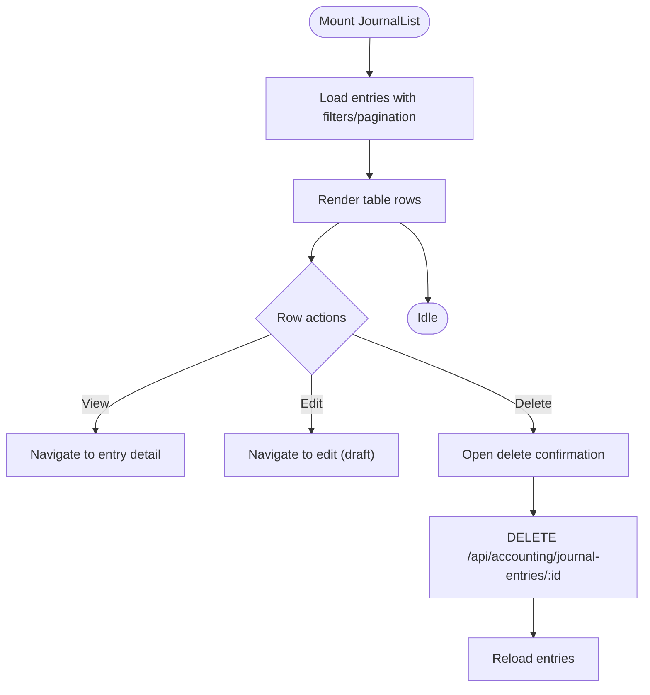
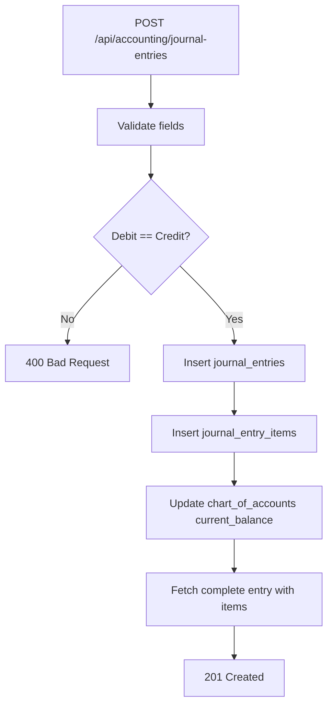
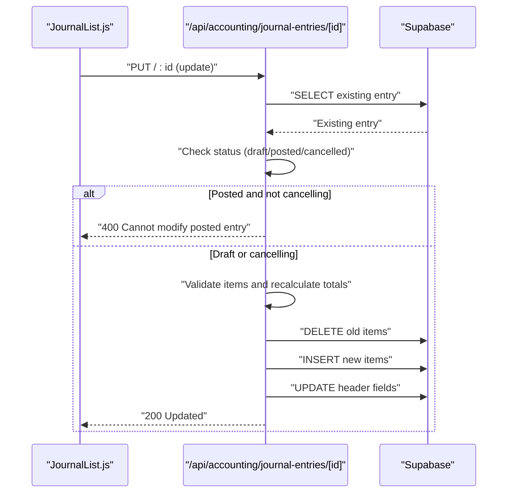
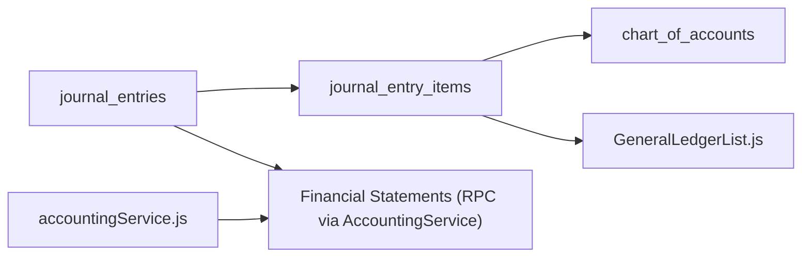
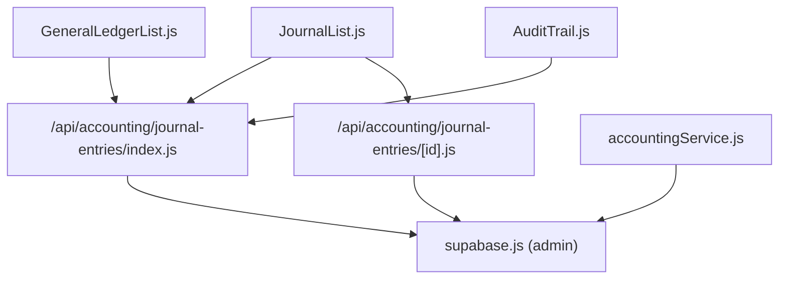

# Journal Entries

<cite>
**Referenced Files in This Document**
- [JournalList.js](file://src/components/accounting/JournalList.js)
- [journal-entries index page](file://src/pages/accounting/journal-entries/index.js)
- [journal-entries API index](file://src/pages/api/accounting/journal-entries/index.js)
- [journal-entries API [id]](file://src/pages/api/accounting/journal-entries/[id].js)
- [accountingService.js](file://src/services/accountingService.js)
- [GeneralLedgerList.js](file://src/components/accounting/GeneralLedgerList.js)
- [AuditTrail.js](file://src/components/others/AuditTrail.js)
- [supabase.js](file://src/services/utils/supabase.js)
- [db.js](file://src/lib/db.js)
</cite>

## Table of Contents
1. [Introduction](#introduction)
2. [Project Structure](#project-structure)
3. [Core Components](#core-components)
4. [Architecture Overview](#architecture-overview)
5. [Detailed Component Analysis](#detailed-component-analysis)
6. [Dependency Analysis](#dependency-analysis)
7. [Performance Considerations](#performance-considerations)
8. [Troubleshooting Guide](#troubleshooting-guide)
9. [Conclusion](#conclusion)
10. [Appendices](#appendices)

## Introduction
This document explains the journal entries system in ezbillify-v1 with a focus on double-entry accounting principles. It covers how journal entries are created, validated, posted, and managed, along with the data model, relationships to other accounting modules (general ledger and financial statements), and operational guidance for maintaining audit trails and data integrity.

## Project Structure
The journal entries feature spans frontend components, Next.js API routes, and backend services/utilities. The primary UI is a list/grid with filtering and pagination, backed by API endpoints that enforce double-entry validation and maintain balances.

**Diagram sources**
- [JournalList.js](file://src/components/accounting/JournalList.js#L1-L381)
- [journal-entries API index](file://src/pages/api/accounting/journal-entries/index.js#L1-L252)
- [journal-entries API [id]](file://src/pages/api/accounting/journal-entries/[id].js#L1-L272)
- [accountingService.js](file://src/services/accountingService.js#L1-L301)
- [GeneralLedgerList.js](file://src/components/accounting/GeneralLedgerList.js#L249-L270)
- [AuditTrail.js](file://src/components/others/AuditTrail.js#L1-L631)
- [supabase.js](file://src/services/utils/supabase.js#L1-L392)
- [db.js](file://src/lib/db.js#L1-L307)

**Section sources**
- [JournalList.js](file://src/components/accounting/JournalList.js#L1-L381)
- [journal-entries index page](file://src/pages/accounting/journal-entries/index.js#L1-L49)
- [journal-entries API index](file://src/pages/api/accounting/journal-entries/index.js#L1-L252)
- [journal-entries API [id]](file://src/pages/api/accounting/journal-entries/[id].js#L1-L272)
- [accountingService.js](file://src/services/accountingService.js#L1-L301)
- [GeneralLedgerList.js](file://src/components/accounting/GeneralLedgerList.js#L249-L270)
- [AuditTrail.js](file://src/components/others/AuditTrail.js#L1-L631)
- [supabase.js](file://src/services/utils/supabase.js#L1-L392)
- [db.js](file://src/lib/db.js#L1-L307)

## Core Components
- JournalList: A paginated, filterable table for journal entries with actions to view, edit (draft), and delete (draft).
- API handlers: Provide GET/POST for listing and creating entries, and GET/PUT/DELETE for individual entries with validation and balance checks.
- Services: Provide higher-level accounting operations and integrate with Supabase.
- General Ledger: Consumes journal entries to display line items and links back to entries.
- Audit Trail: Provides visibility into system activity including journal entries.

**Section sources**
- [JournalList.js](file://src/components/accounting/JournalList.js#L1-L381)
- [journal-entries API index](file://src/pages/api/accounting/journal-entries/index.js#L1-L252)
- [journal-entries API [id]](file://src/pages/api/accounting/journal-entries/[id].js#L1-L272)
- [accountingService.js](file://src/services/accountingService.js#L1-L301)
- [GeneralLedgerList.js](file://src/components/accounting/GeneralLedgerList.js#L249-L270)
- [AuditTrail.js](file://src/components/others/AuditTrail.js#L1-L631)

## Architecture Overview
Double-entry accounting is enforced at the API layer by validating that total debits equal total credits before posting. On successful creation, the system updates account balances and returns a complete entry with items and metadata.

**Diagram sources**
- [journal-entries API index](file://src/pages/api/accounting/journal-entries/index.js#L99-L210)
- [supabase.js](file://src/services/utils/supabase.js#L1-L392)

**Section sources**
- [journal-entries API index](file://src/pages/api/accounting/journal-entries/index.js#L99-L210)
- [supabase.js](file://src/services/utils/supabase.js#L1-L392)

## Detailed Component Analysis

### JournalList Component
- Purpose: Displays a paginated, sortable, searchable list of journal entries with status badges and actions.
- Filtering: Supports search, date range, and status filters.
- Actions: View, edit (draft only), delete (draft only), and pagination controls.
- Data rendering: Uses formatted currency/date and status badge mapping.

**Diagram sources**
- [JournalList.js](file://src/components/accounting/JournalList.js#L58-L121)

**Section sources**
- [JournalList.js](file://src/components/accounting/JournalList.js#L1-L381)

### API Routes: Listing and Creating Entries
- GET /api/accounting/journal-entries
  - Filters by company_id, date range, status, pagination.
  - Returns entries with nested items and created_by_user.
- POST /api/accounting/journal-entries
  - Validates presence of company_id, entry_date, and items.
  - Enforces double-entry: total_debit must equal total_credit (tolerance for small floating-point differences).
  - Generates entry_number using a JE-YYYY-NNNNNN scheme.
  - Inserts journal_entries row and journal_entry_items rows.
  - Updates chart_of_accounts current_balance for each item.
  - Returns the complete entry with nested data.

**Diagram sources**
- [journal-entries API index](file://src/pages/api/accounting/journal-entries/index.js#L99-L210)

**Section sources**
- [journal-entries API index](file://src/pages/api/accounting/journal-entries/index.js#L1-L252)

### API Routes: Viewing, Editing, Deleting Entries
- GET /api/accounting/journal-entries/[id]
  - Returns a single entry with items and created_by_user.
- PUT /api/accounting/journal-entries/[id]
  - Validates and updates header fields and items.
  - Enforces that only draft entries can be modified; posted entries require cancellation first.
  - Recomputes totals and re-inserts items if provided.
- DELETE /api/accounting/journal-entries/[id]
  - Only draft entries can be deleted; posted entries must be cancelled first.

**Diagram sources**
- [journal-entries API [id]](file://src/pages/api/accounting/journal-entries/[id].js#L76-L214)

**Section sources**
- [journal-entries API [id]](file://src/pages/api/accounting/journal-entries/[id].js#L1-L272)

### Data Model: Journal Entries and Items
- journal_entries
  - Fields: id, company_id, entry_number, entry_date, narration, reference_type, reference_number, total_debit, total_credit, status, created_by, created_at, updated_at.
  - Relationships: Has many journal_entry_items; belongs to users (created_by).
- journal_entry_items
  - Fields: id, journal_entry_id, account_id, debit_amount, credit_amount, description.
  - Relationships: Belongs to journal_entries; belongs to chart_of_accounts.
- chart_of_accounts
  - Used to update current_balance on each item; supports account hierarchy and validation.

Notes on double-entry enforcement:
- Total debits and credits are computed from items and compared before insertion/update.
- On creation, account balances are updated immediately; on update, items are replaced and balances recalculated accordingly.

**Section sources**
- [journal-entries API index](file://src/pages/api/accounting/journal-entries/index.js#L121-L210)
- [journal-entries API [id]](file://src/pages/api/accounting/journal-entries/[id].js#L104-L156)
- [accountingService.js](file://src/services/accountingService.js#L142-L174)

### Relationship to Other Modules
- General Ledger
  - The general ledger consumes journal_entry_items and links back to journal_entries for drill-down.
  - The UI navigates from general ledger items to the specific journal entry detail page.
- Financial Statements
  - AccountingService exposes RPC-based financial statements (trial balance, balance sheet, profit & loss, cash flow) that aggregate from journal entries and accounts.
  - Month-end closing creates journal entries to close income and expense accounts, ensuring statement integrity.

**Diagram sources**
- [GeneralLedgerList.js](file://src/components/accounting/GeneralLedgerList.js#L249-L270)
- [accountingService.js](file://src/services/accountingService.js#L1-L301)

**Section sources**
- [GeneralLedgerList.js](file://src/components/accounting/GeneralLedgerList.js#L249-L270)
- [accountingService.js](file://src/services/accountingService.js#L1-L301)

### Audit Trail and Data Integrity
- AuditTrail component lists system activities including journal entries, enabling compliance and forensic tracking.
- The API layer uses a service client that bypasses Row Level Security for administrative operations, ensuring reliable internal processing.
- The database helpers provide transaction-like batching and error mapping for robust operations.

Best practices:
- Always post entries; avoid manual draft edits in production.
- Use cancellation for correcting posted entries rather than direct deletion.
- Maintain audit logs for all journal entry changes.
- Ensure account codes and hierarchies are valid before posting.

**Section sources**
- [AuditTrail.js](file://src/components/others/AuditTrail.js#L1-L631)
- [supabase.js](file://src/services/utils/supabase.js#L1-L392)
- [db.js](file://src/lib/db.js#L190-L246)

## Dependency Analysis
- Frontend depends on Next.js API routes for CRUD operations.
- API routes depend on Supabase service client for database operations.
- Services encapsulate higher-level accounting logic and RPC calls.
- General Ledger and Audit Trail consume API endpoints and database data.

**Diagram sources**
- [JournalList.js](file://src/components/accounting/JournalList.js#L1-L381)
- [journal-entries API index](file://src/pages/api/accounting/journal-entries/index.js#L1-L252)
- [journal-entries API [id]](file://src/pages/api/accounting/journal-entries/[id].js#L1-L272)
- [accountingService.js](file://src/services/accountingService.js#L1-L301)
- [GeneralLedgerList.js](file://src/components/accounting/GeneralLedgerList.js#L249-L270)
- [AuditTrail.js](file://src/components/others/AuditTrail.js#L1-L631)
- [supabase.js](file://src/services/utils/supabase.js#L1-L392)

**Section sources**
- [JournalList.js](file://src/components/accounting/JournalList.js#L1-L381)
- [journal-entries API index](file://src/pages/api/accounting/journal-entries/index.js#L1-L252)
- [journal-entries API [id]](file://src/pages/api/accounting/journal-entries/[id].js#L1-L272)
- [accountingService.js](file://src/services/accountingService.js#L1-L301)
- [GeneralLedgerList.js](file://src/components/accounting/GeneralLedgerList.js#L249-L270)
- [AuditTrail.js](file://src/components/others/AuditTrail.js#L1-L631)
- [supabase.js](file://src/services/utils/supabase.js#L1-L392)

## Performance Considerations
- Pagination and sorting are handled server-side; ensure appropriate indexing on company_id, entry_date, and status for optimal query performance.
- Double-entry validation occurs in-memory on the server; keep item arrays reasonable in size to avoid heavy computation.
- Batch updates to chart_of_accounts balances occur per item; consider minimizing frequent posting cycles to reduce write amplification.

[No sources needed since this section provides general guidance]

## Troubleshooting Guide
Common issues and resolutions:
- Unbalanced entries
  - Symptom: Creation/update fails with a balance mismatch error.
  - Resolution: Ensure total debits equal total credits; verify decimal precision and tolerance.
  - Section sources
    - [journal-entries API index](file://src/pages/api/accounting/journal-entries/index.js#L110-L119)
    - [journal-entries API [id]](file://src/pages/api/accounting/journal-entries/[id].js#L105-L114)
- Posted entries cannot be edited
  - Symptom: Update returns a validation error indicating posted entries cannot be modified.
  - Resolution: Cancel the entry first, then edit; or create a reversing entry.
  - Section sources
    - [journal-entries API [id]](file://src/pages/api/accounting/journal-entries/[id].js#L95-L101)
- Posted entries cannot be deleted
  - Symptom: Delete returns a validation error indicating posted entries must be cancelled first.
  - Resolution: Cancel the entry; then delete.
  - Section sources
    - [journal-entries API [id]](file://src/pages/api/accounting/journal-entries/[id].js#L242-L248)
- Entry numbering anomalies
  - Symptom: Unexpected entry_number format.
  - Resolution: The system generates JE-YYYY-NNNNNN; if conflicts arise, fallback logic applies.
  - Section sources
    - [journal-entries API index](file://src/pages/api/accounting/journal-entries/index.js#L222-L250)
- Audit trail not showing journal entry changes
  - Symptom: Expecting audit logs for journal entries but not seeing them.
  - Resolution: Ensure audit logging is enabled and that the AuditTrail component is configured to filter by resource_type "journal_entry".
  - Section sources
    - [AuditTrail.js](file://src/components/others/AuditTrail.js#L61-L75)

## Conclusion
The journal entries system enforces double-entry accounting rigorously at the API level, validates balances, updates account balances atomically, and integrates seamlessly with general ledger and financial statements. The UI provides efficient listing, filtering, and lifecycle management of entries, while audit trail and service abstractions support compliance and reliability.

## Appendices

### Example Workflows

- Create a journal entry
  - Steps: Prepare items with debits/credits, submit POST; on success, view the posted entry and confirm account balances updated.
  - Section sources
    - [journal-entries API index](file://src/pages/api/accounting/journal-entries/index.js#L99-L210)

- Edit a draft journal entry
  - Steps: Navigate to edit; adjust items; ensure totals balance; submit PUT; verify updated totals and balances.
  - Section sources
    - [journal-entries API [id]](file://src/pages/api/accounting/journal-entries/[id].js#L104-L156)

- Cancel a posted journal entry
  - Steps: Change status to cancelled via PUT; verify reversal entries appear in general ledger.
  - Section sources
    - [journal-entries API [id]](file://src/pages/api/accounting/journal-entries/[id].js#L137-L156)

- View general ledger for an entry
  - Steps: From general ledger list, click the entry number to open the entry detail page.
  - Section sources
    - [GeneralLedgerList.js](file://src/components/accounting/GeneralLedgerList.js#L249-L270)

### Best Practices
- Maintain strict double-entry discipline: every transaction must balance.
- Use statuses effectively: draft for editing, posted for finalized, cancelled for reversals.
- Keep audit logs enabled and review regularly for compliance.
- Avoid direct database edits; always use API endpoints to preserve integrity.

[No sources needed since this section provides general guidance]