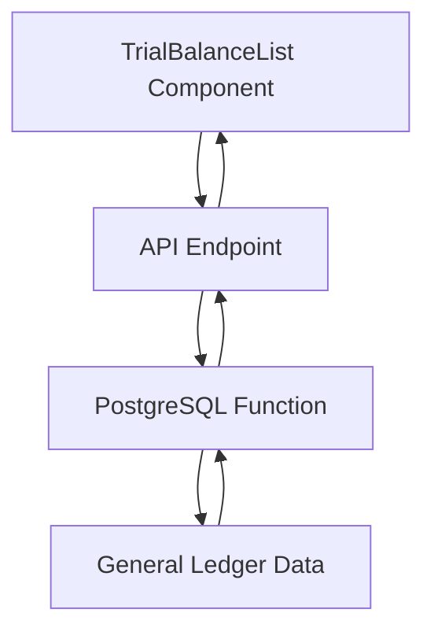
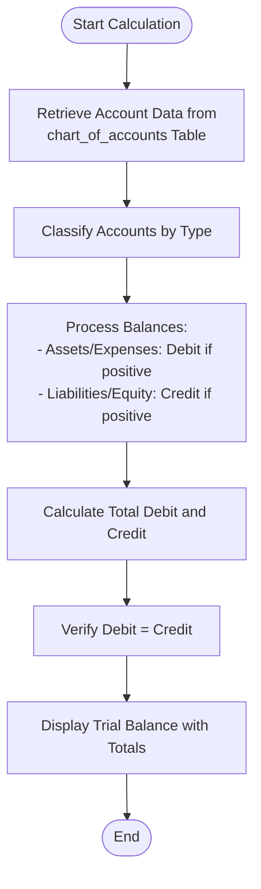
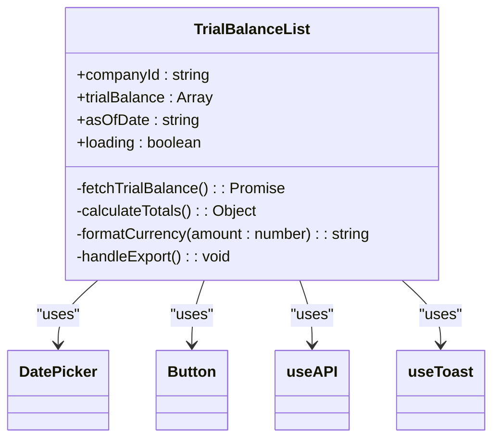
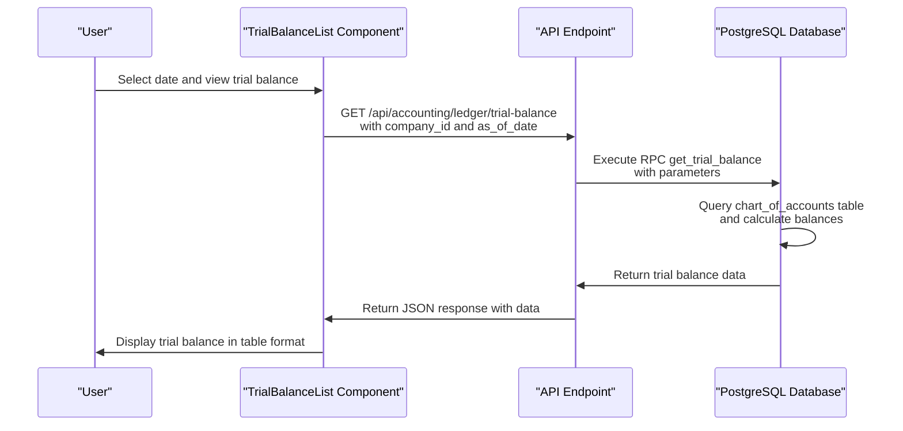
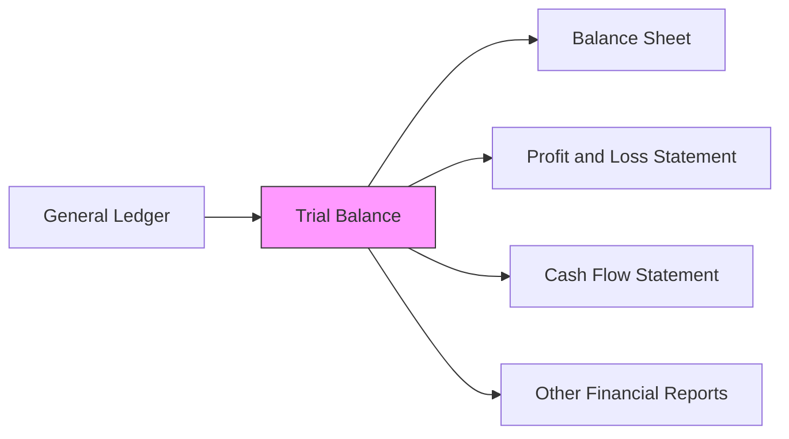

# Trial Balance

<cite>
**Referenced Files in This Document**   
- [TrialBalanceList.js](file://src/components/accounting/TrialBalanceList.js)
- [trial-balance.js](file://src/pages/accounting/trial-balance.js)
- [accountingService.js](file://src/services/accountingService.js)
- [trial-balance.js](file://src/pages/api/accounting/ledger/trial-balance.js)
</cite>

## Table of Contents
1. [Introduction](#introduction)
2. [Purpose of Trial Balance](#purpose-of-trial-balance)
3. [Implementation Overview](#implementation-overview)
4. [Trial Balance Calculation Process](#trial-balance-calculation-process)
5. [User Interface and Data Display](#user-interface-and-data-display)
6. [RPC Function Implementation](#rpc-function-implementation)
7. [Integration with Financial Statements](#integration-with-financial-statements)
8. [Common Issues and Error Handling](#common-issues-and-error-handling)
9. [Period Closing Procedures](#period-closing-procedures)
10. [Conclusion](#conclusion)

## Introduction
The trial balance system in ezbillify-v1 serves as a critical accounting control mechanism that verifies the mathematical accuracy of the company's financial records. This document provides a comprehensive analysis of the trial balance implementation, covering its purpose, technical architecture, user interface components, and integration with other financial reporting systems.

**Section sources**
- [trial-balance.js](file://src/pages/accounting/trial-balance.js#L1-L49)

## Purpose of Trial Balance
The trial balance in ezbillify-v1 serves as a fundamental accounting tool designed to verify the mathematical accuracy of the company's financial records. Its primary purpose is to ensure that total debits equal total credits across all accounts in the general ledger, which is a fundamental principle of double-entry accounting. By aggregating account balances and presenting them in a structured format, the trial balance helps identify potential errors in journal entries or posting processes before financial statements are prepared.

The system plays a crucial role in maintaining data integrity by providing a snapshot of all account balances at a specific point in time, allowing accountants to verify that the accounting equation (Assets = Liabilities + Equity) remains balanced. This verification process is essential for detecting errors such as incorrect postings, transposition errors, or omitted entries that could compromise the accuracy of financial reporting.

**Section sources**
- [accountingService.js](file://src/services/accountingService.js#L48-L58)
- [trial-balance.js](file://src/pages/api/accounting/ledger/trial-balance.js#L1-L98)

## Implementation Overview
The trial balance system in ezbillify-v1 follows a three-tier architecture consisting of a frontend user interface, an API layer, and a database layer with PostgreSQL functions. The implementation leverages Supabase as the backend service, utilizing its RPC (Remote Procedure Call) capabilities for efficient data processing at scale.

The system architecture separates concerns between data retrieval, processing, and presentation. The frontend component (TrialBalanceList) handles user interaction and data visualization, while the API endpoint (/api/accounting/ledger/trial-balance) manages authentication and request processing. The actual calculation logic is implemented as a PostgreSQL function (get_trial_balance), which ensures efficient processing of large datasets directly within the database engine.

This architectural approach optimizes performance by minimizing data transfer between the application and database layers, as the aggregation and calculation operations occur within the database where the data resides.

**Diagram sources**
- [TrialBalanceList.js](file://src/components/accounting/TrialBalanceList.js#L1-L189)
- [trial-balance.js](file://src/pages/api/accounting/ledger/trial-balance.js#L1-L98)
- [accountingService.js](file://src/services/accountingService.js#L48-L58)

**Section sources**
- [TrialBalanceList.js](file://src/components/accounting/TrialBalanceList.js#L1-L189)
- [accountingService.js](file://src/services/accountingService.js#L48-L58)

## Trial Balance Calculation Process
The trial balance calculation process in ezbillify-v1 involves aggregating account balances from the general ledger and verifying that total debits equal total credits. The system retrieves account data from the chart_of_accounts table, including account code, name, type, and current balance. Each account's balance is then classified as either debit or credit based on its account type according to standard accounting principles.

For asset, expense, and cost of goods sold (COGS) accounts, positive balances are displayed in the debit column, while negative balances appear in the credit column. Conversely, liability, equity, and income accounts show positive balances in the credit column and negative balances in the debit column. This classification ensures proper presentation according to accounting conventions.

The calculation process computes running totals for both debit and credit columns, with the system automatically detecting any discrepancies between the two totals. The difference is calculated and displayed to alert users of potential errors in the accounting records. This mathematical verification serves as a critical control mechanism before proceeding with financial statement preparation.

**Diagram sources**
- [trial-balance.js](file://src/pages/api/accounting/ledger/trial-balance.js#L24-L87)
- [accountingService.js](file://src/services/accountingService.js#L48-L58)

**Section sources**
- [trial-balance.js](file://src/pages/api/accounting/ledger/trial-balance.js#L24-L87)

## User Interface and Data Display
The TrialBalanceList component provides users with an intuitive interface for viewing and analyzing trial balance data. The user interface includes a date selector that allows users to generate trial balances for specific accounting periods, enabling historical analysis and period-to-period comparisons. The display presents accounts in a tabular format with columns for account code, account name, debit amount, and credit amount, sorted by account code for easy navigation.

The interface includes visual indicators for out-of-balance conditions, with any difference between total debits and credits highlighted in a red row below the totals. This immediate visual feedback helps users quickly identify potential issues in the accounting records. The component also provides refresh and export functionality, allowing users to update the data or export it for further analysis.

Users can interact with the trial balance data to verify the mathematical accuracy of the accounting records, with the system automatically calculating and displaying totals for both debit and credit columns. The responsive design ensures accessibility across different device types, and loading states provide feedback during data retrieval operations.

**Diagram sources**
- [TrialBalanceList.js](file://src/components/accounting/TrialBalanceList.js#L1-L189)

**Section sources**
- [TrialBalanceList.js](file://src/components/accounting/TrialBalanceList.js#L1-L189)

## RPC Function Implementation
The get_trial_balance RPC function is implemented as a PostgreSQL stored procedure that efficiently calculates trial balance data at scale. This server-side implementation ensures optimal performance by processing data directly within the database engine, minimizing network overhead and leveraging database indexing for rapid data retrieval.

The function accepts two parameters: the company ID (p_company_id) and the as-of date (p_as_of_date), allowing for historical trial balance generation. It queries the chart_of_accounts table to retrieve all accounts for the specified company, selecting essential fields including account ID, code, name, type, and current balance. The results are ordered by account code to maintain a consistent presentation order.

Within the function, account balances are classified into debit and credit columns based on standard accounting conventions. The implementation calculates running totals for both columns and computes any difference, which is returned as part of the result set. Error handling is implemented to manage database connectivity issues or data integrity problems, with appropriate error messages returned to the client.

The RPC approach provides several advantages, including reduced data transfer, improved security through parameterized queries, and better performance for large datasets. This implementation pattern aligns with best practices for building scalable financial applications.

**Diagram sources**
- [accountingService.js](file://src/services/accountingService.js#L48-L58)
- [trial-balance.js](file://src/pages/api/accounting/ledger/trial-balance.js#L1-L98)

**Section sources**
- [accountingService.js](file://src/services/accountingService.js#L48-L58)
- [trial-balance.js](file://src/pages/api/accounting/ledger/trial-balance.js#L1-L98)

## Integration with Financial Statements
The trial balance serves as a critical bridge between the general ledger and financial statements in ezbillify-v1. After verifying that debits equal credits, the trial balance data is used as the foundation for preparing key financial statements including the balance sheet, profit and loss statement, and cash flow statement.

The system uses the trial balance as an intermediate step in the accounting cycle, where adjusted account balances are transferred to financial statement templates. Account balances are reclassified according to financial statement requirements, with asset, liability, and equity accounts flowing to the balance sheet, while income and expense accounts are directed to the profit and loss statement.

This integration ensures consistency across financial reports, as all statements derive from the same verified set of account balances. The trial balance acts as a checkpoint that confirms the mathematical accuracy of the underlying data before it is used to generate financial statements, thereby maintaining the integrity of the entire reporting process.

**Diagram sources**
- [accountingService.js](file://src/services/accountingService.js#L48-L114)
- [trial-balance.js](file://src/pages/api/accounting/ledger/trial-balance.js#L1-L98)

**Section sources**
- [accountingService.js](file://src/services/accountingService.js#L48-L114)

## Common Issues and Error Handling
The trial balance system in ezbillify-v1 addresses several common accounting issues, with specific mechanisms for handling out-of-balance conditions, timing differences, and adjusting entries. When total debits do not equal total credits, the system highlights the difference in the user interface, allowing accountants to investigate and correct errors before proceeding with financial reporting.

Timing differences are managed through the as-of-date parameter, which enables users to generate trial balances for specific accounting periods. This functionality helps identify discrepancies arising from transactions recorded in different periods or from accrued expenses and deferred revenues that require adjusting entries.

The system implements comprehensive error handling at multiple levels. The API endpoint validates required parameters and returns appropriate HTTP status codes for different error conditions. Database errors are caught and logged, with user-friendly error messages returned to the client. Network issues and timeout conditions are handled gracefully in the frontend component, with loading states and error notifications providing feedback to users.

For out-of-balance trial balances, the system provides the exact difference amount, helping accountants quickly identify the scale of potential errors. This immediate feedback facilitates efficient error detection and resolution, reducing the time required for period-end closing procedures.

**Section sources**
- [trial-balance.js](file://src/pages/api/accounting/ledger/trial-balance.js#L88-L95)
- [TrialBalanceList.js](file://src/components/accounting/TrialBalanceList.js#L169-L178)

## Period Closing Procedures
The trial balance plays a vital role in period closing procedures within ezbillify-v1. Before closing an accounting period, users generate a trial balance to verify the mathematical accuracy of all ledger accounts. This verification ensures that all journal entries have been properly posted and that the fundamental accounting equation remains balanced.

The system supports month-end closing processes by providing accurate account balances that can be used to create adjusting entries for accruals, deferrals, depreciation, and other period-end adjustments. After adjustments are made, a revised trial balance is generated to confirm that debits still equal credits, ensuring the integrity of the adjusted financial data.

The trial balance serves as the final checkpoint before financial statements are generated, providing confidence that the underlying data is accurate and complete. This systematic approach to period closing helps maintain the reliability of financial reporting and supports compliance with accounting standards and regulatory requirements.

**Section sources**
- [accountingService.js](file://src/services/accountingService.js#L270-L298)
- [trial-balance.js](file://src/pages/api/accounting/ledger/trial-balance.js#L39-L87)

## Conclusion
The trial balance system in ezbillify-v1 provides a robust solution for verifying the mathematical accuracy of accounting records. By implementing a comprehensive architecture that spans from the user interface to database-level calculations, the system ensures reliable and efficient trial balance generation. The integration of the trial balance as a bridge between the general ledger and financial statements maintains data consistency across all financial reports.

The implementation effectively addresses common accounting challenges, including error detection, timing differences, and period closing procedures. With its user-friendly interface and scalable backend architecture, the system supports both day-to-day accounting operations and month-end closing processes. The use of PostgreSQL functions for calculation ensures optimal performance even with large datasets, making the trial balance system a critical component of ezbillify-v1's financial management capabilities.