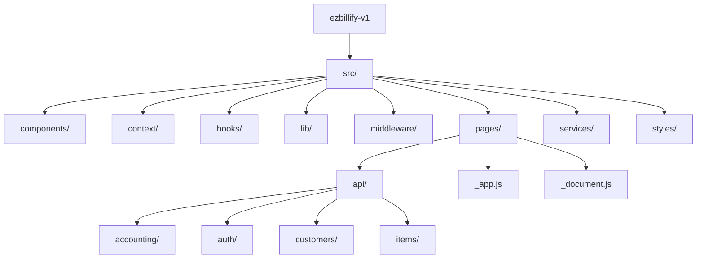
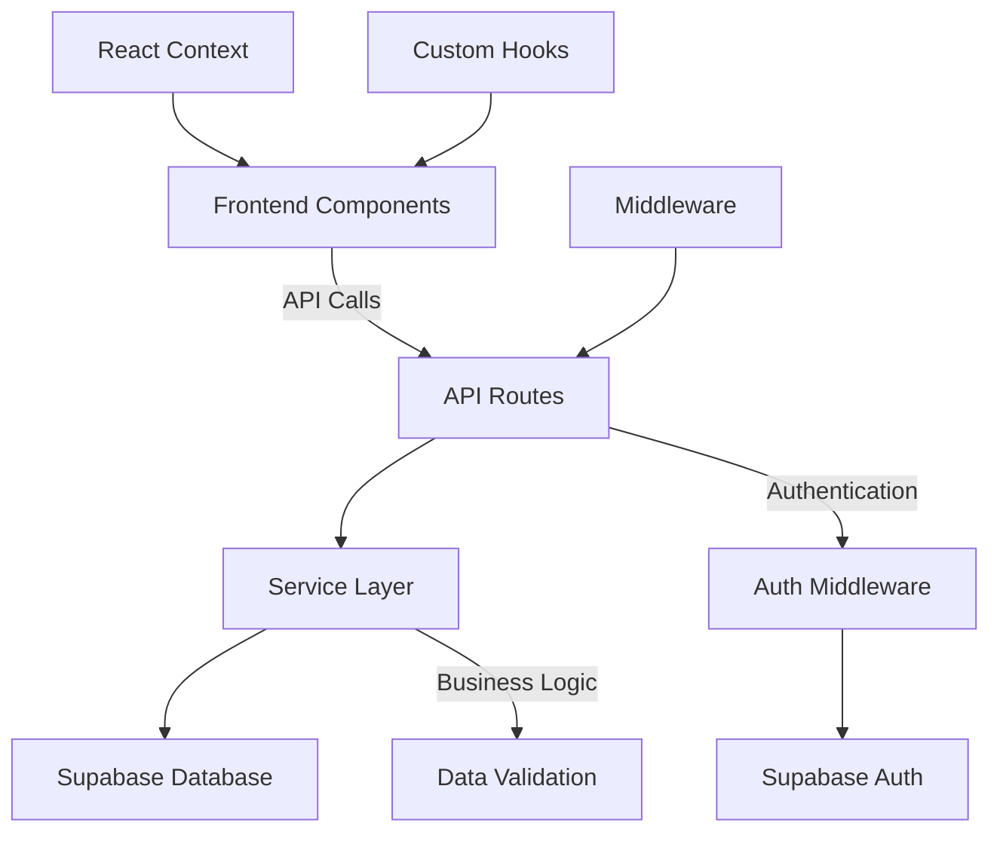
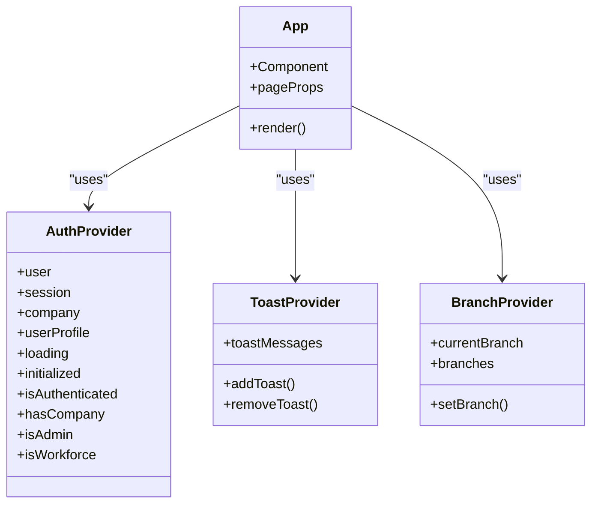
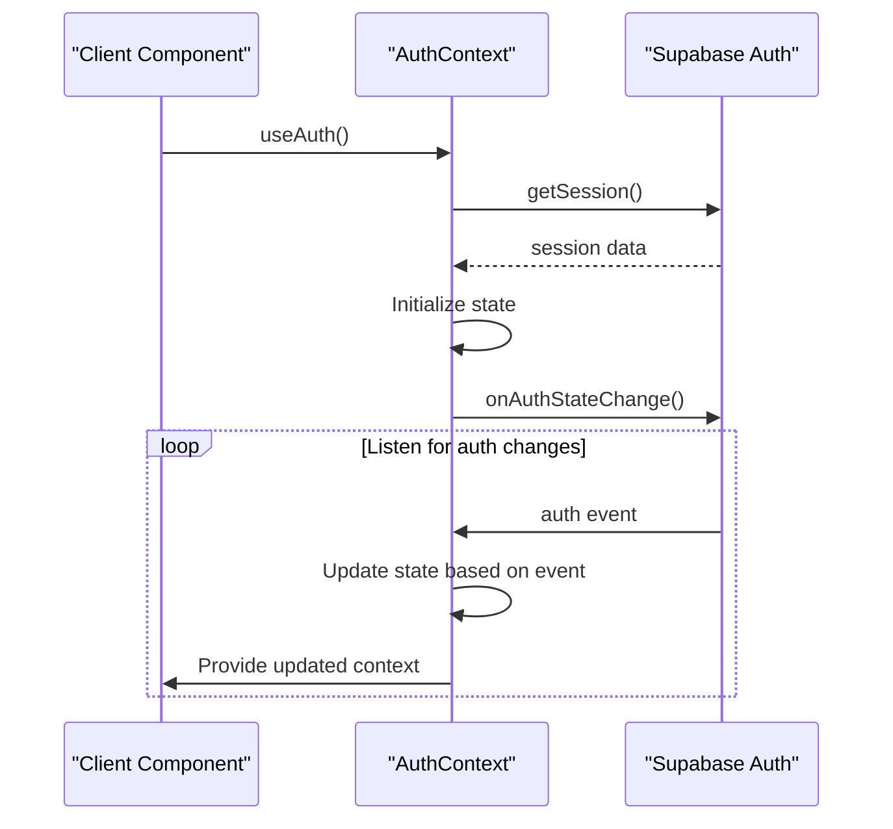
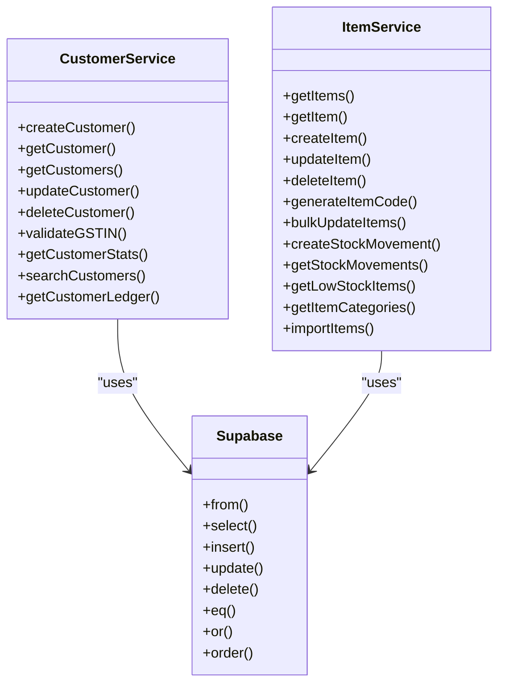
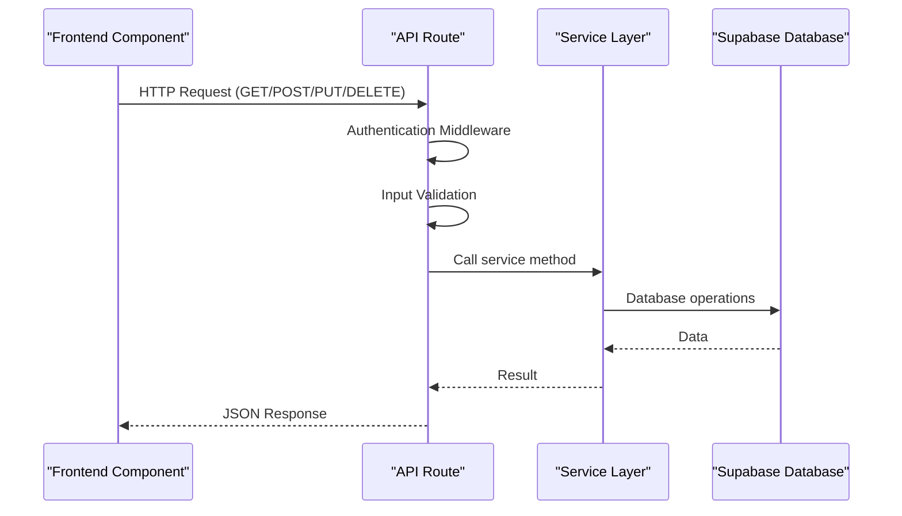
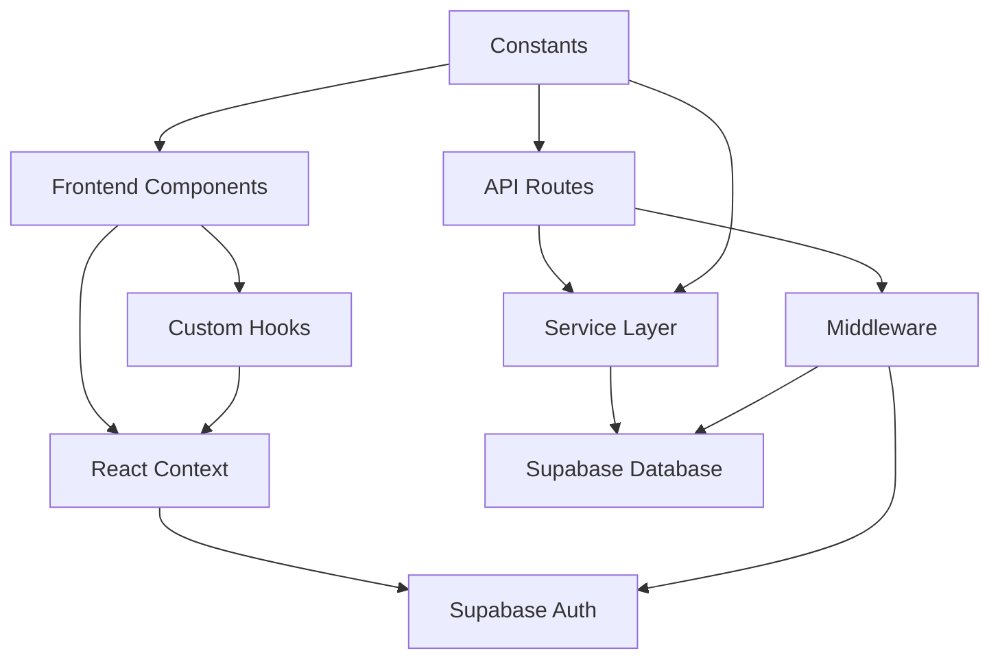

# Architecture Overview

<cite>
**Referenced Files in This Document**   
- [README.md](file://README.md)
- [package.json](file://package.json)
- [src/pages/_app.js](file://src/pages/_app.js)
- [src/context/AuthContext.js](file://src/context/AuthContext.js)
- [src/hooks/useAuth.js](file://src/hooks/useAuth.js)
- [src/lib/constants.js](file://src/lib/constants.js)
- [src/lib/db.js](file://src/lib/db.js)
- [src/lib/middleware.js](file://src/lib/middleware.js)
- [src/middleware/auth.js](file://src/middleware/auth.js)
- [src/services/utils/supabase.js](file://src/services/utils/supabase.js)
- [src/services/customerService.js](file://src/services/customerService.js)
- [src/services/itemService.js](file://src/services/itemService.js)
- [src/pages/api/customers/index.js](file://src/pages/api/customers/index.js)
- [src/pages/api/items/index.js](file://src/pages/api/items/index.js)
- [src/hooks/useAPI.js](file://src/hooks/useAPI.js)
</cite>

## Table of Contents
1. [Introduction](#introduction)
2. [Project Structure](#project-structure)
3. [Core Components](#core-components)
4. [Architecture Overview](#architecture-overview)
5. [Detailed Component Analysis](#detailed-component-analysis)
6. [Dependency Analysis](#dependency-analysis)
7. [Performance Considerations](#performance-considerations)
8. [Troubleshooting Guide](#troubleshooting-guide)
9. [Conclusion](#conclusion)

## Introduction
The ezbillify-v1 application is a comprehensive billing and accounting solution built as a Next.js full-stack application. This document provides an architectural overview of the system, detailing its component-based frontend, service layer business logic, API routes as backend endpoints, and integration with Supabase for data persistence. The architecture follows modern patterns including React Context for state management, custom hooks for reusable logic, service layer pattern for business logic separation, and middleware for authentication and authorization.

## Project Structure
The ezbillify-v1 application follows a well-organized directory structure that separates concerns and promotes maintainability. The project is structured around feature domains with clear separation between frontend components, business logic services, API routes, and shared utilities.

**Diagram sources**
- [src/pages/_app.js](file://src/pages/_app.js)
- [src/components/](file://src/components/)
- [src/services/](file://src/services/)
- [src/pages/api/](file://src/pages/api/)

**Section sources**
- [README.md](file://README.md)
- [package.json](file://package.json)

## Core Components
The ezbillify-v1 application is built around several core architectural components that work together to provide a robust billing and accounting solution. The system leverages React Context for global state management, particularly for authentication and user session data. Custom hooks provide reusable logic across components, while a service layer encapsulates business logic and data access operations.

The application implements a clear separation of concerns with components responsible for UI presentation, services handling business logic, and API routes serving as backend endpoints. This architecture enables maintainability, testability, and scalability of the application.

**Section sources**
- [src/context/AuthContext.js](file://src/context/AuthContext.js)
- [src/hooks/useAuth.js](file://src/hooks/useAuth.js)
- [src/lib/constants.js](file://src/lib/constants.js)
- [src/services/customerService.js](file://src/services/customerService.js)
- [src/services/itemService.js](file://src/services/itemService.js)

## Architecture Overview
The ezbillify-v1 application follows a full-stack Next.js architecture with a component-based frontend, service layer for business logic, and API routes as backend endpoints. The system is designed with scalability and maintainability in mind, implementing several architectural patterns to ensure clean separation of concerns.

**Diagram sources**
- [src/pages/_app.js](file://src/pages/_app.js)
- [src/context/AuthContext.js](file://src/context/AuthContext.js)
- [src/lib/middleware.js](file://src/lib/middleware.js)
- [src/services/utils/supabase.js](file://src/services/utils/supabase.js)

## Detailed Component Analysis

### Frontend Architecture
The frontend of ezbillify-v1 is built using React with Next.js, leveraging React Context for state management and custom hooks for reusable logic. The application uses a component-based architecture with components organized by feature domains such as accounting, sales, purchase, and master data.

The _app.js file serves as the entry point and wraps the application with multiple context providers for authentication, toast notifications, and branch management. This approach allows global state to be accessed throughout the component tree without prop drilling.

**Diagram sources**
- [src/pages/_app.js](file://src/pages/_app.js)
- [src/context/AuthContext.js](file://src/context/AuthContext.js)
- [src/context/ToastContext.js](file://src/context/ToastContext.js)
- [src/context/BranchContext.js](file://src/context/BranchContext.js)

**Section sources**
- [src/pages/_app.js](file://src/pages/_app.js)
- [src/context/AuthContext.js](file://src/context/AuthContext.js)

### State Management with React Context
The application implements React Context for managing global state across the application. The AuthContext provides authentication state including user information, session data, company details, and authorization roles. This context is consumed by components throughout the application to determine access rights and display user-specific information.

The context implementation follows best practices with proper initialization, cleanup, and error handling. It listens for authentication state changes from Supabase and updates the context accordingly, ensuring that the application state remains synchronized with the authentication state.

**Diagram sources**
- [src/context/AuthContext.js](file://src/context/AuthContext.js)
- [src/hooks/useAuth.js](file://src/hooks/useAuth.js)

### Service Layer Pattern
The application implements a service layer pattern to separate business logic from data access and presentation concerns. Services such as customerService and itemService encapsulate the business rules and operations related to their respective domains.

The service layer provides a clean API for components to interact with business logic without needing to understand the underlying data storage mechanisms. This abstraction enables easier testing, maintenance, and potential replacement of data storage technologies.

**Diagram sources**
- [src/services/customerService.js](file://src/services/customerService.js)
- [src/services/itemService.js](file://src/services/itemService.js)
- [src/services/utils/supabase.js](file://src/services/utils/supabase.js)

### API Routes and Backend Endpoints
The application uses Next.js API routes as backend endpoints, following the convention of placing API handlers in the pages/api directory. These routes serve as the interface between the frontend and the service layer, handling HTTP requests and responses.

Each API route implements proper error handling, input validation, and authentication/authorization checks. The routes follow RESTful principles with clear endpoints for different resources and operations.

**Diagram sources**
- [src/pages/api/customers/index.js](file://src/pages/api/customers/index.js)
- [src/pages/api/items/index.js](file://src/pages/api/items/index.js)
- [src/lib/middleware.js](file://src/lib/middleware.js)

## Dependency Analysis
The ezbillify-v1 application has a well-defined dependency structure with clear boundaries between components. The frontend components depend on custom hooks and context providers for state management, while the service layer depends on the Supabase client for data persistence.

The application uses Supabase as its primary backend service, leveraging its authentication, database, and storage capabilities. The dependency on Supabase is abstracted through utility modules, allowing for potential replacement with minimal impact on the rest of the application.

**Diagram sources**
- [package.json](file://package.json)
- [src/services/utils/supabase.js](file://src/services/utils/supabase.js)
- [src/lib/constants.js](file://src/lib/constants.js)

## Performance Considerations
The application implements several performance optimizations to ensure a responsive user experience. The useAPI hook includes caching mechanisms to reduce redundant API calls, with a 5-minute cache TTL for GET requests. The implementation also deduplicates concurrent requests to the same endpoint, preventing multiple identical requests from being sent simultaneously.

The service layer includes optimized database queries with proper indexing and pagination to handle large datasets efficiently. The customer service, for example, implements a caching strategy for ledger calculations to improve performance when viewing customer details.

**Section sources**
- [src/hooks/useAPI.js](file://src/hooks/useAPI.js)
- [src/services/customerService.js](file://src/services/customerService.js)
- [src/services/itemService.js](file://src/services/itemService.js)

## Troubleshooting Guide
When troubleshooting issues in the ezbillify-v1 application, consider the following common areas:

1. **Authentication issues**: Verify that the Supabase environment variables are correctly configured and that the user session is valid. Check the browser's local storage for the presence of authentication tokens.

2. **API connectivity problems**: Ensure that the API routes are properly protected with authentication middleware and that the Supabase client is correctly initialized with the appropriate credentials.

3. **Data loading errors**: Verify that the database schema matches the expected structure and that the service layer methods are correctly handling database operations.

4. **State management issues**: Check that context providers are properly wrapped around components that consume them and that state updates are being handled correctly.

**Section sources**
- [src/context/AuthContext.js](file://src/context/AuthContext.js)
- [src/lib/middleware.js](file://src/lib/middleware.js)
- [src/services/utils/supabase.js](file://src/services/utils/supabase.js)

## Conclusion
The ezbillify-v1 application demonstrates a well-architected Next.js full-stack solution with clear separation of concerns, reusable components, and scalable patterns. The architecture effectively combines React's component model with service-oriented business logic and secure API endpoints.

Key architectural strengths include the use of React Context for global state management, custom hooks for reusable logic, a dedicated service layer for business rules, and middleware for cross-cutting concerns like authentication and authorization. The integration with Supabase provides a robust backend with authentication, database, and storage capabilities.

The application is well-positioned for future growth and maintenance, with a structure that supports adding new features, improving performance, and adapting to changing requirements.