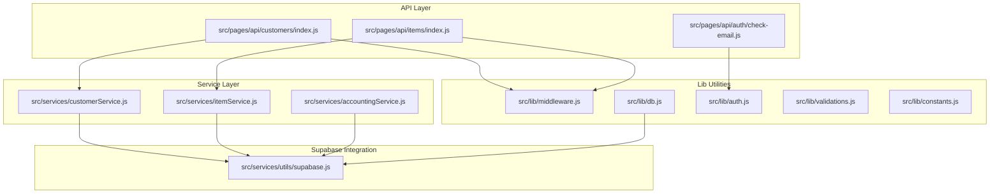
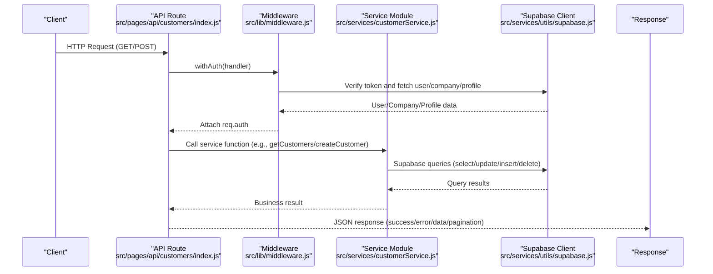
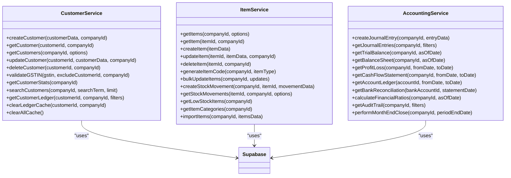
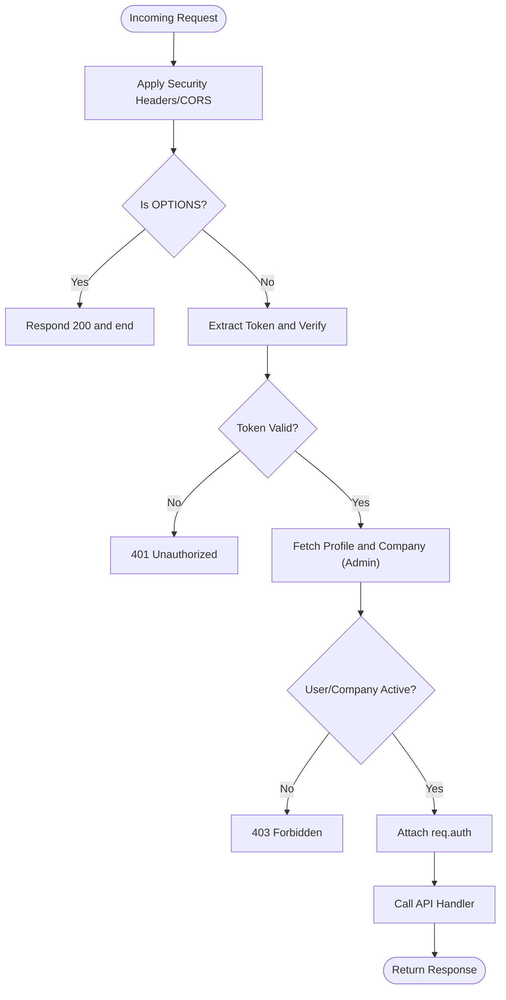
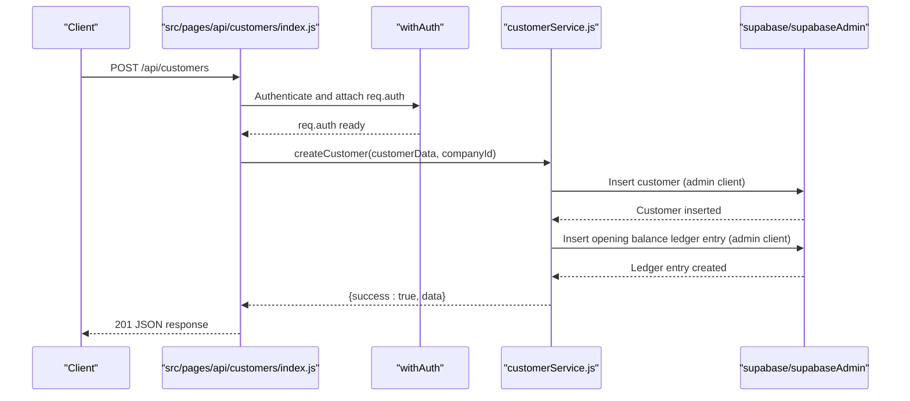
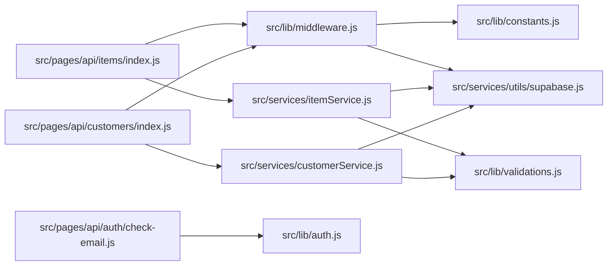

# Backend Architecture

<cite>
**Referenced Files in This Document**
- [README.md](file://README.md)
- [src/lib/db.js](file://src/lib/db.js)
- [src/lib/middleware.js](file://src/lib/middleware.js)
- [src/lib/auth.js](file://src/lib/auth.js)
- [src/lib/validations.js](file://src/lib/validations.js)
- [src/lib/constants.js](file://src/lib/constants.js)
- [src/services/utils/supabase.js](file://src/services/utils/supabase.js)
- [src/services/accountingService.js](file://src/services/accountingService.js)
- [src/services/customerService.js](file://src/services/customerService.js)
- [src/services/itemService.js](file://src/services/itemService.js)
- [src/pages/api/customers/index.js](file://src/pages/api/customers/index.js)
- [src/pages/api/items/index.js](file://src/pages/api/items/index.js)
- [src/pages/api/auth/check-email.js](file://src/pages/api/auth/check-email.js)
- [src/middleware/auth.js](file://src/middleware/auth.js)
</cite>

## Table of Contents
1. [Introduction](#introduction)
2. [Project Structure](#project-structure)
3. [Core Components](#core-components)
4. [Architecture Overview](#architecture-overview)
5. [Detailed Component Analysis](#detailed-component-analysis)
6. [Dependency Analysis](#dependency-analysis)
7. [Performance Considerations](#performance-considerations)
8. [Troubleshooting Guide](#troubleshooting-guide)
9. [Conclusion](#conclusion)

## Introduction
This document describes the backend architecture of ezbillify-v1, focusing on the Next.js API routes implemented as serverless functions, the service layer pattern, middleware for authentication and authorization, Supabase integration for database and auth, and robust error handling, input validation, and security practices. It also illustrates the end-to-end flow from HTTP request to database operation and response generation using concrete examples.

## Project Structure
The backend follows a layered architecture:
- API routes under src/pages/api implement Next.js serverless functions mapped to /api/* endpoints.
- A service layer under src/services encapsulates business logic and interacts with Supabase.
- Shared utilities under src/lib provide database helpers, middleware, auth wrappers, validations, and constants.
- Supabase client utilities under src/services/utils manage authenticated and admin clients.

**Diagram sources**
- [src/pages/api/customers/index.js](file://src/pages/api/customers/index.js#L1-L434)
- [src/pages/api/items/index.js](file://src/pages/api/items/index.js#L1-L400)
- [src/pages/api/auth/check-email.js](file://src/pages/api/auth/check-email.js#L1-L39)
- [src/services/customerService.js](file://src/services/customerService.js#L1-L488)
- [src/services/itemService.js](file://src/services/itemService.js#L1-L504)
- [src/services/accountingService.js](file://src/services/accountingService.js#L1-L301)
- [src/lib/middleware.js](file://src/lib/middleware.js#L1-L627)
- [src/lib/db.js](file://src/lib/db.js#L1-L307)
- [src/lib/auth.js](file://src/lib/auth.js#L1-L87)
- [src/lib/validations.js](file://src/lib/validations.js#L1-L464)
- [src/lib/constants.js](file://src/lib/constants.js#L1-L458)
- [src/services/utils/supabase.js](file://src/services/utils/supabase.js#L1-L392)

**Section sources**
- [README.md](file://README.md#L1-L43)
- [src/pages/api/customers/index.js](file://src/pages/api/customers/index.js#L1-L434)
- [src/pages/api/items/index.js](file://src/pages/api/items/index.js#L1-L400)
- [src/services/customerService.js](file://src/services/customerService.js#L1-L488)
- [src/services/itemService.js](file://src/services/itemService.js#L1-L504)
- [src/lib/middleware.js](file://src/lib/middleware.js#L1-L627)
- [src/lib/db.js](file://src/lib/db.js#L1-L307)
- [src/services/utils/supabase.js](file://src/services/utils/supabase.js#L1-L392)

## Core Components
- Supabase client utilities: Provide authenticated and admin clients, real-time subscriptions, storage helpers, and error mapping.
- Database helpers: Unified CRUD, search, aggregation, batch operations, transactions, and company-scoped helpers.
- Middleware: Authentication wrapper, role/permission checks, validation, rate limiting, security headers, logging, and error handling.
- Auth utilities: High-level auth operations for sign-up, sign-in, sign-out, sessions, passwords, and OTP verification.
- Validation library: Comprehensive validators and a schema builder for request validation.
- Constants: Roles, document types/statuses, payment methods, GST utilities, currencies, and API endpoints.
- Services: Business logic modules for customers, items, accounting, and other domain areas.

**Section sources**
- [src/services/utils/supabase.js](file://src/services/utils/supabase.js#L1-L392)
- [src/lib/db.js](file://src/lib/db.js#L1-L307)
- [src/lib/middleware.js](file://src/lib/middleware.js#L1-L627)
- [src/lib/auth.js](file://src/lib/auth.js#L1-L87)
- [src/lib/validations.js](file://src/lib/validations.js#L1-L464)
- [src/lib/constants.js](file://src/lib/constants.js#L1-L458)

## Architecture Overview
The backend uses Next.js serverless functions as API endpoints. Each API route:
- Applies middleware for authentication, authorization, validation, and security.
- Delegates business logic to service modules.
- Uses Supabase for database operations and authentication.
- Returns standardized JSON responses with success/error fields and pagination metadata where applicable.

**Diagram sources**
- [src/pages/api/customers/index.js](file://src/pages/api/customers/index.js#L1-L434)
- [src/lib/middleware.js](file://src/lib/middleware.js#L1-L627)
- [src/services/customerService.js](file://src/services/customerService.js#L1-L488)
- [src/services/utils/supabase.js](file://src/services/utils/supabase.js#L1-L392)

## Detailed Component Analysis

### API Routes Implementation Pattern
- Request handling pattern:
  - Switch on HTTP method (GET/POST/PUT/DELETE) inside handler.
  - Validate presence of required parameters (e.g., company_id).
  - Apply middleware for auth and validation.
  - Delegate to service module for business logic.
  - Return standardized JSON with success flag, data, and pagination where applicable.
- Response formatting:
  - Success responses include success: true and data payload.
  - Error responses include success: false and error message; include details in development.
  - Pagination responses include current_page, total_pages, total_records, per_page, has_next_page, has_prev_page.

Examples:
- Customers API route: GET lists customers with filtering, sorting, pagination, and computed balances; POST creates a customer with validation and duplicate checks.
- Items API route: GET lists items with joins and tax_rate normalization; POST creates items with barcode arrays and opening stock movement.

**Section sources**
- [src/pages/api/customers/index.js](file://src/pages/api/customers/index.js#L1-L434)
- [src/pages/api/items/index.js](file://src/pages/api/items/index.js#L1-L400)

### Service Layer Pattern
- Service modules encapsulate business logic and coordinate Supabase operations.
- Example: customerService handles creation, updates, validation, statistics, and ledger caching; itemService manages items, stock movements, and imports.
- Services return structured results with success/error fields and data for consistent API responses.

**Diagram sources**
- [src/services/customerService.js](file://src/services/customerService.js#L1-L488)
- [src/services/itemService.js](file://src/services/itemService.js#L1-L504)
- [src/services/accountingService.js](file://src/services/accountingService.js#L1-L301)
- [src/services/utils/supabase.js](file://src/services/utils/supabase.js#L1-L392)

**Section sources**
- [src/services/customerService.js](file://src/services/customerService.js#L1-L488)
- [src/services/itemService.js](file://src/services/itemService.js#L1-L504)
- [src/services/accountingService.js](file://src/services/accountingService.js#L1-L301)

### Middleware Architecture: Authentication and Authorization
- Authentication wrapper:
  - Validates Bearer tokens from Authorization header, cookies, or x-auth-token.
  - Verifies token with Supabase and fetches user profile and company with admin client to bypass RLS.
  - Checks user/company activation status and attaches req.auth with user, profile, company, role, permissions.
  - Updates last login counters via admin client.
- Authorization:
  - Role-based access: withRole(allowedRoles).
  - Permission-based access: withPermission(requiredPermission).
  - Legacy auth middleware for backward compatibility.
- Validation middleware:
  - validateBody(schema): Joi-like validation via ValidationSchema.
  - validateUUID(paramName): UUID format validation.
  - validatePagination(req, res, next): page/limit bounds.
  - validateDateRange(req, res, next): date parsing and ordering.
- Rate limiting:
  - createRateLimit(windowMs, maxRequests): in-memory limiter by IP.
  - createUserRateLimit(windowMs, maxRequests): limiter by authenticated user.
- Security:
  - securityHeaders: X-Content-Type-Options, X-Frame-Options, X-XSS-Protection, Referrer-Policy, Permissions-Policy, HSTS.
  - CSP: restricts connect-src to Supabase and trusted domains.
  - CORS: configurable origins and headers.
- Error handling:
  - asyncHandler(fn): wraps async handlers to catch errors.
  - errorHandler(err, req, res, next): maps Supabase codes to HTTP status, handles validation errors, and logs.
  - notFound: 404 handler.
- Logging and audit:
  - requestLogger: logs basic request metrics.
  - apiLogger: logs detailed API events with user/company context.
  - auditLogger(action): writes audit logs to Supabase.

**Diagram sources**
- [src/lib/middleware.js](file://src/lib/middleware.js#L1-L627)

**Section sources**
- [src/lib/middleware.js](file://src/lib/middleware.js#L1-L627)
- [src/middleware/auth.js](file://src/middleware/auth.js#L1-L252)

### Integration with Supabase
- Clients:
  - supabase: authenticated client with RLS for user-facing operations.
  - supabaseAdmin: service role client to bypass RLS for admin tasks (profile/company fetch, audit logs, last login updates).
- Helpers:
  - db helpers: CRUD, search, aggregation, batch ops, transactions, subscriptions.
  - realtime helpers: subscribe to company, sales documents, payments channels.
  - storage helpers: upload logo, thermal logo, letterhead, and delete files.
  - error mapping: friendly messages for common auth/database errors.
- Company-scoped operations: create/read/update/delete with company_id filters.

**Section sources**
- [src/services/utils/supabase.js](file://src/services/utils/supabase.js#L1-L392)
- [src/lib/db.js](file://src/lib/db.js#L1-L307)

### Error Handling, Input Validation, and Security Practices
- Error handling:
  - Centralized errorHandler maps Supabase error codes to appropriate HTTP status codes.
  - ValidationError handling returns structured validation failures with details.
  - Async error boundary via asyncHandler.
  - 404 handler for unmatched routes.
- Input validation:
  - ValidationSchema and validators cover required fields, emails, phones, GSTIN/PAN, numeric ranges, dates, URLs, UUIDs, arrays, and objects.
  - API routes apply validation middleware and manual checks for business rules.
- Security:
  - Strict transport security, frame options, XSS protection, referrer policy, permissions policy.
  - Content Security Policy restricting connect-src to Supabase and trusted endpoints.
  - CORS with allowed origins and headers; preflight handling.
  - Audit logging for sensitive actions.

**Section sources**
- [src/lib/middleware.js](file://src/lib/middleware.js#L1-L627)
- [src/lib/validations.js](file://src/lib/validations.js#L1-L464)
- [src/lib/constants.js](file://src/lib/constants.js#L1-L458)

### Example: Customer API Route and Service Flow
- API route (GET):
  - Validates company_id, applies filters (type, status, search), sorts, paginates.
  - Computes balances for list view by aggregating ledger entries.
  - Returns success with data and pagination.
- API route (POST):
  - Validates required fields, email/GSTIN/PAN formats, discount percentage range.
  - Checks duplicates by email/GSTIN.
  - Generates customer code if not provided.
  - Inserts customer and creates opening balance ledger entry.
  - Returns success with created customer data.
- Service function:
  - customerService.getCustomers/getCustomer/createCustomer/updateCustomer/deleteCustomer/validateGSTIN/getCustomerStats/searchCustomers/getCustomerLedger/clearLedgerCache/clearAllCache.

**Diagram sources**
- [src/pages/api/customers/index.js](file://src/pages/api/customers/index.js#L1-L434)
- [src/services/customerService.js](file://src/services/customerService.js#L1-L488)
- [src/services/utils/supabase.js](file://src/services/utils/supabase.js#L1-L392)

**Section sources**
- [src/pages/api/customers/index.js](file://src/pages/api/customers/index.js#L1-L434)
- [src/services/customerService.js](file://src/services/customerService.js#L1-L488)

### Example: Items API Route and Service Flow
- API route (GET):
  - Joins units and tax_rates to enrich item data.
  - Normalizes tax_rate fields in response for frontend consumption.
  - Supports low_stock filtering and pagination.
- API route (POST):
  - Validates item_type, item_code uniqueness, and barcode formats.
  - Supports single barcode or array of barcodes.
  - Creates item and opening stock movement if applicable.
- Service function:
  - itemService.getItems/getItem/createItem/updateItem/deleteItem/generateItemCode/bulkUpdateItems/createStockMovement/getStockMovements/getLowStockItems/getItemCategories/importItems.

**Section sources**
- [src/pages/api/items/index.js](file://src/pages/api/items/index.js#L1-L400)
- [src/services/itemService.js](file://src/services/itemService.js#L1-L504)

### Example: Auth Endpoint (Email Existence Check)
- API route (POST /api/auth/check-email):
  - Validates presence of email.
  - Attempts to sign in with OTP to probe existence without creating user.
  - Returns exists: false if user not found; otherwise exists: true.

**Section sources**
- [src/pages/api/auth/check-email.js](file://src/pages/api/auth/check-email.js#L1-L39)

## Dependency Analysis
- API routes depend on:
  - Middleware for auth/role/validation/security.
  - Service modules for business logic.
  - Supabase client for database operations.
- Services depend on:
  - Supabase client for queries.
  - Validation library for input checks.
  - Constants for enums and patterns.
- Middleware depends on:
  - Supabase client for auth verification.
  - Validation library for schema validation.
  - Logging and error handling utilities.

**Diagram sources**
- [src/pages/api/customers/index.js](file://src/pages/api/customers/index.js#L1-L434)
- [src/pages/api/items/index.js](file://src/pages/api/items/index.js#L1-L400)
- [src/pages/api/auth/check-email.js](file://src/pages/api/auth/check-email.js#L1-L39)
- [src/lib/middleware.js](file://src/lib/middleware.js#L1-L627)
- [src/services/customerService.js](file://src/services/customerService.js#L1-L488)
- [src/services/itemService.js](file://src/services/itemService.js#L1-L504)
- [src/lib/auth.js](file://src/lib/auth.js#L1-L87)
- [src/services/utils/supabase.js](file://src/services/utils/supabase.js#L1-L392)
- [src/lib/validations.js](file://src/lib/validations.js#L1-L464)
- [src/lib/constants.js](file://src/lib/constants.js#L1-L458)

**Section sources**
- [src/lib/middleware.js](file://src/lib/middleware.js#L1-L627)
- [src/services/utils/supabase.js](file://src/services/utils/supabase.js#L1-L392)
- [src/lib/validations.js](file://src/lib/validations.js#L1-L464)
- [src/lib/constants.js](file://src/lib/constants.js#L1-L458)

## Performance Considerations
- Pagination limits: API routes enforce minimum/maximum page sizes and compute offsets efficiently.
- Selectivity: API routes use targeted selects and joins; services minimize round-trips with batch operations and caching (e.g., customer ledger cache).
- Indexing and queries: Supabase helpers support filtering, ordering, and range queries; use appropriate indexes on company_id and frequently queried fields.
- Transactions: db.transaction batches related operations atomically; use for multi-table updates.
- Real-time: Supabase subscriptions enable reactive UI updates; use sparingly to avoid overhead.

[No sources needed since this section provides general guidance]

## Troubleshooting Guide
- Authentication failures:
  - Verify Authorization header format and token validity.
  - Check user/company activation status and profile completeness.
- Validation errors:
  - Review validation messages and ensure request body conforms to schemas.
- Supabase errors:
  - Map error codes to user-friendly messages; inspect error details in development.
- Rate limiting:
  - Adjust windowMs/maxRequests or differentiate by user/IP as needed.
- Logging:
  - Use apiLogger to capture request metrics and audit trails; enable production filtering.

**Section sources**
- [src/lib/middleware.js](file://src/lib/middleware.js#L1-L627)
- [src/lib/db.js](file://src/lib/db.js#L1-L307)

## Conclusion
The backend employs a clean separation of concerns with Next.js serverless API routes, a robust service layer, and Supabase for database and authentication. Middleware enforces authentication, authorization, validation, security, and error handling consistently across endpoints. The architecture emphasizes standardized responses, performance-conscious query patterns, and maintainable business logic.