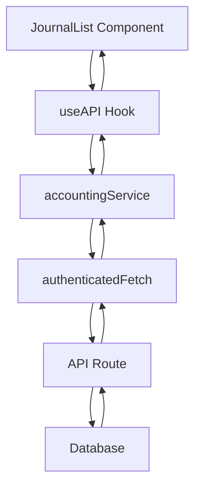
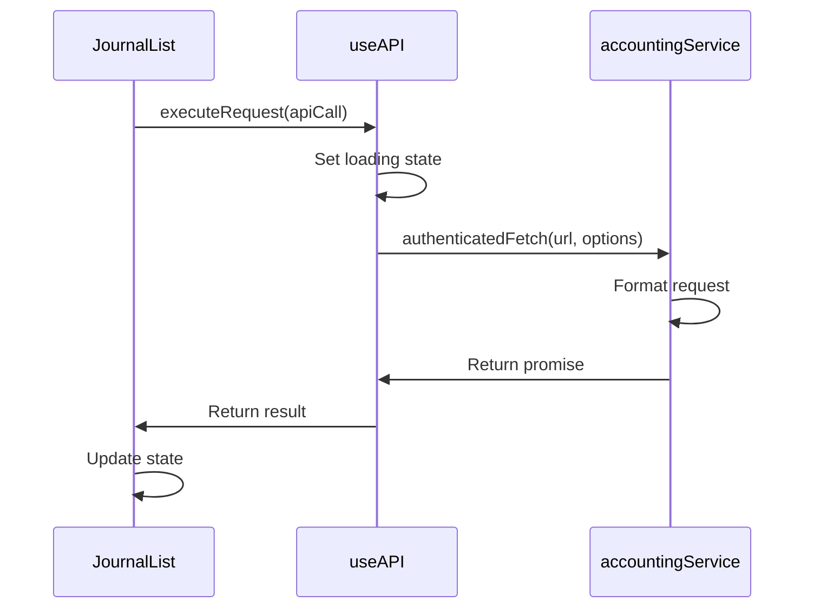
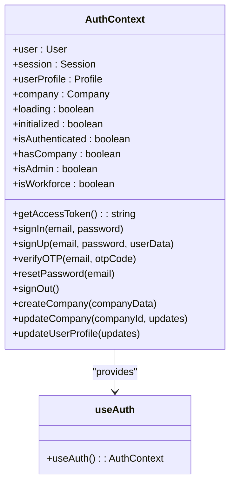
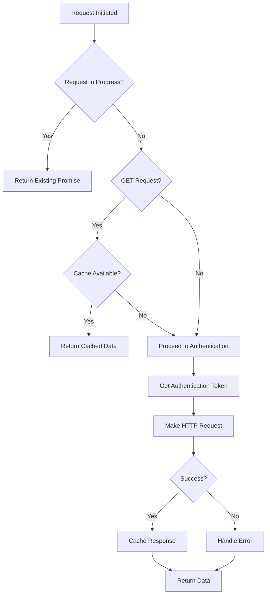
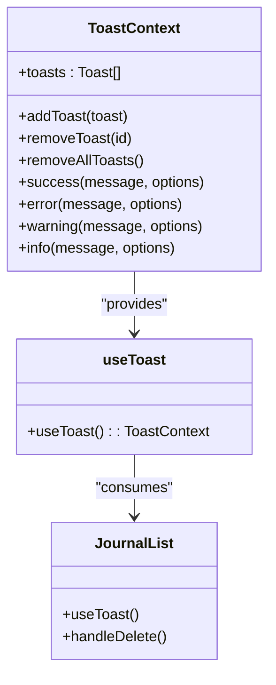

# Client-Side Data Flow

<cite>
**Referenced Files in This Document**   
- [JournalList.js](file://src/components/accounting/JournalList.js)
- [useAPI.js](file://src/hooks/useAPI.js)
- [useAuth.js](file://src/hooks/useAuth.js)
- [AuthContext.js](file://src/context/AuthContext.js)
- [accountingService.js](file://src/services/accountingService.js)
- [ToastContext.js](file://src/context/ToastContext.js)
- [supabase.js](file://src/services/utils/supabase.js)
- [_app.js](file://src/pages/_app.js)
- [constants.js](file://src/lib/constants.js)
</cite>

## Table of Contents
1. [Introduction](#introduction)
2. [Core Components Overview](#core-components-overview)
3. [Data Flow Architecture](#data-flow-architecture)
4. [Component to Hook Communication](#component-to-hook-communication)
5. [Authentication State Management](#authentication-state-management)
6. [Service Layer Implementation](#service-layer-implementation)
7. [API Request Execution](#api-request-execution)
8. [Response Handling and State Management](#response-handling-and-state-management)
9. [Error Handling and User Feedback](#error-handling-and-user-feedback)
10. [Caching and Performance Optimization](#caching-and-performance-optimization)
11. [Real-Time Updates and Data Synchronization](#real-time-updates-and-data-synchronization)
12. [Common Issues and Troubleshooting](#common-issues-and-troubleshooting)

## Introduction

The client-side data flow in ezbillify-v1 follows a structured pattern that connects React components with backend API routes through a series of abstraction layers. This documentation details the complete flow from component initialization to data persistence, focusing on the interaction between the JournalList component, custom hooks, service modules, and Next.js API routes. The system implements robust authentication handling, error management, and user feedback mechanisms to ensure a reliable user experience.

**Section sources**
- [JournalList.js](file://src/components/accounting/JournalList.js)
- [useAPI.js](file://src/hooks/useAPI.js)
- [useAuth.js](file://src/hooks/useAuth.js)

## Core Components Overview

The client-side data flow in ezbillify-v1 is built around several core components that work together to manage data operations. The JournalList component serves as a primary example of how data is retrieved, displayed, and manipulated in the application. This component relies on custom hooks like useAPI and useAuth to handle data fetching and authentication state, respectively. The service layer, represented by modules like accountingService.js, encapsulates business logic and formats requests before they are sent to the API routes.

The architecture follows a clear separation of concerns, with each layer having specific responsibilities:
- **Components**: Handle UI rendering and user interaction
- **Hooks**: Manage state and provide data fetching capabilities
- **Service Layer**: Encapsulate business logic and data formatting
- **API Routes**: Handle server-side operations and database interactions

This layered approach ensures maintainability and testability throughout the application.

**Section sources**
- [JournalList.js](file://src/components/accounting/JournalList.js)
- [accountingService.js](file://src/services/accountingService.js)
- [useAPI.js](file://src/hooks/useAPI.js)

## Data Flow Architecture

The data flow architecture in ezbillify-v1 follows a unidirectional pattern from component to API route. When a user interacts with the JournalList component, the data request flows through multiple layers before reaching the server. The process begins with the component calling a hook function, which then invokes the appropriate service method. The service layer formats the request and passes it to the useAPI hook, which handles the actual HTTP request and authentication token injection.

**Diagram sources**
- [JournalList.js](file://src/components/accounting/JournalList.js)
- [useAPI.js](file://src/hooks/useAPI.js)
- [accountingService.js](file://src/services/accountingService.js)

**Section sources**
- [JournalList.js](file://src/components/accounting/JournalList.js)
- [useAPI.js](file://src/hooks/useAPI.js)
- [accountingService.js](file://src/services/accountingService.js)

## Component to Hook Communication

The JournalList component initiates data requests through the useAPI custom hook, which provides a clean interface for API operations. When the component mounts or when filters change, it calls the fetchJournalEntries function, which uses the executeRequest method from useAPI to perform the actual data fetching. This pattern abstracts the complexity of HTTP requests from the component, allowing it to focus on UI concerns.

The communication between component and hook follows React's best practices for data fetching. The JournalList component uses useEffect to trigger data loading when dependencies change, and it manages local state for entries, filters, and pagination. The useAPI hook provides loading and error states that the component can use to render appropriate UI elements, such as loading spinners or error messages.

**Diagram sources**
- [JournalList.js](file://src/components/accounting/JournalList.js)
- [useAPI.js](file://src/hooks/useAPI.js)

**Section sources**
- [JournalList.js](file://src/components/accounting/JournalList.js)
- [useAPI.js](file://src/hooks/useAPI.js)

## Authentication State Management

Authentication state is managed through the AuthContext and useAuth hook, which provide a centralized way to handle user authentication across the application. The AuthContext stores the user session, profile, and company information, while the useAuth hook provides a simple interface for components to access this data. This context is initialized in the _app.js file, ensuring it is available to all components in the application.

The authentication flow includes token management and automatic refresh capabilities. When a request is made, the useAPI hook calls getAccessToken from the useAuth hook to retrieve the current JWT token. If the token is expired or about to expire, the system automatically attempts to refresh it before proceeding with the request. This ensures that users don't experience unexpected authentication failures during their session.

**Diagram sources**
- [AuthContext.js](file://src/context/AuthContext.js)
- [useAuth.js](file://src/hooks/useAuth.js)

**Section sources**
- [AuthContext.js](file://src/context/AuthContext.js)
- [useAuth.js](file://src/hooks/useAuth.js)
- [_app.js](file://src/pages/_app.js)

## Service Layer Implementation

The service layer in ezbillify-v1 encapsulates business logic and data formatting operations, providing a clean interface between components and API routes. The accountingService.js module is a prime example of this pattern, containing methods for creating and retrieving journal entries, generating financial reports, and performing accounting operations. Each service method handles data formatting and validation before making API calls, ensuring consistency across the application.

Service methods typically follow a consistent pattern: they accept parameters from components or hooks, format the data according to business rules, and return promises that resolve with the result of the operation. This abstraction allows components to remain focused on UI concerns while the service layer handles the complexities of data manipulation and API communication.

The service layer also provides type safety and documentation benefits, as each method's purpose and parameters are clearly defined. This makes the codebase more maintainable and easier to understand for new developers.

**Section sources**
- [accountingService.js](file://src/services/accountingService.js)
- [supabase.js](file://src/services/utils/supabase.js)

## API Request Execution

API requests in ezbillify-v1 are executed through the authenticatedFetch method in the useAPI hook, which handles the low-level details of HTTP communication. This method implements request deduplication, caching, and authentication token injection to optimize performance and reliability. When a request is made, the system first checks if an identical request is already in progress, preventing duplicate network calls for the same data.

The authenticatedFetch method also handles JWT token management, automatically including the user's access token in the Authorization header of each request. If no token is available, it attempts to retrieve one from the Supabase auth session or refresh an expired token. This ensures that all API requests are properly authenticated without requiring components to manage authentication state directly.

Request caching is implemented using an in-memory Map object, with configurable cache times (default 5 minutes for GET requests). This reduces network traffic and improves application responsiveness, especially for frequently accessed data like journal entries or customer lists.

**Diagram sources**
- [useAPI.js](file://src/hooks/useAPI.js)

**Section sources**
- [useAPI.js](file://src/hooks/useAPI.js)

## Response Handling and State Management

Response handling in ezbillify-v1 follows a consistent pattern across all components, with the useAPI hook providing a standardized interface for managing API responses. When a request completes, the hook returns a result object containing a success flag, data, and error information. Components can then use this information to update their state and render appropriate UI elements.

The JournalList component demonstrates this pattern by using the result of API calls to update its entries state and display success or error messages to the user. For successful requests, it updates the local state with the retrieved data and pagination information. For failed requests, it relies on the ToastContext to display error messages to the user.

State management is handled using React's useState and useEffect hooks, with components maintaining local state for data, loading status, and user interactions. This local state is updated in response to API results, user actions, or changes in route parameters, ensuring the UI remains synchronized with the application's data.

**Section sources**
- [JournalList.js](file://src/components/accounting/JournalList.js)
- [useAPI.js](file://src/hooks/useAPI.js)

## Error Handling and User Feedback

Error handling in ezbillify-v1 is implemented through a combination of the useAPI hook and ToastContext, providing users with clear feedback about the success or failure of their actions. When an API request fails, the useAPI hook captures the error and returns it to the calling component, which can then decide how to present it to the user.

The ToastContext provides a centralized way to display temporary messages to users, with different variants for success, error, warning, and informational messages. Components like JournalList use the useToast hook to access these capabilities, calling methods like success() or error() to display appropriate feedback. This ensures a consistent user experience across the application, with all messages appearing in the same location and following the same visual style.

Error messages are also logged to the console in development mode, helping developers diagnose issues during testing. The system distinguishes between different types of errors, such as network failures, authentication issues, and validation errors, allowing for appropriate handling and user communication.

**Diagram sources**
- [ToastContext.js](file://src/context/ToastContext.js)
- [useToast.js](file://src/hooks/useToast.js)
- [JournalList.js](file://src/components/accounting/JournalList.js)

**Section sources**
- [ToastContext.js](file://src/context/ToastContext.js)
- [useToast.js](file://src/hooks/useToast.js)
- [JournalList.js](file://src/components/accounting/JournalList.js)

## Caching and Performance Optimization

The client-side data flow in ezbillify-v1 includes several performance optimizations to improve user experience and reduce server load. The most significant of these is the request-level caching implemented in the useAPI hook, which stores responses to GET requests in memory for a configurable period (default 5 minutes). This prevents unnecessary network requests when the same data is needed multiple times within a short period.

Request deduplication is another key optimization, preventing multiple identical requests from being sent simultaneously. When a request is made for a resource that is already being fetched, the system returns the promise of the existing request rather than initiating a new one. This is particularly useful in scenarios where multiple components need the same data at the same time.

The system also implements efficient state updates, batching related operations and minimizing re-renders through careful use of React's state management features. Pagination is supported at both the component and API levels, allowing large datasets to be loaded incrementally rather than all at once.

These optimizations work together to create a responsive application that minimizes network traffic while maintaining data freshness and consistency.

**Section sources**
- [useAPI.js](file://src/hooks/useAPI.js)
- [constants.js](file://src/lib/constants.js)

## Real-Time Updates and Data Synchronization

While the primary data flow in ezbillify-v1 is request-response based, the system also supports real-time updates through Supabase's real-time capabilities. The supabase.js utility module includes helpers for subscribing to database changes, allowing components to receive updates when data is modified by other users or processes.

For example, when a journal entry is created or modified by one user, other users viewing the JournalList can receive real-time updates without needing to manually refresh the page. This is achieved through Postgres change notifications and WebSockets, with the realtimeHelpers in supabase.js providing a clean interface for subscribing to specific data changes.

The system balances real-time updates with performance considerations, allowing components to subscribe only to the data they need and providing mechanisms to unsubscribe when components are unmounted. This prevents memory leaks and ensures efficient resource usage.

**Section sources**
- [supabase.js](file://src/services/utils/supabase.js)

## Common Issues and Troubleshooting

Several common issues can arise in the client-side data flow of ezbillify-v1, and the system includes mechanisms to handle them appropriately. Stale data can occur when cached responses become outdated, which is mitigated by cache expiration and manual cache clearing through the clearCache method in useAPI. Authentication timeouts are handled automatically by the token refresh mechanism in AuthContext, with users being prompted to log in again if refresh fails.

Network errors are managed through retry logic and user feedback, with the ToastContext displaying appropriate messages when requests fail. The system distinguishes between transient network issues (which may resolve with a retry) and permanent errors (which require user intervention).

For troubleshooting, developers can use the console logging in development mode to trace the flow of requests and identify issues. The structured error handling makes it easier to diagnose problems, with clear error messages and stack traces available when needed. Components should always handle both success and error cases, ensuring the application remains usable even when individual operations fail.

**Section sources**
- [useAPI.js](file://src/hooks/useAPI.js)
- [AuthContext.js](file://src/context/AuthContext.js)
- [ToastContext.js](file://src/context/ToastContext.js)