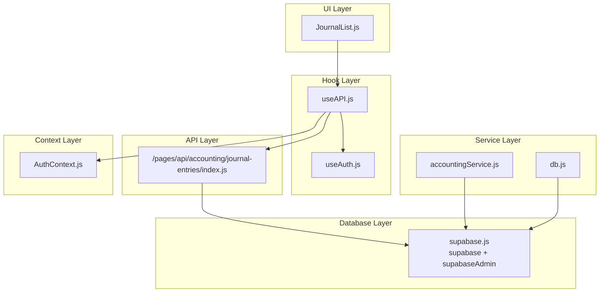
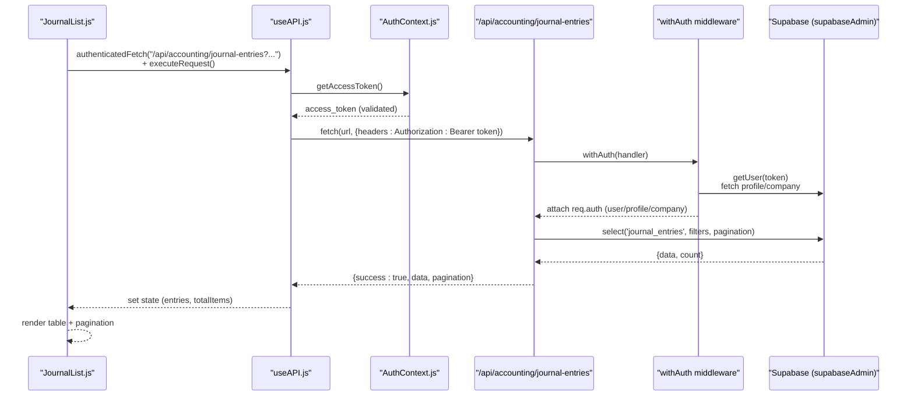
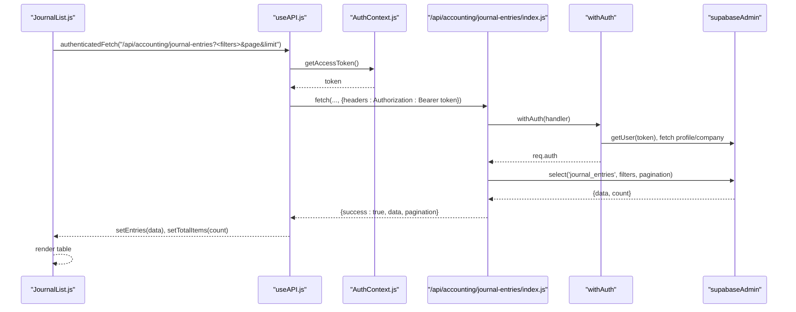
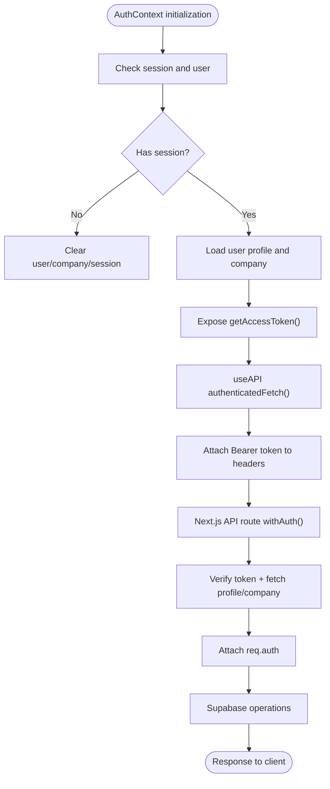
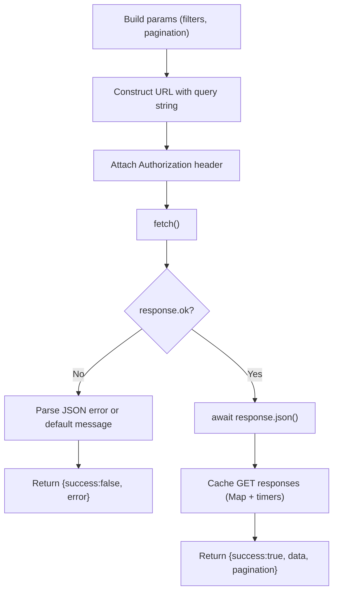
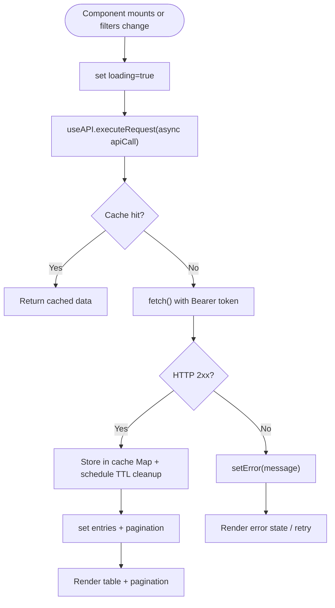
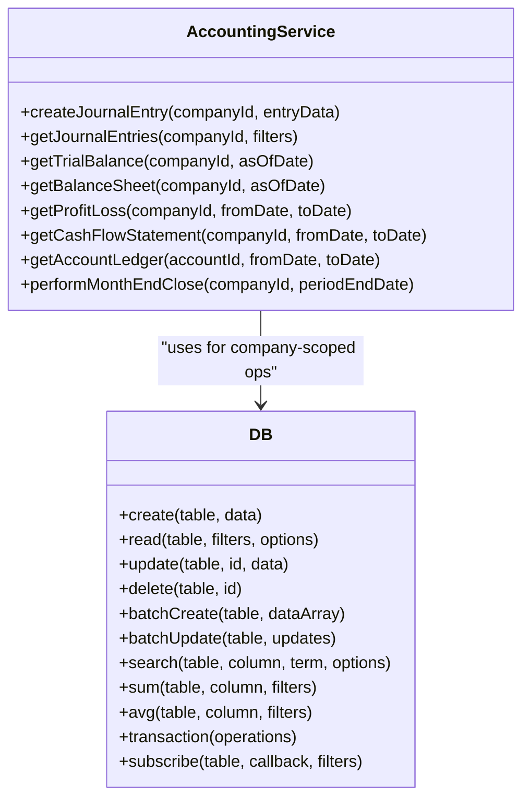
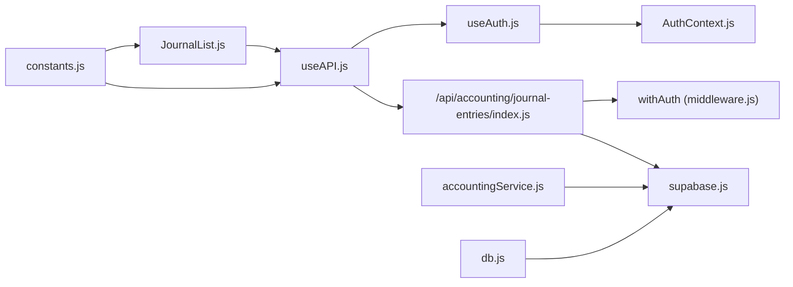

# Data Flow

<cite>
**Referenced Files in This Document**
- [useAPI.js](file://src/hooks/useAPI.js)
- [useAuth.js](file://src/hooks/useAuth.js)
- [AuthContext.js](file://src/context/AuthContext.js)
- [supabase.js](file://src/services/utils/supabase.js)
- [middleware.js](file://src/lib/middleware.js)
- [index.js](file://src/pages/api/accounting/journal-entries/index.js)
- [JournalList.js](file://src/components/accounting/JournalList.js)
- [_app.js](file://src/pages/_app.js)
- [constants.js](file://src/lib/constants.js)
- [db.js](file://src/lib/db.js)
- [accountingService.js](file://src/services/accountingService.js)
</cite>

## Table of Contents
1. [Introduction](#introduction)
2. [Project Structure](#project-structure)
3. [Core Components](#core-components)
4. [Architecture Overview](#architecture-overview)
5. [Detailed Component Analysis](#detailed-component-analysis)
6. [Dependency Analysis](#dependency-analysis)
7. [Performance Considerations](#performance-considerations)
8. [Troubleshooting Guide](#troubleshooting-guide)
9. [Conclusion](#conclusion)

## Introduction
This document explains the complete data flow architecture in ezbillify-v1, from React UI components to Next.js API routes and the Supabase database. It focuses on how components use custom hooks (useAPI, useAuth) to access data, how the service layer interacts with Supabase, and how the request/response cycle works end-to-end. It also covers authentication token handling via AuthContext, request formatting, error handling, data transformation, caching strategies, loading states, and error recovery patterns.

## Project Structure
The data flow spans several layers:
- UI Layer: React components (e.g., JournalList)
- Hook Layer: Custom hooks (useAPI, useAuth)
- Service Layer: Services (e.g., accountingService)
- API Layer: Next.js API routes under src/pages/api
- Database Layer: Supabase (client and admin clients)
- Context Layer: AuthContext for authentication state and tokens

**Diagram sources**
- [JournalList.js](file://src/components/accounting/JournalList.js#L1-L120)
- [useAPI.js](file://src/hooks/useAPI.js#L1-L133)
- [useAuth.js](file://src/hooks/useAuth.js#L1-L13)
- [AuthContext.js](file://src/context/AuthContext.js#L1-L132)
- [index.js](file://src/pages/api/accounting/journal-entries/index.js#L1-L120)
- [supabase.js](file://src/services/utils/supabase.js#L1-L120)
- [db.js](file://src/lib/db.js#L1-L120)
- [accountingService.js](file://src/services/accountingService.js#L1-L60)

**Section sources**
- [JournalList.js](file://src/components/accounting/JournalList.js#L1-L120)
- [useAPI.js](file://src/hooks/useAPI.js#L1-L133)
- [AuthContext.js](file://src/context/AuthContext.js#L1-L132)
- [index.js](file://src/pages/api/accounting/journal-entries/index.js#L1-L120)
- [supabase.js](file://src/services/utils/supabase.js#L1-L120)
- [_app.js](file://src/pages/_app.js#L1-L23)

## Core Components
- useAPI: Centralized hook for authenticated fetches, deduplication, caching, and unified error handling.
- useAuth: Thin wrapper around AuthContext to access authentication state and tokens.
- AuthContext: Manages session, user, company, and token lifecycle; exposes getAccessToken for useAPI.
- Supabase utilities: Provides supabase client for user-facing operations and supabaseAdmin for server-side admin operations.
- Middleware: withAuth validates tokens, enriches request with user/company/profile, and enforces permissions.
- Next.js API routes: Handle HTTP requests, apply middleware, and call Supabase for persistence.
- Services: Business logic wrappers around Supabase (e.g., accountingService).
- UI components: Trigger data fetching via useAPI and render loading/error states.

**Section sources**
- [useAPI.js](file://src/hooks/useAPI.js#L1-L133)
- [useAuth.js](file://src/hooks/useAuth.js#L1-L13)
- [AuthContext.js](file://src/context/AuthContext.js#L1-L132)
- [supabase.js](file://src/services/utils/supabase.js#L1-L120)
- [middleware.js](file://src/lib/middleware.js#L1-L120)
- [index.js](file://src/pages/api/accounting/journal-entries/index.js#L1-L120)
- [accountingService.js](file://src/services/accountingService.js#L1-L60)

## Architecture Overview
The system follows a layered pattern:
- UI components call useAPI to perform authenticated requests.
- useAPI resolves a valid access token via AuthContext, attaches it to requests, and manages caching/deduplication.
- Next.js API routes apply withAuth middleware to validate and enrich the request with user/company/profile.
- Routes perform Supabase operations (select/insert/update/delete) and return structured JSON responses.
- UI components update state with received data and pagination metadata.

**Diagram sources**
- [JournalList.js](file://src/components/accounting/JournalList.js#L58-L80)
- [useAPI.js](file://src/hooks/useAPI.js#L44-L121)
- [AuthContext.js](file://src/context/AuthContext.js#L113-L132)
- [index.js](file://src/pages/api/accounting/journal-entries/index.js#L1-L120)
- [middleware.js](file://src/lib/middleware.js#L1-L120)

## Detailed Component Analysis

### JournalList → useAPI → API Route → Supabase: Fetching Journal Entries
This example illustrates the end-to-end data flow for fetching journal entries.

- UI component JournalList:
  - Uses useAPI to perform authenticatedFetch.
  - Builds query parameters (company_id, dates, status, pagination).
  - Calls executeRequest to wrap the async call and unify success/error responses.
  - Updates local state with entries and pagination totals.

- useAPI:
  - Deduplicates concurrent identical requests.
  - Implements GET caching with TTL and automatic cleanup timers.
  - Injects Authorization: Bearer token from AuthContext.
  - Handles HTTP errors and returns structured {success, data, error}.

- API route:
  - Applies withAuth to validate token and enrich request with user/company/profile.
  - Validates required parameters (e.g., company_id).
  - Performs Supabase query with filtering/ordering/range.
  - Returns success payload with data and pagination metadata.

- Supabase:
  - Uses supabaseAdmin client for server-side operations (bypasses RLS).
  - Returns normalized data suitable for UI consumption.

**Diagram sources**
- [JournalList.js](file://src/components/accounting/JournalList.js#L58-L80)
- [useAPI.js](file://src/hooks/useAPI.js#L44-L121)
- [AuthContext.js](file://src/context/AuthContext.js#L113-L132)
- [index.js](file://src/pages/api/accounting/journal-entries/index.js#L1-L120)
- [middleware.js](file://src/lib/middleware.js#L1-L120)

**Section sources**
- [JournalList.js](file://src/components/accounting/JournalList.js#L58-L80)
- [useAPI.js](file://src/hooks/useAPI.js#L44-L121)
- [index.js](file://src/pages/api/accounting/journal-entries/index.js#L1-L120)
- [middleware.js](file://src/lib/middleware.js#L1-L120)

### Authentication Token Handling via AuthContext
- AuthContext initializes session state and exposes getAccessToken that checks token expiry and returns a valid token.
- useAPI consumes getAccessToken to attach Authorization headers.
- Next.js API routes use withAuth to verify the token, fetch user profile and company, and enforce permissions.

**Diagram sources**
- [AuthContext.js](file://src/context/AuthContext.js#L1-L132)
- [useAPI.js](file://src/hooks/useAPI.js#L62-L85)
- [middleware.js](file://src/lib/middleware.js#L1-L120)

**Section sources**
- [AuthContext.js](file://src/context/AuthContext.js#L1-L132)
- [useAPI.js](file://src/hooks/useAPI.js#L62-L85)
- [middleware.js](file://src/lib/middleware.js#L1-L120)

### Request Formatting, Error Handling, and Data Transformation
- Request formatting:
  - useAPI builds fetch options, injects Authorization header, and serializes query parameters.
  - API routes parse query/body, validate inputs, and construct Supabase queries.
- Error handling:
  - useAPI wraps calls in executeRequest and returns {success, data|error}.
  - API routes return {success:false, error} on failures; middleware centralizes error mapping.
  - Supabase errors are mapped to user-friendly messages in helpers.
- Data transformation:
  - API routes shape responses with pagination metadata.
  - Services transform raw DB rows into domain-friendly structures (e.g., grouping by account type).

**Diagram sources**
- [useAPI.js](file://src/hooks/useAPI.js#L87-L117)
- [index.js](file://src/pages/api/accounting/journal-entries/index.js#L1-L120)

**Section sources**
- [useAPI.js](file://src/hooks/useAPI.js#L87-L117)
- [index.js](file://src/pages/api/accounting/journal-entries/index.js#L1-L120)
- [supabase.js](file://src/services/utils/supabase.js#L298-L315)

### Data Caching Strategies, Loading States, and Error Recovery
- Caching:
  - useAPI caches GET responses keyed by URL with TTL; deduplicates concurrent identical requests.
  - Provides clearCache(url|all) to invalidate cache.
- Loading states:
  - useAPI exposes loading flag; components render spinners while loading.
  - UI components manage pagination and empty states.
- Error recovery:
  - executeRequest returns structured errors; UI displays toast or alerts.
  - AuthContext handles token refresh and updates session without refetching profile/company unnecessarily.

**Diagram sources**
- [useAPI.js](file://src/hooks/useAPI.js#L1-L133)
- [JournalList.js](file://src/components/accounting/JournalList.js#L256-L334)

**Section sources**
- [useAPI.js](file://src/hooks/useAPI.js#L1-L133)
- [JournalList.js](file://src/components/accounting/JournalList.js#L256-L334)

### Additional Patterns: Services and Generic DB Helpers
- Services:
  - accountingService encapsulates business logic and calls Supabase RPCs and joins.
  - Provides computed summaries (balance sheet, profit/loss, cash flow).
- Generic DB helpers:
  - db offers CRUD, batch ops, search, aggregation, transactions, and real-time subscriptions.
  - Supports company-scoped operations and error normalization.

**Diagram sources**
- [accountingService.js](file://src/services/accountingService.js#L1-L301)
- [db.js](file://src/lib/db.js#L1-L307)

**Section sources**
- [accountingService.js](file://src/services/accountingService.js#L1-L301)
- [db.js](file://src/lib/db.js#L1-L307)

## Dependency Analysis
- UI depends on useAPI and useAuth.
- useAPI depends on AuthContext and supabase client.
- API routes depend on withAuth middleware and supabaseAdmin.
- Services depend on supabase client.
- Constants define API endpoints and shared values.

**Diagram sources**
- [JournalList.js](file://src/components/accounting/JournalList.js#L1-L120)
- [useAPI.js](file://src/hooks/useAPI.js#L1-L133)
- [useAuth.js](file://src/hooks/useAuth.js#L1-L13)
- [AuthContext.js](file://src/context/AuthContext.js#L1-L132)
- [index.js](file://src/pages/api/accounting/journal-entries/index.js#L1-L120)
- [middleware.js](file://src/lib/middleware.js#L1-L120)
- [supabase.js](file://src/services/utils/supabase.js#L1-L120)
- [accountingService.js](file://src/services/accountingService.js#L1-L60)
- [db.js](file://src/lib/db.js#L1-L120)
- [constants.js](file://src/lib/constants.js#L388-L412)

**Section sources**
- [JournalList.js](file://src/components/accounting/JournalList.js#L1-L120)
- [useAPI.js](file://src/hooks/useAPI.js#L1-L133)
- [AuthContext.js](file://src/context/AuthContext.js#L1-L132)
- [index.js](file://src/pages/api/accounting/journal-entries/index.js#L1-L120)
- [middleware.js](file://src/lib/middleware.js#L1-L120)
- [supabase.js](file://src/services/utils/supabase.js#L1-L120)
- [accountingService.js](file://src/services/accountingService.js#L1-L60)
- [db.js](file://src/lib/db.js#L1-L120)
- [constants.js](file://src/lib/constants.js#L388-L412)

## Performance Considerations
- Request deduplication reduces redundant network calls for identical GET requests.
- GET caching minimizes repeated DB hits; TTL ensures freshness.
- Pagination in API routes prevents large payloads and improves responsiveness.
- SupabaseAdmin is used server-side to bypass RLS and improve performance for internal operations.
- Real-time subscriptions (via supabase) enable reactive UI updates without polling.

[No sources needed since this section provides general guidance]

## Troubleshooting Guide
Common issues and recovery steps:
- Authentication failures:
  - Verify token presence and validity; AuthContext.getAccessToken checks expiry and refreshes if needed.
  - API routes return 401/403 for invalid/expired tokens or missing profiles/companies.
- Network errors:
  - useAPI catches HTTP errors and returns structured {success:false, error}; UI should surface user-friendly messages.
  - Supabase helpers normalize common errors to friendly messages.
- Data not appearing:
  - Check cache invalidation; use clearCache(url|all) to force reload.
  - Ensure filters (company_id, dates, status) are correctly passed to API routes.
- Permission denied:
  - withAuth verifies user role and company status; ensure user profile and company association are valid.

**Section sources**
- [useAPI.js](file://src/hooks/useAPI.js#L87-L117)
- [AuthContext.js](file://src/context/AuthContext.js#L113-L132)
- [middleware.js](file://src/lib/middleware.js#L1-L120)
- [supabase.js](file://src/services/utils/supabase.js#L298-L315)

## Conclusion
The ezbillify-v1 data flow is a cohesive, layered system:
- UI components use useAPI for authenticated, deduplicated, and cached requests.
- useAPI relies on AuthContext for token management and headers.
- Next.js API routes enforce authentication and authorization via withAuth and operate on Supabase.
- Services encapsulate business logic and data transformations.
- Robust error handling and caching improve reliability and performance.

[No sources needed since this section summarizes without analyzing specific files]