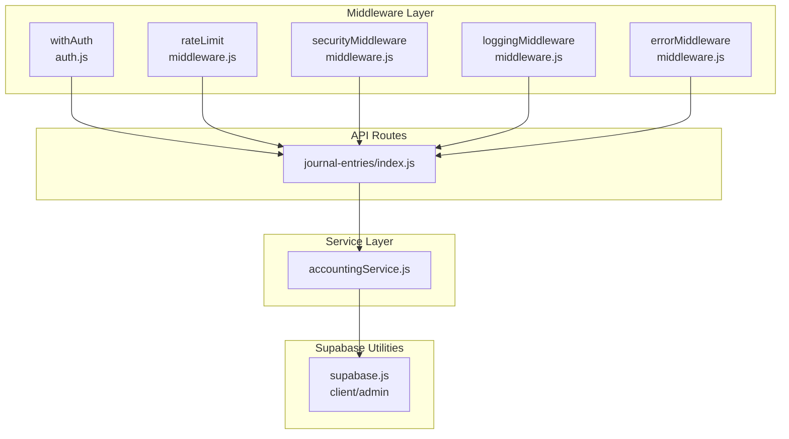
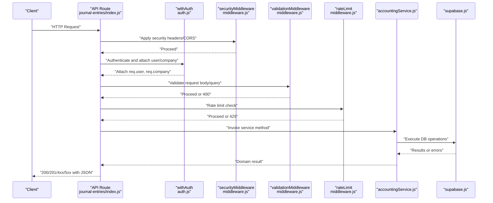
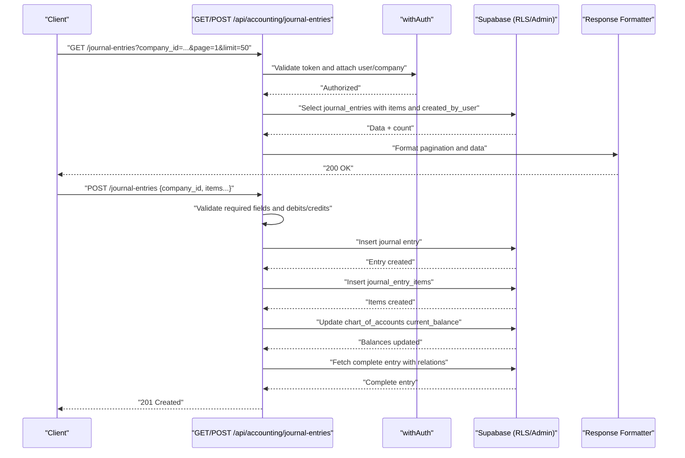
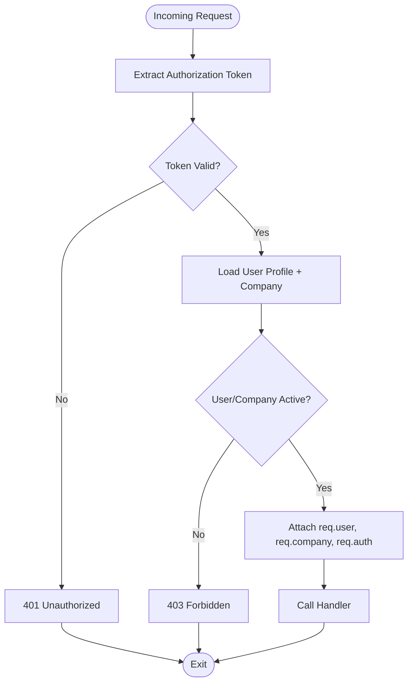
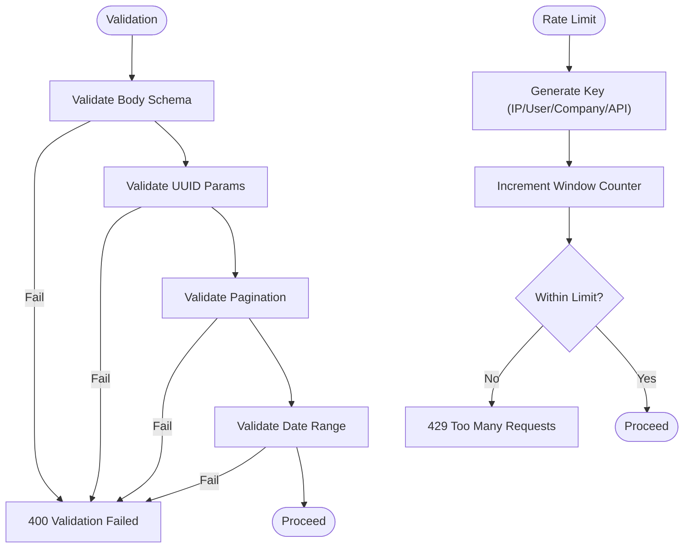
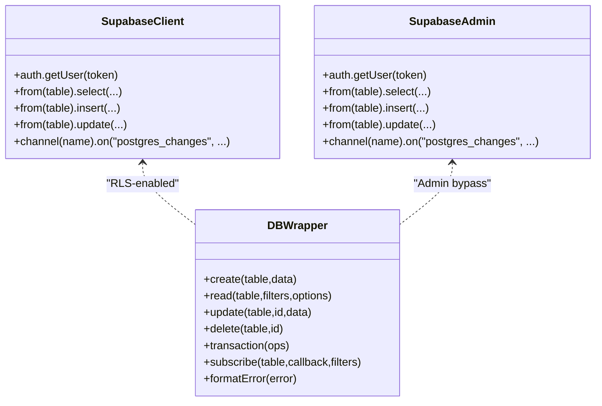
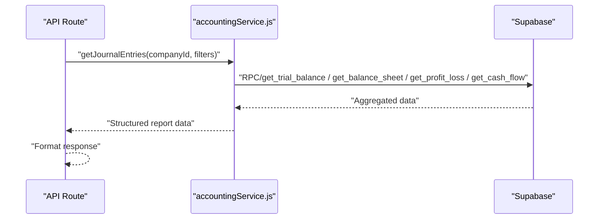
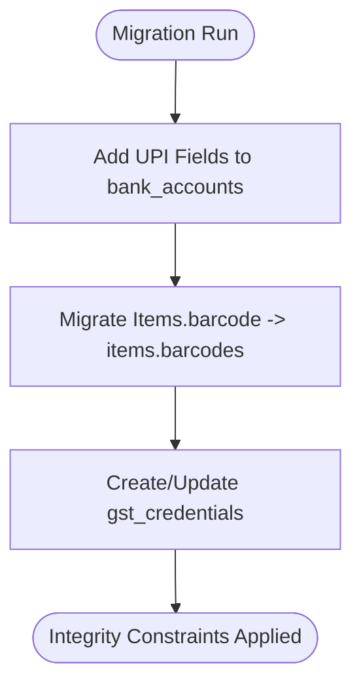
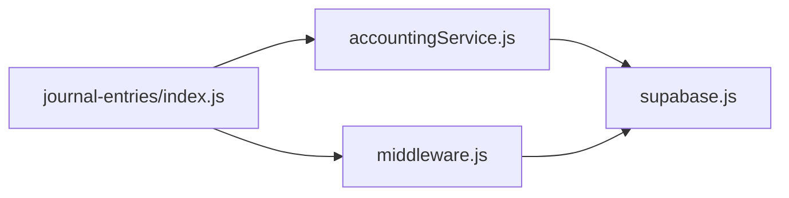

# Server-Side Data Processing

<cite>
**Referenced Files in This Document**
- [middleware.js](file://src/lib/middleware.js)
- [auth.js](file://src/middleware/auth.js)
- [db.js](file://src/lib/db.js)
- [supabase.js](file://src/services/utils/supabase.js)
- [accountingService.js](file://src/services/accountingService.js)
- [journal-entries index.js](file://src/pages/api/accounting/journal-entries/index.js)
- [20241105_add_upi_fields_to_bank_accounts.sql](file://database/migrations/20241105_add_upi_fields_to_bank_accounts.sql)
- [add_barcodes_array_fixed.sql](file://migrations/add_barcodes_array_fixed.sql)
- [create_gst_credentials_table.sql](file://migrations/create_gst_credentials_table.sql)
- [update_gst_credentials_table.sql](file://migrations/update_gst_credentials_table.sql)
- [user-debug.js](file://src/pages/api/debug/user-debug.js)
</cite>

## Table of Contents
1. [Introduction](#introduction)
2. [Project Structure](#project-structure)
3. [Core Components](#core-components)
4. [Architecture Overview](#architecture-overview)
5. [Detailed Component Analysis](#detailed-component-analysis)
6. [Dependency Analysis](#dependency-analysis)
7. [Performance Considerations](#performance-considerations)
8. [Troubleshooting Guide](#troubleshooting-guide)
9. [Conclusion](#conclusion)
10. [Appendices](#appendices)

## Introduction
This document explains the server-side data processing architecture powering ezbillify-v1’s Next.js API routes. It covers the complete request lifecycle from middleware validation to service-layer orchestration and Supabase database operations, using the journal entries API as a concrete example. It also documents Supabase integration patterns, row-level security (RLS), real-time subscriptions, database migrations, data integrity constraints, error handling strategies, and performance considerations.

## Project Structure
The server-side logic is organized around:
- Middleware for authentication, authorization, validation, rate limiting, logging, and error handling
- Supabase utilities for client and admin connections
- Service layer for domain logic (e.g., accountingService)
- API routes under src/pages/api that delegate to middleware and services
- Database migrations under database/migrations and migrations/

**Diagram sources**
- [auth.js](file://src/middleware/auth.js#L1-L252)
- [middleware.js](file://src/lib/middleware.js#L1-L627)
- [supabase.js](file://src/services/utils/supabase.js#L1-L392)
- [accountingService.js](file://src/services/accountingService.js#L1-L301)
- [journal-entries index.js](file://src/pages/api/accounting/journal-entries/index.js#L1-L252)

**Section sources**
- [auth.js](file://src/middleware/auth.js#L1-L252)
- [middleware.js](file://src/lib/middleware.js#L1-L627)
- [supabase.js](file://src/services/utils/supabase.js#L1-L392)
- [accountingService.js](file://src/services/accountingService.js#L1-L301)
- [journal-entries index.js](file://src/pages/api/accounting/journal-entries/index.js#L1-L252)

## Core Components
- Authentication and authorization middleware: Validates tokens, loads user/company profiles, enforces role/permission checks, and attaches contextual data to the request.
- Validation middleware: Provides schema-based validation, UUID checks, pagination, and date-range validation.
- Rate limiting middleware: Implements sliding-window and progressive rate limiting with configurable presets.
- Security middleware: Applies CORS, security headers, CSP, and preflight handling.
- Logging and audit middleware: Logs request/response metadata and writes audit logs for sensitive actions.
- Error handling middleware: Normalizes Supabase SQL errors, validation errors, and unhandled exceptions.
- Supabase utilities: Exposes both RLS-enabled and admin clients; provides helpers for real-time subscriptions and storage.
- Service layer: Encapsulates domain logic (e.g., accounting reports, journal entries) and orchestrates database operations.
- API routes: Entry points for Next.js API that apply middleware, validate inputs, call services, and format responses.

**Section sources**
- [middleware.js](file://src/lib/middleware.js#L1-L627)
- [auth.js](file://src/middleware/auth.js#L1-L252)
- [supabase.js](file://src/services/utils/supabase.js#L1-L392)
- [accountingService.js](file://src/services/accountingService.js#L1-L301)
- [journal-entries index.js](file://src/pages/api/accounting/journal-entries/index.js#L1-L252)

## Architecture Overview
The request lifecycle for a typical Next.js API route:
1. Incoming request arrives at the API route handler.
2. Middleware applies security headers, CORS, and preflight handling.
3. Authentication middleware validates the token, loads user/company/profile, and attaches context.
4. Optional validation and rate-limiting middleware enforce constraints.
5. Handler delegates to service layer for business logic.
6. Service layer performs Supabase operations (RLS or admin bypass as appropriate).
7. Responses are formatted and logged; errors are normalized.

**Diagram sources**
- [journal-entries index.js](file://src/pages/api/accounting/journal-entries/index.js#L1-L252)
- [auth.js](file://src/middleware/auth.js#L1-L252)
- [middleware.js](file://src/lib/middleware.js#L1-L627)
- [supabase.js](file://src/services/utils/supabase.js#L1-L392)
- [accountingService.js](file://src/services/accountingService.js#L1-L301)

## Detailed Component Analysis

### Journal Entries API Lifecycle (Concrete Example)
The journal entries API demonstrates the full lifecycle:
- Entry point: API route handler dispatches GET/POST based on method.
- Validation: Query parameters validated; body validated for required fields and balanced debits/credits.
- Transaction handling: Creates journal entry and items atomically; updates account balances; rolls back on failure.
- Response formatting: Returns paginated results or created entity with enriched relations.
- Error logging: Centralized logging and error normalization.

**Diagram sources**
- [journal-entries index.js](file://src/pages/api/accounting/journal-entries/index.js#L1-L252)
- [supabase.js](file://src/services/utils/supabase.js#L1-L392)

**Section sources**
- [journal-entries index.js](file://src/pages/api/accounting/journal-entries/index.js#L1-L252)

### Authentication and Authorization
- Token extraction and verification via Supabase auth.
- Loads user profile and company, checks activation status.
- Attaches user/company/role/permissions to request for downstream handlers.
- Legacy and modern auth wrappers coexist; modern wrapper is preferred for new routes.

**Diagram sources**
- [auth.js](file://src/middleware/auth.js#L1-L252)

**Section sources**
- [auth.js](file://src/middleware/auth.js#L1-L252)

### Validation and Rate Limiting
- Validation middleware:
  - Body validation against a schema.
  - UUID parameter validation.
  - Pagination enforcement (page ≥ 1, limit 1–100).
  - Date range validation with bounds checking.
- Rate limiting middleware:
  - Sliding window and progressive rate limiting.
  - Presets for general, auth, upload, API, webhook, password reset, email, and reports.
  - Configurable key generators (IP, user ID, company ID, API key).

**Diagram sources**
- [middleware.js](file://src/lib/middleware.js#L246-L390)

**Section sources**
- [middleware.js](file://src/lib/middleware.js#L246-L390)

### Supabase Integration and Row-Level Security
- Client separation:
  - Regular client with RLS for user-facing operations.
  - Admin client bypassing RLS for server-side tasks (e.g., audit logs, profile/company fetch).
- Real-time subscriptions:
  - Channels for company, sales documents, and payments; unsubscribe helper.
- Error handling:
  - Mapped PostgreSQL error codes to user-friendly messages.
- Company-scoped operations:
  - Helpers to enforce company_id constraints on reads/writes.

**Diagram sources**
- [supabase.js](file://src/services/utils/supabase.js#L1-L392)
- [db.js](file://src/lib/db.js#L1-L307)

**Section sources**
- [supabase.js](file://src/services/utils/supabase.js#L1-L392)
- [db.js](file://src/lib/db.js#L1-L307)

### Service Layer Orchestration
- Domain logic encapsulated in services (e.g., accountingService).
- Uses RPCs for financial statements and joins for enriched queries.
- Handles running balances and grouped financial summaries.

**Diagram sources**
- [accountingService.js](file://src/services/accountingService.js#L1-L301)

**Section sources**
- [accountingService.js](file://src/services/accountingService.js#L1-L301)

### Database Migrations and Integrity
- UPI fields migration for bank accounts:
  - Adds upi_id and upi_qr_code columns, indexes, and cleans empty values.
- Barcodes array migration:
  - Safely migrates from single barcode to array, creates GIN index, enforces uniqueness within company scope, and sets defaults.
- GST credentials table:
  - Creates gst_credentials with foreign key to companies, indexes, and comments.
  - Updates to add provider/client_id/client_secret.

**Diagram sources**
- [20241105_add_upi_fields_to_bank_accounts.sql](file://database/migrations/20241105_add_upi_fields_to_bank_accounts.sql#L1-L28)
- [add_barcodes_array_fixed.sql](file://migrations/add_barcodes_array_fixed.sql#L1-L111)
- [create_gst_credentials_table.sql](file://migrations/create_gst_credentials_table.sql#L1-L26)
- [update_gst_credentials_table.sql](file://migrations/update_gst_credentials_table.sql#L1-L10)

**Section sources**
- [20241105_add_upi_fields_to_bank_accounts.sql](file://database/migrations/20241105_add_upi_fields_to_bank_accounts.sql#L1-L28)
- [add_barcodes_array_fixed.sql](file://migrations/add_barcodes_array_fixed.sql#L1-L111)
- [create_gst_credentials_table.sql](file://migrations/create_gst_credentials_table.sql#L1-L26)
- [update_gst_credentials_table.sql](file://migrations/update_gst_credentials_table.sql#L1-L10)

## Dependency Analysis
- API routes depend on middleware for auth/security/validation/rate-limit/logging/error handling.
- Services depend on Supabase utilities for database operations and real-time subscriptions.
- Supabase utilities expose both RLS and admin clients; admin client is used for operations requiring bypassing RLS.

**Diagram sources**
- [journal-entries index.js](file://src/pages/api/accounting/journal-entries/index.js#L1-L252)
- [middleware.js](file://src/lib/middleware.js#L1-L627)
- [supabase.js](file://src/services/utils/supabase.js#L1-L392)
- [accountingService.js](file://src/services/accountingService.js#L1-L301)

**Section sources**
- [journal-entries index.js](file://src/pages/api/accounting/journal-entries/index.js#L1-L252)
- [middleware.js](file://src/lib/middleware.js#L1-L627)
- [supabase.js](file://src/services/utils/supabase.js#L1-L392)
- [accountingService.js](file://src/services/accountingService.js#L1-L301)

## Performance Considerations
- Query optimization:
  - Use selective columns and joins; leverage indexes (e.g., GIN on arrays, indexes on UPI ID).
  - Prefer RPCs for aggregated reports to reduce round trips.
- Indexing:
  - Ensure indexes exist on frequently filtered columns (company_id, entry_date, upi_id).
- Real-time subscriptions:
  - Use targeted channels and filters to minimize payload.
- Rate limiting:
  - Tune presets per endpoint type; consider user/company/API key granularity.
- Logging overhead:
  - Log only at required levels; avoid logging sensitive fields in production.

[No sources needed since this section provides general guidance]

## Troubleshooting Guide
- Authentication failures:
  - Verify token presence and validity; check user/company activation status.
  - Inspect logs for detailed error messages.
- Validation errors:
  - Review validation middleware responses for schema mismatches and invalid UUIDs/date ranges.
- Database errors:
  - Supabase error codes are mapped to user-friendly messages; check codes for duplicates, foreign key violations, and permission issues.
- Rate limiting:
  - Observe Retry-After headers and adjust client backoff.
- Debugging API routes:
  - Use the debug endpoint to inspect user/company data and auth user emails.

**Section sources**
- [auth.js](file://src/middleware/auth.js#L1-L252)
- [middleware.js](file://src/lib/middleware.js#L452-L518)
- [user-debug.js](file://src/pages/api/debug/user-debug.js#L1-L88)

## Conclusion
The server-side architecture in ezbillify-v1 follows a clear separation of concerns: robust middleware for security and validation, a Supabase-backed service layer for domain logic, and API routes that orchestrate the entire flow. The journal entries API exemplifies best practices: strict validation, transactional integrity, real-time-aware updates, and comprehensive error handling. Migrations ensure data integrity and scalability, while rate limiting and logging support operational reliability.

## Appendices

### API Workflow: Journal Entries (GET/POST)
- GET: Filters by company_id, date range, status; paginates; returns enriched entries with items and created_by_user.
- POST: Validates required fields and balanced debits/credits; generates entry number; inserts entry and items; updates account balances; returns created entry with relations.

**Section sources**
- [journal-entries index.js](file://src/pages/api/accounting/journal-entries/index.js#L1-L252)

### Supabase Real-Time Subscriptions
- Subscribe to company, sales documents, and payments channels; unsubscribe when done.

**Section sources**
- [supabase.js](file://src/services/utils/supabase.js#L250-L295)