# Frontend Architecture

<cite>
**Referenced Files in This Document**   
- [AppLayout.js](file://src/components/shared/layout/AppLayout.js)
- [AuthLayout.js](file://src/components/shared/layout/AuthLayout.js)
- [AuthContext.js](file://src/context/AuthContext.js)
- [CompanyContext.js](file://src/context/CompanyContext.js)
- [useAuth.js](file://src/hooks/useAuth.js)
- [useAPI.js](file://src/hooks/useAPI.js)
- [_app.js](file://src/pages/_app.js)
- [Sidebar.js](file://src/components/shared/navigation/Sidebar.js)
- [PageContainer.js](file://src/components/shared/layout/PageContainer.js)
- [PageHeader.js](file://src/components/shared/layout/PageHeader.js)
</cite>

## Table of Contents
1. [Introduction](#introduction)
2. [Project Structure](#project-structure)
3. [Component-Based Architecture](#component-based-architecture)
4. [Layout Components](#layout-components)
5. [State Management](#state-management)
6. [Custom Hooks](#custom-hooks)
7. [Component Organization](#component-organization)
8. [Routing Strategy](#routing-strategy)
9. [Styling and UI Components](#styling-and-ui-components)
10. [Performance Considerations](#performance-considerations)

## Introduction
The ezbillify-v1 frontend architecture is built on React with Next.js, implementing a component-based design pattern for building a comprehensive business management platform. The application follows modern React practices with a focus on reusability, maintainability, and performance. The architecture centers around layout components, global state management through React Context, and custom hooks for encapsulating reusable logic. The system is organized by feature domains with a clear separation between shared UI components and domain-specific functionality.

## Project Structure
The project follows a feature-based organization with components grouped by domain functionality. The src directory contains the main application code with a clear separation between components, context, hooks, services, and pages. The components directory is organized into feature domains such as accounting, purchase, sales, and shared components. The shared directory contains reusable UI elements and layout components used throughout the application. Context providers manage global state, while custom hooks encapsulate reusable logic. The pages directory follows the Next.js convention for routing, with API routes co-located with UI pages.

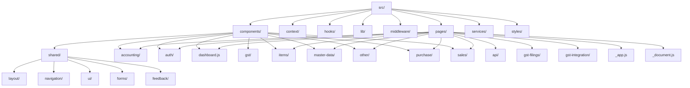

**Diagram sources**
- [src/components](file://src/components)
- [src/pages](file://src/pages)

**Section sources**
- [src/components](file://src/components)
- [src/pages](file://src/pages)

## Component-Based Architecture
The application follows a component-based architecture with a clear hierarchy and composition pattern. Components are organized by responsibility and reusability, with higher-level components composed of smaller, focused components. The architecture emphasizes composition over inheritance, allowing for flexible and maintainable UI construction. Components are designed to be reusable across different parts of the application while maintaining clear responsibilities and interfaces.

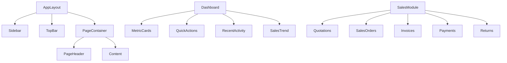

**Diagram sources**
- [AppLayout.js](file://src/components/shared/layout/AppLayout.js)
- [dashboard.js](file://src/pages/dashboard.js)
- [sales/index.js](file://src/pages/sales/index.js)

**Section sources**
- [AppLayout.js](file://src/components/shared/layout/AppLayout.js)
- [dashboard.js](file://src/pages/dashboard.js)
- [sales/index.js](file://src/pages/sales/index.js)

## Layout Components
The application implements two primary layout components: AppLayout for authenticated users and AuthLayout for authentication flows. These layouts provide consistent structure and styling across different sections of the application.

### AppLayout
The AppLayout component provides the main application structure for authenticated users, featuring a collapsible sidebar navigation, top bar with user information, and main content area. It handles the overall application chrome and provides a consistent user experience across different pages.

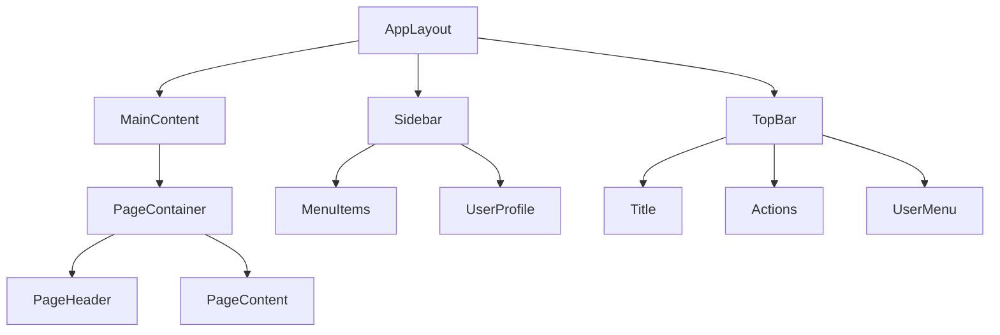

**Diagram sources**
- [AppLayout.js](file://src/components/shared/layout/AppLayout.js)
- [Sidebar.js](file://src/components/shared/navigation/Sidebar.js)

**Section sources**
- [AppLayout.js](file://src/components/shared/layout/AppLayout.js)
- [Sidebar.js](file://src/components/shared/navigation/Sidebar.js)

### AuthLayout
The AuthLayout component provides a dedicated layout for authentication pages such as login, registration, and password reset. It features a centered card design with branding elements and a clean, focused interface for authentication flows.

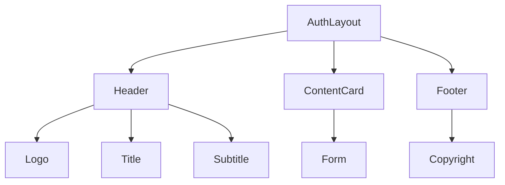

**Diagram sources**
- [AuthLayout.js](file://src/components/shared/layout/AuthLayout.js)

**Section sources**
- [AuthLayout.js](file://src/components/shared/layout/AuthLayout.js)

## State Management
The application uses React Context for global state management, with multiple context providers handling different aspects of application state. This approach allows for efficient state sharing across components without prop drilling.

### AuthContext
The AuthContext manages authentication state including user session, profile information, and company data. It provides authentication functions and computed values for determining user roles and permissions.

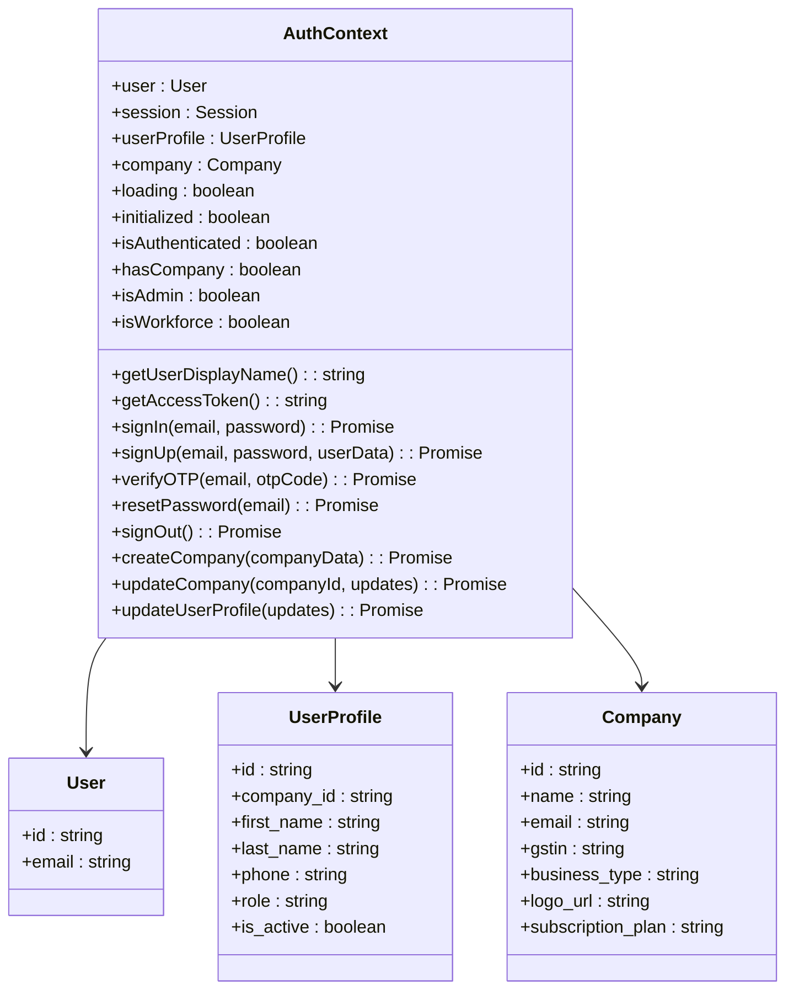

**Diagram sources**
- [AuthContext.js](file://src/context/AuthContext.js)

**Section sources**
- [AuthContext.js](file://src/context/AuthContext.js)
- [_app.js](file://src/pages/_app.js)

### CompanyContext
The CompanyContext manages company-specific data and settings, including tax rates, units of measurement, chart of accounts, and company preferences. It provides functions for updating company information and related entities.

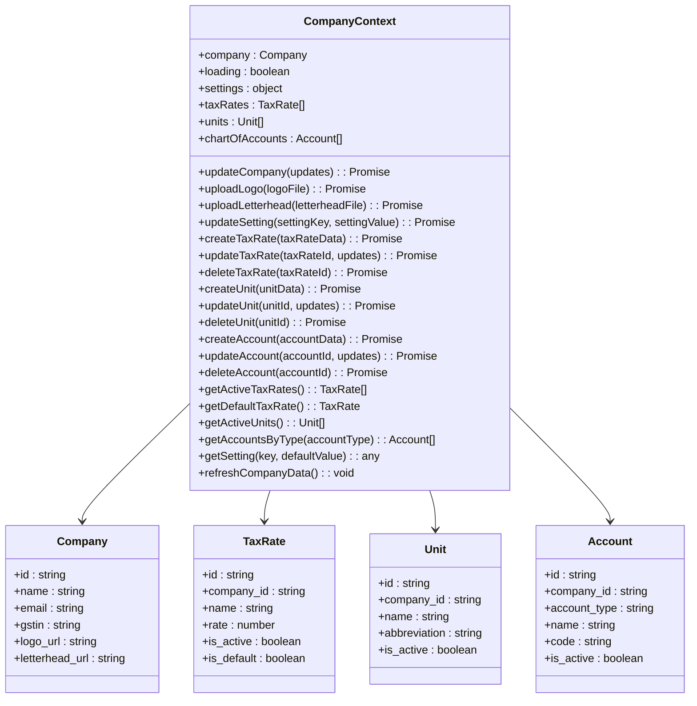

**Diagram sources**
- [CompanyContext.js](file://src/context/CompanyContext.js)

**Section sources**
- [CompanyContext.js](file://src/context/CompanyContext.js)

## Custom Hooks
The application implements custom hooks to encapsulate reusable logic and promote code reuse across components. These hooks provide a clean API for accessing application functionality and state.

### useAuth Hook
The useAuth hook provides access to authentication state and functions from the AuthContext. It includes safeguards to ensure it is used within the appropriate context provider.

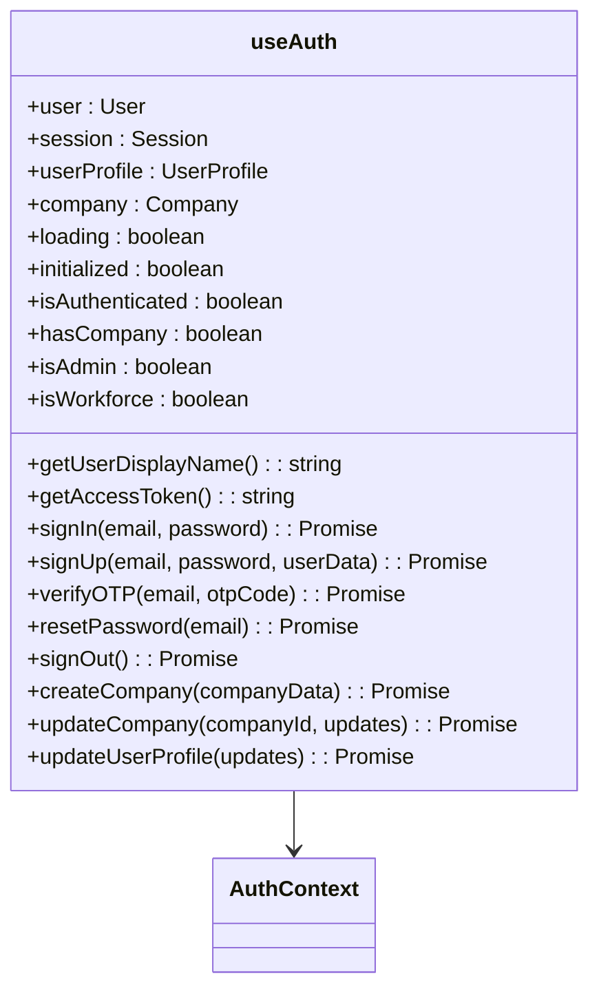

**Diagram sources**
- [useAuth.js](file://src/hooks/useAuth.js)
- [AuthContext.js](file://src/context/AuthContext.js)

**Section sources**
- [useAuth.js](file://src/hooks/useAuth.js)

### useAPI Hook
The useAPI hook provides a standardized interface for making authenticated API calls with built-in caching, request deduplication, and error handling. It simplifies data fetching operations across the application.

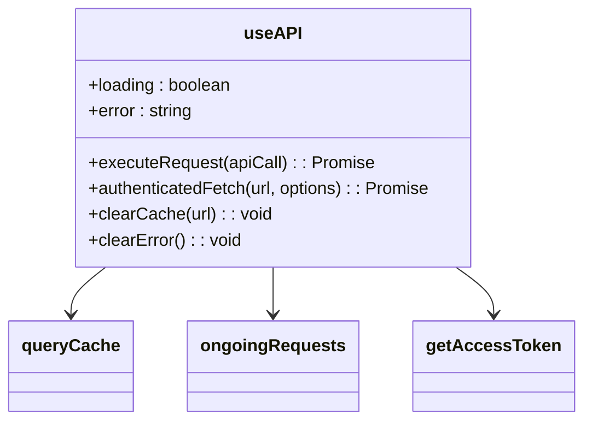

**Diagram sources**
- [useAPI.js](file://src/hooks/useAPI.js)

**Section sources**
- [useAPI.js](file://src/hooks/useAPI.js)

## Component Organization
The application follows a feature-based component organization with a clear separation between shared and domain-specific components. Components are grouped by functionality and reusability, with shared components available for use across different feature domains.

### Feature Domains
The application is organized into several feature domains including:
- **Sales**: Quotations, sales orders, invoices, payments, returns
- **Purchase**: Purchase orders, bills, GRN, payments made, returns
- **Accounting**: Journal entries, general ledger, trial balance, financial statements
- **Items**: Item management, stock adjustment, current stock
- **Master Data**: Chart of accounts, bank accounts, tax rates, units, payment terms
- **GST Filings**: GSTR-1, GSTR-2, GSTR-3B, compliance

### Shared Components
Shared components are organized into categories based on their functionality:
- **Layout**: AppLayout, AuthLayout, PageContainer, PageHeader
- **Navigation**: Sidebar, TopBar, Breadcrumb, BackButton
- **UI**: Button, Card, Input, Select, Table, Tabs, Badge
- **Forms**: FormField, FormSection, ValidationMessage, AddressForm
- **Feedback**: Alert, ConfirmDialog, ErrorBoundary, Toast
- **Data Display**: DataTable, Pagination, SearchFilter, StatusBadge, CurrencyDisplay

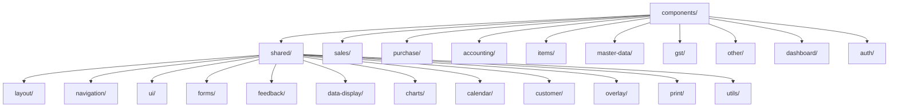

**Diagram sources**
- [src/components](file://src/components)

**Section sources**
- [src/components](file://src/components)

## Routing Strategy
The application uses Next.js file-based routing with the pages directory structure determining the URL paths. The routing strategy includes both UI pages and API routes, with a clear organization by feature domain.

### UI Pages
UI pages are organized by feature domain with a consistent structure:
- **Root pages**: index.js, dashboard.js, login.js, register.js
- **Feature domains**: sales/, purchase/, accounting/, items/, master-data/
- **API routes**: api/ with subdirectories for each domain

### API Routes
API routes are co-located with UI pages in the pages/api directory, organized by domain:
- **Authentication**: api/auth/
- **Company**: api/companies/
- **Customers**: api/customers/
- **Items**: api/items/
- **Sales**: api/sales/
- **Purchase**: api/purchase/
- **Accounting**: api/accounting/

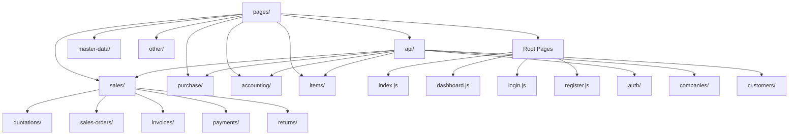

**Diagram sources**
- [src/pages](file://src/pages)

**Section sources**
- [src/pages](file://src/pages)

## Styling and UI Components
The application uses Tailwind CSS for styling with a utility-first approach. The design system is built on reusable UI components that ensure consistency across the application.

### Tailwind CSS
Tailwind CSS is used for all styling with a focus on utility classes. The configuration is customized to match the application's design system with specific colors, spacing, and typography.

### UI Component Library
The application implements a comprehensive UI component library in the shared/ui directory with components such as:
- **Button**: Various variants and sizes
- **Card**: Container for grouping related content
- **Input**: Form input with validation states
- **Select**: Dropdown selection component
- **Table**: Data table with sorting and pagination
- **Tabs**: Tabbed interface for content organization
- **Modal**: Overlay dialog for important actions
- **Loading**: Visual indicator for loading states

### Design System
The design system follows consistent principles:
- **Color Palette**: Blue primary color with complementary accents
- **Typography**: Clear hierarchy with appropriate font weights and sizes
- **Spacing**: Consistent spacing using Tailwind's spacing scale
- **Shadows**: Subtle shadows for depth and hierarchy
- **Borders**: Rounded corners with consistent border styles

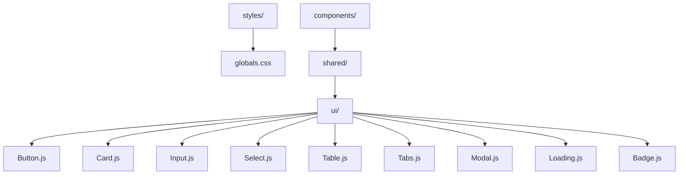

**Diagram sources**
- [styles/globals.css](file://src/styles/globals.css)
- [components/shared/ui](file://src/components/shared/ui)

**Section sources**
- [tailwind.config.js](file://tailwind.config.js)
- [styles/globals.css](file://src/styles/globals.css)
- [components/shared/ui](file://src/components/shared/ui)

## Performance Considerations
The application implements several performance optimizations to ensure a responsive user experience.

### Code Splitting
Next.js automatically handles code splitting by route, ensuring that only the necessary code is loaded for each page. Dynamic imports are used for heavy components that are not needed on initial load.

### Lazy Loading
Components are lazy-loaded when appropriate, particularly for heavy UI elements or functionality that is not immediately needed. This reduces the initial bundle size and improves load times.

### Client-Server Data Fetching
The application uses a combination of Next.js data fetching methods:
- **getServerSideProps**: For pages that require data at request time
- **getStaticProps**: For pages with data that can be pre-rendered
- **Client-side fetching**: For data that needs to be fresh or is user-specific

### Caching Strategy
The useAPI hook implements a caching strategy with:
- **Request deduplication**: Prevents multiple identical requests
- **Response caching**: Stores GET responses for a configurable time
- **Cache invalidation**: Clear cache when data is updated

### Optimized Rendering
The application implements several rendering optimizations:
- **Memoization**: Using React.memo for components that don't need to re-render
- **Callback optimization**: Using useCallback for event handlers
- **State colocation**: Keeping state as close to where it's needed as possible

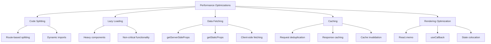

**Diagram sources**
- [useAPI.js](file://src/hooks/useAPI.js)
- [dashboard.js](file://src/pages/dashboard.js)

**Section sources**
- [useAPI.js](file://src/hooks/useAPI.js)
- [dashboard.js](file://src/pages/dashboard.js)