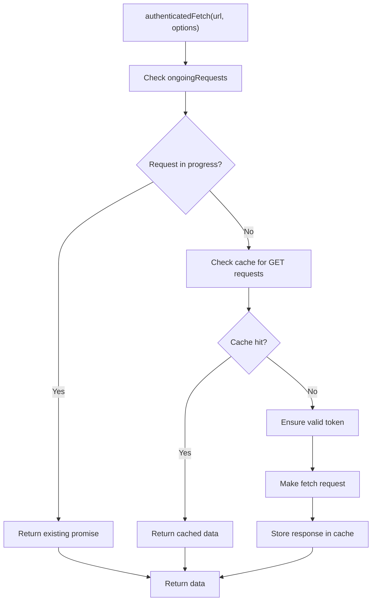
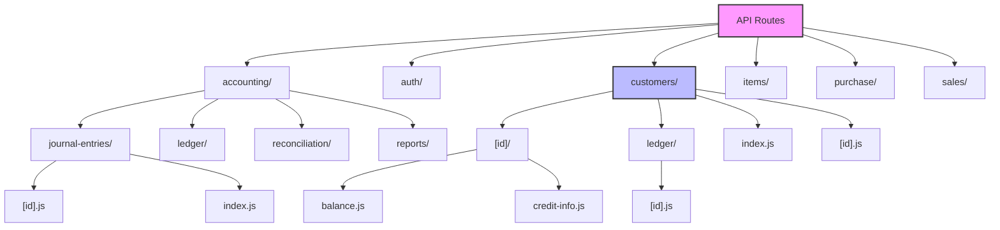
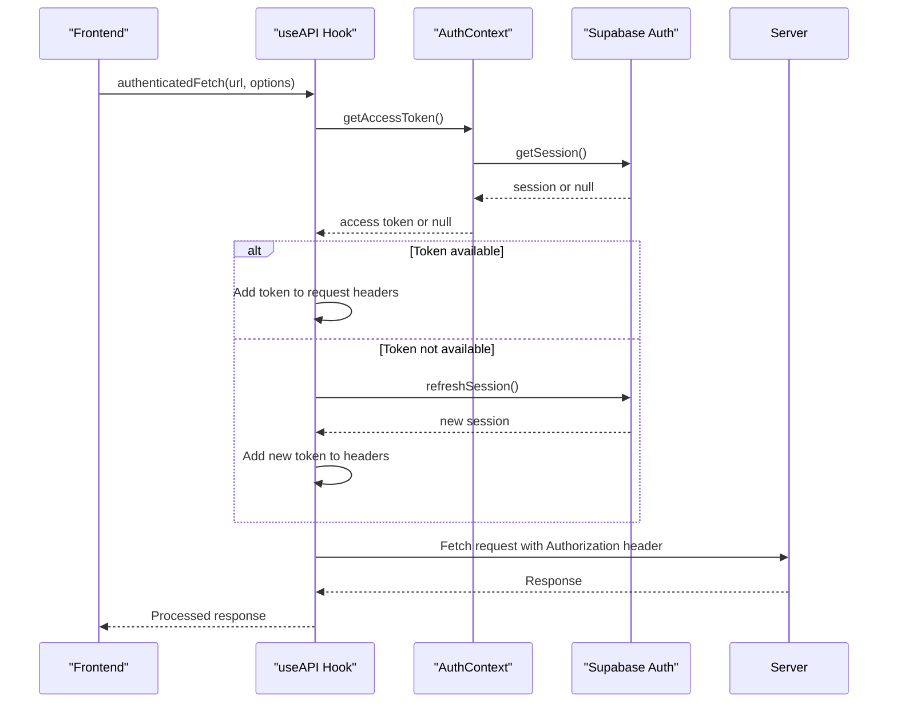
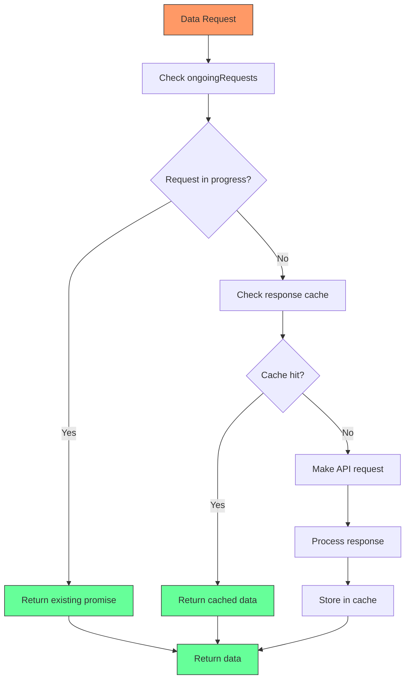

# Data Fetching Architecture

<cite>
**Referenced Files in This Document**   
- [useAPI.js](file://src/hooks/useAPI.js)
- [customerService.js](file://src/services/customerService.js)
- [accountingService.js](file://src/services/accountingService.js)
- [supabase.js](file://src/services/utils/supabase.js)
- [middleware.js](file://src/lib/middleware.js)
- [index.js](file://src/pages/api/customers/index.js)
- [[id].js](file://src/pages/api/customers/[id].js)
- [AuthContext.js](file://src/context/AuthContext.js)
</cite>

## Table of Contents
1. [Introduction](#introduction)
2. [Core Data Fetching Components](#core-data-fetching-components)
3. [useAPI Hook Implementation](#useapi-hook-implementation)
4. [Service Layer Pattern](#service-layer-pattern)
5. [API Routes Architecture](#api-routes-architecture)
6. [Authentication and Token Management](#authentication-and-token-management)
7. [Caching and Performance Optimization](#caching-and-performance-optimization)
8. [Error Handling and Validation](#error-handling-and-validation)
9. [Data Fetching Strategies](#data-fetching-strategies)
10. [Conclusion](#conclusion)

## Introduction
The ezbillify-v1 application implements a comprehensive data fetching architecture designed for optimal performance, reliability, and maintainability. This architecture centers around a custom `useAPI` hook that provides a unified interface for all data operations, complemented by domain-specific service classes that encapsulate business logic. The system leverages Supabase as its backend service, with API routes following RESTful conventions and implementing robust middleware for authentication, authorization, and error handling. This documentation details the implementation of the data fetching architecture, focusing on the caching mechanism, request deduplication, token management, service layer pattern, API route structure, and various data fetching strategies employed throughout the application.

## Core Data Fetching Components
The data fetching architecture in ezbillify-v1 consists of several interconnected components that work together to provide a seamless experience for both developers and end users. At the heart of this architecture is the `useAPI` custom hook, which serves as the primary interface for all data operations in the frontend. This hook is complemented by domain-specific service classes such as `accountingService` and `customerService` that encapsulate business logic and provide a clean abstraction layer between the UI components and the underlying data sources. The API routes in the `pages/api` directory expose endpoints following RESTful conventions, with middleware handling authentication, authorization, and other cross-cutting concerns. The architecture also includes a sophisticated caching mechanism using Map objects to minimize redundant network requests and improve application performance.

**Section sources**
- [useAPI.js](file://src/hooks/useAPI.js#L1-L133)
- [customerService.js](file://src/services/customerService.js#L1-L488)
- [accountingService.js](file://src/services/accountingService.js#L1-L301)

## useAPI Hook Implementation
The `useAPI` hook is a custom React hook that provides a unified interface for all data fetching operations in the application. It implements several key features to enhance performance and reliability, including request deduplication, response caching, and automatic token management. The hook uses two global Map objects: `queryCache` for storing cached responses and `ongoingRequests` for tracking active requests. When a request is made, the hook first checks if an identical request is already in progress, returning the existing promise if so, which prevents duplicate requests for the same resource. For GET requests, the hook checks the cache before making a network request, returning cached data when available. The hook also handles authentication by ensuring a valid access token is present, automatically refreshing expired tokens when necessary.



**Diagram sources **
- [useAPI.js](file://src/hooks/useAPI.js#L44-L121)

**Section sources**
- [useAPI.js](file://src/hooks/useAPI.js#L1-L133)

## Service Layer Pattern
The application implements a service layer pattern where domain-specific services encapsulate business logic and interact with API routes. Services such as `accountingService` and `customerService` provide a clean abstraction between the UI components and the data sources, making the code more maintainable and testable. These services expose methods that correspond to specific business operations, such as creating journal entries, retrieving customer data, or generating financial reports. Each service method typically handles data validation, constructs appropriate API requests, processes responses, and manages any necessary business logic. The service layer also implements its own caching mechanisms for frequently accessed data, further improving performance. For example, the `customerService` includes a dedicated ledger cache with a 5-minute TTL to avoid recalculating customer balances on every request.

```mermaid
classDiagram
class useAPI {
+loading : boolean
+error : string
+executeRequest(apiCall)
+authenticatedFetch(url, options)
+clearCache(url)
+clearError()
}
class customerService {
+createCustomer(customerData, companyId)
+getCustomer(customerId, companyId)
+getCustomers(companyId, options)
+updateCustomer(customerId, customerData, companyId)
+deleteCustomer(customerId, companyId)
+validateGSTIN(gstin, excludeCustomerId, companyId)
+getCustomerStats(companyId)
+searchCustomers(companyId, searchTerm, limit)
+getCustomerLedger(customerId, companyId, filters)
+clearLedgerCache(customerId, companyId)
+clearAllCache()
}
class accountingService {
+createJournalEntry(companyId, entryData)
+getJournalEntries(companyId, filters)
+getTrialBalance(companyId, asOfDate)
+getBalanceSheet(companyId, asOfDate)
+getProfitLoss(companyId, fromDate, toDate)
+getCashFlowStatement(companyId, fromDate, toDate)
+getAccountLedger(accountId, fromDate, toDate)
+getBankReconciliation(bankAccountId, statementDate)
+calculateFinancialRatios(companyId, asOfDate)
+getAuditTrail(companyId, filters)
+performMonthEndClose(companyId, periodEndDate)
}
useAPI --> customerService : "used by"
useAPI --> accountingService : "used by"
customerService --> "API Routes" : "interacts with"
accountingService --> "API Routes" : "interacts with"
```

**Diagram sources **
- [customerService.js](file://src/services/customerService.js#L7-L488)
- [accountingService.js](file://src/services/accountingService.js#L3-L301)
- [useAPI.js](file://src/hooks/useAPI.js#L1-L133)

**Section sources**
- [customerService.js](file://src/services/customerService.js#L1-L488)
- [accountingService.js](file://src/services/accountingService.js#L1-L301)

## API Routes Architecture
The API routes in ezbillify-v1 follow RESTful conventions and are organized in the `pages/api` directory with a logical structure that mirrors the application's domain model. Each route is implemented as a serverless function that handles HTTP methods (GET, POST, PUT, DELETE) through a switch statement, providing a clean and consistent interface. The routes implement middleware for authentication, authorization, and input validation, ensuring that only authorized users can access protected resources and that all input data is properly validated. Dynamic routes are handled using the bracket notation (e.g., `[id].js`), allowing for flexible URL patterns that can capture parameters from the request. The API routes also include comprehensive error handling with appropriate HTTP status codes and user-friendly error messages, while sensitive error details are only exposed in development mode.



**Diagram sources **
- [index.js](file://src/pages/api/customers/index.js#L1-L434)
- [[id].js](file://src/pages/api/customers/[id].js#L1-L408)

**Section sources**
- [index.js](file://src/pages/api/customers/index.js#L1-L434)
- [[id].js](file://src/pages/api/customers/[id].js#L1-L408)

## Authentication and Token Management
The application implements a robust authentication system using Supabase for user management and JWT tokens for session management. The `useAPI` hook handles token management automatically, ensuring that all requests include a valid access token in the Authorization header. When a request is made, the hook first attempts to retrieve the current access token from the authentication context. If no token is available, it attempts to retrieve the session from Supabase, and if necessary, refreshes an expired session. This process ensures that users remain authenticated across sessions and that API requests are properly authorized. The middleware layer also validates tokens on the server side, providing an additional layer of security. The system supports both password-based authentication and OTP-based login, with appropriate endpoints and handlers for each authentication method.



**Diagram sources **
- [useAPI.js](file://src/hooks/useAPI.js#L62-L76)
- [AuthContext.js](file://src/context/AuthContext.js#L114-L132)
- [middleware.js](file://src/lib/middleware.js#L17-L36)

**Section sources**
- [useAPI.js](file://src/hooks/useAPI.js#L1-L133)
- [AuthContext.js](file://src/context/AuthContext.js#L1-L613)
- [middleware.js](file://src/lib/middleware.js#L1-L627)

## Caching and Performance Optimization
The data fetching architecture implements multiple layers of caching and performance optimizations to minimize network requests and improve application responsiveness. The `useAPI` hook uses a Map object to cache GET responses with a configurable TTL (time-to-live), defaulting to 5 minutes. This cache is automatically invalidated when data is updated through the appropriate service methods. The hook also implements request deduplication by tracking ongoing requests in a Map, preventing multiple identical requests from being made simultaneously. Domain-specific services implement their own caching strategies for frequently accessed data, such as the customer ledger cache in `customerService` which stores calculated balances for 5 minutes. The API routes are optimized for performance with efficient database queries, proper indexing, and pagination for large datasets. Additionally, the application uses Supabase's real-time capabilities to update data when changes occur, reducing the need for polling.



**Diagram sources **
- [useAPI.js](file://src/hooks/useAPI.js#L7-L121)
- [customerService.js](file://src/services/customerService.js#L5-L6)

**Section sources**
- [useAPI.js](file://src/hooks/useAPI.js#L1-L133)
- [customerService.js](file://src/services/customerService.js#L1-L488)

## Error Handling and Validation
The application implements comprehensive error handling and validation at multiple levels of the data fetching architecture. On the frontend, the `useAPI` hook catches errors during fetch operations and normalizes them into a consistent format with a success flag and error message. Service methods implement domain-specific validation for input data, such as validating GSTIN format or ensuring customer codes are unique. The API routes perform additional validation on the server side, with middleware handling authentication errors, authorization failures, and input validation. Database operations include error handling for common issues like unique constraint violations or foreign key constraints. The system also implements a global error handler that logs errors and returns appropriate HTTP status codes and user-friendly messages, while sensitive error details are only exposed in development mode. This multi-layered approach ensures that errors are handled gracefully and users receive meaningful feedback.

**Section sources**
- [useAPI.js](file://src/hooks/useAPI.js#L36-L39)
- [customerService.js](file://src/services/customerService.js#L195-L247)
- [index.js](file://src/pages/api/customers/index.js#L20-L27)
- [middleware.js](file://src/lib/middleware.js#L472-L488)

## Data Fetching Strategies
The application employs different data fetching strategies depending on the context and requirements. For server-side rendering, the application uses Next.js getServerSideProps to fetch data on the server before rendering the page, ensuring that users see fully populated content immediately. For client-side fetching, the `useAPI` hook is used within React components to fetch data asynchronously, with loading and error states managed through React state. The architecture supports periodic refresh mechanisms through polling or real-time updates via Supabase's real-time capabilities. For large datasets, the application implements pagination with configurable page sizes and limits to prevent performance issues. The service layer also supports filtering, sorting, and searching capabilities, allowing users to retrieve specific subsets of data efficiently. These varied strategies ensure optimal performance and user experience across different scenarios.

**Section sources**
- [useAPI.js](file://src/hooks/useAPI.js#L24-L42)
- [customerService.js](file://src/services/customerService.js#L71-L131)
- [index.js](file://src/pages/api/customers/index.js#L31-L88)

## Conclusion
The data fetching architecture in ezbillify-v1 demonstrates a well-structured approach to managing data operations in a complex business application. By implementing a custom `useAPI` hook with caching and request deduplication, domain-specific service classes that encapsulate business logic, and RESTful API routes with comprehensive middleware, the architecture provides a solid foundation for reliable and performant data operations. The integration of Supabase for authentication and database operations, combined with thoughtful error handling and validation, ensures a secure and user-friendly experience. The multi-layered caching strategy and various data fetching approaches optimize performance across different scenarios, from server-side rendering to real-time updates. This architecture not only meets the current requirements but also provides a scalable foundation for future enhancements and features.