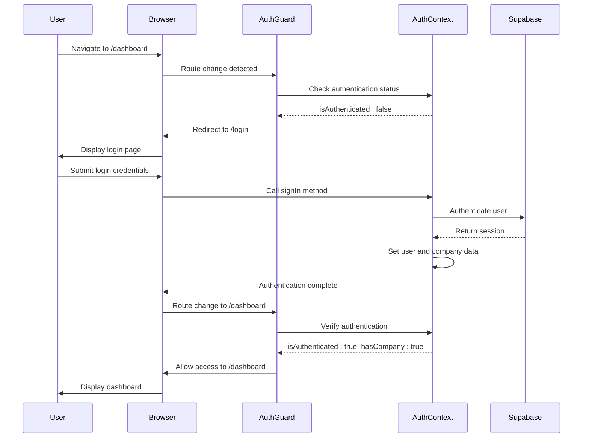
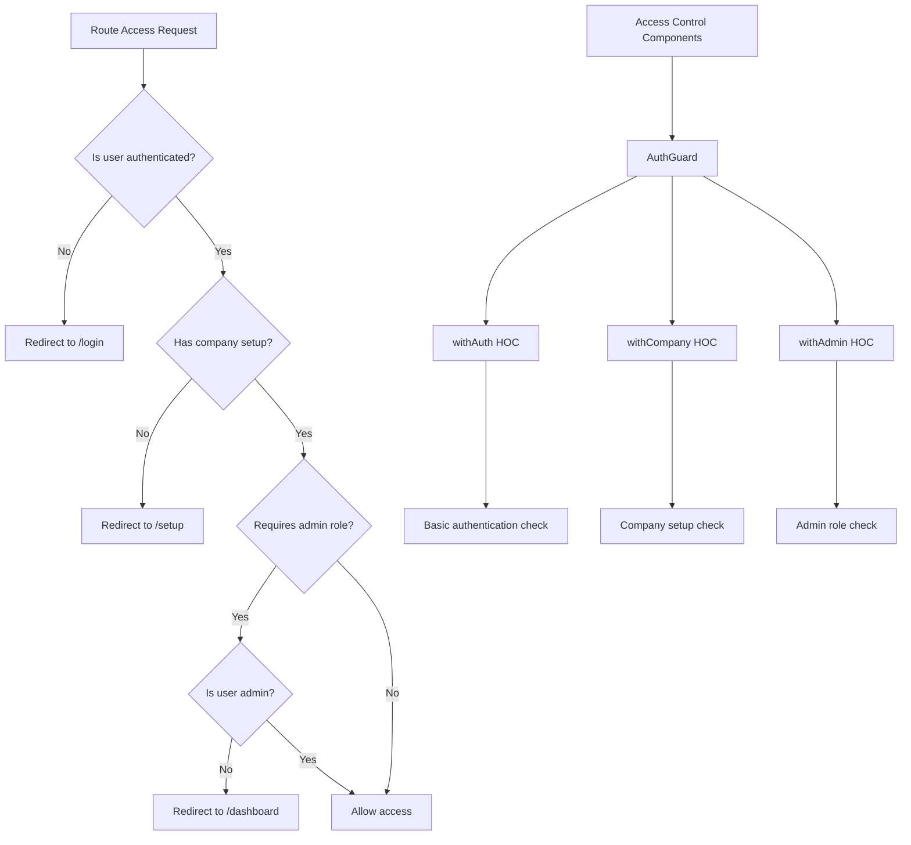
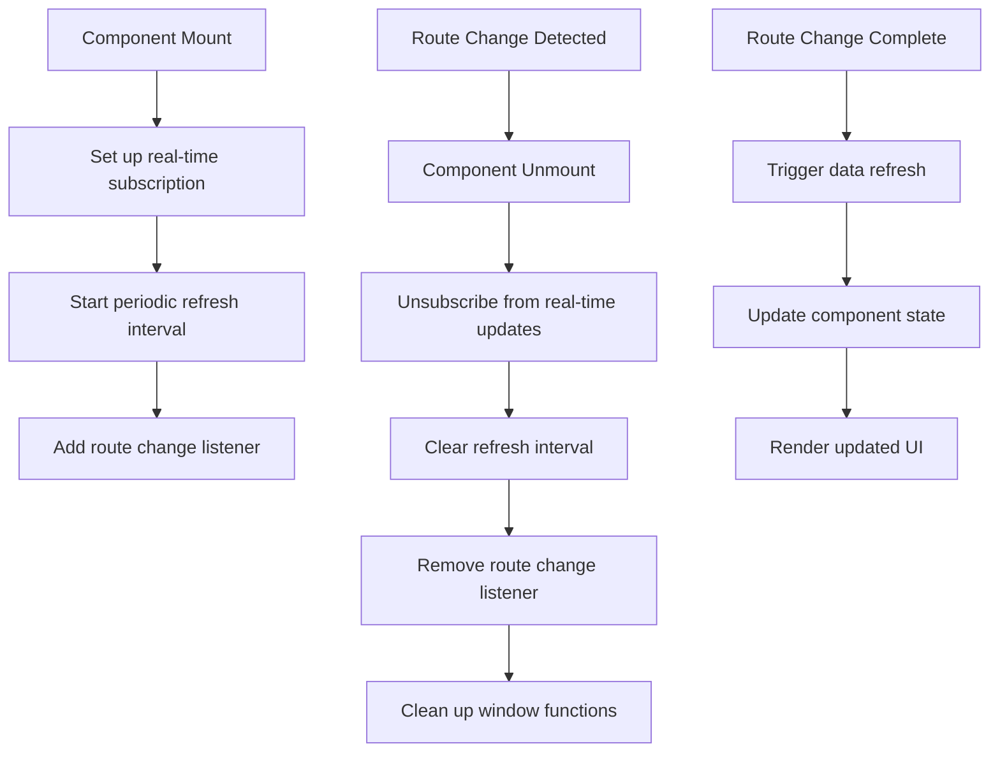
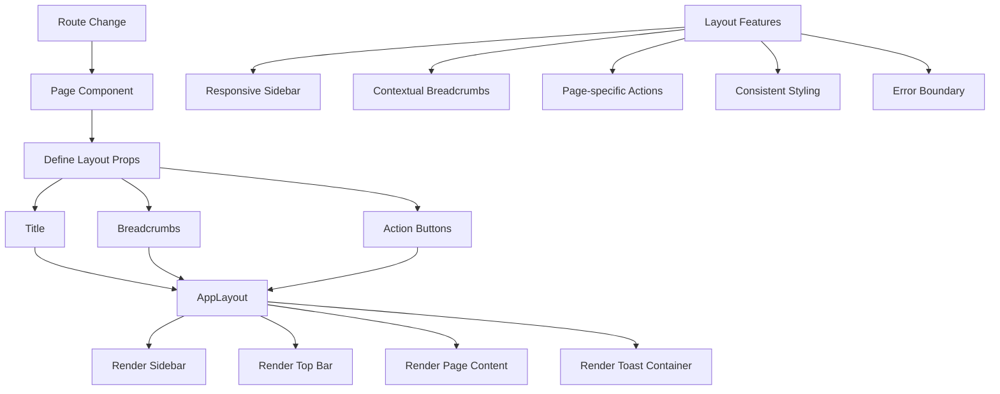

# Routing Strategy

<cite>
**Referenced Files in This Document**   
- [src/pages/_app.js](file://src/pages/_app.js)
- [src/components/auth/AuthGuard.js](file://src/components/auth/AuthGuard.js)
- [src/context/AuthContext.js](file://src/context/AuthContext.js)
- [src/pages/index.js](file://src/pages/index.js)
- [src/pages/dashboard.js](file://src/pages/dashboard.js)
- [src/pages/login.js](file://src/pages/login.js)
- [src/pages/setup.js](file://src/pages/setup.js)
- [src/pages/sales/invoices/[id].js](file://src/pages/sales/invoices/[id].js)
- [src/pages/purchase/bills/[id]/edit.js](file://src/pages/purchase/bills/[id]/edit.js)
- [src/components/shared/layout/AppLayout.js](file://src/components/shared/layout/AppLayout.js)
- [src/components/sales/InvoiceList.js](file://src/components/sales/InvoiceList.js)
</cite>

## Table of Contents
1. [Introduction](#introduction)
2. [Next.js File-Based Routing Structure](#nextjs-file-based-routing-structure)
3. [Core Module Routing](#core-module-routing)
4. [Dynamic Routing Patterns](#dynamic-routing-patterns)
5. [Authentication Flow and Redirects](#authentication-flow-and-redirects)
6. [Protected Routes and Access Control](#protected-routes-and-access-control)
7. [Route Change Detection and Cleanup](#route-change-detection-and-cleanup)
8. [Layout Integration with Routing](#layout-integration-with-routing)
9. [Navigation Event Handling](#navigation-event-handling)
10. [Conclusion](#conclusion)

## Introduction
The ezbillify-v1 application implements a comprehensive routing strategy using Next.js file-based routing system. This documentation details the routing architecture, focusing on how UI routes are structured for core modules including sales, purchase, accounting, and GST. The system leverages the pages directory to define routes, with special attention to authentication flows, protected routes, and dynamic routing patterns. The routing strategy is tightly integrated with authentication context, company setup requirements, and role-based access control to ensure secure and seamless user experience across the application.

**Section sources**
- [src/pages/_app.js](file://src/pages/_app.js#L1-L23)
- [src/components/auth/AuthGuard.js](file://src/components/auth/AuthGuard.js#L1-L182)

## Next.js File-Based Routing Structure
The ezbillify-v1 application utilizes Next.js file-based routing system with the pages directory as the foundation for route definition. Each file in the pages directory corresponds to a route in the application, with the file path determining the URL structure. The routing system follows a hierarchical organization where core modules are represented as subdirectories within the pages directory, including sales, purchase, accounting, and GST.

The application implements a clean and intuitive URL structure that reflects the business domain. For example, sales-related routes are organized under `/sales/`, with sub-routes for invoices, quotations, sales orders, payments, and returns. Similarly, purchase-related functionality is accessible under `/purchase/` with routes for bills, purchase orders, and payments made. This organizational approach provides a logical grouping of related functionality and makes the routing structure easily navigable.

The routing system also incorporates special pages for authentication and onboarding, including `/login`, `/register`, `/forgot-password`, and `/setup`. These pages serve as entry points to the application and handle user authentication flows. The index page (`/`) acts as the public landing page, redirecting authenticated users to the dashboard while allowing unauthenticated users to access marketing content and sign-up options.

```mermaid
graph TB
A[/] --> B[/login]
A --> C[/register]
A --> D[/dashboard]
A --> E[/setup]
D --> F[/sales]
D --> G[/purchase]
D --> H[/accounting]
D --> I[/gst]
F --> J[/sales/invoices]
F --> K[/sales/quotations]
F --> L[/sales/sales-orders]
G --> M[/purchase/bills]
G --> N[/purchase/purchase-orders]
H --> O[/accounting/journal-entries]
H --> P[/accounting/reports]
I --> Q[/gst/e-invoice]
I --> R[/gst/eway-bill]
```

**Diagram sources**
- [src/pages/index.js](file://src/pages/index.js#L1-L622)
- [src/pages/dashboard.js](file://src/pages/dashboard.js#L1-L419)

**Section sources**
- [src/pages/index.js](file://src/pages/index.js#L1-L622)
- [src/pages/dashboard.js](file://src/pages/dashboard.js#L1-L419)

## Core Module Routing
The application organizes its core modules using a structured routing approach that reflects the business domains of sales, purchase, accounting, and GST. Each module has its own dedicated route structure with consistent naming conventions and hierarchical organization. The sales module routes are organized under `/sales/` and include sub-routes for key business processes such as quotations, sales orders, invoices, payments, and returns. This structure enables users to navigate through the sales workflow in a logical sequence from quotation to payment collection.

The purchase module follows a similar pattern with routes under `/purchase/` for managing bills, purchase orders, goods receipt notes (GRN), and payments made to vendors. This organization supports the procurement workflow from purchase order creation to bill processing and payment. The accounting module routes under `/accounting/` provide access to financial management features including journal entries, general ledger, bank reconciliation, and financial reports. This structure allows accountants to perform their daily tasks efficiently.

The GST module routes under `/gst/` focus on compliance-related functionality, including e-invoice management, e-way bill generation, and GST filings. These routes are designed to help businesses meet Indian tax regulations with minimal effort. Each module's index page serves as a dashboard that provides an overview of the module's functionality and quick access to key actions, creating a consistent user experience across different business domains.

```mermaid
graph TD
A[Sales Module] --> B[/sales]
B --> C[/sales/quotations]
B --> D[/sales/sales-orders]
B --> E[/sales/invoices]
B --> F[/sales/payments]
B --> G[/sales/returns]
H[Purchase Module] --> I[/purchase]
I --> J[/purchase/purchase-orders]
I --> K[/purchase/bills]
I --> L[/purchase/grn]
I --> M[/purchase/payments-made]
I --> N[/purchase/returns]
O[Accounting Module] --> P[/accounting]
P --> Q[/accounting/journal-entries]
P --> R[/accounting/general-ledger]
P --> S[/accounting/trial-balance]
P --> T[/accounting/profit-loss]
P --> U[/accounting/balance-sheet]
P --> V[/accounting/reports]
W[GST Module] --> X[/gst]
X --> Y[/gst/e-invoice]
X --> Z[/gst/eway-bill]
X --> AA[/gst/gstr1]
X --> AB[/gst/gstr2]
X --> AC[/gst/gstr3b]
```

**Diagram sources**
- [src/pages/sales/index.js](file://src/pages/sales/index.js#L1-L137)
- [src/pages/purchase/index.js](file://src/pages/purchase/index.js#L1-L66)
- [src/pages/accounting/index.js](file://src/pages/accounting/index.js#L1-L318)

**Section sources**
- [src/pages/sales/index.js](file://src/pages/sales/index.js#L1-L137)
- [src/pages/purchase/index.js](file://src/pages/purchase/index.js#L1-L66)
- [src/pages/accounting/index.js](file://src/pages/accounting/index.js#L1-L318)

## Dynamic Routing Patterns
The ezbillify-v1 application implements dynamic routing using Next.js bracket notation to handle entity-specific views and editing functionality. Dynamic routes are created using the `[id].js` pattern, allowing the application to render content based on parameters in the URL. This approach is used extensively across modules to display details for specific entities such as invoices, bills, purchase orders, and customers.

For example, the sales invoices module uses the route `/sales/invoices/[id].js` to display individual invoice details. When a user navigates to `/sales/invoices/123`, the `id` parameter is extracted from the URL and used to fetch and display the specific invoice with ID 123. Similarly, the purchase bills module uses `/purchase/bills/[id].js` for viewing bill details and `/purchase/bills/[id]/edit.js` for editing existing bills. This pattern enables clean, SEO-friendly URLs while maintaining a single component to handle multiple instances of the same entity type.

The application also implements nested dynamic routes for more complex scenarios. For instance, the route `/sales/customers/[id]/ledger.js` allows viewing a specific customer's ledger, combining a dynamic customer ID with a fixed ledger view. This hierarchical approach supports complex data relationships while maintaining intuitive URL structures. The dynamic routing system is complemented by proper error handling, displaying appropriate messages when invalid IDs are provided or when requested entities do not exist.

```mermaid
graph TD
A[/sales/invoices/[id].js] --> B[Extract ID from URL]
B --> C[Fetch invoice data by ID]
C --> D[Display invoice details]
E[/purchase/bills/[id]/edit.js] --> F[Extract bill ID from URL]
F --> G[Fetch bill data by ID]
G --> H[Render edit form with existing data]
I[/sales/customers/[id]/ledger.js] --> J[Extract customer ID from URL]
J --> K[Fetch customer ledger data]
K --> L[Display transaction history]
M[Route Parameters] --> N[Use router.query to access parameters]
N --> O[Handle loading states]
O --> P[Validate entity existence]
P --> Q[Render appropriate content or error]
```

**Diagram sources**
- [src/pages/sales/invoices/[id].js](file://src/pages/sales/invoices/[id].js#L1-L63)
- [src/pages/purchase/bills/[id]/edit.js](file://src/pages/purchase/bills/[id]/edit.js#L1-L59)

**Section sources**
- [src/pages/sales/invoices/[id].js](file://src/pages/sales/invoices/[id].js#L1-L63)
- [src/pages/purchase/bills/[id]/edit.js](file://src/pages/purchase/bills/[id]/edit.js#L1-L59)

## Authentication Flow and Redirects
The ezbillify-v1 application implements a comprehensive authentication flow that governs user access to protected routes and ensures proper navigation based on authentication state. The system uses a combination of public and protected routes, with unauthenticated users being redirected to the login page when attempting to access secured areas. The authentication flow is managed through the AuthGuard component, which intercepts route changes and enforces authentication requirements.

When an unauthenticated user attempts to access the application, they are directed to the public landing page (`/`) or the login page (`/login`). Upon successful authentication, users are redirected to the dashboard (`/dashboard`) if they have an existing company, or to the setup page (`/setup`) if they need to configure their company profile. This ensures that users are guided through the appropriate onboarding process based on their account status.

The authentication system also handles post-login navigation by preserving the intended destination through the `redirectTo` query parameter. If a user attempts to access a protected route while unauthenticated, they are redirected to login with the original URL preserved, allowing them to be redirected back to their intended destination after authentication. The system also implements special handling for workforce users, blocking their access to the web application as they are intended to use mobile-specific interfaces.



**Diagram sources**
- [src/components/auth/AuthGuard.js](file://src/components/auth/AuthGuard.js#L1-L182)
- [src/pages/login.js](file://src/pages/login.js#L1-L700)
- [src/pages/setup.js](file://src/pages/setup.js#L1-L81)

**Section sources**
- [src/components/auth/AuthGuard.js](file://src/components/auth/AuthGuard.js#L1-L182)
- [src/pages/login.js](file://src/pages/login.js#L1-L700)
- [src/pages/setup.js](file://src/pages/setup.js#L1-L81)

## Protected Routes and Access Control
The ezbillify-v1 application implements a robust system of protected routes and access control using the AuthGuard component to enforce authentication, company setup requirements, and role-based permissions. The AuthGuard acts as a middleware that wraps protected pages and components, evaluating the user's authentication state and permissions before allowing access. This approach ensures that sensitive functionality is only accessible to authorized users.

The access control system implements multiple layers of protection. First, it verifies that the user is authenticated by checking the `isAuthenticated` flag from the AuthContext. Second, it ensures that users have completed company setup by validating the `hasCompany` flag, redirecting users to the setup page if they haven't configured their company profile. Third, it enforces role-based access control by checking the `isAdmin` flag for routes that require administrative privileges.

The AuthGuard component provides higher-order component (HOC) wrappers such as `withAuth`, `withCompany`, and `withAdmin` that can be applied to any page or component to enforce specific access requirements. For example, financial reporting pages use `withAdmin` to restrict access to administrators only, while basic data entry forms use `withCompany` to ensure users have a configured company but don't require administrative privileges. This flexible system allows for granular control over access to different parts of the application based on business requirements.



**Diagram sources**
- [src/components/auth/AuthGuard.js](file://src/components/auth/AuthGuard.js#L1-L182)
- [src/context/AuthContext.js](file://src/context/AuthContext.js#L1-L613)

**Section sources**
- [src/components/auth/AuthGuard.js](file://src/components/auth/AuthGuard.js#L1-L182)
- [src/context/AuthContext.js](file://src/context/AuthContext.js#L1-L613)

## Route Change Detection and Cleanup
The ezbillify-v1 application implements comprehensive route change detection and cleanup mechanisms to ensure optimal performance and prevent memory leaks. Components that subscribe to real-time data updates or set up intervals for periodic refresh implement proper cleanup in their useEffect cleanup functions. This ensures that subscriptions are unsubscribed and intervals are cleared when components are unmounted due to route changes.

For example, the InvoiceList component subscribes to real-time updates for invoice data and sets up a periodic refresh interval. The component's cleanup function unsubscribes from the real-time subscription, removes any window functions, and clears the refresh interval when the component is unmounted. This prevents unnecessary network requests and processing when the user navigates away from the invoices page.

The application also implements route change detection to trigger data refreshes when users navigate between pages. The InvoiceList component listens for 'routeChangeComplete' events from the Next.js router, triggering a refresh whenever the route changes. This ensures that users see the most up-to-date data when returning to a page, particularly after performing actions on related pages (e.g., creating a new invoice from another module). The combination of proper cleanup and strategic refreshes maintains data consistency while optimizing resource usage.



**Diagram sources**
- [src/components/sales/InvoiceList.js](file://src/components/sales/InvoiceList.js#L208-L244)

**Section sources**
- [src/components/sales/InvoiceList.js](file://src/components/sales/InvoiceList.js#L208-L244)

## Layout Integration with Routing
The ezbillify-v1 application integrates layout components seamlessly with the routing system through the AppLayout component, which provides a consistent user interface across all protected routes. The AppLayout wraps all authenticated pages and includes essential UI elements such as the sidebar navigation, top bar, breadcrumbs, and action buttons. This approach ensures a cohesive user experience while allowing individual pages to customize their content and functionality.

The AppLayout component receives props such as title, actions, and breadcrumbs from individual pages, enabling contextual customization based on the current route. For example, the sales dashboard page passes "Sales Management" as the title, while the invoice detail page passes "View Sales Invoice". Action buttons are also customized per page, with the dashboard displaying a "Create Invoice" button while the invoice list page shows filtering and export options.

The layout system also handles special states such as inactive company subscriptions by overlaying a subscription management interface on top of the main layout. This ensures that users are informed about subscription issues regardless of their current location in the application. The integration between routing and layout components creates a unified interface that guides users through the application while maintaining brand consistency and usability.



**Diagram sources**
- [src/components/shared/layout/AppLayout.js](file://src/components/shared/layout/AppLayout.js#L1-L76)

**Section sources**
- [src/components/shared/layout/AppLayout.js](file://src/components/shared/layout/AppLayout.js#L1-L76)

## Navigation Event Handling
The ezbillify-v1 application implements sophisticated navigation event handling to manage user interactions and maintain application state across route changes. The system leverages Next.js router events to detect navigation actions and respond appropriately, ensuring a smooth user experience. Navigation events are used to trigger data refreshes, update UI states, and manage authentication flows.

The application listens for 'routeChangeComplete' events to detect when navigation has finished, allowing components to perform post-navigation actions such as refreshing data or updating analytics. This is particularly important for components that display real-time data, ensuring they show the most current information when users return to a page. The navigation system also handles programmatic navigation through router methods like push and replace, which are used for redirects after authentication or form submissions.

Navigation event handling is also integrated with authentication state management. When authentication status changes, the application uses navigation events to redirect users to appropriate routes based on their authentication and company setup status. Error handling is implemented for failed navigation attempts, with fallback routes and error pages to maintain application stability. The comprehensive navigation event system ensures that the application responds predictably to user actions while maintaining data consistency and security.

**Section sources**
- [src/pages/index.js](file://src/pages/index.js#L74-L83)
- [src/pages/dashboard.js](file://src/pages/dashboard.js#L25-L46)

## Conclusion
The routing strategy in ezbillify-v1 demonstrates a well-architected approach to navigation in a complex business application. By leveraging Next.js file-based routing, the system provides a clear and intuitive URL structure that aligns with business domains. The implementation of protected routes through the AuthGuard component ensures secure access control, while dynamic routing patterns enable flexible handling of entity-specific views.

The integration of authentication flows with routing creates a seamless onboarding experience, guiding users through the appropriate steps based on their account status. Comprehensive route change detection and cleanup mechanisms maintain application performance and prevent memory leaks. The consistent layout integration across routes provides a cohesive user experience, while contextual customization allows for page-specific functionality.

Overall, the routing strategy effectively balances technical requirements with user experience considerations, creating a navigation system that is both robust and intuitive. The modular design allows for easy extension of new routes and functionality while maintaining consistency across the application.