# Routing and Data Fetching Patterns

<cite>
**Referenced Files in This Document**   
- [src/pages/_app.js](file://src/pages/_app.js)
- [src/hooks/useAPI.js](file://src/hooks/useAPI.js)
- [src/services/accountingService.js](file://src/services/accountingService.js)
- [src/services/customerService.js](file://src/services/customerService.js)
- [src/components/auth/AuthGuard.js](file://src/components/auth/AuthGuard.js)
- [src/context/AuthContext.js](file://src/context/AuthContext.js)
- [src/lib/middleware.js](file://src/lib/middleware.js)
- [src/services/utils/supabase.js](file://src/services/utils/supabase.js)
- [src/pages/index.js](file://src/pages/index.js)
- [src/pages/dashboard.js](file://src/pages/dashboard.js)
- [src/pages/api/customers/[id].js](file://src/pages/api/customers/[id].js)
- [src/pages/api/customers/index.js](file://src/pages/api/customers/index.js)
- [src/pages/items/items/[id]/edit.js](file://src/pages/items/items/[id]/edit.js)
- [src/pages/purchase/bills/[id]/edit.js](file://src/pages/purchase/bills/[id]/edit.js)
- [src/pages/sales/customers/[id]/ledger.js](file://src/pages/sales/customers/[id]/ledger.js)
</cite>

## Table of Contents
1. [Introduction](#introduction)
2. [Project Structure](#project-structure)
3. [Core Components](#core-components)
4. [Architecture Overview](#architecture-overview)
5. [Detailed Component Analysis](#detailed-component-analysis)
6. [Dependency Analysis](#dependency-analysis)
7. [Performance Considerations](#performance-considerations)
8. [Troubleshooting Guide](#troubleshooting-guide)
9. [Conclusion](#conclusion)

## Introduction
This document provides comprehensive documentation for the routing and data fetching patterns implemented in the ezbillify-v1 application. The system utilizes Next.js file-based routing with a pages directory structure, implementing both UI routes and API routes. The architecture incorporates server-side rendering, static generation, and client-side data fetching strategies with custom hooks and service layer abstractions. Authentication is integrated through context providers and protected routes using AuthGuard components.

## Project Structure
The ezbillify-v1 application follows a standard Next.js project structure with a pages directory for routing, components for UI elements, hooks for reusable logic, services for business logic, and context for state management. The pages directory contains both UI routes and API routes, with dynamic routing implemented through bracket notation for entity editing and API endpoint design.

```mermaid
graph TB
subgraph "Pages"
Pages["pages/"]
Pages --> Index["index.js"]
Pages --> Dashboard["dashboard.js"]
Pages --> Auth["auth/"]
Pages --> API["api/"]
Pages --> Items["items/"]
Pages --> Purchase["purchase/"]
Pages --> Sales["sales/"]
end
subgraph "Components"
Components["components/"]
Components --> Shared["shared/"]
Components --> Auth["auth/"]
Components --> Items["items/"]
Components --> Purchase["purchase/"]
Components --> Sales["sales/"]
end
subgraph "Services"
Services["services/"]
Services --> Accounting["accountingService.js"]
Services --> Customer["customerService.js"]
Services --> Utils["utils/"]
end
subgraph "Hooks"
Hooks["hooks/"]
Hooks --> UseAPI["useAPI.js"]
Hooks --> UseAuth["useAuth.js"]
end
subgraph "Context"
Context["context/"]
Context --> AuthContext["AuthContext.js"]
end
Pages --> Components
Pages --> Services
Pages --> Hooks
Pages --> Context
```

**Diagram sources**
- [src/pages](file://src/pages)
- [src/components](file://src/components)
- [src/services](file://src/services)
- [src/hooks](file://src/hooks)
- [src/context](file://src/context)

**Section sources**
- [src/pages](file://src/pages)
- [src/components](file://src/components)
- [src/services](file://src/services)
- [src/hooks](file://src/hooks)
- [src/context](file://src/context)

## Core Components
The core components of the ezbillify-v1 application include the routing system, data fetching patterns, authentication integration, and service layer abstractions. These components work together to provide a seamless user experience with efficient data handling and secure access control.

**Section sources**
- [src/pages/_app.js](file://src/pages/_app.js)
- [src/hooks/useAPI.js](file://src/hooks/useAPI.js)
- [src/services/accountingService.js](file://src/services/accountingService.js)
- [src/services/customerService.js](file://src/services/customerService.js)
- [src/components/auth/AuthGuard.js](file://src/components/auth/AuthGuard.js)

## Architecture Overview
The ezbillify-v1 application architecture is built on Next.js with a file-based routing system. The architecture incorporates server-side rendering, static generation, and client-side data fetching strategies. The system uses custom hooks for data fetching and service layer abstractions that interface with API routes. Authentication is integrated through context providers and protected routes using AuthGuard components.

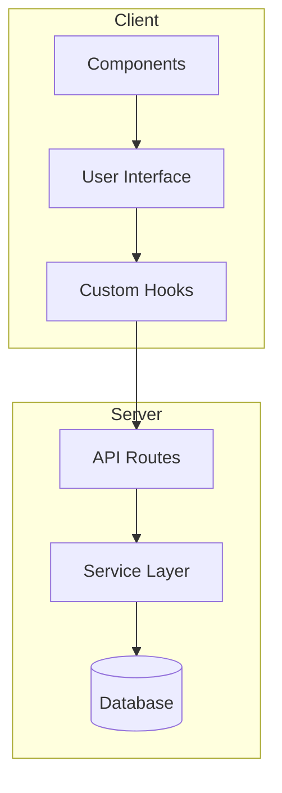

**Diagram sources**
- [src/pages](file://src/pages)
- [src/hooks](file://src/hooks)
- [src/services](file://src/services)
- [src/components](file://src/components)

## Detailed Component Analysis

### Routing System Analysis
The ezbillify-v1 application implements a Next.js file-based routing system through the pages directory. This system supports both UI routes and API routes, with dynamic routing for entity editing using bracket notation patterns.

#### File-based Routing
The application uses the pages directory to define routes, with each file corresponding to a route. For example, `index.js` maps to the root route, `dashboard.js` maps to `/dashboard`, and files in subdirectories follow the directory structure.

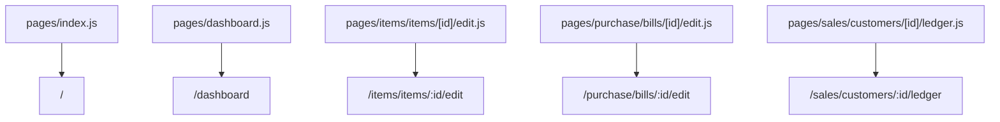

**Diagram sources**
- [src/pages/index.js](file://src/pages/index.js)
- [src/pages/dashboard.js](file://src/pages/dashboard.js)
- [src/pages/items/items/[id]/edit.js](file://src/pages/items/items/[id]/edit.js)
- [src/pages/purchase/bills/[id]/edit.js](file://src/pages/purchase/bills/[id]/edit.js)
- [src/pages/sales/customers/[id]/ledger.js](file://src/pages/sales/customers/[id]/ledger.js)

#### API Routes
The application implements API routes within the pages/api directory, allowing server-side logic to be executed. These routes handle CRUD operations for various entities and are protected by authentication middleware.

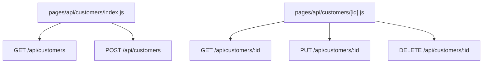

**Diagram sources**
- [src/pages/api/customers/index.js](file://src/pages/api/customers/index.js)
- [src/pages/api/customers/[id].js](file://src/pages/api/customers/[id].js)

### Data Fetching Patterns
The application implements multiple data fetching patterns including server-side rendering, static generation, and client-side data fetching with custom hooks and service layer abstractions.

#### Custom Hooks for Data Fetching
The `useAPI` hook provides a centralized way to handle API requests with loading states, error handling, and caching. It uses Supabase for database operations and includes request deduplication and caching mechanisms.

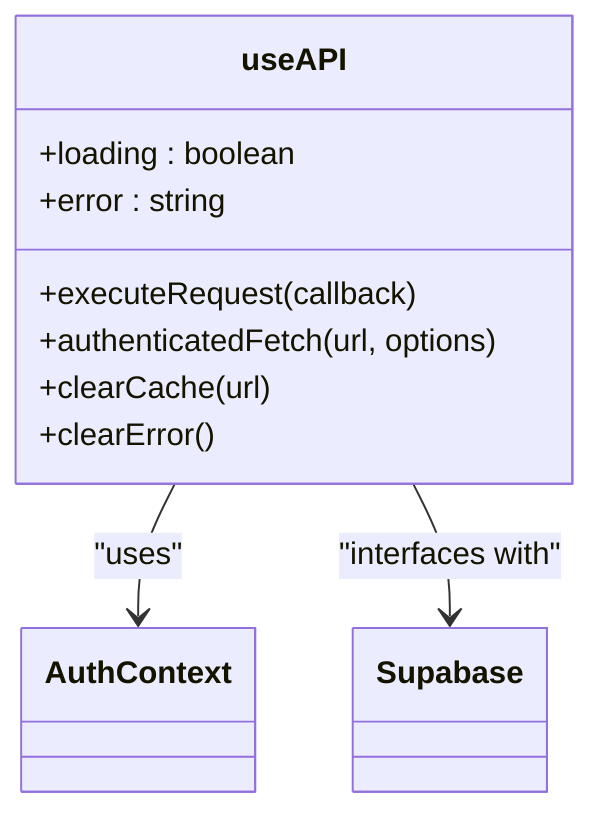

**Diagram sources**
- [src/hooks/useAPI.js](file://src/hooks/useAPI.js)
- [src/context/AuthContext.js](file://src/context/AuthContext.js)
- [src/services/utils/supabase.js](file://src/services/utils/supabase.js)

#### Service Layer Abstractions
Service classes like `accountingService` and `customerService` provide abstractions that interface with API routes. These services handle business logic and data transformations before returning data to components.

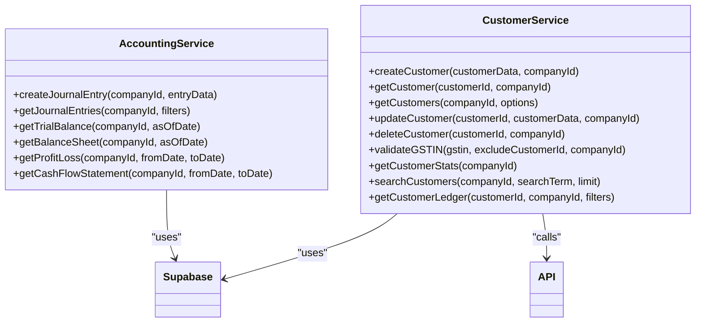

**Diagram sources**
- [src/services/accountingService.js](file://src/services/accountingService.js)
- [src/services/customerService.js](file://src/services/customerService.js)
- [src/services/utils/supabase.js](file://src/services/utils/supabase.js)
- [src/pages/api/customers/index.js](file://src/pages/api/customers/index.js)

#### Server-side Rendering and Static Generation
The application uses server-side rendering for dynamic pages that require data fetching on each request and static generation for pages that can be pre-rendered. This approach optimizes performance and SEO.

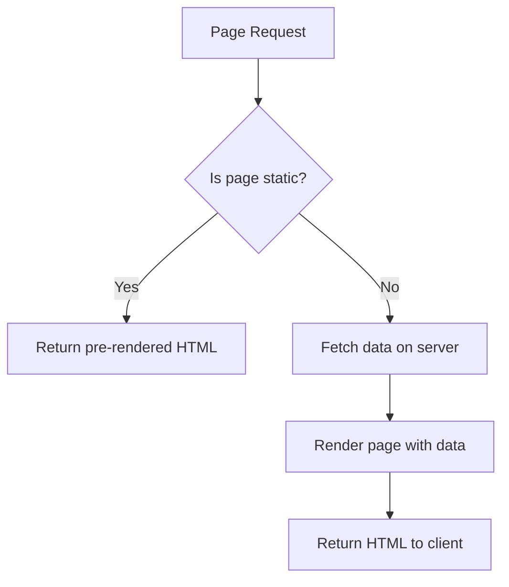

**Diagram sources**
- [src/pages/index.js](file://src/pages/index.js)
- [src/pages/dashboard.js](file://src/pages/dashboard.js)

### Authentication Integration
The application integrates authentication through context providers and protected routes using the AuthGuard component. This ensures that only authenticated users can access protected routes.

#### AuthContext and AuthProvider
The AuthContext provides authentication state and functions to components through the AuthProvider. It manages user session, profile, and company information.

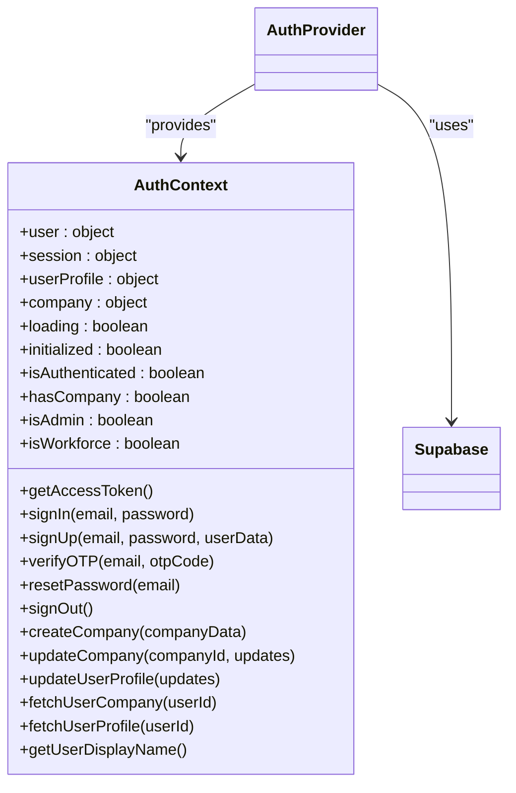

**Diagram sources**
- [src/context/AuthContext.js](file://src/context/AuthContext.js)
- [src/services/utils/supabase.js](file://src/services/utils/supabase.js)

#### AuthGuard Component
The AuthGuard component protects routes by checking authentication state and redirecting users as needed. It supports different access levels through props like requireCompany and requireAdmin.

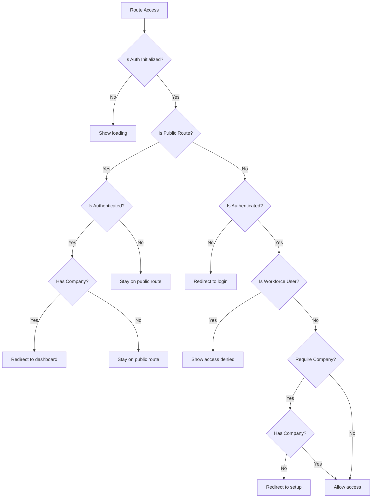

**Diagram sources**
- [src/components/auth/AuthGuard.js](file://src/components/auth/AuthGuard.js)
- [src/context/AuthContext.js](file://src/context/AuthContext.js)

## Dependency Analysis
The ezbillify-v1 application has a well-defined dependency structure with clear separation of concerns between components, services, and data fetching layers.

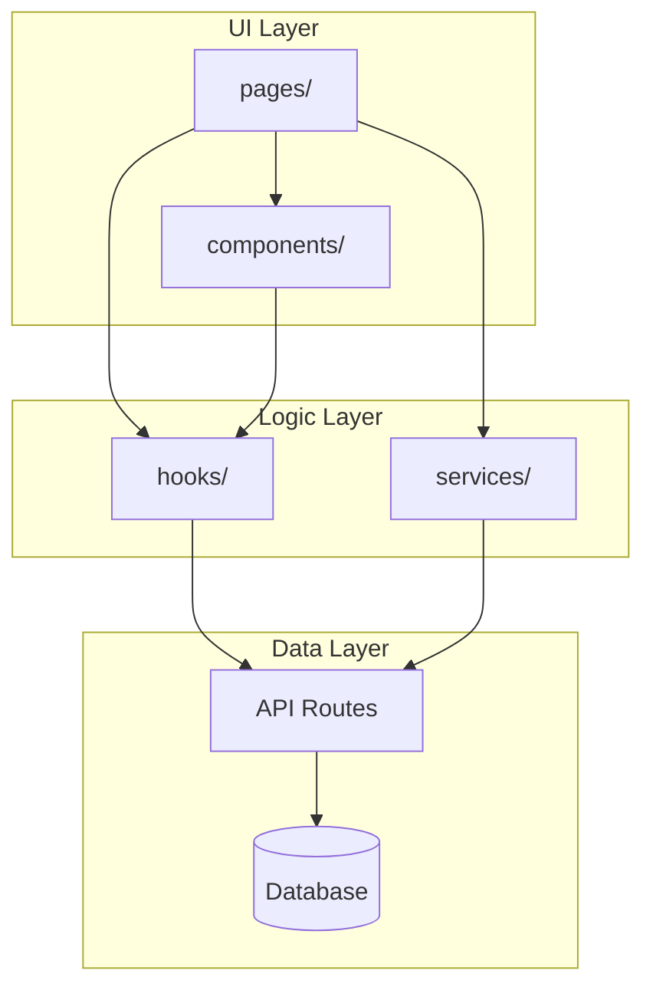

**Diagram sources**
- [src/pages](file://src/pages)
- [src/components](file://src/components)
- [src/hooks](file://src/hooks)
- [src/services](file://src/services)
- [src/pages/api](file://src/pages/api)

## Performance Considerations
The application implements several performance optimizations including request deduplication, caching strategies, and efficient data fetching patterns.

### Caching Strategies
The application uses in-memory caching for frequently accessed data to reduce database queries and improve response times.

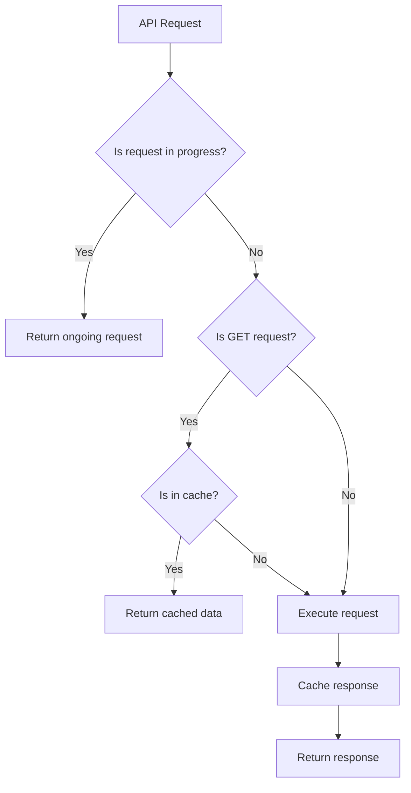

**Diagram sources**
- [src/hooks/useAPI.js](file://src/hooks/useAPI.js)
- [src/services/customerService.js](file://src/services/customerService.js)

### Error Handling and Loading States
The application implements comprehensive error handling and loading states to provide a smooth user experience.

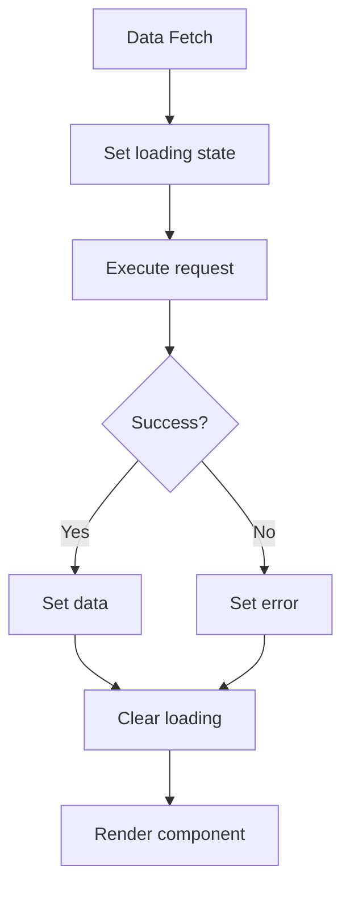

**Diagram sources**
- [src/hooks/useAPI.js](file://src/hooks/useAPI.js)
- [src/pages/dashboard.js](file://src/pages/dashboard.js)

## Troubleshooting Guide
This section provides guidance for troubleshooting common issues related to routing and data fetching in the ezbillify-v1 application.

### Common Issues
- **Authentication redirects not working**: Ensure the AuthGuard is properly implemented and the authentication state is correctly managed in AuthContext.
- **API requests failing**: Check the authentication token and ensure the API routes are properly protected with middleware.
- **Data not updating**: Verify that cache is properly cleared when data changes and that the correct data fetching strategy is used.

**Section sources**
- [src/components/auth/AuthGuard.js](file://src/components/auth/AuthGuard.js)
- [src/context/AuthContext.js](file://src/context/AuthContext.js)
- [src/hooks/useAPI.js](file://src/hooks/useAPI.js)
- [src/lib/middleware.js](file://src/lib/middleware.js)

## Conclusion
The ezbillify-v1 application implements a robust routing and data fetching architecture using Next.js file-based routing, custom hooks, service layer abstractions, and comprehensive authentication integration. The system supports server-side rendering, static generation, and client-side data fetching with efficient caching strategies and error handling. This architecture provides a scalable foundation for the application with clear separation of concerns and optimized performance.