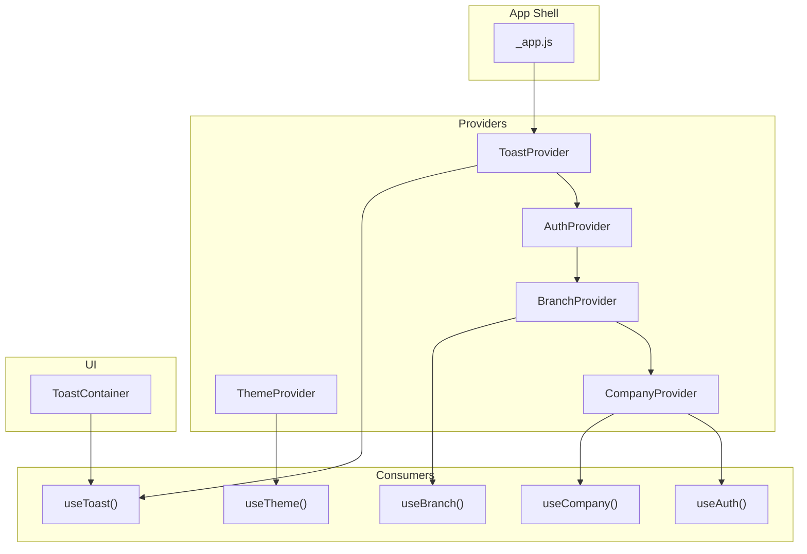
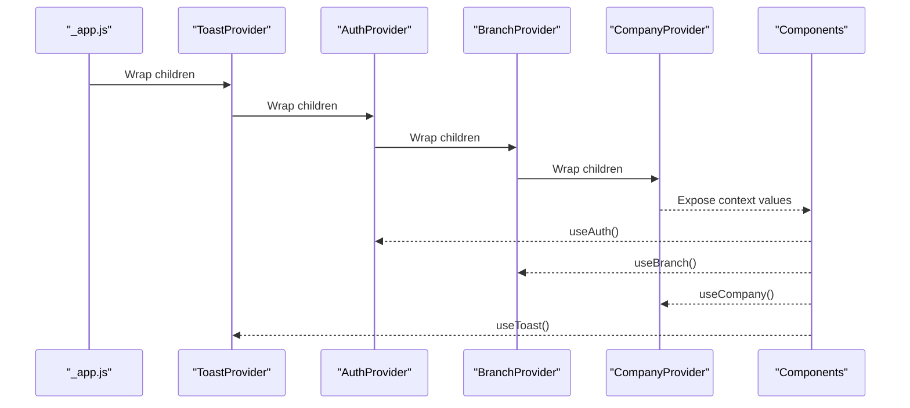
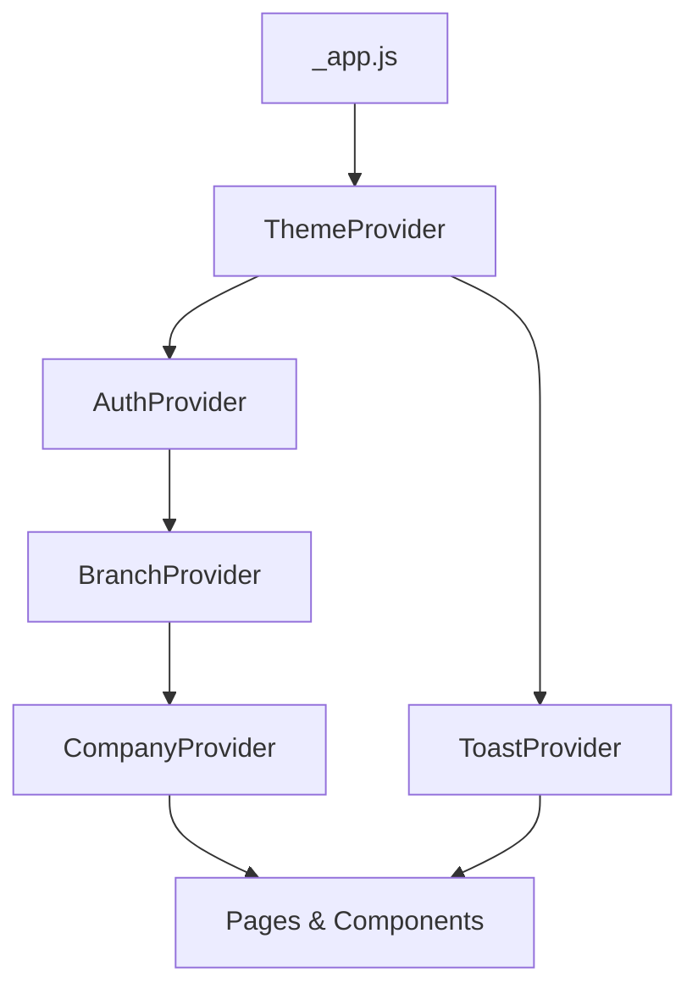
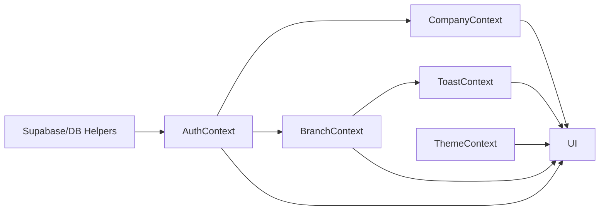

# Context Providers

<cite>
**Referenced Files in This Document**
- [_app.js](file://src/pages/_app.js)
- [AuthContext.js](file://src/context/AuthContext.js)
- [CompanyContext.js](file://src/context/CompanyContext.js)
- [BranchContext.js](file://src/context/BranchContext.js)
- [ThemeContext.js](file://src/context/ThemeContext.js)
- [ToastContext.js](file://src/context/ToastContext.js)
- [Toast.js](file://src/components/shared/feedback/Toast.js)
- [useLocalStorage.js](file://src/hooks/useLocalStorage.js)
</cite>

## Table of Contents
1. [Introduction](#introduction)
2. [Project Structure](#project-structure)
3. [Core Components](#core-components)
4. [Architecture Overview](#architecture-overview)
5. [Detailed Component Analysis](#detailed-component-analysis)
6. [Dependency Analysis](#dependency-analysis)
7. [Performance Considerations](#performance-considerations)
8. [Troubleshooting Guide](#troubleshooting-guide)
9. [Conclusion](#conclusion)

## Introduction
This document explains the React Context providers that power global state in ezbillify-v1. It covers how each provider initializes state, manages updates, and exposes a value object to consumers. It also describes how these providers are wrapped in the Next.js app shell, how setters and helpers are used to mutate state, and how to avoid unnecessary re-renders. Finally, it outlines error boundaries and fallback behaviors when contexts are consumed outside their providers.

## Project Structure
The context providers are located under src/context and are composed in the Next.js app shell at src/pages/_app.js. Consumers use dedicated hooks to access context values and update state.

**Diagram sources**
- [_app.js](file://src/pages/_app.js#L1-L23)
- [ThemeContext.js](file://src/context/ThemeContext.js#L1-L63)
- [AuthContext.js](file://src/context/AuthContext.js#L1-L613)
- [BranchContext.js](file://src/context/BranchContext.js#L1-L229)
- [CompanyContext.js](file://src/context/CompanyContext.js#L1-L467)
- [ToastContext.js](file://src/context/ToastContext.js#L1-L81)
- [Toast.js](file://src/components/shared/feedback/Toast.js#L141-L160)

**Section sources**
- [_app.js](file://src/pages/_app.js#L1-L23)

## Core Components
- AuthContext: Manages authentication state, user profile, company association, and authentication actions (sign in, sign up, OTP verification, password reset, sign out, create/update company/profile).
- CompanyContext: Loads and maintains company-wide settings, tax rates, units, and chart of accounts; exposes helpers to update and manage them.
- BranchContext: Fetches and selects active branches; exposes CRUD operations for branches and a refetch mechanism.
- ThemeContext: Persists and toggles UI theme using localStorage and system preference.
- ToastContext: Global notification state with helper methods for different toast types and lifecycle controls.

**Section sources**
- [AuthContext.js](file://src/context/AuthContext.js#L1-L613)
- [CompanyContext.js](file://src/context/CompanyContext.js#L1-L467)
- [BranchContext.js](file://src/context/BranchContext.js#L1-L229)
- [ThemeContext.js](file://src/context/ThemeContext.js#L1-L63)
- [ToastContext.js](file://src/context/ToastContext.js#L1-L81)

## Architecture Overview
The providers are composed in a strict order in _app.js to ensure downstream consumers receive the correct context values. AuthContext is at the top because CompanyContext depends on it, and BranchContext depends on AuthContext. ToastProvider wraps everything to ensure global notifications are available.

**Diagram sources**
- [_app.js](file://src/pages/_app.js#L1-L23)
- [AuthContext.js](file://src/context/AuthContext.js#L1-L613)
- [BranchContext.js](file://src/context/BranchContext.js#L1-L229)
- [CompanyContext.js](file://src/context/CompanyContext.js#L1-L467)
- [ToastContext.js](file://src/context/ToastContext.js#L1-L81)

## Detailed Component Analysis

### AuthContext
Responsibilities:
- Initialize authentication state from Supabase session.
- Track user, session, and user profile.
- Compute derived flags (isAdmin, isWorkforce, isAuthenticated, hasCompany).
- Provide authentication actions: signIn, signUp, verifyOTP, resetPassword, signOut.
- Manage company creation and linking, and profile updates.
- Expose a helper to safely get a valid access token.

State initialization and lifecycle:
- Uses useEffect to initialize from Supabase session and listen for auth state changes.
- On SIGNED_OUT or missing session, clears state.
- On SIGNED_IN, refetches user profile and company.
- On TOKEN_REFRESHED, updates session without refetching profile/company.

Value object exposed:
- user, session, userProfile, company, loading, initialized, isAuthenticated, hasCompany, isAdmin, isWorkforce, getUserDisplayName, getAccessToken, signIn, signUp, verifyOTP, resetPassword, signOut, createCompany, updateCompany, updateUserProfile, fetchUserCompany, fetchUserProfile.

Update mechanisms:
- Direct setters for user/session/company/profile.
- Actions that call backend APIs or Supabase helpers and update state accordingly.

Best practices:
- Avoid unnecessary re-renders by keeping value object stable; the provider returns a single object with all values and functions.
- Use computed flags to minimize re-computation in consumers.

Error handling:
- Throws a descriptive error when useAuth is used outside AuthProvider.
- Handles Supabase errors gracefully and logs them.

**Section sources**
- [AuthContext.js](file://src/context/AuthContext.js#L1-L613)

### CompanyContext
Responsibilities:
- Initialize company data when AuthContext provides a company.
- Load company settings, tax rates, units, and chart of accounts in parallel.
- Expose helpers to update company info, upload branding assets, manage settings, and CRUD operations for tax rates, units, and chart of accounts.
- Provide helper getters for active items and defaults.

State initialization and lifecycle:
- useEffect watches authCompany and loads data when present; clears state when absent.

Value object exposed:
- company, loading, settings, taxRates, units, chartOfAccounts, plus functions to update and manage each domain.

Update mechanisms:
- Functions that call database helpers and update local state arrays or objects immutably.

Best practices:
- Split rendering concerns by using separate providers for company and branch if needed to reduce re-renders in unrelated parts of the UI.
- Memoize expensive computations in consumers using selectors or useMemo.

Error handling:
- Throws a descriptive error when useCompany is used outside CompanyProvider.
- Logs and handles errors from database helpers.

**Section sources**
- [CompanyContext.js](file://src/context/CompanyContext.js#L1-L467)

### BranchContext
Responsibilities:
- Fetch branches for the current company using the Supabase access token.
- Allow selecting a branch, and expose CRUD operations for branches.
- Integrate with ToastContext to surface success/error notifications.

State initialization and lifecycle:
- useEffect triggers fetch when user, session, and company are available.
- Provides refetchBranches to reload data on demand.

Value object exposed:
- branches, selectedBranch, loading, error, selectBranch, addBranch, updateBranch, deleteBranch, refetchBranches.

Update mechanisms:
- API calls to /api/branches endpoints with Authorization header.
- Updates local state arrays and selected branch when necessary.

Best practices:
- Prefer context splitting if only a subset of consumers needs branch data; otherwise, keep it centralized for simplicity.
- Debounce or batch UI updates when many branches change frequently.

Error handling:
- Throws a descriptive error when useBranch is used outside BranchProvider.
- Uses addToast to surface errors and successes.

**Section sources**
- [BranchContext.js](file://src/context/BranchContext.js#L1-L229)

### ThemeContext
Responsibilities:
- Persist and toggle UI theme across sessions.
- Respect system preference if no saved theme exists.
- Apply theme to document element and persist to localStorage.

State initialization and lifecycle:
- Reads saved theme on mount; falls back to system preference.
- Applies theme to document and persists to localStorage.

Value object exposed:
- theme, isDark, isLight, toggleTheme, setLightTheme, setDarkTheme, mounted.

Update mechanisms:
- setTheme updates state; effects apply to DOM and persist to localStorage.

Best practices:
- Keep ThemeProvider near the root to ensure global theme application.
- Avoid frequent theme toggles in hot paths; memoize theme-dependent UI.

Error handling:
- Throws a descriptive error when useTheme is used outside ThemeProvider.

**Section sources**
- [ThemeContext.js](file://src/context/ThemeContext.js#L1-L63)

### ToastContext
Responsibilities:
- Maintain a queue of toasts with unique ids and durations.
- Provide helper methods for different toast types (success, error, warning, info).
- Expose remove and remove-all functions.

State initialization and lifecycle:
- Starts with an empty toasts array.
- Auto-removes toasts after duration; supports manual removal.

Value object exposed:
- toasts, addToast, removeToast, removeAllToasts, success, error, warning, info.

Update mechanisms:
- addToast creates a new toast and schedules removal.
- removeToast filters out a toast by id.
- removeAllToasts clears the queue.

Best practices:
- Use helper methods for consistent toast types and durations.
- Avoid passing large objects in toast payload; pass minimal identifiers and fetch details in handlers.

Error handling:
- Throws a descriptive error when useToast is used outside ToastProvider.

**Section sources**
- [ToastContext.js](file://src/context/ToastContext.js#L1-L81)

### How Providers Are Wrapped in _app.js
The providers are nested in _app.js so that all pages and components can consume them globally. The order ensures dependencies are satisfied: ToastProvider wraps AuthProvider, which wraps BranchProvider, which wraps CompanyProvider.

**Diagram sources**
- [_app.js](file://src/pages/_app.js#L1-L23)

**Section sources**
- [_app.js](file://src/pages/_app.js#L1-L23)

## Dependency Analysis
- AuthContext depends on Supabase utilities and database helpers for authentication and user/company data.
- CompanyContext depends on AuthContext for company data and on database helpers for master data.
- BranchContext depends on AuthContext for user/session/company and on ToastContext for notifications.
- ThemeContext and ToastContext are standalone and depend on localStorage and DOM/document respectively.

**Diagram sources**
- [AuthContext.js](file://src/context/AuthContext.js#L1-L613)
- [CompanyContext.js](file://src/context/CompanyContext.js#L1-L467)
- [BranchContext.js](file://src/context/BranchContext.js#L1-L229)
- [ThemeContext.js](file://src/context/ThemeContext.js#L1-L63)
- [ToastContext.js](file://src/context/ToastContext.js#L1-L81)

**Section sources**
- [AuthContext.js](file://src/context/AuthContext.js#L1-L613)
- [CompanyContext.js](file://src/context/CompanyContext.js#L1-L467)
- [BranchContext.js](file://src/context/BranchContext.js#L1-L229)
- [ThemeContext.js](file://src/context/ThemeContext.js#L1-L63)
- [ToastContext.js](file://src/context/ToastContext.js#L1-L81)

## Performance Considerations
- Context splitting: Split providers to reduce re-renders when only part of the state changes. For example, isolate ThemeContext and ToastContext at the root, keep AuthContext near routing boundaries, and consider splitting CompanyContext and BranchContext if consumers do not need both.
- Memoization: Use selectors or useMemo in consumers to derive small slices of state and avoid re-rendering components that do not depend on those slices.
- Stable value objects: Keep the value object returned by providers static to prevent unnecessary prop updates.
- Parallel loading: CompanyContext already uses Promise.all to load multiple datasets concurrently; continue this pattern for other multi-resource contexts.
- Avoid heavy payloads in toasts: Keep toast payloads minimal to reduce render overhead.

[No sources needed since this section provides general guidance]

## Troubleshooting Guide
Common issues and resolutions:
- Consuming a context outside its provider:
  - Symptom: Error thrown indicating the hook must be used within a provider.
  - Resolution: Ensure the provider is rendered in the component tree (e.g., wrap components in the correct provider order in _app.js).
- Authentication state not reflecting changes:
  - Symptom: UI does not update after login/logout or token refresh.
  - Resolution: Verify AuthContext listens to Supabase auth state changes and that initialized flag prevents premature handling.
- Branch data not loading:
  - Symptom: Empty branch list or error messages.
  - Resolution: Confirm user, session, and company are available; check network requests to /api/branches and ensure Authorization header is present.
- Theme not persisting:
  - Symptom: Theme resets on reload.
  - Resolution: Ensure ThemeProvider runs on the client and localStorage is accessible; verify system preference fallback logic.
- Toasts not appearing:
  - Symptom: No notifications shown.
  - Resolution: Confirm ToastProvider is rendered and ToastContainer is included; ensure useToast is used within ToastProvider.

**Section sources**
- [AuthContext.js](file://src/context/AuthContext.js#L1-L613)
- [BranchContext.js](file://src/context/BranchContext.js#L1-L229)
- [ThemeContext.js](file://src/context/ThemeContext.js#L1-L63)
- [ToastContext.js](file://src/context/ToastContext.js#L1-L81)
- [Toast.js](file://src/components/shared/feedback/Toast.js#L141-L160)

## Conclusion
The ezbillify-v1 context providers establish a robust foundation for global state management. They are structured to minimize coupling, leverage Supabase for authentication and data, and provide clear update mechanisms. By following best practices—context splitting, memoization, and careful provider composition—you can achieve predictable performance and reliable behavior across the application.