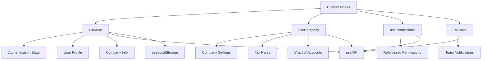
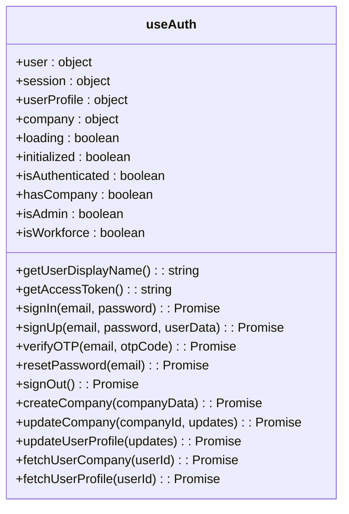
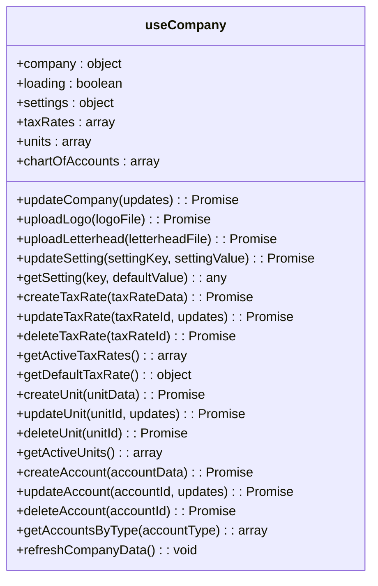
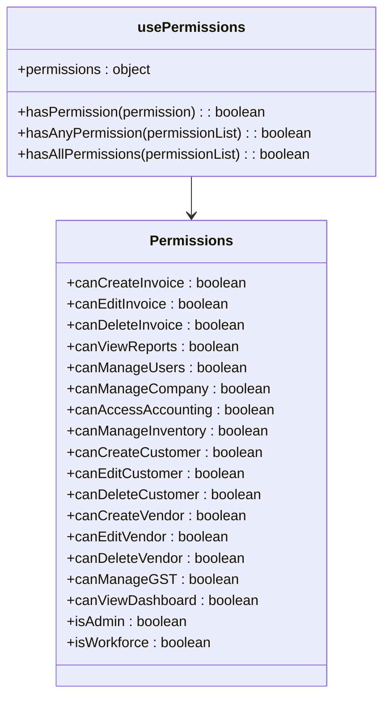
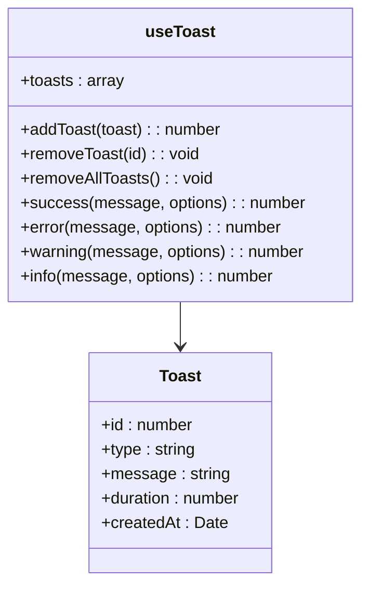
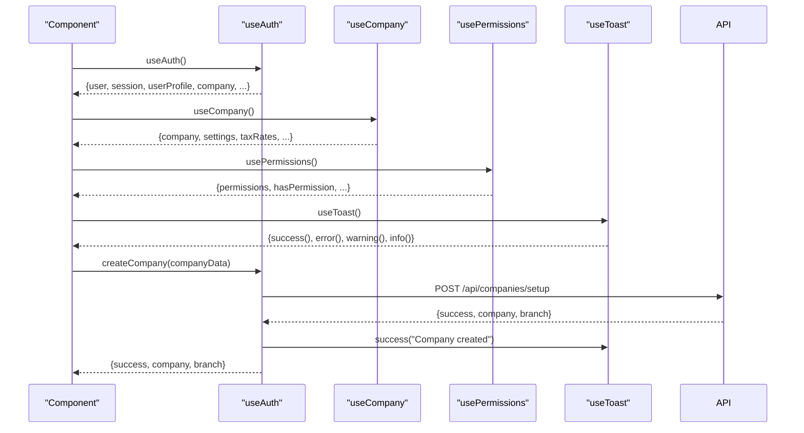
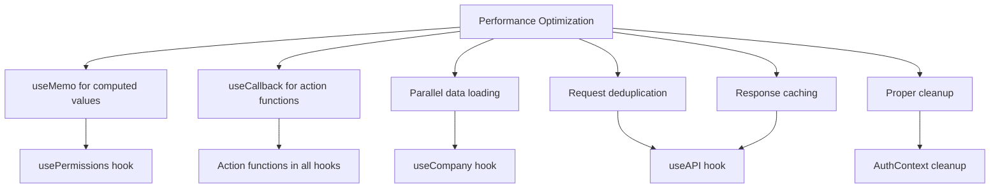

# Custom Hooks

<cite>
**Referenced Files in This Document**   
- [AuthContext.js](file://src/context/AuthContext.js)
- [CompanyContext.js](file://src/context/CompanyContext.js)
- [ToastContext.js](file://src/context/ToastContext.js)
- [useAuth.js](file://src/hooks/useAuth.js)
- [useCompany.js](file://src/hooks/useCompany.js)
- [usePermissions.js](file://src/hooks/usePermissions.js)
- [useToast.js](file://src/hooks/useToast.js)
- [useAPI.js](file://src/hooks/useAPI.js)
- [useLocalStorage.js](file://src/hooks/useLocalStorage.js)
- [AuthGuard.js](file://src/components/auth/AuthGuard.js)
- [CompanySetup.js](file://src/components/auth/CompanySetup.js)
- [DashboardLayout.js](file://src/components/dashboard/DashboardLayout.js)
</cite>

## Table of Contents
1. [Introduction](#introduction)
2. [Core Custom Hooks Overview](#core-custom-hooks-overview)
3. [useAuth Hook](#useauth-hook)
4. [useCompany Hook](#usecompany-hook)
5. [usePermissions Hook](#usepermissions-hook)
6. [useToast Hook](#usetoast-hook)
7. [Hook Integration and Usage](#hook-integration-and-usage)
8. [Performance Considerations](#performance-considerations)
9. [Conclusion](#conclusion)

## Introduction

The ezbillify-v1 application implements a robust custom React hooks system to manage context state consumption across components. These hooks abstract the complexity of context access, provide type-safe interfaces, and ensure consistent error handling throughout the application. The primary custom hooks—useAuth, useCompany, usePermissions, and useToast—encapsulate the logic for accessing their respective contexts, making state management more maintainable and reusable.

These hooks follow React best practices by using the useContext hook to access context values and implementing safety checks to prevent usage outside of their providers. They return structured objects containing both state variables and action functions, enabling components to both read state and trigger state changes through a clean, consistent API.

The hooks system integrates with other utilities like useAPI and useLocalStorage to provide comprehensive state management solutions, including data persistence and API communication capabilities. This documentation details the implementation, usage, and integration of these custom hooks within the ezbillify-v1 application.

**Section sources**
- [AuthContext.js](file://src/context/AuthContext.js#L1-L613)
- [CompanyContext.js](file://src/context/CompanyContext.js#L1-L467)
- [ToastContext.js](file://src/context/ToastContext.js#L1-L81)

## Core Custom Hooks Overview

The ezbillify-v1 application implements four primary custom hooks for context state consumption:

- **useAuth**: Manages authentication state, user profile, and company information
- **useCompany**: Handles company-specific data including settings, tax rates, and chart of accounts
- **usePermissions**: Provides role-based access control and permission checking
- **useToast**: Manages toast notifications and user feedback

Each hook follows a consistent pattern: it uses useContext to access its corresponding context, validates that it's being used within the appropriate provider, and returns a structured object containing state and functions. This abstraction allows components to consume context state without needing to import and manage multiple context objects directly.

The hooks are designed to be composable, allowing them to be used together in components that require access to multiple context states. They also integrate with other hooks like useAPI for data fetching and useLocalStorage for state persistence, creating a cohesive state management system.

**Diagram sources**
- [useAuth.js](file://src/hooks/useAuth.js#L1-L13)
- [useCompany.js](file://src/hooks/useCompany.js#L1-L114)
- [usePermissions.js](file://src/hooks/usePermissions.js#L1-L67)
- [useToast.js](file://src/hooks/useToast.js#L1-L13)

## useAuth Hook

The useAuth hook provides access to authentication state, user profile information, and company data. It serves as the central authentication management system for the application, exposing both state variables and action functions for authentication operations.

The hook returns an object containing user authentication state (user, session, loading), user profile data (userProfile), company information (company), and computed values (isAuthenticated, hasCompany, isAdmin, isWorkforce). It also provides action functions for authentication operations including signIn, signUp, verifyOTP, resetPassword, signOut, createCompany, updateCompany, and updateUserProfile.

A key feature of the useAuth hook is its comprehensive error handling and safety checks. The hook throws a descriptive error if used outside of the AuthProvider, preventing runtime errors from undefined context access. It also includes a getAccessToken function that validates token expiration before returning the access token, ensuring secure API requests.

The hook integrates with Supabase for authentication and database operations, using helper functions from the services/utils/supabase module. It manages the complete authentication lifecycle, from initial session retrieval to handling auth state changes through Supabase's onAuthStateChange listener.

**Diagram sources**
- [AuthContext.js](file://src/context/AuthContext.js#L573-L596)
- [useAuth.js](file://src/hooks/useAuth.js#L5-L11)

**Section sources**
- [AuthContext.js](file://src/context/AuthContext.js#L1-L613)
- [useAuth.js](file://src/hooks/useAuth.js#L1-L13)

## useCompany Hook

The useCompany hook manages company-specific data and operations, providing access to company information, settings, tax rates, units, and chart of accounts. It acts as a data layer for company-related functionality, abstracting the complexity of data fetching and state management.

The hook returns state variables for company data (company, loading, settings, taxRates, units, chartOfAccounts) and action functions for CRUD operations on company data. These include updateCompany, uploadLogo, uploadLetterhead, updateSetting, createTaxRate, updateTaxRate, deleteTaxRate, createUnit, updateUnit, deleteUnit, createAccount, updateAccount, and deleteAccount.

A key aspect of the useCompany hook is its dependency on the useAuth hook. It automatically synchronizes with the company data from the authentication context and loads related company data when the company changes. The hook implements a loadCompanyData function that fetches all company-related data in parallel, improving performance by reducing multiple API calls.

The hook also provides helper functions for working with company data, such as getActiveTaxRates, getActiveUnits, getAccountsByType, getDefaultTaxRate, and getSetting. These functions abstract common data filtering operations, making it easier for components to work with company data without implementing their own filtering logic.

**Diagram sources**
- [CompanyContext.js](file://src/context/CompanyContext.js#L418-L457)
- [useCompany.js](file://src/hooks/useCompany.js#L6-L114)

**Section sources**
- [CompanyContext.js](file://src/context/CompanyContext.js#L1-L467)
- [useCompany.js](file://src/hooks/useCompany.js#L1-L114)

## usePermissions Hook

The usePermissions hook implements role-based access control (RBAC) for the application, providing a centralized system for managing user permissions based on their role (admin or workforce). It evaluates user permissions based on their role and company association, returning a structured permissions object.

The hook returns a permissions object containing boolean flags for various application capabilities such as canCreateInvoice, canEditInvoice, canDeleteInvoice, canViewReports, canManageUsers, canManageCompany, canAccessAccounting, and canManageInventory. It also provides utility functions for checking permissions: hasPermission, hasAnyPermission, and hasAllPermissions.

The permissions are computed using useMemo to optimize performance, recalculating only when the userProfile or company state changes. The hook implements a clear permission hierarchy where admin users have full access to all features, while workforce users have limited access (primarily for creating invoices and customers). This approach ensures consistent permission checking across the application.

The hook integrates seamlessly with UI components to conditionally render features based on user permissions, preventing unauthorized access to sensitive functionality. It also supports permission-based routing through higher-order components like withAdmin and withCompany, which wrap pages and restrict access based on user permissions.

**Diagram sources**
- [usePermissions.js](file://src/hooks/usePermissions.js#L5-L65)
- [AuthGuard.js](file://src/components/auth/AuthGuard.js#L8-L18)

**Section sources**
- [usePermissions.js](file://src/hooks/usePermissions.js#L1-L67)
- [AuthGuard.js](file://src/components/auth/AuthGuard.js#L1-L182)

## useToast Hook

The useToast hook provides a centralized system for displaying toast notifications to users, offering feedback for various application events such as successful operations, errors, warnings, and informational messages. It abstracts the complexity of toast management, providing a simple API for displaying notifications.

The hook returns an object containing the current toasts array and functions for managing toasts: addToast, removeToast, removeAllToasts, success, error, warning, and info. The success, error, warning, and info functions are convenience methods that create toasts with predefined types and durations, making it easier to display common notification types.

The hook implements automatic toast removal after a specified duration, with different durations for different toast types (5 seconds for info, success, and warning; 7 seconds for error). It also supports manual removal through removeToast and removeAllToasts functions, giving components fine-grained control over toast visibility.

The useToast hook integrates with the ToastContext and is typically used in conjunction with other hooks like useAPI to provide feedback for API operations. For example, when an API request succeeds, a success toast can be displayed, and when it fails, an error toast can be shown with details about the failure.

**Diagram sources**
- [ToastContext.js](file://src/context/ToastContext.js#L55-L64)
- [useToast.js](file://src/hooks/useToast.js#L5-L11)

**Section sources**
- [ToastContext.js](file://src/context/ToastContext.js#L1-L81)
- [useToast.js](file://src/hooks/useToast.js#L1-L13)

## Hook Integration and Usage

The custom hooks are integrated throughout the ezbillify-v1 application, providing a consistent pattern for state management and context consumption. Components use these hooks to access state and perform actions without directly importing context objects, promoting reusability and maintainability.

In the AuthGuard component, the useAuth hook is used to protect routes based on authentication state, company association, and user role. The component uses the isAuthenticated, hasCompany, isAdmin, and isWorkforce values to determine whether to allow access to protected routes, redirect users, or display access denied messages.

The CompanySetup component uses the useAuth hook to access user information and the createCompany function. It demonstrates how hooks provide both state (user) and actions (createCompany) in a single, cohesive API. The component also uses the useToast hook indirectly through the createCompany function's error handling.

The DashboardLayout component uses the useAuth hook to access company information for subscription status checks. It demonstrates how hooks can be used in layout components to control UI elements based on application state, such as displaying subscription overlays when a company's status is inactive.

**Diagram sources**
- [AuthGuard.js](file://src/components/auth/AuthGuard.js#L8-L18)
- [CompanySetup.js](file://src/components/auth/CompanySetup.js#L18)
- [DashboardLayout.js](file://src/components/dashboard/DashboardLayout.js#L12)
- [AppLayout.js](file://src/components/shared/layout/AppLayout.js#L12)

**Section sources**
- [AuthGuard.js](file://src/components/auth/AuthGuard.js#L1-L182)
- [CompanySetup.js](file://src/components/auth/CompanySetup.js#L1-L652)
- [DashboardLayout.js](file://src/components/dashboard/DashboardLayout.js#L1-L45)
- [AppLayout.js](file://src/components/shared/layout/AppLayout.js#L1-L76)

## Performance Considerations

The custom hooks in ezbillify-v1 are designed with performance optimization in mind, implementing several strategies to minimize unnecessary re-renders and optimize data fetching.

The usePermissions hook uses useMemo to memoize the permissions object, ensuring it only recalculates when the userProfile or company state changes. This prevents unnecessary re-renders of components that consume the hook when other state changes occur.

The useCompany hook implements parallel data loading through Promise.all, fetching settings, tax rates, units, and chart of accounts simultaneously rather than sequentially. This reduces the total loading time for company data and improves the user experience.

The useAPI hook includes request deduplication and caching mechanisms to prevent multiple identical requests from being sent simultaneously and to cache responses for a configurable duration. This reduces network traffic and improves application responsiveness, especially for frequently accessed data.

Several hooks use useCallback to memoize action functions, preventing unnecessary re-creation of functions on each render. This is particularly important for functions that are passed as props to child components or used as dependencies in useEffect hooks.

The hooks also implement proper cleanup in useEffect hooks, preventing memory leaks and ensuring resources are properly released when components unmount. For example, the AuthContext uses a cleanup function to unsubscribe from the Supabase auth state change listener.

**Diagram sources**
- [usePermissions.js](file://src/hooks/usePermissions.js#L8-L45)
- [CompanyContext.js](file://src/context/CompanyContext.js#L45-L50)
- [useAPI.js](file://src/hooks/useAPI.js#L48-L59)
- [AuthContext.js](file://src/context/AuthContext.js#L107-L110)

**Section sources**
- [usePermissions.js](file://src/hooks/usePermissions.js#L1-L67)
- [CompanyContext.js](file://src/context/CompanyContext.js#L1-L467)
- [useAPI.js](file://src/hooks/useAPI.js#L1-L133)
- [AuthContext.js](file://src/context/AuthContext.js#L1-L613)

## Conclusion

The custom hooks system in ezbillify-v1 provides a robust, maintainable solution for context state management. By encapsulating context consumption logic in reusable hooks, the application achieves several key benefits:

1. **Abstraction of Complexity**: The hooks hide the implementation details of context access, providing a clean, consistent API for components.

2. **Type Safety**: Each hook returns a well-defined object structure, making it easier to understand what state and functions are available.

3. **Error Prevention**: Safety checks ensure hooks are used correctly, throwing descriptive errors when used outside their providers.

4. **Reusability**: The hooks can be used across multiple components, promoting code reuse and consistency.

5. **Integration**: The hooks work seamlessly with other utilities like useAPI and useLocalStorage, creating a cohesive state management system.

6. **Performance**: Optimization techniques like memoization, parallel loading, and caching improve application performance.

7. **Testability**: The separation of concerns makes the hooks easier to test in isolation.

The useAuth, useCompany, usePermissions, and useToast hooks form the foundation of the application's state management system, enabling components to focus on presentation logic while the hooks handle state access and business logic. This architecture promotes clean, maintainable code and provides a scalable foundation for future feature development.