# State Management System

<cite>
**Referenced Files in This Document**   
- [AuthContext.js](file://src/context/AuthContext.js)
- [CompanyContext.js](file://src/context/CompanyContext.js)
- [BranchContext.js](file://src/context/BranchContext.js)
- [ThemeContext.js](file://src/context/ThemeContext.js)
- [ToastContext.js](file://src/context/ToastContext.js)
- [useAuth.js](file://src/hooks/useAuth.js)
- [useCompany.js](file://src/hooks/useCompany.js)
- [useToast.js](file://src/hooks/useToast.js)
- [useLocalStorage.js](file://src/hooks/useLocalStorage.js)
- [_app.js](file://src/pages/_app.js)
- [SalesOrderForm.js](file://src/components/sales/SalesOrderForm.js)
- [PurchaseOrderForm.js](file://src/components/purchase/PurchaseOrderForm.js)
</cite>

## Table of Contents
1. [Introduction](#introduction)
2. [Context Architecture](#context-architecture)
3. [Core Context Providers](#core-context-providers)
4. [Custom Hooks](#custom-hooks)
5. [State Initialization and Flow](#state-initialization-and-flow)
6. [Cross-Context Dependencies](#cross-context-dependencies)
7. [Performance Considerations](#performance-considerations)
8. [Error Handling and Persistence](#error-handling-and-persistence)
9. [Usage Examples](#usage-examples)
10. [Extending the State Management System](#extending-the-state-management-system)

## Introduction

The ezbillify-v1 application implements a comprehensive state management system using React Context API to manage global state across critical domains. This system provides a centralized approach to state management while maintaining performance through context splitting and optimized re-renders. The architecture is designed to handle authentication, company data, branch selection, UI theme, and user feedback states, with custom hooks providing a clean interface for components to consume this state.

The state management system follows React best practices by splitting contexts based on state usage patterns to prevent unnecessary re-renders. Each context provider manages a specific domain of state, and custom hooks encapsulate the consumption logic, providing a consistent API across the application. The system also incorporates persistence through localStorage and robust error handling mechanisms.

**Section sources**
- [AuthContext.js](file://src/context/AuthContext.js#L1-L613)
- [CompanyContext.js](file://src/context/CompanyContext.js#L1-L467)
- [BranchContext.js](file://src/context/BranchContext.js#L1-L229)

## Context Architecture

The state management system in ezbillify-v1 follows a hierarchical provider pattern with multiple context providers wrapped in the application's root component. This architecture allows for dependency injection where child contexts can access state from parent contexts while maintaining separation of concerns.

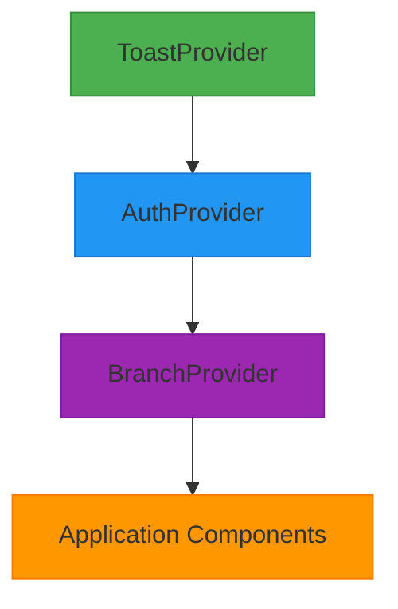

**Diagram sources**
- [_app.js](file://src/pages/_app.js#L1-L23)

The context providers are ordered to establish proper dependency relationships:
1. **ToastProvider**: Top-level provider for user feedback, available throughout the application
2. **AuthProvider**: Manages authentication state and user session
3. **BranchProvider**: Depends on authentication state to fetch company branches

This ordering ensures that each context has access to the state it depends on while maintaining a clean separation of concerns. The context splitting strategy prevents components from re-rendering when unrelated state changes, optimizing performance.

**Section sources**
- [_app.js](file://src/pages/_app.js#L1-L23)
- [AuthContext.js](file://src/context/AuthContext.js#L1-L613)
- [BranchContext.js](file://src/context/BranchContext.js#L1-L229)

## Core Context Providers

### AuthContext

The AuthContext provider manages authentication state, user session, and company information. It initializes on application load by checking for an existing session and fetching user profile and company data. The context maintains several key state variables:

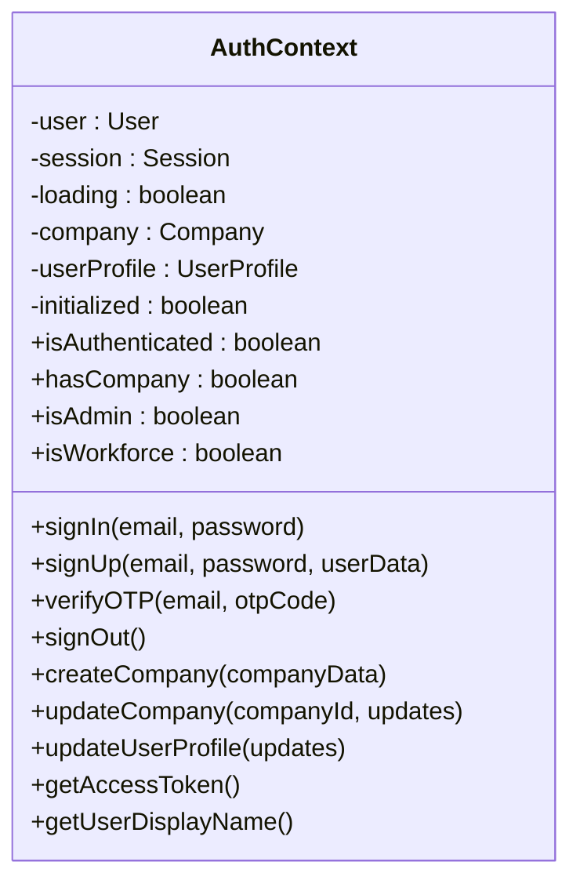

**Diagram sources**
- [AuthContext.js](file://src/context/AuthContext.js#L1-L613)

The AuthContext listens for authentication state changes from Supabase and updates its internal state accordingly. It handles three main events:
- **SIGNED_IN**: Fetches user profile and company data
- **SIGNED_OUT**: Clears all authentication state
- **TOKEN_REFRESHED**: Updates session without refetching profile/company

The context also provides computed values like `isAuthenticated`, `hasCompany`, `isAdmin`, and `isWorkforce` based on the current state, making it easy for components to make authorization decisions.

**Section sources**
- [AuthContext.js](file://src/context/AuthContext.js#L1-L613)

### CompanyContext

The CompanyContext provider manages company-specific data and settings. It depends on the AuthContext to receive the current company and loads related data such as tax rates, units, and chart of accounts. The context maintains state for:

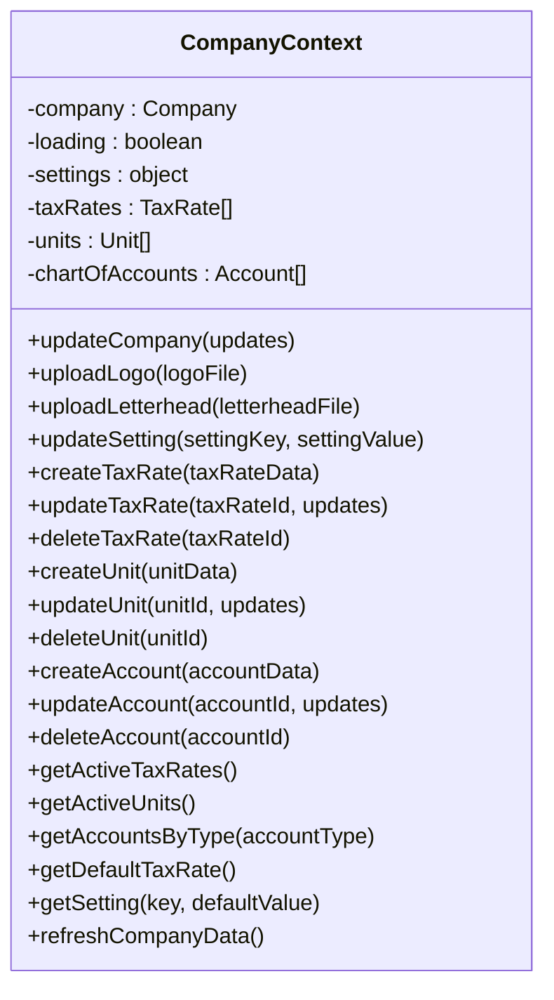

**Diagram sources**
- [CompanyContext.js](file://src/context/CompanyContext.js#L1-L467)

The CompanyContext automatically loads all company-related data when the company changes, using `Promise.all` to fetch multiple data sets in parallel. This ensures that components have access to complete company data without multiple re-renders. The context also provides helper methods to access filtered data, such as active tax rates or accounts by type.

**Section sources**
- [CompanyContext.js](file://src/context/CompanyContext.js#L1-L467)

### BranchContext

The BranchContext provider manages branch selection and operations for multi-branch companies. It depends on both AuthContext and ToastContext to access authentication state and provide user feedback. The context maintains:

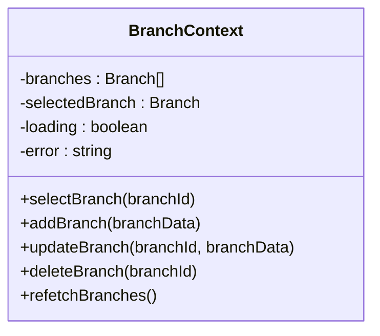

**Diagram sources**
- [BranchContext.js](file://src/context/BranchContext.js#L1-L229)

The BranchContext automatically fetches branches when authentication state is available and selects a default branch (either marked as default or the first in the list). It provides CRUD operations for branches that make API calls and update the local state accordingly, with appropriate error handling and user feedback through ToastContext.

**Section sources**
- [BranchContext.js](file://src/context/BranchContext.js#L1-L229)

### ThemeContext

The ThemeContext provider manages the application's UI theme state. It persists the theme selection in localStorage and applies it to the document element. The context maintains:

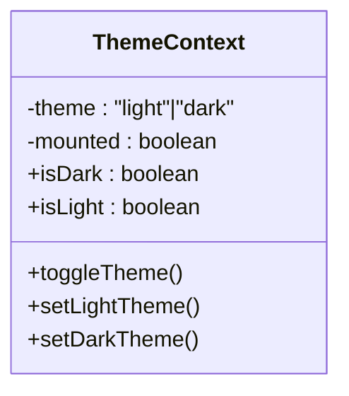

**Diagram sources**
- [ThemeContext.js](file://src/context/ThemeContext.js#L1-L63)

On initialization, the ThemeContext checks localStorage for a saved theme preference, falling back to the system preference if none is found. It applies the theme by adding the appropriate class to the document element, allowing CSS to style the application accordingly.

**Section sources**
- [ThemeContext.js](file://src/context/ThemeContext.js#L1-L63)

### ToastContext

The ToastContext provider manages user feedback through toast notifications. It maintains a queue of toasts and provides methods to add, remove, and categorize notifications:

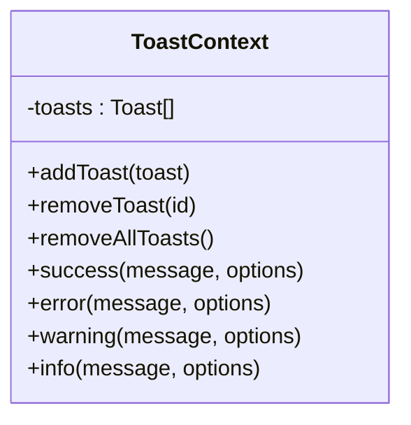

**Diagram sources**
- [ToastContext.js](file://src/context/ToastContext.js#L1-L81)

The context automatically removes toasts after their specified duration and provides helper methods for common notification types (success, error, warning, info) with appropriate defaults. This abstraction simplifies the process of showing user feedback throughout the application.

**Section sources**
- [ToastContext.js](file://src/context/ToastContext.js#L1-L81)

## Custom Hooks

The state management system provides custom hooks that encapsulate context consumption logic and provide a clean interface for components. These hooks handle the useContext calls and provide type safety and error checking.

### useAuth Hook

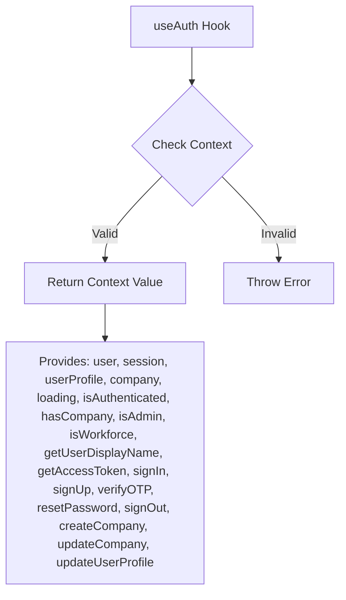

**Diagram sources**
- [useAuth.js](file://src/hooks/useAuth.js#L1-L13)
- [AuthContext.js](file://src/context/AuthContext.js#L605-L611)

The useAuth hook provides access to the AuthContext value and throws an error if used outside of an AuthProvider. It returns all authentication-related state and methods, making it easy for components to access user and company information.

**Section sources**
- [useAuth.js](file://src/hooks/useAuth.js#L1-L13)

### useCompany Hook

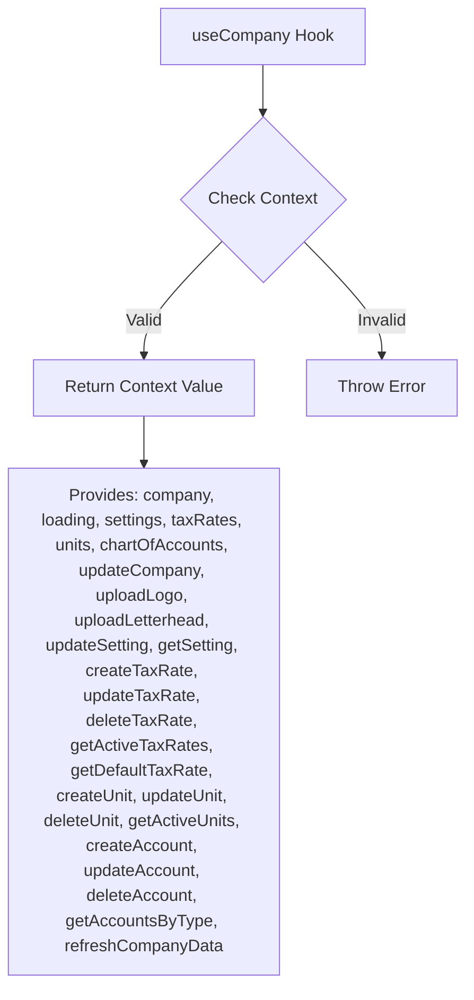

**Diagram sources**
- [useCompany.js](file://src/hooks/useCompany.js#L1-L114)
- [CompanyContext.js](file://src/context/CompanyContext.js#L8-L14)

The useCompany hook provides access to the CompanyContext value and throws an error if used outside of a CompanyProvider. It returns all company-related state and methods, allowing components to work with company data and settings.

**Section sources**
- [useCompany.js](file://src/hooks/useCompany.js#L1-L114)

### useToast Hook

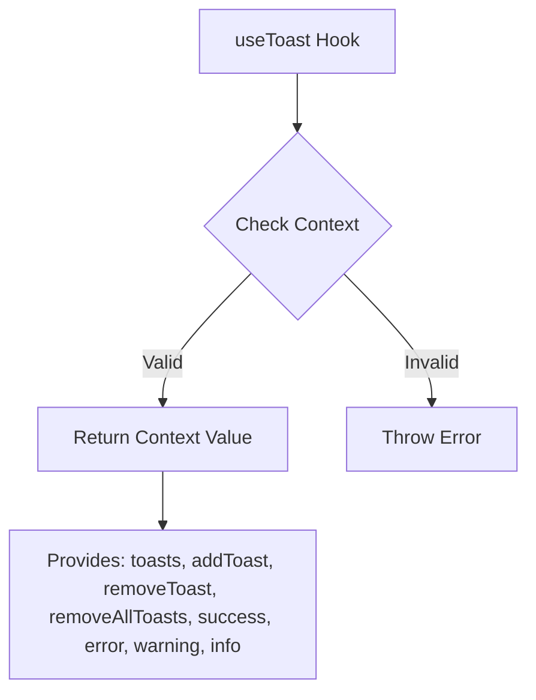

**Diagram sources**
- [useToast.js](file://src/hooks/useToast.js#L1-L13)
- [ToastContext.js](file://src/context/ToastContext.js#L73-L79)

The useToast hook provides access to the ToastContext value and throws an error if used outside of a ToastProvider. It returns the toast queue and methods to add and remove notifications, including convenience methods for different notification types.

**Section sources**
- [useToast.js](file://src/hooks/useToast.js#L1-L13)

### useLocalStorage Hook

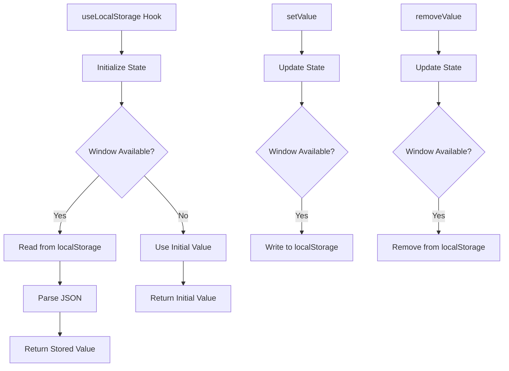

**Diagram sources**
- [useLocalStorage.js](file://src/hooks/useLocalStorage.js#L1-L46)

The useLocalStorage hook provides a simple interface for reading and writing values to localStorage with proper error handling and server-side rendering compatibility. It returns a tuple of [value, setValue, removeValue] similar to useState.

**Section sources**
- [useLocalStorage.js](file://src/hooks/useLocalStorage.js#L1-L46)

## State Initialization and Flow

The state management system follows a well-defined initialization process that ensures data is loaded in the correct order and components receive consistent state.

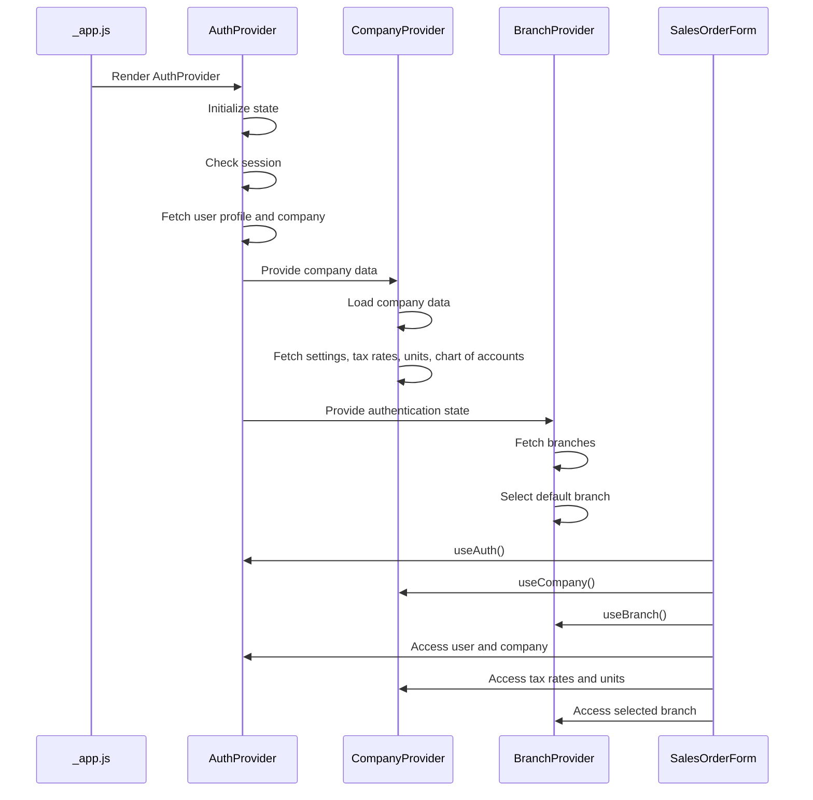

**Diagram sources**
- [AuthContext.js](file://src/context/AuthContext.js#L15-L111)
- [CompanyContext.js](file://src/context/CompanyContext.js#L26-L37)
- [BranchContext.js](file://src/context/BranchContext.js#L17-L24)
- [SalesOrderForm.js](file://src/components/sales/SalesOrderForm.js#L31-L32)

The initialization flow begins with the AuthProvider checking for an existing session and loading user and company data. Once the company is available, the CompanyProvider loads all company-specific data. The BranchProvider fetches branches once authentication state is available. Components can then access the fully initialized state through the custom hooks.

**Section sources**
- [AuthContext.js](file://src/context/AuthContext.js#L15-L111)
- [CompanyContext.js](file://src/context/CompanyContext.js#L26-L37)
- [BranchContext.js](file://src/context/BranchContext.js#L17-L24)

## Cross-Context Dependencies

The state management system includes several cross-context dependencies that enable coordinated state updates across different domains.

```mermaid
graph TD
AuthContext --> |Provides company| CompanyContext
AuthContext --> |Provides auth state| BranchContext
AuthContext --> |Provides user| ThemeContext
CompanyContext --> |Provides tax rates| SalesOrderForm
CompanyContext --> |Provides units| SalesOrderForm
BranchContext --> |Provides selected branch| SalesOrderForm
ToastContext --> |Provides feedback| All Components
style AuthContext fill:#2196F3,stroke:#1976D2
style CompanyContext fill:#4CAF50,stroke:#388E3C
style BranchContext fill:#9C27B0,stroke:#7B1FA2
style ToastContext fill:#FF9800,stroke:#F57C00
style SalesOrderForm fill:#607D8B,stroke:#455A64
```

**Diagram sources**
- [CompanyContext.js](file://src/context/CompanyContext.js#L17-L18)
- [BranchContext.js](file://src/context/BranchContext.js#L9-L10)
- [SalesOrderForm.js](file://src/components/sales/SalesOrderForm.js#L31-L32)

The most significant dependencies are:
- **CompanyContext depends on AuthContext**: The CompanyProvider uses the company object from AuthContext to load company-specific data
- **BranchContext depends on AuthContext**: The BranchProvider uses authentication state to make authorized API calls
- **Components depend on multiple contexts**: Forms like SalesOrderForm use data from AuthContext, CompanyContext, and BranchContext

These dependencies are managed through the provider hierarchy and prop drilling, ensuring that child contexts have access to the state they need from parent contexts.

**Section sources**
- [CompanyContext.js](file://src/context/CompanyContext.js#L17-L18)
- [BranchContext.js](file://src/context/BranchContext.js#L9-L10)
- [SalesOrderForm.js](file://src/components/sales/SalesOrderForm.js#L31-L32)

## Performance Considerations

The state management system incorporates several performance optimizations to prevent unnecessary re-renders and ensure efficient state updates.

### Context Splitting

The system uses context splitting to separate state that changes at different frequencies:

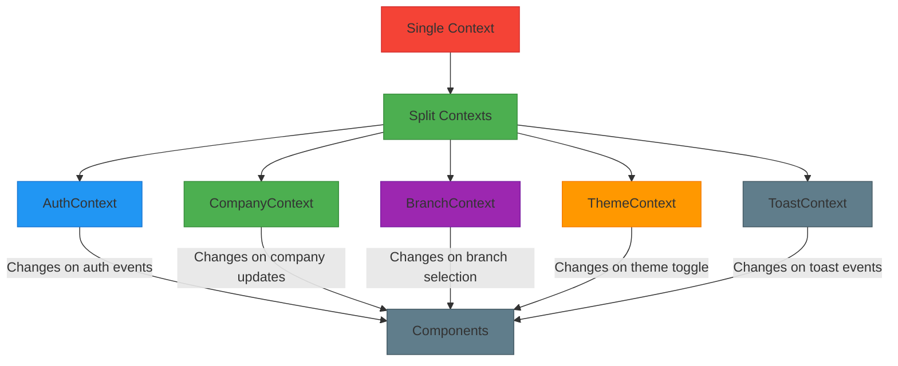

**Diagram sources**
- [AuthContext.js](file://src/context/AuthContext.js#L1-L613)
- [CompanyContext.js](file://src/context/CompanyContext.js#L1-L467)
- [BranchContext.js](file://src/context/BranchContext.js#L1-L229)

By splitting contexts, components that only need authentication state won't re-render when company settings change, and components that only need theme state won't re-render when new toasts are added.

### Selective State Updates

Each context provider only updates the specific state that has changed, using functional updates when appropriate:

```mermaid
flowchart TD
A[State Update] --> B{State Type}
B --> |Primitive| C[Direct Update]
B --> |Object| D[Functional Update]
B --> |Array| E[Functional Update]
C --> F[setState(newValue)]
D --> G[setState(prev => ({...prev, key: value}))]
E --> H[setState(prev => [...prev, newItem])]
style A fill:#2196F3,stroke:#1976D2
style B fill:#FF9800,stroke:#F57C00
style C fill:#4CAF50,stroke:#388E3C
style D fill:#4CAF50,stroke:#388E3C
style E fill:#4CAF50,stroke:#388E3C
style F fill:#607D8B,stroke:#455A64
style G fill:#607D8B,stroke:#455A64
style H fill:#607D8B,stroke:#455A64
```

**Diagram sources**
- [CompanyContext.js](file://src/context/CompanyContext.js#L210-L213)
- [BranchContext.js](file://src/context/BranchContext.js#L151-L152)

This approach ensures that object and array state updates are based on the previous state, preventing stale closures and ensuring consistency.

**Section sources**
- [CompanyContext.js](file://src/context/CompanyContext.js#L210-L213)
- [BranchContext.js](file://src/context/BranchContext.js#L151-L152)

## Error Handling and Persistence

The state management system incorporates robust error handling and persistence mechanisms to ensure data integrity and user experience.

### Error Handling

Each context provider includes comprehensive error handling for asynchronous operations:

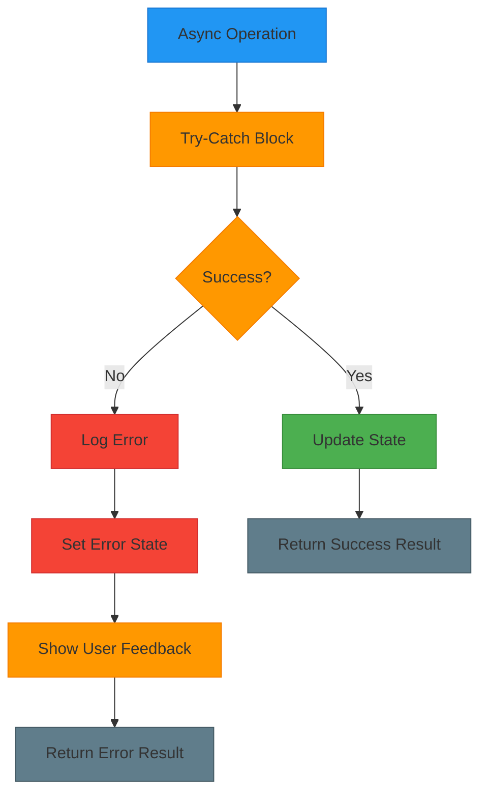

**Diagram sources**
- [AuthContext.js](file://src/context/AuthContext.js#L55-L63)
- [BranchContext.js](file://src/context/BranchContext.js#L79-L82)

Errors are logged to the console for debugging, stored in component state for display, and often accompanied by user feedback through toast notifications. The system distinguishes between different types of errors (e.g., network errors, validation errors) and handles them appropriately.

### Persistence

The system uses localStorage for persistent state storage:

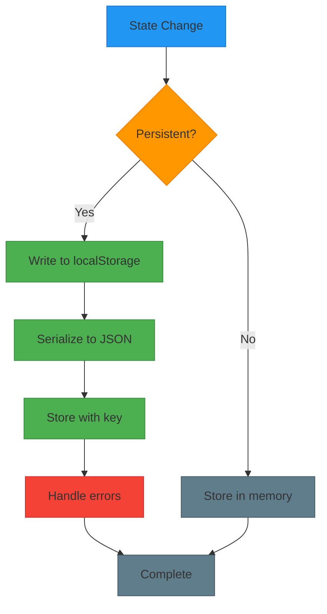

**Diagram sources**
- [ThemeContext.js](file://src/context/ThemeContext.js#L20-L22)
- [useLocalStorage.js](file://src/hooks/useLocalStorage.js#L25-L26)

The ThemeContext persists the selected theme in localStorage, ensuring that user preferences are maintained across sessions. The useLocalStorage hook provides a reusable mechanism for other components to store data persistently with proper error handling.

**Section sources**
- [ThemeContext.js](file://src/context/ThemeContext.js#L20-L22)
- [useLocalStorage.js](file://src/hooks/useLocalStorage.js#L1-L46)

## Usage Examples

The state management system is used throughout the application in various modules. Here are examples of how state flows from context providers to consuming components.

### Sales Module

In the SalesOrderForm component, multiple contexts are used to access the necessary state:

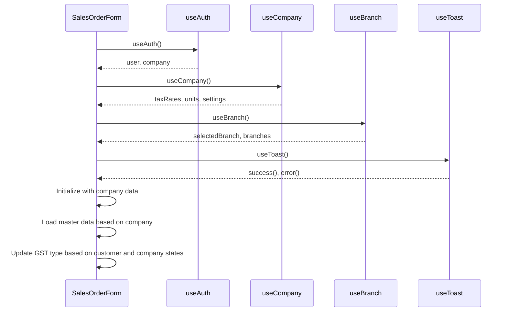

**Diagram sources**
- [SalesOrderForm.js](file://src/components/sales/SalesOrderForm.js#L31-L34)
- [SalesOrderForm.js](file://src/components/sales/SalesOrderForm.js#L108-L115)

The SalesOrderForm uses data from multiple contexts to initialize its state and provide a complete user experience. It accesses the current company from AuthContext, tax rates and units from CompanyContext, and branch information from BranchContext.

**Section sources**
- [SalesOrderForm.js](file://src/components/sales/SalesOrderForm.js#L1-L200)

### Purchase Module

The PurchaseOrderForm component follows a similar pattern:

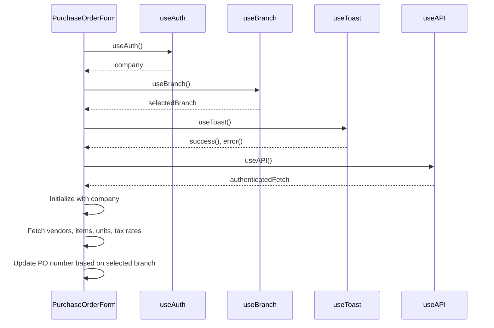

**Diagram sources**
- [PurchaseOrderForm.js](file://src/components/purchase/PurchaseOrderForm.js#L28-L31)
- [PurchaseOrderForm.js](file://src/components/purchase/PurchaseOrderForm.js#L89-L98)

The PurchaseOrderForm uses authentication state to determine the current company, branch state to determine the document prefix, and toast functionality for user feedback during operations.

**Section sources**
- [PurchaseOrderForm.js](file://src/components/purchase/PurchaseOrderForm.js#L1-L200)

## Extending the State Management System

The state management system is designed to be extensible, allowing for the addition of new contexts and hooks as the application evolves.

### Adding a New Context

To add a new context, follow these steps:

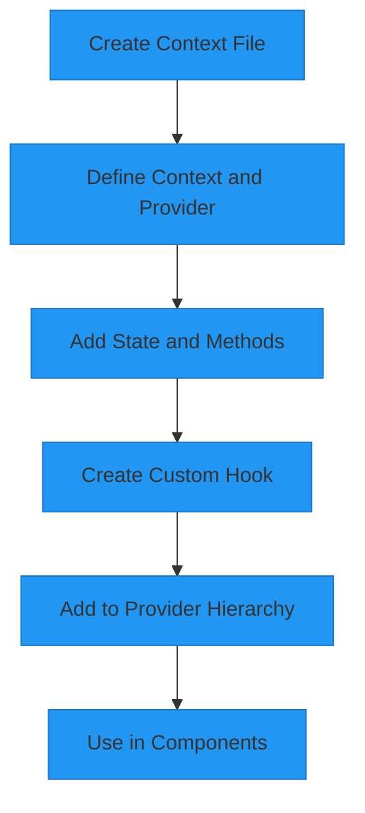

1. Create a new context file in the `src/context` directory
2. Define the context and provider component with appropriate state and methods
3. Create a custom hook that consumes the context with error checking
4. Add the provider to the hierarchy in `_app.js` based on its dependencies
5. Use the custom hook in components that need the state

### Best Practices for Extension

When extending the state management system, consider the following best practices:

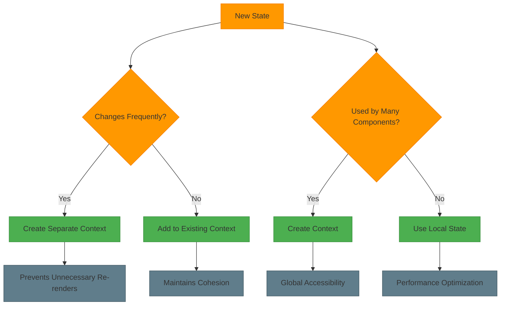

Key considerations include:
- **Context splitting**: Create separate contexts for state that changes at different frequencies
- **Dependency hierarchy**: Order providers based on their dependencies
- **Performance**: Avoid unnecessary re-renders by keeping contexts focused
- **Type safety**: Use TypeScript or JSDoc to provide type information
- **Error boundaries**: Consider where to place error boundaries in the provider hierarchy