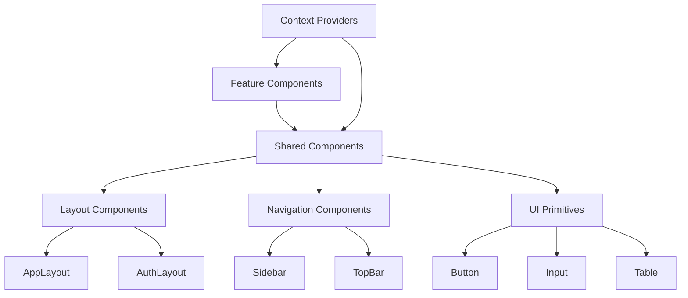
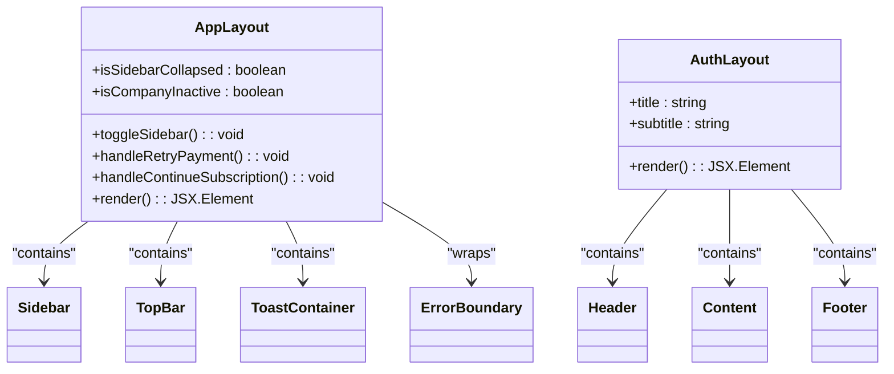
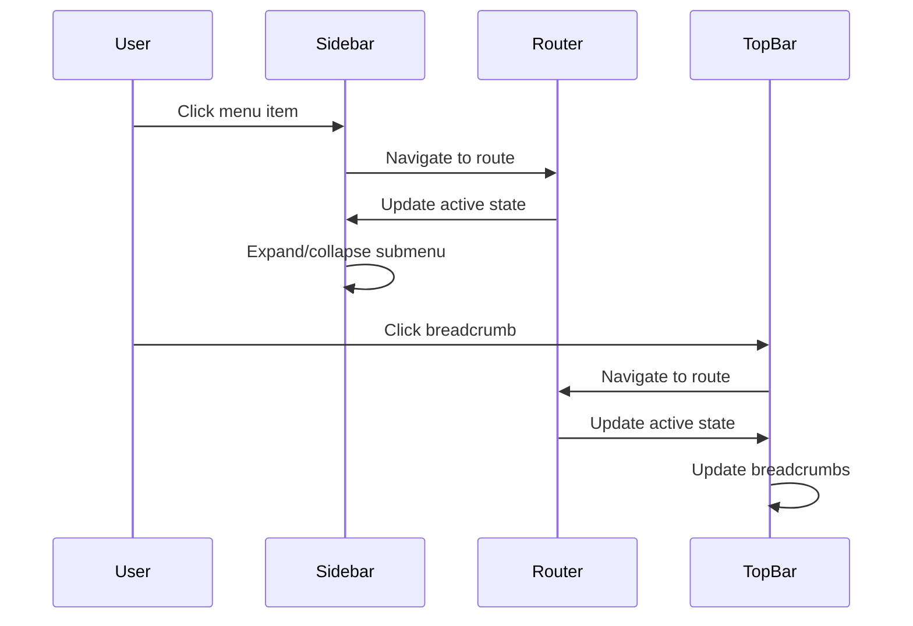
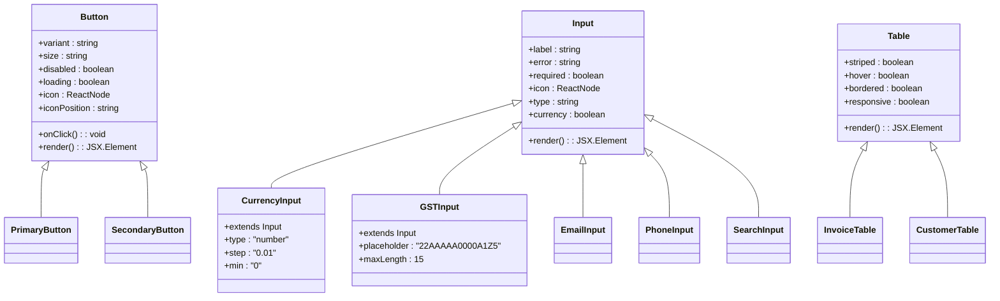
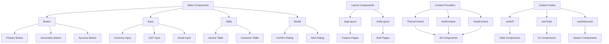
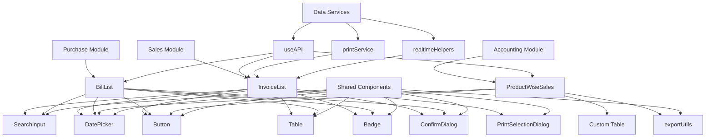
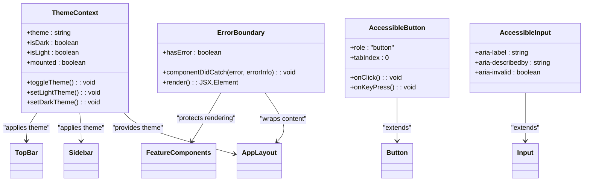
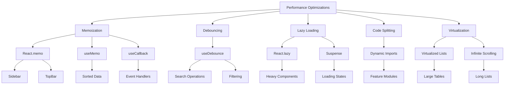

# UI Components Architecture

<cite>
**Referenced Files in This Document**   
- [AppLayout.js](file://src/components/shared/layout/AppLayout.js)
- [AuthLayout.js](file://src/components/shared/layout/AuthLayout.js)
- [Sidebar.js](file://src/components/shared/navigation/Sidebar.js)
- [TopBar.js](file://src/components/shared/navigation/TopBar.js)
- [Button.js](file://src/components/shared/ui/Button.js)
- [Input.js](file://src/components/shared/ui/Input.js)
- [Table.js](file://src/components/shared/ui/Table.js)
- [ThemeContext.js](file://src/components/context/ThemeContext.js)
- [tailwind.config.js](file://tailwind.config.js)
- [globals.css](file://src/styles/globals.css)
- [InvoiceList.js](file://src/components/sales/InvoiceList.js)
- [BillList.js](file://src/components/purchase/BillList.js)
- [ProductWiseSales.js](file://src/components/accounting/reports/sales/ProductWiseSales.js)
</cite>

## Table of Contents
1. [Introduction](#introduction)
2. [Component Architecture Overview](#component-architecture-overview)
3. [Layout Components](#layout-components)
4. [Navigation Components](#navigation-components)
5. [Reusable UI Primitives](#reusable-ui-primitives)
6. [Shared Components Organization](#shared-components-organization)
7. [Composition Patterns](#composition-patterns)
8. [Styling and Responsive Design](#styling-and-responsive-design)
9. [Component Usage Examples](#component-usage-examples)
10. [Accessibility and Theming](#accessibility-and-theming)
11. [Performance Optimizations](#performance-optimizations)
12. [Conclusion](#conclusion)

## Introduction

The ezbillify-v1 application implements a comprehensive component-based architecture using React, with a clear separation of concerns and a well-organized structure. The UI components are designed to be reusable, maintainable, and scalable, following modern React patterns and best practices. This documentation provides a detailed overview of the component architecture, focusing on the organization, implementation, and usage patterns across the application.

The architecture is built around three main categories of components: layout components that define the overall page structure, navigation components that enable user interaction and routing, and reusable UI primitives that provide consistent visual elements throughout the application. These components are organized in a shared directory structure that promotes reusability and maintainability.

**Section sources**
- [AppLayout.js](file://src/components/shared/layout/AppLayout.js#L1-L76)
- [AuthLayout.js](file://src/components/shared/layout/AuthLayout.js#L1-L35)

## Component Architecture Overview

The UI component architecture in ezbillify-v1 follows a hierarchical structure with clear separation between different types of components. At the highest level, layout components define the overall page structure and contain navigation elements. Navigation components provide the primary means of user interaction with the application, while reusable UI primitives form the building blocks for more complex interfaces.

The component hierarchy is designed to promote composition, where complex interfaces are built by combining simpler components. This approach enables consistent styling and behavior across the application while allowing for flexibility in implementation. The architecture also incorporates context providers for global state management, such as authentication and theme preferences, which are consumed by various components throughout the application.



**Diagram sources **
- [AppLayout.js](file://src/components/shared/layout/AppLayout.js#L1-L76)
- [Sidebar.js](file://src/components/shared/navigation/Sidebar.js#L1-L393)
- [Button.js](file://src/components/shared/ui/Button.js#L1-L88)

**Section sources**
- [AppLayout.js](file://src/components/shared/layout/AppLayout.js#L1-L76)
- [Sidebar.js](file://src/components/shared/navigation/Sidebar.js#L1-L393)
- [Button.js](file://src/components/shared/ui/Button.js#L1-L88)

## Layout Components

The layout components in ezbillify-v1 provide the structural foundation for the application's user interface. The AppLayout component serves as the primary layout for authenticated users, implementing a responsive design with a collapsible sidebar and top navigation bar. It manages the overall page structure, including the main content area, navigation elements, and global UI components like toast notifications.

The AuthLayout component is designed specifically for authentication pages, providing a centered, card-based layout optimized for login, registration, and password recovery flows. It features a clean, gradient background with a focused content area that enhances the user experience during authentication processes.

Both layout components utilize React's composition pattern, accepting children as props to render page-specific content within the defined layout structure. They also incorporate error boundaries to gracefully handle component rendering errors and ensure application stability.



**Diagram sources **
- [AppLayout.js](file://src/components/shared/layout/AppLayout.js#L1-L76)
- [AuthLayout.js](file://src/components/shared/layout/AuthLayout.js#L1-L35)

**Section sources**
- [AppLayout.js](file://src/components/shared/layout/AppLayout.js#L1-L76)
- [AuthLayout.js](file://src/components/shared/layout/AuthLayout.js#L1-L35)

## Navigation Components

The navigation components in ezbillify-v1 provide a consistent and intuitive user experience across the application. The Sidebar component implements a collapsible navigation menu with support for nested submenus, allowing users to access different sections of the application efficiently. It features visual indicators for the active route and supports smooth transitions when expanding or collapsing menu items.

The TopBar component complements the sidebar by providing a secondary navigation layer with breadcrumbs, page titles, and action buttons. It includes responsive design features that adapt to different screen sizes, hiding the sidebar toggle button on larger screens where the sidebar is always visible.

Both navigation components are designed with accessibility in mind, using semantic HTML elements and ARIA attributes to ensure compatibility with screen readers and other assistive technologies. They also incorporate performance optimizations such as memoization to prevent unnecessary re-renders when the application state changes.



**Diagram sources **
- [Sidebar.js](file://src/components/shared/navigation/Sidebar.js#L1-L393)
- [TopBar.js](file://src/components/shared/navigation/TopBar.js#L1-L73)

**Section sources**
- [Sidebar.js](file://src/components/shared/navigation/Sidebar.js#L1-L393)
- [TopBar.js](file://src/components/shared/navigation/TopBar.js#L1-L73)

## Reusable UI Primitives

The reusable UI primitives in ezbillify-v1 form the foundation of the application's visual language. The Button component provides multiple variants (primary, secondary, success, danger, warning, outline, ghost, glass) with consistent styling and interactive effects such as hover states and loading indicators. It supports icons, different sizes, and full-width layouts to accommodate various use cases.

The Input component offers a flexible foundation for form elements with built-in support for labels, error states, helper text, and icons. It includes specialized variants for common input types such as currency, GSTIN, email, phone, and search, ensuring consistent validation and formatting across the application.

The Table component provides a comprehensive solution for data display with support for sorting, pagination, and responsive design. It includes specialized variants for common use cases such as invoice and customer lists, with built-in formatting for currency, dates, and status indicators.



**Diagram sources **
- [Button.js](file://src/components/shared/ui/Button.js#L1-L88)
- [Input.js](file://src/components/shared/ui/Input.js#L1-L168)
- [Table.js](file://src/components/shared/ui/Table.js#L1-L392)

**Section sources**
- [Button.js](file://src/components/shared/ui/Button.js#L1-L88)
- [Input.js](file://src/components/shared/ui/Input.js#L1-L168)
- [Table.js](file://src/components/shared/ui/Table.js#L1-L392)

## Shared Components Organization

The shared components in ezbillify-v1 are organized in a logical directory structure that groups components by functional categories. The shared directory contains subdirectories for different types of components, including calendar, charts, customer, data-display, feedback, forms, layout, navigation, overlay, print, subscription, ui, and utils.

This organization promotes discoverability and maintainability by grouping related components together. For example, all UI primitives such as Button, Input, and Table are located in the ui directory, while form-related components like AddressForm and FormField are in the forms directory. This structure makes it easy for developers to find and reuse components across different parts of the application.

The organization also supports scalability, allowing new component categories to be added as the application grows. Each subdirectory contains only the components relevant to that category, reducing cognitive load and making it easier to understand the purpose and functionality of each component.

```mermaid
flowchart TD
A[shared/] --> B[calendar/]
A --> C[charts/]
A --> D[customer/]
A --> E[data-display/]
A --> F[feedback/]
A --> G[forms/]
A --> H[layout/]
A --> I[navigation/]
A --> J[overlay/]
A --> K[print/]
A --> L[subscription/]
A --> M[ui/]
A --> N[utils/]
B --> B1[DatePicker.js]
B --> B2[DateRangePicker.js]
C --> C1[BarChart.js]
C --> C2[LineChart.js]
D --> D1[CustomerDisplay.js]
D --> D2[CustomerSelector.js]
E --> E1[DataTable.js]
E --> E2[Pagination.js]
F --> F1[Alert.js]
F --> F2[Toast.js]
G --> G1[AddressForm.js]
G --> G2[FormField.js]
H --> H1[AppLayout.js]
H --> H2[AuthLayout.js]
I --> I1[Sidebar.js]
I --> I2[TopBar.js]
J --> J1[Modal.js]
K --> K1[PrintButton.js]
L --> L1[SubscriptionOverlay.js]
M --> M1[Button.js]
M --> M2[Input.js]
M --> M3[Table.js]
N --> N1[exportUtils.js]
```



**Diagram sources **
- [shared/](file://src/components/shared/)

**Section sources**
- [shared/](file://src/components/shared/)

## Composition Patterns

The component architecture in ezbillify-v1 heavily relies on composition patterns to build complex interfaces from simpler, reusable components. This approach enables developers to create sophisticated user interfaces by combining basic building blocks in various configurations.

One key composition pattern is the use of layout components as containers for feature-specific content. The AppLayout and AuthLayout components accept children as props, allowing any component to be rendered within their defined structure. This pattern promotes consistency in the user interface while providing flexibility in content.

Another composition pattern is the extension of base components to create specialized variants. For example, the Input component serves as a foundation for more specific components like CurrencyInput, GSTInput, and EmailInput. These specialized components inherit the base functionality while adding domain-specific validation, formatting, and styling.

The architecture also employs composition through higher-order components and custom hooks. Context providers like ThemeContext and AuthContext wrap the application and make global state available to any component that needs it. Custom hooks like useAPI and useToast encapsulate complex logic and state management, making it easy to reuse across different components.



**Diagram sources **
- [Button.js](file://src/components/shared/ui/Button.js#L1-L88)
- [Input.js](file://src/components/shared/ui/Input.js#L1-L168)
- [Table.js](file://src/components/shared/ui/Table.js#L1-L392)
- [AppLayout.js](file://src/components/shared/layout/AppLayout.js#L1-L76)
- [AuthLayout.js](file://src/components/shared/layout/AuthLayout.js#L1-L35)
- [ThemeContext.js](file://src/components/context/ThemeContext.js#L1-L63)

**Section sources**
- [Button.js](file://src/components/shared/ui/Button.js#L1-L88)
- [Input.js](file://src/components/shared/ui/Input.js#L1-L168)
- [Table.js](file://src/components/shared/ui/Table.js#L1-L392)
- [AppLayout.js](file://src/components/shared/layout/AppLayout.js#L1-L76)
- [AuthLayout.js](file://src/components/shared/layout/AuthLayout.js#L1-L35)
- [ThemeContext.js](file://src/components/context/ThemeContext.js#L1-L63)

## Styling and Responsive Design

The styling implementation in ezbillify-v1 is based on Tailwind CSS, a utility-first CSS framework that enables rapid UI development with consistent design tokens. The application leverages Tailwind's extensive utility classes to create a cohesive visual language across all components.

The tailwind.config.js file configures the framework to scan all JavaScript and TypeScript files in the src directory, ensuring that all utility classes are included in the final CSS bundle. The configuration is minimal, extending the default theme without adding custom configurations, which suggests that the application relies primarily on Tailwind's default design system.

The globals.css file contains additional custom styles and utility classes that complement the Tailwind framework. It includes performance optimizations such as font smoothing, custom scrollbar styles, and animation keyframes for fadeIn, slideIn, and pulse effects. The file also defines custom utilities for glass morphism effects, gradient text, and responsive design.

Responsive design is achieved through Tailwind's responsive prefixes (sm, md, lg, xl) and media queries. Components adapt to different screen sizes by changing their layout, visibility, and styling. For example, the Sidebar component collapses to a narrow icon-only mode on smaller screens, while the TopBar component hides certain elements and shows a mobile menu toggle.

```mermaid
flowchart TD
A[Tailwind CSS] --> B[tailwind.config.js]
A --> C[globals.css]
B --> D[Content Configuration]
B --> E[Theme Extension]
C --> F[Base Styles]
C --> G[Components]
C --> H[Utilities]
C --> I[Custom Keyframes]
C --> J[Responsive Media Queries]
D --> K[Scan src/**/*.{js,ts,jsx,tsx}]
E --> L[Extend Default Theme]
F --> M[Font Smoothing]
F --> N[Print Styles]
G --> O[Custom Scrollbar]
H --> P[Animation Utilities]
H --> Q[Glass Morphism]
H --> R[Gradient Text]
I --> S[fadeIn, slideIn, pulse]
J --> T[Mobile Optimizations]
J --> U[Dark Mode Support]
V[Component Styling] --> W[Utility Classes]
V --> X[Responsive Prefixes]
V --> Y[Hover States]
V --> Z[Focus States]
W --> AA[Text, Background, Border]
X --> AB[sm:, md:, lg:, xl:]
Y --> AC[hover:bg-blue-50]
Z --> AD[focus:ring-blue-500]
```

**Diagram sources **
- [tailwind.config.js](file://tailwind.config.js#L1-L9)
- [globals.css](file://src/styles/globals.css#L1-L186)

**Section sources**
- [tailwind.config.js](file://tailwind.config.js#L1-L9)
- [globals.css](file://src/styles/globals.css#L1-L186)

## Component Usage Examples

The component architecture in ezbillify-v1 is demonstrated through its usage in key feature modules such as sales, purchase, and accounting. These examples illustrate how the reusable components are combined to create complex, domain-specific interfaces.

In the sales module, the InvoiceList component combines various shared components to create a comprehensive invoice management interface. It uses the SearchInput for filtering, Select for dropdown menus, DatePicker for date filtering, and the Table component to display invoice data. The component also incorporates the Button component for actions like creating new invoices and exporting data.

The purchase module's BillList component follows a similar pattern, using the same set of shared components to create a consistent user experience across different parts of the application. This consistency reduces the learning curve for users and ensures a cohesive design language throughout the application.

In the accounting module, the ProductWiseSales report component demonstrates how shared components can be used to create data visualization interfaces. It combines DatePicker for period selection, Button for actions, and custom table components for displaying sales data. The component also uses the exportUtils to provide multiple export formats for the report data.



**Diagram sources **
- [InvoiceList.js](file://src/components/sales/InvoiceList.js#L1-L200)
- [BillList.js](file://src/components/purchase/BillList.js#L1-L200)
- [ProductWiseSales.js](file://src/components/accounting/reports/sales/ProductWiseSales.js#L1-L200)

**Section sources**
- [InvoiceList.js](file://src/components/sales/InvoiceList.js#L1-L200)
- [BillList.js](file://src/components/purchase/BillList.js#L1-L200)
- [ProductWiseSales.js](file://src/components/accounting/reports/sales/ProductWiseSales.js#L1-L200)

## Accessibility and Theming

The component architecture in ezbillify-v1 incorporates accessibility considerations and theming support to ensure an inclusive user experience. The ThemeContext provides a mechanism for managing the application's visual theme, allowing users to switch between light and dark modes based on their preferences.

The ThemeContext implementation uses the useState hook to manage the current theme and the useEffect hook to synchronize the theme with localStorage and the document element. This ensures that the user's theme preference is preserved across sessions and applied consistently throughout the application. The context also respects the user's system preference for dark mode by default, providing a seamless experience.

Accessibility is addressed through semantic HTML elements, proper ARIA attributes, and keyboard navigation support. Components like Button and Input include appropriate attributes for screen readers, and interactive elements are designed to be operable with keyboard navigation. The application also includes an ErrorBoundary component to gracefully handle rendering errors and prevent the entire application from crashing.

The styling system includes support for reduced motion preferences, automatically disabling animations for users who have indicated a preference for reduced motion in their operating system settings. This consideration enhances accessibility for users with vestibular disorders or other conditions that may be triggered by motion.



**Diagram sources **
- [ThemeContext.js](file://src/components/context/ThemeContext.js#L1-L63)
- [AppLayout.js](file://src/components/shared/layout/AppLayout.js#L1-L76)
- [Sidebar.js](file://src/components/shared/navigation/Sidebar.js#L1-L393)
- [TopBar.js](file://src/components/shared/navigation/TopBar.js#L1-L73)
- [Button.js](file://src/components/shared/ui/Button.js#L1-L88)
- [Input.js](file://src/components/shared/ui/Input.js#L1-L168)

**Section sources**
- [ThemeContext.js](file://src/components/context/ThemeContext.js#L1-L63)
- [AppLayout.js](file://src/components/shared/layout/AppLayout.js#L1-L76)
- [Sidebar.js](file://src/components/shared/navigation/Sidebar.js#L1-L393)
- [TopBar.js](file://src/components/shared/navigation/TopBar.js#L1-L73)

## Performance Optimizations

The component architecture in ezbillify-v1 incorporates several performance optimizations to ensure a responsive and efficient user experience. These optimizations include memoization, lazy loading, and efficient state management patterns.

The use of React.memo for components like Sidebar and TopBar prevents unnecessary re-renders when props haven't changed. This optimization is particularly important for navigation components that are present on most pages and could otherwise cause performance issues when the application state changes.

The architecture also leverages custom hooks like useDebounce to optimize search and filtering operations. The useDebounce hook delays the execution of expensive operations until the user has stopped typing, reducing the number of API calls and improving responsiveness.

For heavy components, the application could implement lazy loading using React.lazy and Suspense to split the code into smaller chunks and load them on demand. While this specific implementation isn't visible in the provided code, the modular component structure supports this optimization pattern.

The use of virtualization for large lists and tables could further improve performance by only rendering visible items. Although not explicitly implemented in the provided components, the Table component's structure supports this enhancement through pagination and controlled data loading.



**Diagram sources **
- [Sidebar.js](file://src/components/shared/navigation/Sidebar.js#L1-L393)
- [TopBar.js](file://src/components/shared/navigation/TopBar.js#L1-L73)
- [useDebounce.js](file://src/hooks/useDebounce.js#L1-L28)

**Section sources**
- [Sidebar.js](file://src/components/shared/navigation/Sidebar.js#L1-L393)
- [TopBar.js](file://src/components/shared/navigation/TopBar.js#L1-L73)
- [useDebounce.js](file://src/hooks/useDebounce.js#L1-L28)

## Conclusion

The UI component architecture in ezbillify-v1 demonstrates a well-structured, maintainable approach to building a complex React application. By organizing components into clear categories and following composition patterns, the architecture promotes reusability, consistency, and scalability.

The implementation of layout components, navigation elements, and reusable UI primitives provides a solid foundation for the application's user interface. The organization of shared components by functional categories enhances discoverability and maintainability, while the use of composition patterns enables the creation of complex interfaces from simpler building blocks.

The integration of Tailwind CSS for styling and responsive design ensures a consistent visual language across different screen sizes, while accessibility considerations and theming support enhance the user experience. Performance optimizations like memoization and debouncing contribute to a responsive and efficient application.

Overall, the component architecture in ezbillify-v1 represents a modern, scalable approach to React development that balances flexibility with consistency, enabling the creation of a robust and user-friendly accounting application.

[No sources needed since this section summarizes without analyzing specific files]