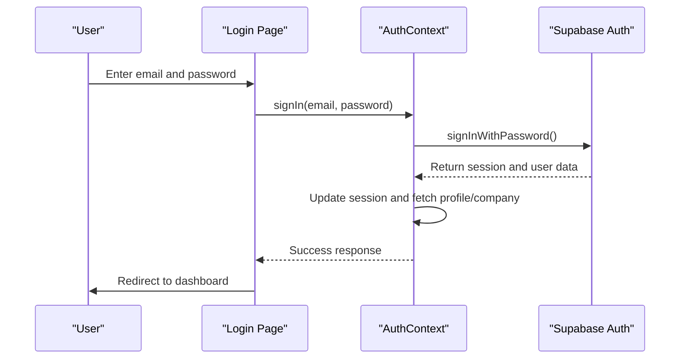
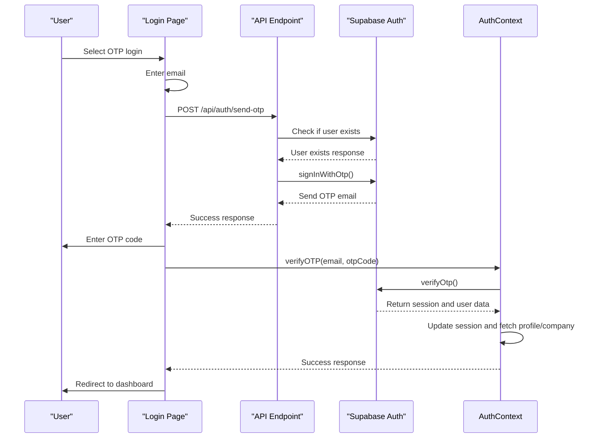
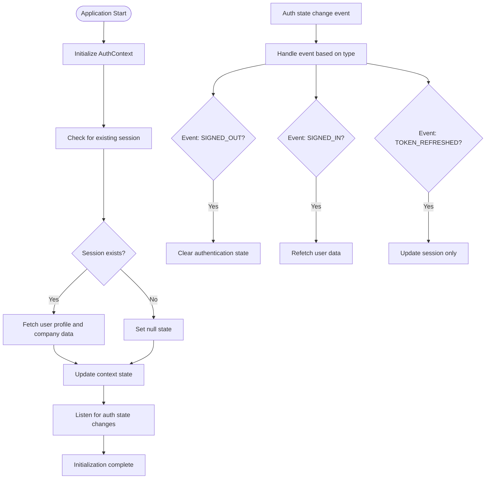
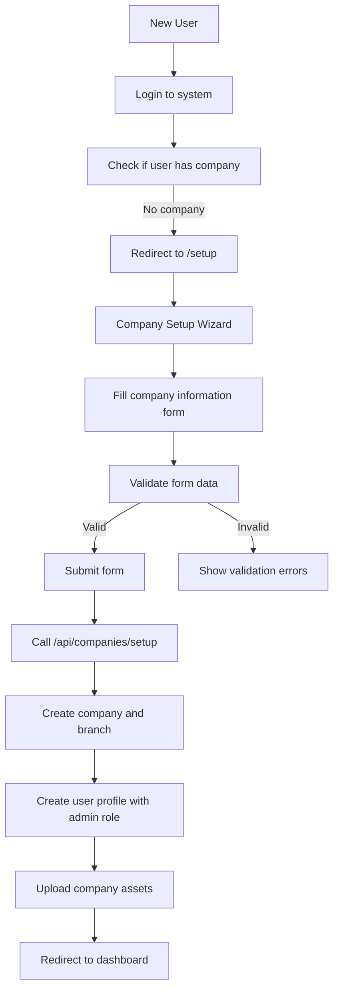
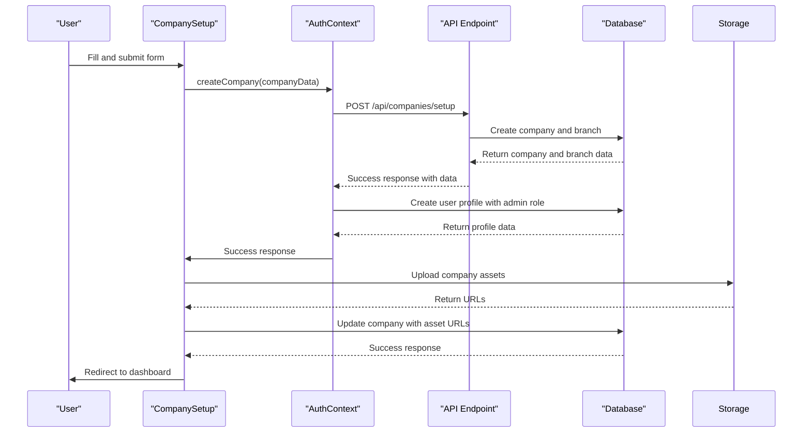
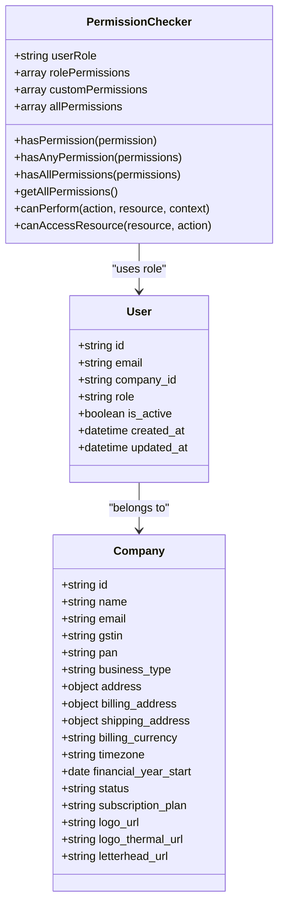
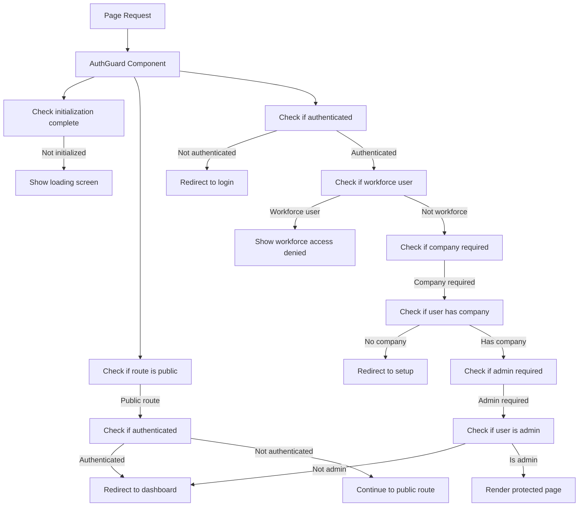
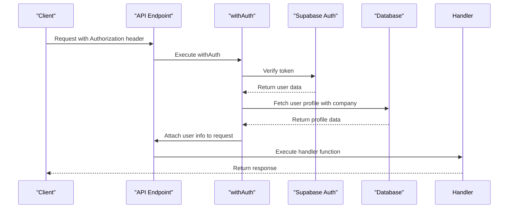
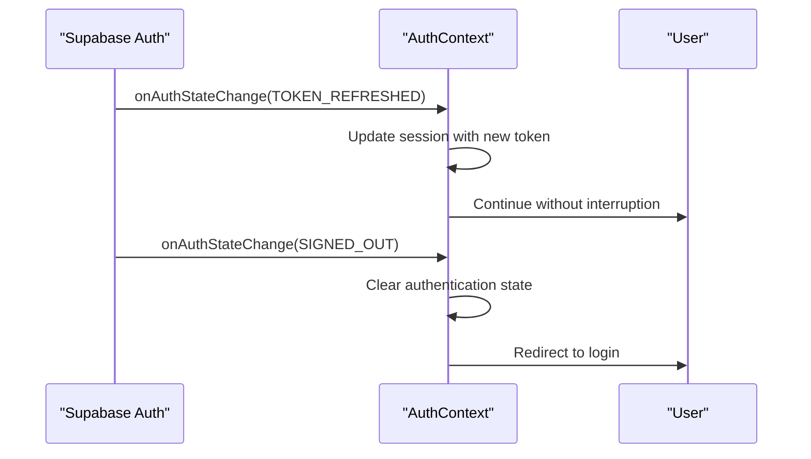

# Authentication and Authorization

<cite>
**Referenced Files in This Document**   
- [AuthContext.js](file://src/context/AuthContext.js)
- [auth.js](file://src/lib/auth.js)
- [useAuth.js](file://src/hooks/useAuth.js)
- [AuthGuard.js](file://src/components/auth/AuthGuard.js)
- [OTPVerification.js](file://src/components/auth/OTPVerification.js)
- [CompanySetup.js](file://src/components/auth/CompanySetup.js)
- [permissions.js](file://src/lib/permissions.js)
- [usePermissions.js](file://src/hooks/usePermissions.js)
- [auth.js](file://src/middleware/auth.js)
- [supabase.js](file://src/services/utils/supabase.js)
- [send-otp.js](file://src/pages/api/auth/send-otp.js)
- [verify-otp.js](file://src/pages/api/auth/verify-otp.js)
- [login.js](file://src/pages/login.js)
- [setup.js](file://src/pages/setup.js)
- [constants.js](file://src/lib/constants.js)
- [_app.js](file://src/pages/_app.js)
</cite>

## Table of Contents
1. [Introduction](#introduction)
2. [Authentication System](#authentication-system)
3. [Company Setup Wizard](#company-setup-wizard)
4. [Authorization System](#authorization-system)
5. [Protected Routes and UI Elements](#protected-routes-and-ui-elements)
6. [API Endpoint Security](#api-endpoint-security)
7. [Common Issues and Debugging](#common-issues-and-debugging)
8. [Security Best Practices](#security-best-practices)
9. [Performance Considerations](#performance-considerations)
10. [Conclusion](#conclusion)

## Introduction
The ezbillify-v1 application implements a comprehensive authentication and authorization system that combines email/password authentication with OTP-based verification, company setup wizard, and role-based access control. The system leverages React Context for state management and Supabase for authentication and database operations. This document provides a detailed analysis of the implementation, covering the authentication flow from login to session management, the authorization system with permission checks at both UI and API levels, and practical examples of implementing protected routes, role-specific UI elements, and API endpoint security.

**Section sources**
- [AuthContext.js](file://src/context/AuthContext.js#L1-L613)
- [auth.js](file://src/lib/auth.js#L1-L87)
- [useAuth.js](file://src/hooks/useAuth.js#L1-L13)

## Authentication System

### Email/Password Authentication with OTP Verification
The authentication system in ezbillify-v1 supports both traditional email/password login and OTP-based verification, providing users with flexible authentication options. The system is built around Supabase authentication, with React Context managing the authentication state across the application.

The authentication flow begins with the `AuthContext` component, which provides a centralized authentication state management system. This context maintains user session data, profile information, company details, and authentication status. The context initializes by checking for an existing session and fetching user and company data if a session is found.



**Diagram sources**
- [AuthContext.js](file://src/context/AuthContext.js#L197-L242)
- [login.js](file://src/pages/login.js#L24-L144)

For OTP-based authentication, the system provides an alternative login method that sends a 6-digit verification code to the user's email. The OTP flow is implemented in the login page, where users can switch between password and OTP authentication methods. When a user chooses OTP authentication, the system sends a request to the `/api/auth/send-otp` endpoint, which verifies that the user exists and sends an OTP code via email.

The OTP verification process includes several security features:
- 60-second expiry timer for OTP codes
- Limit of 5 attempts per OTP code
- Countdown timer displayed to the user
- Automatic redirection to password login if OTP expires



**Diagram sources**
- [login.js](file://src/pages/login.js#L167-L432)
- [send-otp.js](file://src/pages/api/auth/send-otp.js#L1-L76)
- [verify-otp.js](file://src/pages/api/auth/verify-otp.js#L1-L68)
- [AuthContext.js](file://src/context/AuthContext.js#L278-L343)

The OTP verification endpoint (`/api/auth/verify-otp.js`) validates the OTP code and returns a session object with access tokens, which are then stored in the client-side authentication context. The system also updates the user's last login timestamp and increments the login count in the database.

**Section sources**
- [AuthContext.js](file://src/context/AuthContext.js#L278-L343)
- [login.js](file://src/pages/login.js#L167-L432)
- [send-otp.js](file://src/pages/api/auth/send-otp.js#L1-L76)
- [verify-otp.js](file://src/pages/api/auth/verify-otp.js#L1-L68)

### Session Management with React Context and Supabase
The authentication system uses React Context to manage session state across the application. The `AuthContext` component provides a comprehensive authentication state management solution that handles session initialization, user data fetching, and state updates.

The context initializes by checking for an existing session using `supabase.auth.getSession()`. If a session is found, it fetches the user profile and company data in parallel using `Promise.all()`. The context also listens for authentication state changes using `supabase.auth.onAuthStateChange()`, which handles events such as sign-in, sign-out, and token refresh.



**Diagram sources**
- [AuthContext.js](file://src/context/AuthContext.js#L15-L111)

The context provides several utility functions for authentication operations:
- `signIn()`: Handles email/password authentication
- `signUp()`: Handles user registration
- `verifyOTP()`: Handles OTP-based authentication
- `resetPassword()`: Handles password reset functionality
- `signOut()`: Handles user logout

The context also exposes computed values such as `isAuthenticated`, `hasCompany`, `isAdmin`, and `isWorkforce`, which are used throughout the application to control access to features and components.

**Section sources**
- [AuthContext.js](file://src/context/AuthContext.js#L197-L484)

## Company Setup Wizard

### Implementation of the Company Setup Process
The company setup wizard is a critical component of the ezbillify-v1 application, guiding new users through the process of creating their company profile after registration or first login. The wizard is implemented as a multi-step form that collects essential company information and creates the necessary database records.

The setup process is triggered when a user without an associated company attempts to access protected routes. The `AuthGuard` component redirects such users to the `/setup` page, where they can complete the company setup process.



**Diagram sources**
- [setup.js](file://src/pages/setup.js#L1-L81)
- [CompanySetup.js](file://src/components/auth/CompanySetup.js#L1-L652)

The `CompanySetup` component collects the following information:
- Company name, email, phone, and business type
- GSTIN, PAN, TAN, and CIN numbers (with validation)
- Primary, billing, and shipping addresses
- Billing currency, timezone, and financial year start
- Company logo, thermal print logo, and letterhead (optional)

The form includes several validation features:
- Real-time validation of GSTIN, PAN, and phone number formats
- Pincode-based auto-fill of city and state information
- Required field validation with error messages
- File upload validation for logos and letterhead

**Section sources**
- [CompanySetup.js](file://src/components/auth/CompanySetup.js#L1-L652)

### Integration with API Endpoints
The company setup process integrates with the `/api/companies/setup` API endpoint to create the company and associated branch records. This endpoint is called from the `createCompany` function in the `AuthContext`, which handles the entire setup process.

When the user submits the form, the `handleSubmit` function validates the form data and calls the `createCompany` function with the company data. This function makes a POST request to the API endpoint with the company data and the user's access token for authentication.



**Diagram sources**
- [CompanySetup.js](file://src/components/auth/CompanySetup.js#L202-L272)
- [AuthContext.js](file://src/context/AuthContext.js#L346-L445)

After the company and branch are created, the system creates a user profile with the 'admin' role and associates it with the newly created company. If a profile already exists, it is updated with the company ID and admin role.

The system also handles file uploads for company assets (logo, thermal logo, and letterhead). These files are uploaded to Supabase storage using the `storageHelpers` functions, and the resulting URLs are saved to the company record in the database.

**Section sources**
- [CompanySetup.js](file://src/components/auth/CompanySetup.js#L236-L263)
- [supabase.js](file://src/services/utils/supabase.js#L317-L378)

## Authorization System

### Role-Based Access Control Implementation
The authorization system in ezbillify-v1 implements a robust role-based access control (RBAC) model with two primary roles: 'admin' and 'workforce'. This system controls access to application features and data based on the user's role and permissions.

The role information is stored in the `users` table in the database, with the `role` field containing the user's role ('admin' or 'workforce'). The system uses this role information to determine the user's permissions and access level.



**Diagram sources**
- [permissions.js](file://src/lib/permissions.js#L147-L218)
- [constants.js](file://src/lib/constants.js#L9-L12)

The `PermissionChecker` class in `permissions.js` provides the core functionality for permission checking. It takes a user role and optional custom permissions as input and provides methods to check if a user has specific permissions.

The system defines a comprehensive set of permissions covering all application features:
- Company management (create, view, update)
- User management (create, view, update, delete)
- Customer and vendor management
- Item and inventory management
- Sales and purchase document management
- Payment processing
- Accounting and financial management
- Reporting and analytics
- GST and compliance
- System settings and integrations

**Section sources**
- [permissions.js](file://src/lib/permissions.js#L5-L113)

### Permission Definitions and Role Mappings
The permission system is defined in `permissions.js`, which exports a `PERMISSIONS` object containing all possible permissions in the system. Each permission is represented as a constant with a descriptive name.

The role-to-permission mapping is defined in the `ROLE_PERMISSIONS` object, which maps each role to an array of permissions. The 'admin' role has access to all permissions, while the 'workforce' role has a more limited set of permissions focused on day-to-day operations.

```javascript
// Role-based permission mapping
export const ROLE_PERMISSIONS = {
  [USER_ROLES.ADMIN]: [
    // Full access to everything
    ...Object.values(PERMISSIONS)
  ],
  
  [USER_ROLES.WORKFORCE]: [
    // Limited access for workforce users
    PERMISSIONS.VIEW_CUSTOMERS,
    PERMISSIONS.CREATE_CUSTOMER,
    PERMISSIONS.UPDATE_CUSTOMER,
    
    PERMISSIONS.VIEW_ITEMS,
    PERMISSIONS.VIEW_STOCK_REPORTS,
    
    PERMISSIONS.VIEW_SALES_DOCUMENTS,
    PERMISSIONS.CREATE_INVOICE,
    PERMISSIONS.CREATE_QUOTATION,
    PERMISSIONS.SEND_INVOICE,
    
    PERMISSIONS.VIEW_PAYMENTS,
    PERMISSIONS.CREATE_PAYMENT,
    
    PERMISSIONS.VIEW_REPORTS,
    PERMISSIONS.GENERATE_SALES_REPORTS,
    
    PERMISSIONS.EXPORT_DATA
  ]
}
```

The system also provides permission groups for UI rendering, which organize permissions into logical categories such as Company Management, User Management, Sales Management, etc. These groups are used in the UI to organize permission settings when managing user roles.

**Section sources**
- [permissions.js](file://src/lib/permissions.js#L116-L144)

## Protected Routes and UI Elements

### Implementation of Protected Routes with AuthGuard
The application uses the `AuthGuard` component to protect routes and control access based on authentication status and user roles. This component acts as a higher-order component (HOC) that wraps protected pages and redirects users based on their authentication state.

The `AuthGuard` component provides several HOCs for different access requirements:
- `withAuth`: For pages that require authentication
- `withCompany`: For pages that require a company setup
- `withAdmin`: For pages that require admin privileges



**Diagram sources**
- [AuthGuard.js](file://src/components/auth/AuthGuard.js#L23-L96)

The `AuthGuard` component uses the authentication state from `AuthContext` to make access decisions. It checks several conditions in sequence:
1. Whether the authentication system is initialized
2. Whether the requested route is public
3. Whether the user is authenticated
4. Whether the user is a workforce user (who are blocked from web access)
5. Whether the user has a company (required for most functionality)
6. Whether admin privileges are required for the route

**Section sources**
- [AuthGuard.js](file://src/components/auth/AuthGuard.js#L7-L110)

### Role-Specific UI Elements and Conditional Rendering
The application implements role-specific UI elements through conditional rendering based on the user's role and permissions. The `usePermissions` hook provides a convenient way to check permissions in components and control UI visibility.

The `usePermissions` hook returns an object with boolean flags for common permissions and helper functions for more complex permission checks:

```javascript
export const usePermissions = () => {
  const { userProfile, company } = useAuth()

  const permissions = useMemo(() => {
    if (!userProfile || !company) {
      return {
        canCreateInvoice: false,
        canEditInvoice: false,
        canDeleteInvoice: false,
        // ... other permission flags
      }
    }

    const isAdmin = userProfile.role === 'admin'
    const isWorkforce = userProfile.role === 'workforce'

    return {
      canCreateInvoice: isAdmin || isWorkforce,
      canEditInvoice: isAdmin,
      canDeleteInvoice: isAdmin,
      // ... other permission mappings
    }
  }, [userProfile, company])

  const hasPermission = (permission) => {
    return permissions[permission] || false
  }

  // ... other helper functions
}
```

This approach allows components to easily check permissions and conditionally render UI elements:

```jsx
{permissions.canCreateInvoice && (
  <button onClick={handleCreateInvoice}>
    Create Invoice
  </button>
)}

{permissions.isAdmin && (
  <div className="admin-settings">
    {/* Admin-only settings */}
  </div>
)}
```

The system also includes a `WorkforceAccessDenied` component that is displayed when a workforce user attempts to access the web application. This component blocks workforce users from web access, likely because they are intended to use a mobile application instead.

**Section sources**
- [usePermissions.js](file://src/hooks/usePermissions.js#L1-L67)
- [AuthGuard.js](file://src/components/auth/AuthGuard.js#L59-L65)

## API Endpoint Security

### Middleware-Based Authentication and Authorization
The API endpoints in ezbillify-v1 are secured using middleware functions that handle authentication and authorization. The `auth.js` middleware in the `src/middleware` directory provides several higher-order functions for protecting API routes.

The primary middleware function is `withAuth`, which verifies the JWT token in the Authorization header and attaches user information to the request object. This middleware performs the following steps:
1. Extracts the JWT token from the Authorization header
2. Verifies the token with Supabase
3. Fetches the user profile with company information
4. Attaches user, userProfile, and company objects to the request
5. Calls the handler function if authentication is successful



**Diagram sources**
- [auth.js](file://src/middleware/auth.js#L6-L133)

The system also provides additional middleware functions:
- `withCompanyAccess`: Ensures the user has an active company
- `withRole`: Restricts access to specific roles
- `withAdminOnly`: Restricts access to admin users only
- `withResourceOwnership`: Ensures the user owns or has access to the requested resource

These middleware functions can be combined to create complex authorization rules. For example, an endpoint that requires admin access to a specific company's data would use both `withCompanyAccess` and `withAdminOnly` middleware.

**Section sources**
- [auth.js](file://src/middleware/auth.js#L145-L244)

### Permission Checks at the API Level
In addition to middleware-based authentication, the API endpoints perform permission checks to ensure users have the appropriate permissions for the requested actions. These checks are implemented using the permission system defined in `permissions.js`.

The `validatePermission` function in `permissions.js` creates a validator function that can be used to check if a user has a specific permission:

```javascript
export const validatePermission = (requiredPermission) => {
  return (userRole, customPermissions = []) => {
    const checker = createPermissionChecker(userRole, customPermissions)
    return checker.hasPermission(requiredPermission)
  }
}
```

API endpoints use this function to validate permissions before performing sensitive operations. For example, an endpoint that deletes a company would require the `MANAGE_COMPANY` permission:

```javascript
const canManageCompany = validatePermission(PERMISSIONS.MANAGE_COMPANY)
if (!canManageCompany(req.userProfile.role)) {
  return res.status(403).json({ 
    success: false,
    error: 'Forbidden', 
    message: 'Insufficient permissions for this action' 
  })
}
```

The system also implements resource ownership checks to ensure users can only access data belonging to their company. The `withResourceOwnership` middleware takes a function that determines the owner of a resource and checks if the current user has access to it.

**Section sources**
- [permissions.js](file://src/lib/permissions.js#L247-L251)
- [auth.js](file://src/middleware/auth.js#L212-L244)

## Common Issues and Debugging

### Session Expiration and Token Management
Session expiration and token management are common issues in web applications. The ezbillify-v1 system handles these issues through Supabase's built-in token refresh mechanism and proper error handling.

The `AuthContext` component listens for the `TOKEN_REFRESHED` event from Supabase, which is triggered when the access token is automatically refreshed. This allows the application to update the session without requiring the user to log in again.



**Diagram sources**
- [AuthContext.js](file://src/context/AuthContext.js#L99-L103)

When a token expires or becomes invalid, Supabase automatically triggers a sign-out event, which the `AuthContext` handles by clearing the authentication state and redirecting the user to the login page.

The system also includes a `getAccessToken` function that checks if the current access token is valid before returning it:

```javascript
const getAccessToken = () => {
  if (!session?.access_token) {
    return null
  }
  
  // Check if token is expired (with 5 minute buffer)
  const now = Math.floor(Date.now() / 1000)
  const expiresAt = session.expires_at
  const bufferTime = 5 * 60 // 5 minutes
  
  if (expiresAt && (now + bufferTime) >= expiresAt) {
    return null
  }
  
  return session.access_token
}
```

This function ensures that components requesting the access token receive a valid token or null if the token is expired.

**Section sources**
- [AuthContext.js](file://src/context/AuthContext.js#L114-L132)

### Permission Errors and Access Denied Scenarios
Permission errors and access denied scenarios are handled through consistent error responses from API endpoints and appropriate UI feedback.

When a user attempts to access a resource without sufficient permissions, the middleware returns a 403 Forbidden response with a descriptive error message:

```json
{
  "success": false,
  "error": "Forbidden",
  "message": "Insufficient permissions for this action"
}
```

The client-side code handles these errors and displays appropriate messages to the user. For example, the `signIn` function in `AuthContext` converts Supabase errors into user-friendly messages using the `handleSupabaseError` function:

```javascript
if (error) {
  console.error('AuthContext - Sign in error:', error)
  return { error: handleSupabaseError(error) }
}
```

The `handleSupabaseError` function maps common Supabase error messages to user-friendly messages:

```javascript
const errorMessages = {
  'Invalid login credentials': 'Invalid email or password. Please try again.',
  'Email not confirmed': 'Please check your email and click the confirmation link.',
  'User already registered': 'An account with this email already exists.',
  // ... other error mappings
}
```

For workforce users, the system implements a specific access denied scenario. When a workforce user attempts to access the web application, they are shown the `WorkforceAccessDenied` component, which blocks their access and automatically logs them out after a countdown.

**Section sources**
- [auth.js](file://src/middleware/auth.js#L187-L191)
- [supabase.js](file://src/services/utils/supabase.js#L298-L314)
- [AuthGuard.js](file://src/components/auth/AuthGuard.js#L60-L65)

### Authentication Flow Debugging
Debugging the authentication flow is facilitated by comprehensive logging throughout the system. The `AuthContext`, `AuthGuard`, and API endpoints include console.log statements that trace the authentication process.

For example, the `AuthContext` component logs key events in the authentication flow:

```javascript
console.log('AuthContext - Initializing...')
console.log('AuthContext - Initial session:', !!currentSession)
console.log('AuthContext - User found, setting up...')
console.log('AuthContext - Profile and company loaded:', { 
  profile: !!profileResult, 
  company: !!companyResult 
})
```

The `AuthGuard` component also includes logging for access control decisions:

```javascript
console.log('AuthGuard - Workforce user detected, blocking web access')
```

The API authentication middleware includes detailed logging of the authentication process:

```javascript
console.log('=== AUTH MIDDLEWARE START ===');
console.log('Request URL:', req.url);
console.log('Request Method:', req.method);
console.log('Auth Header Present:', !!authHeader);
```

These logs help developers trace the authentication flow and identify issues. In production, these logs can be disabled or redirected to a logging service.

**Section sources**
- [AuthContext.js](file://src/context/AuthContext.js#L20-L62)
- [AuthGuard.js](file://src/components/auth/AuthGuard.js#L61-L62)
- [auth.js](file://src/middleware/auth.js#L9-L13)

## Security Best Practices

### Secure Authentication Implementation
The authentication system in ezbillify-v1 follows several security best practices to protect user accounts and data:

1. **Secure Password Storage**: The system uses Supabase authentication, which securely stores passwords using industry-standard hashing algorithms.

2. **Multi-Factor Authentication Option**: The OTP-based login provides an additional layer of security beyond just email and password.

3. **Token Expiration and Refresh**: Access tokens have limited lifetimes and are automatically refreshed before expiration, reducing the risk of token theft.

4. **Secure Session Management**: The system uses Supabase's secure session management, which includes CSRF protection and secure cookie settings.

5. **Rate Limiting**: The OTP system implements rate limiting to prevent brute force attacks, with a limit of 5 attempts per OTP code.

6. **Input Validation**: All user inputs are validated both on the client and server side to prevent injection attacks and ensure data integrity.

7. **Secure API Endpoints**: API endpoints require authentication tokens and implement proper authorization checks.

8. **Error Message Security**: Error messages are carefully crafted to avoid revealing sensitive information about the system or user accounts.

**Section sources**
- [AuthContext.js](file://src/context/AuthContext.js)
- [send-otp.js](file://src/pages/api/auth/send-otp.js)
- [auth.js](file://src/middleware/auth.js)

### Data Protection and Privacy
The system implements several measures to protect user data and ensure privacy:

1. **Row Level Security (RLS)**: The Supabase database uses Row Level Security policies to ensure users can only access data belonging to their company.

2. **Secure Storage**: Company assets (logos, letterhead) are stored in Supabase storage with appropriate access controls.

3. **Data Encryption**: Supabase encrypts data at rest and in transit, protecting sensitive information.

4. **Minimal Data Collection**: The system only collects necessary information for company setup, with optional fields clearly marked.

5. **Secure API Communication**: All API communication uses HTTPS to encrypt data in transit.

6. **Access Logging**: The system could be extended to include audit logs of user actions for security monitoring.

7. **Regular Security Updates**: The use of Supabase ensures that the authentication system benefits from regular security updates and patches.

**Section sources**
- [supabase.js](file://src/services/utils/supabase.js)
- [auth.js](file://src/middleware/auth.js)

## Performance Considerations

### Authentication Flow Optimization
The authentication system is optimized for performance through several techniques:

1. **Parallel Data Fetching**: The `AuthContext` fetches user profile and company data in parallel using `Promise.all()`, reducing initialization time.

2. **Efficient State Management**: The use of React Context with proper memoization prevents unnecessary re-renders.

3. **Token Caching**: Access tokens are cached in the `AuthContext` and only refreshed when necessary.

4. **Lazy Loading**: Protected routes are only rendered after authentication is complete, reducing initial load time.

5. **Optimized API Calls**: The company setup process combines multiple operations into a single API call, reducing network overhead.

6. **Efficient Permission Checking**: The permission system uses memoization to cache permission checks and avoid redundant calculations.

**Section sources**
- [AuthContext.js](file://src/context/AuthContext.js#L34-L37)
- [usePermissions.js](file://src/hooks/usePermissions.js#L8-L45)

### Scalability and Reliability
The authentication system is designed for scalability and reliability:

1. **Supabase Backend**: The use of Supabase provides a scalable authentication backend that can handle large numbers of users.

2. **Stateless Authentication**: JWT-based authentication is stateless, making it easy to scale across multiple servers.

3. **Error Resilience**: The system includes comprehensive error handling and fallback mechanisms.

4. **Graceful Degradation**: The system can function with limited capabilities if certain services are unavailable.

5. **Monitoring and Logging**: Comprehensive logging enables monitoring of authentication performance and issues.

6. **Caching Strategy**: The system uses appropriate caching for frequently accessed data like user profiles and company information.

**Section sources**
- [AuthContext.js](file://src/context/AuthContext.js)
- [supabase.js](file://src/services/utils/supabase.js)

## Conclusion
The authentication and authorization system in ezbillify-v1 provides a comprehensive solution for user management, access control, and security. By combining email/password authentication with OTP-based verification, the system offers flexible login options while maintaining security. The company setup wizard guides new users through the process of creating their company profile, ensuring all necessary information is collected.

The role-based access control system with 'admin' and 'workforce' roles provides appropriate access levels for different user types, with comprehensive permission definitions covering all application features. The system implements protection at both the UI and API levels, using React Context for client-side state management and middleware for server-side authorization.

The implementation follows security best practices, including secure password storage, token expiration, input validation, and rate limiting. Performance is optimized through parallel data fetching, efficient state management, and optimized API calls.

Overall, the authentication and authorization system in ezbillify-v1 provides a secure, scalable, and user-friendly foundation for the application, enabling robust access control and user management.