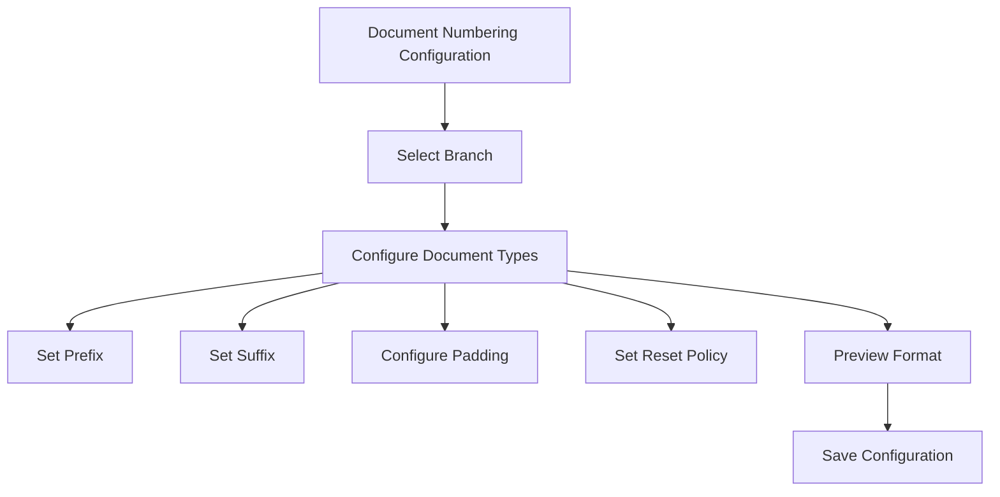
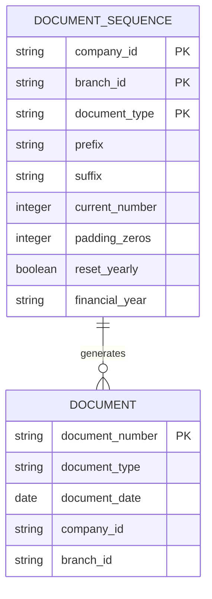
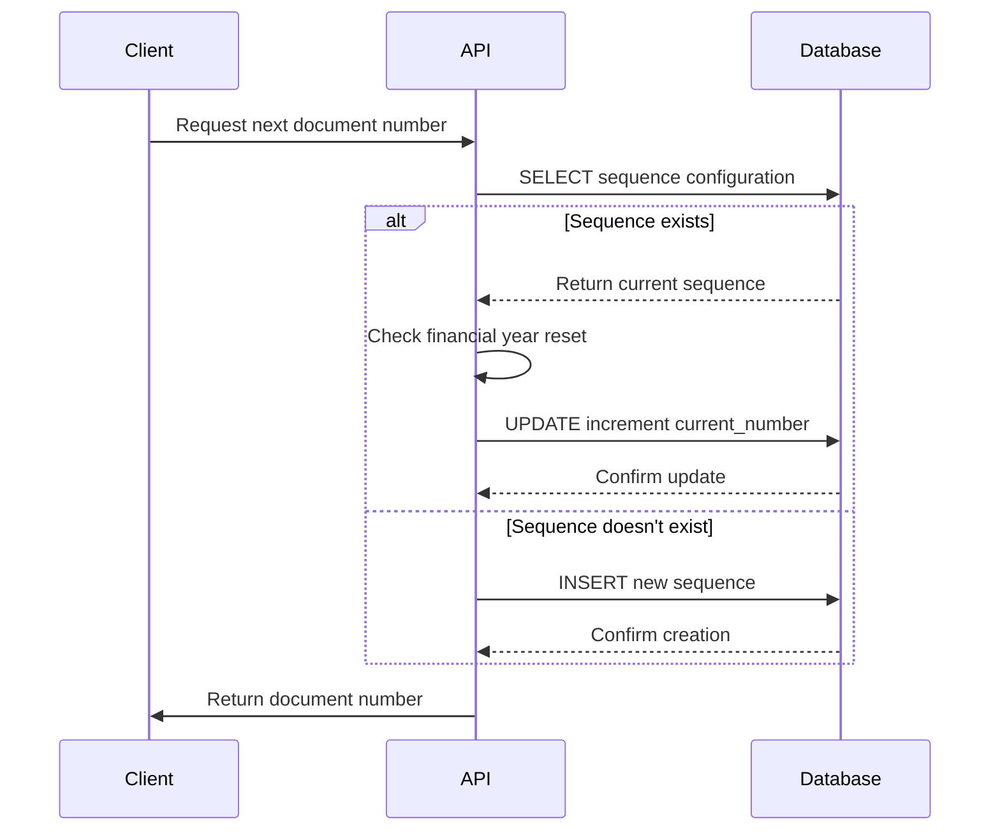
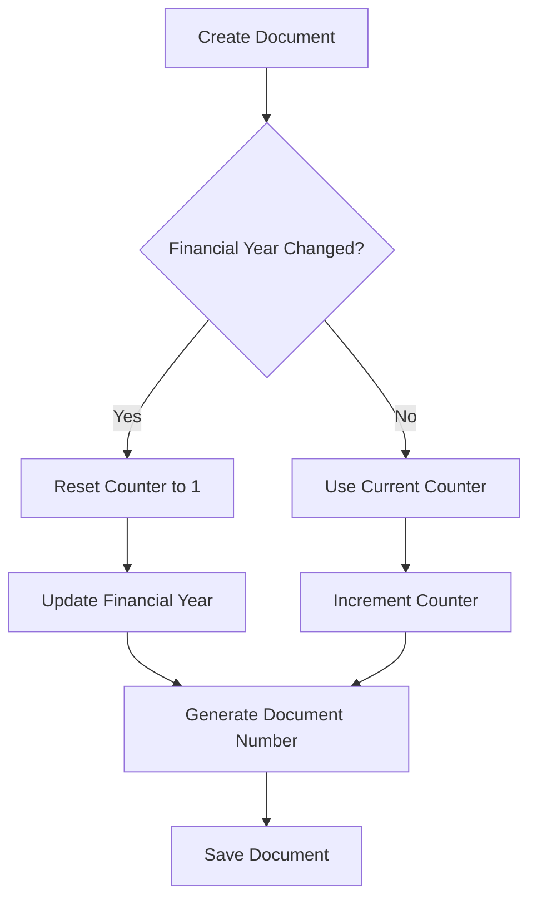

# Document Numbering

<cite>
**Referenced Files in This Document**   
- [DocumentNumbering.js](file://src/components/others/DocumentNumbering.js)
- [document-numbering.js](file://src/pages/api/settings/document-numbering.js)
- [next-number.js](file://src/pages/api/sales/quotations/next-number.js)
- [index.js](file://src/pages/api/sales/quotations/index.js)
- [next-number.js](file://src/pages/api/sales/invoices/next-number.js)
- [next-number.js](file://src/pages/api/sales/sales-orders/next-number.js)
</cite>

## Table of Contents
1. [Introduction](#introduction)
2. [Configuration Interface](#configuration-interface)
3. [Numbering Format Structure](#numbering-format-structure)
4. [Sequence Generation Logic](#sequence-generation-logic)
5. [Reset Policies](#reset-policies)
6. [Database Schema](#database-schema)
7. [API Endpoints](#api-endpoints)
8. [Concurrency Handling](#concurrency-handling)
9. [Migration and Error Handling](#migration-and-error-handling)
10. [Best Practices](#best-practices)

## Introduction
The document numbering system in ezbillify-v1 provides a comprehensive solution for generating sequential identifiers for various business documents including invoices, purchase orders, quotations, and sales orders. The system is designed to ensure audit compliance, prevent duplicates, and support multi-branch and multi-company environments. It offers extensive configuration options for prefixes, suffixes, padding, and reset policies while maintaining data integrity across concurrent operations.

**Section sources**
- [DocumentNumbering.js](file://src/components/others/DocumentNumbering.js#L1-L524)

## Configuration Interface
The document numbering configuration is managed through a dedicated interface that allows administrators to customize numbering sequences for different document types. The interface supports branch-specific configurations with each branch having its own prefix. Users can configure document-specific prefixes, suffixes, zero padding, and reset policies. The system provides real-time previews of the generated document format and includes validation to prevent invalid configurations.

The configuration interface handles nine document types: sales invoices, quotations, sales orders, purchase orders, purchase bills, goods receipt notes, payment received, payment made, credit notes, and debit notes. Each document type has a default prefix but can be customized according to organizational requirements. The interface also allows resetting sequence counters back to 1 when needed.



**Diagram sources**
- [DocumentNumbering.js](file://src/components/others/DocumentNumbering.js#L26-L38)

**Section sources**
- [DocumentNumbering.js](file://src/components/others/DocumentNumbering.js#L323-L524)

## Numbering Format Structure
The document numbering system follows a standardized format that combines multiple components to create unique identifiers. The format is: `{BranchPrefix}-{DocumentPrefix}{PaddedNumber}/{FinancialYear}`. The branch prefix is defined at the branch level and provides organization-wide identification. The document prefix is specific to each document type (e.g., INV- for invoices, PO- for purchase orders).

Number padding supports 1 to 5 leading zeros, with a default of 4 digits (0001, 0002, etc.). The financial year suffix follows the format YY-YY (e.g., 25-26) and is automatically calculated based on the Indian financial year (April 1st to March 31st). The system allows custom suffixes but recommends using the automatic financial year suffix for audit compliance.



**Diagram sources**
- [DocumentNumbering.js](file://src/components/others/DocumentNumbering.js#L488-L505)

**Section sources**
- [DocumentNumbering.js](file://src/components/others/DocumentNumbering.js#L159-L196)

## Sequence Generation Logic
The system generates document numbers through a coordinated process between frontend and backend components. When creating a new document, the system first checks for an existing sequence configuration in the database. If no configuration exists, it creates a default sequence with standard settings. The generation process considers the current financial year and applies reset policies before determining the next number.

The sequence generation follows atomic operations to ensure uniqueness. After determining the current number, the system immediately increments the counter in the database before returning the number to the client. This prevents duplicate numbers even under high concurrency. The system uses database transactions and row-level locking to maintain data integrity during the increment operation.



**Diagram sources**
- [next-number.js](file://src/pages/api/sales/quotations/next-number.js#L48-L150)
- [index.js](file://src/pages/api/sales/quotations/index.js#L209-L256)

**Section sources**
- [next-number.js](file://src/pages/api/sales/quotations/next-number.js#L1-L171)

## Reset Policies
The document numbering system supports multiple reset policies to accommodate different organizational requirements. The primary reset policy is yearly reset, which automatically resets sequence counters at the beginning of each financial year (April 1st). This ensures that document numbering starts from 1 for each financial year, which is essential for audit and compliance purposes.

The system calculates the financial year based on the Indian fiscal calendar (April-March) rather than the calendar year. When a document is created and the current financial year differs from the stored financial year in the sequence record, the system resets the counter to 1 and updates the financial year field. This reset mechanism works seamlessly even when creating documents for previous or future financial years.



**Diagram sources**
- [document-numbering.js](file://src/pages/api/settings/document-numbering.js#L653-L658)
- [next-number.js](file://src/pages/api/sales/quotations/next-number.js#L112-L129)

**Section sources**
- [document-numbering.js](file://src/pages/api/settings/document-numbering.js#L534-L541)

## Database Schema
The document numbering system relies on a dedicated `document_sequences` table in the database to store configuration and state information. The table includes fields for company_id, branch_id, and document_type as composite primary keys, ensuring unique sequences for each document type within each branch. Additional fields include prefix, suffix, current_number, padding_zeros, reset_yearly, financial_year, and is_active.

The schema is designed to support multi-tenancy with company_id ensuring data isolation between different organizations. The branch_id field enables multi-branch operations with each branch maintaining its own numbering sequence. The financial_year field stores the current financial year context for reset operations, while the current_number field maintains the next available number for the sequence.

**Section sources**
- [document-numbering.js](file://src/pages/api/settings/document-numbering.js#L295-L308)

## API Endpoints
The document numbering system exposes several API endpoints to manage configurations and generate document numbers. The primary endpoints include GET and POST methods on `/api/settings/document-numbering` for retrieving and saving sequence configurations. These endpoints handle authentication, validation, and database operations for managing numbering settings.

Additional endpoints are available for specific document types at `/api/sales/{document-type}/next-number` which generate the next available document number. These endpoints are used when creating new documents and ensure that numbers are generated atomically. The system also provides preview functionality through query parameters, allowing users to see the format of generated numbers before saving configurations.

```mermaid
graph TB
A[Frontend] --> B[/api/settings/document-numbering]
A --> C[/api/sales/quotations/next-number]
A --> D[/api/sales/invoices/next-number]
A --> E[/api/sales/sales-orders/next-number]
B --> F[GET: Retrieve configurations]
B --> G[POST: Save configurations]
C --> H[GET: Generate next quotation number]
D --> I[GET: Generate next invoice number]
E --> J[GET: Generate next sales order number]
```

**Diagram sources**
- [document-numbering.js](file://src/pages/api/settings/document-numbering.js#L24-L45)
- [next-number.js](file://src/pages/api/sales/invoices/next-number.js#L5-L157)

**Section sources**
- [document-numbering.js](file://src/pages/api/settings/document-numbering.js#L1-L695)

## Concurrency Handling
The system implements robust concurrency handling to prevent duplicate document numbers under high load. When generating a new document number, the system uses atomic database operations that combine reading the current sequence and incrementing the counter in a single transaction. This prevents race conditions that could result in duplicate numbers.

The implementation uses database-level locking and optimistic concurrency control. When updating the sequence counter, the system includes the current_number in the WHERE clause of the UPDATE statement, ensuring that the update only succeeds if the counter hasn't been modified by another process. If the update fails due to a concurrent modification, the system can retry the operation or fall back to alternative methods.

**Section sources**
- [index.js](file://src/pages/api/sales/quotations/index.js#L243-L253)
- [next-number.js](file://src/pages/api/sales/quotations/next-number.js#L96-L104)

## Migration and Error Handling
The document numbering system includes comprehensive error handling and migration capabilities. When a sequence configuration doesn't exist for a document type, the system automatically creates a default configuration with sensible defaults. This ensures that document creation can proceed even if administrators haven't explicitly configured numbering for all document types.

Error handling is implemented at multiple levels, with detailed logging for troubleshooting and user-friendly error messages. The system validates inputs before saving configurations and provides feedback on invalid settings. For critical operations like sequence updates, the system includes retry logic and fallback mechanisms to maintain availability even under database connectivity issues.

**Section sources**
- [document-numbering.js](file://src/pages/api/settings/document-numbering.js#L631-L649)
- [index.js](file://src/pages/api/sales/quotations/index.js#L210-L254)

## Best Practices
To maintain audit-compliant numbering in multi-branch and multi-company environments, organizations should follow several best practices. First, establish consistent naming conventions for branch prefixes to ensure organizational clarity. Second, regularly audit sequence configurations to verify they align with organizational policies.

For multi-branch operations, ensure that branch prefixes are unique and meaningful. When migrating from legacy systems, carefully plan the transition to avoid gaps or overlaps in numbering sequences. The system should be monitored for any failed sequence updates, as these could indicate concurrency issues or database problems.

Organizations should also implement regular backups of the document_sequences table and establish procedures for handling edge cases like financial year transitions and system failures during document creation.

**Section sources**
- [DocumentNumbering.js](file://src/components/others/DocumentNumbering.js#L235-L279)
- [document-numbering.js](file://src/pages/api/settings/document-numbering.js#L264-L280)