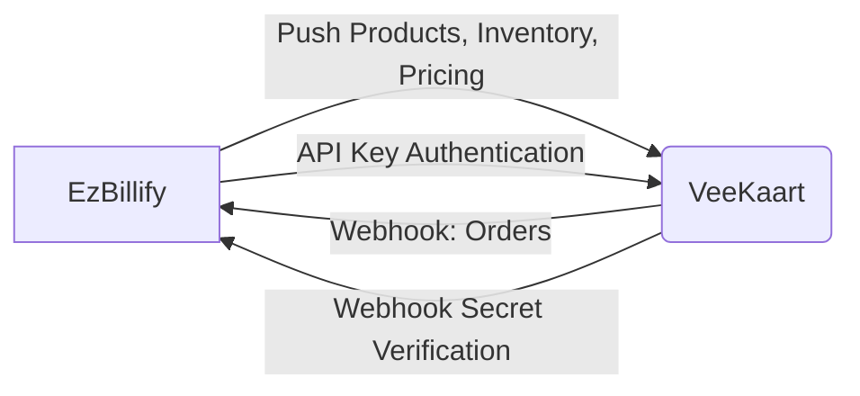
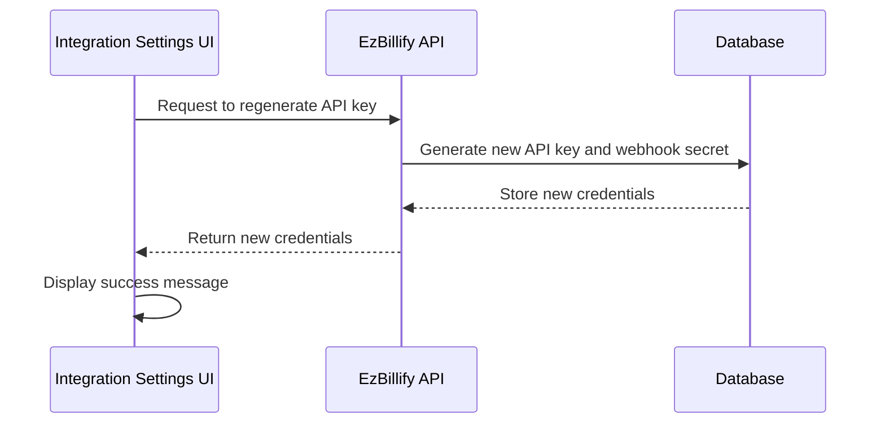
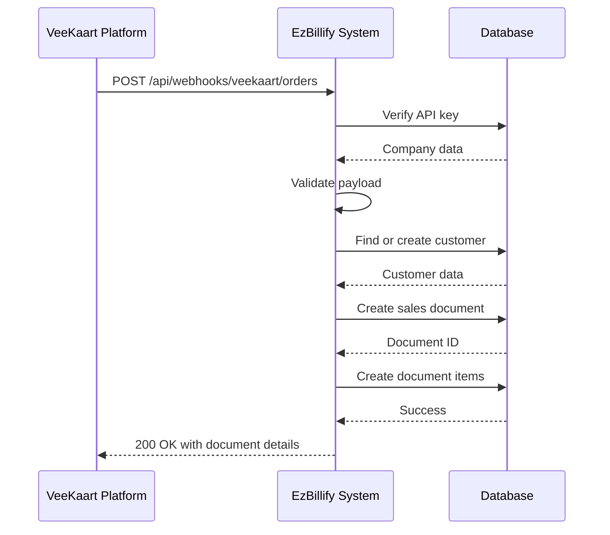
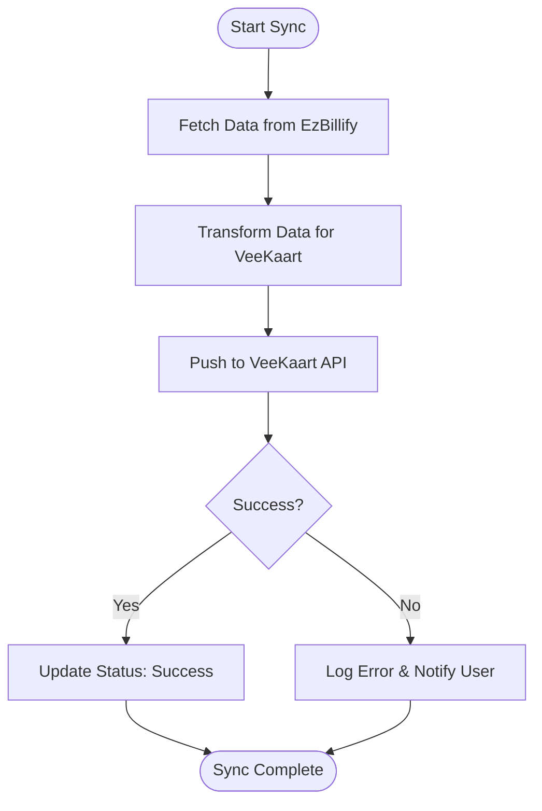
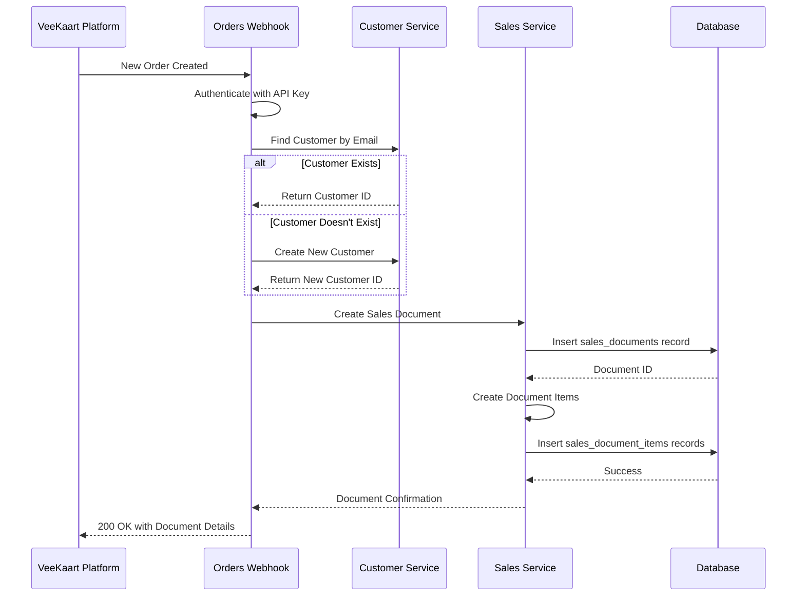

# Integration Settings

<cite>
**Referenced Files in This Document**   
- [IntegrationSettings.js](file://src/components/others/IntegrationSettings.js)
- [VeeKaartSync.js](file://src/components/others/VeeKaartSync.js)
- [veekaartIntegrationService.js](file://src/services/veekaartIntegrationService.js)
- [push-products.js](file://src/pages/api/integrations/veekaart/push-products.js)
- [push-inventory.js](file://src/pages/api/integrations/veekaart/push-inventory.js)
- [push-pricing.js](file://src/pages/api/integrations/veekaart/push-pricing.js)
- [orders.js](file://src/pages/api/webhooks/veekaart/orders.js)
</cite>

## Table of Contents
1. [Introduction](#introduction)
2. [Integration Architecture](#integration-architecture)
3. [API Key Management](#api-key-management)
4. [Webhook Configuration](#webhook-configuration)
5. [Data Synchronization Settings](#data-synchronization-settings)
6. [VeeKaart Integration Setup](#veekaart-integration-setup)
7. [Data Mapping and Transformation](#data-mapping-and-transformation)
8. [Event-Driven Architecture](#event-driven-architecture)
9. [Error Handling and Troubleshooting](#error-handling-and-troubleshooting)
10. [Best Practices](#best-practices)

## Introduction

The ezbillify-v1 platform provides robust integration capabilities with external services, with a primary focus on VeeKaart for e-commerce operations. This documentation details the configuration and management of integration settings, including API key management, webhook configuration, and data synchronization between EzBillify and VeeKaart. The system enables bidirectional data exchange for product catalog, inventory levels, pricing, and order information, creating a seamless connection between the accounting platform and the e-commerce storefront.

**Section sources**
- [IntegrationSettings.js](file://src/components/others/IntegrationSettings.js#L46-L467)
- [VeeKaartSync.js](file://src/components/others/VeeKaartSync.js#L98-L432)

## Integration Architecture

The integration architecture follows a hybrid approach combining API-based data synchronization and event-driven webhook communication. EzBillify acts as both a data source and consumer in different contexts:

- **Outbound Synchronization**: EzBillify pushes product, inventory, and pricing data to VeeKaart via API calls
- **Inbound Processing**: VeeKaart pushes order data to EzBillify through webhook endpoints
- **Authentication**: Mutual authentication using API keys and webhook secrets
- **Directionality**: Unidirectional for product data (EzBillify → VeeKaart), bidirectional for order data



**Diagram sources**
- [IntegrationSettings.js](file://src/components/others/IntegrationSettings.js#L54-L64)
- [VeeKaartSync.js](file://src/components/others/VeeKaartSync.js#L106-L140)
- [orders.js](file://src/pages/api/webhooks/veekaart/orders.js#L18-L199)

## API Key Management

API key management is a critical component of the integration security model, enabling secure communication between EzBillify and external services.

### EzBillify API Credentials
EzBillify generates two primary credentials for integration:
- **API Key**: Used by external services to authenticate requests to EzBillify endpoints
- **Webhook Secret**: Used to sign and verify webhook payloads

These credentials are managed through the Integration Settings UI, where users can:
- View current API credentials
- Regenerate new API keys (invalidating previous keys)
- Copy credentials to clipboard securely

The API key regeneration endpoint (`/api/companies/[id]/regenerate-api-key`) creates new cryptographic keys and updates them in the database, ensuring that compromised keys can be rotated without disrupting the overall integration configuration.



**Diagram sources**
- [IntegrationSettings.js](file://src/components/others/IntegrationSettings.js#L120-L151)
- [veekaartIntegrationService.js](file://src/services/veekaartIntegrationService.js#L142-L160)

**Section sources**
- [IntegrationSettings.js](file://src/components/others/IntegrationSettings.js#L54-L64)
- [veekaartIntegrationService.js](file://src/services/veekaartIntegrationService.js#L142-L160)

## Webhook Configuration

Webhook configuration enables VeeKaart to push real-time data to EzBillify, specifically for order processing.

### Webhook Endpoint
The primary webhook endpoint for order processing is:
```
POST /api/webhooks/veekaart/orders
```

This endpoint requires:
- **Authentication**: Bearer token using the EzBillify API key
- **Payload Structure**: JSON containing order details, customer information, and line items
- **Validation**: Verification of required fields including order ID, customer data, and total amount

### Security Implementation
The webhook endpoint implements multiple security measures:
- API key verification against the companies table
- Required Authorization header with Bearer token
- Input validation for critical order fields
- Error logging for troubleshooting authentication failures

When a valid order webhook is received, the system:
1. Authenticates the request using the API key
2. Validates the payload structure and required fields
3. Finds or creates the customer in EzBillify
4. Creates a sales document (invoice) with draft status
5. Populates line items from the order data
6. Returns confirmation with document details



**Diagram sources**
- [orders.js](file://src/pages/api/webhooks/veekaart/orders.js#L18-L199)
- [IntegrationSettings.js](file://src/components/others/IntegrationSettings.js#L402-L403)

**Section sources**
- [orders.js](file://src/pages/api/webhooks/veekaart/orders.js#L18-L199)
- [IntegrationSettings.js](file://src/components/others/IntegrationSettings.js#L398-L413)

## Data Synchronization Settings

Data synchronization settings control the periodic or manual transfer of data from EzBillify to VeeKaart.

### Synchronization Types
Three primary data types can be synchronized:

| Synchronization Type | Direction | Endpoint | Estimated Time | Purpose |
|----------------------|---------|----------|----------------|---------|
| Products | EzBillify → VeeKaart | `/api/integrations/veekaart/push-products` | 2-5 minutes | Sync product catalog including SKU, name, description, and tax rates |
| Inventory | EzBillify → VeeKaart | `/api/integrations/veekaart/push-inventory` | 1-2 minutes | Update stock levels for accurate inventory display |
| Pricing | EzBillify → VeeKaart | `/api/integrations/veekaart/push-pricing` | 1-3 minutes | Synchronize selling prices, MRP, and discount information |

### Synchronization Methods
Users can initiate synchronization through:
- **Individual Sync**: Manual sync of specific data types from the VeeKaart Sync interface
- **Full Sync**: Sequential synchronization of all data types (products, inventory, pricing)
- **Automatic Sync**: Scheduled synchronization when enabled in integration settings

The synchronization process follows a consistent pattern:
1. Fetch relevant data from EzBillify database
2. Transform data into VeeKaart-compatible format
3. Push transformed data to VeeKaart API endpoint
4. Handle response and provide user feedback



**Diagram sources**
- [VeeKaartSync.js](file://src/components/others/VeeKaartSync.js#L106-L140)
- [push-products.js](file://src/pages/api/integrations/veekaart/push-products.js#L6-L138)
- [push-inventory.js](file://src/pages/api/integrations/veekaart/push-inventory.js#L6-L66)
- [push-pricing.js](file://src/pages/api/integrations/veekaart/push-pricing.js#L6-L89)

**Section sources**
- [VeeKaartSync.js](file://src/components/others/VeeKaartSync.js#L170-L206)
- [push-products.js](file://src/pages/api/integrations/veekaart/push-products.js#L6-L138)

## VeeKaart Integration Setup

The VeeKaart integration setup process configures the connection between EzBillify and the VeeKaart e-commerce platform.

### Configuration Parameters
The integration requires the following configuration:

| Parameter | Required | Description | Security |
|---------|---------|-------------|----------|
| VeeKaart API URL | Yes | Base URL of the VeeKaart API endpoint | Stored encrypted |
| VeeKaart API Key | Yes | Authentication key for VeeKaart API access | Stored encrypted, masked in UI |
| Webhook Secret | No | Secret for signing webhook payloads | Stored encrypted, optional |
| Auto Sync Enabled | No | Flag to enable automatic synchronization | Boolean setting |

### Setup Process
1. Navigate to Integration Settings in EzBillify
2. Enter VeeKaart API URL and API Key
3. Optionally configure webhook secret
4. Enable or disable automatic synchronization
5. Save configuration
6. Test connection to verify setup

The test connection functionality (`/api/integrations/veekaart/test-connection`) validates the integration configuration by attempting a sample API call to ensure credentials and endpoints are correctly configured.

**Section sources**
- [IntegrationSettings.js](file://src/components/others/IntegrationSettings.js#L59-L64)
- [IntegrationSettings.js](file://src/components/others/IntegrationSettings.js#L160-L199)

## Data Mapping and Transformation

Data mapping and transformation ensure compatibility between EzBillify's data model and VeeKaart's requirements.

### Product Data Mapping
When synchronizing products from EzBillify to VeeKaart:

| EzBillify Field | VeeKaart Field | Transformation |
|----------------|----------------|----------------|
| item_code | sku | Direct mapping |
| item_name | name | Direct mapping |
| description | description | Direct mapping |
| hsn_sac_code | hsn_sac_code | Direct mapping |
| selling_price | price | Converted to float |
| mrp | mrp | Converted to float |
| tax_rate_id | tax_rate | Looked up from tax_rates table |
| is_active | status | Boolean to string ('active'/'inactive') |

### Inventory Data Mapping
For inventory synchronization:

| EzBillify Field | VeeKaart Field | Transformation |
|----------------|----------------|----------------|
| item_code | sku | Direct mapping |
| current_stock | quantity | Converted to float |
| reserved_stock | reserved_quantity | Converted to float |
| available_stock | available_quantity | Converted to float |

### Pricing Data Mapping
For pricing synchronization:

| EzBillify Field | VeeKaart Field | Transformation |
|----------------|----------------|----------------|
| purchase_price | cost_price | Converted to float |
| selling_price | selling_price | Converted to float |
| mrp | mrp | Converted to float |
| tax_rate_id | tax_rate | Looked up from tax_rates table |
| | discount_percentage | Calculated as (mrp - selling_price) / mrp * 100 |

**Section sources**
- [push-products.js](file://src/pages/api/integrations/veekaart/push-products.js#L94-L105)
- [push-inventory.js](file://src/pages/api/integrations/veekaart/push-inventory.js#L31-L37)
- [push-pricing.js](file://src/pages/api/integrations/veekaart/push-pricing.js#L46-L60)

## Event-Driven Architecture

The integration employs an event-driven architecture for real-time data exchange, particularly for order processing from VeeKaart to EzBillify.

### Webhook Processing Flow
The event-driven flow for order webhooks:



### Event Characteristics
- **Real-time Processing**: Orders are processed immediately upon receipt
- **Idempotency**: The system can handle duplicate webhook calls safely
- **Error Resilience**: Failed processing is logged and can be retried
- **Data Consistency**: Transactions ensure related records are created atomically

The architecture supports scalability by decoupling the order creation event from the accounting system processing, allowing VeeKaart to continue operations even if EzBillify experiences temporary issues.

**Diagram sources**
- [orders.js](file://src/pages/api/webhooks/veekaart/orders.js#L68-L176)
- [IntegrationSettings.js](file://src/components/others/IntegrationSettings.js#L402-L403)

**Section sources**
- [orders.js](file://src/pages/api/webhooks/veekaart/orders.js#L18-L199)

## Error Handling and Troubleshooting

The integration system includes comprehensive error handling and troubleshooting capabilities.

### Common Issues and Solutions

#### Authentication Failures
**Symptoms**: 401 Unauthorized responses, "Invalid API key" messages
**Causes**:
- Incorrect API key configuration
- Expired or regenerated API keys
- Missing Authorization header

**Solutions**:
1. Verify API key in Integration Settings
2. Regenerate API key if compromised or outdated
3. Ensure Authorization header is properly formatted as "Bearer [api_key]"

#### Payload Mismatches
**Symptoms**: 400 Bad Request, "Missing required fields" errors
**Causes**:
- Missing required fields in webhook payload
- Incorrect data types (e.g., string instead of number)
- Malformed JSON structure

**Solutions**:
1. Validate payload structure against documentation
2. Ensure all required fields are present
3. Verify data types match expected formats

#### Rate Limiting
**Symptoms**: 429 Too Many Requests, intermittent failures during bulk operations
**Causes**:
- Excessive API calls within time window
- Concurrent synchronization processes
- Large data payloads

**Solutions**:
1. Implement exponential backoff for retry logic
2. Space out synchronization operations
3. Use full sync instead of multiple individual syncs

### Connection Testing
The system provides a connection test feature that:
- Validates API credentials
- Tests network connectivity to VeeKaart
- Verifies proper configuration of integration settings
- Updates connection status indicators in the UI

### Error Monitoring
Error conditions are logged with detailed information including:
- Timestamp of the error
- Error message and stack trace
- Request payload (sanitized)
- Company and user context
- Integration type and operation

**Section sources**
- [IntegrationSettings.js](file://src/components/others/IntegrationSettings.js#L202-L231)
- [orders.js](file://src/pages/api/webhooks/veekaart/orders.js#L192-L197)
- [push-products.js](file://src/pages/api/integrations/veekaart/push-products.js#L132-L137)

## Best Practices

Implementing the following best practices ensures reliable and secure integration operations.

### Security Best Practices
- **Regular Key Rotation**: Regenerate API keys periodically or when compromised
- **Secure Storage**: Ensure API keys and webhook secrets are stored encrypted
- **Minimal Permissions**: Use API keys with only necessary permissions
- **Webhook Validation**: Always verify webhook signatures when available

### Synchronization Best Practices
- **Staggered Sync**: Avoid running multiple synchronization processes simultaneously
- **Off-Peak Scheduling**: Perform full synchronization during low-usage periods
- **Incremental Updates**: Use individual sync types for targeted updates
- **Monitor Sync Status**: Regularly check synchronization completion and error logs

### Monitoring and Maintenance
- **Connection Status**: Regularly verify the integration connection status
- **Error Logs**: Monitor error logs for failed webhook deliveries or sync operations
- **Data Consistency**: Periodically audit data between systems for discrepancies
- **Performance Monitoring**: Track synchronization duration and optimize as needed

### Operational Guidelines
- **Test First**: Always test new configurations in a staging environment
- **Document Configuration**: Maintain documentation of integration settings
- **Backup Configuration**: Keep backups of API credentials and configuration
- **Update Procedures**: Follow documented procedures for configuration changes

By following these best practices, organizations can maintain a robust, secure, and efficient integration between EzBillify and VeeKaart, ensuring data consistency and operational reliability.

**Section sources**
- [IntegrationSettings.js](file://src/components/others/IntegrationSettings.js#L120-L151)
- [VeeKaartSync.js](file://src/components/others/VeeKaartSync.js#L170-L206)
- [orders.js](file://src/pages/api/webhooks/veekaart/orders.js#L18-L199)