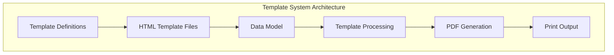
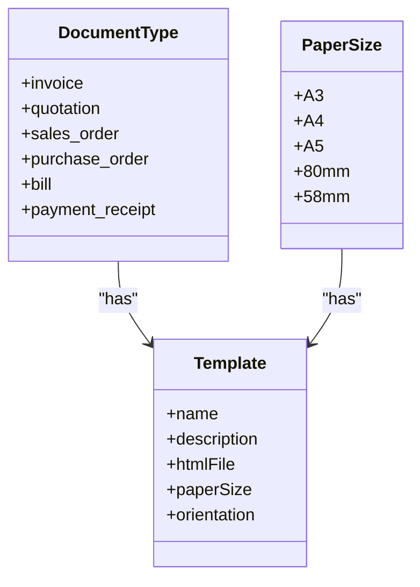
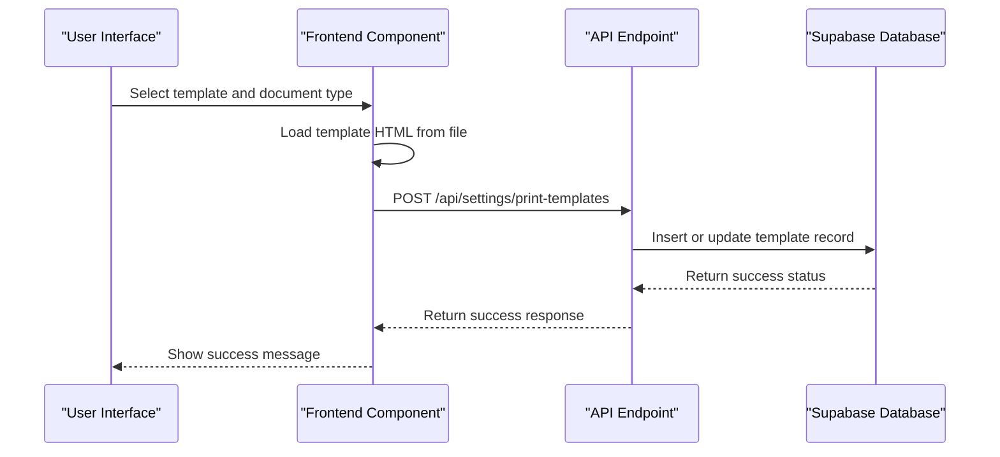
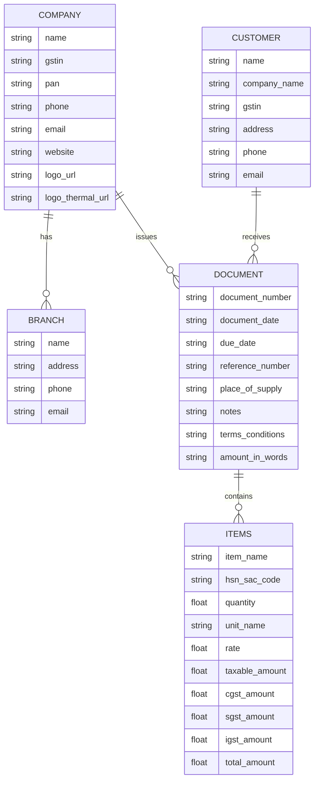
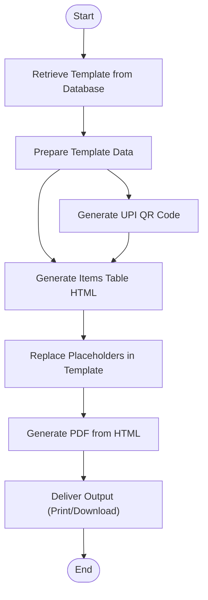

# Print Templates

<cite>
**Referenced Files in This Document**   
- [PrintTemplates.js](file://src/components/others/PrintTemplates.js)
- [PrintTemplateDefinitions.js](file://src/components/others/PrintTemplateDefinitions.js)
- [printService.js](file://src/services/printService.js)
- [pdfGenerationService.js](file://src/services/pdfGenerationService.js)
- [print-templates.js](file://src/pages/api/settings/print-templates.js)
- [A4-Default.html](file://public/templates/A4-Default.html)
- [80mm-Detailed.html](file://public/templates/80mm-Detailed.html)
- [58mm-Basic.html](file://public/templates/58mm-Basic.html)
- [invoice-A4-modern.html](file://public/templates/invoice-A4-modern.html)
- [invoice-80mm-thermal-compact.html](file://public/templates/invoice-80mm-thermal-compact.html)
</cite>

## Table of Contents
1. [Introduction](#introduction)
2. [Template Structure and Organization](#template-structure-and-organization)
3. [Document Types and Paper Formats](#document-types-and-paper-formats)
4. [Template Customization and Application](#template-customization-and-application)
5. [Merge Fields and Data Model Integration](#merge-fields-and-data-model-integration)
6. [Template Processing Workflow](#template-processing-workflow)
7. [Common Issues and Best Practices](#common-issues-and-best-practices)
8. [Template Inheritance and Multi-Company Support](#template-inheritance-and-multi-company-support)
9. [Creating and Modifying Templates](#creating-and-modifying-templates)
10. [Conclusion](#conclusion)

## Introduction

The print template system in ezbillify-v1 provides a flexible and comprehensive solution for generating professional documents across various paper formats and document types. The system supports both standard paper sizes (A3, A4, A5) and thermal printer formats (80mm, 58mm), with specialized templates designed for different business needs. Templates are implemented as HTML files with Handlebars-style placeholders that are dynamically replaced with actual data during document generation. The system is designed to handle GST-compliant layouts, support dynamic content rendering, and provide consistent output across different printer types.

**Section sources**
- [PrintTemplates.js](file://src/components/others/PrintTemplates.js#L1-L463)
- [PrintTemplateDefinitions.js](file://src/components/others/PrintTemplateDefinitions.js#L1-L133)

## Template Structure and Organization

The print template system is organized around HTML-based templates stored in the `/public/templates/` directory. Each template is a standalone HTML file with embedded CSS for styling and layout. The templates use a consistent placeholder system with uppercase keys enclosed in double curly braces (e.g., `{{COMPANY_NAME}}`) that are replaced with actual data during processing.

The system separates template definitions from their implementation, with template metadata stored in JavaScript objects and the actual HTML content in separate files. This separation allows for easy management of template properties while maintaining the flexibility to modify the HTML structure independently.

**Diagram sources**
- [PrintTemplateDefinitions.js](file://src/components/others/PrintTemplateDefinitions.js#L1-L133)
- [printService.js](file://src/services/printService.js#L1-L585)
- [pdfGenerationService.js](file://src/services/pdfGenerationService.js#L1-L241)

**Section sources**
- [PrintTemplateDefinitions.js](file://src/components/others/PrintTemplateDefinitions.js#L1-L133)
- [A4-Default.html](file://public/templates/A4-Default.html#L1-L363)
- [80mm-Detailed.html](file://public/templates/80mm-Detailed.html#L1-L519)

## Document Types and Paper Formats

The system supports multiple document types including invoices, quotations, sales orders, purchase orders, bills, and payment receipts. Each document type can be assigned different templates based on paper size requirements. The supported paper formats include:

- **A4 (210 × 297 mm)**: Standard business documents with templates for default, GST-compatible, modern, and ledger formats
- **A3 (297 × 420 mm)**: Large format documents with landscape orientation
- **A5 (148 × 210 mm)**: Compact documents for smaller printouts
- **80mm Thermal**: Receipt printer format with basic, detailed, and no-company-branding options
- **58mm Thermal**: Compact receipt printer format for space-constrained environments

Each paper size has specialized templates optimized for its dimensions and typical use cases. For example, thermal printer templates are designed with monospace fonts and compact layouts to ensure readability on narrow paper rolls, while A4 templates include more detailed information and branding elements.

**Diagram sources**
- [PrintTemplates.js](file://src/components/others/PrintTemplates.js#L19-L61)
- [PrintTemplateDefinitions.js](file://src/components/others/PrintTemplateDefinitions.js#L4-L117)

**Section sources**
- [PrintTemplates.js](file://src/components/others/PrintTemplates.js#L19-L61)
- [PrintTemplateDefinitions.js](file://src/components/others/PrintTemplateDefinitions.js#L4-L117)

## Template Customization and Application

Templates are customized and applied through a user interface that allows administrators to select paper sizes and assign templates to different document types. The system provides a preview functionality that renders templates with sample data, enabling users to see how the final document will appear before applying the template.

When a template is assigned to a document type, the system stores the template configuration in the database, including the template HTML, paper size, orientation, and other metadata. This configuration is then used whenever a document of that type is generated or printed.

The template assignment process involves:
1. Selecting a paper size
2. Choosing a template from the available options for that paper size
3. Assigning the template to a specific document type
4. Saving the configuration to the database

**Diagram sources**
- [PrintTemplates.js](file://src/components/others/PrintTemplates.js#L105-L167)
- [print-templates.js](file://src/pages/api/settings/print-templates.js#L121-L243)

**Section sources**
- [PrintTemplates.js](file://src/components/others/PrintTemplates.js#L105-L167)
- [print-templates.js](file://src/pages/api/settings/print-templates.js#L121-L243)

## Merge Fields and Data Model Integration

The template system uses a comprehensive set of merge fields that connect to the underlying data model. These fields are categorized into several groups:

- **Company & Branch**: COMPANY_NAME, COMPANY_GSTIN, BRANCH_NAME, BRANCH_ADDRESS, BRANCH_PHONE
- **Document**: DOCUMENT_TYPE, DOCUMENT_NUMBER, DOCUMENT_DATE, DUE_DATE, REFERENCE_NUMBER
- **Customer**: CUSTOMER_NAME, CUSTOMER_ADDRESS, CUSTOMER_GSTIN, CUSTOMER_PHONE, CUSTOMER_EMAIL
- **Items**: ITEMS_TABLE (pre-rendered HTML table), TAX_BREAKDOWN_TABLE
- **Totals**: SUBTOTAL, DISCOUNT_AMOUNT, CGST_AMOUNT, SGST_AMOUNT, IGST_AMOUNT, TOTAL_AMOUNT, AMOUNT_IN_WORDS
- **Payment**: QR_CODE, BANK_NAME, BANK_ACCOUNT_NUMBER, BANK_IFSC_CODE, UPI_ID
- **Additional**: NOTES, TERMS_CONDITIONS, COMPANY_TAGLINE

The data integration process involves mapping the application's data model to these merge fields through the `prepareTemplateData` method in the print service. This method transforms the raw data from the database into a format suitable for template rendering, handling data formatting, address parsing, and currency formatting.

**Diagram sources**
- [printService.js](file://src/services/printService.js#L337-L516)
- [A4-Default.html](file://public/templates/A4-Default.html#L259-L362)

**Section sources**
- [printService.js](file://src/services/printService.js#L337-L516)
- [A4-Default.html](file://public/templates/A4-Default.html#L259-L362)

## Template Processing Workflow

The template processing workflow follows a systematic approach to generate printable documents:

1. **Template Retrieval**: The system retrieves the appropriate template based on document type and paper size, either from cache or by fetching from the database
2. **Data Preparation**: The raw document data is transformed into a template-ready format, with proper formatting of dates, amounts, and addresses
3. **Placeholder Replacement**: The template HTML is processed to replace merge fields with actual data using Handlebars compilation
4. **PDF Generation**: The processed HTML is converted to PDF using html2canvas and jsPDF libraries
5. **Output Delivery**: The generated PDF is either downloaded, printed, or displayed to the user

For thermal printer templates, the system includes specialized formatting considerations such as monospace fonts, compact layouts, and optimized spacing to ensure compatibility with receipt printers.

**Diagram sources**
- [printService.js](file://src/services/printService.js#L13-L581)
- [pdfGenerationService.js](file://src/services/pdfGenerationService.js#L17-L143)

**Section sources**
- [printService.js](file://src/services/printService.js#L13-L581)
- [pdfGenerationService.js](file://src/services/pdfGenerationService.js#L17-L143)

## Common Issues and Best Practices

### Formatting Inconsistencies Across Printer Types

Different printer types have varying capabilities and limitations that can affect template rendering:

- **Thermal printers**: Limited width, monochrome output, and potential for text wrapping issues
- **Laser/Inkjet printers**: Higher resolution, color capabilities, and standard paper sizes

To address these inconsistencies, the system provides specialized templates for each paper format, with thermal templates using monospace fonts and compact layouts, while standard paper templates can use proportional fonts and more elaborate designs.

### GST-Compliant Layout Requirements

GST-compliant templates must include specific elements such as:
- Company GSTIN and customer GSTIN
- Detailed tax breakdown (CGST, SGST, IGST)
- HSN/SAC codes for items
- Place of supply
- Amount in words

The system ensures GST compliance by including these elements in the appropriate templates and providing a dedicated "GST Compatible" template for each paper size.

### Dynamic Content Rendering

Dynamic content such as item tables and tax breakdowns are generated programmatically based on the document data. The system handles variable-length content by:
- Pre-rendering item tables as HTML strings
- Using CSS to manage table overflow and pagination
- Implementing responsive layouts that adapt to content length

### Best Practices for Template Design

1. **Mobile-Responsive Design**: Use relative units (em, rem) and flexible layouts that adapt to different screen sizes
2. **Printer Optimization**: Minimize ink usage, avoid light colors, and ensure critical information is within the printable area
3. **Accessibility**: Use sufficient color contrast, appropriate font sizes, and semantic HTML structure
4. **Performance**: Optimize images, minimize external dependencies, and use efficient CSS selectors

**Section sources**
- [80mm-Detailed.html](file://public/templates/80mm-Detailed.html#L1-L519)
- [A4-GST-Compatible.html](file://public/templates/A4-GST-Compatible.html#L1-L363)
- [printService.js](file://src/services/printService.js#L95-L277)

## Template Inheritance and Multi-Company Support

The template system supports multi-company setups through a database-driven configuration that stores templates at the company level. Each company can have its own set of templates, allowing for brand customization and regional variations.

Template inheritance is implemented through a fallback mechanism:
1. The system first looks for a company-specific template for the requested document type and paper size
2. If no specific template is found, it falls back to a default template
3. The default templates are stored as static HTML files in the public directory

This inheritance model allows companies to override specific templates while inheriting others from the default set, providing flexibility without requiring complete template sets for each company.

The system also supports template preview functionality that uses sample data to demonstrate how templates will appear with real content, helping users make informed decisions when selecting templates.

**Section sources**
- [print-templates.js](file://src/pages/api/settings/print-templates.js#L57-L109)
- [printService.js](file://src/services/printService.js#L13-L39)
- [PrintTemplates.js](file://src/components/others/PrintTemplates.js#L78-L103)

## Creating and Modifying Templates

### Modifying Existing Templates

To modify an existing template:
1. Locate the HTML file in the `/public/templates/` directory
2. Edit the HTML structure, CSS styles, or placeholder usage as needed
3. Test the changes using the template preview functionality
4. Deploy the updated template file

When modifying templates, consider:
- Maintaining the existing placeholder keys to ensure data compatibility
- Testing on actual printer hardware to verify formatting
- Preserving GST-compliant elements for tax documents
- Optimizing for the target paper size and printer type

### Creating New Templates

To create a new template:
1. Copy an existing template file as a starting point
2. Rename the file according to the naming convention (e.g., `A4-custom.html`)
3. Modify the HTML and CSS to achieve the desired design
4. Add the template definition to `PrintTemplateDefinitions.js`
5. Test the new template through the user interface

When creating new templates, follow these guidelines:
- Use semantic HTML structure for better accessibility
- Implement responsive design principles
- Optimize for fast rendering and printing
- Include all necessary merge fields for the target document type
- Test with various data scenarios (single item, multiple items, discounts, etc.)

**Section sources**
- [A4-Default.html](file://public/templates/A4-Default.html#L1-L363)
- [PrintTemplateDefinitions.js](file://src/components/others/PrintTemplateDefinitions.js#L4-L117)
- [printService.js](file://src/services/printService.js#L125-L134)

## Conclusion

The print template system in ezbillify-v1 provides a robust and flexible solution for generating professional documents across various formats and use cases. By leveraging HTML-based templates with a comprehensive merge field system, the platform enables organizations to create customized, brand-consistent documents that meet regulatory requirements and business needs. The system's architecture supports both standard paper sizes and thermal printer formats, with specialized templates optimized for each use case. Through its database-driven configuration and fallback inheritance model, the system accommodates multi-company setups while allowing for brand customization. The integration with the underlying data model ensures accurate and consistent document generation, while the preview functionality enables users to validate template appearance before deployment. By following best practices for template design and modification, organizations can create effective, printer-optimized documents that enhance their professional image and streamline business operations.