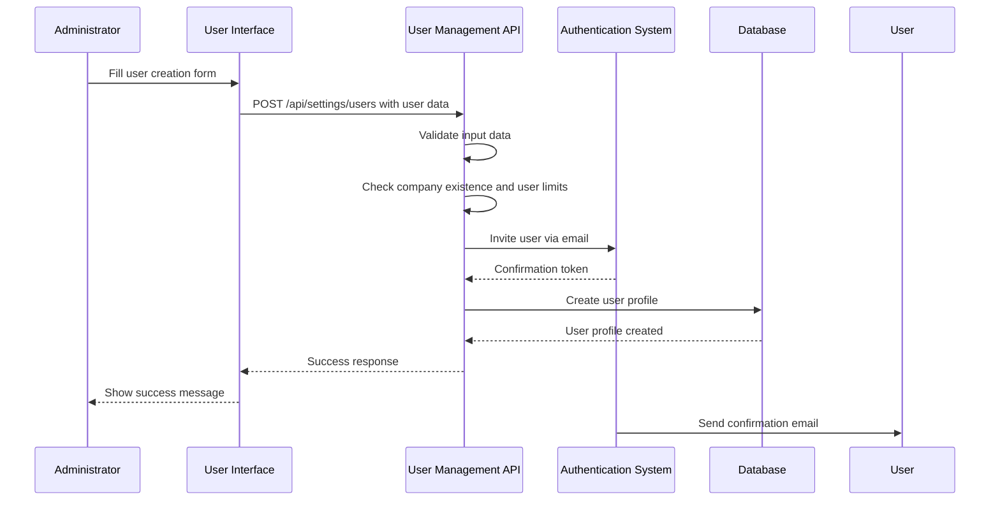
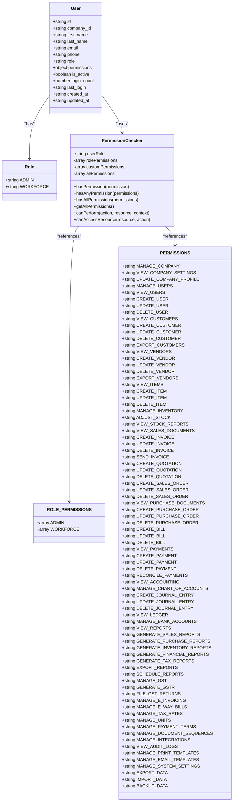
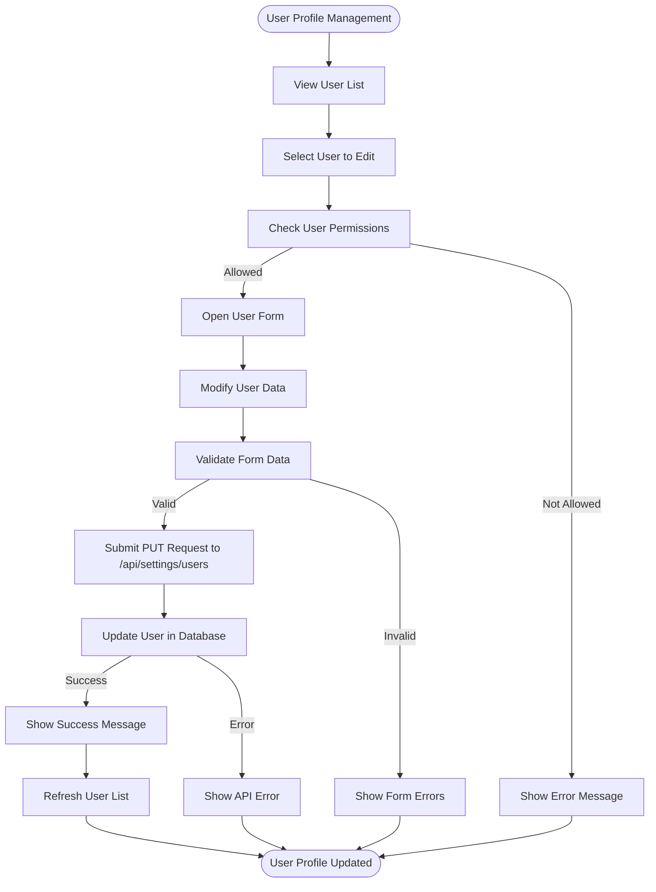
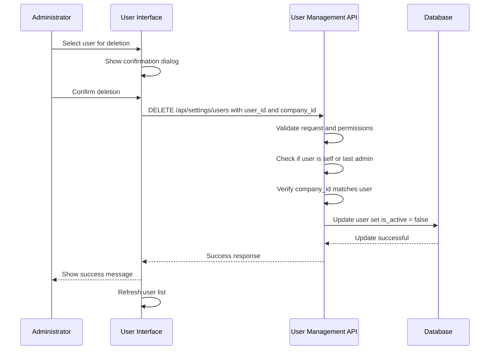
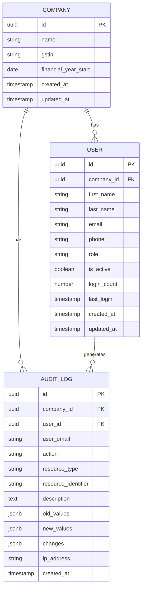
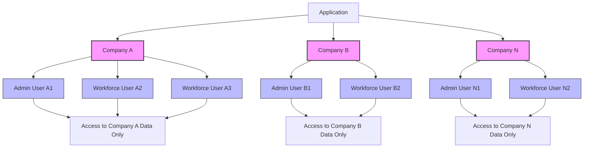

# User Management

<cite>
**Referenced Files in This Document**   
- [UserForm.js](file://src/components/others/UserForm.js)
- [UserList.js](file://src/components/others/UserList.js)
- [users.js](file://src/pages/api/settings/users.js)
- [permissions.js](file://src/lib/permissions.js)
- [usePermissions.js](file://src/hooks/usePermissions.js)
- [AuthContext.js](file://src/context/AuthContext.js)
- [companyService.js](file://src/services/companyService.js)
- [AuditTrail.js](file://src/components/others/AuditTrail.js)
</cite>

## Table of Contents
1. [Introduction](#introduction)
2. [User Creation Process](#user-creation-process)
3. [Role Assignment and Permission Management](#role-assignment-and-permission-management)
4. [User Profile Management](#user-profile-management)
5. [User Deactivation and Deletion](#user-deactivation-and-deletion)
6. [User Activity Tracking and Audit Trail](#user-activity-tracking-and-audit-trail)
7. [Multi-Tenant Environment Considerations](#multi-tenant-environment-considerations)
8. [Compliance and Security](#compliance-and-security)
9. [Common Issues and Troubleshooting](#common-issues-and-troubleshooting)
10. [Best Practices](#best-practices)

## Introduction

The ezbillify-v1 user management system provides a comprehensive solution for managing user accounts, roles, and permissions within a multi-tenant environment. The system is designed to support two primary user roles: admin and workforce, each with distinct access levels and capabilities. User management is tightly integrated with company profiles, authentication methods, and permission systems to ensure secure and compliant access to the application's features.

The user management configuration system enables administrators to create, modify, and deactivate user accounts, assign roles and permissions, and track user activity through comprehensive audit trails. The system implements role-based access control (RBAC) with predefined permission sets for different user roles, ensuring that users have appropriate access to system resources based on their responsibilities.

**Section sources**
- [UserForm.js](file://src/components/others/UserForm.js#L1-L538)
- [UserList.js](file://src/components/others/UserList.js#L1-L494)

## User Creation Process

The user creation process in ezbillify-v1 follows a structured workflow that ensures proper account setup and security. When creating a new workforce user, administrators use the UserForm component to input user details including first name, last name, email, phone number, and password. The system validates these inputs to ensure data quality and security requirements are met.

New users are created through the API endpoint at `/api/settings/users` using a POST request. The creation process involves several key steps:
1. Validation of input data including email format and password strength
2. Verification of company existence and user limits
3. Invitation of the user via email using Supabase's authentication system
4. Creation of the user profile in the database with assigned role and permissions
5. Sending of a confirmation email to the user with instructions for account activation

The system enforces a limit of two workforce users per company, which helps maintain security and manageability in smaller organizations. Admin users can create workforce users but cannot create additional admin users through the interface, ensuring that administrative privileges are carefully controlled.

**Diagram sources**
- [UserForm.js](file://src/components/others/UserForm.js#L1-L538)
- [users.js](file://src/pages/api/settings/users.js#L1-L664)

**Section sources**
- [UserForm.js](file://src/components/others/UserForm.js#L1-L538)
- [users.js](file://src/pages/api/settings/users.js#L1-L664)

## Role Assignment and Permission Management

The ezbillify-v1 system implements a robust role-based access control (RBAC) model with two primary roles: admin and workforce. Each role has a predefined set of permissions that determine the user's access to system features and functionality. The permission system is defined in the `permissions.js` file, which contains comprehensive permission definitions for various system capabilities.

Admin users have full access to all system features, including company management, user management, customer management, inventory management, sales documents, purchase documents, accounting, reports, GST compliance, and system administration. Workforce users have a more limited set of permissions focused on field operations, including viewing and creating customers, viewing items and stock reports, creating invoices and quotations, processing payments, and generating sales reports.

The system allows for custom permission assignment through the user interface, enabling administrators to fine-tune access for workforce users based on their specific responsibilities. The available permissions for workforce users include:
- View Inventory
- Update Inventory
- Create Sales
- View Customers
- Create Customers
- Barcode Scanning

Permission checking is implemented through the `PermissionChecker` class in the `permissions.js` file, which provides methods to verify if a user has specific permissions, any of a set of permissions, or all of a set of permissions. The system also includes permission groups for UI rendering, organizing related permissions into logical categories such as Company Management, User Management, Sales Management, Purchase Management, Inventory Management, Financial Management, Reports & Analytics, Compliance & GST, and System Administration.

**Diagram sources**
- [permissions.js](file://src/lib/permissions.js#L1-L390)
- [UserForm.js](file://src/components/others/UserForm.js#L1-L538)

**Section sources**
- [permissions.js](file://src/lib/permissions.js#L1-L390)
- [usePermissions.js](file://src/hooks/usePermissions.js#L1-L67)
- [UserForm.js](file://src/components/others/UserForm.js#L1-L538)

## User Profile Management

User profile management in ezbillify-v1 allows administrators and users to view and modify user information, roles, and permissions. The UserList component provides a comprehensive interface for managing all users within a company, displaying key information such as user name, role, contact details, last login time, and status.

Administrators can edit user profiles through the UserForm component, which is accessible when clicking the "Edit" button in the UserList. The editing interface allows modification of user details including first name, last name, phone number, role (for non-self edits by admins), and workforce permissions. Admin users can also toggle the active status of other users, effectively deactivating or reactivating their accounts.

The system implements several security constraints to prevent unauthorized changes:
- Users cannot edit their own role
- Users cannot deactivate their own accounts
- Only admin users can modify roles
- The last admin user cannot be deleted or deactivated

When editing a user profile, the system sends a PUT request to the `/api/settings/users` endpoint with the updated user data. The API validates the request, ensures the user has appropriate permissions to make the changes, and updates the user record in the database. The system also tracks the number of logins and the timestamp of the last login for each user, providing valuable insights into user activity patterns.

**Diagram sources**
- [UserList.js](file://src/components/others/UserList.js#L1-L494)
- [users.js](file://src/pages/api/settings/users.js#L509-L590)

**Section sources**
- [UserList.js](file://src/components/others/UserList.js#L1-L494)
- [UserForm.js](file://src/components/others/UserForm.js#L1-L538)
- [users.js](file://src/pages/api/settings/users.js#L509-L590)

## User Deactivation and Deletion

The ezbillify-v1 system implements a careful approach to user deactivation and deletion to maintain data integrity and security. Rather than permanently deleting user accounts, the system deactivates users by setting the `is_active` field to false. This approach preserves historical data and audit trails while preventing the user from accessing the system.

User deactivation can be performed through the UserList interface by toggling the status of a user. When a user is deactivated, they lose access to the system upon their next login attempt. The system prevents users from deactivating their own accounts and prevents the deletion of the last admin user, ensuring that there is always at least one administrator with access to the system.

The user deletion process is actually a deactivation process that sends a DELETE request to the `/api/settings/users` endpoint with the user_id and company_id. The API handles this request by updating the user's `is_active` status to false rather than removing the record from the database. This soft deletion approach allows for potential reactivation of accounts if needed and maintains the integrity of audit logs and historical records.

The system includes safeguards to prevent accidental deletion of critical accounts:
- Users cannot delete their own accounts
- The last admin user cannot be deleted
- Workforce users can be deleted by admins, but only if they are not the last admin

**Diagram sources**
- [UserList.js](file://src/components/others/UserList.js#L1-L494)
- [users.js](file://src/pages/api/settings/users.js#L592-L657)

**Section sources**
- [UserList.js](file://src/components/others/UserList.js#L1-L494)
- [users.js](file://src/pages/api/settings/users.js#L592-L657)

## User Activity Tracking and Audit Trail

The ezbillify-v1 system includes comprehensive user activity tracking and audit trail capabilities to ensure accountability and compliance. The AuditTrail component provides a detailed view of all user activities and system changes, enabling administrators to monitor system usage, investigate security incidents, and meet regulatory requirements.

The audit system logs various types of activities including:
- User authentication (login/logout)
- Data modifications (create, update, delete)
- Document operations (view, export, import)
- System configuration changes
- Permission modifications

Each audit log entry includes detailed information such as:
- Timestamp of the activity
- User email or "System" for automated processes
- Action type (create, update, delete, view, login, logout, export, import, settings)
- Resource type affected (customer, vendor, item, sales_document, purchase_document, payment, journal_entry, user, company, tax_rate, bank_account, chart_of_accounts)
- Resource identifier (e.g., document number, customer name)
- IP address of the user
- Description of the action
- Old values (for updates)
- New values (for updates)
- Changes (detailed changes for complex operations)

The AuditTrail interface provides filtering capabilities to help administrators find specific events, including filters for user, action type, resource type, date range, and search terms. The system also supports exporting audit logs in Excel format for offline analysis and compliance reporting.

**Diagram sources**
- [AuditTrail.js](file://src/components/others/AuditTrail.js#L1-L631)
- [users.js](file://src/pages/api/settings/users.js#L1-L664)

**Section sources**
- [AuditTrail.js](file://src/components/others/AuditTrail.js#L1-L631)
- [users.js](file://src/pages/api/settings/users.js#L1-L664)

## Multi-Tenant Environment Considerations

The ezbillify-v1 user management system is designed to operate in a multi-tenant environment where multiple companies share the same application infrastructure while maintaining data isolation and security. The system implements several key features to support this architecture:

1. **Company-Based Isolation**: All user records are associated with a specific company through the `company_id` field, ensuring that users can only access data belonging to their company.

2. **User Limits**: The system enforces a limit of two workforce users per company, which helps maintain security and manageability in smaller organizations.

3. **Role-Based Access Control**: The RBAC system ensures that users have appropriate access to system resources based on their role and company affiliation.

4. **Data Separation**: Database queries include company_id filters to prevent cross-company data access, even if a user attempts to manipulate API requests.

5. **Company-Specific Configuration**: Each company has its own settings, document numbering, print templates, and other configurations that are isolated from other companies.

The system uses Supabase's Row Level Security (RLS) policies to enforce data isolation at the database level, ensuring that even if an API endpoint is compromised, users cannot access data from other companies. The API endpoints for user management require both the user's authentication token and the company_id parameter, which are validated against the user's company affiliation.

**Diagram sources**
- [AuthContext.js](file://src/context/AuthContext.js#L1-L613)
- [users.js](file://src/pages/api/settings/users.js#L1-L664)
- [companyService.js](file://src/services/companyService.js#L1-L455)

**Section sources**
- [AuthContext.js](file://src/context/AuthContext.js#L1-L613)
- [users.js](file://src/pages/api/settings/users.js#L1-L664)
- [companyService.js](file://src/services/companyService.js#L1-L455)

## Compliance and Security

The ezbillify-v1 user management system incorporates several security and compliance features to protect user data and meet regulatory requirements. The system follows security best practices in authentication, data protection, and access control.

Key security features include:
- **Secure Authentication**: The system uses Supabase's authentication system with email/password and OTP-based login options, ensuring secure user verification.
- **Password Security**: Passwords must be at least 6 characters long and are stored securely using industry-standard hashing algorithms.
- **Session Management**: The system manages user sessions securely, with token refresh and expiration mechanisms to prevent unauthorized access.
- **Data Encryption**: Sensitive data is encrypted at rest and in transit using TLS/SSL.
- **Audit Trails**: Comprehensive audit logging tracks all user activities and system changes for accountability and compliance.
- **Role-Based Access Control**: The RBAC system ensures that users have the minimum necessary permissions to perform their duties.
- **Data Isolation**: Row Level Security (RLS) policies enforce data isolation between companies in the multi-tenant environment.

The system also includes features to support compliance with data protection regulations such as GDPR and other privacy laws:
- **User Consent**: The system captures user consent for data processing and provides mechanisms for users to manage their data.
- **Data Minimization**: The system collects only the data necessary for its functionality.
- **Right to Access**: Users can access their personal data through their profile.
- **Right to Erasure**: Users can request deletion of their accounts, which triggers the deactivation process.
- **Data Portability**: Audit logs can be exported in standard formats for compliance reporting.

```mermaid
flowchart TD
A[Security and Compliance] --> B[Authentication Security]
A --> C[Data Protection]
A --> D[Access Control]
A --> E[Audit and Monitoring]
A --> F[Compliance Features]
B --> B1[Email/Password Authentication]
B --> B2[OTP-Based Login]
B --> B3[Secure Password Storage]
B --> B4[Session Management]
B --> B5[Token Refresh and Expiration]
C --> C1[Data Encryption at Rest]
C --> C2[Data Encryption in Transit]
C --> C3[Secure Data Storage]
C --> C4[Data Isolation]
D --> D1[Role-Based Access Control]
D --> D2[Permission Management]
D --> D3[Row Level Security]
D --> D4[Company-Based Isolation]
E --> E1[Audit Trail Logging]
E --> E2[Activity Monitoring]
E --> E3[Security Alerts]
E --> E4[Compliance Reporting]
F --> F1[User Consent Management]
F --> F2[Data Minimization]
F --> F3[Right to Access]
F --> F4[Right to Erasure]
F --> F5[Data Portability]
F --> F6[Retention Policies]
```

**Diagram sources**
- [AuthContext.js](file://src/context/AuthContext.js#L1-L613)
- [permissions.js](file://src/lib/permissions.js#L1-L390)
- [AuditTrail.js](file://src/components/others/AuditTrail.js#L1-L631)

**Section sources**
- [AuthContext.js](file://src/context/AuthContext.js#L1-L613)
- [permissions.js](file://src/lib/permissions.js#L1-L390)
- [AuditTrail.js](file://src/components/others/AuditTrail.js#L1-L631)

## Common Issues and Troubleshooting

The ezbillify-v1 user management system may encounter several common issues that administrators should be aware of. Understanding these issues and their solutions can help maintain system stability and user satisfaction.

**Permission Inheritance Problems**: Since the system uses a flat permission model rather than hierarchical inheritance, there are no traditional permission inheritance issues. However, administrators should ensure that workforce users have the appropriate custom permissions assigned for their specific roles.

**Role Conflicts**: The system prevents role conflicts by restricting role changes to admin users and preventing users from changing their own roles. If a role assignment issue occurs, administrators should verify the user's role in the database and update it through the API if necessary.

**User Deactivation Procedures**: When deactivating users, administrators should ensure that:
- The user is not the last admin user
- The user's responsibilities are transferred to another user
- Any ongoing processes assigned to the user are reassigned
- The user's access is properly revoked

**Common Error Messages and Solutions**:
- "Maximum of 2 workforce users allowed per company": This indicates the company has reached the workforce user limit. Administrators can either deactivate an existing workforce user or contact support to discuss upgrading their plan.
- "Cannot delete your own account": Users cannot delete their own accounts for security reasons. Another admin user must perform the deletion.
- "Cannot delete the last admin user": The system requires at least one admin user per company. Before deleting an admin user, another user must be promoted to admin.
- "Invalid email format": The email address provided does not match the required format. Administrators should verify the email address and ensure it follows the standard format.
- "Password must be at least 6 characters": The password provided is too short. Users should create a password that meets the minimum length requirement.

**Troubleshooting Steps**:
1. Verify the user's company affiliation and ensure they are associated with the correct company.
2. Check the user's role and permissions in the database to ensure they match the expected configuration.
3. Review the audit logs for any recent changes to the user's account that might explain the issue.
4. Test the issue with a different user account to determine if it is account-specific or system-wide.
5. Check system logs for any error messages related to the user management functionality.

**Section sources**
- [UserForm.js](file://src/components/others/UserForm.js#L1-L538)
- [UserList.js](file://src/components/others/UserList.js#L1-L494)
- [users.js](file://src/pages/api/settings/users.js#L1-L664)

## Best Practices

To ensure effective and secure user management in the ezbillify-v1 system, administrators should follow these best practices:

**User Creation Best Practices**:
- Verify the identity of new users before creating accounts
- Use strong, unique passwords for each user account
- Assign the minimum necessary permissions for each user's role
- Document the purpose and responsibilities of each user account
- Regularly review user accounts and remove inactive ones

**Role and Permission Management Best Practices**:
- Follow the principle of least privilege when assigning permissions
- Regularly review and audit user permissions to ensure they are still appropriate
- Use custom permissions to fine-tune access for workforce users based on their specific responsibilities
- Document the permission requirements for each role
- Implement a process for requesting and approving permission changes

**Security Best Practices**:
- Regularly review the audit logs for suspicious activity
- Implement multi-factor authentication if available
- Educate users on password security and phishing prevention
- Regularly update passwords and rotate credentials
- Monitor login attempts and investigate unusual patterns

**Compliance Best Practices**:
- Maintain documentation of user access and permission assignments
- Implement regular access reviews to ensure compliance with data protection regulations
- Ensure that user data is handled in accordance with privacy policies
- Provide users with access to their personal data and the ability to request its deletion
- Retain audit logs for the required period to meet regulatory requirements

**Operational Best Practices**:
- Establish a clear process for onboarding and offboarding users
- Document user management procedures and train administrators
- Regularly backup user data and configuration
- Test user management procedures in a staging environment before implementing in production
- Monitor system performance and capacity to ensure it can handle the number of users

By following these best practices, organizations can ensure that their user management processes are secure, efficient, and compliant with relevant regulations.

**Section sources**
- [UserForm.js](file://src/components/others/UserForm.js#L1-L538)
- [UserList.js](file://src/components/others/UserList.js#L1-L494)
- [permissions.js](file://src/lib/permissions.js#L1-L390)
- [AuditTrail.js](file://src/components/others/AuditTrail.js#L1-L631)