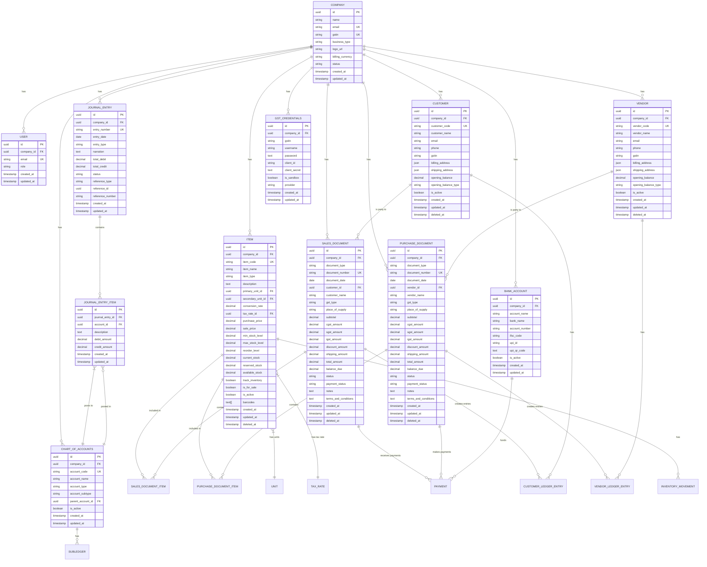

# Database Schema

<cite>
**Referenced Files in This Document**   
- [20241105_add_upi_fields_to_bank_accounts.sql](file://database/migrations/20241105_add_upi_fields_to_bank_accounts.sql)
- [add_barcodes_array_fixed.sql](file://migrations/add_barcodes_array_fixed.sql)
- [create_gst_credentials_table.sql](file://migrations/create_gst_credentials_table.sql)
- [update_gst_credentials_table.sql](file://migrations/update_gst_credentials_table.sql)
- [db.js](file://src/lib/db.js)
- [supabase.js](file://src/services/utils/supabase.js)
- [accountingService.js](file://src/services/accountingService.js)
- [itemService.js](file://src/services/itemService.js)
- [masterDataService.js](file://src/services/masterDataService.js)
- [companyService.js](file://src/services/companyService.js)
</cite>

## Table of Contents
1. [Introduction](#introduction)
2. [Core Entities](#core-entities)
3. [Entity Relationships](#entity-relationships)
4. [Data Validation and Business Rules](#data-validation-and-business-rules)
5. [Database Schema Diagram](#database-schema-diagram)
6. [Data Access Patterns](#data-access-patterns)
7. [Indexing Strategy](#indexing-strategy)
8. [Data Lifecycle and Retention](#data-lifecycle-and-retention)
9. [Security and Access Control](#security-and-access-control)
10. [Sample Data Scenarios](#sample-data-scenarios)

## Introduction
The ezbillify-v1 database schema is designed to support a comprehensive business accounting and inventory management system. The schema follows a company-scoped multi-tenancy model where all data is associated with a specific company through the company_id foreign key. This documentation provides a detailed overview of the key entities, their relationships, constraints, and business rules enforced at the database level.

The system is built on PostgreSQL with Supabase as the backend-as-a-service platform, leveraging Row Level Security (RLS) for access control. The schema supports core accounting functions including double-entry bookkeeping, inventory management, sales and purchase operations, and GST compliance.

**Section sources**
- [db.js](file://src/lib/db.js#L1-L307)
- [supabase.js](file://src/services/utils/supabase.js#L1-L392)

## Core Entities

### Users and Companies
The user and company entities form the foundation of the multi-tenant architecture. Each user belongs to a company, and all business data is scoped to the company level.

**Users Table**
- id (UUID, Primary Key): Unique identifier for the user
- company_id (UUID, Foreign Key): References the company the user belongs to
- email (VARCHAR): User's email address, used for authentication
- role (VARCHAR): User role (admin, workforce) determining permissions
- created_at (TIMESTAMP): Record creation timestamp
- updated_at (TIMESTAMP): Record update timestamp

**Companies Table**
- id (UUID, Primary Key): Unique identifier for the company
- name (VARCHAR): Legal name of the company
- email (VARCHAR): Company contact email
- gstin (VARCHAR): GST Identification Number (15 characters)
- business_type (VARCHAR): Type of business (e.g., proprietorship, partnership)
- logo_url (TEXT): URL to company logo
- billing_currency (VARCHAR): Default currency for transactions
- status (VARCHAR): Company status (active, suspended)
- created_at (TIMESTAMP): Record creation timestamp
- updated_at (TIMESTAMP): Record update timestamp

### Customers and Vendors
Customers and vendors are managed as separate entities to support different business relationships and transaction types.

**Customers Table**
- id (UUID, Primary Key): Unique identifier for the customer
- company_id (UUID, Foreign Key): References the owning company
- customer_code (VARCHAR): Unique code for the customer
- customer_name (VARCHAR): Name of the customer
- email (VARCHAR): Customer email address
- phone (VARCHAR): Customer phone number
- gstin (VARCHAR): Customer's GSTIN (if applicable)
- billing_address (JSON): Structured billing address
- shipping_address (JSON): Structured shipping address
- opening_balance (DECIMAL): Initial balance when customer was created
- opening_balance_type (VARCHAR): Type of opening balance (receivable, credit)
- is_active (BOOLEAN): Whether the customer is active
- created_at (TIMESTAMP): Record creation timestamp
- updated_at (TIMESTAMP): Record update timestamp
- deleted_at (TIMESTAMP): Soft delete timestamp

**Vendors Table**
- id (UUID, Primary Key): Unique identifier for the vendor
- company_id (UUID, Foreign Key): References the owning company
- vendor_code (VARCHAR): Unique code for the vendor
- vendor_name (VARCHAR): Name of the vendor
- email (VARCHAR): Vendor email address
- phone (VARCHAR): Vendor phone number
- gstin (VARCHAR): Vendor's GSTIN
- billing_address (JSON): Structured billing address
- opening_balance (DECIMAL): Initial balance when vendor was created
- opening_balance_type (VARCHAR): Type of opening balance (payable, advance)
- is_active (BOOLEAN): Whether the vendor is active
- created_at (TIMESTAMP): Record creation timestamp
- updated_at (TIMESTAMP): Record update timestamp
- deleted_at (TIMESTAMP): Soft delete timestamp

### Items and Inventory
The items entity supports both products and services with comprehensive inventory tracking capabilities.

**Items Table**
- id (UUID, Primary Key): Unique identifier for the item
- company_id (UUID, Foreign Key): References the owning company
- item_code (VARCHAR): Unique code for the item
- item_name (VARCHAR): Name of the item
- item_type (VARCHAR): Type of item (product, service)
- description (TEXT): Detailed description of the item
- primary_unit_id (UUID, Foreign Key): References the primary unit of measure
- secondary_unit_id (UUID, Foreign Key): References the secondary unit of measure (optional)
- conversion_rate (DECIMAL): Conversion rate between primary and secondary units
- tax_rate_id (UUID, Foreign Key): References the default tax rate
- purchase_price (DECIMAL): Cost price of the item
- sale_price (DECIMAL): Selling price of the item
- min_stock_level (DECIMAL): Minimum stock level before reorder
- max_stock_level (DECIMAL): Maximum stock level
- reorder_level (DECIMAL): Stock level at which to reorder
- current_stock (DECIMAL): Current stock quantity
- reserved_stock (DECIMAL): Stock reserved for pending orders
- available_stock (DECIMAL): Available stock (current - reserved)
- track_inventory (BOOLEAN): Whether to track inventory for this item
- is_for_sale (BOOLEAN): Whether the item is available for sale
- is_active (BOOLEAN): Whether the item is active
- barcodes (TEXT[]): Array of barcodes for the item
- created_at (TIMESTAMP): Record creation timestamp
- updated_at (TIMESTAMP): Record update timestamp
- deleted_at (TIMESTAMP): Soft delete timestamp

### Sales and Purchase Documents
Sales and purchase documents are unified under a common document structure to support various transaction types.

**Sales Documents Table**
- id (UUID, Primary Key): Unique identifier for the document
- company_id (UUID, Foreign Key): References the owning company
- document_type (VARCHAR): Type of document (invoice, quotation, sales_order, sales_return)
- document_number (VARCHAR): Unique document number
- document_date (DATE): Date of the document
- customer_id (UUID, Foreign Key): References the customer
- customer_name (VARCHAR): Customer name (denormalized for reporting)
- gst_type (VARCHAR): GST type (B2B, B2C, import, export)
- place_of_supply (VARCHAR): State code for place of supply
- subtotal (DECIMAL): Subtotal amount before tax
- cgst_amount (DECIMAL): CGST tax amount
- sgst_amount (DECIMAL): SGST tax amount
- igst_amount (DECIMAL): IGST tax amount
- discount_amount (DECIMAL): Discount amount
- shipping_amount (DECIMAL): Shipping charges
- total_amount (DECIMAL): Total document amount
- balance_due (DECIMAL): Remaining balance to be paid
- status (VARCHAR): Document status (draft, approved, sent, paid, cancelled)
- payment_status (VARCHAR): Payment status (unpaid, partially_paid, paid)
- notes (TEXT): Additional notes
- terms_and_conditions (TEXT): Document terms and conditions
- created_at (TIMESTAMP): Record creation timestamp
- updated_at (TIMESTAMP): Record update timestamp
- deleted_at (TIMESTAMP): Soft delete timestamp

**Purchase Documents Table**
- id (UUID, Primary Key): Unique identifier for the document
- company_id (UUID, Foreign Key): References the owning company
- document_type (VARCHAR): Type of document (bill, purchase_order, grn, purchase_return)
- document_number (VARCHAR): Unique document number
- document_date (DATE): Date of the document
- vendor_id (UUID, Foreign Key): References the vendor
- vendor_name (VARCHAR): Vendor name (denormalized for reporting)
- gst_type (VARCHAR): GST type (B2B, B2C, import, export)
- place_of_supply (VARCHAR): State code for place of supply
- subtotal (DECIMAL): Subtotal amount before tax
- cgst_amount (DECIMAL): CGST tax amount
- sgst_amount (DECIMAL): SGST tax amount
- igst_amount (DECIMAL): IGST tax amount
- discount_amount (DECIMAL): Discount amount
- shipping_amount (DECIMAL): Shipping charges
- total_amount (DECIMAL): Total document amount
- balance_due (DECIMAL): Remaining balance to be paid
- status (VARCHAR): Document status (draft, approved, sent, paid, cancelled)
- payment_status (VARCHAR): Payment status (unpaid, partially_paid, paid)
- notes (TEXT): Additional notes
- terms_and_conditions (TEXT): Document terms and conditions
- created_at (TIMESTAMP): Record creation timestamp
- updated_at (TIMESTAMP): Record update timestamp
- deleted_at (TIMESTAMP): Soft delete timestamp

### Journal Entries and Accounting
The accounting system follows double-entry bookkeeping principles with journal entries and ledger accounts.

**Journal Entries Table**
- id (UUID, Primary Key): Unique identifier for the journal entry
- company_id (UUID, Foreign Key): References the owning company
- entry_number (VARCHAR): Unique entry number
- entry_date (DATE): Date of the entry
- entry_type (VARCHAR): Type of entry (manual, sales, purchase, payment, adjustment)
- narration (TEXT): Description of the entry
- total_debit (DECIMAL): Total debit amount
- total_credit (DECIMAL): Total credit amount
- status (VARCHAR): Entry status (draft, posted, reversed)
- reference_type (VARCHAR): Type of reference document
- reference_id (UUID): ID of the reference document
- reference_number (VARCHAR): Number of the reference document
- created_at (TIMESTAMP): Record creation timestamp
- updated_at (TIMESTAMP): Record update timestamp

**Journal Entry Items Table**
- id (UUID, Primary Key): Unique identifier for the journal entry item
- journal_entry_id (UUID, Foreign Key): References the parent journal entry
- account_id (UUID, Foreign Key): References the ledger account
- description (TEXT): Description of the item
- debit_amount (DECIMAL): Debit amount
- credit_amount (DECIMAL): Credit amount
- created_at (TIMESTAMP): Record creation timestamp
- updated_at (TIMESTAMP): Record update timestamp

**Chart of Accounts Table**
- id (UUID, Primary Key): Unique identifier for the account
- company_id (UUID, Foreign Key): References the owning company
- account_code (VARCHAR): Unique account code
- account_name (VARCHAR): Name of the account
- account_type (VARCHAR): Type of account (asset, liability, equity, income, expense)
- account_subtype (VARCHAR): Subtype of account (current_asset, fixed_asset, etc.)
- parent_account_id (UUID, Foreign Key): References the parent account for hierarchy
- is_active (BOOLEAN): Whether the account is active
- created_at (TIMESTAMP): Record creation timestamp
- updated_at (TIMESTAMP): Record update timestamp

### Accounts and Banking
Bank accounts and payment methods are managed as part of the financial infrastructure.

**Bank Accounts Table**
- id (UUID, Primary Key): Unique identifier for the bank account
- company_id (UUID, Foreign Key): References the owning company
- account_name (VARCHAR): Name of the bank account
- bank_name (VARCHAR): Name of the bank
- account_number (VARCHAR): Bank account number
- ifsc_code (VARCHAR): IFSC code of the bank branch
- upi_id (VARCHAR): UPI ID for the account (e.g., username@bank)
- upi_qr_code (TEXT): Generated UPI QR code for the account
- is_active (BOOLEAN): Whether the account is active
- created_at (TIMESTAMP): Record creation timestamp
- updated_at (TIMESTAMP): Record update timestamp

**Section sources**
- [accountingService.js](file://src/services/accountingService.js#L1-L301)
- [itemService.js](file://src/services/itemService.js#L1-L43)
- [masterDataService.js](file://src/services/masterDataService.js#L1-L59)
- [companyService.js](file://src/services/companyService.js#L304-L339)

## Entity Relationships


**Diagram sources **
- [db.js](file://src/lib/db.js#L1-L307)
- [accountingService.js](file://src/services/accountingService.js#L1-L301)
- [itemService.js](file://src/services/itemService.js#L1-L43)

## Data Validation and Business Rules

### Primary and Foreign Keys
The database enforces referential integrity through primary and foreign key constraints:

- All tables have a UUID primary key named "id"
- Company-scoped entities have a foreign key "company_id" referencing the companies table with ON DELETE CASCADE
- Transactional entities reference related parties (customers/vendors) and items
- Journal entries maintain double-entry balance through application-level validation
- Hierarchical relationships (chart of accounts) prevent circular references

### Unique Constraints
The following unique constraints ensure data integrity:

- **Users**: Email must be unique across the system
- **Companies**: GSTIN must be unique across the system
- **Customers**: Customer code and GSTIN must be unique within a company
- **Vendors**: Vendor code and GSTIN must be unique within a company
- **Items**: Item code must be unique within a company; barcodes must be unique within a company
- **Chart of Accounts**: Account code must be unique within a company
- **GST Credentials**: One set of credentials per company (UNIQUE constraint on company_id)

### Data Validation Rules
The system enforces the following validation rules at the database and application levels:

**Customer and Vendor Validation**
- GSTIN must be exactly 15 characters and follow the GSTIN format
- Email addresses must be valid email format
- Phone numbers must be valid Indian phone numbers
- Opening balances must be non-negative
- Required fields (name, code) cannot be null

**Item Validation**
- Item code must be unique within the company
- Purchase and sale prices must be non-negative
- Stock levels (min, max, reorder) must be non-negative
- Conversion rate between units must be positive
- At least one barcode must be provided if barcode tracking is enabled

**Document Validation**
- Document numbers must be unique within the company
- Document dates must be valid dates
- Total amount must equal the sum of item amounts plus taxes minus discounts
- For sales documents, customer must exist and be active
- For purchase documents, vendor must exist and be active
- Document status transitions follow a specific workflow (draft → approved → sent → paid)

**Accounting Validation**
- Journal entries must be balanced (total debit = total credit)
- Account codes must follow a hierarchical numbering system
- Parent accounts cannot be leaf accounts
- Cannot delete accounts that have transactions
- Period closing prevents modification of entries in closed periods

**Section sources**
- [add_barcodes_array_fixed.sql](file://migrations/add_barcodes_array_fixed.sql#L48-L88)
- [create_gst_credentials_table.sql](file://migrations/create_gst_credentials_table.sql#L1-L26)
- [update_gst_credentials_table.sql](file://migrations/update_gst_credentials_table.sql#L1-L10)
- [20241105_add_upi_fields_to_bank_accounts.sql](file://database/migrations/20241105_add_upi_fields_to_bank_accounts.sql#L1-L28)

## Database Schema Diagram



**Diagram sources **
- [create_gst_credentials_table.sql](file://migrations/create_gst_credentials_table.sql#L1-L26)
- [add_barcodes_array_fixed.sql](file://migrations/add_barcodes_array_fixed.sql#L1-L111)
- [20241105_add_upi_fields_to_bank_accounts.sql](file://database/migrations/20241105_add_upi_fields_to_bank_accounts.sql#L1-L28)

## Data Access Patterns

### Query Performance Considerations
The database design incorporates several performance optimizations:

**Company-Scoped Queries**
Most queries are scoped to a specific company, which allows for efficient indexing and partitioning:
```sql
SELECT * FROM sales_documents WHERE company_id = 'uuid' AND document_date >= '2024-01-01'
```

**Date-Based Filtering**
Financial reports typically filter by date ranges, so date columns are indexed:
```sql
SELECT * FROM journal_entries WHERE company_id = 'uuid' AND entry_date BETWEEN '2024-01-01' AND '2024-12-31'
```

**Status-Based Filtering**
Documents are often queried by status, so status columns are indexed:
```sql
SELECT * FROM sales_documents WHERE company_id = 'uuid' AND status = 'approved'
```

**Text Search**
Customers and items are frequently searched by name, so full-text search capabilities are utilized:
```sql
SELECT * FROM customers WHERE company_id = 'uuid' AND customer_name ILIKE '%search_term%'
```

### Common Query Patterns
The system supports several common query patterns:

**Document Retrieval with Items**
Retrieve a sales document with all its items and related customer information:
```sql
SELECT 
  sd.*,
  sdi.*,
  c.customer_name,
  c.gstin
FROM sales_documents sd
LEFT JOIN sales_document_items sdi ON sd.id = sdi.document_id
LEFT JOIN customers c ON sd.customer_id = c.id
WHERE sd.id = 'document_uuid'
ORDER BY sdi.id
```

**Account Ledger**
Retrieve the ledger for a specific account with running balance:
```sql
SELECT 
  jei.*,
  je.entry_number,
  je.entry_date,
  je.narration,
  SUM(jei.debit_amount - jei.credit_amount) OVER (ORDER BY je.entry_date, je.id) as running_balance
FROM journal_entry_items jei
JOIN journal_entries je ON jei.journal_entry_id = je.id
WHERE jei.account_id = 'account_uuid'
  AND je.entry_date <= '2024-12-31'
ORDER BY je.entry_date, je.id
```

**Inventory Valuation**
Calculate the current value of inventory:
```sql
SELECT 
  i.item_name,
  i.current_stock,
  i.purchase_price,
  (i.current_stock * i.purchase_price) as total_value
FROM items i
WHERE i.company_id = 'company_uuid'
  AND i.track_inventory = true
  AND i.current_stock > 0
ORDER BY total_value DESC
```

**Aging Reports**
Generate accounts receivable aging report:
```sql
SELECT 
  c.customer_name,
  sd.document_number,
  sd.document_date,
  sd.balance_due,
  EXTRACT(DAY FROM NOW() - sd.document_date) as days_overdue
FROM sales_documents sd
JOIN customers c ON sd.customer_id = c.id
WHERE sd.company_id = 'company_uuid'
  AND sd.balance_due > 0
  AND sd.document_date < '2024-12-31'
ORDER BY days_overdue DESC
```

**Section sources**
- [db.js](file://src/lib/db.js#L136-L160)
- [accountingService.js](file://src/services/accountingService.js#L18-L46)
- [itemService.js](file://src/services/itemService.js#L1-L43)

## Indexing Strategy

### Primary Indexes
The database implements the following indexing strategy to optimize query performance:

**Primary Keys**
All tables have a primary key index on the "id" column (UUID):
```sql
CREATE INDEX IF NOT EXISTS idx_table_id ON table(id);
```

**Foreign Keys**
All foreign key columns are indexed to optimize JOIN operations:
- company_id on all company-scoped tables
- customer_id on sales_documents and related tables
- vendor_id on purchase_documents and related tables
- account_id on journal_entry_items
- item_id on document items and inventory movements

### Specialized Indexes
The system implements specialized indexes for common query patterns:

**Unique Indexes**
Enforce uniqueness constraints:
```sql
-- Customer code within company
CREATE UNIQUE INDEX IF NOT EXISTS idx_customers_company_code ON customers(company_id, customer_code) WHERE deleted_at IS NULL;

-- Vendor code within company
CREATE UNIQUE INDEX IF NOT EXISTS idx_vendors_company_code ON vendors(company_id, vendor_code) WHERE deleted_at IS NULL;

-- Item code within company
CREATE UNIQUE INDEX IF NOT EXISTS idx_items_company_code ON items(company_id, item_code) WHERE deleted_at IS NULL;

-- Document number within company
CREATE UNIQUE INDEX IF NOT EXISTS idx_sales_docs_company_number ON sales_documents(company_id, document_number) WHERE deleted_at IS NULL;
CREATE UNIQUE INDEX IF NOT EXISTS idx_purchase_docs_company_number ON purchase_documents(company_id, document_number) WHERE deleted_at IS NULL;

-- One GST credential per company
CREATE UNIQUE INDEX IF NOT EXISTS idx_gst_credentials_company_id ON gst_credentials(company_id);
```

**Functional Indexes**
Optimize specific query patterns:
```sql
-- Case-insensitive search on names
CREATE INDEX IF NOT EXISTS idx_customers_name_trgm ON customers USING GIN (customer_name gin_trgm_ops);
CREATE INDEX IF NOT EXISTS idx_vendors_name_trgm ON vendors USING GIN (vendor_name gin_trgm_ops);
CREATE INDEX IF NOT EXISTS idx_items_name_trgm ON items USING GIN (item_name gin_trgm_ops);

-- Date range queries
CREATE INDEX IF NOT EXISTS idx_sales_docs_date ON sales_documents(company_id, document_date);
CREATE INDEX IF NOT EXISTS idx_purchase_docs_date ON purchase_documents(company_id, document_date);
CREATE INDEX IF NOT EXISTS idx_journal_entries_date ON journal_entries(company_id, entry_date);

-- Status filtering
CREATE INDEX IF NOT EXISTS idx_sales_docs_status ON sales_documents(company_id, status);
CREATE INDEX IF NOT EXISTS idx_purchase_docs_status ON purchase_documents(company_id, status);
CREATE INDEX IF NOT EXISTS idx_journal_entries_status ON journal_entries(company_id, status);
```

**Array Indexes**
Support barcode searching:
```sql
-- GIN index for barcode array searches
CREATE INDEX IF NOT EXISTS idx_items_barcodes_gin ON items USING GIN (barcodes);
```

**Composite Indexes**
Optimize common query combinations:
```sql
-- Company and date for reporting
CREATE INDEX IF NOT EXISTS idx_sales_docs_company_date_status ON sales_documents(company_id, document_date, status);
CREATE INDEX IF NOT EXISTS idx_purchase_docs_company_date_status ON purchase_documents(company_id, document_date, status);

-- Customer/vendor with balance for aging reports
CREATE INDEX IF NOT EXISTS idx_sales_docs_customer_balance ON sales_documents(company_id, customer_id, balance_due) WHERE balance_due > 0;
CREATE INDEX IF NOT EXISTS idx_purchase_docs_vendor_balance ON purchase_documents(company_id, vendor_id, balance_due) WHERE balance_due > 0;
```

**Section sources**
- [add_barcodes_array_fixed.sql](file://migrations/add_barcodes_array_fixed.sql#L43)
- [create_gst_credentials_table.sql](file://migrations/create_gst_credentials_table.sql#L17)
- [20241105_add_upi_fields_to_bank_accounts.sql](file://database/migrations/20241105_add_upi_fields_to_bank_accounts.sql#L18-L19)

## Data Lifecycle and Retention

### Data Lifecycle
The system implements a comprehensive data lifecycle management strategy:

**Record Creation**
- All records are created with a created_at timestamp
- Company-scoped records inherit the company_id from the creating user
- Audit logs capture the user who created the record
- Initial status is set based on business rules (e.g., draft for documents)

**Record Updates**
- All records have an updated_at timestamp that is automatically updated
- Audit logs capture changes to important fields
- Some fields are immutable after creation (e.g., document_number)
- Status transitions follow predefined workflows

**Soft Deletion**
- Most entities support soft deletion through a deleted_at timestamp
- Deleted records are excluded from regular queries but can be restored
- Hard deletion is only allowed for records with no dependencies
- Deletion triggers cleanup of related records (e.g., document items)

**Data Archival**
- Records older than 7 years may be archived to cold storage
- Archived data is retained for compliance but not available in regular queries
- Archival process preserves referential integrity
- Archived data can be restored on request

### Retention Policies
The system follows these data retention policies:

**Financial Records**
- All financial transactions (sales, purchase, journal entries) are retained for 8 years to comply with tax regulations
- Supporting documents (invoices, bills) are retained with the same schedule
- Audit logs for financial records are retained for 8 years

**Customer and Vendor Data**
- Master data is retained as long as the business relationship exists
- Historical data is retained for 8 years after the relationship ends
- Personal data is anonymized after the retention period

**Inventory Data**
- Current inventory records are retained indefinitely
- Historical inventory movements are retained for 8 years
- Obsolete items are archived after 2 years of inactivity

**System Data**
- User accounts are retained for 2 years after deactivation
- Company data is retained for 1 year after account closure
- Logs and temporary data are retained for 90 days

## Security and Access Control

### Data Security
The system implements multiple layers of data security:

**Row Level Security (RLS)**
Supabase RLS policies ensure that users can only access data belonging to their company:
```sql
-- Enable RLS on all tables
ALTER TABLE table_name ENABLE ROW LEVEL SECURITY;

-- Policy to restrict access to company data
CREATE POLICY company_access_policy ON table_name
  USING (company_id = current_setting('app.current_company')::uuid);
```

**Field-Level Security**
Sensitive fields are protected:
- Passwords are encrypted at rest
- Financial amounts are validated for integrity
- Audit logs capture access to sensitive data
- API keys are stored encrypted

**Data Encryption**
- Connection encryption via SSL/TLS
- Field-level encryption for sensitive data
- Encrypted backups
- Secure key management

### Privacy Requirements
The system complies with data privacy regulations:

**Personal Data Protection**
- Customer and vendor personal data is minimized
- Data is only collected with consent
- Data access is logged and audited
- Data portability is supported

**GDPR Compliance**
- Right to access personal data
- Right to data portability
- Right to be forgotten (with financial record exceptions)
- Data breach notification procedures

**Access Control**
Role-based access control limits data access:
- Admin: Full access to company data
- Workforce: Limited access based on role
- Read-only: View-only access for reporting
- Department-specific: Access limited to department data

**Section sources**
- [supabase.js](file://src/services/utils/supabase.js#L1-L392)
- [db.js](file://src/lib/db.js#L229-L246)
- [permissions.js](file://src/lib/permissions.js#L1-L47)

## Sample Data Scenarios

### New Customer Onboarding
When a new customer is created, the system follows this process:

1. Validate customer data (code, GSTIN, email)
2. Create customer record with opening balance if applicable
3. Create initial ledger entry for opening balance
4. Update customer statistics in company dashboard
5. Log the creation in audit trail

Example data:
```json
{
  "customer_code": "CUST-001",
  "customer_name": "ABC Retailers",
  "email": "contact@abcretailers.com",
  "phone": "9876543210",
  "gstin": "27AABCCDDEEFFG",
  "billing_address": {
    "address_line1": "123 Main Street",
    "city": "Mumbai",
    "state": "MH",
    "pincode": "400001"
  },
  "opening_balance": 50000,
  "opening_balance_type": "receivable"
}
```

### Sales Invoice Creation
When a sales invoice is created, the system follows this process:

1. Validate items and quantities against inventory
2. Calculate taxes based on GST rules
3. Create sales document record
4. Create sales document items
5. Update inventory levels (decrease current stock)
6. Create customer ledger entry
7. Generate journal entries for accounting
8. Update customer balance

Example data:
```json
{
  "document_type": "invoice",
  "document_number": "INV-2024-001",
  "document_date": "2024-01-15",
  "customer_id": "customer_uuid",
  "items": [
    {
      "item_id": "item_uuid",
      "quantity": 10,
      "rate": 1000,
      "tax_rate": 18,
      "amount": 10000
    }
  ],
  "subtotal": 10000,
  "cgst_amount": 900,
  "sgst_amount": 900,
  "total_amount": 11800,
  "balance_due": 11800
}
```

### Month-End Closing
At the end of each month, the system performs closing operations:

1. Verify all transactions are recorded
2. Reconcile bank accounts
3. Post adjusting journal entries
4. Close revenue and expense accounts to retained earnings
5. Generate financial statements
6. Lock the period to prevent further modifications
7. Archive audit logs

Example journal entry for closing:
```json
{
  "entry_type": "closing",
  "narration": "Month-end closing for January 2024",
  "items": [
    {
      "account_id": "revenue_account_uuid",
      "debit_amount": 500000,
      "credit_amount": 0
    },
    {
      "account_id": "expense_account_uuid",
      "debit_amount": 0,
      "credit_amount": 300000
    },
    {
      "account_id": "retained_earnings_uuid",
      "debit_amount": 0,
      "credit_amount": 200000
    }
  ]
}
```

**Section sources**
- [accountingService.js](file://src/services/accountingService.js#L270-L298)
- [itemService.js](file://src/services/itemService.js#L181-L233)
- [companyService.js](file://src/services/companyService.js#L304-L339)