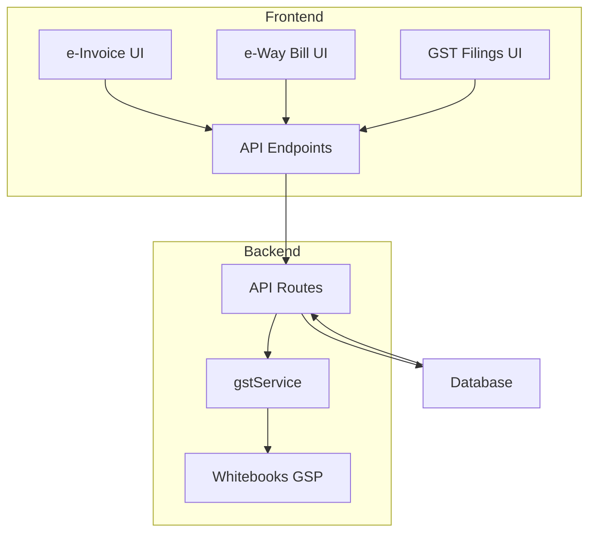
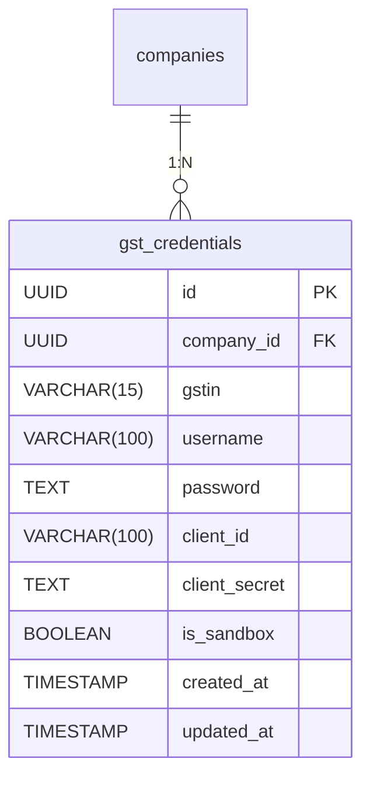
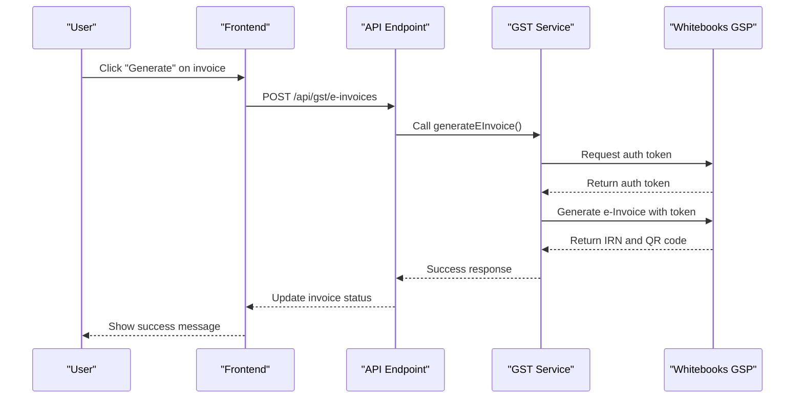
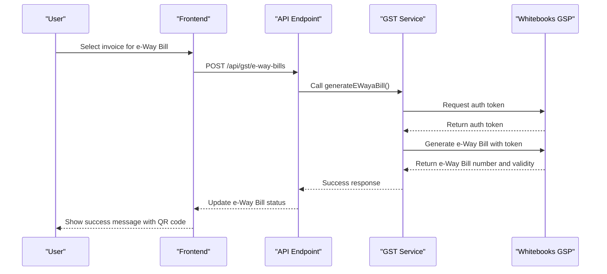
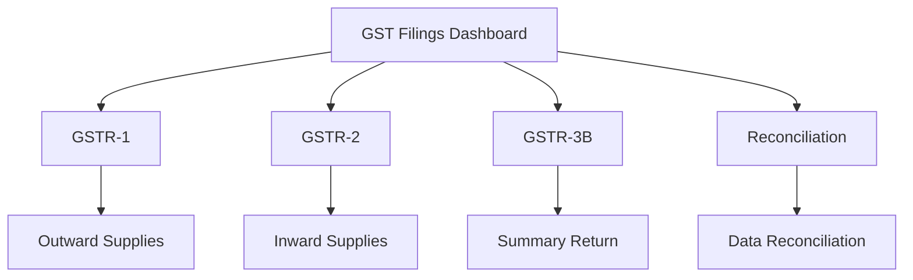
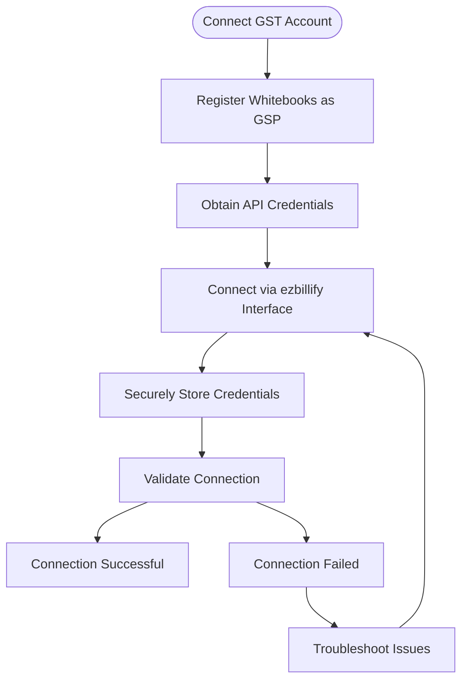

# GST Compliance

<cite>
**Referenced Files in This Document**   
- [gstService.js](file://src/services/gstService.js)
- [create_gst_credentials_table.sql](file://migrations/create_gst_credentials_table.sql)
- [update_gst_credentials_table.sql](file://migrations/update_gst_credentials_table.sql)
- [einvoice.js](file://src/pages/gst-integration/einvoice.js)
- [ewaybill.js](file://src/pages/gst-integration/ewaybill.js)
- [dashboard.js](file://src/pages/gst-integration/dashboard.js)
- [GSTLoginModal.js](file://src/components/gst/GSTLoginModal.js)
- [WhitebooksConnectModal.js](file://src/components/gst/WhitebooksConnectModal.js)
- [gstr1.js](file://src/pages/gst-filings/gstr1.js)
- [gstr2.js](file://src/pages/gst-filings/gstr2.js)
- [gstr3b.js](file://src/pages/gst-filings/gstr3b.js)
- [reconciliation.js](file://src/pages/gst-filings/reconciliation.js)
- [credentials.js](file://src/pages/api/gst/credentials.js)
- [e-invoices/index.js](file://src/pages/api/gst/e-invoices/index.js)
- [e-way-bills/index.js](file://src/pages/api/gst/e-way-bills/index.js)
</cite>

## Table of Contents
1. [Introduction](#introduction)
2. [GST Integration Architecture](#gst-integration-architecture)
3. [Data Model](#data-model)
4. [e-Invoicing Implementation](#e-invoicing-implementation)
5. [e-Way Bill Implementation](#e-way-bill-implementation)
6. [GST Filings System](#gst-filings-system)
7. [GSP Integration with Whitebooks](#gsp-integration-with-whitebooks)
8. [Common Issues and Troubleshooting](#common-issues-and-troubleshooting)
9. [Performance Optimization](#performance-optimization)
10. [Conclusion](#conclusion)

## Introduction

The GST compliance system in ezbillify-v1 provides comprehensive functionality for Indian businesses to meet their Goods and Services Tax requirements. The system implements e-Invoicing, e-Way Bills, and GST filings (GSTR-1, GSTR-2, GSTR-3B) through integration with GST Suvidha Providers (GSP) like Whitebooks. This documentation details the implementation of these features, including the data model, API integrations, and practical usage patterns.

The system is designed to streamline GST compliance by automating the generation of e-Invoices and e-Way Bills, while providing interfaces for GST return preparation and reconciliation. The integration with Whitebooks as a GSP enables secure communication with the GST portal for all compliance-related transactions.

**Section sources**
- [dashboard.js](file://src/pages/gst-integration/dashboard.js#L1-L261)
- [gstService.js](file://src/services/gstService.js#L1-L174)

## GST Integration Architecture

The GST compliance system follows a modular architecture with clear separation of concerns between frontend components, API endpoints, and service layers. The architecture consists of three main layers:

1. **Presentation Layer**: React components that provide user interfaces for managing GST compliance activities
2. **API Layer**: Next.js API routes that handle HTTP requests and responses
3. **Service Layer**: Business logic encapsulated in service classes that interact with external systems

The system uses a centralized GST service (gstService.js) that handles all interactions with the Whitebooks GSP. This service manages authentication, API calls, and response processing for e-Invoice and e-Way Bill generation. The frontend components communicate with API endpoints, which in turn use the GST service to perform operations.

**Diagram sources **
- [gstService.js](file://src/services/gstService.js#L1-L174)
- [dashboard.js](file://src/pages/gst-integration/dashboard.js#L1-L261)

**Section sources**
- [gstService.js](file://src/services/gstService.js#L1-L174)
- [dashboard.js](file://src/pages/gst-integration/dashboard.js#L1-L261)

## Data Model

The GST compliance system uses a relational data model to store credentials and track compliance activities. The core entity is the `gst_credentials` table, which stores authentication information for connecting to the Whitebooks GSP.

The `gst_credentials` table contains the following fields:
- **id**: Primary key (UUID)
- **company_id**: Foreign key referencing the company
- **gstin**: GST Identification Number (15 characters)
- **username**: Whitebooks/GST portal username
- **password**: Whitebooks/GST portal password (encrypted in production)
- **client_id**: Whitebooks API client ID
- **client_secret**: Whitebooks API client secret (encrypted in production)
- **is_sandbox**: Boolean indicating sandbox vs production environment
- **created_at**: Timestamp of record creation
- **updated_at**: Timestamp of last update

The table includes a unique constraint on `company_id` to ensure each company has only one set of GST credentials. Indexes are created on `company_id` for faster lookups during authentication and API operations.

**Diagram sources **
- [create_gst_credentials_table.sql](file://migrations/create_gst_credentials_table.sql#L1-L26)
- [update_gst_credentials_table.sql](file://migrations/update_gst_credentials_table.sql#L1-L10)

**Section sources**
- [create_gst_credentials_table.sql](file://migrations/create_gst_credentials_table.sql#L1-L26)
- [update_gst_credentials_table.sql](file://migrations/update_gst_credentials_table.sql#L1-L10)

## e-Invoicing Implementation

The e-Invoicing system in ezbillify-v1 enables businesses to generate Invoice Registration Numbers (IRN) and QR codes for B2B invoices as required by the GST network. The implementation follows the standard e-Invoicing workflow with proper authentication and error handling.

The process begins with the user connecting their GST account through the GST integration dashboard. Once connected, users can access the e-Invoice management interface where they can view pending invoices and generate e-Invoices. The system fetches invoices from the database that are eligible for e-Invoicing (typically B2B transactions above the threshold amount).

When generating an e-Invoice, the system follows this sequence:
1. Validate that GST credentials exist for the company
2. Generate an authentication token using client credentials
3. Format the invoice data according to the Whitebooks API specification
4. Send the request to the Whitebooks e-Invoice generation endpoint
5. Process the response and update the invoice status

**Diagram sources **
- [gstService.js](file://src/services/gstService.js#L89-L128)
- [einvoice.js](file://src/pages/gst-integration/einvoice.js#L86-L124)
- [e-invoices/index.js](file://src/pages/api/gst/e-invoices/index.js#L52-L97)

**Section sources**
- [gstService.js](file://src/services/gstService.js#L89-L128)
- [einvoice.js](file://src/pages/gst-integration/einvoice.js#L86-L124)
- [e-invoices/index.js](file://src/pages/api/gst/e-invoices/index.js#L52-L97)

## e-Way Bill Implementation

The e-Way Bill system in ezbillify-v1 facilitates the generation of electronic waybills for the transportation of goods as mandated by GST regulations. The implementation follows a similar pattern to e-Invoicing but with specific data requirements for transportation details.

The e-Way Bill generation process requires additional information beyond the invoice data, including:
- Supply type (outward/inward)
- Sub-supply type
- Document type (invoice, bill of supply, etc.)
- Document number and date
- Transporter details
- Vehicle information
- Distance of transportation

The system provides a dedicated interface for managing e-Way Bills, showing statistics for total bills, pending, generated, and errored bills. Users can search and filter e-Way Bills by status and generate new bills from eligible invoices.

**Diagram sources **
- [gstService.js](file://src/services/gstService.js#L131-L170)
- [ewaybill.js](file://src/pages/gst-integration/ewaybill.js#L86-L137)
- [e-way-bills/index.js](file://src/pages/api/gst/e-way-bills/index.js#L52-L97)

**Section sources**
- [gstService.js](file://src/services/gstService.js#L131-L170)
- [ewaybill.js](file://src/pages/gst-integration/ewaybill.js#L86-L137)
- [e-way-bills/index.js](file://src/pages/api/gst/e-way-bills/index.js#L52-L97)

## GST Filings System

The GST filings system in ezbillify-v1 provides interfaces for preparing and filing various GST returns, including GSTR-1, GSTR-2, and GSTR-3B. While the implementation is currently in placeholder status, the architecture is designed to support comprehensive GST return functionality.

The system includes dedicated pages for each type of GST return:
- **GSTR-1**: Details of outward supplies of goods or services
- **GSTR-2**: Details of inward supplies of goods or services  
- **GSTR-3B**: Monthly summary return

The filings dashboard provides a centralized interface for managing all GST returns, showing the status of each return (filed, pending, etc.) and providing quick access to the filing interfaces. The system is designed to automatically populate return data from transaction records, reducing manual data entry.

**Diagram sources **
- [gstr1.js](file://src/pages/gst-filings/gstr1.js#L1-L66)
- [gstr2.js](file://src/pages/gst-filings/gstr2.js#L1-L66)
- [gstr3b.js](file://src/pages/gst-filings/gstr3b.js#L1-L66)
- [reconciliation.js](file://src/pages/gst-filings/reconciliation.js#L1-L66)
- [index.js](file://src/pages/gst-filings/index.js#L1-L42)

**Section sources**
- [gstr1.js](file://src/pages/gst-filings/gstr1.js#L1-L66)
- [gstr2.js](file://src/pages/gst-filings/gstr2.js#L1-L66)
- [gstr3b.js](file://src/pages/gst-filings/gstr3b.js#L1-L66)
- [reconciliation.js](file://src/pages/gst-filings/reconciliation.js#L1-L66)

## GSP Integration with Whitebooks

The integration with Whitebooks as a GST Suvidha Provider (GSP) is a critical component of the GST compliance system. This integration enables ezbillify-v1 to securely communicate with the GST portal for e-Invoice and e-Way Bill generation.

The integration process involves several steps:
1. Registering Whitebooks as a GSP on the GST portal
2. Obtaining API credentials from Whitebooks
3. Connecting the GST account through the ezbillify-v1 interface
4. Storing credentials securely in the database

The system supports both sandbox and production environments, allowing businesses to test the integration before going live. The connection status is prominently displayed in the GST integration dashboard, along with server configuration details.

**Diagram sources **
- [WhitebooksConnectModal.js](file://src/components/gst/WhitebooksConnectModal.js#L1-L317)
- [GSTLoginModal.js](file://src/components/gst/GSTLoginModal.js#L162-L183)
- [dashboard.js](file://src/pages/gst-integration/dashboard.js#L1-L261)

**Section sources**
- [WhitebooksConnectModal.js](file://src/components/gst/WhitebooksConnectModal.js#L1-L317)
- [GSTLoginModal.js](file://src/components/gst/GSTLoginModal.js#L162-L183)
- [dashboard.js](file://src/pages/gst-integration/dashboard.js#L1-L261)

## Common Issues and Troubleshooting

The GST compliance system may encounter various issues during operation. Understanding these common problems and their solutions is essential for maintaining smooth compliance operations.

### IRN Generation Failures
IRN generation may fail due to:
- Invalid or expired GST credentials
- Network connectivity issues with the GSP
- Invalid invoice data format
- Duplicate invoice submission

**Solutions**:
- Verify GST credentials are correct and up-to-date
- Check internet connectivity and GSP server status
- Validate invoice data against schema requirements
- Implement duplicate detection before submission

### e-Way Bill Validity Errors
e-Way Bill validity issues typically occur when:
- The transportation distance exceeds the validity period
- Vehicle details are incorrect or missing
- The e-Way Bill is not carried during transportation

**Solutions**:
- Calculate validity based on distance (1 day for up to 100km, additional days for longer distances)
- Ensure all vehicle information is accurate
- Generate QR code for easy verification during transit

### Return Filing Mismatches
Discrepancies between filed returns and actual transactions may arise from:
- Timing differences in data synchronization
- Manual adjustments not reflected in automated systems
- Classification errors in tax rates or HSN codes

**Solutions**:
- Implement regular reconciliation processes
- Use automated data validation checks
- Maintain audit trails for all adjustments

**Section sources**
- [gstService.js](file://src/services/gstService.js#L1-L174)
- [einvoice.js](file://src/pages/gst-integration/einvoice.js#L86-L124)
- [ewaybill.js](file://src/pages/gst-integration/ewaybill.js#L86-L137)

## Performance Optimization

To ensure optimal performance during peak filing periods, several optimization strategies should be implemented:

### API Request Optimization
- Implement request batching for multiple e-Invoice or e-Way Bill generation
- Use connection pooling for database operations
- Cache authentication tokens to avoid repeated token generation
- Implement exponential backoff for retrying failed requests

### Database Optimization
- Create appropriate indexes on frequently queried fields
- Implement database query optimization for large datasets
- Use pagination for retrieving large lists of invoices or returns
- Schedule resource-intensive operations during off-peak hours

### System Architecture Optimization
- Implement asynchronous processing for e-Invoice and e-Way Bill generation
- Use message queues to handle high volumes of compliance requests
- Implement rate limiting to prevent overwhelming the GSP APIs
- Monitor system performance and scale resources as needed

These optimizations ensure the system can handle high transaction volumes during month-end and quarter-end filing periods without performance degradation.

**Section sources**
- [gstService.js](file://src/services/gstService.js#L1-L174)
- [einvoice.js](file://src/pages/gst-integration/einvoice.js#L1-L366)
- [ewaybill.js](file://src/pages/gst-integration/ewaybill.js#L1-L368)

## Conclusion

The GST compliance system in ezbillify-v1 provides a comprehensive solution for Indian businesses to meet their GST requirements. The system effectively implements e-Invoicing, e-Way Bills, and GST filings through integration with the Whitebooks GSP. The modular architecture separates concerns between presentation, API, and service layers, ensuring maintainability and scalability.

Key strengths of the system include:
- Secure storage of GST credentials with encryption
- User-friendly interfaces for managing compliance activities
- Comprehensive error handling and troubleshooting guidance
- Support for both sandbox and production environments

While the GST filings functionality is currently in placeholder status, the foundation is in place for implementing full return preparation and filing capabilities. With proper performance optimization, the system can handle high transaction volumes during peak periods, making it a reliable solution for businesses of all sizes.

The integration with Whitebooks as a GSP ensures compliance with GST network requirements while providing a seamless user experience for generating e-Invoices and e-Way Bills. As GST regulations evolve, the system can be extended to support new compliance requirements.