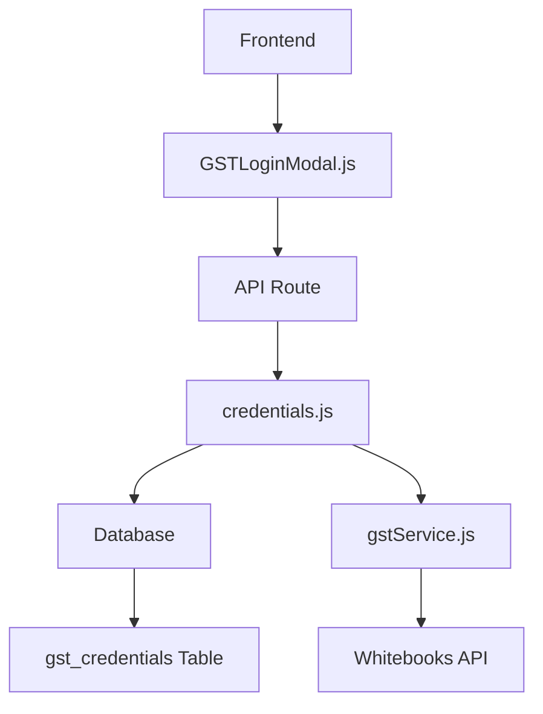
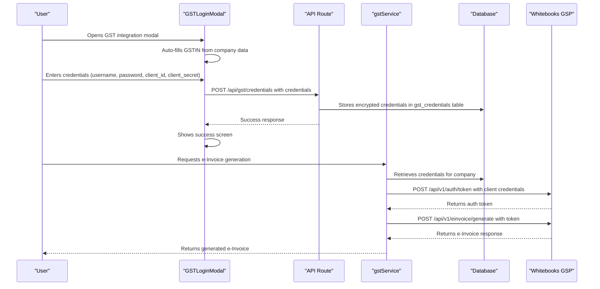
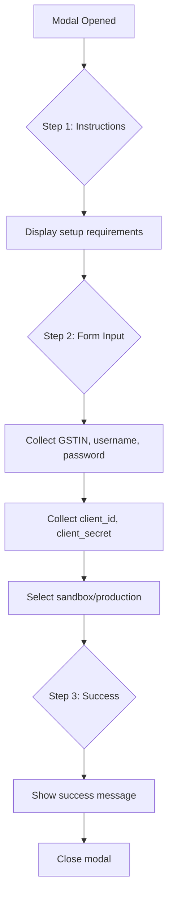
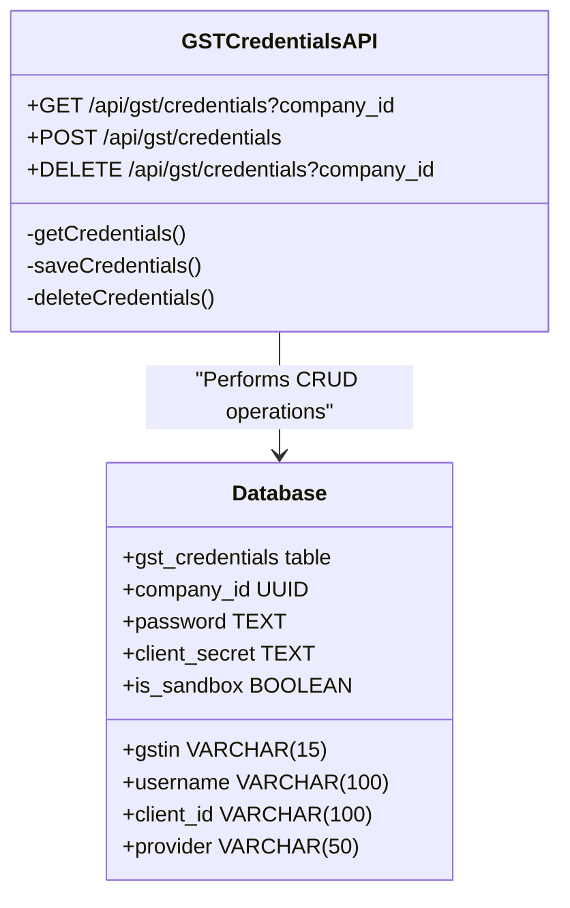
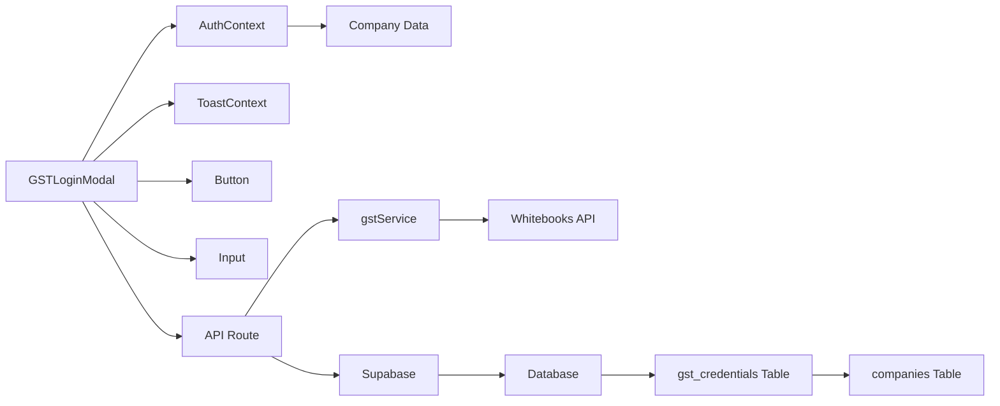

# GST Credential Management

<cite>
**Referenced Files in This Document**   
- [GSTLoginModal.js](file://src/components/gst/GSTLoginModal.js)
- [gstService.js](file://src/services/gstService.js)
- [credentials.js](file://src/pages/api/gst/credentials.js)
- [create_gst_credentials_table.sql](file://migrations/create_gst_credentials_table.sql)
- [update_gst_credentials_table.sql](file://migrations/update_gst_credentials_table.sql)
</cite>

## Table of Contents
1. [Introduction](#introduction)
2. [Project Structure](#project-structure)
3. [Core Components](#core-components)
4. [Architecture Overview](#architecture-overview)
5. [Detailed Component Analysis](#detailed-component-analysis)
6. [Dependency Analysis](#dependency-analysis)
7. [Performance Considerations](#performance-considerations)
8. [Troubleshooting Guide](#troubleshooting-guide)
9. [Conclusion](#conclusion)

## Introduction
The GST Credential Management sub-feature enables secure integration between the GST compliance system and GST Suvidha Providers (GSPs) like Whitebooks. This documentation details the implementation of securely storing and managing GST credentials for e-Invoice and e-Way Bill generation. The system provides a complete workflow from credential input through the GSTLoginModal to secure storage in the database and usage in API authentication. The implementation supports both production and sandbox environments, handles multi-company credential management, and follows security best practices for handling sensitive GST credentials.

## Project Structure
The GST Credential Management feature is organized across multiple directories in the codebase:
- **components/gst/**: Contains the GSTLoginModal component for credential input
- **services/**: Houses the gstService.js business logic for token generation and API interactions
- **pages/api/gst/**: Contains the credentials.js API route for CRUD operations
- **migrations/**: Includes database schema definitions for the gst_credentials table



**Diagram sources**
- [GSTLoginModal.js](file://src/components/gst/GSTLoginModal.js)
- [credentials.js](file://src/pages/api/gst/credentials.js)
- [gstService.js](file://src/services/gstService.js)
- [create_gst_credentials_table.sql](file://migrations/create_gst_credentials_table.sql)

**Section sources**
- [GSTLoginModal.js](file://src/components/gst/GSTLoginModal.js)
- [credentials.js](file://src/pages/api/gst/credentials.js)
- [gstService.js](file://src/services/gstService.js)
- [create_gst_credentials_table.sql](file://migrations/create_gst_credentials_table.sql)

## Core Components
The GST Credential Management system consists of three core components that work together to securely handle GST credentials:
1. **GSTLoginModal**: A React component that provides a user interface for entering GST credentials with a three-step process (instructions, form input, success confirmation).
2. **API Route (credentials.js)**: Handles CRUD operations for GST credentials with proper authentication and authorization.
3. **gstService.js**: Business logic layer that manages token generation and API interactions with GSPs.

The system is designed to securely store sensitive information like client_secret and password while supporting both sandbox and production environments through the is_sandbox flag.

**Section sources**
- [GSTLoginModal.js](file://src/components/gst/GSTLoginModal.js)
- [credentials.js](file://src/pages/api/gst/credentials.js)
- [gstService.js](file://src/services/gstService.js)

## Architecture Overview
The GST Credential Management system follows a layered architecture with clear separation of concerns between the frontend, API layer, business logic, and data storage.



**Diagram sources**
- [GSTLoginModal.js](file://src/components/gst/GSTLoginModal.js)
- [credentials.js](file://src/pages/api/gst/credentials.js)
- [gstService.js](file://src/services/gstService.js)
- [create_gst_credentials_table.sql](file://migrations/create_gst_credentials_table.sql)

## Detailed Component Analysis

### Frontend Component Analysis
The GSTLoginModal component provides a user-friendly interface for setting up GST integration with a three-step process that guides users through the setup.



**Diagram sources**
- [GSTLoginModal.js](file://src/components/gst/GSTLoginModal.js)

**Section sources**
- [GSTLoginModal.js](file://src/components/gst/GSTLoginModal.js)

### API Layer Analysis
The API route at /api/gst/credentials handles all CRUD operations for GST credentials with proper error handling and security measures.



**Diagram sources**
- [credentials.js](file://src/pages/api/gst/credentials.js)
- [create_gst_credentials_table.sql](file://migrations/create_gst_credentials_table.sql)

**Section sources**
- [credentials.js](file://src/pages/api/gst/credentials.js)
- [create_gst_credentials_table.sql](file://migrations/create_gst_credentials_table.sql)

### Business Logic Analysis
The gstService.js component handles the business logic for token generation and API authentication with GSPs.

```mermaid
flowchart TD
A[generateAuthToken] --> B{Provider Type}
B --> C[WhiteBooks]
C --> D[POST /api/v1/auth/token]
D --> E[client_id + client_secret]
E --> F[Return access_token]
F --> G[Use in API headers]
G --> H[Bearer {access_token}]
I[Server URL Selection] --> J{is_sandbox?}
J --> |Yes| K[https://sandbox.whitebooks.in]
J --> |No| L[https://api.whitebooks.in]
```

**Diagram sources**
- [gstService.js](file://src/services/gstService.js)

**Section sources**
- [gstService.js](file://src/services/gstService.js)

## Dependency Analysis
The GST Credential Management system has the following dependencies:



**Diagram sources**
- [GSTLoginModal.js](file://src/components/gst/GSTLoginModal.js)
- [credentials.js](file://src/pages/api/gst/credentials.js)
- [gstService.js](file://src/services/gstService.js)
- [create_gst_credentials_table.sql](file://migrations/create_gst_credentials_table.sql)

**Section sources**
- [GSTLoginModal.js](file://src/components/gst/GSTLoginModal.js)
- [credentials.js](file://src/pages/api/gst/credentials.js)
- [gstService.js](file://src/services/gstService.js)

## Performance Considerations
The GST Credential Management system is designed with performance in mind:
- Credentials are cached at the service level to minimize database queries
- Token generation is optimized to avoid unnecessary API calls
- The database has appropriate indexes on the company_id field for fast lookups
- API responses are streamlined to include only necessary data

The system handles credential retrieval efficiently by using the Supabase single() method to fetch exactly one record, and implements proper error handling for cases where credentials don't exist.

## Troubleshooting Guide
Common issues and their solutions for the GST Credential Management system:

1. **Credential validation errors**: Ensure all required fields (GSTIN, username, password, client_id, client_secret) are provided during setup.

2. **Authentication failures with GSP**: Verify that the credentials are correct and that the account is active with the GSP provider.

3. **Sandbox vs Production issues**: Confirm that the is_sandbox flag matches the environment you're trying to connect to.

4. **Multi-company credential conflicts**: Each company has a UNIQUE constraint on company_id in the gst_credentials table, preventing duplicate entries.

5. **Token expiration**: The system automatically handles token generation before each API call, so expired tokens are refreshed transparently.

6. **Database connection issues**: Ensure the Supabase configuration is correct and that the service role key has appropriate permissions.

**Section sources**
- [credentials.js](file://src/pages/api/gst/credentials.js)
- [gstService.js](file://src/services/gstService.js)
- [create_gst_credentials_table.sql](file://migrations/create_gst_credentials_table.sql)

## Conclusion
The GST Credential Management system provides a secure and user-friendly way to integrate with GST Suvidha Providers like Whitebooks. The implementation follows security best practices by encrypting sensitive fields like password and client_secret in the database, and only returning non-sensitive data to the client. The system supports both sandbox and production environments, making it easy to test integrations before going live. With proper error handling and a clear separation of concerns between frontend, API, and business logic layers, the system is robust and maintainable. The architecture allows for easy extension to support additional GSP providers in the future by implementing provider-specific authentication methods in the gstService.