# GST Filings

<cite>
**Referenced Files in This Document**   
- [index.js](file://src/pages/gst-filings/index.js)
- [gstr1.js](file://src/pages/gst-filings/gstr1.js)
- [gstr2.js](file://src/pages/gst-filings/gstr2.js)
- [gstr3b.js](file://src/pages/gst-filings/gstr3b.js)
- [reconciliation.js](file://src/pages/gst-filings/reconciliation.js)
- [gstService.js](file://src/services/gstService.js)
- [GSTLoginModal.js](file://src/components/gst/GSTLoginModal.js)
- [create_gst_credentials_table.sql](file://migrations/create_gst_credentials_table.sql)
- [update_gst_credentials_table.sql](file://migrations/update_gst_credentials_table.sql)
- [credentials.js](file://src/pages/api/gst/credentials.js)
- [gstr1/generate.js](file://src/pages/api/gst/gstr1/generate.js)
- [gstr1/file.js](file://src/pages/api/gst/gst1/file.js)
- [gstr2/import.js](file://src/pages/api/gst/gstr2/import.js)
- [gstr3b/generate.js](file://src/pages/api/gst/gstr3b/generate.js)
- [gstr3b/file.js](file://src/pages/api/gst/gstr3b/file.js)
- [reconciliation.js](file://src/pages/api/gst/reconciliation.js)
</cite>

## Table of Contents
1. [Introduction](#introduction)
2. [Project Structure](#project-structure)
3. [Core Components](#core-components)
4. [Architecture Overview](#architecture-overview)
5. [Detailed Component Analysis](#detailed-component-analysis)
6. [Dependency Analysis](#dependency-analysis)
7. [Performance Considerations](#performance-considerations)
8. [Troubleshooting Guide](#troubleshooting-guide)
9. [Conclusion](#conclusion)

## Introduction
The GST Filings sub-feature of the GST compliance system enables businesses to prepare and file various GST returns including GSTR-1, GSTR-2, and GSTR-3B. The system integrates with external GST service providers like Whitebooks to facilitate e-Invoice and e-Way Bill generation. While the frontend interface for GST filings has been implemented, the core filing functionality is currently under development. The system is designed to aggregate data from sales, purchase, and accounting modules to generate accurate return data, with provisions for reconciliation between internal records and GST portal data.

## Project Structure
The GST Filings feature is organized under the `src/pages/gst-filings/` directory with separate files for each return type (GSTR-1, GSTR-2, GSTR-3B) and reconciliation. The backend API endpoints for GST filings are located in `src/pages/api/gst/` with subdirectories for each return type. The GST service logic is centralized in `src/services/gstService.js`, while the database schema for GST credentials is defined in migration files.

**Diagram sources**
- [index.js](file://src/pages/gst-filings/index.js)
- [gstService.js](file://src/services/gstService.js)
- [create_gst_credentials_table.sql](file://migrations/create_gst_credentials_table.sql)

**Section sources**
- [index.js](file://src/pages/gst-filings/index.js)
- [create_gst_credentials_table.sql](file://migrations/create_gst_credentials_table.sql)

## Core Components
The core components of the GST Filings system include the filing dashboard, return-specific pages (GSTR-1, GSTR-2, GSTR-3B), reconciliation module, and integration with external GST service providers. The system uses a placeholder pattern for pages that are under development, providing a consistent user experience while functionality is being implemented. The GST service handles authentication with external providers and generation of e-Invoices and e-Way Bills.

**Section sources**
- [index.js](file://src/pages/gst-filings/index.js)
- [gstr1.js](file://src/pages/gst-filings/gstr1.js)
- [gstr2.js](file://src/pages/gst-filings/gstr2.js)
- [gstr3b.js](file://src/pages/gst-filings/gstr3b.js)
- [reconciliation.js](file://src/pages/gst-filings/reconciliation.js)

## Architecture Overview
The GST Filings architecture follows a client-server model with React frontend components communicating with Next.js API endpoints. The GST service acts as a middleware layer between the application and external GST service providers like Whitebooks. The system stores GST credentials securely in the database and uses them to authenticate with external APIs for e-Invoice and e-Way Bill generation. The architecture is designed to support multiple GST return types with a consistent pattern for data aggregation, validation, and submission.

**Diagram sources**
- [gstService.js](file://src/services/gstService.js)
- [credentials.js](file://src/pages/api/gst/credentials.js)
- [create_gst_credentials_table.sql](file://migrations/create_gst_credentials_table.sql)

## Detailed Component Analysis

### GST Filings Dashboard Analysis
The GST Filings dashboard provides a centralized interface for accessing different GST return types and integration settings. It uses a tabbed interface to separate filings from integration options, with visual cards for each return type (GSTR-1, GSTR-2, GSTR-3B) and reconciliation. The dashboard is implemented as a React component with state management for the active tab and navigation to specific filing pages.

**Diagram sources**
- [index.js](file://src/pages/gst-filings/index.js)

**Section sources**
- [index.js](file://src/pages/gst-filings/index.js)

### GST Service Analysis
The GST Service provides a unified interface for interacting with external GST service providers. It handles authentication, credential management, and API communication for e-Invoice and e-Way Bill generation. The service supports both production and sandbox environments and includes error handling and logging for troubleshooting.

**Diagram sources**
- [gstService.js](file://src/services/gstService.js)

**Section sources**
- [gstService.js](file://src/services/gstService.js)

### GST Credentials Management Analysis
The GST credentials management system allows users to securely store their GST portal credentials for integration with external services. The system includes a modal interface for collecting credentials and API endpoints for storing and retrieving them. The database schema includes fields for GSTIN, username, password, client ID, client secret, provider, and sandbox mode.

```mermaid
erDiagram
GST_CREDENTIALS {
uuid id PK
uuid company_id FK
string gstin
string username
string password
string client_id
string client_secret
string provider
boolean is_sandbox
timestamp created_at
timestamp updated_at
}
COMPANIES {
uuid id PK
string name
string gstin
}
GST_CREDENTIALS ||--|| COMPANIES : "company_id → id"
```

**Diagram sources**
- [create_gst_credentials_table.sql](file://migrations/create_gst_credentials_table.sql)
- [GSTLoginModal.js](file://src/components/gst/GSTLoginModal.js)

**Section sources**
- [create_gst_credentials_table.sql](file://migrations/create_gst_credentials_table.sql)
- [GSTLoginModal.js](file://src/components/gst/GSTLoginModal.js)

## Dependency Analysis
The GST Filings system has dependencies on several external and internal components. It relies on the Whitebooks API for e-Invoice and e-Way Bill generation, Supabase for database operations, and Next.js for server-side rendering and API routes. Internally, it depends on the sales, purchase, and accounting modules for data aggregation, and the authentication system for user and company context.

**Diagram sources**
- [gstService.js](file://src/services/gstService.js)
- [index.js](file://src/pages/gst-filings/index.js)
- [GSTLoginModal.js](file://src/components/gst/GSTLoginModal.js)

**Section sources**
- [gstService.js](file://src/services/gstService.js)
- [index.js](file://src/pages/gst-filings/index.js)

## Performance Considerations
The GST Filings system is designed with performance considerations in mind, particularly for data aggregation from multiple modules. The placeholder implementation currently used for filing pages ensures fast loading times, while the actual filing functionality will need to handle large datasets efficiently. The system should implement caching for frequently accessed data like GST credentials and implement pagination for large return filings. API calls to external services should be optimized with proper error handling and retry mechanisms.

## Troubleshooting Guide
Common issues with the GST Filings system include credential validation errors, API connectivity issues with external providers, and data mismatches between internal records and GST returns. For credential issues, verify that all fields are correctly entered and that the account is active with the GSP provider. For API connectivity issues, check network connectivity and verify that the production/sandbox mode matches the credentials. For data mismatches, use the reconciliation tool to identify and resolve discrepancies between internal records and GST portal data.

**Section sources**
- [gstService.js](file://src/services/gstService.js)
- [GSTLoginModal.js](file://src/components/gst/GSTLoginModal.js)

## Conclusion
The GST Filings system provides a comprehensive framework for managing GST compliance, with a well-structured architecture and clear separation of concerns. While the core filing functionality is currently under development, the foundation is in place for implementing GSTR-1, GSTR-2, and GSTR-3B filing capabilities. The system's integration with external GST service providers like Whitebooks enables e-Invoice and e-Way Bill generation, and the reconciliation module helps ensure data accuracy. Future development should focus on implementing the backend filing logic and enhancing the data aggregation process from sales, purchase, and accounting modules.