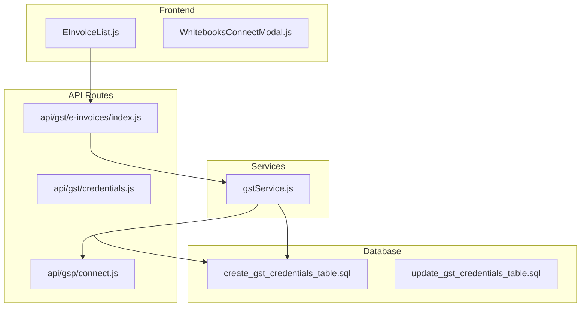
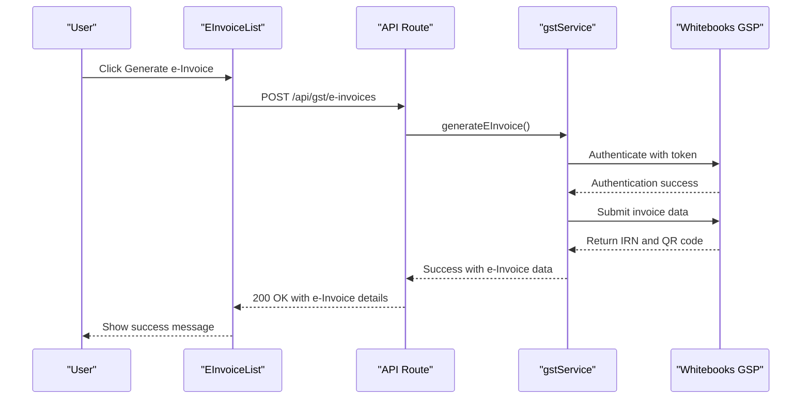
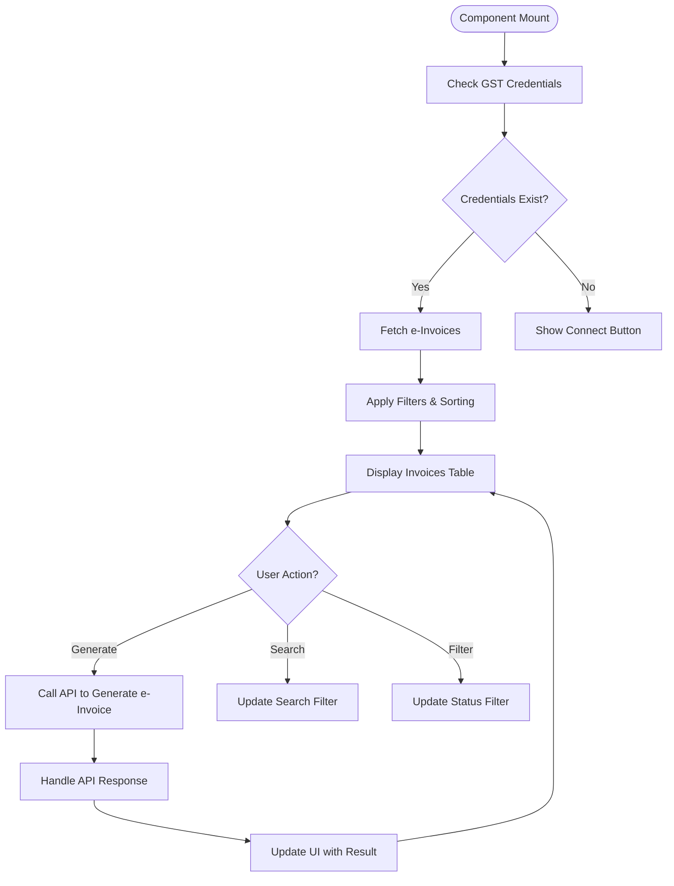
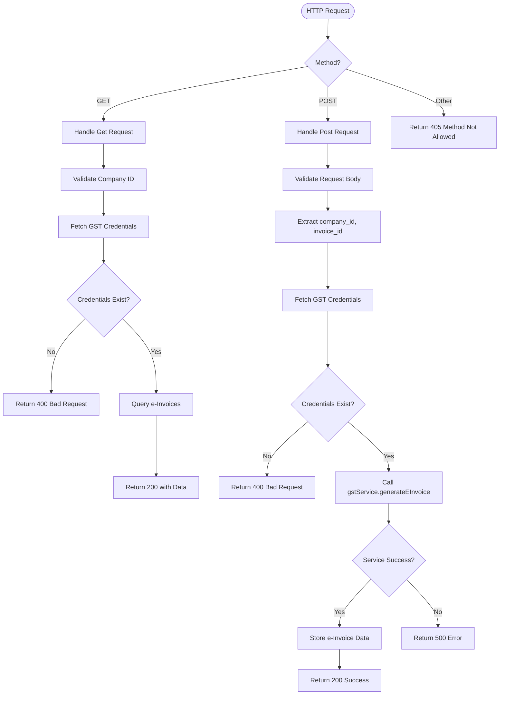
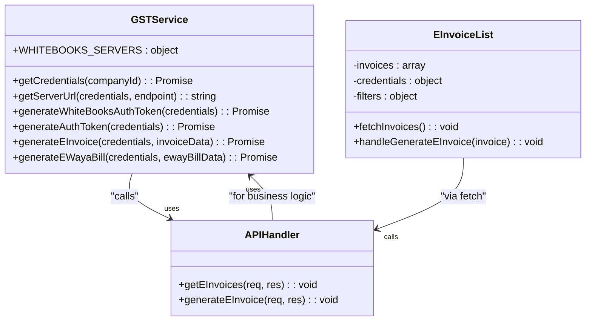
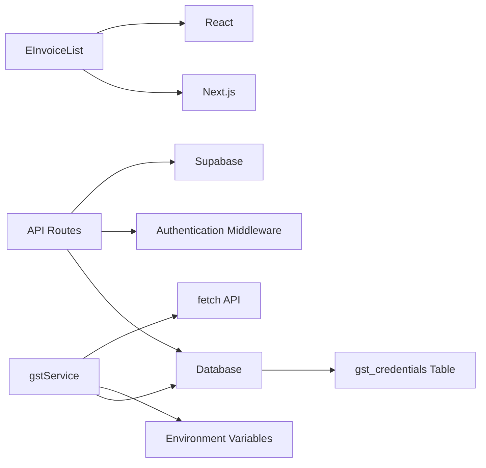

# e-Invoicing

<cite>
**Referenced Files in This Document**   
- [EInvoiceList.js](file://src/components/gst/EInvoiceList.js)
- [index.js](file://src/pages/api/gst/e-invoices/index.js)
- [gstService.js](file://src/services/gstService.js)
- [WhitebooksConnectModal.js](file://src/components/gst/WhitebooksConnectModal.js)
- [create_gst_credentials_table.sql](file://migrations/create_gst_credentials_table.sql)
- [update_gst_credentials_table.sql](file://migrations/update_gst_credentials_table.sql)
- [credentials.js](file://src/pages/api/gst/credentials.js)
- [gsp/connect.js](file://src/pages/api/gsp/connect.js)
</cite>

## Table of Contents
1. [Introduction](#introduction)
2. [Project Structure](#project-structure)
3. [Core Components](#core-components)
4. [Architecture Overview](#architecture-overview)
5. [Detailed Component Analysis](#detailed-component-analysis)
6. [Dependency Analysis](#dependency-analysis)
7. [Performance Considerations](#performance-considerations)
8. [Troubleshooting Guide](#troubleshooting-guide)
9. [Conclusion](#conclusion)

## Introduction
The e-Invoicing sub-feature of the GST compliance system enables businesses to generate, track, and manage e-Invoices through integration with Whitebooks, a Government Suited Provider (GSP). This document details the implementation workflow from invoice creation to IRN (Invoice Registration Number) generation and QR code embedding. The system supports both sandbox and production environments, allowing for safe testing before live deployment. Key components include frontend interfaces for status filtering, API routes for e-Invoice generation, and a business logic layer that handles communication with the Whitebooks GSP.

## Project Structure
The e-Invoicing feature is organized across multiple directories within the project structure, following a modular and scalable architecture. The core components are located in the `src/components/gst/` directory, while API routes are defined in `src/pages/api/gst/`. Business logic is encapsulated in the `src/services/` directory, specifically in `gstService.js`. Database schema changes related to GST credentials are managed through SQL migration files in the `migrations/` directory.

**Diagram sources**
- [EInvoiceList.js](file://src/components/gst/EInvoiceList.js)
- [index.js](file://src/pages/api/gst/e-invoices/index.js)
- [gstService.js](file://src/services/gstService.js)
- [create_gst_credentials_table.sql](file://migrations/create_gst_credentials_table.sql)
- [credentials.js](file://src/pages/api/gst/credentials.js)
- [gsp/connect.js](file://src/pages/api/gsp/connect.js)

**Section sources**
- [EInvoiceList.js](file://src/components/gst/EInvoiceList.js)
- [index.js](file://src/pages/api/gst/e-invoices/index.js)
- [gstService.js](file://src/services/gstService.js)
- [create_gst_credentials_table.sql](file://migrations/create_gst_credentials_table.sql)

## Core Components
The e-Invoicing system consists of several key components that work together to enable seamless e-Invoice generation and management. The `EInvoiceList` component provides a user interface for viewing and filtering e-Invoices by status (generated, pending, error). It integrates with the `WhitebooksConnectModal` to facilitate GSP connection setup. The backend API routes handle CRUD operations for e-Invoices and GST credentials, while the `gstService.js` file contains the business logic for interacting with the Whitebooks API. The database schema, defined in migration files, stores GST credentials securely with encryption considerations for sensitive fields like passwords and client secrets.

**Section sources**
- [EInvoiceList.js](file://src/components/gst/EInvoiceList.js)
- [index.js](file://src/pages/api/gst/e-invoices/index.js)
- [gstService.js](file://src/services/gstService.js)
- [create_gst_credentials_table.sql](file://migrations/create_gst_credentials_table.sql)

## Architecture Overview
The e-Invoicing architecture follows a layered approach with clear separation of concerns between frontend, API, service, and data layers. The frontend components handle user interaction and display, making API calls to the backend. The API routes serve as entry points, validating requests and orchestrating operations between the service layer and data storage. The `gstService.js` file abstracts the complexity of GSP integration, providing methods for authentication token generation and e-Invoice creation. Data persistence is managed through Supabase, with GST credentials stored in a dedicated table that supports both sandbox and production environments.

**Diagram sources**
- [EInvoiceList.js](file://src/components/gst/EInvoiceList.js)
- [index.js](file://src/pages/api/gst/e-invoices/index.js)
- [gstService.js](file://src/services/gstService.js)

## Detailed Component Analysis

### EInvoiceList Component Analysis
The `EInvoiceList` component serves as the primary interface for managing e-Invoices. It provides functionality for searching, filtering by status, and sorting invoices. The component checks for GST credentials upon loading and displays a connection status indicator showing whether the system is connected to the sandbox or production environment. When generating an e-Invoice, it makes a POST request to the API endpoint with the invoice ID and company ID. The component also handles real-time updates and displays statistics cards showing the count of total invoices, pending, generated, and errored e-Invoices.

**Diagram sources**
- [EInvoiceList.js](file://src/components/gst/EInvoiceList.js)

**Section sources**
- [EInvoiceList.js](file://src/components/gst/EInvoiceList.js)

### API Route Analysis
The API route at `src/pages/api/gst/e-invoices/index.js` handles both GET and POST requests for e-Invoice operations. The GET method retrieves a list of e-Invoices with support for filtering by search term, status, and sorting parameters. The POST method initiates e-Invoice generation by first validating the presence of required credentials, then calling the `gstService.generateEInvoice` method. The route implements proper error handling, returning appropriate HTTP status codes and messages for various failure scenarios. It also includes middleware for authentication, ensuring that only authorized users can access the endpoints.

**Diagram sources**
- [index.js](file://src/pages/api/gst/e-invoices/index.js)

**Section sources**
- [index.js](file://src/pages/api/gst/e-invoices/index.js)

### gstService.js Analysis
The `gstService.js` file contains the core business logic for e-Invoice generation and GSP integration. It includes methods for retrieving GST credentials from the database, generating authentication tokens for the Whitebooks API, and creating e-Invoices. The service handles both sandbox and production environments through configuration. The `generateEInvoice` method orchestrates the entire process: authenticating with the GSP, submitting the invoice data, and processing the response containing the IRN, acknowledgment number, and QR code data. The service also includes error handling for common issues like authentication failures and network errors.

**Diagram sources**
- [gstService.js](file://src/services/gstService.js)

**Section sources**
- [gstService.js](file://src/services/gstService.js)

## Dependency Analysis
The e-Invoicing feature has several key dependencies that enable its functionality. The frontend components depend on React and Next.js for rendering and routing. The API routes rely on Supabase for database operations and authentication middleware. The `gstService.js` file depends on the `fetch` API for making HTTP requests to the Whitebooks GSP. Environment variables control the mode (sandbox vs production) and store Ezbillify's Whitebooks client credentials securely. The system also depends on the presence of specific database tables, particularly `gst_credentials`, which stores the connection details for each company.

**Diagram sources**
- [EInvoiceList.js](file://src/components/gst/EInvoiceList.js)
- [index.js](file://src/pages/api/gst/e-invoices/index.js)
- [gstService.js](file://src/services/gstService.js)
- [create_gst_credentials_table.sql](file://migrations/create_gst_credentials_table.sql)

**Section sources**
- [package.json](file://package.json)
- [create_gst_credentials_table.sql](file://migrations/create_gst_credentials_table.sql)

## Performance Considerations
For high-volume periods, batch e-Invoice generation should be implemented with rate limiting to avoid overwhelming the Whitebooks API. The current implementation processes one e-Invoice at a time, which may lead to performance bottlenecks during peak usage. Consider implementing a queue-based system where e-Invoice generation requests are added to a queue and processed asynchronously. This approach would improve responsiveness and allow for better error handling and retry mechanisms. Additionally, caching frequently accessed data like GST credentials can reduce database load. The system should also implement proper connection pooling and timeout handling to manage network latency with the GSP.

## Troubleshooting Guide
Common issues in the e-Invoicing system include IRN generation failures, authentication token expiration, and environment configuration errors. IRN generation failures typically occur due to invalid invoice data or connectivity issues with the Whitebooks API. These should be handled by validating invoice data before submission and implementing retry logic with exponential backoff. Authentication token expiration is managed by the `gstService` which automatically refreshes tokens when needed. Sandbox vs production environment differences can cause issues if credentials are mixed between environments; the system clearly indicates the current mode in the UI to prevent this. For debugging, check the browser console for frontend errors and server logs for API issues. Ensure that all required environment variables are set correctly, particularly `WHITEBOOKS_MODE`, `WHITEBOOKS_CLIENT_ID`, and `WHITEBOOKS_CLIENT_SECRET`.

**Section sources**
- [gstService.js](file://src/services/gstService.js)
- [EInvoiceList.js](file://src/components/gst/EInvoiceList.js)
- [gsp/connect.js](file://src/pages/api/gsp/connect.js)

## Conclusion
The e-Invoicing sub-feature provides a comprehensive solution for generating and managing e-Invoices through Whitebooks GSP integration. The system follows a clean architectural pattern with separation between frontend, API, and service layers. Key features include status filtering, sandbox/production environment support, and secure credential management. The implementation handles common use cases and error scenarios, providing a solid foundation for GST compliance. Future improvements could include batch processing, enhanced error reporting, and integration with additional GSPs.