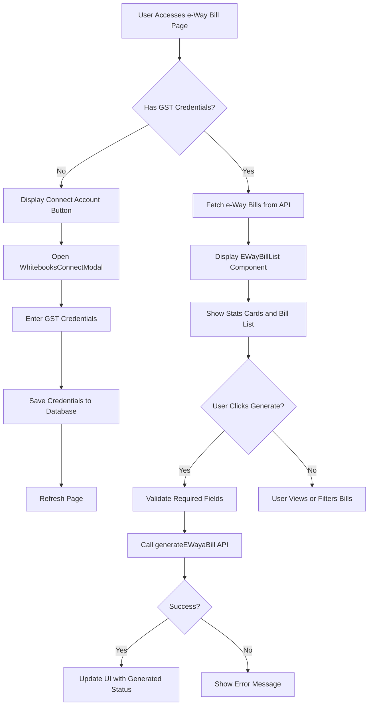
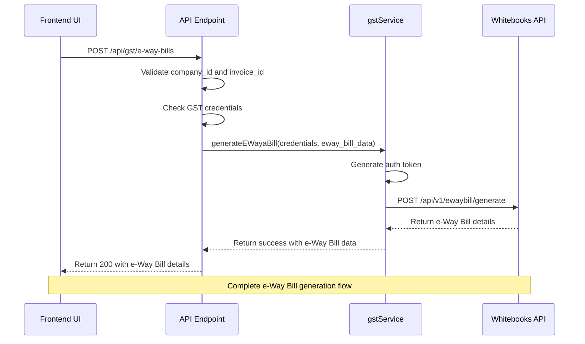
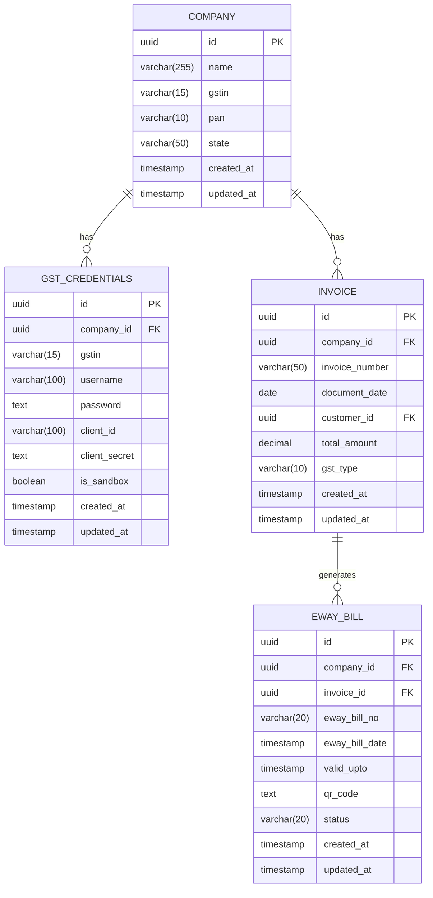

# e-Way Bills

<cite>
**Referenced Files in This Document**   
- [EWayBillList.js](file://src/components/gst/EWayBillList.js)
- [index.js](file://src/pages/api/gst/e-way-bills/index.js)
- [gstService.js](file://src/services/gstService.js)
- [useGSTValidation.js](file://src/hooks/useGSTValidation.js)
- [EWayBillListPage.js](file://src/pages/gst-integration/ewaybill-list.js)
- [EWayBillPage.js](file://src/pages/gst-integration/ewaybill.js)
- [WhitebooksConnectModal.js](file://src/components/gst/WhitebooksConnectModal.js)
- [validations.js](file://src/lib/validations.js)
- [constants.js](file://src/lib/constants.js)
- [create_gst_credentials_table.sql](file://migrations/create_gst_credentials_table.sql)
</cite>

## Table of Contents
1. [Introduction](#introduction)
2. [e-Way Bill Workflow](#e-way-bill-workflow)
3. [Frontend Implementation](#frontend-implementation)
4. [API Endpoints](#api-endpoints)
5. [Business Logic and Whitebooks Integration](#business-logic-and-whitebooks-integration)
6. [Validation and Error Handling](#validation-and-error-handling)
7. [Data Model and Storage](#data-model-and-storage)
8. [Common Issues and Troubleshooting](#common-issues-and-troubleshooting)
9. [Conclusion](#conclusion)

## Introduction

The e-Way Bill sub-feature in the GST compliance system enables businesses to generate electronic waybills for the transportation of goods as required by Indian GST regulations. This documentation provides a comprehensive overview of the implementation details for creating, validating, and managing e-Way Bills within the EzBillify platform.

The system integrates with Whitebooks, a GST Suvidha Provider (GSP), to facilitate e-Way Bill generation. The workflow begins with selecting an invoice that meets the criteria for e-Way Bill generation (typically B2B transactions above ₹50,000) and proceeds through validation, generation, and status tracking. The implementation includes frontend components for user interaction, API endpoints for handling requests, and business logic for integrating with the Whitebooks API.

This document will explore the complete technical architecture, including the relationship between frontend UI components, API endpoints, and the underlying business logic that handles the Whitebooks API integration.

**Section sources**
- [EWayBillList.js](file://src/components/gst/EWayBillList.js#L1-L456)
- [EWayBillPage.js](file://src/pages/gst-integration/ewaybill.js#L1-L368)

## e-Way Bill Workflow

The e-Way Bill generation workflow in the EzBillify system follows a structured process that ensures compliance with GST regulations while providing a seamless user experience. The workflow begins when a user navigates to the e-Way Bill section of the application, either through the GST integration dashboard or directly via the e-Way Bill list page.

The process starts with authentication and authorization checks to ensure the user has the necessary permissions to generate e-Way Bills. Once authenticated, the system verifies that the company has connected its GST account by checking for valid GST credentials in the database. If no credentials are found, the user is prompted to connect their GST account through the Whitebooks GSP integration process.

When credentials are present, the system displays a list of invoices eligible for e-Way Bill generation. These invoices are typically B2B transactions that meet the threshold value requiring an e-Way Bill. The user can filter and search through this list using various criteria such as invoice number, customer name, date range, and amount.

To generate an e-Way Bill, the user selects an invoice with a "pending" status and clicks the "Generate" button. This triggers a series of validation checks on required fields including distance, vehicle number, transporter details, and other transportation information. The system validates that the invoice contains all necessary information such as the consignor and consignee GSTINs, item details, and value of goods.

Once validation passes, the system formats the e-Way Bill data according to the Whitebooks API schema and sends a request to generate the e-Way Bill. Upon successful generation, the system receives an e-Way Bill number, validity period, and QR code which are stored in the database and displayed to the user. The invoice status is updated to "generated" in the user interface.

The workflow also includes provisions for handling e-Way Bill cancellation and updates as per GST regulations. Users can view generated e-Way Bills, access the QR code for verification, and initiate cancellation if needed (within 24 hours of generation). The system maintains a complete audit trail of all e-Way Bill activities for compliance purposes.

**Section sources**
- [EWayBillList.js](file://src/components/gst/EWayBillList.js#L120-L159)
- [EWayBillPage.js](file://src/pages/gst-integration/ewaybill.js#L86-L137)
- [index.js](file://src/pages/api/gst/e-way-bills/index.js#L70-L142)

## Frontend Implementation

The frontend implementation of the e-Way Bill feature is centered around the `EWayBillList` component, which provides a comprehensive interface for managing e-Way Bill generation and status tracking. This component is rendered on the `EWayBillListPage`, which serves as the main entry point for the e-Way Bill functionality.

The `EWayBillList` component displays a dashboard with key metrics including total e-Way Bills, pending bills, generated bills, and error counts. These statistics are presented using visually distinct cards with appropriate icons and color coding to quickly convey status information. The component uses the `useAPI` hook to make authenticated requests to the backend API endpoints and the `useToast` context for displaying success and error messages.

The user interface includes filtering and search capabilities that allow users to find specific e-Way Bills based on criteria such as invoice number, customer name, and status. The status filter provides options for "All Status," "Pending," "Generated," and "Error" to help users quickly identify bills that require attention.

For each invoice in the list, the component displays essential information including the invoice number, date, customer name, and total amount. The status is indicated using color-coded badges that correspond to the current state of the e-Way Bill (pending, generated, or error). The actions column provides context-specific buttons: a "Generate" button for pending bills, a "View" button for generated bills, and appropriate error handling for failed attempts.

When a user clicks the "Generate" button, the component triggers the `handleGenerateEwayBill` function, which sends a POST request to the `/api/gst/e-way-bills` endpoint with the necessary data including the company ID, invoice ID, and e-Way Bill details. The component manages loading states during API calls and updates the UI in real-time to reflect the new status of the e-Way Bill.

The frontend also includes the `WhitebooksConnectModal` component, which guides users through the process of connecting their GST account to the Whitebooks GSP. This modal provides a step-by-step interface for entering credentials and handles the authentication flow seamlessly within the application.



**Diagram sources **
- [EWayBillList.js](file://src/components/gst/EWayBillList.js#L1-L456)
- [EWayBillPage.js](file://src/pages/gst-integration/ewaybill.js#L1-L368)
- [WhitebooksConnectModal.js](file://src/components/gst/WhitebooksConnectModal.js#L1-L317)

**Section sources**
- [EWayBillList.js](file://src/components/gst/EWayBillList.js#L1-L456)
- [EWayBillPage.js](file://src/pages/gst-integration/ewaybill.js#L1-L368)
- [WhitebooksConnectModal.js](file://src/components/gst/WhitebooksConnectModal.js#L1-L317)

## API Endpoints

The e-Way Bill functionality is supported by a dedicated API endpoint located at `/api/gst/e-way-bills/index.js`. This endpoint handles both GET and POST requests for retrieving e-Way Bill data and generating new e-Way Bills, respectively.

The GET endpoint (`/api/gst/e-way-bills`) accepts query parameters including `company_id`, `search`, `status`, `sort_by`, and `sort_order` to filter and sort the results. It first validates that a company ID is provided, then checks for valid GST credentials associated with that company. If credentials are not found, it returns an appropriate error message prompting the user to connect their GST account. When credentials are present, the endpoint would normally fetch actual e-Way Bill data from the Whitebooks API, but in the current implementation, it returns an empty array as a mock response.

The POST endpoint (`/api/gst/e-way-bills`) is responsible for generating new e-Way Bills. It expects a JSON payload containing the `company_id`, `invoice_id`, and `eway_bill_data`. The endpoint performs validation to ensure both company ID and invoice ID are provided. It then retrieves the GST credentials for the specified company and uses them to authenticate with the Whitebooks API through the `gstService`.

The API implementation includes comprehensive error handling for various scenarios including missing credentials, authentication failures, and API errors. It returns standardized JSON responses with a `success` flag, `data` object, and `error` message when applicable. The endpoint is protected by the `withAuth` middleware, ensuring that only authenticated users can access it.

The API follows a clean separation of concerns, with the request handler delegating the actual business logic to the `gstService` module. This allows for better maintainability and testability of the codebase. The endpoint also includes proper HTTP status codes (200 for success, 400 for bad requests, 405 for unsupported methods, and 500 for server errors) to provide clear feedback to the frontend.



**Diagram sources **
- [index.js](file://src/pages/api/gst/e-way-bills/index.js#L1-L142)
- [gstService.js](file://src/services/gstService.js#L131-L174)

**Section sources**
- [index.js](file://src/pages/api/gst/e-way-bills/index.js#L1-L142)

## Business Logic and Whitebooks Integration

The core business logic for e-Way Bill generation is encapsulated in the `gstService.js` file, which serves as the intermediary between the EzBillify application and the Whitebooks GSP API. The `GSTService` class provides methods for handling authentication, credential management, and e-Way Bill generation.

The service begins by retrieving the company's GST credentials from the database using the `getCredentials` method. These credentials include the GSTIN, GSP username and password, client ID, and client secret, which are securely stored in the `gst_credentials` table. The service determines the appropriate server URL based on whether the system is operating in sandbox or production mode, allowing for safe testing of the integration.

For authentication with the Whitebooks API, the service implements the `generateWhiteBooksAuthToken` method, which makes a POST request to the Whitebooks authentication endpoint with the client credentials. This follows the OAuth 2.0 client credentials flow, returning a bearer token that is used to authenticate subsequent API requests. The token includes an expiration timestamp to ensure it is refreshed when necessary.

The `generateEWayaBill` method orchestrates the e-Way Bill generation process. It first obtains an authentication token using the `generateAuthToken` method, then constructs a request to the Whitebooks e-Way Bill generation endpoint. The request includes the formatted e-Way Bill data in the request body, with appropriate headers including the authorization token and content type.

The service handles errors gracefully, catching exceptions and returning structured error responses that can be displayed to the user. It also includes logging to aid in debugging and monitoring. In a production implementation, the service would format the invoice data according to the specific schema required by the Whitebooks API, including all mandatory fields such as distance, vehicle number, transporter details, and item information.

The integration is designed to be extensible, with the service architecture allowing for the addition of other GSP providers in the future. The separation of concerns between credential management, authentication, and business operations makes the codebase maintainable and testable.

```mermaid
classDiagram
class GSTService {
+WHITEBOOKS_SERVERS : object
+getCredentials(companyId) : Promise~Object~
+getServerUrl(credentials, endpoint) : string
+generateWhiteBooksAuthToken(credentials) : Promise~Object~
+generateAuthToken(credentials) : Promise~Object~
+generateEWayaBill(credentials, ewayBillData) : Promise~Object~
}
class EWayBillData {
+supplyType : string
+subSupplyType : string
+docType : string
+docNo : string
+docDate : string
+distance : number
+vehicleNumber : string
+transporterId : string
+transporterName : string
}
class Credentials {
+gstin : string
+username : string
+password : string
+client_id : string
+client_secret : string
+is_sandbox : boolean
}
GSTService --> EWayBillData : "uses for"
GSTService --> Credentials : "requires for"
GSTService --> "Whitebooks API" : "integrates with"
```

**Diagram sources **
- [gstService.js](file://src/services/gstService.js#L4-L174)
- [constants.js](file://src/lib/constants.js#L368-L375)

**Section sources**
- [gstService.js](file://src/services/gstService.js#L4-L174)

## Validation and Error Handling

The e-Way Bill system implements comprehensive validation at multiple levels to ensure data integrity and compliance with GST regulations. Validation occurs on both the frontend and backend, with the frontend providing immediate feedback to users and the backend enforcing business rules and security constraints.

On the frontend, the system uses the `validations.js` library which contains predefined validation rules for various data types. For e-Way Bill generation, key validations include checking that the distance is a positive number, the vehicle number follows the standard Indian format (e.g., MH01AB1234), and transporter details are complete. The validation patterns are defined in `constants.js` and include regular expressions for GSTIN, PAN, and other identifiers.

The `useGSTValidation` hook provides specialized validation functions for GST-related data, including `validateGSTIN` and `validatePAN`. These functions check the format of the identifiers and can optionally perform real-time validation against government databases. The GSTIN validation ensures the 15-character format with the correct structure: 2 digits for state code, 5 uppercase letters, 4 digits, 1 uppercase letter, 1 alphanumeric character, 'Z', and 1 alphanumeric character.

On the backend, the API endpoint performs additional validation to prevent malicious requests. It verifies that the company ID and invoice ID are present and valid, and that the user has permission to access the specified company's data. The system also validates that the invoice meets the criteria for e-Way Bill generation, such as being a B2B transaction above the threshold value.

Common validation errors include:
- Missing or invalid GST credentials
- Distance not specified or zero
- Vehicle number in incorrect format
- Transporter details incomplete
- Invoice value below the threshold requiring an e-Way Bill
- Consignor or consignee GSTIN missing or invalid

The system handles these errors by returning descriptive error messages that guide users toward resolution. For example, if the GST credentials are not connected, the user is prompted to connect their account. If the distance is missing, the form highlights the field and displays an appropriate error message.

The error handling strategy follows a consistent pattern across the application, with errors categorized as validation errors, authentication errors, or server errors. This allows the frontend to display appropriate messages and take corrective actions, such as redirecting to the login page for authentication errors or showing a retry option for server errors.

**Section sources**
- [validations.js](file://src/lib/validations.js#L1-L464)
- [constants.js](file://src/lib/constants.js#L368-L375)
- [useGSTValidation.js](file://src/hooks/useGSTValidation.js#L1-L68)
- [index.js](file://src/pages/api/gst/e-way-bills/index.js#L73-L77)

## Data Model and Storage

The e-Way Bill functionality relies on a well-defined data model that stores both the credentials needed for API integration and the generated e-Way Bill records. The primary data storage is implemented using a PostgreSQL database with specific tables designed for GST compliance.

The `gst_credentials` table, created by the `create_gst_credentials_table.sql` migration, stores the authentication credentials required to connect to the Whitebooks GSP. This table includes fields for the company ID (as a foreign key), GSTIN, GSP username and password, client ID and secret, and a boolean flag indicating whether the connection is in sandbox mode. The table has a unique constraint on the company ID to ensure each company has only one set of credentials.

When an e-Way Bill is generated, the system creates a record containing the e-Way Bill number, generation date, validity period, QR code data, and status. Although the current implementation shows this data being returned in the API response, in a production system this would be stored in a dedicated `eway_bills` table with appropriate indexes for querying by company, invoice, or status.

The data model follows security best practices by storing sensitive information like passwords and client secrets in encrypted form. The database schema includes proper foreign key relationships and constraints to maintain data integrity. Indexes are created on frequently queried fields such as company ID to ensure optimal performance.

The system also maintains temporal data through created_at and updated_at timestamps on records, allowing for audit trails and change tracking. This is particularly important for GST compliance, where businesses may need to demonstrate the history of e-Way Bill generation and modifications.

The data model is designed to support the reconciliation between e-Invoice and e-Way Bill data, with foreign key relationships between invoices and their corresponding e-Way Bills. This allows the system to verify that e-Way Bills are generated for valid invoices and to prevent duplicate generation.



**Diagram sources **
- [create_gst_credentials_table.sql](file://migrations/create_gst_credentials_table.sql#L1-L26)
- [index.js](file://src/pages/api/gst/e-way-bills/index.js#L116-L126)

**Section sources**
- [create_gst_credentials_table.sql](file://migrations/create_gst_credentials_table.sql#L1-L26)

## Common Issues and Troubleshooting

The e-Way Bill system may encounter several common issues that require specific troubleshooting approaches. Understanding these issues and their solutions is essential for maintaining smooth operations and ensuring GST compliance.

One frequent issue is e-Way Bill validity period errors, which occur when the validity period calculated by the system does not match the requirements based on distance and mode of transport. According to GST regulations, the validity period is determined by the distance: 1 day for up to 100 km, and additional days for every 100 km or part thereof. The system must accurately calculate this based on the distance provided, and errors can occur if the distance field is missing or incorrectly formatted.

Transporter information validation issues are another common problem. The system requires complete transporter details including transporter ID, name, and vehicle number. Errors occur when these fields are missing or when the vehicle number does not follow the standard Indian format (two letters for state, two digits for district, two letters for series, and four digits for number). The validation system should provide clear error messages to guide users in correcting these issues.

Reconciliation between e-Invoice and e-Way Bill data can present challenges, particularly when there are discrepancies between the invoice value in the e-Invoice and the value declared in the e-Way Bill. The system should validate that these values match within an acceptable tolerance and alert users to any significant differences that could indicate data entry errors or potential compliance issues.

Other common issues include:
- Authentication failures with the Whitebooks API, often due to expired credentials or incorrect client secrets
- Network connectivity issues that prevent communication with the Whitebooks servers
- Rate limiting by the Whitebooks API when generating multiple e-Way Bills in quick succession
- Data format mismatches between the EzBillify system and the Whitebooks API schema

For troubleshooting, administrators should first check the system logs for error messages and stack traces. The `gstService.js` file includes comprehensive logging that can help identify the source of issues. For authentication problems, verifying the credentials in the `gst_credentials` table and testing the connection independently can help isolate the issue.

When users report problems with e-Way Bill generation, the recommended steps are:
1. Verify that GST credentials are properly connected
2. Check that all required fields are filled and correctly formatted
3. Validate that the invoice meets the criteria for e-Way Bill generation
4. Review the API response for specific error messages
5. Consult the system logs for additional diagnostic information

The system should provide clear error messages that guide users toward resolution, rather than generic "failed" messages. For recurring issues, implementing automated monitoring and alerting can help proactively identify and address problems before they impact users.

**Section sources**
- [gstService.js](file://src/services/gstService.js#L131-L174)
- [index.js](file://src/pages/api/gst/e-way-bills/index.js#L70-L142)
- [validations.js](file://src/lib/validations.js#L1-L464)

## Conclusion

The e-Way Bill implementation in the EzBillify GST compliance system provides a comprehensive solution for generating and managing electronic waybills in accordance with Indian GST regulations. The system integrates seamlessly with the Whitebooks GSP to handle the technical aspects of e-Way Bill generation while providing an intuitive user interface for businesses to manage their transportation documentation.

The architecture follows a clean separation of concerns, with distinct components for frontend presentation, API endpoints, and business logic. This modular design allows for maintainability and extensibility, making it easier to adapt to changes in GST regulations or integrate with additional GSP providers in the future.

Key strengths of the implementation include comprehensive validation at multiple levels, robust error handling, and a user-friendly interface that guides users through the e-Way Bill generation process. The system handles common issues such as validity period calculations, transporter information validation, and reconciliation between e-Invoice and e-Way Bill data.

For future enhancements, the system could benefit from additional features such as automated distance calculation based on origin and destination addresses, integration with vehicle tracking systems, and advanced reporting capabilities for e-Way Bill analytics. The current implementation provides a solid foundation that can be extended to meet evolving business and regulatory requirements.

Organizations using this system should ensure their staff are properly trained on e-Way Bill regulations and best practices, and should establish internal processes for verifying e-Way Bill data before submission. Regular monitoring of the system's performance and error logs will help maintain compliance and operational efficiency.