# Inventory Management

<cite>
**Referenced Files in This Document**   
- [ItemForm.js](file://src/components/items/ItemForm.js)
- [StockIn.js](file://src/components/items/StockIn.js)
- [StockOut.js](file://src/components/items/StockOut.js)
- [AdjustmentForm.js](file://src/components/items/AdjustmentForm.js)
- [StockValuation.js](file://src/components/items/StockValuation.js)
- [StockList.js](file://src/components/items/StockList.js)
- [ItemView.js](file://src/components/items/ItemView.js)
- [useInventory.js](file://src/hooks/useInventory.js)
- [itemService.js](file://src/services/itemService.js)
- [index.js](file://src/pages/api/items/index.js)
- [stock/movement.js](file://src/pages/api/items/stock/movement.js)
- [stock/adjustment.js](file://src/pages/api/items/stock/adjustment.js)
- [stock/current.js](file://src/pages/api/items/stock/current.js)
- [migrations/add_barcodes_array_fixed.sql](file://migrations/add_barcodes_array_fixed.sql)
</cite>

## Table of Contents
1. [Introduction](#introduction)
2. [Item Management](#item-management)
3. [Stock Tracking](#stock-tracking)
4. [Stock Adjustments](#stock-adjustments)
5. [Stock Valuation](#stock-valuation)
6. [Data Model](#data-model)
7. [Integration with Sales and Purchase Modules](#integration-with-sales-and-purchase-modules)
8. [Common Issues](#common-issues)
9. [Performance Optimization](#performance-optimization)
10. [Conclusion](#conclusion)

## Introduction
The inventory management system in ezbillify-v1 provides comprehensive functionality for managing items, tracking stock levels, recording stock movements, and calculating stock valuation. This document explains the implementation details of the inventory system, including item management, stock tracking, stock adjustments, and stock valuation methods. It also covers the data model for items with barcode support, categories, and units of measurement, along with integration points with sales and purchase modules for automatic stock updates.

**Section sources**
- [ItemForm.js](file://src/components/items/ItemForm.js)
- [StockList.js](file://src/components/items/StockList.js)

## Item Management
The item management system in ezbillify-v1 allows users to create and manage items with comprehensive details including item code, name, description, category, brand, pricing, and inventory tracking settings. Items can be categorized as products or services, with different HSN/SAC code requirements based on type.

When creating a new item, users can specify various attributes such as primary and secondary units of measurement, conversion factors between units, tax rates, and barcode information. The system supports multiple barcodes per item, allowing for flexibility in scanning and identification. Items can be assigned to categories, which helps in organizing inventory and generating category-based reports.

The item creation process includes automatic code generation with prefixes based on item type (ITM for products, SRV for services) followed by a sequential number. Users can also manually specify item codes if desired. For inventory tracking items, opening stock can be set during creation, which automatically creates an opening stock movement record.

**Diagram sources**
- [ItemForm.js](file://src/components/items/ItemForm.js#L22-L53)
- [ItemView.js](file://src/components/items/ItemView.js#L337-L356)
- [StockList.js](file://src/components/items/StockList.js#L356-L410)

**Section sources**
- [ItemForm.js](file://src/components/items/ItemForm.js)
- [ItemView.js](file://src/components/items/ItemView.js)
- [index.js](file://src/pages/api/items/index.js)

## Stock Tracking
Stock tracking in ezbillify-v1 is implemented through a comprehensive system that records all stock movements and maintains real-time inventory levels. The system tracks current stock, reserved stock, and available stock for each item, providing accurate inventory visibility.

Stock movements are recorded through various operations including stock in (purchases, production, returns), stock out (sales, consumption, returns), and stock adjustments. Each movement is logged with details such as quantity, rate, value, reference type and number, location, notes, and movement date. The system validates stock availability before allowing stock out operations to prevent negative inventory.

The stock tracking system supports multiple reference types for movements:
- Purchase: Stock received from suppliers
- Sales: Stock issued for customer orders
- Production: Stock used in manufacturing
- Return: Stock returned from customers or to suppliers
- Transfer: Stock moved between locations
- Adjustment: Manual stock adjustments

**Diagram sources**
- [StockIn.js](file://src/components/items/StockIn.js)
- [stock/movement.js](file://src/pages/api/items/stock/movement.js)

**Section sources**
- [StockIn.js](file://src/components/items/StockIn.js)
- [StockOut.js](file://src/components/items/StockOut.js)
- [stock/movement.js](file://src/pages/api/items/stock/movement.js)

## Stock Adjustments
Stock adjustments in ezbillify-v1 allow users to modify inventory levels for various reasons such as physical count discrepancies, damaged goods, expired items, or found stock. The system provides a dedicated interface for stock adjustments with three adjustment types: set to quantity, increase by, and decrease by.

When performing a stock adjustment, users select an item, choose the adjustment type, enter the quantity, specify a reason, and add optional notes. The system calculates the resulting stock change and new stock level based on the selected adjustment type. For "set to quantity" adjustments, the stock is set to the specified quantity. For "increase by" and "decrease by" adjustments, the specified quantity is added to or subtracted from the current stock.

The adjustment process includes validation to ensure data integrity. When decreasing stock, the system prevents negative inventory by setting the minimum stock level to zero. All adjustments are logged in the inventory movements table with the movement type set to "adjustment" and include details such as stock before and after the adjustment, reason, and notes.

**Diagram sources**
- [AdjustmentForm.js](file://src/components/items/AdjustmentForm.js)
- [stock/adjustment.js](file://src/pages/api/items/stock/adjustment.js)

**Section sources**
- [AdjustmentForm.js](file://src/components/items/AdjustmentForm.js)
- [stock/adjustment.js](file://src/pages/api/items/stock/adjustment.js)

## Stock Valuation
The stock valuation system in ezbillify-v1 provides tools for calculating the value of inventory using different methods. The system displays valuation data in a tabular format showing item details, stock quantities, unit rates, total values, and percentage of total inventory value.

The valuation calculation is based on the current stock quantity multiplied by the valuation rate, which can be configured as purchase price, selling price, or other methods. The system provides filters to refine valuation data by search term, category, and valuation method. Users can also choose to include or exclude zero stock items from the valuation report.

The stock valuation interface includes summary statistics showing total items, total quantity, total value, and average value. This information helps businesses understand their inventory investment and identify high-value items. The system also supports exporting valuation data to Excel format for further analysis.

```mermaid
flowchart LR
A[Valuation Request] --> B{Apply Filters}
B --> C[Search Filter]
B --> D[Category Filter]
B --> E[Valuation Method]
B --> F[Show Zero Stock]
C --> G[Filter Items]
D --> G
E --> G
F --> G
G --> H[Calculate Valuation]
H --> I[Item Current Stock]
H --> J[Valuation Rate]
H --> K[Total Value = Stock × Rate]
H --> L[Percentage of Total]
I --> M[Summarize Data]
J --> M
K --> M
L --> M
M --> N[Display Results]
N --> O[Export Option]
```

**Diagram sources**
- [StockValuation.js](file://src/components/items/StockValuation.js)
- [StockList.js](file://src/components/items/StockList.js)

**Section sources**
- [StockValuation.js](file://src/components/items/StockValuation.js)
- [StockList.js](file://src/components/items/StockList.js)

## Data Model
The inventory data model in ezbillify-v1 is designed to support comprehensive item management with barcode support, categories, and units of measurement. The core entity is the Item, which contains various attributes for item details, pricing, inventory tracking, and categorization.

Items are linked to units of measurement through primary_unit_id and secondary_unit_id foreign keys, allowing for flexible unit conversions. The system supports multiple barcodes per item through an array field, enabling scanning with different barcode formats. Categories are stored as a simple string field, with category management handled separately in the master data system.

The inventory movements table tracks all stock changes with detailed information including movement type, quantity, rate, value, reference details, location, and timestamps. This table maintains a complete audit trail of inventory transactions and enables accurate stock level calculations.

**Diagram sources**
- [ItemForm.js](file://src/components/items/ItemForm.js)
- [index.js](file://src/pages/api/items/index.js)
- [add_barcodes_array_fixed.sql](file://migrations/add_barcodes_array_fixed.sql)

**Section sources**
- [ItemForm.js](file://src/components/items/ItemForm.js)
- [index.js](file://src/pages/api/items/index.js)
- [migrations/add_barcodes_array_fixed.sql](file://migrations/add_barcodes_array_fixed.sql)

## Integration with Sales and Purchase Modules
The inventory system in ezbillify-v1 is tightly integrated with sales and purchase modules to enable automatic stock updates. When sales invoices are created or purchase bills are recorded, the system automatically adjusts inventory levels based on the items included in the transactions.

For sales transactions, when an invoice is created and confirmed, the system reduces the stock quantity for each item by the sold quantity. This stock out operation is recorded as a movement with the reference type set to "sales" and the reference number linked to the invoice. The system validates that sufficient stock is available before allowing the sale to proceed.

For purchase transactions, when a purchase bill is recorded, the system increases the stock quantity for each item by the purchased quantity. This stock in operation is recorded as a movement with the reference type set to "purchase" and the reference number linked to the purchase bill. The purchase price from the bill is used to update the item's purchase price and for valuation purposes.

The integration ensures that inventory levels are always up-to-date and synchronized with financial transactions. This eliminates the need for manual stock updates and reduces the risk of inventory discrepancies.

**Diagram sources**
- [StockOut.js](file://src/components/items/StockOut.js)
- [StockIn.js](file://src/components/items/StockIn.js)
- [stock/movement.js](file://src/pages/api/items/stock/movement.js)

**Section sources**
- [StockIn.js](file://src/components/items/StockIn.js)
- [StockOut.js](file://src/components/items/StockOut.js)
- [stock/movement.js](file://src/pages/api/items/stock/movement.js)

## Common Issues
The inventory management system in ezbillify-v1 addresses several common inventory issues through built-in validation and warning mechanisms.

Stock discrepancies are handled through the stock adjustment feature, which allows users to reconcile physical counts with system records. The system provides clear audit trails of all adjustments, including the reason and notes, to maintain accountability.

Negative inventory is prevented by system validation that checks stock availability before allowing stock out operations. When attempting to issue more stock than available, the system displays an error message and prevents the transaction from completing. This ensures inventory integrity and prevents overselling.

The system currently has limitations regarding batch/serial tracking, as it does not support tracking individual item batches or serial numbers. All stock is managed as homogeneous units, which may not be suitable for businesses that require lot tracking for expiration dates or warranty purposes.

Other common issues addressed by the system include:
- Low stock alerts when inventory falls below reorder levels
- Stock status indicators (in-stock, low-stock, out-of-stock) in the stock list
- Validation of barcode uniqueness across items
- Prevention of duplicate item codes within the same company

**Section sources**
- [StockOut.js](file://src/components/items/StockOut.js#L144-L147)
- [StockList.js](file://src/components/items/StockList.js#L133-L137)
- [AdjustmentForm.js](file://src/components/items/AdjustmentForm.js#L143-L178)

## Performance Optimization
For inventory operations with large item catalogs, several performance optimization strategies can be implemented:

1. **Pagination and Filtering**: The system uses pagination with configurable page sizes to limit the number of records retrieved at once. Filters for category, stock status, and search terms help narrow down results and improve query performance.

2. **Indexing**: Database indexes should be created on frequently queried fields such as item_code, category, item_name, and track_inventory to speed up search operations.

3. **Caching**: Frequently accessed data like item lists and stock summaries can be cached to reduce database load and improve response times.

4. **Bulk Operations**: For scenarios requiring multiple stock adjustments, implementing bulk update functionality would reduce the number of API calls and improve efficiency.

5. **Asynchronous Processing**: For operations that don't require immediate feedback, such as generating comprehensive inventory reports, asynchronous processing can be used to avoid blocking the user interface.

6. **Database Optimization**: Regular database maintenance including vacuuming, analyzing, and updating statistics helps maintain optimal performance.

7. **Connection Pooling**: Using database connection pooling reduces the overhead of establishing new connections for each request.

**Section sources**
- [StockList.js](file://src/components/items/StockList.js#L34-L39)
- [current.js](file://src/pages/api/items/stock/current.js#L85-L92)
- [movement.js](file://src/pages/api/items/stock/movement.js#L94-L102)

## Conclusion
The inventory management system in ezbillify-v1 provides a comprehensive solution for managing items, tracking stock levels, recording stock movements, and calculating stock valuation. The system's robust data model supports barcode scanning, categorization, and multiple units of measurement, while its integration with sales and purchase modules ensures automatic stock updates.

Key features include flexible item management, real-time stock tracking, various stock adjustment types, and multiple valuation methods. The system addresses common inventory issues through validation and warning mechanisms, preventing negative inventory and providing low stock alerts.

For optimal performance with large item catalogs, implementing the recommended optimization strategies will ensure responsive user experiences and efficient inventory operations. The system's modular design and clear API structure make it extensible for future enhancements such as batch/serial tracking or advanced inventory costing methods.

**Section sources**
- [ItemForm.js](file://src/components/items/ItemForm.js)
- [StockIn.js](file://src/components/items/StockIn.js)
- [StockOut.js](file://src/components/items/StockOut.js)
- [AdjustmentForm.js](file://src/components/items/AdjustmentForm.js)
- [StockValuation.js](file://src/components/items/StockValuation.js)