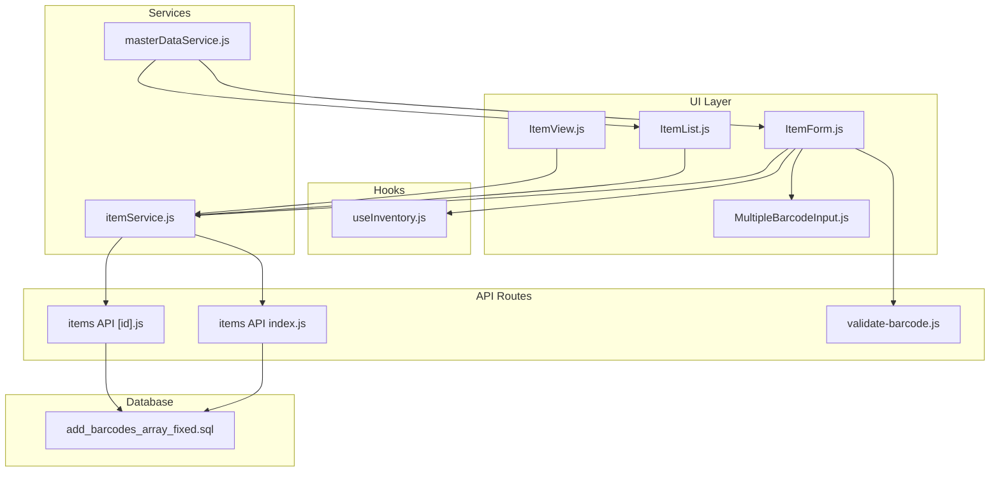
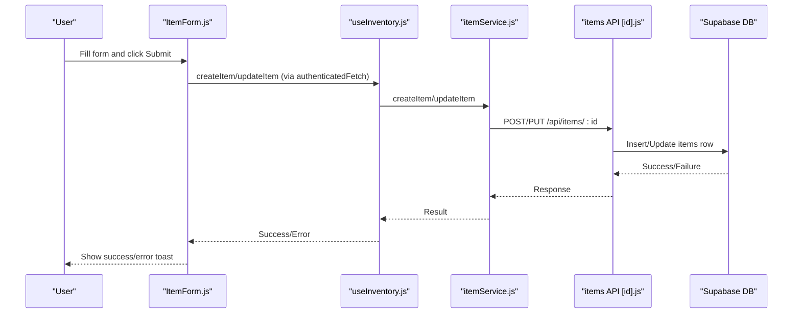
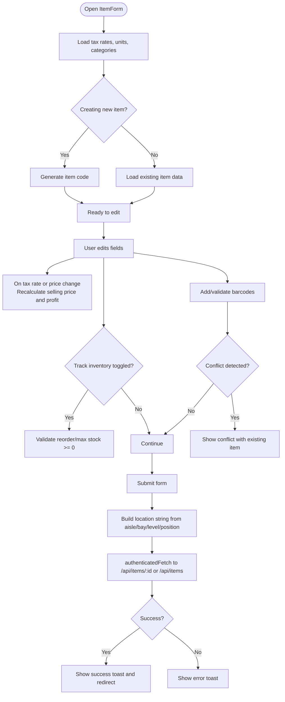
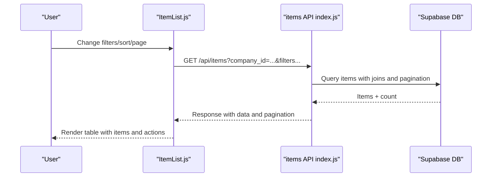
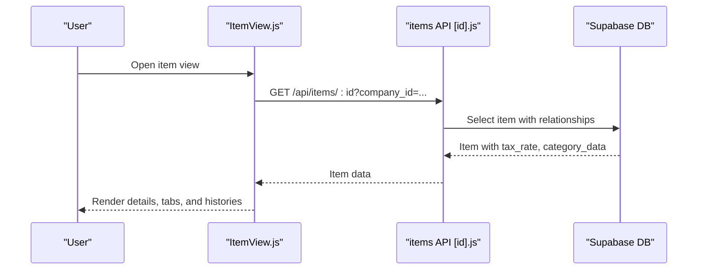
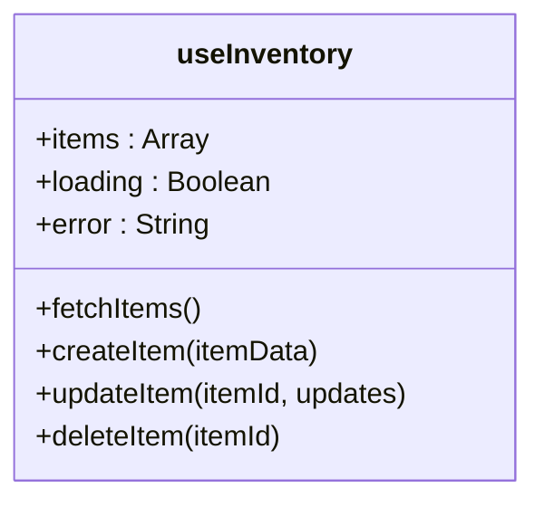
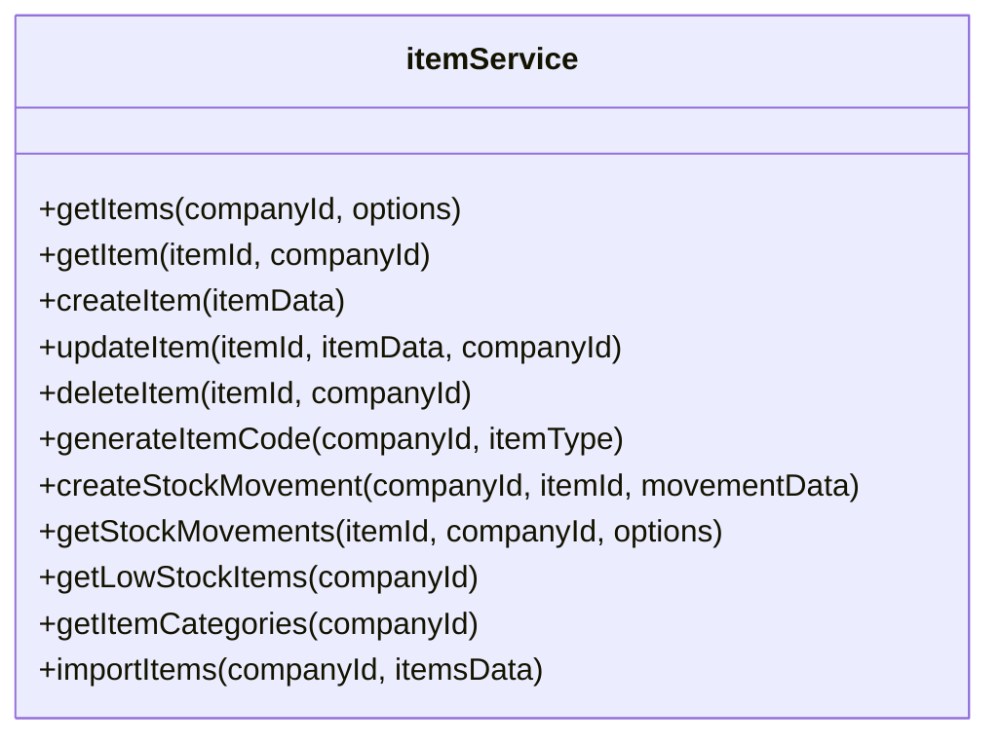
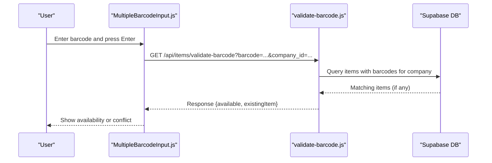
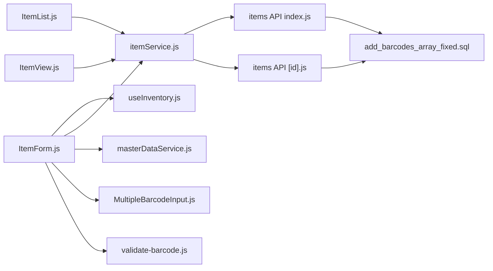

# Item Management

<cite>
**Referenced Files in This Document**
- [ItemForm.js](file://src/components/items/ItemForm.js)
- [ItemList.js](file://src/components/items/ItemList.js)
- [ItemView.js](file://src/components/items/ItemView.js)
- [useInventory.js](file://src/hooks/useInventory.js)
- [itemService.js](file://src/services/itemService.js)
- [masterDataService.js](file://src/services/masterDataService.js)
- [MultipleBarcodeInput.js](file://src/components/shared/MultipleBarcodeInput.js)
- [validate-barcode.js](file://src/pages/api/items/validate-barcode.js)
- [items API index.js](file://src/pages/api/items/index.js)
- [items API [id].js](file://src/pages/api/items/[id].js)
- [add_barcodes_array_fixed.sql](file://migrations/add_barcodes_array_fixed.sql)
</cite>

## Table of Contents
1. [Introduction](#introduction)
2. [Project Structure](#project-structure)
3. [Core Components](#core-components)
4. [Architecture Overview](#architecture-overview)
5. [Detailed Component Analysis](#detailed-component-analysis)
6. [Dependency Analysis](#dependency-analysis)
7. [Performance Considerations](#performance-considerations)
8. [Troubleshooting Guide](#troubleshooting-guide)
9. [Conclusion](#conclusion)
10. [Appendices](#appendices)

## Introduction
This document explains the item management sub-feature of the inventory system. It covers creating, editing, and viewing items with support for barcodes, categories, units, tax rates, pricing, and inventory tracking settings. It also documents the data model fields, integration between the ItemForm component and the useInventory hook for CRUD operations, and practical guidance for handling inventory tracking flags, reorder levels, max stock levels, and warehouse location (aisle, bay, level, position). Common issues such as duplicate SKUs, barcode validation, and handling items with and without inventory tracking are addressed, along with best practices for organizing item catalogs and maintaining data consistency.

## Project Structure
The item management feature spans React components, hooks, services, and API routes:
- UI components: ItemForm, ItemList, ItemView
- Hooks: useInventory
- Services: itemService, masterDataService
- Shared components: MultipleBarcodeInput
- API routes: items index and item-specific handlers, barcode validation
- Database migration: add_barcodes_array_fixed.sql

**Diagram sources**
- [ItemForm.js](file://src/components/items/ItemForm.js#L1-L712)
- [ItemList.js](file://src/components/items/ItemList.js#L1-L772)
- [ItemView.js](file://src/components/items/ItemView.js#L1-L549)
- [useInventory.js](file://src/hooks/useInventory.js#L1-L114)
- [itemService.js](file://src/services/itemService.js#L1-L504)
- [masterDataService.js](file://src/services/masterDataService.js#L1-L531)
- [MultipleBarcodeInput.js](file://src/components/shared/MultipleBarcodeInput.js#L1-L200)
- [validate-barcode.js](file://src/pages/api/items/validate-barcode.js#L1-L171)
- [items API index.js](file://src/pages/api/items/index.js#L1-L400)
- [items API [id].js](file://src/pages/api/items/[id].js#L1-L318)
- [add_barcodes_array_fixed.sql](file://migrations/add_barcodes_array_fixed.sql#L1-L111)

**Section sources**
- [ItemForm.js](file://src/components/items/ItemForm.js#L1-L712)
- [ItemList.js](file://src/components/items/ItemList.js#L1-L772)
- [ItemView.js](file://src/components/items/ItemView.js#L1-L549)
- [useInventory.js](file://src/hooks/useInventory.js#L1-L114)
- [itemService.js](file://src/services/itemService.js#L1-L504)
- [masterDataService.js](file://src/services/masterDataService.js#L1-L531)
- [MultipleBarcodeInput.js](file://src/components/shared/MultipleBarcodeInput.js#L1-L200)
- [validate-barcode.js](file://src/pages/api/items/validate-barcode.js#L1-L171)
- [items API index.js](file://src/pages/api/items/index.js#L1-L400)
- [items API [id].js](file://src/pages/api/items/[id].js#L1-L318)
- [add_barcodes_array_fixed.sql](file://migrations/add_barcodes_array_fixed.sql#L1-L111)

## Core Components
- ItemForm: Full-featured form for creating/editing items with pricing, tax, units, inventory tracking, and warehouse location. Handles barcode input, validation, and submission to the backend.
- ItemList: Browse, filter, sort, and manage items in a paginated table with bulk actions and low stock filtering.
- ItemView: View item details, stock movements, sales/purchase history, and toggle activation status.
- useInventory: Hook for fetching and mutating items via Supabase.
- itemService: Higher-level service wrapping Supabase operations for items, including stock movements and low stock queries.
- masterDataService: Loads master data (tax rates, units, categories) used by forms.
- MultipleBarcodeInput: Multi-input component with live validation against existing items.
- API routes: Items index and item-specific handlers, plus barcode validation endpoint.
- Database migration: Adds barcodes array column and enforces uniqueness.

**Section sources**
- [ItemForm.js](file://src/components/items/ItemForm.js#L1-L712)
- [ItemList.js](file://src/components/items/ItemList.js#L1-L772)
- [ItemView.js](file://src/components/items/ItemView.js#L1-L549)
- [useInventory.js](file://src/hooks/useInventory.js#L1-L114)
- [itemService.js](file://src/services/itemService.js#L1-L504)
- [masterDataService.js](file://src/services/masterDataService.js#L1-L531)
- [MultipleBarcodeInput.js](file://src/components/shared/MultipleBarcodeInput.js#L1-L200)
- [validate-barcode.js](file://src/pages/api/items/validate-barcode.js#L1-L171)
- [items API index.js](file://src/pages/api/items/index.js#L1-L400)
- [items API [id].js](file://src/pages/api/items/[id].js#L1-L318)
- [add_barcodes_array_fixed.sql](file://migrations/add_barcodes_array_fixed.sql#L1-L111)

## Architecture Overview
The item management feature follows a layered architecture:
- UI components orchestrate user interactions and state.
- Hooks and services abstract data access and business logic.
- API routes expose CRUD endpoints for items and related operations.
- Database constraints enforce data integrity (e.g., unique barcodes).

**Diagram sources**
- [ItemForm.js](file://src/components/items/ItemForm.js#L244-L282)
- [useInventory.js](file://src/hooks/useInventory.js#L32-L111)
- [itemService.js](file://src/services/itemService.js#L117-L209)
- [items API [id].js](file://src/pages/api/items/[id].js#L109-L257)

## Detailed Component Analysis

### ItemForm: Creation, Editing, Pricing, Inventory, and Warehouse Location
Key responsibilities:
- Load master data (tax rates, units, categories).
- Auto-generate item code when creating new items.
- Auto-calculate selling price (excluding tax) from selling price with tax and selected tax rate.
- Manage inventory tracking flags, reorder levels, max stock levels, and current stock.
- Capture warehouse location (aisle, bay, level, position) and persist as a combined location string.
- Validate form fields and handle barcode conflicts via MultipleBarcodeInput and validate-barcode API.
- Submit to backend via authenticatedFetch.

Important behaviors:
- Pricing calculation: When selling price with tax or tax rate changes, the form recalculates selling price (excluding tax) and profit metrics.
- Inventory fields: When track_inventory is enabled, reorder level and max stock level are validated to be non-negative.
- Location: Aisle, bay, level, position are stored separately in state and joined into a location string before submission.
- Barcode input: Supports multiple barcodes and validates uniqueness against existing items.

**Diagram sources**
- [ItemForm.js](file://src/components/items/ItemForm.js#L90-L207)
- [ItemForm.js](file://src/components/items/ItemForm.js#L226-L282)
- [ItemForm.js](file://src/components/items/ItemForm.js#L548-L644)
- [MultipleBarcodeInput.js](file://src/components/shared/MultipleBarcodeInput.js#L49-L157)
- [validate-barcode.js](file://src/pages/api/items/validate-barcode.js#L1-L171)

**Section sources**
- [ItemForm.js](file://src/components/items/ItemForm.js#L1-L712)
- [MultipleBarcodeInput.js](file://src/components/shared/MultipleBarcodeInput.js#L1-L200)
- [validate-barcode.js](file://src/pages/api/items/validate-barcode.js#L1-L171)

### ItemList: Catalog Browsing, Filtering, Sorting, and Bulk Actions
Key responsibilities:
- Fetch items with filters (search, category, item type, active status, inventory tracking, low stock).
- Paginate and sort results.
- Bulk actions: activate/deactivate/delete multiple items.
- Display stock status badges and quick actions (view, stock in/out, edit, delete).
- Import/export items.

**Diagram sources**
- [ItemList.js](file://src/components/items/ItemList.js#L49-L112)
- [ItemList.js](file://src/components/items/ItemList.js#L174-L223)
- [items API index.js](file://src/pages/api/items/index.js#L32-L183)

**Section sources**
- [ItemList.js](file://src/components/items/ItemList.js#L1-L772)
- [items API index.js](file://src/pages/api/items/index.js#L1-L400)

### ItemView: Viewing Details, Stock Movements, and Histories
Key responsibilities:
- Load item details with flattened tax rate and category data.
- Toggle item activation status.
- View stock movements, sales history, and purchase history.
- Display stock status (out of stock, low stock, in stock) based on inventory tracking.

**Diagram sources**
- [ItemView.js](file://src/components/items/ItemView.js#L1-L120)
- [items API [id].js](file://src/pages/api/items/[id].js#L40-L99)

**Section sources**
- [ItemView.js](file://src/components/items/ItemView.js#L1-L549)
- [items API [id].js](file://src/pages/api/items/[id].js#L1-L318)

### useInventory Hook: CRUD Operations via Supabase
Responsibilities:
- Fetch items for the current company.
- Create, update, and delete items.
- Maintain local state and error handling.

**Diagram sources**
- [useInventory.js](file://src/hooks/useInventory.js#L1-L114)

**Section sources**
- [useInventory.js](file://src/hooks/useInventory.js#L1-L114)

### itemService: Business Logic and Stock Operations
Responsibilities:
- Get items with filters, pagination, and sorting.
- Create/update/delete items.
- Generate item codes.
- Create stock movements and adjust stock levels.
- Retrieve low stock items and categories.
- Import items from external sources.

**Diagram sources**
- [itemService.js](file://src/services/itemService.js#L1-L504)

**Section sources**
- [itemService.js](file://src/services/itemService.js#L1-L504)

### masterDataService: Master Data for Forms
Responsibilities:
- Load tax rates, units, categories, and other master data used by forms.

**Section sources**
- [masterDataService.js](file://src/services/masterDataService.js#L61-L236)

### MultipleBarcodeInput and Barcode Validation
- MultipleBarcodeInput manages a list of barcodes, prevents duplicates in the current input, and validates against existing items via the validate-barcode API.
- The validate-barcode API checks for duplicates across items in the same company, considering case-insensitive matches and excluding the current item during edits.

**Diagram sources**
- [MultipleBarcodeInput.js](file://src/components/shared/MultipleBarcodeInput.js#L49-L157)
- [validate-barcode.js](file://src/pages/api/items/validate-barcode.js#L1-L171)

**Section sources**
- [MultipleBarcodeInput.js](file://src/components/shared/MultipleBarcodeInput.js#L1-L200)
- [validate-barcode.js](file://src/pages/api/items/validate-barcode.js#L1-L171)

### Database Schema and Constraints (Barcodes)
- The migration adds a barcodes text[] column, migrates legacy barcode data, creates a GIN index for efficient array searches, and enforces uniqueness via a trigger that checks each barcode in the array for duplicates within the same company.

**Section sources**
- [add_barcodes_array_fixed.sql](file://migrations/add_barcodes_array_fixed.sql#L1-L111)

## Dependency Analysis
- ItemForm depends on:
  - useInventory for direct Supabase mutations.
  - itemService for higher-level operations (when used).
  - masterDataService for tax rates, units, and categories.
  - MultipleBarcodeInput for barcode management and validation.
- ItemList depends on:
  - itemService for fetching items and pagination.
  - useInventory for direct deletion and bulk actions.
- ItemView depends on:
  - itemService for stock movements and histories.
  - useInventory for activation toggling.
- API routes depend on:
  - Supabase for database operations.
  - Database triggers for barcode uniqueness.
- Database migration ensures:
  - Barcodes array storage and uniqueness enforcement.

**Diagram sources**
- [ItemForm.js](file://src/components/items/ItemForm.js#L1-L712)
- [ItemList.js](file://src/components/items/ItemList.js#L1-L772)
- [ItemView.js](file://src/components/items/ItemView.js#L1-L549)
- [useInventory.js](file://src/hooks/useInventory.js#L1-L114)
- [itemService.js](file://src/services/itemService.js#L1-L504)
- [masterDataService.js](file://src/services/masterDataService.js#L1-L531)
- [MultipleBarcodeInput.js](file://src/components/shared/MultipleBarcodeInput.js#L1-L200)
- [validate-barcode.js](file://src/pages/api/items/validate-barcode.js#L1-L171)
- [items API index.js](file://src/pages/api/items/index.js#L1-L400)
- [items API [id].js](file://src/pages/api/items/[id].js#L1-L318)
- [add_barcodes_array_fixed.sql](file://migrations/add_barcodes_array_fixed.sql#L1-L111)

**Section sources**
- [ItemForm.js](file://src/components/items/ItemForm.js#L1-L712)
- [ItemList.js](file://src/components/items/ItemList.js#L1-L772)
- [ItemView.js](file://src/components/items/ItemView.js#L1-L549)
- [useInventory.js](file://src/hooks/useInventory.js#L1-L114)
- [itemService.js](file://src/services/itemService.js#L1-L504)
- [masterDataService.js](file://src/services/masterDataService.js#L1-L531)
- [MultipleBarcodeInput.js](file://src/components/shared/MultipleBarcodeInput.js#L1-L200)
- [validate-barcode.js](file://src/pages/api/items/validate-barcode.js#L1-L171)
- [items API index.js](file://src/pages/api/items/index.js#L1-L400)
- [items API [id].js](file://src/pages/api/items/[id].js#L1-L318)
- [add_barcodes_array_fixed.sql](file://migrations/add_barcodes_array_fixed.sql#L1-L111)

## Performance Considerations
- Pagination and sorting are handled server-side to reduce payload sizes.
- Barcode validation uses a dedicated API endpoint to prevent unnecessary network overhead in forms.
- Database GIN index on barcodes array improves search performance.
- Use lazy loading for tabs (stock movements, sales/purchase history) to minimize initial load.

[No sources needed since this section provides general guidance]

## Troubleshooting Guide
Common issues and resolutions:
- Duplicate SKU (item_code):
  - The API validates uniqueness of item_code for the company and returns an error if a duplicate exists. Ensure unique codes or rely on auto-generation.
  - Reference: [items API index.js](file://src/pages/api/items/index.js#L235-L250)
- Duplicate barcode:
  - MultipleBarcodeInput and validate-barcode API detect duplicates across items in the same company (case-insensitive). Resolve by changing the barcode or confirming it belongs to the current item.
  - References:
    - [MultipleBarcodeInput.js](file://src/components/shared/MultipleBarcodeInput.js#L49-L157)
    - [validate-barcode.js](file://src/pages/api/items/validate-barcode.js#L54-L133)
    - [add_barcodes_array_fixed.sql](file://migrations/add_barcodes_array_fixed.sql#L49-L88)
- Items without inventory tracking:
  - When track_inventory is false, inventory fields (current_stock, reorder_level, max_stock_level) are not enforced. Use stock adjustments for manual tracking.
  - Reference: [ItemForm.js](file://src/components/items/ItemForm.js#L548-L595)
- Reorder levels and max stock levels:
  - Must be non-negative. Validation prevents negative values.
  - Reference: [ItemForm.js](file://src/components/items/ItemList.js#L233-L239)
- Warehouse location:
  - Aisle, bay, level, position are stored separately and combined into a location string for persistence. Ensure all parts are valid integers where applicable.
  - Reference: [ItemForm.js](file://src/components/items/ItemForm.js#L221-L224)
- Deleting items used in transactions:
  - The API prevents deletion of items referenced in sales_document_items. Archive or adjust usage before deletion.
  - Reference: [itemService.js](file://src/services/itemService.js#L212-L243)

**Section sources**
- [items API index.js](file://src/pages/api/items/index.js#L235-L250)
- [MultipleBarcodeInput.js](file://src/components/shared/MultipleBarcodeInput.js#L49-L157)
- [validate-barcode.js](file://src/pages/api/items/validate-barcode.js#L54-L133)
- [add_barcodes_array_fixed.sql](file://migrations/add_barcodes_array_fixed.sql#L49-L88)
- [ItemForm.js](file://src/components/items/ItemForm.js#L548-L595)
- [ItemList.js](file://src/components/items/ItemList.js#L233-L239)
- [itemService.js](file://src/services/itemService.js#L212-L243)

## Conclusion
The item management feature provides a robust foundation for catalog maintenance with strong validation, flexible inventory tracking, and integrated barcode management. The separation of concerns across UI components, hooks, services, and API routes enables scalable enhancements while preserving data integrity through database constraints and explicit validation.

[No sources needed since this section summarizes without analyzing specific files]

## Appendices

### Data Model Fields (Selected)
- Identification: item_code, item_name, print_name, display_name, description, item_type, brand, category, category_id
- Tax: tax_rate_id, tax_preference, tax_rate (flattened)
- Pricing: purchase_price, selling_price (excluding tax), selling_price_with_tax, mrp, hsn_sac_code
- Units: primary_unit_id, secondary_unit_id, conversion_factor
- Inventory: track_inventory, current_stock, available_stock, reserved_stock, reorder_level, max_stock_level, location
- Barcodes: barcodes (text[])
- Settings: is_active, is_for_sale, is_for_purchase
- Metadata: created_at, updated_at, deleted_at

References:
- [items API index.js](file://src/pages/api/items/index.js#L270-L306)
- [items API [id].js](file://src/pages/api/items/[id].js#L165-L199)
- [add_barcodes_array_fixed.sql](file://migrations/add_barcodes_array_fixed.sql#L1-L111)

**Section sources**
- [items API index.js](file://src/pages/api/items/index.js#L270-L306)
- [items API [id].js](file://src/pages/api/items/[id].js#L165-L199)
- [add_barcodes_array_fixed.sql](file://migrations/add_barcodes_array_fixed.sql#L1-L111)