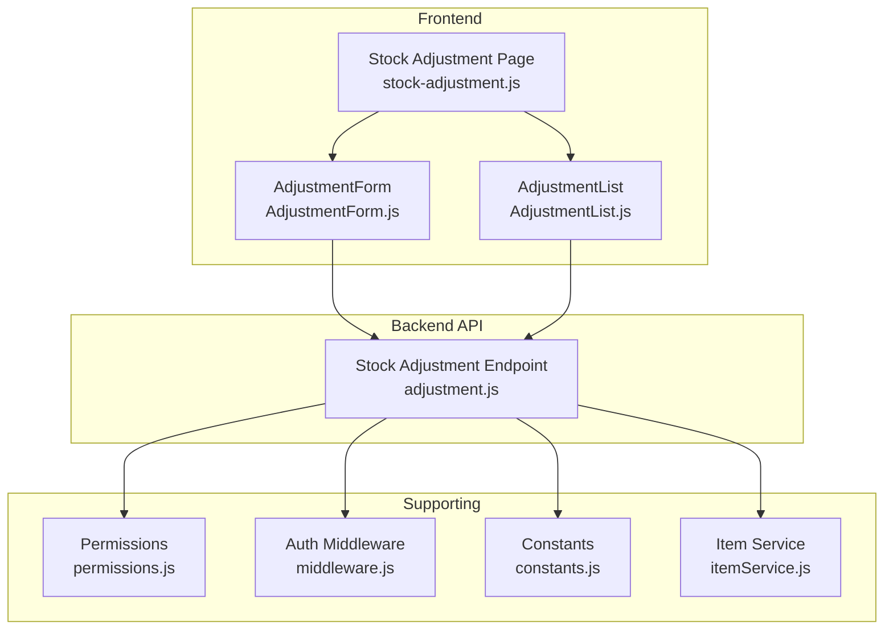
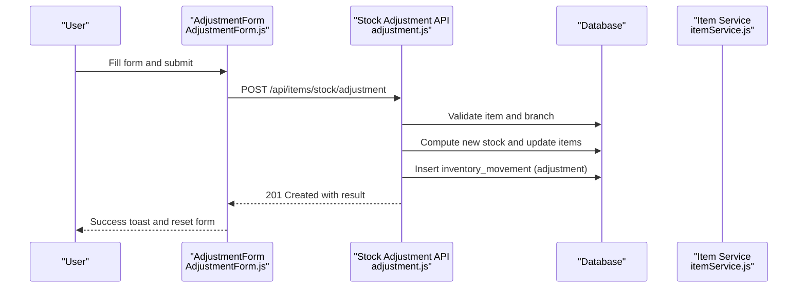
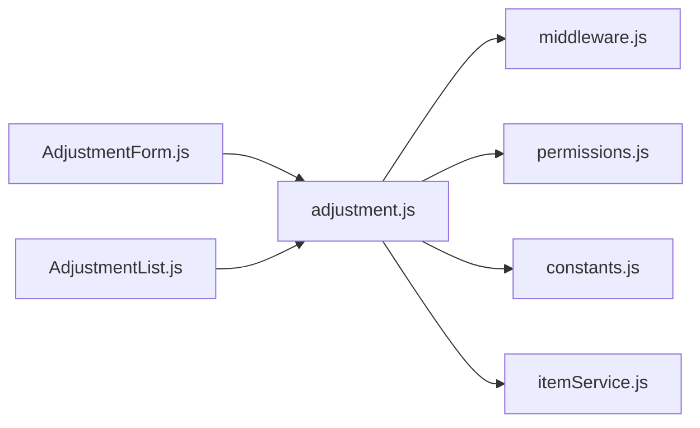

# Stock Adjustments

<cite>
**Referenced Files in This Document**
- [AdjustmentForm.js](file://src/components/items/AdjustmentForm.js)
- [stock-adjustment.js](file://src/pages/items/stock-adjustment.js)
- [adjustment.js](file://src/pages/api/items/stock/adjustment.js)
- [AdjustmentList.js](file://src/components/items/AdjustmentList.js)
- [permissions.js](file://src/lib/permissions.js)
- [middleware.js](file://src/lib/middleware.js)
- [constants.js](file://src/lib/constants.js)
- [itemService.js](file://src/services/itemService.js)
- [StockOut.js](file://src/components/items/StockOut.js)
- [ItemView.js](file://src/components/items/ItemView.js)
</cite>

## Table of Contents
1. [Introduction](#introduction)
2. [Project Structure](#project-structure)
3. [Core Components](#core-components)
4. [Architecture Overview](#architecture-overview)
5. [Detailed Component Analysis](#detailed-component-analysis)
6. [Dependency Analysis](#dependency-analysis)
7. [Performance Considerations](#performance-considerations)
8. [Troubleshooting Guide](#troubleshooting-guide)
9. [Conclusion](#conclusion)
10. [Appendices](#appendices)

## Introduction
This document explains the stock adjustment functionality for correcting inventory discrepancies and recording non-transactional stock changes. It covers how users initiate adjustments, the backend API behavior, the impact on item stock levels and movement history, permission requirements, and best practices for physical inventory counts. It also highlights audit trail considerations and common issues.

## Project Structure
The stock adjustment feature spans the frontend UI and the backend API:
- Frontend page and components: AdjustmentForm, AdjustmentList, and the Items page wrapper
- Backend API: stock adjustment endpoint handling creation and listing adjustments
- Supporting libraries: permissions, middleware, constants, and item service utilities

**Diagram sources**
- [stock-adjustment.js](file://src/pages/items/stock-adjustment.js#L1-L60)
- [AdjustmentForm.js](file://src/components/items/AdjustmentForm.js#L1-L327)
- [AdjustmentList.js](file://src/components/items/AdjustmentList.js#L1-L370)
- [adjustment.js](file://src/pages/api/items/stock/adjustment.js#L1-L257)
- [permissions.js](file://src/lib/permissions.js#L1-L390)
- [middleware.js](file://src/lib/middleware.js#L1-L114)
- [constants.js](file://src/lib/constants.js#L422-L440)
- [itemService.js](file://src/services/itemService.js#L304-L370)

**Section sources**
- [stock-adjustment.js](file://src/pages/items/stock-adjustment.js#L1-L60)
- [AdjustmentForm.js](file://src/components/items/AdjustmentForm.js#L1-L327)
- [AdjustmentList.js](file://src/components/items/AdjustmentList.js#L1-L370)
- [adjustment.js](file://src/pages/api/items/stock/adjustment.js#L1-L257)
- [permissions.js](file://src/lib/permissions.js#L1-L390)
- [middleware.js](file://src/lib/middleware.js#L1-L114)
- [constants.js](file://src/lib/constants.js#L422-L440)
- [itemService.js](file://src/services/itemService.js#L304-L370)

## Core Components
- AdjustmentForm: Collects item, adjustment type, quantity, reason, notes, and movement date; validates inputs; submits to the API; previews the effect on stock.
- AdjustmentList: Fetches and displays historical adjustments with filtering, sorting, and pagination.
- Stock Adjustment API: Validates inputs, updates item stock, and records an inventory movement entry.
- Permissions and Middleware: Enforce authentication and permission checks for inventory operations.
- Item Service: Provides utilities for stock movement creation and querying.

Key behaviors:
- Adjustment types supported: set to quantity, increase by, decrease by
- Reason codes: Physical Count, Damage, Expired, Lost, Found, Other
- Movement date defaults to today and is validated to be in the past or present
- On success, the API updates item stock and creates an inventory movement record

**Section sources**
- [AdjustmentForm.js](file://src/components/items/AdjustmentForm.js#L143-L178)
- [AdjustmentForm.js](file://src/components/items/AdjustmentForm.js#L214-L278)
- [AdjustmentList.js](file://src/components/items/AdjustmentList.js#L1-L120)
- [adjustment.js](file://src/pages/api/items/stock/adjustment.js#L29-L165)
- [itemService.js](file://src/services/itemService.js#L304-L370)

## Architecture Overview
The adjustment flow involves the UI submitting a request to the API, which validates inputs, updates item stock, and logs the movement.

**Diagram sources**
- [AdjustmentForm.js](file://src/components/items/AdjustmentForm.js#L94-L141)
- [adjustment.js](file://src/pages/api/items/stock/adjustment.js#L29-L165)
- [itemService.js](file://src/services/itemService.js#L304-L370)

## Detailed Component Analysis

### AdjustmentForm Component
Responsibilities:
- Loads items filtered by company and inventory tracking
- Validates required fields and quantity constraints
- Computes preview of stock change and final stock
- Submits adjustment payload to the API endpoint
- Resets form and triggers completion callback on success

Adjustment types and reasons:
- Types: set, increase, decrease
- Reasons: Physical Count, Damage, Expired, Lost, Found, Other

Preview logic:
- Based on selected item’s current stock and chosen adjustment type, computes stock change and new stock

Submission payload:
- company_id, item_id, adjustment_type, quantity, reason, notes, movement_date

Success handling:
- Clears form fields, shows success toast, and invokes onComplete

Common validations:
- Item selection required
- Quantity must be zero or positive
- Reason required

**Section sources**
- [AdjustmentForm.js](file://src/components/items/AdjustmentForm.js#L1-L120)
- [AdjustmentForm.js](file://src/components/items/AdjustmentForm.js#L143-L178)
- [AdjustmentForm.js](file://src/components/items/AdjustmentForm.js#L214-L278)
- [AdjustmentForm.js](file://src/components/items/AdjustmentForm.js#L94-L141)

### Stock Adjustment API
Endpoint: POST /api/items/stock/adjustment and GET /api/items/stock/adjustment

Behavior:
- Validates presence of company_id, item_id, adjustment_type, and quantity
- Optionally validates branch_id against company
- Ensures item tracks inventory
- Calculates new stock based on adjustment type
- Updates item stock and available stock
- Inserts inventory movement record with movement_type=adjustment
- Returns success with item_id, old/new stock, change, type, branch_id, and movement_id

Listing adjustments:
- GET supports filters: company_id, branch_id, item_id, date_from, date_to, pagination
- Returns paginated results ordered by movement_date and created_at

**Section sources**
- [adjustment.js](file://src/pages/api/items/stock/adjustment.js#L29-L165)
- [adjustment.js](file://src/pages/api/items/stock/adjustment.js#L167-L255)

### AdjustmentList Component
Responsibilities:
- Fetches inventory movements filtered by movement_type=adjustment
- Supports search, date range filters, pagination, and sorting
- Displays adjustment history with computed type (Increase/Decrease/No Change), stock before/after, reference number, and notes
- Uses authenticatedFetch to call /api/items/stock/movement

Sorting and pagination:
- Sort by movement_date (desc) and created_at (desc)
- Page size configurable with default options

**Section sources**
- [AdjustmentList.js](file://src/components/items/AdjustmentList.js#L1-L120)
- [AdjustmentList.js](file://src/components/items/AdjustmentList.js#L167-L290)

### Permission Requirements and Middleware
- Required permissions:
  - MANAGE_INVENTORY
  - ADJUST_STOCK
- Middleware enforces:
  - Authentication via token
  - Active user and active company
  - Permission check for required permission

Note: The API handler applies withAuth but does not explicitly enforce permissions. The UI page and components rely on the app layout and user context. If stricter enforcement is desired, the API handler can be wrapped with withPermission.

**Section sources**
- [permissions.js](file://src/lib/permissions.js#L32-L40)
- [middleware.js](file://src/lib/middleware.js#L1-L114)
- [adjustment.js](file://src/pages/api/items/stock/adjustment.js#L1-L20)

### Impact on Stock Levels and Movement History
- Stock update:
  - New stock computed from adjustment_type and quantity
  - Item current_stock updated; available_stock recalculated as max(0, current_stock - reserved_stock)
- Movement history:
  - inventory_movements row inserted with movement_type=adjustment
  - Fields include item_id, item_code, branch_id, quantity, reference_type, reference_number, stock_before, stock_after, notes, movement_date

Related utilities:
- itemService.createStockMovement supports movement_type=in/out/adjustment and updates item stock accordingly

**Section sources**
- [adjustment.js](file://src/pages/api/items/stock/adjustment.js#L82-L157)
- [itemService.js](file://src/services/itemService.js#L304-L370)

### Integration with Stock Out and Item View
- StockOut component demonstrates quantity validation and stock reduction logic for transactional out movements
- ItemView displays stock movements for an item, including movement_type, reference, quantity, and balance

These components illustrate how adjustments fit into the broader stock movement ecosystem.

**Section sources**
- [StockOut.js](file://src/components/items/StockOut.js#L127-L169)
- [ItemView.js](file://src/components/items/ItemView.js#L358-L424)

## Dependency Analysis
- AdjustmentForm depends on:
  - useAPI for authenticatedFetch
  - constants for success/error messages
  - Select/Input/DatePicker/UI primitives
- AdjustmentList depends on:
  - useAPI for authenticatedFetch
  - constants for pagination options
- API depends on:
  - Supabase admin client for database operations
  - withAuth middleware for authentication
  - itemService for movement utilities
- Permissions and middleware:
  - permissions.js defines permission constants and groups
  - middleware.js provides withAuth and withPermission wrappers

**Diagram sources**
- [AdjustmentForm.js](file://src/components/items/AdjustmentForm.js#L1-L30)
- [AdjustmentList.js](file://src/components/items/AdjustmentList.js#L1-L20)
- [adjustment.js](file://src/pages/api/items/stock/adjustment.js#L1-L20)
- [middleware.js](file://src/lib/middleware.js#L1-L114)
- [permissions.js](file://src/lib/permissions.js#L300-L358)
- [constants.js](file://src/lib/constants.js#L388-L412)
- [itemService.js](file://src/services/itemService.js#L304-L370)

**Section sources**
- [AdjustmentForm.js](file://src/components/items/AdjustmentForm.js#L1-L30)
- [AdjustmentList.js](file://src/components/items/AdjustmentList.js#L1-L20)
- [adjustment.js](file://src/pages/api/items/stock/adjustment.js#L1-L20)
- [middleware.js](file://src/lib/middleware.js#L1-L114)
- [permissions.js](file://src/lib/permissions.js#L300-L358)
- [constants.js](file://src/lib/constants.js#L388-L412)
- [itemService.js](file://src/services/itemService.js#L304-L370)

## Performance Considerations
- API uses Supabase admin client for database operations; ensure indexes exist on frequently queried columns (e.g., items.company_id, inventory_movements.company_id, inventory_movements.item_id, inventory_movements.movement_date).
- Pagination is supported in the adjustment listing; keep page sizes reasonable to avoid large result sets.
- Movement insertion is lightweight; batch operations are not used for adjustments, so frequent small adjustments are acceptable.

[No sources needed since this section provides general guidance]

## Troubleshooting Guide
Common issues and resolutions:
- Unauthorized adjustments:
  - Ensure the user has MANAGE_INVENTORY and ADJUST_STOCK permissions. The middleware enforces authentication and active company status.
- Incorrect adjustment amounts:
  - The form validates quantity ≥ 0 and reason is required. The API validates presence of required fields and item existence.
- Maintaining audit integrity:
  - The API inserts an inventory movement record for each adjustment. While a dedicated audit trail table is used elsewhere, the movement record serves as a stock history entry. For broader audit logs, use the audit trail module.
- Stock going negative:
  - Decrease adjustments are clamped to zero; the API ensures non-negative stock.
- Branch association:
  - If branch_id is provided, it must belong to the same company; otherwise, the API rejects the request.

**Section sources**
- [AdjustmentForm.js](file://src/components/items/AdjustmentForm.js#L56-L80)
- [adjustment.js](file://src/pages/api/items/stock/adjustment.js#L41-L63)
- [adjustment.js](file://src/pages/api/items/stock/adjustment.js#L82-L108)
- [middleware.js](file://src/lib/middleware.js#L1-L114)

## Conclusion
The stock adjustment feature provides a straightforward way to correct inventory discrepancies and record non-transactional stock changes. The UI offers clear previews and validation, while the API enforces data integrity and records movements for auditability. Proper permissions and adherence to best practices for physical inventory counts help maintain accurate stock levels and transparent histories.

[No sources needed since this section summarizes without analyzing specific files]

## Appendices

### Adjustment Types and Reason Codes
- Adjustment types:
  - Set to Quantity
  - Increase by
  - Decrease by
- Reason codes:
  - Physical Count
  - Damage
  - Expired
  - Lost
  - Found
  - Other

**Section sources**
- [AdjustmentForm.js](file://src/components/items/AdjustmentForm.js#L143-L178)

### API Payload and Response
- POST /api/items/stock/adjustment
  - Required fields: company_id, item_id, adjustment_type, quantity
  - Optional fields: branch_id, reason, notes, movement_date
  - Response includes item_id, old_stock, new_stock, stock_change, adjustment_type, branch_id, movement_id
- GET /api/items/stock/adjustment
  - Query params: company_id, branch_id, item_id, date_from, date_to, page, limit
  - Response includes data and pagination metadata

**Section sources**
- [adjustment.js](file://src/pages/api/items/stock/adjustment.js#L29-L165)
- [adjustment.js](file://src/pages/api/items/stock/adjustment.js#L167-L255)

### Best Practices for Physical Inventory Counts
- Conduct counts in a controlled environment and reconcile differences promptly.
- Use “Physical Count” as the reason code for counted adjustments.
- Record notes with details such as discrepancy reasons and reconciled quantities.
- Review AdjustmentList regularly to spot anomalies and investigate variances.
- Ensure users have MANAGE_INVENTORY and ADJUST_STOCK permissions before performing adjustments.

**Section sources**
- [AdjustmentForm.js](file://src/components/items/AdjustmentForm.js#L143-L178)
- [AdjustmentList.js](file://src/components/items/AdjustmentList.js#L1-L120)
- [permissions.js](file://src/lib/permissions.js#L32-L40)