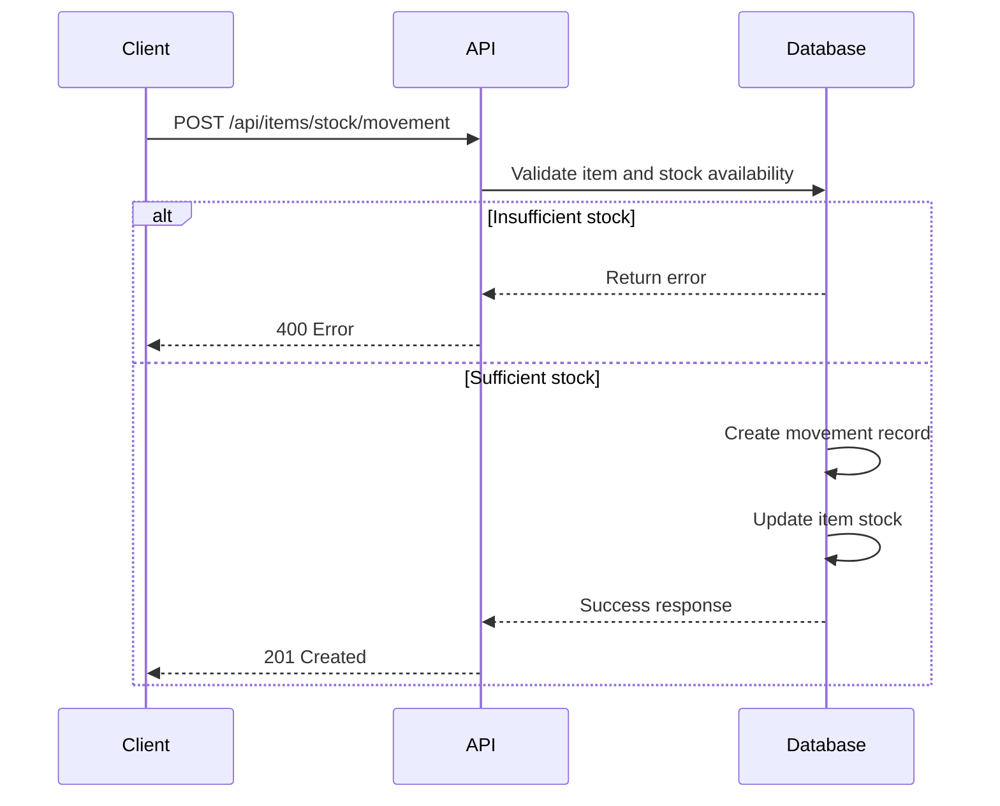
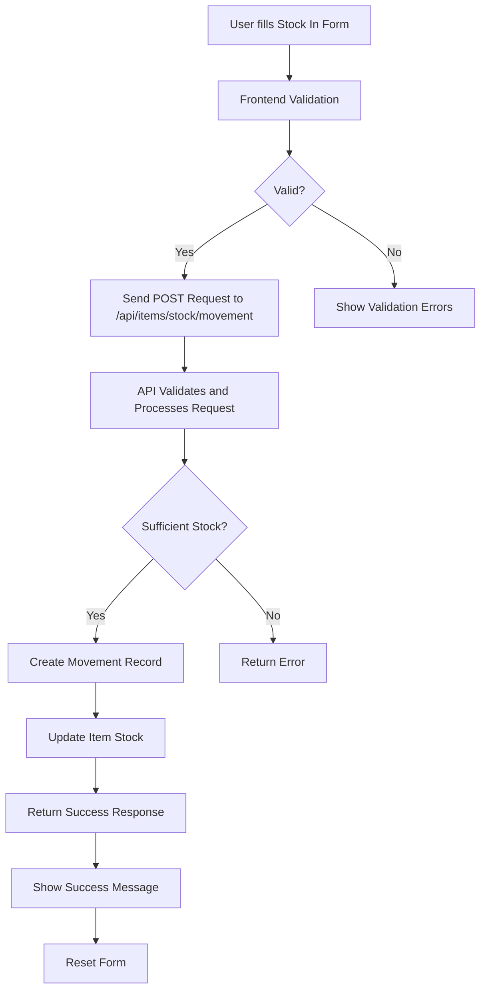
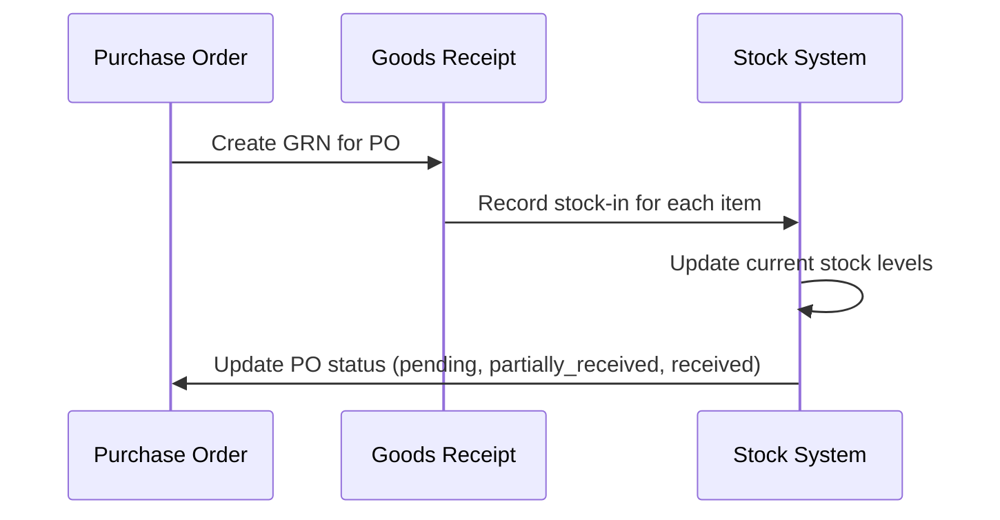

# Stock Tracking

<cite>
**Referenced Files in This Document**   
- [StockIn.js](file://src/components/items/StockIn.js)
- [StockOut.js](file://src/components/items/StockOut.js)
- [movement.js](file://src/pages/api/items/stock/movement.js)
- [current.js](file://src/pages/api/items/stock/current.js)
- [adjustment.js](file://src/pages/api/items/stock/adjustment.js)
- [AdjustmentForm.js](file://src/components/items/AdjustmentForm.js)
- [itemService.js](file://src/services/itemService.js)
- [constants.js](file://src/lib/constants.js)
- [index.js](file://src/pages/api/purchase/grn/index.js)
- [index.js](file://src/pages/api/sales/sales-orders/index.js)
</cite>

## Table of Contents
1. [Introduction](#introduction)
2. [Stock Movement Operations](#stock-movement-operations)
3. [Database Recording of Stock Movements](#database-recording-of-stock-movements)
4. [Integration with Stock Movement Forms and API Endpoints](#integration-with-stock-movement-forms-and-api-endpoints)
5. [Real-time Updates and Negative Inventory Prevention](#real-time-updates-and-negative-inventory-prevention)
6. [Relationship with Sales and Purchase Modules](#relationship-with-sales-and-purchase-modules)
7. [Common Issues and Reconciliation](#common-issues-and-reconciliation)
8. [Performance Considerations](#performance-considerations)

## Introduction
The stock tracking functionality in EzBillify v1 provides a comprehensive system for managing inventory levels through explicit stock-in and stock-out operations. The system enables businesses to maintain accurate inventory records by tracking every movement of stock, whether through purchases, sales, production, or adjustments. This documentation details how the system records stock movements in the database, integrates with user interfaces, prevents negative inventory, and connects with other business modules like sales and purchase.

**Section sources**
- [StockIn.js](file://src/components/items/StockIn.js#L1-L341)
- [StockOut.js](file://src/components/items/StockOut.js#L1-L495)

## Stock Movement Operations
The system supports two primary stock movement operations: stock-in and stock-out. These operations are facilitated through dedicated components that provide user-friendly interfaces for recording inventory changes.

### Stock-In Operations
The `StockIn.js` component allows users to add inventory to their stock. Users can select an item, specify the quantity and rate, and choose a reference type such as purchase, production, sales return, transfer in, opening stock, stock adjustment, or other. The form displays the current stock level and provides a preview of the new stock level after the transaction.

Key features of the stock-in operation:
- Item selection with current stock information
- Quantity and rate input with validation
- Reference type selection for categorizing the transaction
- Movement date selection (restricted to current or past dates)
- Location and notes fields for additional context
- Real-time calculation of total value
- Stock impact preview showing current, added, and new stock levels

### Stock-Out Operations
The `StockOut.js` component enables users to issue inventory from their stock. Similar to stock-in, users select an item, specify quantity and rate, and choose a reference type such as sales, production use, damage/wastage, purchase return, transfer out, internal consumption, stock adjustment, or other.

Key features of the stock-out operation:
- Item selection filtered to show only items with available stock
- Quantity validation to prevent issuing more than available stock
- Warning when requested quantity exceeds available stock
- Confirmation prompt when stock will fall below reorder level
- Real-time calculation of total value
- Stock impact preview showing current, issued, and remaining stock levels
- Visual indicators for low stock situations

**Section sources**
- [StockIn.js](file://src/components/items/StockIn.js#L1-L341)
- [StockOut.js](file://src/components/items/StockOut.js#L1-L495)

## Database Recording of Stock Movements
Stock movements are recorded in the database through a structured process that ensures data integrity and traceability.

### Database Schema
The system uses two primary tables for stock tracking:
- `items` table: Stores item master data including current_stock, reserved_stock, available_stock, reorder_level, and max_stock_level
- `inventory_movements` table: Records all stock movements with details including movement_type (in, out, adjustment), quantity, rate, value, reference_type, reference_number, stock_before, stock_after, and movement_date

### Stock Movement API Endpoint
The `/api/items/stock/movement` endpoint handles both creation and retrieval of stock movements. When a new movement is created, the system:

1. Validates required fields (company_id, item_id, movement_type, quantity)
2. Retrieves the current item record
3. Validates that the item tracks inventory
4. Calculates the new stock level based on movement type
5. For stock-out movements, checks that sufficient stock is available
6. Creates a movement record in the inventory_movements table
7. Updates the item's current_stock and available_stock fields



**Diagram sources **
- [movement.js](file://src/pages/api/items/stock/movement.js#L1-L309)

### Current Stock API Endpoint
The `/api/items/stock/current` endpoint retrieves current stock levels for items. It supports filtering by company, category, search term, and stock status (low-stock, out-of-stock, in-stock). The endpoint returns item details along with stock statistics including total items, low stock items, out-of-stock items, and total stock value.

**Section sources**
- [movement.js](file://src/pages/api/items/stock/movement.js#L1-L309)
- [current.js](file://src/pages/api/items/stock/current.js#L1-L182)

## Integration with Stock Movement Forms and API Endpoints
The stock movement forms are tightly integrated with the underlying API endpoints through a consistent pattern of data flow and validation.

### Form to API Integration
Both StockIn and StockOut components use the `useAPI` hook to communicate with the backend. When a user submits a form:

1. Frontend validation ensures all required fields are filled and values are valid
2. The form data is sent to the `/api/items/stock/movement` endpoint via POST request
3. The API processes the request and returns a response
4. The frontend displays appropriate success or error messages
5. On success, the form is reset and completion callback is triggered

### Data Flow Example


**Diagram sources **
- [StockIn.js](file://src/components/items/StockIn.js#L1-L341)
- [StockOut.js](file://src/components/items/StockOut.js#L1-L495)
- [movement.js](file://src/pages/api/items/stock/movement.js#L1-L309)

**Section sources**
- [StockIn.js](file://src/components/items/StockIn.js#L1-L341)
- [StockOut.js](file://src/components/items/StockOut.js#L1-L495)
- [movement.js](file://src/pages/api/items/stock/movement.js#L1-L309)

## Real-time Updates and Negative Inventory Prevention
The system implements several mechanisms to ensure real-time updates and prevent negative inventory levels.

### Real-time Updates
The system provides real-time feedback to users through:
- Immediate validation of quantity against available stock
- Stock impact previews showing the effect of the transaction
- Warning messages when stock will fall below reorder level
- Visual indicators for low stock situations

### Negative Inventory Prevention
The system prevents negative inventory through multiple layers of validation:

1. **Frontend Validation**: The StockOut form checks available stock when quantity is entered and disables the submit button if insufficient stock is available.

2. **Backend Validation**: The API endpoint performs a final check before processing the movement:
```javascript
if (movement_type === 'out') {
  if (currentStock < quantityValue) {
    return res.status(400).json({
      success: false,
      error: `Insufficient stock. Available: ${currentStock}, Required: ${quantityValue}`
    })
  }
  newStock = currentStock - quantityValue
}
```

3. **Transaction Safety**: The system uses a two-step process with error handling to ensure data consistency:
   - First, create the movement record
   - Then, update the item stock
   - If stock update fails, rollback the movement record

### Stock Adjustment Functionality
The system also provides a stock adjustment feature through the `AdjustmentForm.js` component and `/api/items/stock/adjustment` endpoint. This allows users to:
- Set stock to a specific quantity
- Increase stock by a specified amount
- Decrease stock by a specified amount
- Provide a reason for the adjustment

The adjustment process follows the same validation and transaction safety principles as regular stock movements.

**Section sources**
- [StockOut.js](file://src/components/items/StockOut.js#L1-L495)
- [movement.js](file://src/pages/api/items/stock/movement.js#L1-L309)
- [adjustment.js](file://src/pages/api/items/stock/adjustment.js#L1-L257)
- [AdjustmentForm.js](file://src/components/items/AdjustmentForm.js#L1-L327)

## Relationship with Sales and Purchase Modules
The stock tracking system is deeply integrated with the sales and purchase modules to ensure inventory levels are updated automatically when business transactions occur.

### Integration with Purchase Module
When a Goods Receipt Note (GRN) is created in the purchase module, it triggers stock-in operations:

1. The GRN records the receipt of goods against a purchase order
2. For each item in the GRN, a stock-in movement is recorded
3. The item's current stock is increased by the received quantity
4. The system updates the purchase order status based on received quantities



**Diagram sources **
- [index.js](file://src/pages/api/purchase/grn/index.js#L1-L467)

### Integration with Sales Module
The sales module integrates with stock tracking through sales orders and invoices:

1. **Sales Orders**: When a sales order is created, the system reserves stock for the ordered items:
   - Reserved stock is deducted from available stock
   - Current stock remains unchanged until delivery
   - This prevents overselling by showing accurate available stock

2. **Delivery**: When goods are delivered against a sales order, a stock-out movement is recorded:
   - The reserved stock is converted to actual stock reduction
   - Current stock is decreased by the delivered quantity
   - Available stock is updated accordingly

The reservation system ensures that inventory is properly managed throughout the sales process, from order placement to delivery.

**Section sources**
- [index.js](file://src/pages/api/purchase/grn/index.js#L1-L467)
- [index.js](file://src/pages/api/sales/sales-orders/index.js#L1-L625)

## Common Issues and Reconciliation
The system addresses several common inventory management issues and provides tools for reconciliation.

### Timing of Stock Updates
The system handles the timing of stock updates through a clear separation between order and delivery:
- Sales orders reserve stock but don't reduce current stock
- Stock reduction occurs only when goods are actually delivered
- This approach prevents premature stock reduction and allows for order modifications

### Handling Partial Deliveries
The system supports partial deliveries through the GRN process:
- Multiple GRNs can be created against a single purchase order
- Each GRN records the actual quantity received
- Stock is updated incrementally as goods are received
- Purchase order status reflects the cumulative received quantity

### Reconciliation of Physical vs System Stock
The system provides several features to facilitate stock reconciliation:
- **Stock Adjustment Form**: Allows manual adjustment of stock levels with required reason documentation
- **Stock Movement History**: Provides a complete audit trail of all stock movements
- **Low Stock Reports**: Identifies items that may need physical verification
- **Stock Status Filters**: Enables filtering by low-stock, out-of-stock, and in-stock items for targeted reconciliation

The adjustment process requires users to specify a reason for the adjustment, ensuring proper documentation of discrepancies between physical and system stock.

**Section sources**
- [AdjustmentForm.js](file://src/components/items/AdjustmentForm.js#L1-L327)
- [movement.js](file://src/pages/api/items/stock/movement.js#L1-L309)
- [current.js](file://src/pages/api/items/stock/current.js#L1-L182)

## Performance Considerations
The system is designed to handle high-volume stock movement operations efficiently.

### Database Optimization
- Indexes on key fields like company_id, item_id, and movement_date enable fast queries
- Pagination is implemented for large datasets to prevent performance issues
- Count queries are used to provide accurate pagination information

### API Design
- The API endpoints are optimized for bulk operations
- Error handling includes rollback mechanisms to maintain data integrity
- Validation is performed at multiple levels to prevent invalid data

### Frontend Performance
- The stock movement forms are optimized for quick data entry
- Real-time validation reduces round trips to the server
- Stock impact previews help prevent errors before submission

For high-volume operations, the system could be further optimized by:
- Implementing batch processing for multiple stock movements
- Adding caching for frequently accessed stock data
- Optimizing database queries for large inventories

**Section sources**
- [movement.js](file://src/pages/api/items/stock/movement.js#L1-L309)
- [current.js](file://src/pages/api/items/stock/current.js#L1-L182)
- [itemService.js](file://src/services/itemService.js#L1-L504)