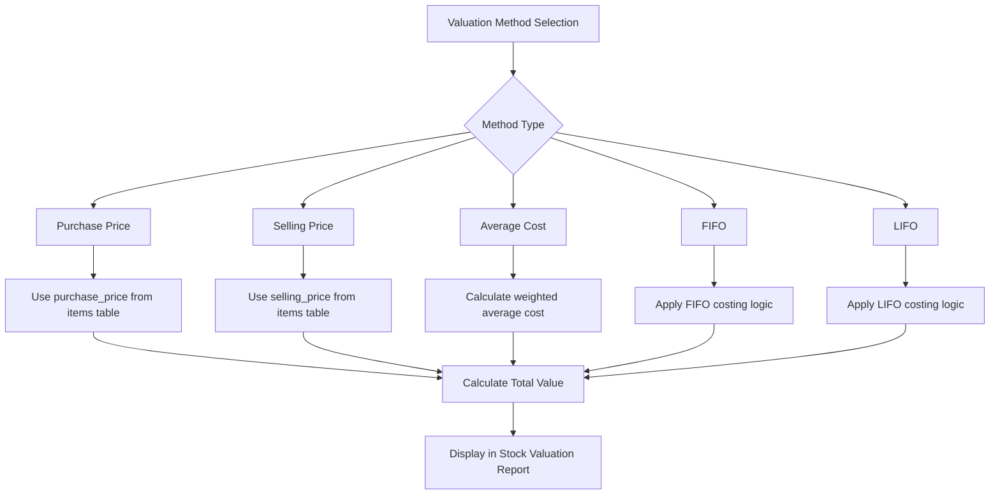
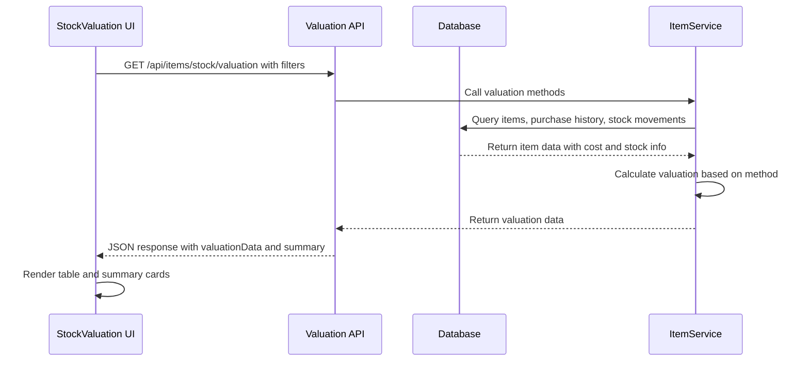
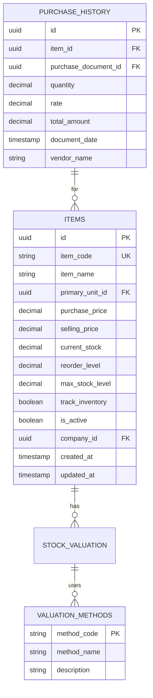

# Stock Valuation

<cite>
**Referenced Files in This Document**   
- [StockValuation.js](file://src/components/items/StockValuation.js)
- [current.js](file://src/pages/api/items/stock/current.js)
- [db.js](file://src/lib/db.js)
- [supabase.js](file://src/services/utils/supabase.js)
- [itemService.js](file://src/services/itemService.js)
</cite>

## Table of Contents
1. [Introduction](#introduction)
2. [Valuation Methods](#valuation-methods)
3. [Implementation Overview](#implementation-overview)
4. [Data Flow and Integration](#data-flow-and-integration)
5. [Stock Valuation Report](#stock-valuation-report)
6. [Accounting Integration](#accounting-integration)
7. [Common Issues and Solutions](#common-issues-and-solutions)
8. [Best Practices](#best-practices)
9. [Conclusion](#conclusion)

## Introduction

The stock valuation functionality in EzBillify v1 provides a comprehensive system for calculating inventory value using various cost-based methods. This system enables businesses to accurately determine the value of their inventory for financial reporting purposes, particularly for inclusion in balance sheets and other financial statements. The implementation allows users to analyze inventory value using different costing methodologies including purchase price, selling price, average cost, FIFO, and LIFO methods.

The stock valuation system is tightly integrated with the accounting module, ensuring that inventory values flow seamlessly into financial reports. It leverages item cost data, current stock levels, and configurable valuation methods to provide accurate and consistent inventory valuation across the organization.

**Section sources**
- [StockValuation.js](file://src/components/items/StockValuation.js#L1-L378)

## Valuation Methods

The system supports multiple inventory valuation methods to accommodate different accounting practices and business requirements:

- **Purchase Price**: Uses the cost at which items were purchased from suppliers
- **Selling Price**: Uses the price at which items are sold to customers
- **Average Cost**: Calculates the weighted average cost of all units available for sale during the period
- **FIFO (First-In, First-Out)**: Assumes that the oldest inventory items are sold first
- **LIFO (Last-In, First-Out)**: Assumes that the most recently acquired items are sold first

These methods are implemented through the valuation method filter in the StockValuation component, allowing users to switch between different costing approaches based on their accounting policies and requirements.

The choice of valuation method significantly impacts financial statements, particularly during periods of inflation or deflation, as it affects the cost of goods sold and ending inventory values reported on the balance sheet.

**Diagram sources**
- [StockValuation.js](file://src/components/items/StockValuation.js#L121-L127)
- [current.js](file://src/pages/api/items/stock/current.js#L50-L64)

## Implementation Overview

The stock valuation functionality is implemented as a React component (StockValuation.js) that interacts with a backend API to fetch valuation data. The frontend component provides a user interface for filtering and viewing inventory valuation data, while the backend handles the actual calculation logic.

The StockValuation component accepts a companyId prop and uses hooks for API communication and toast notifications. It maintains state for valuation data, summary statistics, filters, and categories. The component fetches data whenever filters change, providing a responsive user experience.

Key features of the implementation include:
- Real-time filtering by search term, category, and valuation method
- Option to show or hide zero stock items
- Export functionality for generating Excel reports
- Visual indicators for valuation amounts based on value thresholds
- Responsive design with summary cards showing total items, quantity, value, and average value

The component makes API calls to `/api/items/stock/valuation` with query parameters including the selected valuation method, search terms, category filters, and company ID to retrieve the appropriate valuation data.

**Section sources**
- [StockValuation.js](file://src/components/items/StockValuation.js#L1-L378)

## Data Flow and Integration

The stock valuation system follows a clear data flow from the database through the API layer to the frontend presentation:

**Diagram sources**
- [StockValuation.js](file://src/components/items/StockValuation.js#L38-L51)
- [current.js](file://src/pages/api/items/stock/current.js#L5-L182)

The system retrieves item data from the database, including current stock levels, purchase prices, and other relevant information. The valuation calculation is performed server-side to ensure consistency and security, with the results returned to the frontend for display.

The integration with the accounting module occurs through shared data models and consistent cost calculations that are used across both inventory management and financial reporting functions. This ensures that the inventory values calculated for stock valuation are the same values that appear in financial statements.

## Stock Valuation Report

The stock valuation report provides a detailed breakdown of inventory value with the following columns:
- **Item**: Displaying the item name and code
- **Category**: The category to which the item belongs
- **Stock Qty**: Current stock quantity with unit symbol
- **Unit Rate**: Valuation rate based on the selected method
- **Total Value**: Calculated as stock quantity multiplied by unit rate
- **% of Total**: Percentage contribution to overall inventory value with visual bar

The report includes summary statistics displayed as cards at the top:
- Total Items: Count of inventory items
- Total Quantity: Sum of all stock quantities
- Total Value: Aggregate value of all inventory
- Avg. Value/Item: Mean value per inventory item

Users can export the report to Excel format for further analysis or record-keeping. The export functionality creates a downloadable XLSX file with a timestamped filename.

**Diagram sources**
- [StockValuation.js](file://src/components/items/StockValuation.js#L282-L308)
- [current.js](file://src/pages/api/items/stock/current.js#L50-L64)

## Accounting Integration

The stock valuation system integrates with the accounting module to ensure that inventory values are accurately reflected in financial statements. The total inventory value calculated by the stock valuation system flows directly into the balance sheet under current assets.

When valuation methods like FIFO or weighted average are used, the system ensures that cost of goods sold calculations in the profit and loss statement are consistent with the inventory valuation approach. This creates a cohesive accounting system where inventory valuation, cost of goods sold, and financial reporting are aligned.

The integration also supports periodic valuation runs, allowing businesses to perform inventory valuation at the end of accounting periods for financial closing. The system can reconcile inventory values with physical counts, identifying discrepancies that need to be addressed before finalizing financial statements.

For businesses using different valuation methods for tax and financial reporting purposes, the system can generate multiple valuation reports simultaneously, providing flexibility in financial reporting.

**Section sources**
- [StockValuation.js](file://src/components/items/StockValuation.js#L17-L22)
- [current.js](file://src/pages/api/items/stock/current.js#L148-L151)

## Common Issues and Solutions

### Outdated Cost Prices
When item cost prices are not updated after new purchases, valuation accuracy suffers. The system addresses this by:
- Encouraging regular updates to purchase prices
- Providing purchase history visibility in item details
- Allowing recalculation of average costs based on recent purchases

### Valuation Discrepancies
Differences between system valuation and physical counts can occur due to:
- Unrecorded stock movements
- Theft or damage
- Data entry errors

The solution involves regular reconciliation processes and audit trails of stock movements.

### Items with Zero Cost
Items without cost prices (zero or null) can distort valuation reports. The system handles this by:
- Validating cost prices during item creation
- Providing warnings for items with zero cost
- Allowing temporary valuation methods for zero-cost items

### Method Selection Errors
Using inappropriate valuation methods for certain inventory types can lead to inaccurate financial reporting. Best practice is to:
- Establish a consistent valuation policy
- Document the rationale for method selection
- Apply the same method consistently across similar inventory categories

**Section sources**
- [StockValuation.js](file://src/components/items/StockValuation.js#L101-L109)
- [current.js](file://src/pages/api/items/stock/current.js#L148-L151)

## Best Practices

To ensure accurate and reliable stock valuation, follow these best practices:

1. **Regular Valuation Runs**: Perform stock valuation at consistent intervals (monthly, quarterly) to maintain accurate financial records.

2. **Method Consistency**: Choose a valuation method appropriate for your business and apply it consistently across similar inventory categories.

3. **Cost Price Maintenance**: Regularly update purchase prices when new inventory is acquired to ensure valuation accuracy.

4. **Reconciliation**: Periodically reconcile system inventory values with physical counts to identify and correct discrepancies.

5. **Audit Trails**: Maintain complete records of stock movements and valuation calculations for audit purposes.

6. **Training**: Ensure staff responsible for inventory management understand the valuation methods and their impact on financial statements.

7. **Documentation**: Document your inventory valuation policy and procedures for consistency and compliance.

8. **System Integration**: Ensure tight integration between purchasing, inventory management, and accounting systems to maintain data consistency.

**Section sources**
- [StockValuation.js](file://src/components/items/StockValuation.js#L25-L30)
- [current.js](file://src/pages/api/items/stock/current.js#L29-L36)

## Conclusion

The stock valuation functionality in EzBillify v1 provides a robust and flexible system for calculating inventory value using multiple costing methods. By integrating with the accounting module, it ensures that inventory values are accurately reflected in financial statements, supporting sound financial reporting and decision-making.

The implementation balances user-friendly interface design with comprehensive backend calculations, allowing businesses to choose the valuation method that best suits their accounting practices. With features like export capabilities, filtering options, and visual data representation, the system supports both operational inventory management and strategic financial planning.

By following best practices in inventory valuation and maintaining data accuracy, businesses can leverage this functionality to gain valuable insights into their inventory investment and improve overall financial management.