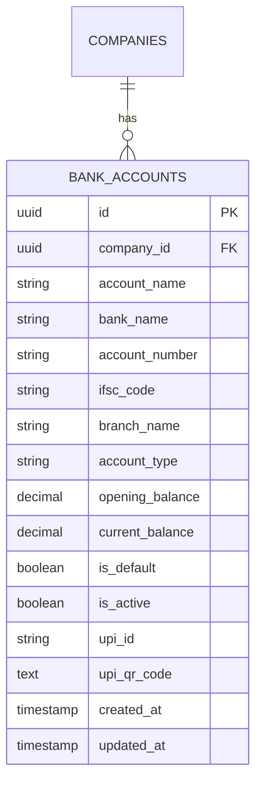
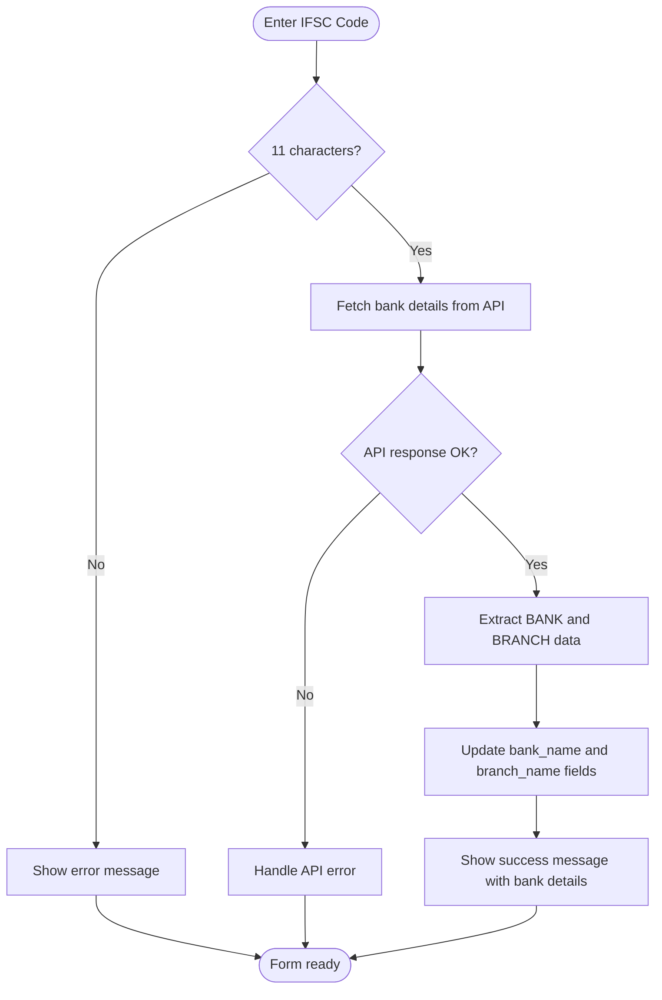
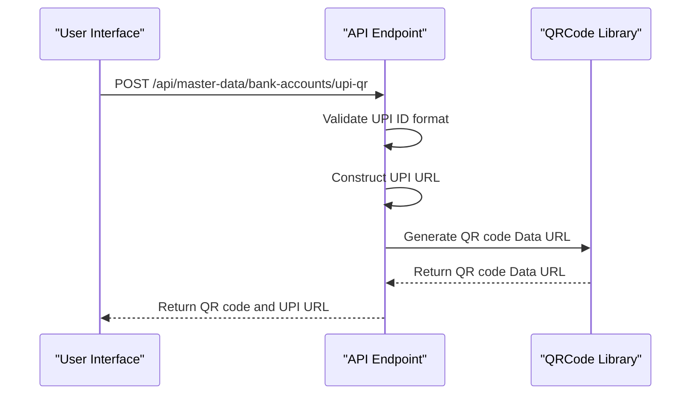
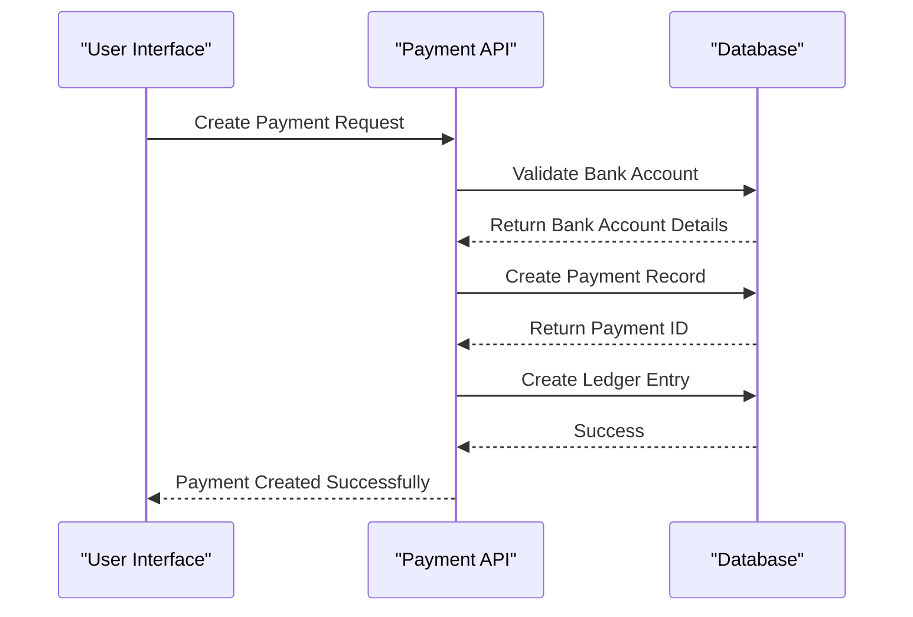

# Bank Accounts Management

<cite>
**Referenced Files in This Document**   
- [20241105_add_upi_fields_to_bank_accounts.sql](file://database/migrations/20241105_add_upi_fields_to_bank_accounts.sql)
- [BankAccountForm.js](file://src/components/master-data/BankAccountForm.js)
- [BankAccountList.js](file://src/components/master-data/BankAccountList.js)
- [bank-accounts/index.js](file://src/pages/api/master-data/bank-accounts/index.js)
- [bank-accounts/[id].js](file://src/pages/api/master-data/bank-accounts/[id].js)
- [bank-accounts/upi-qr.js](file://src/pages/api/master-data/bank-accounts/upi-qr.js)
- [UPIQRCode.js](file://src/components/master-data/UPIQRCode.js)
- [supabase.js](file://src/services/utils/supabase.js)
- [middleware.js](file://src/lib/middleware.js)
- [PaymentForm.js](file://src/components/sales/PaymentForm.js)
- [index.js](file://src/pages/api/sales/payments/index.js)
</cite>

## Table of Contents
1. [Introduction](#introduction)
2. [Database Schema](#database-schema)
3. [Bank Account Configuration](#bank-account-configuration)
4. [UPI Integration](#upi-integration)
5. [API Endpoints](#api-endpoints)
6. [Payment Processing Integration](#payment-processing-integration)
7. [Security Considerations](#security-considerations)
8. [Practical Examples](#practical-examples)
9. [Troubleshooting](#troubleshooting)
10. [Conclusion](#conclusion)

## Introduction
The Bank Accounts Management system in ezbillify-v1 provides comprehensive functionality for managing business banking information, including account details, IFSC codes, and UPI integration capabilities. This system enables businesses to securely store and manage their bank accounts, generate UPI QR codes for payments, and integrate with sales and purchase modules for seamless payment processing. The implementation follows a robust architecture with proper validation, security measures, and user-friendly interfaces for efficient financial management.

**Section sources**
- [BankAccountForm.js](file://src/components/master-data/BankAccountForm.js#L1-L416)
- [BankAccountList.js](file://src/components/master-data/BankAccountList.js#L1-L360)

## Database Schema
The bank accounts management system uses a dedicated table in the PostgreSQL database with comprehensive fields to store all necessary banking information. The schema has been extended to support UPI payments with additional fields for UPI ID and QR code storage.



The migration file `20241105_add_upi_fields_to_bank_accounts.sql` adds two critical fields to support UPI payments:
- `upi_id`: Stores the UPI ID for the bank account (e.g., username@bank)
- `upi_qr_code`: Stores the generated UPI QR code for the account

An index is created on the `upi_id` field for faster lookups, and data consistency is maintained by updating empty string values to NULL.

**Diagram sources**
- [20241105_add_upi_fields_to_bank_accounts.sql](file://database/migrations/20241105_add_upi_fields_to_bank_accounts.sql#L1-L28)

**Section sources**
- [20241105_add_upi_fields_to_bank_accounts.sql](file://database/migrations/20241105_add_upi_fields_to_bank_accounts.sql#L1-L28)

## Bank Account Configuration
The system provides a comprehensive interface for configuring bank accounts with validation rules and auto-fetch capabilities for bank details.

### Account Details and Validation
The BankAccountForm component allows users to configure essential bank account information with the following fields:
- **Account Name**: Required field for identifying the account
- **Account Type**: Selection from current, savings, overdraft, cash credit, or other
- **Bank Name**: Required field, auto-filled from IFSC code
- **Account Number**: Required field with validation
- **IFSC Code**: Required field with format validation and auto-fetch capability
- **Branch Name**: Required field, auto-filled from IFSC code
- **Opening Balance**: Optional field with non-negative validation
- **Default Account**: Checkbox to set as default bank account

### IFSC Code Validation and Auto-Fetch
The system implements robust validation for IFSC codes with the following rules:
- IFSC code must be exactly 11 characters long
- Format: First 4 letters (Bank code) + 0 + Last 6 characters (Branch code)
- Example: SBIN0001234 (State Bank of India)

When a valid 11-character IFSC code is entered, the system automatically fetches bank and branch details from the Razorpay IFSC API (`https://ifsc.razorpay.com/{ifscCode}`). This auto-populates the bank name and branch name fields, reducing manual entry errors.



**Diagram sources**
- [BankAccountForm.js](file://src/components/master-data/BankAccountForm.js#L37-L61)

**Section sources**
- [BankAccountForm.js](file://src/components/master-data/BankAccountForm.js#L37-L84)
- [BankAccountForm.js](file://src/components/master-data/BankAccountForm.js#L85-L90)

## UPI Integration
The system provides comprehensive UPI integration capabilities, allowing businesses to receive payments through the popular UPI system in India.

### UPI ID Configuration
Users can configure a UPI ID for each bank account, which serves as a virtual payment address. The UPI ID format follows the standard pattern: `username@bank` or `username@ybl` or `username@paytm`, etc.

Validation rules for UPI IDs:
- Optional field (not required for all accounts)
- Must match the pattern: /^[a-zA-Z0-9._-]+@[a-zA-Z0-9.-]+$/
- Examples: john@sbi, user@ybl, merchant@paytm

The system provides a user-friendly interface for entering and validating UPI IDs, with helpful placeholder text and error messages for invalid formats.

### UPI QR Code Generation
The system implements a dedicated API endpoint for generating UPI QR codes that can be scanned by any UPI app for making payments.

#### QR Code Generation Process


The UPI QR code generation follows the standard UPI URL format:
```
upi://pay?pa=UPI_ID&pn=PayeeName&am=Amount&cu=INR&tn=Note
```

Where:
- `pa`: Payee's UPI ID
- `pn`: Payee's name (account name)
- `am`: Payment amount (optional)
- `cu`: Currency (INR)
- `tn`: Transaction note (optional)

The QR code is generated with the following specifications:
- Size: 300x300 pixels
- Margin: 2 units
- Colors: Black (dark) and White (light)
- Output format: Data URL (base64 encoded)

### UPI QR Code Display
The UPIQRCode component provides a user-friendly interface for displaying and interacting with UPI QR codes. Users can:
- View the UPI ID in a formatted manner
- Copy the UPI ID to clipboard with a single click
- Generate and view the QR code by clicking the QR icon
- View payment details (account name, amount, note) when the QR code is displayed

The QR code is displayed in a modal overlay that can be closed by clicking the close button or outside the modal.

**Diagram sources**
- [bank-accounts/upi-qr.js](file://src/pages/api/master-data/bank-accounts/upi-qr.js#L1-L75)
- [UPIQRCode.js](file://src/components/master-data/UPIQRCode.js#L1-L126)

**Section sources**
- [bank-accounts/upi-qr.js](file://src/pages/api/master-data/bank-accounts/upi-qr.js#L1-L75)
- [UPIQRCode.js](file://src/components/master-data/UPIQRCode.js#L1-L126)

## API Endpoints
The bank accounts management system exposes a set of RESTful API endpoints for CRUD operations and UPI QR code generation.

### Bank Accounts CRUD Endpoints
The system provides standard CRUD operations for managing bank accounts:

#### GET /api/master-data/bank-accounts
Retrieves a list of all bank accounts for the authenticated company, ordered by default status (descending) and account name.

Request:
```
GET /api/master-data/bank-accounts?company_id={companyId}
Authorization: Bearer {token}
```

Response:
```json
{
  "success": true,
  "data": [
    {
      "id": "uuid",
      "company_id": "uuid",
      "account_name": "Primary Current Account",
      "bank_name": "State Bank of India",
      "account_number": "1234567890123456",
      "ifsc_code": "SBIN0001234",
      "branch_name": "Main Branch",
      "account_type": "current",
      "opening_balance": 0,
      "current_balance": 0,
      "is_default": true,
      "is_active": true,
      "upi_id": "merchant@sbi",
      "upi_qr_code": "data:image/png;base64,...",
      "created_at": "2024-01-01T00:00:00Z",
      "updated_at": "2024-01-01T00:00:00Z"
    }
  ]
}
```

#### POST /api/master-data/bank-accounts
Creates a new bank account for the authenticated company.

Request:
```
POST /api/master-data/bank-accounts
Authorization: Bearer {token}
Content-Type: application/json

{
  "account_name": "Primary Current Account",
  "bank_name": "State Bank of India",
  "account_number": "1234567890123456",
  "ifsc_code": "SBIN0001234",
  "branch_name": "Main Branch",
  "account_type": "current",
  "opening_balance": 0,
  "is_default": true,
  "upi_id": "merchant@sbi"
}
```

Response:
```json
{
  "success": true,
  "data": { /* created bank account */ }
}
```

#### GET /api/master-data/bank-accounts/{id}
Retrieves a specific bank account by ID.

#### PUT /api/master-data/bank-accounts/{id}
Updates an existing bank account. When setting a bank account as default, the system automatically removes the default status from other bank accounts of the same company.

#### DELETE /api/master-data/bank-accounts/{id}
Deletes a bank account only if it has no associated payment transactions. This prevents accidental deletion of accounts with transaction history.

### UPI QR Code Generation Endpoint
#### POST /api/master-data/bank-accounts/upi-qr
Generates a UPI QR code for a given UPI ID, with optional amount and note parameters.

Request:
```
POST /api/master-data/bank-accounts/upi-qr
Authorization: Bearer {token}
Content-Type: application/json

{
  "upi_id": "merchant@sbi",
  "amount": 1000.00,
  "note": "Payment for invoice #INV-001"
}
```

Response:
```json
{
  "success": true,
  "data": {
    "upi_qr_code": "data:image/png;base64,...",
    "upi_url": "upi://pay?pa=merchant@sbi&am=1000.00&cu=INR&tn=Payment%20for%20invoice%20%23INV-001"
  }
}
```

**Section sources**
- [bank-accounts/index.js](file://src/pages/api/master-data/bank-accounts/index.js#L1-L78)
- [bank-accounts/[id].js](file://src/pages/api/master-data/bank-accounts/[id].js#L1-L118)
- [bank-accounts/upi-qr.js](file://src/pages/api/master-data/bank-accounts/upi-qr.js#L1-L75)

## Payment Processing Integration
The bank accounts management system is integrated with both sales and purchase modules for seamless payment processing.

### Sales Module Integration
In the sales module, the PaymentForm component allows users to record payments received from customers. The integration includes:

1. **Bank Account Selection**: Users can select a bank account when recording a payment, with the option to view the UPI ID and generate QR codes.
2. **UPI Payment Method**: When the payment method is set to UPI, the system displays the UPI ID of the selected bank account and provides a button to show the QR code.
3. **Payment Allocation**: Payments can be allocated to specific invoices, with automatic updates to invoice balances and payment statuses.

The payment processing flow ensures that all transactions are properly recorded in the accounting system, with updates to customer balances and ledger entries.

### Purchase Module Integration
In the purchase module, the PaymentMadeForm component allows users to record payments made to vendors. The integration includes:

1. **Bank Account Selection**: Users can select a bank account when making a payment to a vendor.
2. **Payment Method Options**: Multiple payment methods including bank transfer, UPI, cheque, etc.
3. **Bill Payment Allocation**: Payments can be allocated to specific purchase bills, with automatic updates to bill balances and payment statuses.

The integration ensures that all payment transactions are properly recorded in the accounting system, with updates to vendor balances and ledger entries.



**Diagram sources**
- [PaymentForm.js](file://src/components/sales/PaymentForm.js#L1-L800)
- [index.js](file://src/pages/api/sales/payments/index.js#L1-L500)

**Section sources**
- [PaymentForm.js](file://src/components/sales/PaymentForm.js#L1-L800)
- [index.js](file://src/pages/api/sales/payments/index.js#L1-L500)

## Security Considerations
The bank accounts management system implements multiple security measures to protect sensitive banking information.

### Authentication and Authorization
All API endpoints are protected by the `withAuth` middleware, which ensures that:
- Users are authenticated with a valid JWT token
- Users have access to the specified company
- User and company accounts are active
- Requests are properly authorized before processing

The middleware uses Supabase Admin client to bypass Row Level Security (RLS) for server-side operations, ensuring proper access to data while maintaining security.

### Data Validation
The system implements comprehensive validation at multiple levels:
- **Client-side validation**: Immediate feedback for users on form fields
- **Server-side validation**: Ensures data integrity and security
- **Database constraints**: Prevents invalid data storage

### Secure Storage
Banking credentials are stored securely in the database with the following considerations:
- Account numbers are masked in the user interface (showing only last 4 digits)
- Sensitive operations are logged for audit purposes
- Database connections use secure protocols

### Content Security Policy
The system implements a strict Content Security Policy (CSP) that:
- Restricts script sources to prevent XSS attacks
- Controls connect sources to prevent unauthorized API calls
- Implements frame ancestors policy to prevent clickjacking

The CSP allows connections to trusted domains including Supabase, Razorpay IFSC API, and exchange rate APIs.

**Section sources**
- [middleware.js](file://src/lib/middleware.js#L1-L627)
- [supabase.js](file://src/services/utils/supabase.js#L1-L392)

## Practical Examples

### Setting Up a New Bank Account with UPI
1. Navigate to Master Data → Bank Accounts
2. Click "Add Bank Account"
3. Fill in the account details:
   - Account Name: Primary Current Account
   - Account Type: Current Account
   - Bank Name: State Bank of India
   - Account Number: 1234567890123456
   - IFSC Code: SBIN0001234 (auto-fills bank and branch details)
   - Branch Name: Main Branch
   - UPI ID: merchant@sbi
   - Set as Default Account: Checked
4. Click "Add Bank Account"
5. Verify the account appears in the bank accounts list

### Generating a Payment QR Code
1. In the bank accounts list, locate the account with UPI ID
2. Click the QR code icon next to the UPI ID
3. A modal will appear with the QR code and payment details
4. Share the QR code with customers or display it at your business location
5. Customers can scan the QR code with any UPI app to make payment

### Recording a UPI Payment Received
1. Navigate to Sales → Payments
2. Click "Receive Payment"
3. Select the customer
4. Enter the payment date and amount
5. Select "UPI" as the payment method
6. Select the bank account (UPI ID will be displayed)
7. Optionally enter a reference number and notes
8. Allocate the payment to specific invoices if needed
9. Click "Save Payment"

## Troubleshooting

### Invalid Bank Details
**Issue**: IFSC code validation fails
**Solution**: 
- Verify the IFSC code is 11 characters long
- Check the format: First 4 letters + 0 + Last 6 characters
- Use the auto-fetch feature to validate and retrieve bank details
- Example: SBIN0001234 (State Bank of India)

**Issue**: Account number validation fails
**Solution**:
- Ensure the account number is not empty
- Verify the account number does not contain special characters
- Check with your bank for the correct account number format

### QR Code Generation Failures
**Issue**: QR code generation returns an error
**Solution**:
- Verify the UPI ID is in the correct format (username@bank)
- Ensure the UPI ID is not empty
- Check internet connectivity as the QR code generation requires network access
- Verify the UPI ID belongs to a valid bank or payment service

**Issue**: QR code cannot be scanned
**Solution**:
- Ensure the QR code is displayed clearly without distortion
- Check that the UPI app has camera permissions
- Verify the UPI ID in the QR code is correct
- Try regenerating the QR code

### Payment Processing Issues
**Issue**: Cannot delete a bank account
**Solution**:
- Check if the bank account has any associated payment transactions
- Only accounts without transaction history can be deleted
- Consider deactivating the account instead of deleting

**Issue**: Bank account not appearing in payment forms
**Solution**:
- Verify the bank account is active
- Check that you have the necessary permissions to view bank accounts
- Ensure you are in the correct company context

## Conclusion
The Bank Accounts Management system in ezbillify-v1 provides a comprehensive solution for managing business banking information with robust UPI integration capabilities. The system offers a user-friendly interface for configuring bank accounts, validating details, and generating UPI QR codes for seamless payment collection. With secure storage, proper validation, and integration with sales and purchase modules, the system enables businesses to efficiently manage their financial operations. The implementation follows best practices for security, data integrity, and user experience, making it a reliable solution for modern business accounting needs.