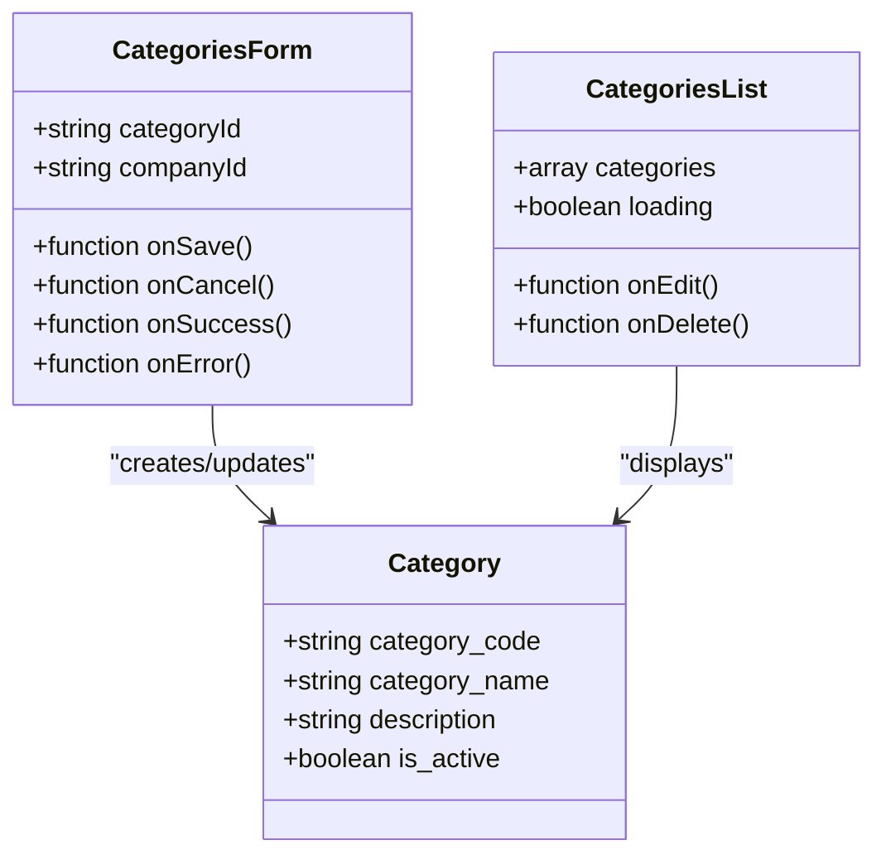
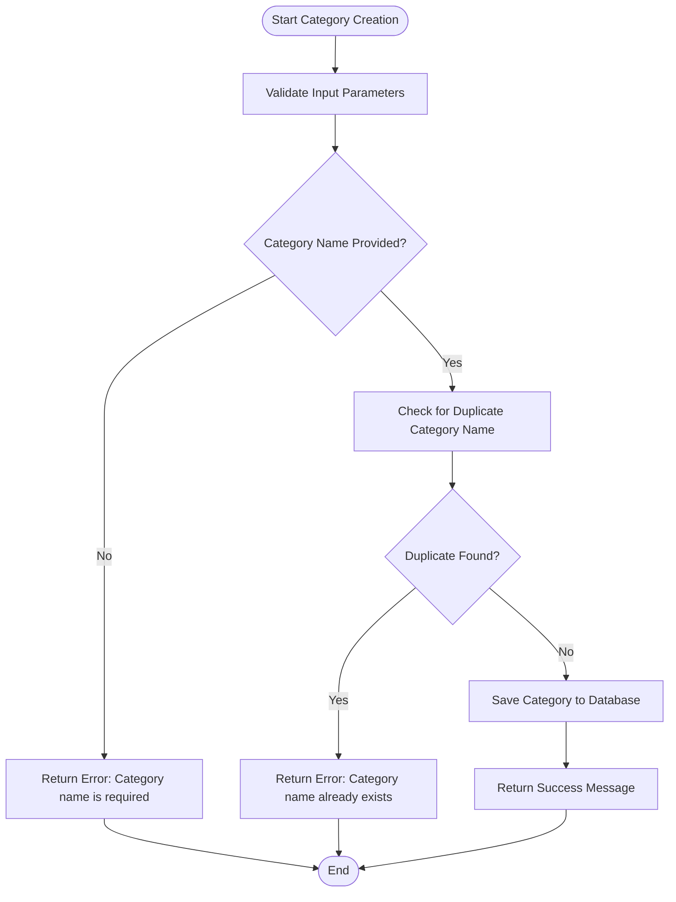
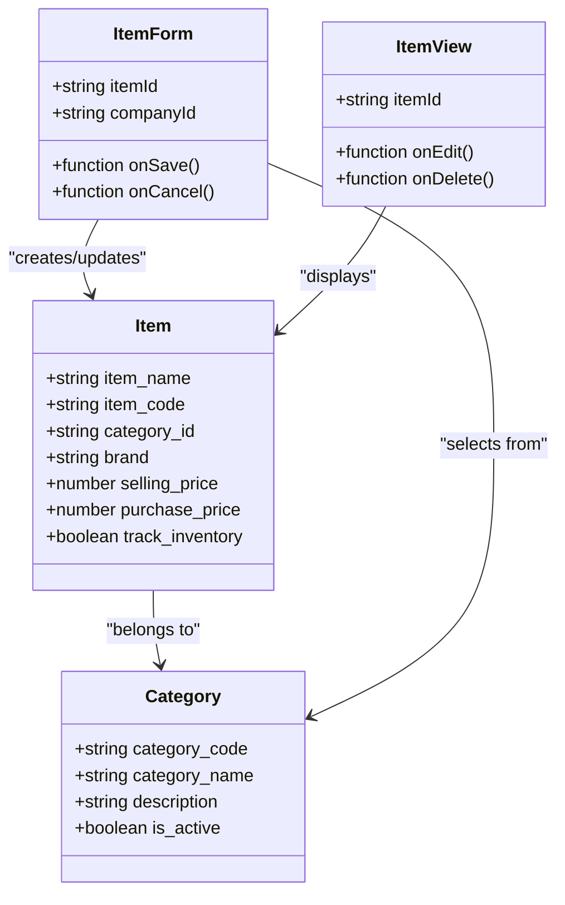
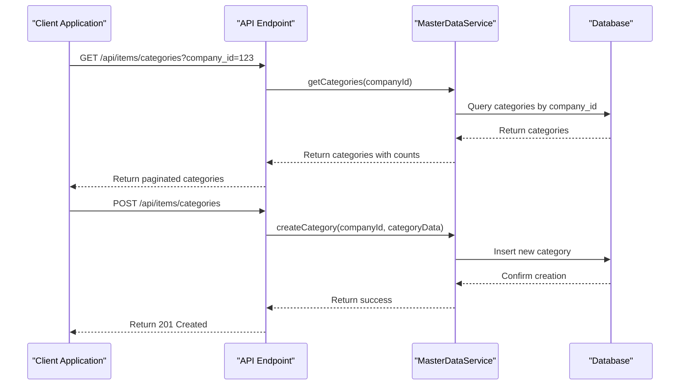
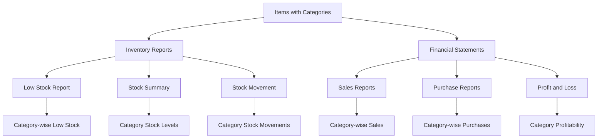

# Categories Management

<cite>
**Referenced Files in This Document**   
- [CategoriesForm.js](file://src/components/master-data/CategoriesForm.js)
- [CategoriesList.js](file://src/components/master-data/CategoriesList.js)
- [categories.js](file://src/pages/master-data/categories.js)
- [index.js](file://src/pages/api/items/categories/index.js)
- [masterDataService.js](file://src/services/masterDataService.js)
- [ItemForm.js](file://src/components/items/ItemForm.js)
- [ItemView.js](file://src/components/items/ItemView.js)
</cite>

## Table of Contents
1. [Introduction](#introduction)
2. [Hierarchical Category Structure](#hierarchical-category-structure)
3. [Category Creation and Validation](#category-creation-and-validation)
4. [Integration with Item Management](#integration-with-item-management)
5. [API Endpoints for CRUD Operations](#api-endpoints-for-crud-operations)
6. [Usage in Inventory Reports and Financial Statements](#usage-in-inventory-reports-and-financial-statements)
7. [Practical Examples](#practical-examples)
8. [Troubleshooting Common Issues](#troubleshooting-common-issues)
9. [Best Practices for Category Naming Conventions](#best-practices-for-category-naming-conventions)
10. [Conclusion](#conclusion)

## Introduction
The Categories Management module in ezbillify-v1 provides a comprehensive system for organizing inventory through product categorization. This documentation details the implementation of item categorization for inventory organization and reporting purposes, covering the hierarchical category structure, validation rules for category creation, integration with item management, API endpoints for CRUD operations, and usage in inventory reports and financial statements. The module enables businesses to efficiently organize their products and services, facilitating better inventory analysis and sales performance tracking.

**Section sources**
- [categories.js](file://src/pages/master-data/categories.js)

## Hierarchical Category Structure
The Categories Management module implements a flat hierarchical structure for organizing inventory items. Each category contains essential attributes including category code, category name, description, and active status. The system supports categorization of both products and services, allowing businesses to create meaningful groupings that reflect their inventory structure. Categories are displayed in alphabetical order within the user interface, providing a consistent and predictable organization. The hierarchical approach enables users to quickly locate and manage categories, while the active/inactive status feature allows for flexible category management without permanent deletion.

**Diagram sources**
- [CategoriesForm.js](file://src/components/master-data/CategoriesForm.js)
- [CategoriesList.js](file://src/components/master-data/CategoriesList.js)

**Section sources**
- [CategoriesForm.js](file://src/components/master-data/CategoriesForm.js)
- [CategoriesList.js](file://src/components/master-data/CategoriesList.js)

## Category Creation and Validation
The category creation process includes comprehensive validation rules to ensure data integrity. When creating or editing a category, the system validates that the category name is required and cannot be empty. The form also supports optional category codes for reference and reporting purposes. Additional validation occurs at the service level to prevent duplicate category names within the same company. The system checks for existing items assigned to a category before allowing deletion, preventing data integrity issues. Categories can be deactivated rather than deleted, preserving historical data while preventing new items from being assigned to obsolete categories.

**Diagram sources**
- [masterDataService.js](file://src/services/masterDataService.js)
- [CategoriesForm.js](file://src/components/master-data/CategoriesForm.js)

**Section sources**
- [masterDataService.js](file://src/services/masterDataService.js)
- [CategoriesForm.js](file://src/components/master-data/CategoriesForm.js)

## Integration with Item Management
Categories are tightly integrated with the item management system, allowing seamless assignment of categories to inventory items. When creating or editing an item, users can select from existing categories through a dropdown interface that displays both the category name and code. The integration ensures that category assignments are properly maintained in the database, with foreign key relationships between items and categories. This connection enables powerful filtering and reporting capabilities based on category membership. The system also handles the display of category information in item views, showing the assigned category alongside other item details.

**Diagram sources**
- [ItemForm.js](file://src/components/items/ItemForm.js)
- [ItemView.js](file://src/components/items/ItemView.js)
- [masterDataService.js](file://src/services/masterDataService.js)

**Section sources**
- [ItemForm.js](file://src/components/items/ItemForm.js)
- [ItemView.js](file://src/components/items/ItemView.js)

## API Endpoints for CRUD Operations
The Categories Management module provides RESTful API endpoints for CRUD operations on categories. The primary endpoint at `/api/items/categories` supports GET and POST methods for retrieving and creating categories. The GET method accepts parameters for company_id, search, page, and limit, enabling filtered and paginated retrieval of categories. The POST method allows for category creation with validation of required fields including company_id and name. The API implements proper error handling with appropriate HTTP status codes and descriptive error messages. Authentication is enforced through the withAuth middleware, ensuring that only authorized users can access the endpoints.

**Diagram sources**
- [index.js](file://src/pages/api/items/categories/index.js)
- [masterDataService.js](file://src/services/masterDataService.js)

**Section sources**
- [index.js](file://src/pages/api/items/categories/index.js)

## Usage in Inventory Reports and Financial Statements
Categories play a crucial role in inventory reports and financial statements by enabling data aggregation and analysis by category. The system extracts category information from items to generate reports that show inventory levels, stock movements, and financial performance by category. In inventory reports, users can view low stock items, stock summaries, and stock movements filtered by category. Financial statements leverage category data to provide insights into sales performance, profitability, and purchasing patterns across different product or service categories. The reporting system uses category assignments to calculate key metrics such as category-wise sales, purchase trends, and inventory turnover rates.

**Diagram sources**
- [index.js](file://src/pages/api/items/categories/index.js)
- [masterDataService.js](file://src/services/masterDataService.js)

**Section sources**
- [index.js](file://src/pages/api/items/categories/index.js)

## Practical Examples
### Setting Up Product Categories
To set up product categories, navigate to the Master Data section and select Categories. Click "Add Category" to open the category creation form. Enter a unique category name such as "Electronics" and optionally provide a category code like "ELEC-001". Add a description if needed, such as "Electronic devices and accessories". Keep the Active status enabled and save the category. Repeat this process to create additional categories like "Furniture", "Office Supplies", and "Apparel".

### Creating Sub-Categories
While the current implementation uses a flat category structure, sub-categories can be effectively managed through naming conventions. For example, create categories with hierarchical names such as "Electronics-Mobile Phones", "Electronics-Laptops", and "Electronics-Accessories". This approach maintains a flat structure in the database while providing the organizational benefits of sub-categories in reporting and filtering. When viewing reports, categories can be grouped by their prefix to simulate a hierarchical view.

**Section sources**
- [CategoriesForm.js](file://src/components/master-data/CategoriesForm.js)
- [categories.js](file://src/pages/master-data/categories.js)

## Troubleshooting Common Issues
### Category Assignment Errors
Category assignment errors typically occur when trying to delete a category that has items assigned to it. The system prevents this action to maintain data integrity. To resolve this issue, first reassign all items from the category to another appropriate category, then attempt to delete the original category. Alternatively, deactivate the category instead of deleting it if it contains historical data that should be preserved.

### Reporting Inconsistencies
Reporting inconsistencies may arise when items are assigned to incorrect categories or when category names have been changed without updating historical data. To address this, ensure that category assignments are reviewed regularly and that a consistent naming convention is followed. When renaming categories, consider creating a new category and migrating items rather than directly modifying the category name to preserve historical reporting accuracy.

**Section sources**
- [masterDataService.js](file://src/services/masterDataService.js)
- [index.js](file://src/pages/api/items/categories/index.js)

## Best Practices for Category Naming Conventions
Implementing consistent category naming conventions is essential for effective inventory analysis and sales performance tracking. Use clear, descriptive names that accurately reflect the items within the category. Maintain a consistent format across all categories, such as using title case or all uppercase. Consider implementing a prefix system for major categories (e.g., "ELEC-" for electronics, "FURN-" for furniture) to facilitate sorting and filtering. Limit category names to a reasonable length to ensure they display properly in reports and user interfaces. Regularly review and consolidate categories to prevent proliferation of similar or redundant categories, which can complicate reporting and analysis.

**Section sources**
- [CategoriesForm.js](file://src/components/master-data/CategoriesForm.js)

## Conclusion
The Categories Management module in ezbillify-v1 provides a robust foundation for inventory organization and reporting. By implementing a well-structured category system with proper validation and integration with item management, businesses can significantly improve their inventory tracking and financial analysis capabilities. The module's API endpoints enable seamless integration with other systems, while its reporting capabilities provide valuable insights into sales performance and inventory trends. Following best practices for category naming and management ensures that the system remains effective as the business grows and evolves.