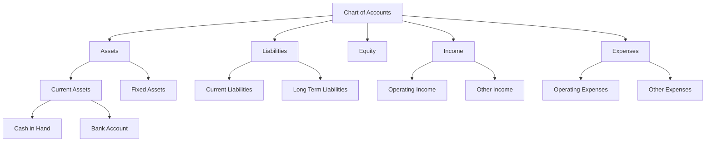
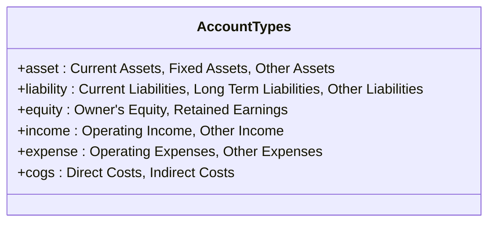
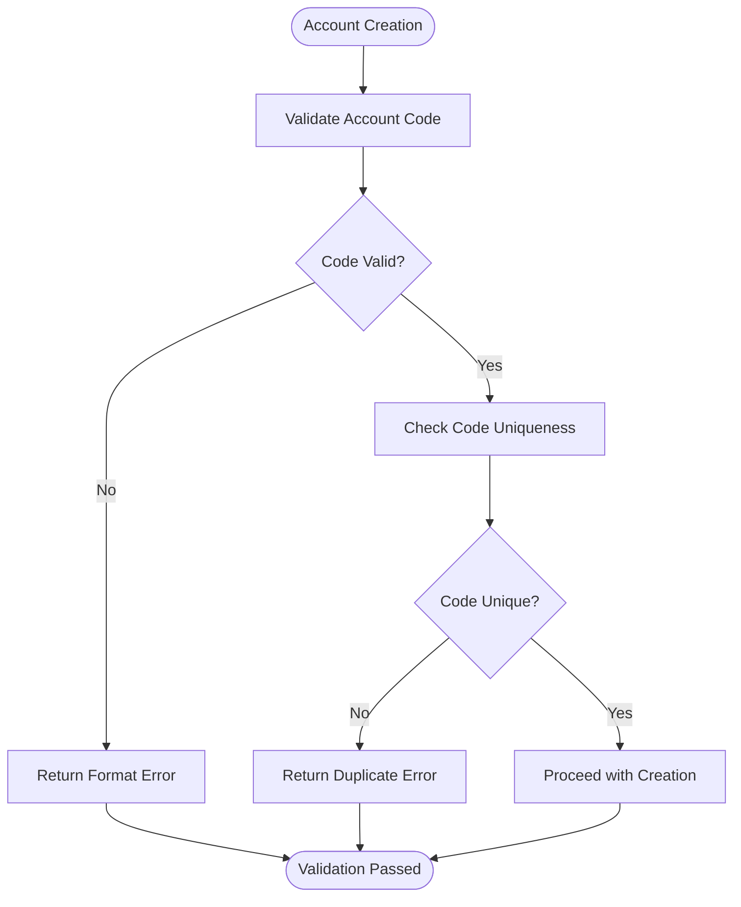
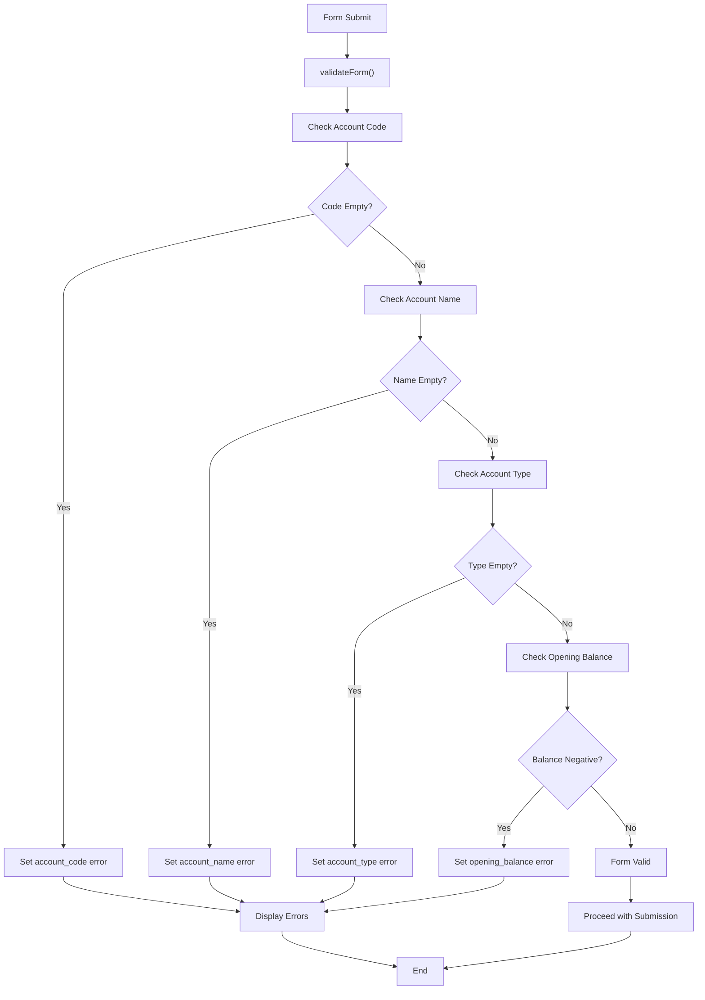
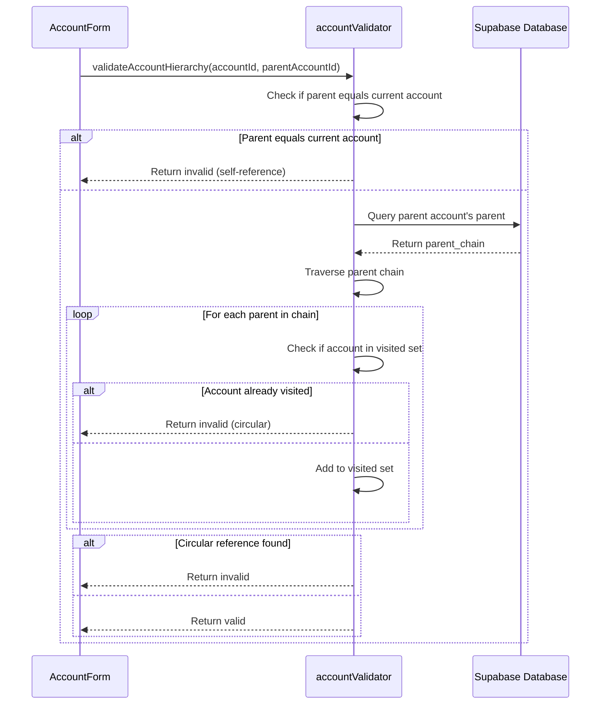
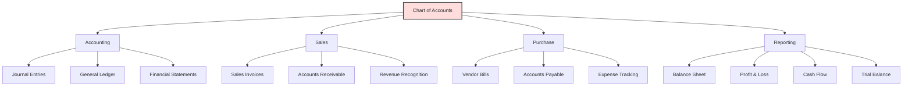

# Chart of Accounts

<cite>
**Referenced Files in This Document**   
- [AccountForm.js](file://src/components/master-data/AccountForm.js)
- [chart-of-accounts.js](file://src/pages/api/master-data/chart-of-accounts.js)
- [accountValidator.js](file://src/services/validators/accountValidator.js)
- [chart-of-accounts.js](file://src/pages/master-data/chart-of-accounts.js)
- [AccountList.js](file://src/components/master-data/AccountList.js)
- [accountingService.js](file://src/services/accountingService.js)
- [db.js](file://src/lib/db.js)
- [index.js](file://src/pages/api/accounting/journal-entries/index.js)
</cite>

## Table of Contents
1. [Introduction](#introduction)
2. [Hierarchical Structure of Accounts](#hierarchical-structure-of-accounts)
3. [Account Types and Subtypes](#account-types-and-subtypes)
4. [Coding Conventions](#coding-conventions)
5. [Form Validation Rules](#form-validation-rules)
6. [Parent-Child Relationships and Circular Reference Prevention](#parent-child-relationships-and-circular-reference-prevention)
7. [API Endpoints for CRUD Operations](#api-endpoints-for-crud-operations)
8. [Data Consumption Across Modules](#data-consumption-across-modules)
9. [Practical Examples](#practical-examples)
10. [Troubleshooting Common Issues](#troubleshooting-common-issues)
11. [Performance Considerations](#performance-considerations)
12. [Best Practices for Data Integrity](#best-practices-for-data-integrity)

## Introduction

The Chart of Accounts (COA) in ezbillify-v1 serves as the foundational framework for all financial tracking and reporting within the system. It provides a structured hierarchy of accounts that categorize all financial transactions according to standard accounting principles. This documentation details the implementation of the COA, including its hierarchical structure, account types, validation rules, API endpoints, and integration with various modules such as sales, purchase, and accounting.

The COA implementation is designed to support double-entry accounting with proper validation and data integrity checks. It enables businesses to organize their financial data in a way that facilitates accurate reporting, tax compliance, and financial analysis.

**Section sources**
- [chart-of-accounts.js](file://src/pages/master-data/chart-of-accounts.js)
- [AccountList.js](file://src/components/master-data/AccountList.js)

## Hierarchical Structure of Accounts

The Chart of Accounts in ezbillify-v1 implements a hierarchical tree structure that allows for organization of accounts into parent-child relationships. This hierarchical approach enables businesses to group related accounts together and generate both detailed and summarized financial reports.

Each account can have a parent account, creating a multi-level structure where:
- Top-level accounts represent major categories (Assets, Liabilities, Equity, Income, Expenses)
- Mid-level accounts represent subcategories within each major category
- Leaf-level accounts represent specific accounts used for transaction recording

The hierarchy is implemented through the `parent_account_id` field in the `chart_of_accounts` table, which references the ID of another account in the same table. This self-referencing relationship enables the creation of nested account structures.

When displaying accounts, the system orders them by `account_code`, which typically follows a numerical or alphanumeric pattern that reflects the hierarchical structure (e.g., 1000 for Assets, 1100 for Current Assets, 1110 for Cash in Hand).



**Diagram sources**
- [AccountForm.js](file://src/components/master-data/AccountForm.js#L239-L241)
- [AccountList.js](file://src/components/master-data/AccountList.js#L45-L48)

**Section sources**
- [AccountForm.js](file://src/components/master-data/AccountForm.js)
- [AccountList.js](file://src/components/master-data/AccountList.js)

## Account Types and Subtypes

The Chart of Accounts implementation supports five primary account types based on standard accounting principles, with additional subtypes for further categorization.

### Primary Account Types

The system supports the following primary account types:

- **Asset**: Resources owned by the business (e.g., cash, inventory, equipment)
- **Liability**: Obligations of the business (e.g., loans, accounts payable)
- **Equity**: Owner's interest in the business (e.g., capital, retained earnings)
- **Income**: Revenue generated by business operations
- **Expense**: Costs incurred in business operations
- **Cost of Goods Sold (COGS)**: Direct costs associated with producing goods or services

### Account Subtypes

Each primary account type has specific subtypes that provide additional categorization:



**Diagram sources**
- [AccountForm.js](file://src/components/master-data/AccountForm.js#L32-L58)

The account type determines the normal balance side (debit or credit) and how the account behaves in financial statements. For example:
- Asset and Expense accounts normally have debit balances
- Liability, Equity, and Income accounts normally have credit balances

When creating or editing an account, users must select both a primary account type and an appropriate subtype. The available subtypes dynamically change based on the selected account type, ensuring proper categorization.

**Section sources**
- [AccountForm.js](file://src/components/master-data/AccountForm.js#L23-L58)

## Coding Conventions

The Chart of Accounts implementation follows specific coding conventions to ensure consistency and clarity in account identification.

### Account Code Format

Account codes in ezbillify-v1 follow a standardized format:
- Composed of uppercase letters, numbers, and hyphens only
- Typically numeric for hierarchical organization (e.g., 1000, 1100, 1110)
- Unique within each company
- Used for sorting and organizing accounts in reports

The system validates account codes to ensure they contain only permitted characters (uppercase letters, numbers, and hyphens) and are unique within the company.

### Account Naming Conventions

Account names should be descriptive and follow these guidelines:
- Clear and unambiguous (e.g., "Cash in Hand" rather than "Cash")
- Consistent with industry standards
- Avoid abbreviations unless widely recognized
- Reflect the account's purpose and classification

### Code Validation

The system implements validation to ensure coding standards are maintained:
- Account codes must be unique within a company
- Account codes cannot be empty
- Account codes are trimmed and converted to uppercase
- Account names must be provided and cannot be empty



**Diagram sources**
- [accountValidator.js](file://src/services/validators/accountValidator.js#L7-L22)
- [AccountForm.js](file://src/components/master-data/AccountForm.js#L96-L102)

**Section sources**
- [accountValidator.js](file://src/services/validators/accountValidator.js)
- [AccountForm.js](file://src/components/master-data/AccountForm.js)

## Form Validation Rules

The AccountForm.js component implements comprehensive validation rules to ensure data integrity when creating or editing accounts.

### Required Field Validation

The following fields are required and validated:
- **Account Code**: Must be provided and non-empty
- **Account Name**: Must be provided and non-empty  
- **Account Type**: Must be selected from available options
- **Opening Balance**: Cannot be negative

### Data Type Validation

The form validates data types and formats:
- Opening balance must be a valid number
- Account code must contain only uppercase letters, numbers, and hyphens
- Opening balance type must be either "debit" or "credit"

### Business Rule Validation

Additional business rules are enforced:
- Opening balance cannot be negative
- Account type must be one of the allowed values
- When editing an account, the parent account cannot create a circular reference

The validation is implemented in two places:
1. Client-side validation in the AccountForm component
2. Server-side validation in the accountValidator service

Client-side validation provides immediate feedback to users, while server-side validation ensures data integrity even if the client-side validation is bypassed.



**Diagram sources**
- [AccountForm.js](file://src/components/master-data/AccountForm.js#L93-L113)
- [accountValidator.js](file://src/services/validators/accountValidator.js#L3-L48)

**Section sources**
- [AccountForm.js](file://src/components/master-data/AccountForm.js)
- [accountValidator.js](file://src/services/validators/accountValidator.js)

## Parent-Child Relationships and Circular Reference Prevention

The Chart of Accounts implementation supports parent-child relationships between accounts, enabling hierarchical organization of financial data.

### Parent-Child Relationship Rules

When establishing parent-child relationships:
- A child account must be of the same account type as its parent
- An account cannot be its own parent
- Only active accounts can be selected as parents
- The parent account list is filtered to show only accounts of the same type as the current account being edited

The system implements these rules in the AccountForm component through the `filteredParentAccounts` calculation, which filters the list of available parent accounts based on the current account type.

### Circular Reference Prevention

To prevent circular references in the account hierarchy, the system implements a validation mechanism that checks for potential circular dependencies before allowing a parent account to be assigned.

The validation algorithm works as follows:
1. Start with the proposed parent account
2. Follow the parent chain upward, keeping track of visited accounts
3. If the algorithm encounters the current account being edited, a circular reference would be created
4. If the algorithm encounters an account it has already visited, a circular reference exists in the current hierarchy

This validation is implemented in the `checkCircularDependency` function in the accountValidator service, which traverses the parent chain asynchronously using database queries.



**Diagram sources**
- [accountValidator.js](file://src/services/validators/accountValidator.js#L79-L134)
- [AccountForm.js](file://src/components/master-data/AccountForm.js#L239-L241)

**Section sources**
- [accountValidator.js](file://src/services/validators/accountValidator.js)
- [AccountForm.js](file://src/components/master-data/AccountForm.js)

## API Endpoints for CRUD Operations

The Chart of Accounts functionality is exposed through a set of API endpoints that support Create, Read, Update, and Delete (CRUD) operations.

### GET Endpoint

The primary GET endpoint retrieves all accounts for a specific company:

```
GET /api/master-data/chart-of-accounts?company_id={companyId}
```

This endpoint returns a JSON response containing all active accounts for the specified company, ordered by account code. The response includes account details such as code, name, type, subtype, and balance information.

### POST Endpoint

The POST endpoint creates a new account:

```
POST /api/master-data/accounts
```

The request body should contain the account data including account code, name, type, and other relevant fields. The endpoint validates the data, ensures uniqueness of the account code, and creates the account in the database.

### PUT Endpoint

The PUT endpoint updates an existing account:

```
PUT /api/master-data/accounts/{id}
```

This endpoint allows modification of account details while maintaining data integrity. It performs validation to prevent issues such as circular references in the account hierarchy.

### DELETE Endpoint

The DELETE endpoint removes an account:

```
DELETE /api/master-data/accounts/{id}
```

Before deletion, the system checks if the account has any transactions or child accounts. If either condition is true, the deletion is prevented to maintain data integrity.

The API endpoints are protected by authentication middleware (`withAuth`) which ensures that users can only access data for their own company.

```mermaid
flowchart TD
Client[Client Application] --> API["API Endpoints"]
subgraph API Endpoints
A[GET /chart-of-accounts] --> Auth["Authentication"]
B[POST /accounts] --> Auth
C[PUT /accounts/{id}] --> Auth
D[DELETE /accounts/{id}] --> Auth
Auth --> Validate["Validation & Business Rules"]
Validate --> DB["Database Operations"]
DB --> Response["JSON Response"]
end
API --> Client
style API fill:#f0f8ff,stroke:#333,stroke-width:1px
```

**Diagram sources**
- [chart-of-accounts.js](file://src/pages/api/master-data/chart-of-accounts.js)
- [index.js](file://src/pages/api/master-data/accounts/index.js)
- [accountValidator.js](file://src/services/validators/accountValidator.js)

**Section sources**
- [chart-of-accounts.js](file://src/pages/api/master-data/chart-of-accounts.js)
- [index.js](file://src/pages/api/master-data/accounts/index.js)

## Data Consumption Across Modules

The Chart of Accounts data is consumed by various modules throughout the ezbillify-v1 application, serving as the foundation for financial transactions and reporting.

### Accounting Module

The accounting module is the primary consumer of Chart of Accounts data. When creating journal entries, users select accounts from the chart of accounts to debit and credit. The accountingService uses the chart of accounts to:

- Validate that journal entry accounts exist and are active
- Calculate account balances after transactions
- Generate financial statements (Balance Sheet, Profit & Loss, Cash Flow)
- Create trial balances

### Sales Module

The sales module uses specific accounts from the chart of accounts for:
- Recording sales revenue (Income accounts)
- Tracking accounts receivable (Asset accounts)
- Calculating cost of goods sold (COGS accounts)
- Applying sales tax (Liability accounts)

When creating sales invoices, the system references the appropriate income and tax accounts from the chart of accounts.

### Purchase Module

The purchase module utilizes the chart of accounts for:
- Recording purchase expenses (Expense accounts)
- Tracking accounts payable (Liability accounts)
- Managing inventory (Asset accounts)
- Handling purchase taxes (Liability accounts)

### Reporting Module

All financial reports in the system are based on the chart of accounts structure:
- Balance Sheet: Groups accounts by Asset, Liability, and Equity types
- Profit & Loss: Groups accounts by Income and Expense types
- Cash Flow Statement: Categorizes cash movements based on account types
- Trial Balance: Lists all accounts with their current balances



**Diagram sources**
- [accountingService.js](file://src/services/accountingService.js)
- [index.js](file://src/pages/api/accounting/journal-entries/index.js)
- [AccountList.js](file://src/components/master-data/AccountList.js)

**Section sources**
- [accountingService.js](file://src/services/accountingService.js)
- [index.js](file://src/pages/api/accounting/journal-entries/index.js)

## Practical Examples

This section provides practical examples of common tasks related to the Chart of Accounts implementation.

### Setting Up a New Account

To create a new account:
1. Navigate to the Chart of Accounts page
2. Click "Add Account"
3. Fill in the account details:
   - Account Code: Unique identifier (e.g., "1110")
   - Account Name: Descriptive name (e.g., "Cash in Hand")
   - Account Type: Select "Asset"
   - Account Subtype: Select "Current Assets"
   - Opening Balance: Enter initial balance
   - Opening Balance Type: Select "debit" or "credit"
4. Save the account

The system will validate the information and create the account in the database.

### Configuring Sub-Accounts

To create a hierarchical structure with sub-accounts:
1. Create a parent account (e.g., "Bank Accounts" with code "1200")
2. Create child accounts (e.g., "HDFC Bank" with code "1210")
3. When creating the child account, select the parent account from the "Parent Account" dropdown
4. Save the child account

The system will ensure that the child account has the same account type as the parent and prevent circular references.

### Example Account Hierarchy

```
1000 - Assets
├── 1100 - Current Assets
│   ├── 1110 - Cash in Hand
│   ├── 1120 - Petty Cash
│   └── 1200 - Bank Accounts
│       ├── 1210 - HDFC Bank
│       └── 1220 - ICICI Bank
└── 1300 - Fixed Assets
    ├── 1310 - Office Equipment
    └── 1320 - Furniture & Fixtures
```

**Section sources**
- [AccountForm.js](file://src/components/master-data/AccountForm.js)
- [chart-of-accounts.js](file://src/pages/master-data/chart-of-accounts.js)

## Troubleshooting Common Issues

This section addresses common issues encountered when working with the Chart of Accounts and their solutions.

### Invalid Account Hierarchy

**Issue**: Unable to set a parent account for a child account.

**Causes and Solutions**:
- **Different account types**: Parent and child accounts must have the same account type. Ensure both accounts are of the same type (e.g., both are Assets).
- **Circular reference**: The proposed parent chain would create a circular reference. Review the parent assignments to eliminate the circular dependency.
- **Inactive parent account**: Only active accounts can be parents. Ensure the parent account is active.

### Inactive Account Usage

**Issue**: Attempting to use an inactive account in a transaction.

**Behavior**: The system prevents transactions from being posted to inactive accounts.

**Solution**: 
1. Reactivate the account by editing it and setting "is_active" to true
2. Or create a new active account to use in the transaction

### Account Deletion Issues

**Issue**: Unable to delete an account.

**Causes**:
- The account has existing transactions
- The account has child accounts
- The account is referenced in other parts of the system

**Solutions**:
- For accounts with transactions: The account cannot be deleted to maintain audit trail integrity. Instead, mark it as inactive.
- For accounts with children: Either reassign the child accounts to a different parent or delete the child accounts first.
- For system accounts: Some accounts may be designated as system accounts and cannot be deleted.

### Duplicate Account Code

**Issue**: Receiving an error about duplicate account codes.

**Solution**: 
- Verify that the account code is unique within the company
- Check for existing accounts with similar codes
- Use a different code or modify the existing one

**Section sources**
- [accountValidator.js](file://src/services/validators/accountValidator.js)
- [AccountForm.js](file://src/components/master-data/AccountForm.js)
- [AccountList.js](file://src/components/master-data/AccountList.js)

## Performance Considerations

When dealing with large charts of accounts, several performance considerations are important.

### Large Dataset Handling

For companies with extensive charts of accounts:
- The system loads all accounts for a company in a single request
- Accounts are ordered by account code for consistent display
- Client-side rendering handles the display of account lists

### Optimization Strategies

The implementation includes several optimization features:
- **Caching**: Account data is cached in the CompanyContext to avoid repeated API calls
- **Efficient Queries**: Database queries select only necessary fields and use appropriate indexing
- **Batch Operations**: When processing multiple accounts, operations are batched where possible

### Scalability Considerations

For very large charts of accounts:
- Consider implementing pagination for account lists
- Use lazy loading for account hierarchies
- Implement search functionality to quickly locate specific accounts
- Optimize database indexes on frequently queried fields (company_id, account_code, account_type)

The current implementation is optimized for typical business sizes with hundreds of accounts. For enterprises with thousands of accounts, additional optimization may be required.

**Section sources**
- [AccountList.js](file://src/components/master-data/AccountList.js)
- [accountingService.js](file://src/services/accountingService.js)
- [db.js](file://src/lib/db.js)

## Best Practices for Data Integrity

Maintaining data integrity in the Chart of Accounts is critical for accurate financial reporting.

### Account Creation Best Practices

- Use a consistent numbering scheme that reflects the account hierarchy
- Choose descriptive account names that clearly indicate the account's purpose
- Assign appropriate account types and subtypes
- Set correct opening balances and balance types
- Use parent-child relationships to organize related accounts

### Maintenance Best Practices

- Regularly review and clean up unused accounts (mark as inactive rather than deleting)
- Document any custom accounts and their intended use
- Avoid frequent changes to account codes to maintain historical consistency
- When restructuring the chart of accounts, plan changes carefully to avoid disrupting financial reporting

### Data Validation Best Practices

The system implements multiple layers of validation:
- **Client-side validation**: Immediate feedback on form errors
- **Server-side validation**: Ensures data integrity even if client validation is bypassed
- **Business rule validation**: Prevents logical errors like circular references
- **Database constraints**: Enforces data integrity at the storage level

### Change Management

For significant changes to the chart of accounts:
- Make changes during non-peak hours
- Backup data before making structural changes
- Communicate changes to all users who may be affected
- Test changes in a staging environment if possible

Following these best practices ensures that the Chart of Accounts remains accurate, reliable, and useful for financial management and reporting.

**Section sources**
- [accountValidator.js](file://src/services/validators/accountValidator.js)
- [AccountForm.js](file://src/components/master-data/AccountForm.js)
- [db.js](file://src/lib/db.js)