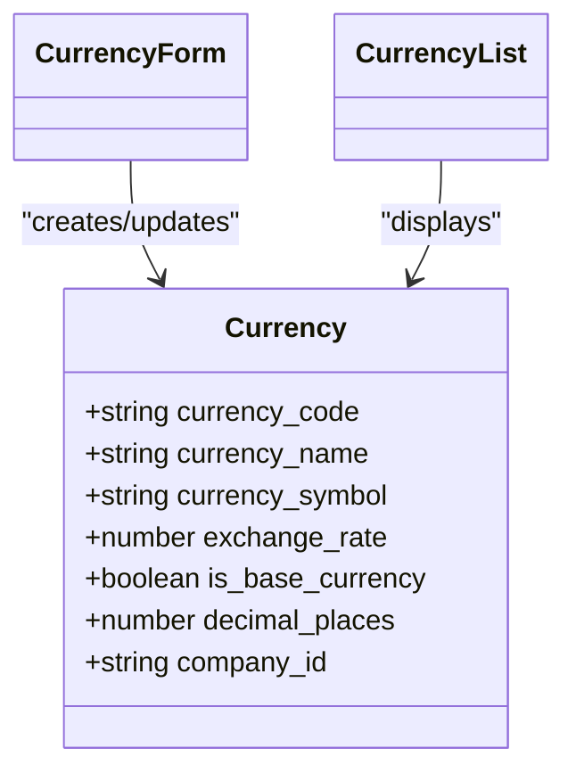
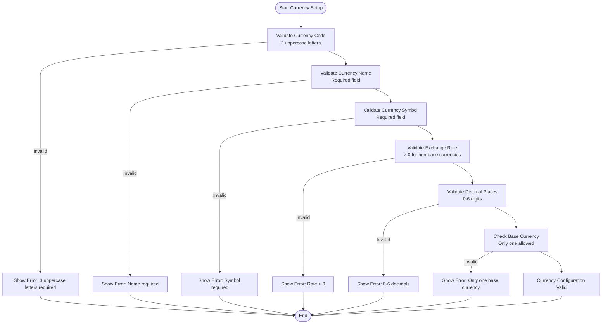
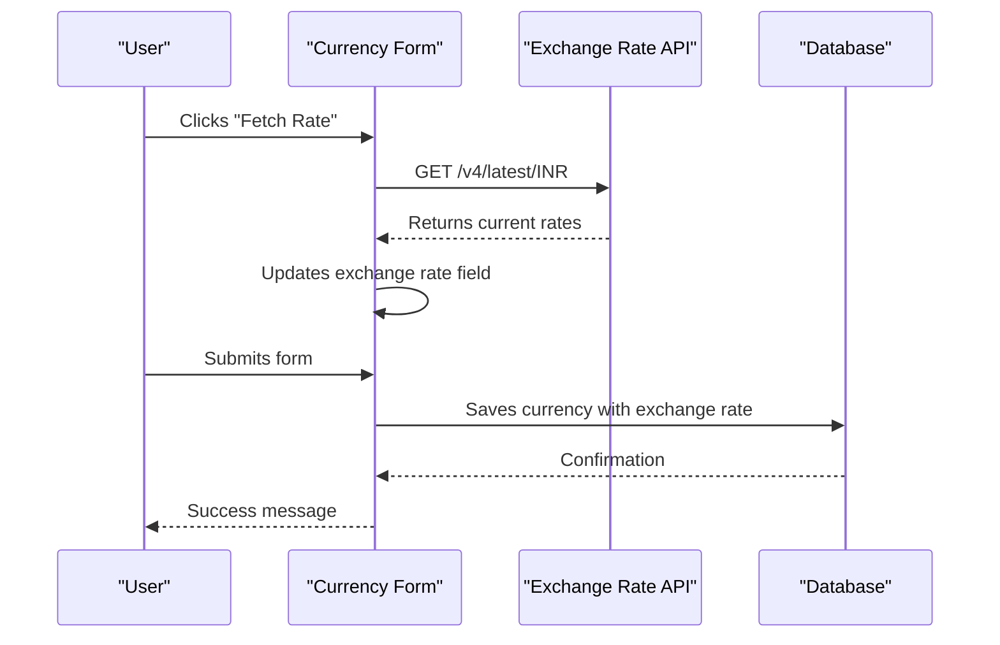
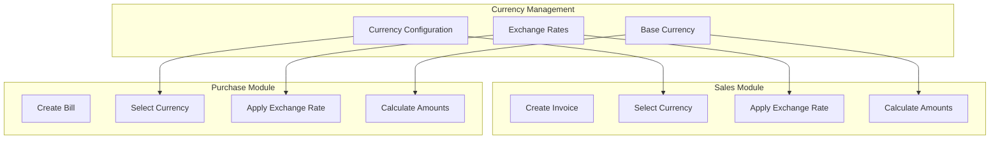
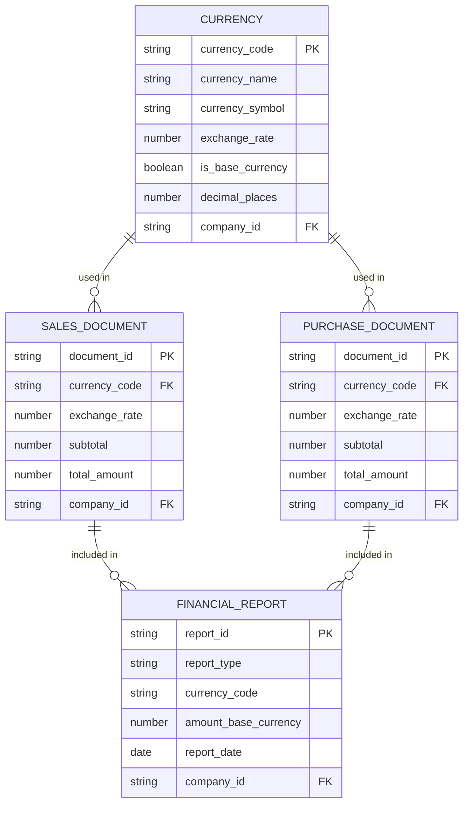

# Currency Management

<cite>
**Referenced Files in This Document**   
- [CurrencyForm.js](file://src/components/master-data/CurrencyForm.js)
- [CurrencyList.js](file://src/components/master-data/CurrencyList.js)
- [formatters.js](file://src/services/utils/formatters.js)
- [constants.js](file://src/lib/constants.js)
- [index.js](file://src/pages/api/master-data/currency/index.js)
- [accountingService.js](file://src/services/accountingService.js)
</cite>

## Table of Contents
1. [Introduction](#introduction)
2. [Currency Configuration](#currency-configuration)
3. [Form Validation Rules](#form-validation-rules)
4. [Exchange Rate Management](#exchange-rate-management)
5. [Integration with Sales and Purchase Modules](#integration-with-sales-and-purchase-modules)
6. [Data Consistency and Reporting](#data-consistency-and-reporting)
7. [Troubleshooting Common Issues](#troubleshooting-common-issues)
8. [Practical Examples](#practical-examples)

## Introduction
The Currency Management system in ezbillify-v1 enables businesses to handle multi-currency transactions efficiently. This documentation details the implementation of currency support, including base currency configuration, exchange rate management, and integration with sales and purchase modules. The system ensures accurate financial calculations across different currencies while maintaining data consistency for reporting purposes.

## Currency Configuration
The currency configuration system allows administrators to set up and manage multiple currencies for international transactions. The core components include:

- **Base Currency**: The primary currency used for internal calculations and financial reporting
- **Foreign Currencies**: Additional currencies that can be used for transactions with international customers and suppliers
- **Decimal Precision**: Configurable decimal places for each currency (0-6 digits)
- **Currency Symbols**: Visual representation of each currency in the UI

The system uses a dedicated form component (`CurrencyForm.js`) that provides a user-friendly interface for configuring currency settings. Each currency record includes the currency code (ISO 3-letter format), name, symbol, exchange rate relative to the base currency, and decimal precision settings.

When configuring a new currency, users can select from popular currency presets (USD, EUR, GBP, etc.) which automatically populate the name and symbol fields. The system enforces that only one currency can be designated as the base currency at any time.

**Diagram sources**
- [CurrencyForm.js](file://src/components/master-data/CurrencyForm.js)
- [CurrencyList.js](file://src/components/master-data/CurrencyList.js)

**Section sources**
- [CurrencyForm.js](file://src/components/master-data/CurrencyForm.js#L1-L364)
- [CurrencyList.js](file://src/components/master-data/CurrencyList.js#L1-L226)

## Form Validation Rules
The currency management system implements comprehensive validation rules to ensure data integrity:

### Required Fields
- **Currency Code**: Must be exactly 3 uppercase letters (ISO format)
- **Currency Name**: Required field with no specific format restrictions
- **Currency Symbol**: Required field for visual representation
- **Exchange Rate**: Must be greater than 0 for non-base currencies

### Format Validation
- Currency codes are automatically converted to uppercase
- Exchange rates accept up to 6 decimal places for precision
- Decimal places must be between 0 and 6

### Business Rules
- Only one currency can be set as the base currency
- Base currency always has an exchange rate of 1.00
- Cannot delete a currency that is being used in transactions
- Cannot delete the base currency

The validation is implemented in the `CurrencyForm.js` component with real-time feedback to users. Error messages are displayed immediately when invalid data is entered, and the form prevents submission until all validation rules are satisfied.

**Diagram sources**
- [CurrencyForm.js](file://src/components/master-data/CurrencyForm.js#L68-L95)

**Section sources**
- [CurrencyForm.js](file://src/components/master-data/CurrencyForm.js#L68-L95)

## Exchange Rate Management
The system provides robust exchange rate management capabilities to handle currency conversion for international transactions.

### Exchange Rate Configuration
- Exchange rates are always relative to the base currency (typically INR)
- Base currency has a fixed exchange rate of 1.00
- Non-base currencies require an exchange rate greater than 0
- Historical transactions preserve their original exchange rates

### Automatic Rate Updates
The system can automatically fetch current market exchange rates using a third-party API (`api.exchangerate-api.com`). When users click the "Fetch Rate" button, the system retrieves the latest rates and updates the form. This feature is particularly useful for businesses that want to use current market rates for their transactions.

### Manual Rate Management
Users can manually update exchange rates based on their business needs. This is useful for:
- Setting preferential rates for specific customers
- Accounting for transaction fees
- Managing rate fluctuations over time
- Creating custom rate structures

The exchange rate information is stored in the database and used for all currency conversions in sales and purchase transactions.

**Diagram sources**
- [CurrencyForm.js](file://src/components/master-data/CurrencyForm.js#L42-L65)
- [index.js](file://src/pages/api/master-data/currency/index.js#L50-L53)

**Section sources**
- [CurrencyForm.js](file://src/components/master-data/CurrencyForm.js#L42-L65)

## Integration with Sales and Purchase Modules
The currency management system is tightly integrated with the sales and purchase modules to support international transactions.

### Sales Module Integration
When creating sales invoices for international customers:
- The selected currency is applied to the entire transaction
- All amounts are displayed in the selected currency
- Exchange rates are applied to calculate equivalent values in the base currency
- Financial reports show both transaction currency and base currency values

### Purchase Module Integration
For international purchases:
- Vendor bills can be recorded in foreign currencies
- Exchange rates are used to convert amounts to the base currency for accounting purposes
- Payment terms can be specified in the vendor's currency
- Inventory valuation considers the currency of purchase

### Data Flow
The integration follows a consistent pattern:
1. User selects a currency for the transaction
2. System applies the current exchange rate
3. All calculations are performed using the exchange rate
4. Original transaction values are preserved
5. Base currency equivalents are calculated for reporting

This ensures that businesses can conduct international transactions while maintaining accurate financial records in their base currency.

**Diagram sources**
- [index.js](file://src/pages/api/sales/invoices/index.js#L342-L435)
- [index.js](file://src/pages/api/purchase/bills/index.js#L293-L367)

**Section sources**
- [index.js](file://src/pages/api/sales/invoices/index.js#L342-L435)
- [index.js](file://src/pages/api/purchase/bills/index.js#L293-L367)

## Data Consistency and Reporting
The system ensures data consistency across multi-currency transactions and provides comprehensive reporting capabilities.

### Data Consistency Measures
- **Immutable Historical Rates**: Once a transaction is recorded, its exchange rate is preserved
- **Base Currency Conversion**: All transactions are converted to the base currency for financial reporting
- **Audit Trail**: Changes to currency settings are logged for accountability
- **Transaction Integrity**: Currency information is stored with each transaction record

### Financial Reporting
The accounting system generates financial statements that account for multi-currency transactions:

- **Balance Sheet**: Shows assets, liabilities, and equity in the base currency
- **Profit & Loss Statement**: Reports income and expenses converted to the base currency
- **Cash Flow Statement**: Tracks cash movements with currency conversion
- **Trial Balance**: Ensures accounting equation balance across all currencies

The `accountingService.js` handles these conversions and ensures that financial reports accurately reflect the company's financial position regardless of the currencies used in individual transactions.

**Diagram sources**
- [accountingService.js](file://src/services/accountingService.js#L48-L140)
- [index.js](file://src/pages/api/master-data/currency/index.js#L12-L16)

**Section sources**
- [accountingService.js](file://src/services/accountingService.js#L48-L140)

## Troubleshooting Common Issues
This section addresses common issues encountered when managing multi-currency transactions and provides solutions.

### Currency Conversion Errors
**Symptoms**: Incorrect amount calculations in foreign currency transactions
**Causes**:
- Outdated exchange rates
- Incorrect base currency configuration
- System clock synchronization issues

**Solutions**:
1. Verify the exchange rate is current
2. Check that the correct base currency is selected
3. Use the "Fetch Rate" feature to get current market rates
4. Ensure system time is synchronized

### Incorrect Amount Calculations
**Symptoms**: Discrepancies between calculated amounts and expected values
**Causes**:
- Rounding errors with high decimal precision
- Incorrect decimal places configuration
- Formula errors in calculation logic

**Solutions**:
1. Verify decimal places setting for the currency
2. Check that calculations use the correct exchange rate
3. Ensure proper rounding rules are applied
4. Validate calculation formulas

### Transaction Processing Issues
**Symptoms**: Unable to save transactions with foreign currencies
**Causes**:
- Missing currency configuration
- Invalid currency code
- Database connectivity issues

**Solutions**:
1. Verify the currency is properly configured
2. Check that the currency code follows ISO format
3. Ensure the currency is not marked for deletion
4. Verify database connectivity

### Reporting Discrepancies
**Symptoms**: Financial reports show incorrect totals
**Causes**:
- Inconsistent exchange rates across transactions
- Base currency conversion errors
- Missing transaction data

**Solutions**:
1. Verify all transactions use consistent exchange rates
2. Check base currency conversion logic
3. Ensure all transactions are included in reports
4. Validate report generation algorithms

**Section sources**
- [CurrencyForm.js](file://src/components/master-data/CurrencyForm.js)
- [accountingService.js](file://src/services/accountingService.js)

## Practical Examples
This section provides practical examples of common currency management scenarios.

### Setting Up a Foreign Currency
1. Navigate to Master Data → Currencies
2. Click "Add Currency"
3. Select "USD" from popular currencies
4. Verify the exchange rate (click "Fetch Rate" if needed)
5. Set decimal places to 2
6. Save the currency configuration

The system will create a USD currency record with the current exchange rate to INR, allowing immediate use in transactions.

### Managing Exchange Rate Fluctuations
When exchange rates fluctuate significantly:
1. Edit the affected currency in the Currency List
2. Update the exchange rate manually or click "Fetch Rate"
3. Save the changes
4. Note that existing transactions retain their original rates
5. New transactions will use the updated rate

This approach ensures historical accuracy while allowing businesses to adapt to current market conditions.

### Handling International Sales
For an international sale in USD:
1. Create a new invoice
2. Select USD as the transaction currency
3. Enter item quantities and rates in USD
4. The system automatically calculates INR equivalents
5. Save the invoice
6. The customer is billed in USD
7. Financial reports show both USD and INR values

The system preserves the original USD amounts while converting to INR for accounting purposes, maintaining both transaction accuracy and financial consistency.

**Section sources**
- [CurrencyForm.js](file://src/components/master-data/CurrencyForm.js)
- [index.js](file://src/pages/api/sales/invoices/index.js)
- [index.js](file://src/pages/api/purchase/bills/index.js)