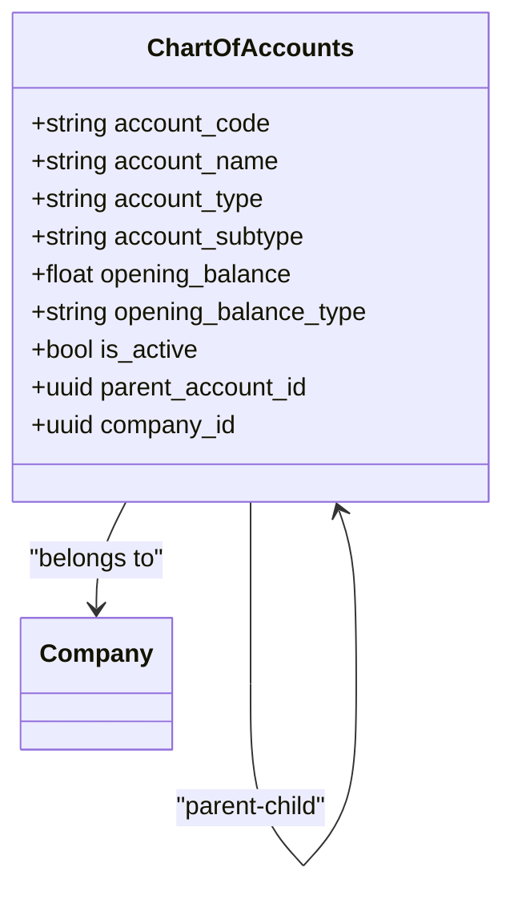
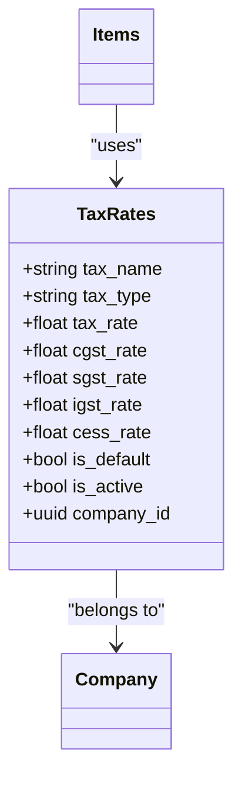
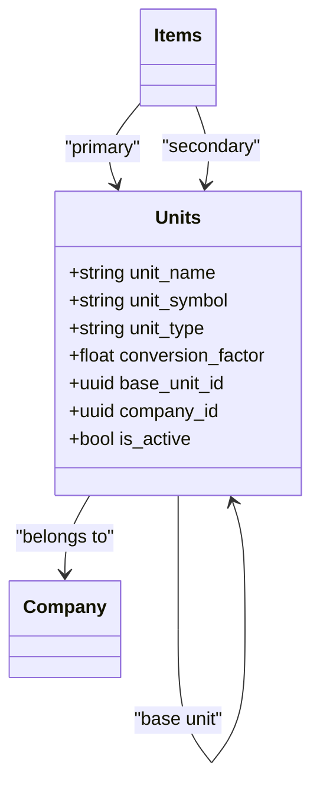
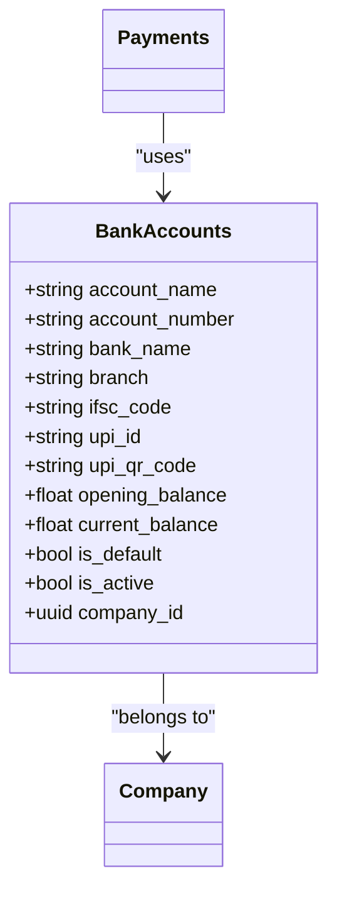
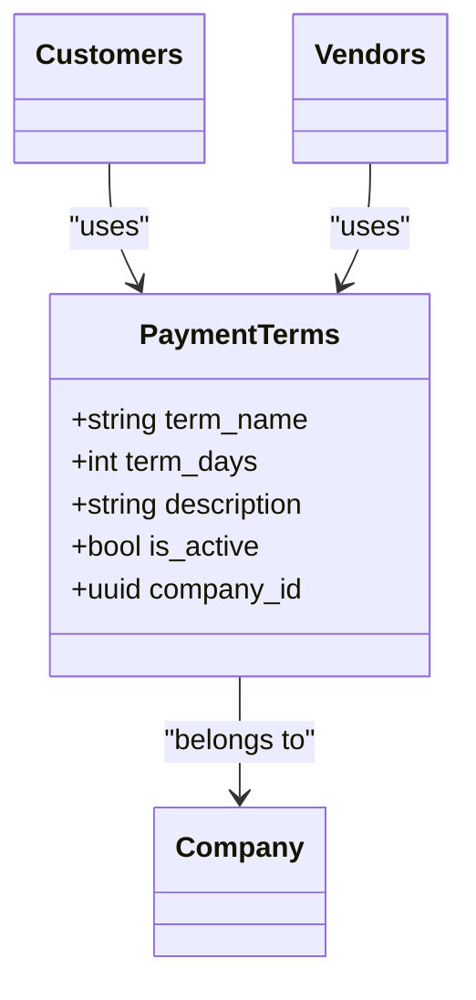
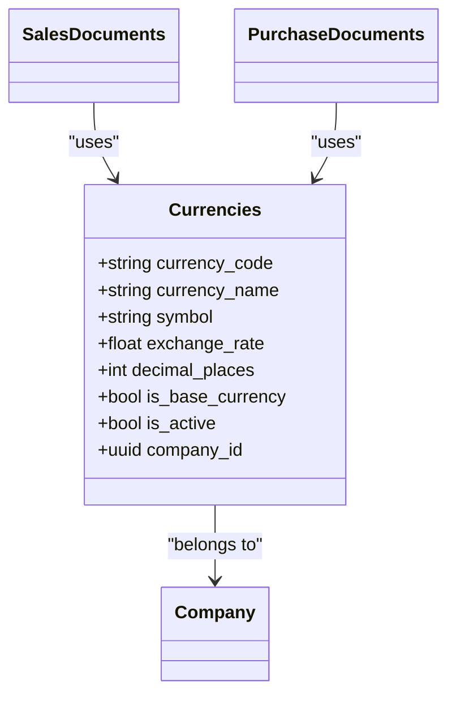
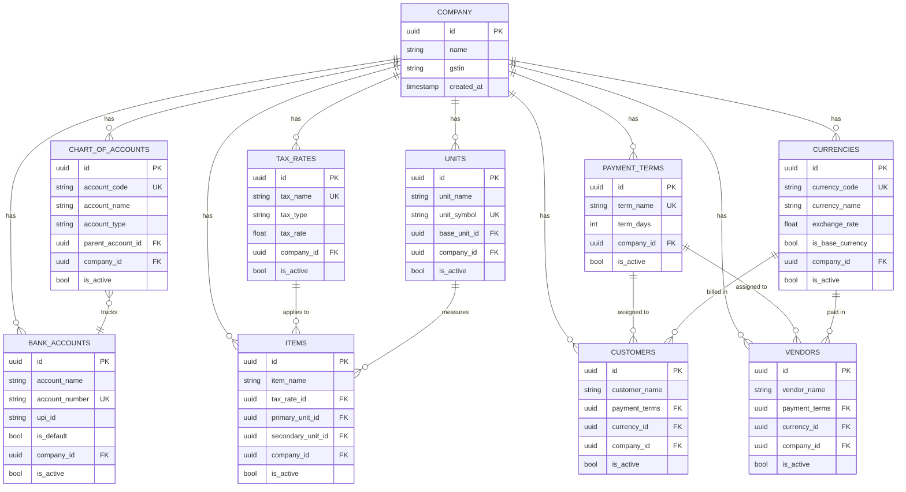

# Master Data Management

<cite>
**Referenced Files in This Document**   
- [masterDataService.js](file://src/services/masterDataService.js)
- [accountValidator.js](file://src/services/validators/accountValidator.js)
- [taxRateValidator.js](file://src/services/validators/taxRateValidator.js)
- [paymentTermValidator.js](file://src/services/validators/paymentTermValidator.js)
- [db.js](file://src/lib/db.js)
- [chart-of-accounts.js](file://src/pages/api/master-data/chart-of-accounts.js)
- [tax-rates/index.js](file://src/pages/api/master-data/tax-rates/index.js)
- [bank-accounts/index.js](file://src/pages/api/master-data/bank-accounts/index.js)
- [payment-terms/index.js](file://src/pages/api/master-data/payment-terms/index.js)
- [currency/index.js](file://src/pages/api/master-data/currency/index.js)
- [units/index.js](file://src/pages/api/master-data/units/index.js)
</cite>

## Table of Contents
1. [Introduction](#introduction)
2. [Chart of Accounts](#chart-of-accounts)
3. [Tax Rates](#tax-rates)
4. [Units of Measurement](#units-of-measurement)
5. [Bank Accounts](#bank-accounts)
6. [Payment Terms](#payment-terms)
7. [Currencies](#currencies)
8. [Data Model Relationships](#data-model-relationships)
9. [Validation Rules](#validation-rules)
10. [Practical Implementation Examples](#practical-implementation-examples)
11. [Impact on Transaction Processing](#impact-on-transaction-processing)
12. [Common Issues and Troubleshooting](#common-issues-and-troubleshooting)
13. [Performance Optimization](#performance-optimization)

## Introduction
The master data management system in ezbillify-v1 provides a comprehensive framework for managing core financial entities that form the foundation of accounting, sales, and purchase operations. This document details the implementation of key master data entities including chart of accounts, tax rates, units of measurement, bank accounts, payment terms, and currencies. The system ensures data integrity through robust validation rules, prevents circular references, and maintains referential integrity across transactional data. Master data serves as the backbone for all financial operations, influencing everything from invoice generation to financial reporting.

## Chart of Accounts
The chart of accounts implementation provides a hierarchical structure for organizing financial accounts with comprehensive validation and integrity checks. Accounts are organized by account code, type, and optional parent-child relationships, enabling detailed financial categorization.

**Diagram sources**
- [masterDataService.js](file://src/services/masterDataService.js#L5-L59)
- [accountValidator.js](file://src/services/validators/accountValidator.js#L3-L190)

**Section sources**
- [masterDataService.js](file://src/services/masterDataService.js#L5-L59)
- [accountValidator.js](file://src/services/validators/accountValidator.js#L3-L190)
- [chart-of-accounts.js](file://src/pages/api/master-data/chart-of-accounts.js#L1-L55)

## Tax Rates
The tax rates system supports multiple tax types including GST, VAT, and service tax with comprehensive validation for tax components. The implementation includes automatic calculation of CGST, SGST, and IGST components based on the total tax rate, ensuring compliance with tax regulations.

**Diagram sources**
- [masterDataService.js](file://src/services/masterDataService.js#L61-L123)
- [taxRateValidator.js](file://src/services/validators/taxRateValidator.js#L3-L208)

**Section sources**
- [masterDataService.js](file://src/services/masterDataService.js#L61-L123)
- [taxRateValidator.js](file://src/services/validators/taxRateValidator.js#L3-L208)
- [tax-rates/index.js](file://src/pages/api/master-data/tax-rates/index.js#L1-L83)

## Units of Measurement
The units of measurement system supports both simple and compound units with conversion factors between base and derived units. This enables accurate inventory tracking and pricing across different measurement systems, such as converting between kilograms and grams or liters and milliliters.

**Diagram sources**
- [masterDataService.js](file://src/services/masterDataService.js#L125-L181)
- [units/index.js](file://src/pages/api/master-data/units/index.js#L1-L71)

**Section sources**
- [masterDataService.js](file://src/services/masterDataService.js#L125-L181)
- [units/index.js](file://src/pages/api/master-data/units/index.js#L1-L71)

## Bank Accounts
The bank accounts system includes support for UPI integration with QR code generation for digital payments. Each bank account is associated with a company and can be designated as the default account for transactions. The system prevents deletion of accounts with transaction history to maintain financial integrity.

**Diagram sources**
- [masterDataService.js](file://src/services/masterDataService.js#L253-L314)
- [bank-accounts/index.js](file://src/pages/api/master-data/bank-accounts/index.js#L1-L78)

**Section sources**
- [masterDataService.js](file://src/services/masterDataService.js#L253-L314)
- [bank-accounts/index.js](file://src/pages/api/master-data/bank-accounts/index.js#L1-L78)

## Payment Terms
The payment terms system enables flexible credit management with term days calculation and cash flow impact analysis. Payment terms are validated for potential circular references and usage in customer and vendor records, ensuring that active terms cannot be deleted.

**Diagram sources**
- [masterDataService.js](file://src/services/masterDataService.js#L379-L431)
- [paymentTermValidator.js](file://src/services/validators/paymentTermValidator.js#L3-L255)

**Section sources**
- [masterDataService.js](file://src/services/masterDataService.js#L379-L431)
- [paymentTermValidator.js](file://src/services/validators/paymentTermValidator.js#L3-L255)
- [payment-terms/index.js](file://src/pages/api/master-data/payment-terms/index.js#L1-L66)

## Currencies
The currencies system supports multi-currency operations with exchange rate management and base currency designation. Each company can have multiple currencies with one designated as the base currency for financial reporting. Exchange rates are maintained for currency conversion in international transactions.

**Diagram sources**
- [masterDataService.js](file://src/services/masterDataService.js#L316-L377)
- [currency/index.js](file://src/pages/api/master-data/currency/index.js#L1-L81)

**Section sources**
- [masterDataService.js](file://src/services/masterDataService.js#L316-L377)
- [currency/index.js](file://src/pages/api/master-data/currency/index.js#L1-L81)

## Data Model Relationships
The master data entities are interconnected through a well-defined relational model that ensures data consistency and referential integrity. The relationships between entities support complex business operations while preventing data anomalies.

**Diagram sources**
- [masterDataService.js](file://src/services/masterDataService.js)
- [db.js](file://src/lib/db.js)

## Validation Rules
The master data system implements comprehensive validation rules to ensure data quality and prevent common data entry errors. These rules are enforced at both the application and database levels to maintain data integrity.

### Account Validation Rules
- Account code must be unique within a company and follow the format: uppercase letters, numbers, and hyphens only
- Account name is required and must be unique within a company
- Opening balance cannot be negative
- Account type must be one of: asset, liability, equity, income, expense, or cogs
- Circular references in account hierarchy are prevented through recursive validation
- Accounts with transactions cannot be deleted

### Tax Rate Validation Rules
- Tax name must be unique within a company
- Tax rate must be between 0 and 100 percent
- For GST rates, CGST + SGST must equal the total tax rate, and IGST must equal the total tax rate
- Cess rate must be between 0 and 100 percent
- Tax rates assigned to items cannot be deleted

### Unit Validation Rules
- Unit symbol must be unique within a company
- Conversion factor must be a positive number
- Units assigned to items cannot be deleted
- Base unit must exist and be valid

### Bank Account Validation Rules
- Account number must be unique within a company
- UPI ID must follow valid UPI format
- Bank accounts with payment transactions cannot be deleted
- Only one default bank account per company

### Payment Term Validation Rules
- Term name must be unique within a company
- Term days must be between 0 and 365
- Payment terms assigned to customers or vendors cannot be deleted

### Currency Validation Rules
- Currency code must be unique within a company
- Only one base currency per company
- Exchange rate must be a positive number
- Currencies used in transactions cannot be deleted

**Section sources**
- [accountValidator.js](file://src/services/validators/accountValidator.js#L3-L190)
- [taxRateValidator.js](file://src/services/validators/taxRateValidator.js#L3-L208)
- [paymentTermValidator.js](file://src/services/validators/paymentTermValidator.js#L3-L255)
- [masterDataService.js](file://src/services/masterDataService.js)

## Practical Implementation Examples
This section provides practical examples of setting up key master data entities in ezbillify-v1.

### Setting Up a New Chart of Accounts
To set up a new chart of accounts, navigate to the Master Data section and select Chart of Accounts. Create top-level accounts for each account type (Assets, Liabilities, Equity, Income, Expenses) and then create sub-accounts as needed. For example, under Assets, create sub-accounts for Current Assets and Fixed Assets, then further subdivide into Bank Accounts, Accounts Receivable, etc. Ensure account codes follow a logical hierarchy (e.g., 1000 for Assets, 1100 for Current Assets, 1110 for Bank Accounts).

### Configuring GST Tax Rates
To configure GST tax rates, create a new tax rate with the type "gst" and specify the total tax rate (e.g., 18%). The system will automatically calculate CGST (9%) and SGST (9%) components for intra-state transactions, and IGST (18%) for inter-state transactions. Mark commonly used tax rates as default for easier selection during invoice creation. For example, create tax rates for 5%, 12%, 18%, and 28% GST with appropriate cess rates if applicable.

### Defining Payment Terms
To define payment terms, create terms that reflect your business requirements and customer relationships. Common payment terms include "Immediate Payment" (0 days), "Net 7" (7 days), "Net 15" (15 days), and "Net 30" (30 days). Consider the cash flow impact when setting terms - shorter terms improve cash flow but may affect customer relationships, while longer terms can increase sales but tie up working capital. Use the built-in cash flow impact calculator to evaluate different scenarios.

### Managing Bank Accounts with UPI Integration
To manage bank accounts with UPI integration, add your bank account details including UPI ID. The system will generate a UPI QR code that customers can scan to make payments directly to your account. Designate one account as the default for automatic selection in payment receipts. Regularly reconcile the current balance with your bank statement to maintain accuracy. For businesses with multiple bank accounts, use descriptive names to distinguish between accounts (e.g., "HDFC Current Account", "ICICI Savings Account").

**Section sources**
- [masterDataService.js](file://src/services/masterDataService.js)
- [accountValidator.js](file://src/services/validators/accountValidator.js)
- [taxRateValidator.js](file://src/services/validators/taxRateValidator.js)
- [paymentTermValidator.js](file://src/services/validators/paymentTermValidator.js)

## Impact on Transaction Processing
Master data plays a critical role in transaction processing across sales, purchase, and accounting modules. When creating sales invoices, the system uses the customer's assigned payment terms to calculate due dates, applies the appropriate tax rates based on item configuration, and posts entries to the designated accounts in the chart of accounts. Similarly, purchase transactions use vendor payment terms, tax rates, and account mappings.

In the accounting module, journal entries reference accounts from the chart of accounts, ensuring all transactions are properly categorized. Financial reports such as Profit & Loss statements, Balance Sheets, and Cash Flow statements are generated by aggregating transaction data based on account types and subtypes defined in the master data.

Currency settings affect multi-currency transactions, automatically applying exchange rates for foreign currency invoices and calculating realized gains or losses on settlement. Unit of measurement settings ensure accurate inventory tracking when items are purchased in one unit (e.g., kilograms) and sold in another (e.g., grams).

**Section sources**
- [masterDataService.js](file://src/services/masterDataService.js)
- [db.js](file://src/lib/db.js)

## Common Issues and Troubleshooting
This section addresses common issues encountered with master data management and provides troubleshooting guidance.

### Circular References in Accounts
Circular references occur when an account hierarchy creates a loop (e.g., Account A is parent of Account B, which is parent of Account C, which is parent of Account A). This is prevented by the `validateAccountHierarchy` function which performs a depth-first search to detect potential circular dependencies before saving changes. If you encounter this error, review the parent-child relationships and restructure the hierarchy to eliminate the circular reference.

### Tax Rate Application Errors
Tax rate application errors typically occur when there's a mismatch between the configured tax components and the expected values. For GST rates, ensure that CGST + SGST equals the total tax rate and IGST equals the total tax rate. The system validates these relationships and will display specific error messages if the calculations don't match. Use the GST component calculator to automatically compute the correct values based on the total tax rate.

### Currency Conversion Problems
Currency conversion problems may arise when exchange rates are not updated regularly or when the base currency is changed after transactions have been recorded. To prevent issues, ensure exchange rates are updated frequently based on current market rates. Avoid changing the base currency after financial transactions have been recorded, as this can affect the accuracy of historical financial data. If currency conversion issues occur, verify the exchange rates and recalculate affected transactions.

**Section sources**
- [accountValidator.js](file://src/services/validators/accountValidator.js#L79-L134)
- [taxRateValidator.js](file://src/services/validators/taxRateValidator.js#L174-L208)
- [masterDataService.js](file://src/services/masterDataService.js)

## Performance Optimization
For master data operations with large datasets, several performance optimization strategies are implemented:

1. **Indexing**: Database indexes are created on frequently queried fields such as account_code, tax_name, and company_id to speed up search operations.

2. **Caching**: Frequently accessed master data is cached at the application level to reduce database queries. The system uses a combination of in-memory caching and browser storage for optimal performance.

3. **Batch Operations**: When importing or updating large volumes of master data, use batch operations instead of individual requests to minimize network overhead and database transactions.

4. **Pagination**: Large master data lists are paginated to improve loading times and reduce memory usage. The system supports server-side pagination with configurable page sizes.

5. **Selective Field Loading**: APIs retrieve only the required fields rather than entire records, reducing payload size and improving response times.

6. **Database Optimization**: The system uses efficient database queries with proper filtering and ordering to minimize data retrieval and processing time.

7. **Validation Optimization**: Validation rules are optimized to minimize database queries, using batch checks where possible.

**Section sources**
- [masterDataService.js](file://src/services/masterDataService.js)
- [db.js](file://src/lib/db.js)