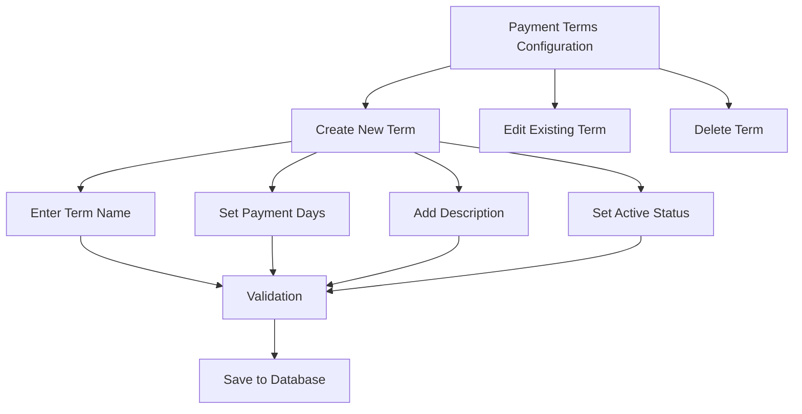
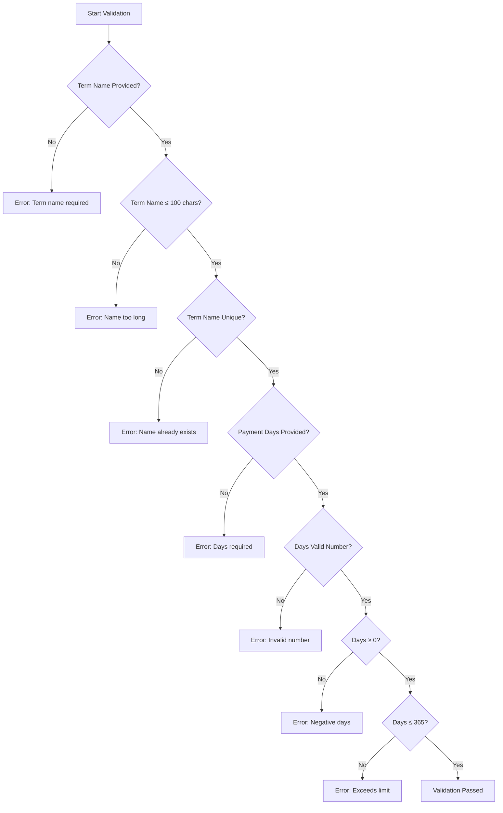
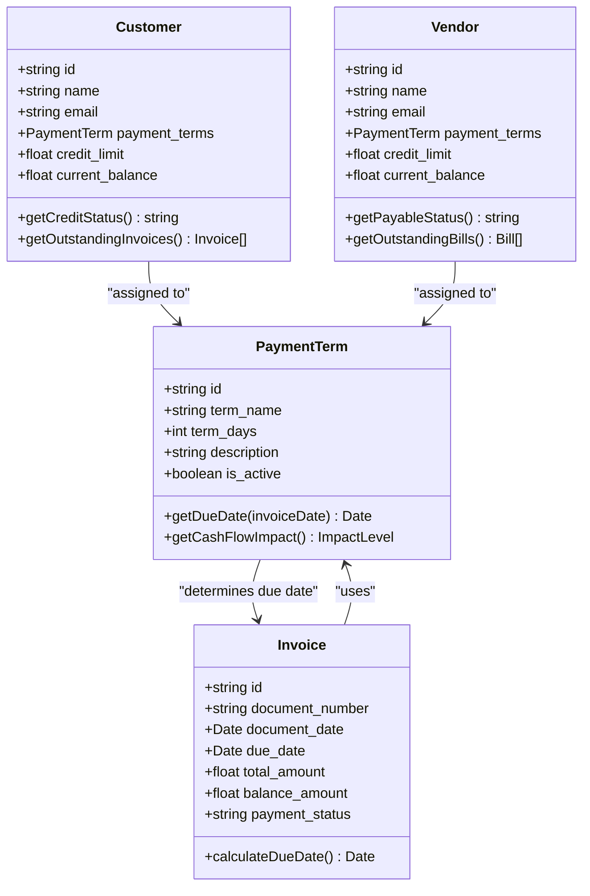
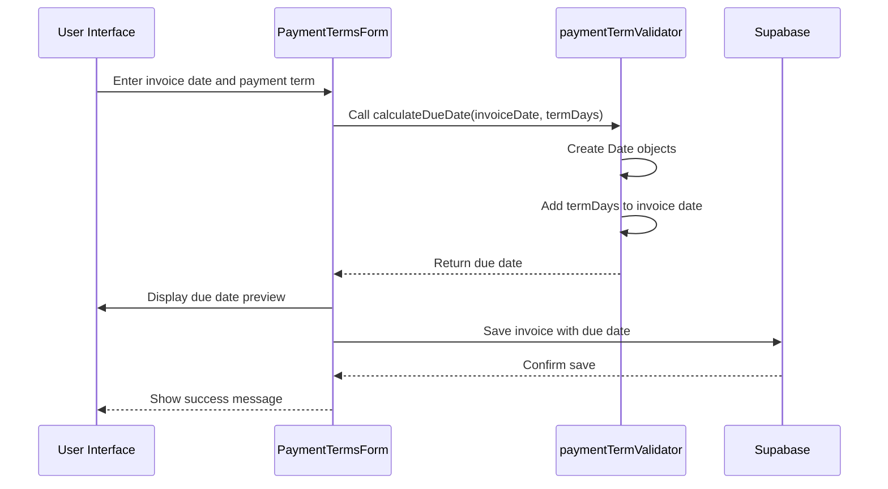
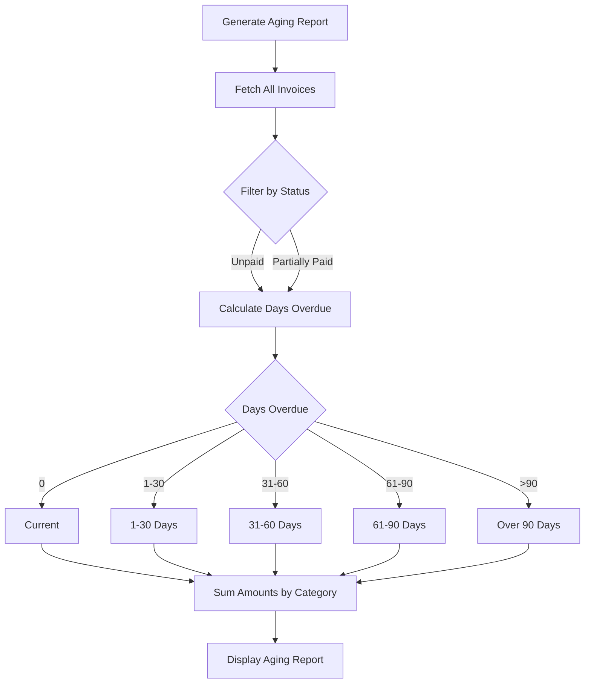
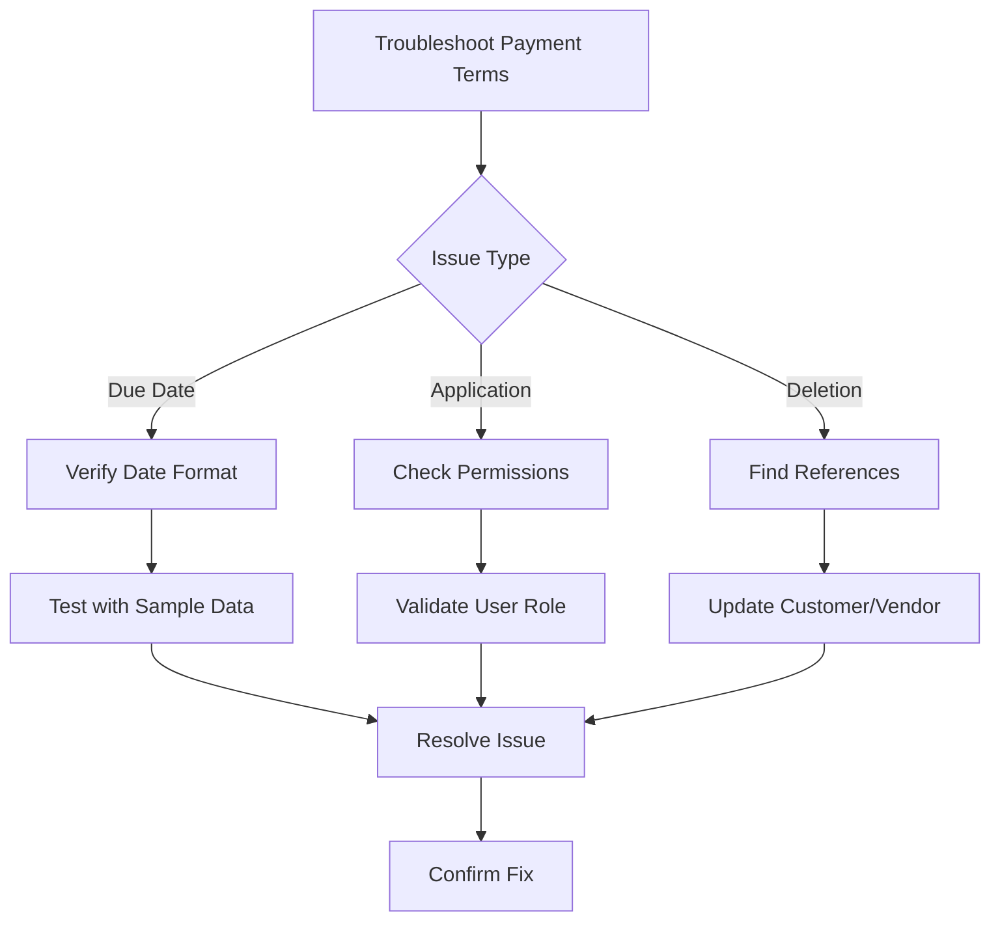
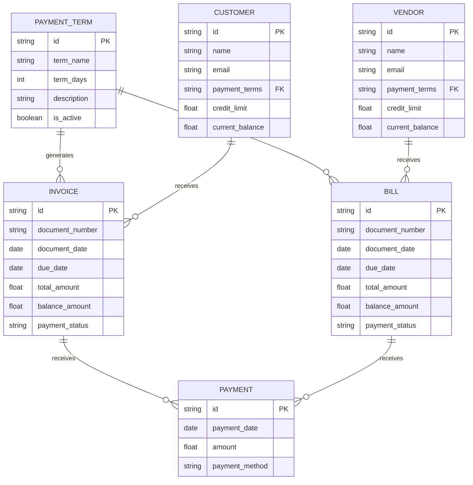

# Payment Terms Configuration

<cite>
**Referenced Files in This Document**   
- [paymentTermValidator.js](file://src/services/validators/paymentTermValidator.js)
- [PaymentTermsForm.js](file://src/components/master-data/PaymentTermsForm.js)
- [PaymentTermsList.js](file://src/components/master-data/PaymentTermsList.js)
- [payment-terms.js](file://src/pages/master-data/payment-terms.js)
- [index.js](file://src/pages/api/master-data/payment-terms/index.js)
- [\[id\].js](file://src/pages/api/master-data/payment-terms/[id].js)
- [credit-info.js](file://src/pages/api/customers/[id]/credit-info.js)
- [PaymentForm.js](file://src/components/sales/PaymentForm.js)
- [CustomerLedger.js](file://src/components/sales/CustomerLedger.js)
- [index.js](file://src/pages/api/sales/invoices/index.js)
- [\[documentId\].js](file://src/pages/api/sales-documents/[documentId].js)
</cite>

## Table of Contents
1. [Introduction](#introduction)
2. [Payment Terms Implementation](#payment-terms-implementation)
3. [Validation Rules](#validation-rules)
4. [Integration with Credit Management](#integration-with-credit-management)
5. [Due Date Calculations](#due-date-calculations)
6. [Aging Reports and Financial Impact](#aging-reports-and-financial-impact)
7. [Configuration Examples](#configuration-examples)
8. [Troubleshooting Common Issues](#troubleshooting-common-issues)
9. [Cash Flow Forecasting](#cash-flow-forecasting)

## Introduction
The Payment Terms Configuration module in ezbillify-v1 enables businesses to define and manage payment terms for customers and vendors. This documentation explains the implementation of standard payment terms such as Net 30, Due on Receipt, and advance payment requirements. The system supports comprehensive validation rules, integration with credit management, and provides insights into cash flow forecasting and accounts receivable/payable management.

## Payment Terms Implementation

The Payment Terms module allows users to configure various payment terms that govern when payments are due for invoices. The implementation supports three primary types of payment terms:

- **Net Terms**: Payment is due within a specified number of days from the invoice date (e.g., Net 30, Net 45)
- **Immediate Terms**: Payment is due upon receipt of the invoice or immediately (e.g., Due on Receipt, COD)
- **Advance Terms**: Payment is required before goods or services are delivered

The system provides a user-friendly interface for creating and managing payment terms through the Payment Terms Form component. Users can select from common pre-defined terms or create custom terms tailored to their business needs.

The implementation includes a quick-select feature for common payment terms including Immediate (0 days), Net 7, Net 15, Net 30, Net 45, Net 60, and Net 90. Each payment term consists of a name, number of payment days, description, and active status.



**Diagram sources**
- [PaymentTermsForm.js](file://src/components/master-data/PaymentTermsForm.js#L11-L344)
- [payment-terms.js](file://src/pages/master-data/payment-terms.js#L7-L62)

**Section sources**
- [PaymentTermsForm.js](file://src/components/master-data/PaymentTermsForm.js#L11-L344)
- [payment-terms.js](file://src/pages/master-data/payment-terms.js#L7-L62)

## Validation Rules

The payment term validation system ensures data integrity through comprehensive validation rules implemented in the `paymentTermValidator.js` file. The validation process occurs both on the client side and server side to ensure consistency and reliability.

### Field Validation
The system validates the following fields when creating or updating payment terms:

- **Term Name**: Required field with a maximum length of 100 characters
- **Payment Days**: Required numeric field with values between 0 and 365 days
- **Description**: Optional field with a maximum length of 500 characters
- **Uniqueness**: Payment term names must be unique within a company



The validation logic is implemented in the `validatePaymentTermData` function, which returns an object containing validation errors. The system also includes a separate function `validatePaymentTermName` that checks for uniqueness across existing payment terms within the same company.

**Diagram sources**
- [paymentTermValidator.js](file://src/services/validators/paymentTermValidator.js#L3-L67)

**Section sources**
- [paymentTermValidator.js](file://src/services/validators/paymentTermValidator.js#L3-L67)
- [PaymentTermsForm.js](file://src/components/master-data/PaymentTermsForm.js#L35-L52)

## Integration with Credit Management

Payment terms are tightly integrated with customer and vendor credit management systems. When a payment term is assigned to a customer or vendor, it directly impacts their credit profile and payment expectations.

### Customer Credit Integration
When configuring customer profiles, users can assign specific payment terms that determine when invoices are due. The system uses these terms to calculate due dates and monitor payment status. The credit management system considers the payment term when evaluating a customer's creditworthiness and outstanding balances.

The integration includes validation to prevent deletion of payment terms that are currently assigned to customers or vendors. This ensures data integrity and prevents orphaned references in the system.



**Diagram sources**
- [credit-info.js](file://src/pages/api/customers/[id]/credit-info.js#L1-L231)
- [PaymentForm.js](file://src/components/sales/PaymentForm.js#L969-L986)
- [CustomerLedger.js](file://src/components/sales/CustomerLedger.js#L305-L310)

**Section sources**
- [credit-info.js](file://src/pages/api/customers/[id]/credit-info.js#L1-L231)
- [CustomerLedger.js](file://src/components/sales/CustomerLedger.js#L305-L310)

## Due Date Calculations

The system automatically calculates due dates for invoices based on the assigned payment terms. The calculation logic is implemented in the `calculateDueDate` function within the payment term validator.

### Calculation Logic
The due date is calculated by adding the number of payment days to the invoice date. For example:
- Invoice date: January 1, 2024
- Payment term: Net 30
- Due date: January 31, 2024

The calculation handles various edge cases including month boundaries, leap years, and different month lengths. The system uses JavaScript's Date object to ensure accurate date arithmetic.



The system provides a due date preview in the payment terms form, allowing users to see the calculated due date before saving the term. This preview uses the current date as a reference point to show when an invoice would be due if issued today.

**Diagram sources**
- [paymentTermValidator.js](file://src/services/validators/paymentTermValidator.js#L120-L124)
- [PaymentTermsForm.js](file://src/components/master-data/PaymentTermsForm.js#L146-L152)

**Section sources**
- [paymentTermValidator.js](file://src/services/validators/paymentTermValidator.js#L120-L124)
- [PaymentTermsForm.js](file://src/components/master-data/PaymentTermsForm.js#L146-L152)

## Aging Reports and Financial Impact

Payment terms play a crucial role in aging reports and financial analysis. The system uses payment terms to categorize outstanding receivables and payables into aging buckets such as current, 1-30 days overdue, 31-60 days overdue, etc.

### Aging Report Logic
The aging report calculates the age of outstanding invoices by comparing the current date with the due date. Invoices are categorized as:
- **Current**: Due date is today or in the future
- **1-30 days overdue**: Due date was 1-30 days ago
- **31-60 days overdue**: Due date was 31-60 days ago
- **61-90 days overdue**: Due date was 61-90 days ago
- **Over 90 days overdue**: Due date was more than 90 days ago

The system also provides insights into the financial impact of different payment terms on cash flow and working capital.



**Diagram sources**
- [index.js](file://src/pages/api/sales/invoices/index.js#L31-L138)
- [\[documentId\].js](file://src/pages/api/sales-documents/[documentId].js#L36-L162)

**Section sources**
- [index.js](file://src/pages/api/sales/invoices/index.js#L31-L138)
- [CustomerLedger.js](file://src/components/sales/CustomerLedger.js#L673-L714)

## Configuration Examples

### Standard Payment Terms Setup
To set up standard payment terms, users can use the quick-select buttons in the Payment Terms Form:

1. Click "Add Payment Term" button
2. Select a common term from the quick-select grid (e.g., Net 30)
3. The form automatically populates with the term name, days, and description
4. Review and modify if needed
5. Click "Create Payment Term"

### Custom Payment Terms Configuration
For custom payment terms:

1. Click "Add Payment Term" button
2. Enter a unique term name (e.g., "Net 25")
3. Set payment days to 25
4. Add a description (e.g., "Payment due within 25 days")
5. Ensure the term is set to active
6. Click "Create Payment Term"

### Industry-Specific Best Practices
The system provides guidance on industry best practices for payment terms:

- **Retail/B2C**: Immediate to Net 7 (quick payment expected)
- **Small Business B2B**: Net 15 to Net 30 (balance between cash flow and relationships)
- **Corporate/Enterprise**: Net 30 to Net 45 (standard corporate cycles)
- **Government**: Net 30 to Net 90 (longer government processes)
- **Construction**: Net 30 with progress payments (milestone billing)
- **Wholesale**: Net 30 with early payment discounts (volume incentives)

**Section sources**
- [PaymentTermsForm.js](file://src/components/master-data/PaymentTermsForm.js#L288-L344)

## Troubleshooting Common Issues

### Incorrect Due Date Calculations
If due dates are calculated incorrectly:

1. Verify the invoice date format is correct (YYYY-MM-DD)
2. Check that the payment term days are set correctly
3. Ensure the system timezone is configured properly
4. Test with different dates to identify pattern

### Payment Term Application Errors
When payment terms cannot be applied to customers or vendors:

1. Verify the payment term exists and is active
2. Check that the user has appropriate permissions
3. Ensure the customer/vendor record is not locked
4. Confirm there are no circular references

### Deletion Restrictions
Payment terms cannot be deleted if they are assigned to customers or vendors. To resolve:

1. Identify all customers/vendors using the term
2. Update their profiles to use a different payment term
3. Once no references exist, the term can be deleted



**Diagram sources**
- [\[id\].js](file://src/pages/api/master-data/payment-terms/[id].js#L63-L112)
- [paymentTermValidator.js](file://src/services/validators/paymentTermValidator.js#L69-L108)

**Section sources**
- [\[id\].js](file://src/pages/api/master-data/payment-terms/[id].js#L63-L112)
- [paymentTermValidator.js](file://src/services/validators/paymentTermValidator.js#L69-L108)

## Cash Flow Forecasting

Payment terms significantly impact cash flow forecasting and working capital management. The system provides tools to analyze the financial impact of different payment terms.

### Cash Flow Impact Analysis
The `getCashFlowImpact` function evaluates payment terms based on their days:

- **0 days (Immediate)**: Excellent impact - immediate cash flow
- **≤7 days**: Very Good impact - quick cash flow
- **≤15 days**: Good impact - short waiting period
- **≤30 days**: Standard impact - industry standard
- **≤45 days**: Moderate impact - some delay
- **≤60 days**: Poor impact - significant waiting
- **>60 days**: Very Poor impact - long waiting period

### Working Capital Impact
The system calculates working capital impact assuming a 12% annual interest rate:

```
Single Invoice Cost = (Amount × 0.12 × Days) / 365
Annual Total Cost = (Amount × Volume × 0.12 × Days) / 365
```

### Collection Risk Assessment
The `getCollectionRisk` function assesses risk based on payment days:

- **0 days**: None (0% risk)
- **≤30 days**: Low (2% risk)
- **≤60 days**: Medium (5% risk)
- **≤90 days**: High (10% risk)
- **>90 days**: Very High (15% risk)

This analysis helps businesses balance customer relationships with financial stability.



**Diagram sources**
- [paymentTermValidator.js](file://src/services/validators/paymentTermValidator.js#L127-L179)
- [index.js](file://src/pages/api/master-data/payment-terms/index.js#L4-L66)
- [\[id\].js](file://src/pages/api/master-data/payment-terms/[id].js#L4-L120)

**Section sources**
- [paymentTermValidator.js](file://src/services/validators/paymentTermValidator.js#L127-L179)
- [index.js](file://src/pages/api/master-data/payment-terms/index.js#L4-L66)