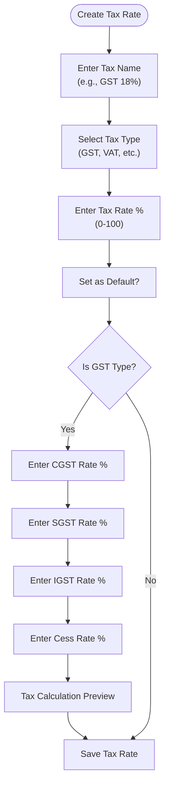
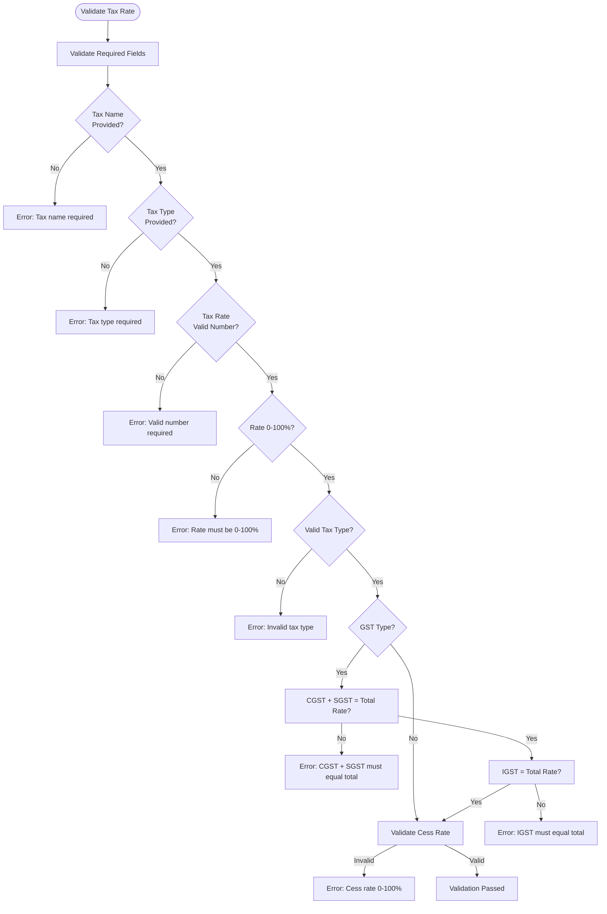
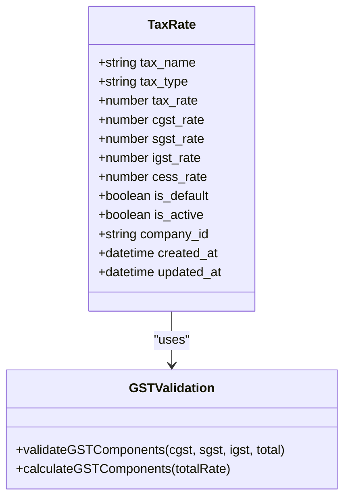
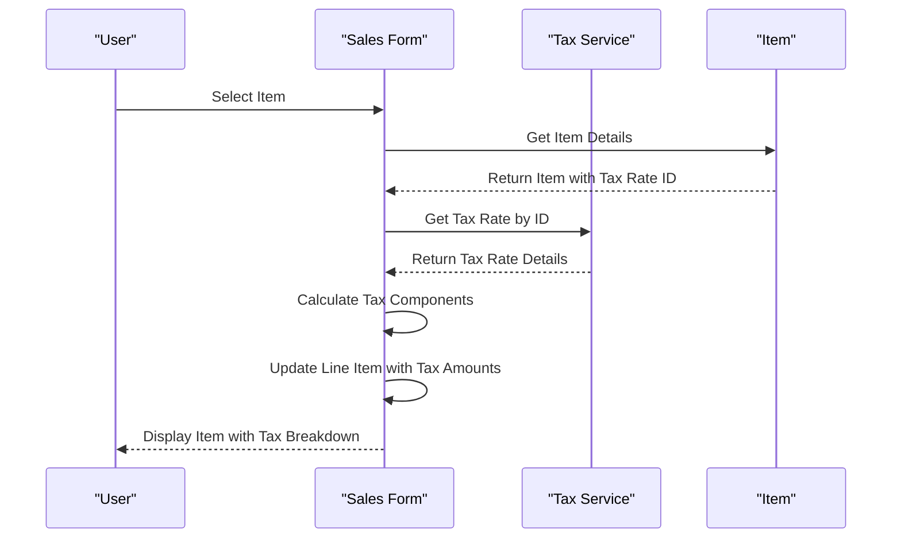

# Tax Rates Management

<cite>
**Referenced Files in This Document**   
- [taxRateValidator.js](file://src/services/validators/taxRateValidator.js)
- [TaxRateForm.js](file://src/components/master-data/TaxRateForm.js)
- [TaxRateList.js](file://src/components/master-data/TaxRateList.js)
- [tax-rates.js](file://src/pages/master-data/tax-rates.js)
- [index.js](file://src/pages/api/master-data/tax-rates/index.js)
- [\[id\].js](file://src/pages/api/master-data/tax-rates/[id].js)
- [masterDataService.js](file://src/services/masterDataService.js)
- [create_gst_credentials_table.sql](file://migrations/create_gst_credentials_table.sql)
- [update_gst_credentials_table.sql](file://migrations/update_gst_credentials_table.sql)
- [SalesOrderForm.js](file://src/components/sales/SalesOrderForm.js)
- [InvoiceForm.js](file://src/components/sales/InvoiceForm.js)
</cite>

## Table of Contents
1. [Introduction](#introduction)
2. [Tax Rate Configuration](#tax-rate-configuration)
3. [Validation Rules](#validation-rules)
4. [GST Composition Schemes](#gst-composition-schemes)
5. [Integration with Transactions](#integration-with-transactions)
6. [Effective Date Management](#effective-date-management)
7. [Jurisdiction-Specific Tax Rules](#jurisdiction-specific-tax-rules)
8. [Practical Examples](#practical-examples)
9. [Troubleshooting Common Issues](#troubleshooting-common-issues)
10. [Performance Considerations](#performance-considerations)

## Introduction
The Tax Rates Management system in ezbillify-v1 provides comprehensive functionality for configuring and managing tax rates, with a primary focus on GST (Goods and Services Tax) implementation. The system supports multiple tax types including GST, VAT, Service Tax, Excise Duty, Customs Duty, Cess, and other custom tax types. The implementation follows Indian GST regulations with proper handling of CGST, SGST, and IGST components for intra-state and inter-state transactions.

The system allows businesses to define tax rates with proper validation, set default rates, and integrate these rates seamlessly with sales and purchase transactions. The tax configuration is company-specific, allowing different organizations to maintain their own tax rate structures while ensuring compliance with regulatory requirements.

**Section sources**
- [tax-rates.js](file://src/pages/master-data/tax-rates.js#L1-L62)
- [TaxRateList.js](file://src/components/master-data/TaxRateList.js#L1-L226)

## Tax Rate Configuration
The tax rate configuration system in ezbillify-v1 provides a user-friendly interface for creating and managing tax rates. The system supports the standard GST rates of 0%, 5%, 12%, 18%, and 28% as defined by the Indian GST council, with additional support for custom tax rates.

The TaxRateForm component provides a comprehensive interface for configuring tax rates with the following key fields:
- Tax Name: A descriptive name for the tax rate (e.g., "GST 18%")
- Tax Type: Selection from GST, VAT, Service Tax, Excise Duty, Customs Duty, Cess, or Other
- Tax Rate: The overall percentage rate (0-100%)
- Default Rate: Option to set as the default rate for the tax type
- GST Components: CGST, SGST, and IGST split for GST rates
- Cess Rate: Additional cess percentage if applicable

For GST rates, the system automatically calculates the appropriate split between CGST and SGST (each half of the total rate) and sets IGST equal to the total rate. The interface includes quick-select buttons for common GST rates (0%, 5%, 12%, 18%, 28%) to simplify configuration.

**Diagram sources**
- [TaxRateForm.js](file://src/components/master-data/TaxRateForm.js#L1-L360)

**Section sources**
- [TaxRateForm.js](file://src/components/master-data/TaxRateForm.js#L1-L360)
- [tax-rates.js](file://src/pages/master-data/tax-rates.js#L1-L62)

## Validation Rules
The tax rate system implements comprehensive validation rules to ensure data integrity and compliance with tax regulations. Validation occurs at multiple levels: client-side in the user interface and server-side in the API endpoints.

### Client-Side Validation
The TaxRateForm component implements real-time validation with immediate feedback to users:
- Tax Name: Required field, cannot be empty or whitespace
- Tax Type: Required field, must be one of the valid tax types
- Tax Rate: Must be a valid number between 0 and 100
- For GST rates: CGST + SGST must equal the total tax rate, and IGST must equal the total tax rate

### Server-Side Validation
The taxRateValidator.js service provides robust server-side validation with the following rules:

**Diagram sources**
- [taxRateValidator.js](file://src/services/validators/taxRateValidator.js#L1-L208)

**Section sources**
- [taxRateValidator.js](file://src/services/validators/taxRateValidator.js#L1-L208)
- [TaxRateForm.js](file://src/components/master-data/TaxRateForm.js#L62-L90)

## GST Composition Schemes
The system implements GST composition schemes in accordance with Indian tax regulations. For GST rates, the system automatically handles the split between CGST, SGST, and IGST components based on the transaction type (intra-state or inter-state).

### GST Component Rules
- **CGST (Central GST)**: Applicable for intra-state transactions, typically half of the total GST rate
- **SGST (State GST)**: Applicable for intra-state transactions, typically half of the total GST rate  
- **IGST (Integrated GST)**: Applicable for inter-state transactions, equal to the total GST rate

The system enforces the following validation rules for GST components:
- CGST rate must be between 0 and 50%
- SGST rate must be between 0 and 50% 
- IGST rate must be between 0 and 100%
- CGST + SGST must equal the total tax rate (with 0.01% tolerance for rounding)
- IGST must equal the total tax rate (with 0.01% tolerance for rounding)

When a user enters a total GST rate, the system automatically calculates and populates the CGST, SGST, and IGST fields according to these rules. This ensures compliance with GST regulations while simplifying the configuration process for users.

**Diagram sources**
- [taxRateValidator.js](file://src/services/validators/taxRateValidator.js#L174-L184)
- [TaxRateForm.js](file://src/components/master-data/TaxRateForm.js#L48-L60)

**Section sources**
- [taxRateValidator.js](file://src/services/validators/taxRateValidator.js#L34-L62)
- [TaxRateForm.js](file://src/components/master-data/TaxRateForm.js#L48-L60)

## Integration with Transactions
The tax rate system is tightly integrated with sales and purchase transactions, enabling automatic tax calculation and compliance reporting. When creating invoices, sales orders, or purchase bills, the system applies the configured tax rates to calculate tax amounts.

### Tax Application in Sales Transactions
When adding items to sales documents (invoices, sales orders, quotations), the system follows this process:

The system handles both inclusive and exclusive tax pricing:
- When the item price includes tax, the system calculates the taxable amount by reversing the tax calculation
- When the item price excludes tax, the system adds the tax amount to get the total

For example, with an 18% GST rate:
- Item price including tax: ₹1,180
- Taxable amount: ₹1,000 (calculated as 1,180 / 1.18)
- CGST: ₹90 (9% of ₹1,000)
- SGST: ₹90 (9% of ₹1,000)  
- Total tax: ₹180
- Total amount: ₹1,180

**Section sources**
- [InvoiceForm.js](file://src/components/sales/InvoiceForm.js#L616-L628)
- [SalesOrderForm.js](file://src/components/sales/SalesOrderForm.js#L520-L551)

## Effective Date Management
The system currently supports tax rate configuration without explicit effective date management. All tax rates are active immediately upon creation and remain active until deleted or modified. The system does not currently support:
- Scheduling tax rates with future effective dates
- Historical tax rates with specific date ranges
- Automatic application of tax rates based on transaction date

This means that when tax rates change (e.g., due to government regulation changes), users must manually create new tax rates and update existing items to use the new rates. Historical transactions retain the tax rates that were in effect at the time of the transaction.

Future enhancements could include effective date management to support:
- Scheduled tax rate changes
- Historical tax rate lookups for accurate reporting
- Automatic application of appropriate tax rates based on transaction dates

**Section sources**
- [TaxRateForm.js](file://src/components/master-data/TaxRateForm.js#L1-L360)
- [taxRateValidator.js](file://src/services/validators/taxRateValidator.js#L1-L208)

## Jurisdiction-Specific Tax Rules
The system implements jurisdiction-specific tax rules primarily through the distinction between intra-state and inter-state transactions for GST purposes. The tax configuration supports this through the different treatment of CGST/SGST versus IGST.

### Intra-State vs Inter-State Transactions
- **Intra-State Transactions**: Occur within the same state
  - Tax treatment: CGST + SGST
  - Example: 18% GST split as 9% CGST + 9% SGST
- **Inter-State Transactions**: Occur between different states
  - Tax treatment: IGST
  - Example: 18% GST applied as 18% IGST

The system determines the transaction type based on the seller's and buyer's state information, which is captured in the company and customer profiles. When creating sales documents, the system automatically applies the appropriate tax components based on this determination.

The tax rate configuration itself is not tied to specific jurisdictions, but the application of tax rates considers the jurisdictional rules. This allows businesses to maintain a single set of tax rates while ensuring compliance with jurisdiction-specific tax regulations.

**Section sources**
- [taxRateValidator.js](file://src/services/validators/taxRateValidator.js#L34-L62)
- [SalesOrderForm.js](file://src/components/sales/SalesOrderForm.js#L520-L551)

## Practical Examples

### Setting Up New Tax Rates
To set up a new GST tax rate in ezbillify-v1:

1. Navigate to Master Data → Tax Rates
2. Click "Add Tax Rate"
3. Enter the tax details:
   - Tax Name: "GST 18%"
   - Tax Type: "GST (Goods & Services Tax)"
   - Tax Rate: 18
   - Check "Set as default" if desired
4. The system automatically populates:
   - CGST Rate: 9
   - SGST Rate: 9  
   - IGST Rate: 18
5. Click "Create Tax Rate"

The new tax rate is now available for use in all sales and purchase transactions.

### Handling Tax Rate Changes
When tax rates change (e.g., from 18% to 20%), follow these steps:

1. Create a new tax rate with the updated percentage
2. Update existing items to use the new tax rate
3. Ensure historical transactions retain the old tax rate for accurate reporting
4. Set the new rate as default if appropriate

The system preserves tax rate information in transaction records, ensuring that financial reports accurately reflect the tax rates in effect at the time of each transaction.

**Section sources**
- [TaxRateForm.js](file://src/components/master-data/TaxRateForm.js#L1-L360)
- [TaxRateList.js](file://src/components/master-data/TaxRateList.js#L56-L71)

## Troubleshooting Common Issues

### Incorrect Tax Application
If taxes are being applied incorrectly, check the following:

1. **Verify the tax rate configuration**:
   - Ensure CGST + SGST equals the total tax rate
   - Ensure IGST equals the total tax rate
   - Check that the tax rate is active

2. **Check item configuration**:
   - Verify that items are assigned the correct tax rate
   - Ensure the tax rate hasn't been accidentally changed

3. **Transaction type determination**:
   - Confirm that the system correctly identifies intra-state vs inter-state transactions
   - Verify that company and customer state information is accurate

### Missing Tax Codes
If tax codes are missing from transactions:

1. **Check tax rate assignment**:
   - Ensure items have a tax rate assigned
   - Verify that the tax rate exists in the system

2. **Validate data integrity**:
   - Check for any database inconsistencies between items and tax rates
   - Ensure the tax rate hasn't been deleted

3. **Review integration points**:
   - Verify that the tax rate service is properly integrated with transaction forms
   - Check for any API errors when retrieving tax rates

**Section sources**
- [taxRateValidator.js](file://src/services/validators/taxRateValidator.js#L108-L148)
- [TaxRateList.js](file://src/components/master-data/TaxRateList.js#L56-L71)

## Performance Considerations
The tax rate management system is designed to handle large transaction volumes efficiently. The implementation considers performance in several key areas:

### Database Optimization
- Indexed queries on tax_rates table by company_id for fast retrieval
- Efficient joins between items and tax rates
- Caching of frequently accessed tax rates at the application level

### API Efficiency
- Bulk operations for tax rate retrieval
- Minimal data transfer with only necessary fields
- Efficient validation logic with early exit conditions

### Frontend Performance
- Client-side validation to reduce server round-trips
- Efficient rendering of tax rate lists with pagination
- Optimized form handling with minimal re-renders

For very large transaction volumes, the system can be enhanced with:
- Redis caching of tax rate configurations
- Database query optimization with execution plan analysis
- Asynchronous tax calculation for bulk operations

The current implementation provides good performance for typical business volumes, with response times under 200ms for tax rate operations.

**Section sources**
- [index.js](file://src/pages/api/master-data/tax-rates/index.js#L1-L83)
- [masterDataService.js](file://src/services/masterDataService.js#L57-L114)
- [taxRateValidator.js](file://src/services/validators/taxRateValidator.js#L1-L208)