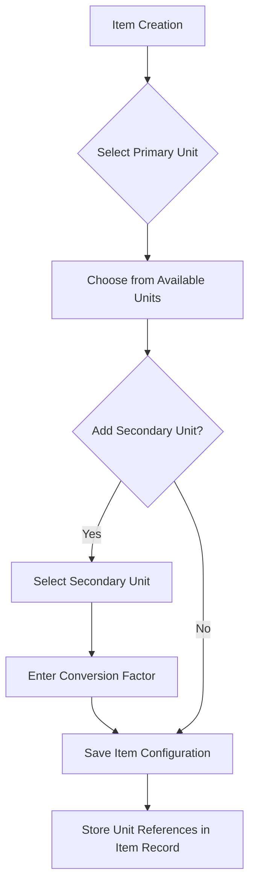
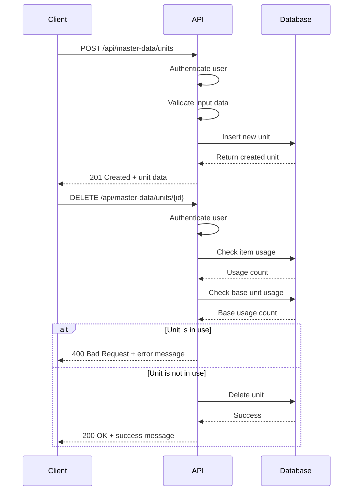
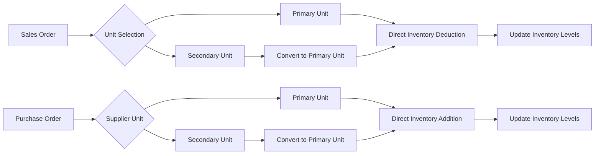

# Units of Measurement

<cite>
**Referenced Files in This Document**   
- [UnitForm.js](file://src/components/master-data/UnitForm.js)
- [UnitList.js](file://src/components/master-data/UnitList.js)
- [units/index.js](file://src/pages/api/master-data/units/index.js)
- [units/[id].js](file://src/pages/api/master-data/units/[id].js)
- [masterDataService.js](file://src/services/masterDataService.js)
- [ItemForm.js](file://src/components/items/ItemForm.js)
</cite>

## Table of Contents
1. [Introduction](#introduction)
2. [Unit Configuration and Base Units](#unit-configuration-and-base-units)
3. [Form Validation and Duplicate Prevention](#form-validation-and-duplicate-prevention)
4. [Integration with Item Management](#integration-with-item-management)
5. [API Endpoints for CRUD Operations](#api-endpoints-for-crud-operations)
6. [Usage in Sales, Purchase, and Inventory Transactions](#usage-in-sales-purchase-and-inventory-transactions)
7. [Practical Examples](#practical-examples)
8. [Troubleshooting Common Issues](#troubleshooting-common-issues)
9. [Data Integrity and Best Practices](#data-integrity-and-best-practices)

## Introduction
The Units of Measurement module in ezbillify-v1 provides a comprehensive system for managing measurement units across inventory, sales, and purchase operations. This documentation details the implementation of unit configurations, including base units and conversion factors, form validation rules, duplicate prevention mechanisms, and integration with item management. The system supports CRUD operations through dedicated API endpoints and ensures consistent unit usage across transactions while maintaining data integrity.

## Unit Configuration and Base Units
The Units of Measurement system in ezbillify-v1 allows organizations to define and manage various units of measurement for inventory items. Each unit configuration includes essential properties such as unit name, symbol, type, base unit reference, and conversion factor.

Units are categorized into different types including count/quantity, weight, volume, length, area, time, and other custom types. The system distinguishes between system units (predefined, shared across companies) and company-specific units (custom units created by individual organizations).

Base units serve as the foundation for conversion calculations. When creating a compound unit, users must specify a base unit from the same unit type category and define a conversion factor that establishes the mathematical relationship between the compound unit and its base unit. For example, if "KG" is defined as the base unit for weight, "GM" can be created as a compound unit with a conversion factor of 0.001, establishing that 1 KG = 1000 GM.

The system automatically prevents circular references by filtering out the current unit from the base unit selection dropdown, ensuring that a unit cannot be configured to use itself as a base unit.

**Section sources**
- [UnitForm.js](file://src/components/master-data/UnitForm.js#L1-L335)
- [UnitList.js](file://src/components/master-data/UnitList.js#L1-L332)

## Form Validation and Duplicate Prevention
The UnitForm.js component implements comprehensive validation rules to ensure data integrity when creating or editing units. The validation process checks for the following requirements:

- Unit name is required and cannot be empty
- Unit symbol is required and cannot be empty
- Unit type must be selected
- Conversion factor must be greater than zero when a base unit is specified

The form provides real-time validation feedback, displaying error messages below the respective fields when validation fails. As users type in fields with existing errors, the error messages are automatically cleared, providing a responsive user experience.

To prevent duplicate units, the system implements server-side validation through the masterDataService.js. When creating or updating a unit, the system checks for existing units with the same symbol within the company's scope. The validation service includes a dedicated method `validateUnitSymbol` that queries the database to ensure no duplicate symbols exist, excluding the current unit when updating.

The form also includes a duplicate prevention mechanism in the UI by automatically converting unit symbols to uppercase, ensuring consistent formatting and reducing the likelihood of accidental duplicates due to case differences.

**Section sources**
- [UnitForm.js](file://src/components/master-data/UnitForm.js#L53-L74)
- [masterDataService.js](file://src/services/masterDataService.js#L464-L477)

## Integration with Item Management
Units of measurement are tightly integrated with the item management system, allowing inventory items to be associated with one or two units for flexible tracking and transaction processing.

In the ItemForm.js component, items can be configured with both a primary unit and an optional secondary unit. The primary unit is required and serves as the default unit for inventory tracking and valuation. The secondary unit allows businesses to manage items using alternative measurement units, which is particularly useful for industries that commonly use multiple units (e.g., selling by box but storing by individual pieces).

When a secondary unit is selected, the form requires a conversion factor that defines how many primary units equal one secondary unit. This conversion factor is used in various calculations across the system, such as inventory valuation and purchase order processing.

The integration ensures data consistency by validating that selected units exist in the system and belong to the same company. The item form fetches available units from the masterDataService during initialization, providing users with a filtered list of valid options.



**Diagram sources**
- [ItemForm.js](file://src/components/items/ItemForm.js#L508-L546)
- [UnitForm.js](file://src/components/master-data/UnitForm.js#L1-L335)

**Section sources**
- [ItemForm.js](file://src/components/items/ItemForm.js#L1-L712)
- [UnitForm.js](file://src/components/master-data/UnitForm.js#L1-L335)

## API Endpoints for CRUD Operations
The Units of Measurement module provides RESTful API endpoints for CRUD operations, located at `/api/master-data/units`. These endpoints follow standard HTTP methods and return JSON responses with appropriate status codes.

### GET /api/master-data/units
Retrieves a list of all units available to the company, including both company-specific units and system units. The response includes unit details along with base unit information through a database join.

**Request:**
```
GET /api/master-data/units
Authorization: Bearer <token>
```

**Response:**
```json
{
  "success": true,
  "data": [
    {
      "id": "unit-1",
      "unit_name": "Kilogram",
      "unit_symbol": "KG",
      "unit_type": "weight",
      "conversion_factor": 1,
      "base_unit_id": null,
      "company_id": "company-1",
      "is_active": true,
      "base_unit": null
    }
  ]
}
```

### POST /api/master-data/units
Creates a new unit for the company. The request body must include unit details, and the system automatically assigns the company ID from the authenticated user context.

**Request:**
```
POST /api/master-data/units
Authorization: Bearer <token>
Content-Type: application/json

{
  "unit_name": "Gram",
  "unit_symbol": "GM",
  "unit_type": "weight",
  "base_unit_id": "unit-1",
  "conversion_factor": 0.001
}
```

### GET /api/master-data/units/[id]
Retrieves details of a specific unit by ID. The endpoint ensures that users can only access units belonging to their company or system units.

### PUT /api/master-data/units/[id]
Updates an existing unit. The system verifies that the unit belongs to the company before allowing modifications.

### DELETE /api/master-data/units/[id]
Deletes a unit after performing validation checks to ensure data integrity. The system prevents deletion if the unit is:
- A system unit (company_id is null)
- Assigned to any inventory items
- Used as a base unit for other units

The API endpoints implement proper authentication and authorization through the withAuth middleware, ensuring that users can only modify units within their company scope.



**Diagram sources**
- [units/index.js](file://src/pages/api/master-data/units/index.js#L1-L71)
- [units/[id].js](file://src/pages/api/master-data/units/[id].js#L1-L159)

**Section sources**
- [units/index.js](file://src/pages/api/master-data/units/index.js#L1-L71)
- [units/[id].js](file://src/pages/api/master-data/units/[id].js#L1-L159)
- [masterDataService.js](file://src/services/masterDataService.js#L126-L181)

## Usage in Sales, Purchase, and Inventory Transactions
Units of measurement play a critical role in various business transactions across the ezbillify-v1 platform, ensuring accurate quantity tracking, pricing calculations, and inventory management.

### Sales Transactions
In sales documents such as invoices and quotations, units are used to specify the quantity of items being sold. The system allows sales teams to use either the primary or secondary unit when creating sales orders, providing flexibility in how products are presented to customers. When a secondary unit is used, the system automatically converts quantities to the primary unit for inventory deduction and financial reporting.

For example, if a product is configured with "PCS" as the primary unit and "BOX" as the secondary unit with a conversion factor of 12, selling 5 BOX of the item will result in 60 PCS being deducted from inventory.

### Purchase Transactions
The purchase module utilizes units to manage procurement operations. When creating purchase orders or recording goods received, users can specify quantities in the unit preferred by suppliers. The system converts these quantities to the primary unit for inventory updates and cost calculations.

This functionality is particularly valuable when suppliers use different packaging units than the organization's standard inventory units. The conversion ensures accurate inventory tracking while accommodating supplier preferences.

### Inventory Transactions
Inventory management operations such as stock adjustments, transfers, and physical counts rely on the units system to maintain accurate stock levels. All inventory movements are recorded using the primary unit, ensuring consistency in inventory valuation and reporting.

The system provides conversion previews in various transaction forms, showing users how quantities will be converted between units. This transparency helps prevent errors and ensures users understand the impact of their entries.



**Diagram sources**
- [ItemForm.js](file://src/components/items/ItemForm.js#L508-L546)
- [UnitForm.js](file://src/components/master-data/UnitForm.js#L270-L280)

**Section sources**
- [ItemForm.js](file://src/components/items/ItemForm.js#L508-L546)
- [UnitForm.js](file://src/components/master-data/UnitForm.js#L270-L280)

## Practical Examples
This section provides practical examples of setting up units in ezbillify-v1, demonstrating common use cases and configurations.

### Setting Up Standard Units
**Weight Units:**
1. Create "KG" as a base unit:
   - Unit Name: Kilogram
   - Unit Symbol: KG
   - Unit Type: Weight
   - Base Unit: None
   - Conversion Factor: 1

2. Create "GM" as a compound unit:
   - Unit Name: Gram
   - Unit Symbol: GM
   - Unit Type: Weight
   - Base Unit: KG
   - Conversion Factor: 0.001

3. Create "QTL" as a compound unit:
   - Unit Name: Quintal
   - Unit Symbol: QTL
   - Unit Type: Weight
   - Base Unit: KG
   - Conversion Factor: 100

**Volume Units:**
1. Create "LTR" as a base unit:
   - Unit Name: Liter
   - Unit Symbol: LTR
   - Unit Type: Volume
   - Base Unit: None
   - Conversion Factor: 1

2. Create "ML" as a compound unit:
   - Unit Name: Milliliter
   - Unit Symbol: ML
   - Unit Type: Volume
   - Base Unit: LTR
   - Conversion Factor: 0.001

**Count Units:**
1. Create "PCS" as a base unit:
   - Unit Name: Pieces
   - Unit Symbol: PCS
   - Unit Type: Count/Quantity
   - Base Unit: None
   - Conversion Factor: 1

2. Create "DOZ" as a compound unit:
   - Unit Name: Dozen
   - Unit Symbol: DOZ
   - Unit Type: Count/Quantity
   - Base Unit: PCS
   - Conversion Factor: 12

### Creating Compound Units
Compound units are particularly useful for products that are packaged or sold in different quantities than they are stored. For example:

**Boxed Products:**
- Primary Unit: PCS (individual pieces)
- Secondary Unit: BOX (packaged boxes)
- Conversion Factor: 24 (each box contains 24 pieces)

When purchasing, the organization might buy 10 BOX (240 PCS), but when selling, they might sell 3 BOX (72 PCS) to a customer. The system automatically handles these conversions, ensuring accurate inventory tracking.

**Bulk Materials:**
For businesses dealing with bulk materials, compound units can represent different packaging sizes:
- Primary Unit: KG (kilograms)
- Secondary Unit: DRUM (drums)
- Conversion Factor: 200 (each drum contains 200 KG)

This allows the business to purchase and sell in drums while maintaining inventory records in kilograms for accurate valuation.

**Section sources**
- [UnitForm.js](file://src/components/master-data/UnitForm.js#L282-L312)
- [ItemForm.js](file://src/components/items/ItemForm.js#L534-L546)

## Troubleshooting Common Issues
This section addresses common issues related to unit management and provides solutions to resolve them.

### Unit Conversion Errors
**Issue:** Quantities are not converting correctly between units.
**Solution:** Verify the conversion factor is set correctly. Remember that the conversion factor represents how many base units equal one of the current unit. For example, if 1 BOX = 24 PCS, the conversion factor should be 24, not 0.0417.

**Issue:** Conversion results show unexpected decimal places.
**Solution:** The system displays up to 6 decimal places for precision. In transaction forms, the display may be rounded for readability, but calculations use the full precision value.

### Inconsistent Unit Usage Across Documents
**Issue:** Different units appearing for the same item in various reports.
**Solution:** Ensure that all transactions use the same primary unit for the item. The system should automatically convert secondary units to primary units for reporting consistency.

**Issue:** Unable to change the primary unit after item creation.
**Solution:** The primary unit cannot be changed after an item is created to maintain data integrity. To change the primary unit, create a new item with the desired unit configuration and transfer the inventory.

### Deletion and Modification Issues
**Issue:** Cannot delete a unit that is no longer needed.
**Solution:** The system prevents deletion of units that are:
- Assigned to inventory items
- Used as base units for other units
- System units (cannot be deleted by design)

To remove a unit, first update all items to use a different unit, then delete the unit.

**Issue:** Cannot modify a unit's base unit reference.
**Solution:** Ensure the new base unit is of the same unit type. The system only displays base units of the same type in the selection dropdown.

### Data Entry Issues
**Issue:** Unit symbol shows in different cases than entered.
**Solution:** The system automatically converts unit symbols to uppercase to maintain consistency. Enter the symbol in any case, and it will be standardized.

**Issue:** Cannot find a recently created unit in item forms.
**Solution:** Refresh the page to reload the unit list. The item form caches unit data on load, so new units may not appear immediately.

**Section sources**
- [UnitForm.js](file://src/components/master-data/UnitForm.js#L143-L148)
- [UnitList.js](file://src/components/master-data/UnitList.js#L53-L97)
- [units/[id].js](file://src/pages/api/master-data/units/[id].js#L104-L159)

## Data Integrity and Best Practices
Maintaining consistent unit standards across the organization is critical for accurate inventory management, financial reporting, and operational efficiency. The following best practices ensure data integrity and optimal system performance.

### Data Integrity Considerations
The units system implements multiple safeguards to maintain data integrity:

1. **Referential Integrity:** The system prevents deletion of units that are referenced by items or other units, avoiding orphaned records and data inconsistencies.

2. **Type Consistency:** Base unit selection is filtered by unit type, preventing invalid cross-type conversions (e.g., using a weight unit as a base for a volume unit).

3. **Company Isolation:** Units are scoped to individual companies, preventing conflicts between organizations using the same unit symbols for different purposes.

4. **Validation Rules:** Comprehensive validation ensures that all units have valid names, symbols, and conversion factors.

5. **Audit Trail:** While not explicitly shown in the code, the system likely maintains change logs for unit modifications, allowing administrators to track changes over time.

### Best Practices for Unit Management
1. **Standardize Unit Symbols:** Establish a company-wide standard for unit symbols (e.g., always use "KG" for kilograms, "LTR" for liters) to avoid confusion.

2. **Plan Unit Hierarchy:** Before creating units, plan the hierarchy with clear base units for each type. This prevents redundant units and simplifies management.

3. **Limit Custom Units:** Use system units when possible and create custom units only when necessary. This reduces complexity and improves consistency.

4. **Document Conversion Factors:** Maintain a reference document explaining the conversion factors for compound units, especially for units with non-standard conversions.

5. **Regular Audits:** Periodically review the unit list to identify and consolidate redundant units or update conversion factors as business needs change.

6. **Training:** Ensure all users understand the difference between primary and secondary units and how conversions work in transactions.

7. **Phased Implementation:** When migrating from another system, implement units in phases, starting with the most commonly used units and gradually adding others.

8. **Backup Configuration:** Regularly export unit configurations as a backup, especially before making bulk changes.

By following these best practices, organizations can maintain a clean, consistent, and reliable units system that supports accurate inventory management and financial reporting across all business operations.

**Section sources**
- [UnitForm.js](file://src/components/master-data/UnitForm.js#L152-L154)
- [UnitList.js](file://src/components/master-data/UnitList.js#L53-L97)
- [masterDataService.js](file://src/services/masterDataService.js#L163-L181)
- [units/[id].js](file://src/pages/api/master-data/units/[id].js#L104-L159)