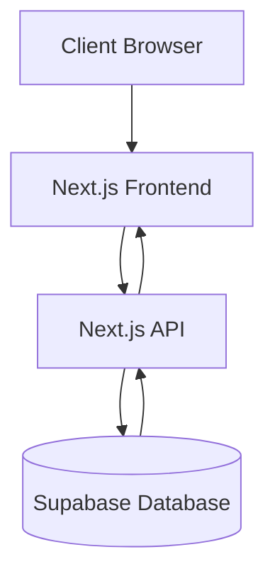
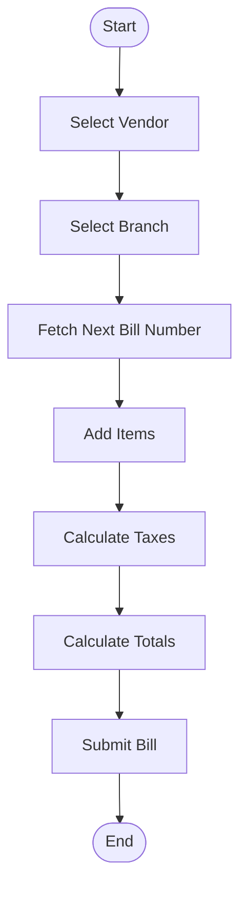
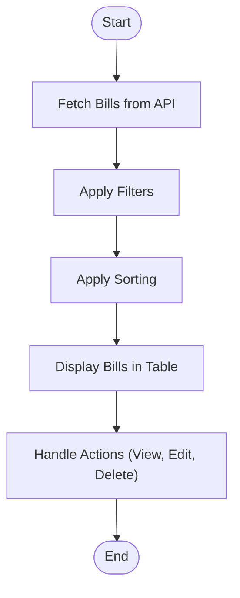
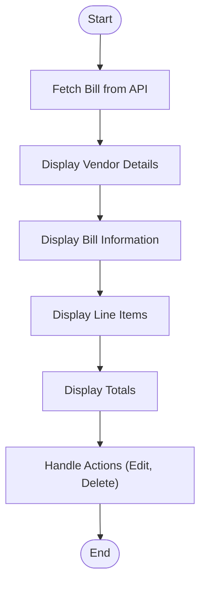
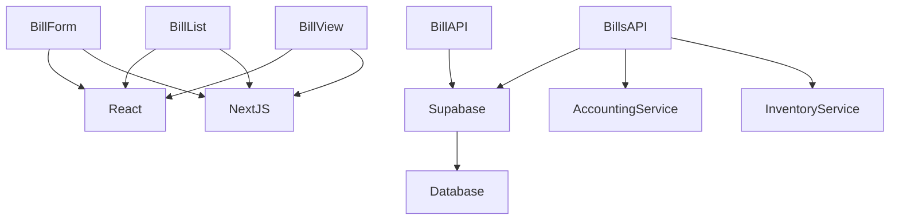

# Bills

<cite>
**Referenced Files in This Document**   
- [BillForm.js](file://src/components/purchase/BillForm.js)
- [BillList.js](file://src/components/purchase/BillList.js)
- [BillView.js](file://src/components/purchase/BillView.js)
- [bills.js](file://src/pages/purchase/bills.js)
- [new.js](file://src/pages/purchase/bills/new.js)
- [index.js](file://src/pages/api/purchase/bills/index.js)
- [[id].js](file://src/pages/api/purchase/bills/[id].js)
- [supabase.js](file://src/services/utils/supabase.js)
- [payables.js](file://src/pages/purchase/payables.js)
</cite>

## Table of Contents
1. [Introduction](#introduction)
2. [Project Structure](#project-structure)
3. [Core Components](#core-components)
4. [Architecture Overview](#architecture-overview)
5. [Detailed Component Analysis](#detailed-component-analysis)
6. [Dependency Analysis](#dependency-analysis)
7. [Performance Considerations](#performance-considerations)
8. [Troubleshooting Guide](#troubleshooting-guide)
9. [Conclusion](#conclusion)

## Introduction
The Bills sub-feature in ezbillify-v1 provides a comprehensive solution for managing vendor bill processing, including creation, editing, and approval workflows. This documentation details the implementation of vendor bill processing, focusing on the data model with fields like total_amount, tax components (CGST, SGST, IGST), and linkage to purchase orders and GRNs. The system ensures bills are validated against received quantities and accurately impact payable balances. The integration between bills and accounting entries is automated, with journal entries created upon bill creation. The documentation also addresses common issues such as tax calculation discrepancies, mismatched bill amounts vs PO/GRN, and duplicate bill entries, providing guidance on reconciliation best practices and performance optimization for processing large volumes of bills.

## Project Structure
The Bills sub-feature is organized within the ezbillify-v1 project structure under the `src/components/purchase/` and `src/pages/purchase/bills/` directories. The core components include `BillForm.js`, `BillList.js`, and `BillView.js` for the user interface, while the API endpoints are located in `src/pages/api/purchase/bills/`. The data model and business logic are implemented in the API handlers, with integration to the Supabase database through the `supabase.js` service. The system supports branch-based document numbering and financial year-based sequence management, ensuring unique bill numbers across different branches and financial years.

```mermaid
graph TB
subgraph "Frontend"
BillList[BillList.js]
BillForm[BillForm.js]
BillView[BillView.js]
end
subgraph "API Endpoints"
BillsAPI[index.js]
BillAPI[[id].js]
end
subgraph "Database & Services"
Supabase[supabase.js]
Database[(Supabase Database)]
end
BillList --> BillsAPI
BillForm --> BillsAPI
BillView --> BillAPI
BillsAPI --> Supabase
BillAPI --> Supabase
Supabase --> Database
```

**Diagram sources**
- [BillList.js](file://src/components/purchase/BillList.js)
- [BillForm.js](file://src/components/purchase/BillForm.js)
- [BillView.js](file://src/components/purchase/BillView.js)
- [index.js](file://src/pages/api/purchase/bills/index.js)
- [[id].js](file://src/pages/api/purchase/bills/[id].js)
- [supabase.js](file://src/services/utils/supabase.js)

**Section sources**
- [BillList.js](file://src/components/purchase/BillList.js)
- [BillForm.js](file://src/components/purchase/BillForm.js)
- [BillView.js](file://src/components/purchase/BillView.js)
- [bills.js](file://src/pages/purchase/bills.js)
- [new.js](file://src/pages/purchase/bills/new.js)
- [index.js](file://src/pages/api/purchase/bills/index.js)
- [[id].js](file://src/pages/api/purchase/bills/[id].js)
- [supabase.js](file://src/services/utils/supabase.js)

## Core Components
The core components of the Bills sub-feature include the `BillForm.js`, `BillList.js`, and `BillView.js` files, which handle the creation, listing, and viewing of bills respectively. The `BillForm.js` component manages the bill creation and editing process, including vendor selection, item addition, and tax calculation. The `BillList.js` component provides a paginated list of bills with filtering and sorting capabilities. The `BillView.js` component displays detailed information about a specific bill, including line items, totals, and actions for editing and deletion.

**Section sources**
- [BillForm.js](file://src/components/purchase/BillForm.js)
- [BillList.js](file://src/components/purchase/BillList.js)
- [BillView.js](file://src/components/purchase/BillView.js)

## Architecture Overview
The architecture of the Bills sub-feature follows a client-server model with a React frontend and a Next.js API backend. The frontend components communicate with the API endpoints to perform CRUD operations on bills. The API endpoints interact with the Supabase database to persist data and enforce business rules. The system uses a document-based approach for bills, with each bill represented as a document in the `purchase_documents` table, and line items stored in the `purchase_document_items` table. The architecture supports branch-based document numbering and financial year-based sequence management.



**Diagram sources**
- [BillForm.js](file://src/components/purchase/BillForm.js)
- [BillList.js](file://src/components/purchase/BillList.js)
- [BillView.js](file://src/components/purchase/BillView.js)
- [index.js](file://src/pages/api/purchase/bills/index.js)
- [[id].js](file://src/pages/api/purchase/bills/[id].js)
- [supabase.js](file://src/services/utils/supabase.js)

## Detailed Component Analysis

### BillForm Analysis
The `BillForm.js` component is responsible for creating and editing bills. It includes functionality for vendor selection, item addition, and tax calculation. The form supports creating bills from purchase orders, automatically populating items from the selected PO. The component handles branch-based document numbering, fetching the next bill number based on the selected branch and financial year. Tax calculations are performed based on the GST type (intrastate or interstate), with CGST and SGST rates calculated as half of the tax rate for intrastate transactions, and IGST rate set to the full tax rate for interstate transactions.



**Diagram sources**
- [BillForm.js](file://src/components/purchase/BillForm.js)

### BillList Analysis
The `BillList.js` component displays a paginated list of bills with filtering and sorting capabilities. Users can filter bills by search term, date range, and other criteria. The component supports sorting by bill number, date, vendor, and amount. Each bill in the list includes actions for viewing, editing, and deleting. The component fetches bills from the API endpoint with pagination parameters and displays the results in a table format.



**Diagram sources**
- [BillList.js](file://src/components/purchase/BillList.js)

### BillView Analysis
The `BillView.js` component displays detailed information about a specific bill. It includes sections for vendor details, bill information, line items, and totals. The component provides actions for editing and deleting the bill. The line items are displayed in a table format with columns for item name, quantity, rate, discount, taxable amount, tax, and total amount. The totals section shows the subtotal, discount, tax amounts, and grand total.



**Diagram sources**
- [BillView.js](file://src/components/purchase/BillView.js)

## Dependency Analysis
The Bills sub-feature has dependencies on several other components and services within the ezbillify-v1 application. The frontend components depend on the Next.js framework and React for rendering. The API endpoints depend on the Supabase database for data persistence and business rule enforcement. The system also depends on the `supabase.js` service for database interactions. The Bills sub-feature is integrated with the accounting system, with journal entries created upon bill creation. The system also integrates with the inventory management system, updating stock levels and purchase prices when bills are created.



**Diagram sources**
- [BillForm.js](file://src/components/purchase/BillForm.js)
- [BillList.js](file://src/components/purchase/BillList.js)
- [BillView.js](file://src/components/purchase/BillView.js)
- [index.js](file://src/pages/api/purchase/bills/index.js)
- [[id].js](file://src/pages/api/purchase/bills/[id].js)
- [supabase.js](file://src/services/utils/supabase.js)

## Performance Considerations
The Bills sub-feature is designed to handle large volumes of bills efficiently. The API endpoints use pagination to limit the number of records returned in a single request. The frontend components use client-side state management to minimize API calls. The system supports filtering and sorting on the server side to reduce the amount of data transferred. The database is optimized with indexes on commonly queried fields such as company_id, document_date, and vendor_id. The system also uses caching for frequently accessed data such as vendor and item lists.

## Troubleshooting Guide
Common issues with the Bills sub-feature include tax calculation discrepancies, mismatched bill amounts vs PO/GRN, and duplicate bill entries. Tax calculation discrepancies can occur when the GST type is not correctly determined based on the vendor and company states. Mismatched bill amounts vs PO/GRN can occur when the quantities or rates in the bill do not match those in the PO or GRN. Duplicate bill entries can occur when the document numbering system fails to generate unique numbers. To resolve these issues, ensure that the vendor and company states are correctly set, verify that the bill amounts match the PO/GRN, and check the document numbering configuration.

**Section sources**
- [BillForm.js](file://src/components/purchase/BillForm.js)
- [index.js](file://src/pages/api/purchase/bills/index.js)

## Conclusion
The Bills sub-feature in ezbillify-v1 provides a robust solution for managing vendor bill processing. The system supports creation, editing, and approval workflows, with integration to purchase orders, GRNs, and the accounting system. The data model includes fields for total_amount, tax components (CGST, SGST, IGST), and linkage to purchase orders and GRNs. The system ensures bills are validated against received quantities and accurately impact payable balances. The integration between bills and accounting entries is automated, with journal entries created upon bill creation. The documentation provides guidance on common issues and best practices for reconciliation and performance optimization.