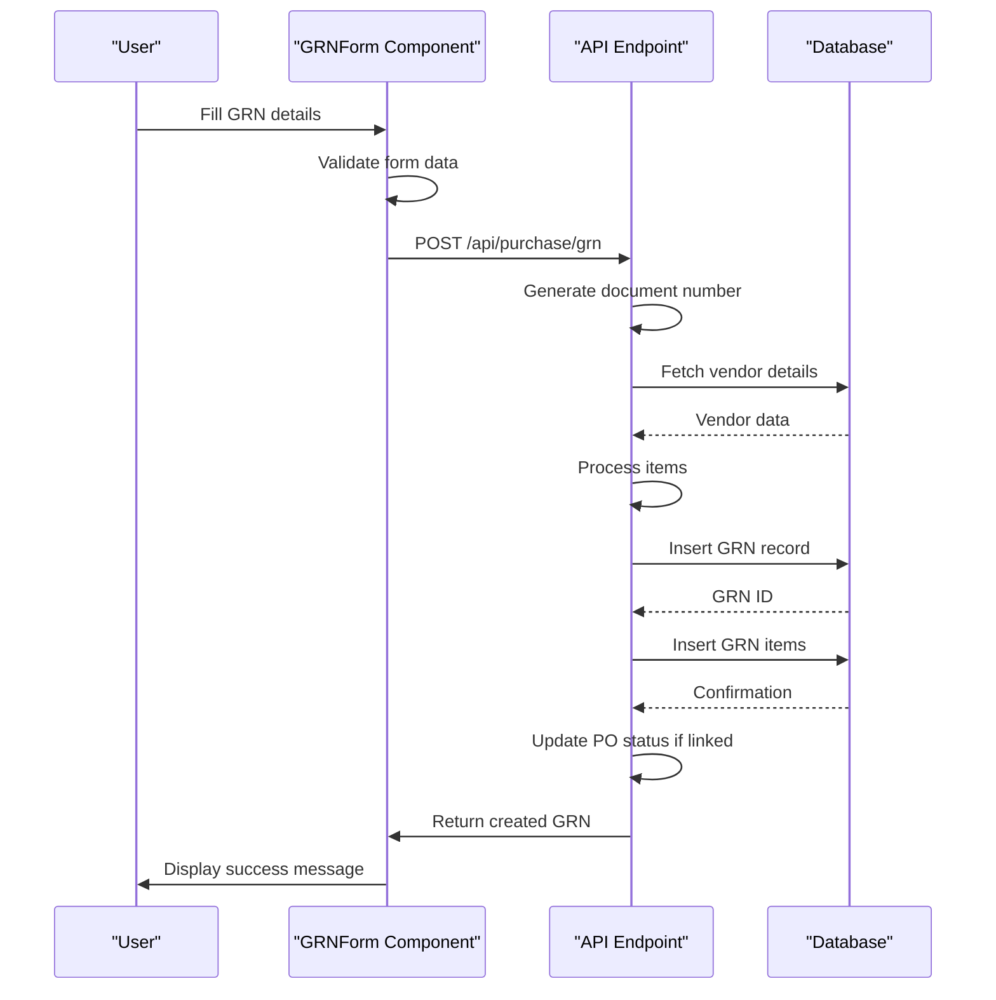
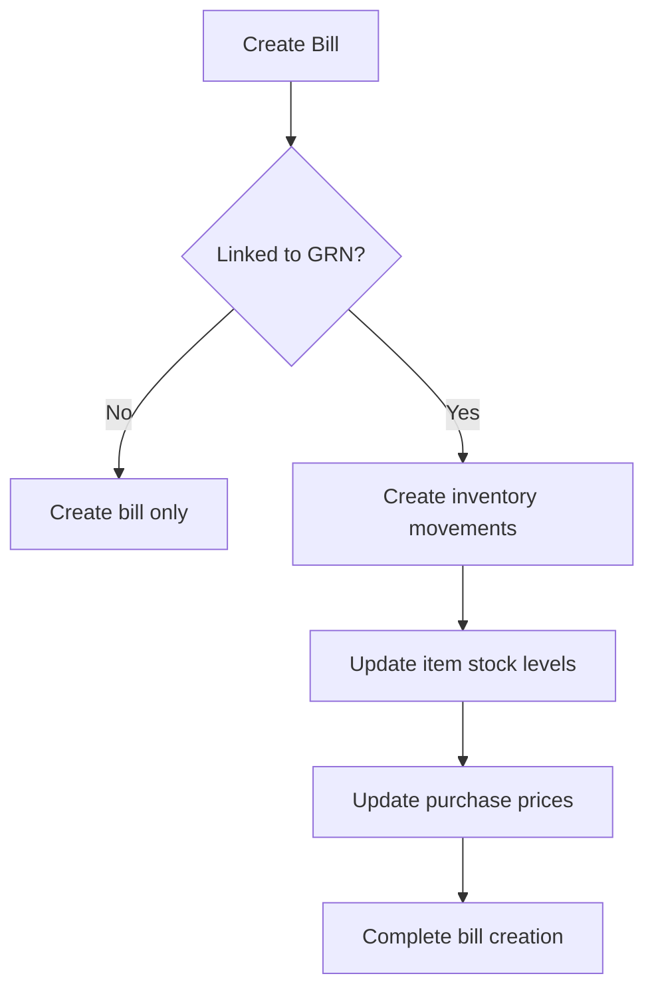

# Goods Receipt Notes (GRN)

<cite>
**Referenced Files in This Document**   
- [GRNForm.js](file://src/components/purchase/GRNForm.js)
- [index.js](file://src/pages/api/purchase/grn/index.js)
- [purchase-orders/index.js](file://src/pages/api/purchase/purchase-orders/index.js)
- [bills/index.js](file://src/pages/api/purchase/bills/index.js)
- [itemService.js](file://src/services/itemService.js)
- [StockIn.js](file://src/components/items/StockIn.js)
</cite>

## Table of Contents
1. [Introduction](#introduction)
2. [GRN Creation Process](#grn-creation-process)
3. [Data Flow from GRNForm to API](#data-flow-from-grnform-to-api)
4. [Three-Way Matching Logic](#three-way-matching-logic)
5. [Purchase Order Status Management](#purchase-order-status-management)
6. [Inventory Updates](#inventory-updates)
7. [Common Issues and Troubleshooting](#common-issues-and-troubleshooting)
8. [Performance Tips for Batch Processing](#performance-tips-for-batch-processing)
9. [Conclusion](#conclusion)

## Introduction
The Goods Receipt Note (GRN) feature in ezbillify-v1 enables businesses to document the receipt of goods from vendors, creating a critical link between purchase orders, inventory management, and accounts payable. This document provides a comprehensive analysis of the GRN implementation, focusing on the creation process, linkage to purchase orders, inventory updates, and the three-way matching logic that ensures financial accuracy. The system supports partial receipts, handles various edge cases, and maintains data integrity across the procurement workflow.

## GRN Creation Process
The GRN creation process begins with the GRNForm component, which provides a user interface for capturing receipt details. Users can create a GRN either independently or by linking it to an existing purchase order. When creating a GRN from a purchase order, the system automatically populates the items from the PO with their ordered quantities, which can then be adjusted to reflect the actual received quantities.

The GRNForm component manages several key pieces of information:
- Vendor selection and details
- Purchase order linkage (optional)
- Receipt details including date, delivery note number, transporter information, and vehicle number
- Item-level received quantities
- Additional notes

The form supports both manual item entry and automatic population from linked purchase orders, providing flexibility for different business scenarios. The component also handles branch-based document numbering, ensuring that GRNs are properly sequenced within each branch.

**Section sources**
- [GRNForm.js](file://src/components/purchase/GRNForm.js#L27-L996)

## Data Flow from GRNForm to API
The data flow from the GRNForm to the API endpoint follows a structured process that ensures data integrity and proper document numbering. When a user submits a GRN, the form data is validated and then sent to the API endpoint via a POST request.

The API endpoint at `/api/purchase/grn` handles the creation of new GRNs. The process involves several key steps:

1. **Document Number Generation**: The system generates a unique document number based on the company's document numbering configuration. This includes branch-specific prefixes and sequential numbering that resets annually.

2. **Vendor Details Retrieval**: The system fetches vendor details to ensure the vendor exists and is active.

3. **Item Processing**: The received items are processed, with received quantities being validated and stored.

4. **GRN Creation**: The GRN record is created in the database with all relevant details.

5. **Item Association**: The received items are associated with the GRN in the database.

6. **PO Status Update**: If the GRN is linked to a purchase order, the PO status is updated based on the receipt quantities.

7. **Response Generation**: A complete GRN record is returned to the client.

The API ensures atomic operations and proper error handling, rolling back changes if any step fails to maintain data consistency.



**Diagram sources **
- [GRNForm.js](file://src/components/purchase/GRNForm.js#L444-L490)
- [index.js](file://src/pages/api/purchase/grn/index.js#L113-L453)

**Section sources**
- [GRNForm.js](file://src/components/purchase/GRNForm.js#L444-L490)
- [index.js](file://src/pages/api/purchase/grn/index.js#L113-L453)

## Three-Way Matching Logic
The three-way matching logic in ezbillify-v1 ensures that purchase orders, goods receipt notes, and vendor bills are properly reconciled. This process verifies that the quantities and prices on all three documents match, preventing overpayment and ensuring that only received goods are paid for.

The matching logic works as follows:
1. **PO to GRN Matching**: When a GRN is created from a PO, the system ensures that the received quantities do not exceed the ordered quantities. The GRN captures the actual quantities received, which may be less than or equal to the ordered quantities.

2. **GRN to Bill Matching**: When creating a bill, the system allows linking to a GRN, ensuring that the billed quantities do not exceed the received quantities. This prevents vendors from billing for goods that were not received.

3. **Price Verification**: The system compares the prices on the PO, GRN, and bill to identify any discrepancies. While prices can vary between PO and bill (due to negotiated discounts or price changes), significant discrepancies trigger alerts.

The implementation ensures that financial transactions are based on actual goods received, maintaining accurate inventory and accounts payable records.

**Section sources**
- [GRNForm.js](file://src/components/purchase/GRNForm.js#L267-L279)
- [index.js](file://src/pages/api/purchase/grn/index.js#L396-L433)
- [bills/index.js](file://src/pages/api/purchase/bills/index.js#L449-L502)

## Purchase Order Status Management
The system automatically manages purchase order statuses based on goods receipt activities. When a GRN is created and linked to a purchase order, the PO status is updated to reflect the current receipt status.

The status update logic is implemented in the GRN creation API and works as follows:

1. **Calculate Total Ordered Quantity**: Sum the quantities of all items in the purchase order.

2. **Calculate Total Received Quantity**: Sum the received quantities from all GRNs linked to the purchase order.

3. **Determine New Status**:
   - If total received quantity is zero: Status remains "pending"
   - If total received quantity is greater than zero but less than total ordered: Status becomes "partially_received"
   - If total received quantity equals or exceeds total ordered: Status becomes "received"

This automated status management provides real-time visibility into the procurement process, allowing users to quickly identify which POs are pending, partially fulfilled, or complete.

```mermaid
flowchart TD
A[Create GRN] --> B{Linked to PO?}
B --> |No| C[Complete GRN creation]
B --> |Yes| D[Calculate total ordered quantity]
D --> E[Calculate total received quantity]
E --> F{Total received >= Total ordered?}
F --> |Yes| G[Set PO status to "received"]
F --> |No| H{Total received > 0?}
H --> |Yes| I[Set PO status to "partially_received"]
H --> |No| J[Keep PO status as "pending"]
G --> K[Complete GRN creation]
I --> K
J --> K
```

**Diagram sources **
- [index.js](file://src/pages/api/purchase/grn/index.js#L396-L433)

**Section sources**
- [index.js](file://src/pages/api/purchase/grn/index.js#L396-L433)

## Inventory Updates
The GRN system triggers inventory updates when goods are received, ensuring that stock levels are accurately reflected in the system. However, unlike the bill creation process, the GRN creation does not directly update inventory levels. Instead, inventory updates occur when a bill is created and linked to a GRN.

When a bill is created and linked to a GRN:
1. Inventory movements are created for each item in the bill
2. The current stock level is updated based on the received quantities
3. The purchase price of items is updated to reflect the actual purchase cost

This approach ensures that inventory is only updated when there is a financial commitment (the bill), preventing inventory inflation from goods that may be returned or rejected during quality inspection.

The inventory update process is implemented in the bill creation API, which creates inventory movement records and updates item stock levels in the database.



**Diagram sources **
- [bills/index.js](file://src/pages/api/purchase/bills/index.js#L449-L502)

**Section sources**
- [bills/index.js](file://src/pages/api/purchase/bills/index.js#L449-L502)
- [itemService.js](file://src/services/itemService.js#L283-L360)

## Common Issues and Troubleshooting
Several common issues can arise when working with GRNs, and the system includes mechanisms to handle these scenarios:

### Mismatched Quantities
When the received quantities differ from ordered quantities, the system allows partial receipts. Users can enter the actual received quantities, and the system will update the PO status accordingly. If received quantities exceed ordered quantities, the system should validate this and potentially require approval, though this specific validation is not evident in the current code.

### Duplicate GRN Entries
The system prevents duplicate GRN creation through unique document numbering and database constraints. Each GRN has a unique document number generated by the system, and attempts to create duplicate GRNs will result in validation errors.

### Inventory Sync Failures
Inventory synchronization occurs when bills are created, not when GRNs are created. If inventory updates fail during bill creation, the system should roll back the transaction to maintain data consistency. The bill creation API includes error handling that deletes the bill if inventory updates fail.

### Troubleshooting Steps
1. **GRN not updating PO status**: Verify that the GRN is properly linked to the PO and that the API call to update the PO status is successful.
2. **Inventory not updating**: Ensure that a bill has been created and linked to the GRN, as inventory updates occur at bill creation, not GRN creation.
3. **Document numbering issues**: Check the document sequence configuration in the settings to ensure proper numbering is set up for the branch and document type.
4. **Validation errors**: Review the form validation rules and ensure all required fields are properly filled.

**Section sources**
- [GRNForm.js](file://src/components/purchase/GRNForm.js#L424-L442)
- [index.js](file://src/pages/api/purchase/grn/index.js#L134-L135)
- [bills/index.js](file://src/pages/api/purchase/bills/index.js#L435-L445)

## Performance Tips for Batch Processing
For high-volume environments where multiple GRNs need to be processed, consider the following performance tips:

1. **Batch API Calls**: When processing multiple GRNs, batch the API calls to reduce network overhead. The system supports individual GRN creation, but batching requests can improve performance.

2. **Optimize Database Queries**: The current implementation makes multiple database queries for each GRN creation. Consider optimizing these queries or using bulk operations where possible.

3. **Asynchronous Processing**: For very high volumes, consider implementing asynchronous processing where GRN creation requests are queued and processed in the background, providing immediate feedback to users while processing completes.

4. **Caching**: Implement caching for frequently accessed data such as vendor details, item information, and document sequences to reduce database load.

5. **Indexing**: Ensure proper database indexing on key fields used in queries, such as company_id, branch_id, document_type, and parent_document_id.

6. **Connection Pooling**: Use database connection pooling to reduce the overhead of establishing database connections for each request.

These optimizations can significantly improve performance in high-volume environments, ensuring the system remains responsive even under heavy load.

**Section sources**
- [index.js](file://src/pages/api/purchase/grn/index.js#L113-L453)
- [itemService.js](file://src/services/itemService.js#L360-L412)

## Conclusion
The Goods Receipt Notes feature in ezbillify-v1 provides a robust solution for managing goods receipt processes, with strong integration between purchase orders, inventory management, and accounts payable. The system's three-way matching logic ensures financial accuracy by reconciling purchase orders, GRNs, and bills. Automated PO status updates provide real-time visibility into procurement status, while the separation of GRN creation and inventory updates allows for flexible business processes. The implementation handles common scenarios such as partial receipts and includes mechanisms to prevent data inconsistencies. For high-volume environments, performance can be further optimized through batching, caching, and asynchronous processing.