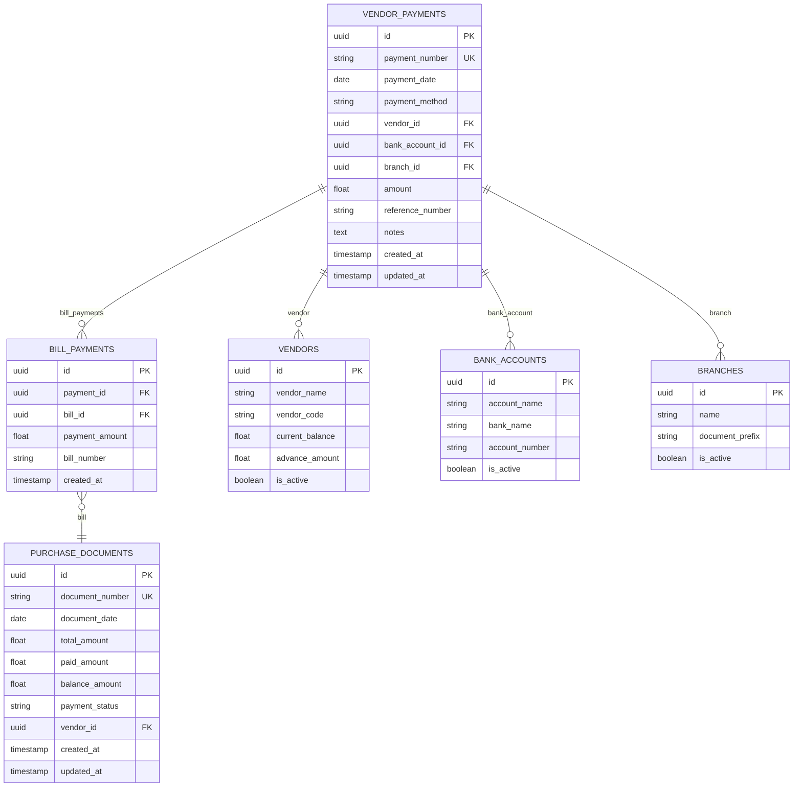
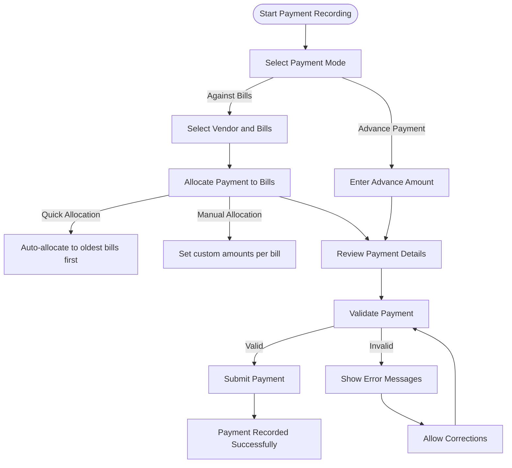
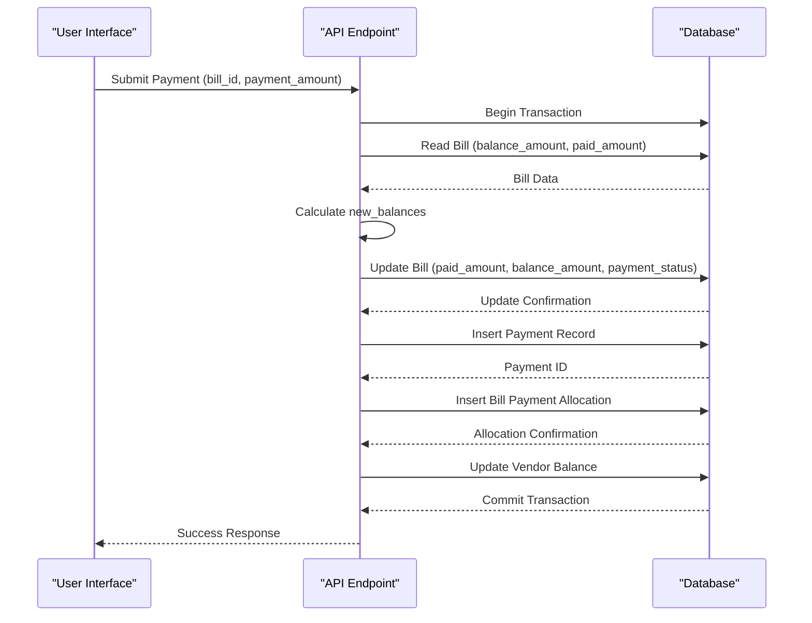
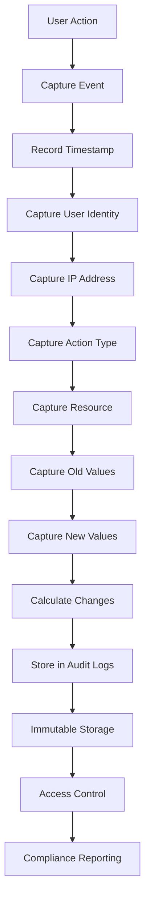

# Payments Made

<cite>
**Referenced Files in This Document**   
- [PaymentMadeForm.js](file://src/components/purchase/PaymentMadeForm.js)
- [new.js](file://src/pages/purchase/payments-made/new.js)
- [index.js](file://src/pages/api/purchase/payments-made/index.js)
- [accountingService.js](file://src/services/accountingService.js)
- [AuditTrail.js](file://src/components/others/AuditTrail.js)
- [vendor_payments](file://database/schema/vendor_payments.sql)
- [purchase_documents](file://database/schema/purchase_documents.sql)
</cite>

## Table of Contents
1. [Introduction](#introduction)
2. [Data Model](#data-model)
3. [Payment Recording Implementation](#payment-recording-implementation)
4. [Real-time Balance Updates](#real-time-balance-updates)
5. [Bank Reconciliation Integration](#bank-reconciliation-integration)
6. [General Ledger Entries](#general-ledger-entries)
7. [Common Issues and Troubleshooting](#common-issues-and-troubleshooting)
8. [Audit Trail Maintenance](#audit-trail-maintenance)
9. [Bulk Payment Processing](#bulk-payment-processing)
10. [Best Practices](#best-practices)

## Introduction
The Payments Made sub-feature in ezbillify-v1 enables businesses to record payments to vendors through multiple payment methods while supporting both full and partial payments against bills. This comprehensive system integrates with accounting workflows, bank reconciliation, and general ledger entries to maintain accurate financial records. The implementation supports various payment methods including cash, bank transfer, cheque, UPI, and card payments, with the ability to allocate payments to specific bills or record them as advances against future purchases.

**Section sources**
- [PaymentMadeForm.js](file://src/components/purchase/PaymentMadeForm.js#L1-L1049)
- [new.js](file://src/pages/purchase/payments-made/new.js#L1-L50)

## Data Model
The Payments Made feature utilizes a robust data model with key entities and relationships that ensure accurate tracking of financial transactions. The primary data structure revolves around the vendor_payments table, which captures essential payment details and establishes relationships with vendors, bank accounts, and purchase documents.

### Core Fields
The payment data model includes the following key fields:

- **payment_mode**: Specifies whether the payment is "against_bills" or "advance"
- **reference_number**: Tracks external transaction identifiers (e.g., cheque number, UPI transaction ID)
- **payment_number**: System-generated unique identifier with branch-based numbering
- **payment_date**: Date when the payment was made
- **payment_method**: Enum with values: cash, bank_transfer, cheque, upi, card, other
- **amount**: Total payment amount
- **notes**: Additional information about the payment

### Entity Relationships
The data model establishes critical relationships between entities:

- **Vendor Relationship**: Each payment is linked to a vendor through vendor_id, maintaining vendor-specific transaction history
- **Bank Account Integration**: Payments are associated with specific bank accounts via bank_account_id for reconciliation purposes
- **Bill Allocation**: The bill_payments junction table connects payments to specific purchase documents, enabling partial payments and allocation tracking
- **Branch Context**: Payments are associated with branches through branch_id, supporting multi-branch operations with independent document numbering



**Diagram sources**
- [vendor_payments](file://database/schema/vendor_payments.sql)
- [purchase_documents](file://database/schema/purchase_documents.sql)

**Section sources**
- [index.js](file://src/pages/api/purchase/payments-made/index.js#L1-L430)
- [PaymentMadeForm.js](file://src/components/purchase/PaymentMadeForm.js#L1-L1049)

## Payment Recording Implementation
The implementation of the Payments Made feature provides a comprehensive interface for recording payments with support for multiple payment methods and flexible allocation options.

### PaymentMadeForm Component
The PaymentMadeForm component serves as the primary interface for recording payments, offering two distinct modes of operation:

- **Against Bills Mode**: Allows allocation of payments to specific vendor bills, supporting partial payments and automatic distribution based on due dates
- **Advance Payment Mode**: Records payments as advances against future purchases, which can be applied to bills when they are created

The form captures essential transaction details including:
- Vendor selection with search functionality
- Payment date and method
- Bank account selection for non-cash payments
- Reference number for reconciliation
- Notes for additional context



**Diagram sources**
- [PaymentMadeForm.js](file://src/components/purchase/purchase/PaymentMadeForm.js#L1-L1049)

**Section sources**
- [PaymentMadeForm.js](file://src/components/purchase/PaymentMadeForm.js#L1-L1049)
- [new.js](file://src/pages/purchase/payments-made/new.js#L1-L50)

## Real-time Balance Updates
The system implements real-time balance updates to ensure accurate financial tracking across multiple dimensions.

### Bill Balance Management
When a payment is applied to a bill, the system automatically updates the bill's financial status:

- **Paid Amount**: Incremented by the allocated payment amount
- **Balance Amount**: Reduced by the payment amount
- **Payment Status**: Updated based on the remaining balance:
  - "paid" when balance reaches zero
  - "partially_paid" when partial payment is made
  - "unpaid" when no payment has been made

The backend processes these updates transactionally to maintain data integrity:



### Vendor Balance Tracking
The system maintains two types of vendor balances:

- **Current Balance**: Represents the total outstanding amount owed to the vendor across all unpaid bills
- **Advance Amount**: Tracks prepayments made to the vendor that can be applied against future bills

When recording payments:
- Payments against bills reduce the vendor's current balance
- Advance payments increase the vendor's advance amount
- When an advance is applied to a bill, the advance amount is reduced and the bill balance is adjusted accordingly

**Diagram sources**
- [index.js](file://src/pages/api/purchase/payments-made/index.js#L1-L430)

**Section sources**
- [index.js](file://src/pages/api/purchase/payments-made/index.js#L1-L430)
- [PaymentMadeForm.js](file://src/components/purchase/PaymentMadeForm.js#L1-L1049)

## Bank Reconciliation Integration
The Payments Made feature integrates seamlessly with the bank reconciliation process, ensuring accurate matching of system records with bank statements.

### Bank Account Linkage
Each payment can be linked to a specific bank account, which enables:

- Automatic categorization of bank transactions
- Simplified reconciliation by matching payment records with bank statement entries
- Accurate tracking of cash flow through specific bank accounts

The integration supports multiple payment methods that affect bank accounts differently:

- **Bank Transfer**: Directly impacts the linked bank account balance
- **Cheque**: Creates a pending transaction until cleared by the bank
- **UPI**: Immediate deduction from the linked account
- **Card**: May have a processing delay before reflecting in bank statements

### Reconciliation Workflow
The system supports a streamlined reconciliation workflow:

1. Export payment records to match with bank statements
2. Flag payments that have cleared vs. pending
3. Identify discrepancies for investigation
4. Adjust records as needed based on bank confirmation

The accountingService provides methods to retrieve bank reconciliation data, enabling comparison between system records and bank statements.

**Section sources**
- [accountingService.js](file://src/services/accountingService.js#L1-L301)
- [index.js](file://src/pages/api/purchase/payments-made/index.js#L1-L430)

## General Ledger Entries
The Payments Made feature automatically generates appropriate general ledger entries to maintain double-entry accounting principles.

### Accounting Treatment
The system creates journal entries based on the payment type:

- **Payments Against Bills**: Debit Accounts Payable, Credit Bank/Cash Account
- **Advance Payments**: Debit Prepaid Expenses (or Advance to Vendors), Credit Bank/Cash Account
- **Application of Advances**: Debit Accounts Payable, Credit Prepaid Expenses

The accountingService handles the creation of these entries through its journal entry management functions, ensuring that all payments are properly reflected in the financial statements.

### Ledger Integration
When a payment is recorded, the system updates relevant ledger accounts:

- **Accounts Payable Ledger**: Reduced by the payment amount when applied to bills
- **Bank Ledger**: Reduced by the payment amount for non-cash payments
- **Cash Ledger**: Reduced by the payment amount for cash payments
- **Advance Ledger**: Increased for advance payments, decreased when advances are applied

The integration ensures that the trial balance remains accurate and that financial reports reflect the current financial position.

```mermaid
classDiagram
class AccountingService {
+createJournalEntry(companyId, entryData)
+getJournalEntries(companyId, filters)
+getTrialBalance(companyId, asOfDate)
+getBalanceSheet(companyId, asOfDate)
+getProfitLoss(companyId, fromDate, toDate)
+getCashFlowStatement(companyId, fromDate, toDate)
+getAccountLedger(accountId, fromDate, toDate)
+getBankReconciliation(bankAccountId, statementDate)
}
class JournalEntry {
+entry_number
+entry_date
+narration
+total_debit
+total_credit
+status
}
class JournalEntryItem {
+account_id
+debit_amount
+credit_amount
+description
}
AccountingService --> JournalEntry : "Creates"
JournalEntry --> JournalEntryItem : "Contains"
AccountingService --> "Account Ledger" : "Retrieves"
AccountingService --> "Bank Reconciliation" : "Retrieves"
```

**Diagram sources**
- [accountingService.js](file://src/services/accountingService.js#L1-L301)

**Section sources**
- [accountingService.js](file://src/services/accountingService.js#L1-L301)
- [index.js](file://src/pages/api/purchase/payments-made/index.js#L1-L430)

## Common Issues and Troubleshooting
The Payments Made feature may encounter several common issues that require specific troubleshooting approaches.

### Payment Reconciliation Errors
Reconciliation errors typically occur when there's a mismatch between system records and bank statements. Common causes include:

- Incorrect payment amounts recorded
- Wrong bank account selected
- Duplicate payment entries
- Timing differences between system recording and bank processing

**Troubleshooting Steps:**
1. Verify the payment details against source documents
2. Check for duplicate entries with similar amounts and dates
3. Confirm the correct bank account was selected
4. Investigate timing differences for electronic payments
5. Review audit trail for any modifications to the payment record

### Incorrect Bill Allocation
Errors in bill allocation can occur when payments are applied to the wrong bills or incorrect amounts are allocated.

**Prevention and Resolution:**
- Implement validation to prevent allocation amounts exceeding bill balances
- Provide clear visual feedback when allocating payments to multiple bills
- Enable easy correction of allocation errors before final submission
- Maintain an audit trail of allocation changes

### Payment Reversals
The system supports payment reversals through the DELETE operation on payment records. When a payment is deleted:

- Bill balances are restored to their pre-payment state
- Vendor balances are adjusted accordingly
- Any applied advances are reversed
- Bank reconciliation records are updated

The process is handled transactionally to ensure data consistency across all affected records.

**Section sources**
- [index.js](file://src/pages/api/purchase/payments-made/index.js#L1-L430)
- [PaymentMadeForm.js](file://src/components/purchase/PaymentMadeForm.js#L1-L1049)

## Audit Trail Maintenance
The system maintains a comprehensive audit trail to ensure accountability and support financial compliance.

### Audit Trail Implementation
The AuditTrail component provides a complete record of all payment-related activities, including:

- Creation of new payments
- Modifications to existing payments
- Deletion of payments
- User actions and timestamps
- IP addresses for security tracking

The audit trail captures both metadata about the action and the specific data changes:

- **Old Values**: State of the payment record before modification
- **New Values**: State of the payment record after modification
- **Changes**: Specific fields that were modified

### Security and Compliance
The audit trail supports several security and compliance features:

- **Immutable Records**: Once created, audit logs cannot be modified or deleted
- **Retention Policy**: Logs are retained for seven years to meet regulatory requirements
- **Access Controls**: Only authorized users can view audit trail information
- **Export Capability**: Audit logs can be exported for external review or compliance reporting



**Diagram sources**
- [AuditTrail.js](file://src/components/others/AuditTrail.js#L1-L631)

**Section sources**
- [AuditTrail.js](file://src/components/others/AuditTrail.js#L1-L631)
- [index.js](file://src/pages/api/purchase/payments-made/index.js#L1-L430)

## Bulk Payment Processing
The system supports efficient processing of bulk payments to streamline accounts payable operations.

### Performance Considerations
For optimal performance when processing bulk payments:

- **Batch Processing**: Group multiple payments into a single transaction to reduce database overhead
- **Index Optimization**: Ensure proper indexing on frequently queried fields like vendor_id, payment_date, and payment_status
- **Caching**: Cache frequently accessed data such as vendor information and bank account details
- **Pagination**: Implement pagination for large result sets to reduce memory usage

### Best Practices for Bulk Operations
When processing bulk payments:

1. **Validate Data Upfront**: Check all payment data for completeness and accuracy before processing
2. **Use Transactions**: Wrap bulk operations in database transactions to ensure atomicity
3. **Implement Error Handling**: Capture and log errors for individual payments without stopping the entire batch
4. **Provide Progress Feedback**: Show progress indicators for long-running bulk operations
5. **Generate Summary Reports**: Provide comprehensive reports of successful and failed payments

The API is designed to handle bulk operations efficiently, with endpoints that can process multiple payments in a single request while maintaining data integrity.

**Section sources**
- [index.js](file://src/pages/api/purchase/payments-made/index.js#L1-L430)
- [PaymentMadeForm.js](file://src/components/purchase/PaymentMadeForm.js#L1-L1049)

## Best Practices
To maximize the effectiveness of the Payments Made feature, follow these best practices:

### Data Entry Best Practices
- **Consistent Payment Methods**: Use standardized payment method codes across all entries
- **Accurate Reference Numbers**: Always record the correct reference number for reconciliation
- **Timely Recording**: Record payments promptly to maintain accurate financial records
- **Complete Documentation**: Include relevant notes and supporting document references

### Reconciliation Best Practices
- **Regular Reconciliation**: Perform bank reconciliation at least monthly
- **Immediate Investigation**: Address discrepancies as soon as they are identified
- **Document Resolution**: Record the resolution of reconciliation issues in the audit trail
- **Segregation of Duties**: Separate payment approval from payment recording functions

### System Maintenance
- **Regular Audits**: Periodically review payment patterns for anomalies
- **User Training**: Ensure all users understand proper payment recording procedures
- **Backup Procedures**: Maintain regular backups of payment data
- **Software Updates**: Keep the system updated to benefit from the latest features and security patches

By following these best practices, organizations can ensure accurate financial reporting, maintain strong internal controls, and streamline their accounts payable processes.

**Section sources**
- [PaymentMadeForm.js](file://src/components/purchase/PaymentMadeForm.js#L1-L1049)
- [index.js](file://src/pages/api/purchase/payments-made/index.js#L1-L430)
- [accountingService.js](file://src/services/accountingService.js#L1-L301)
- [AuditTrail.js](file://src/components/others/AuditTrail.js#L1-L631)